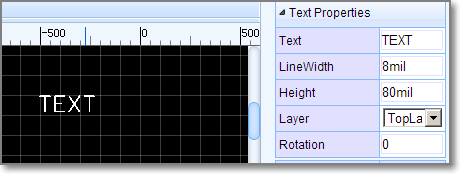
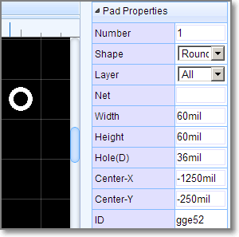
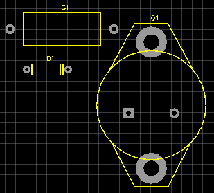

#EasyEDA PCB File Format
Note: PCB and PCB Library are used the same file format. Please check [PCB JSON File Source](./common.htm#PCBJson) out before keeping read.
 
##Head 
###Head information for PCB.  

	"head":"3~1.7.5~Author`Dillon`"

**Format:**

1. [document type](./common.htm#documentType) :`3`
2. document version: `1.7.5`
3. custom attributes: **key: value** pairs, separate with **`**, added via **Add new parameter**  
  
 

###Head information for  PCB Library
	"4~1.7.5~400~300~`pre`U?`Contributor`Dillon"

**Format:**

1. [document type](./common.htm#documentType) :`4`
2. document version: `1.7.5`
3. origin x position. **Reserved field, can't be changeded** 
4. origin y position. **Reserved field, can't be changeded** 
5. custom attributes: **key: value** pairs, separate with **`**, added via **Add new parameter**.   
  
*pre*:*U?* , when place to PCB, will be marked as U1, U2.  
*Contributor*:*Dillon* 
 
##Parameters Dimensions

EasyEDA support millimeter, inch and millimeter, but when these items are stored to a file, all of them will be expressed as 10X mil. Taking line lengths or widths for examples, stroke width equal 1, stands 10mil.
	

##Canvas 
	"CA~2400~2400~#000000~yes~#FFFFFF~10~1200~1200~line~1~mil~1~45~visible~0.5"

**Format:** 
 
1. command: CA
2. view box width: 2400(24000 mil), View Box Width / Canvas width = scaleX = 2
3. view box height: 2400(24000 mil),View Box Height / Canvas Height = scaleY = 2
4. back ground: #000000
5. grid visible: yes/none
6. grid color: #FFFFFF
7. grid size: 10(100 mil)
8. canvas width: 1200 (12000 mil)
9. canvas height: 1200 (12000 mil)
10. grid style: line/dot
11. snap size: 1 (10 mil)
12. unit: mil(inch, mil, mm)
13. routing width: 1 (10mil)
14. routing angle: 45 degree( 45 90 free)
15. copper area: visible/invisible 
16. ALT snap size: 0.5 ( 5 mil Snap Size when pressing the `ALT` Key)

Canvas setting image  

## System Color
	"#000000~#FFFFFF~#FFFFFF~#000000~#FFFFFF"

**Format:** 
 
1. future use: #000000
2. future use: #FFFFFF
3. future use: #FFFFFF
4. hole Color: #000000
5. DRC error: #FFFFFF 

## Layers config
layers is an array, each layer is an item of the layers.

	 "layers":[
		"1~TopLayer~#FF0000~true~true~true",
		"2~BottomLayer~#0000FF~true~false~true",
		"3~TopSilkLayer~#FFFF00~true~false~true",
		"4~BottomSilkLayer~#808000~true~false~true",
		"5~TopPasterLayer~#808080~false~false~false",
		"6~BottomPasterLayer~#800000~false~false~false",
		"7~TopSolderLayer~#800080~false~false~false",
		"8~BottomSolderLayer~#AA00FF~false~false~false",
		"9~Ratlines~#6464FF~true~false~true",
		"10~BoardOutline~#FF00FF~true~false~true",
		"11~Multi-Layer~#C0C0C0~true~false~true",
		"12~Document~#FFFFFF~true~false~true",
		"21~Inner1~#800000~false~false~false",
		"22~Inner2~#008000~false~false~false",
		"23~Inner3~#00FF00~false~false~false",
		"24~Inner4~#000080~false~false~false" 
	]

**Format:** 
 
1. layer id: 1
2. layer name: TopLayer
3. layer color: #FF0000
4. visible: true, hints the objects in this layer show or hide
5. active: false. active layer
6. config: true. if be set false, you can't see it on the layer toolbar.

## Preference
	"preference":{
	    "hideFootprints":"gge118~gge221~gge227~gge233",
	    "hideNets":"BSYNC~DREQ~GPIO0~MICP~GND"
	}

`hideFootprints` : when the id of the footprints in here, you can't see them on canvas.   
`hideNets` : when the net name in here, you can't see them on canvas, you can hide the ratline at here too. There are some guys would like to hide then GND ratline, then use copper area to connect all the GND pad.  

##DRC Rule

	 "DRCRULE":{
		"trackWidth":0.7,
		"track2Track":0.7,
		"pad2Pad":0.8,
		"track2Pad":0.8,
		"hole2Hole":1,
		"holeSize":1.6
	}

`trackWidth`: 0.7 (7 mil)  track width
`track2Track`: 0.7 (7 mil) track to track distance  
`pad2Pad`:   0.8(8 mil) pad to pad distance  
`track2Pad`: 0.8(8 mil) track to pad distance  
`hole2Hole`: 1(10 mil) hole to hole distance  
`holeSize`:  1.6(16 mil) hole diameter

This is a simple DRC, more later.
  
##Shapes 
The shape is an array. EasyEDA store various shape in this field, they are different with a command which locate at the begin of the string. 

	"shape":[
	    "TRACK~1~1~S$19~311 175 351 175 352 174~gge18",
	    "PAD~ELLIPSE~329~185~6~6~11~~1~1.8~~0~gge20",
	    "VIA~329~202~3.2~~0.8~gge23",
	    "COPPERAREA~2px~1~GND~349 247 492 261 457 314 339 329~1~solid~gge27~spoke~none~[]",
	    "SOLIDREGION~1~~350 146 483 146 447 228 371 220~solid~gge26"
	]

###TRACK  
	"TRACK~1~1~S$19~311 175 351 175 352 174~gge18"

**Format:**  
Check [ Polyline element of SVG](http://www.w3.org/TR/SVG11/shapes.html#PolylineElement) out.

1. command: TRACK
2. stroke Width: 1 (10 mil)
3. layer id: 1 (TopLayer)
4. net: "S$19"
5. points: 311 175 351 175 352 174
6. id : gge18
7. locked: null 
 
TRACK's attributes and image looks like bellow image:

###COPPERAREA  
	"COPPERAREA~2px~1~GND~349 247 492 261 457 314 339 329~1~solid~gge27~spoke~yes~[[\"M339,329 349,247 492,261 457,314z\"]]"

**Format:**  
 

1. command: COPPERAREA
2. stroke Width: 2 (20 mil)
3. layer id: 1 (TopLayer)
4. net: GND
5. points: 349 247 492 261 457 314 339 329
6. clearance Width : 1 (10 mil)
7. fill style: solid/none
8. id: gge27
9. thermal: spoke/direct
10. keep island: none/yes
11. copper zone: [[\"M339,329 349,247 492,261 457,314z\"]] rings and holes
12. locked: null
 
COPPERAREA's attributes and image looks like bellow image:

###RECT 
	"RECT~406~220~105~52~1~gge32"

**Format:**  

Check [ Rect element of SVG](http://www.w3.org/TR/SVG11/shapes.html#RectElement) out.

1. command: RECT
2. x: 406
3. y: 220
4. width: 105
5. height: 52
6. layer id:1
7. id: gge36
8. locked:null
Rect's attributes and image looks like bellow image:

###CIRCLE 
	"CIRCLE~363~273~42~1~3~gge33"

 
**Format:**  
Check [ Circle  element of SVG](http://www.w3.org/TR/SVG11/shapes.html#CircleElement) out.

1. command: CIRCLE
2. cx:363 (3630 mil)
3. cy:273
4. r:42 (420 mil)
5. stroke width: 1 (10mil)
6. layer id: 3 (Top silk layer)  
7. id: gge33
8. locked:null
 
CIRCLE's attributes and image looks like bellow image:

###SOLIDREGION 
	"SOLIDREGION~1~GND~322 256 376 317 447 250 353 231~solid~gge34"

 
**Format:**   

1. command: SOLIDREGION
2. layer id: 1 (Toplayer)  
3. net: GND
4. points:322 256 376 317 447 250 353 231
5. type: solid/cutout/npth
6. id: gge34
7. locked:null
 
SOLIDREGION's attributes and image looks like bellow image:

###TEXT 
	"TEXT~L~351~252~0.8~0~none~1~~8~TEXT~M 352.55 250.64 L 352.55 258.27 M 350 250.64 L 355.09 250.64 M 357.49 250.64 L 357.49 258.27 M 357.49 250.64 L 362.22 250.64 M 357.49 254.27 L 360.4 254.27 M 357.49 258.27 L 362.22 258.27 M 364.62 250.64 L 369.71 258.27 M 369.71 250.64 L 364.62 258.27 M 374.65 250.64 L 374.65 258.27 M 372.11 250.64 L 377.2 250.64~~gge35"

 
**Format:**   

1. command: TEXT
2. type: L/P (L = label, P = prefix)
3. position x: 351 (3510 mil)
4. position y: 252 (2520 mil)
5. stroke width: 0.8 (8 mil)
6. rotation: 0
7. mirror : none ( not user now)
8. layer id: 1 (Toplayer)
9. net: ''  
10. font size: 8 (80 mil in height)
11. string: TEXT
12. text path: M 352.55 250.64 L 352.55 258.27 M 350 250.64 L 355.09 250.64 M 357.49 250.64 L 357.49 258.27 M 357.49 250.64 L 362.22 250.64 M 357.49 254.27 L 360.4 254.27 M 357.49 258.27 L 362.22 258.27 M 364.62 250.64 L 369.71 258.27 M 369.71 250.64 L 364.62 258.27 M 374.65 250.64 L 374.65 258.27 M 372.11 250.64 L 377.2 250.64
13. display: '' (none = hide, other = show)
14. id: gge35
15. locked: null
 
 
TEXT's attributes and image looks like bellow image:

###Arc

	"ARC~1~1~S$51~M329,274 A26.95,26.95 0 0 1 370,309~~gge50"

**Format:**  
**Arc** is a **Path** element, Check [Path element of SVG](http://www.w3.org/TR/SVG11/paths.html#PathElement) out.

1. command: ARC
2. stroke width: 1 (10 mil)
3. layer id: 1 (Toplayer)
4. net: S$51
5. path string: M329,274 A26.95,26.95 0 0 1 370,309
6. helper dots: the four green dots, no need in PCB, keep it blank
7. id: gge19
8. locked:null

ARC's attributes and image looks like bellow image:

###PAD

	"PAD~ELLIPSE~275~275~6~6~11~~1~1.8~~0~gge52"

**Format:**   

1. command: PAD
2. shape: ELLIPSE/RECT
3. center x: 275
4. center y: 275
5. width: 6 (60 mil)
6. height: 6 (60 mil)
7. layer id: 11 (All)
8. net: ''
9. number: 1
10. hole radius: 1.8 (18 mil)
11. points: '' (ELLIPSE = '', RECT = outline points)
12. rotation: 0 [0 - 360]
13. id: gge19
14. locked:null

PAD's attributes and image looks like bellow image:

###VIA

	"VIA~432~215~3.2~~0.8~gge5"

**Format:**   

1. command: VIA
2. center x: 432
3. center y: 215
4. diameter: 3.2 
5. net : ''
6. hole radius: 0.8 (8 mil)
7. id: gge5
8. locked:null

VIA's attributes and image looks like bellow image:

###DIMENSION

	"DIMENSION~3~M 301 217 L 442 217 M 306 220 L 301 217 L 306 214 M 437 220 L 442 217 L 437 214 M 369.5 209.82 L 370.05 209.55 L 370.86 208.73 L 370.86 214.45 M 372.94 213.09 L 372.66 213.36 L 372.94 213.64 L 373.21 213.36 L 372.94 213.09 M 377.74 208.73 L 375.01 212.55 L 379.1 212.55 M 377.74 208.73 L 377.74 214.45 M 380.9 209.82 L 381.45 209.55 L 382.26 208.73 L 382.26 214.45 M 384.06 208.73 L 384.06 210.64 M 386.25 208.73 L 386.25 210.64~gge8"

**Format:**   

1. command: DIMENSION
2. layer id: 3 (Top Silk layer)
3. path: M 301 217 L 442 217 M 306 220 L 301 217 L 306 214 M 437 220 L 442 217 L 437 214 M 369.5 209.82 L 370.05 209.55 L 370.86 208.73 L 370.86 214.45 M 372.94 213.09 L 372.66 213.36 L 372.94 213.64 L 373.21 213.36 L 372.94 213.09 M 377.74 208.73 L 375.01 212.55 L 379.1 212.55 M 377.74 208.73 L 377.74 214.45 M 380.9 209.82 L 381.45 209.55 L 382.26 208.73 L 382.26 214.45 M 384.06 208.73 L 384.06 210.64 M 386.25 208.73 L 386.25 210.64
4. id: gge5
5. locked:null

DIMENSION's attributes and image looks like bellow image:
  
DIMENSION just allows to change it layer id, if you don't accept this DIMENSION, delete it and redraw again.

##PCBlib 

PCBlib is an array, EasyEDA saves all of the PCBlibs in this array.

 	"PCBlib":[
    "LIB~245~240~package`CK17-B`~~~gge15~1#@$TEXT~P~295~219.5~0.7~0~~3~~4.5~C1~M 298.07 218.07L297.86 217.66 L297.45 217.25 L297.05 217.05 L296.23 217.05 L295.82 217.25 L295.41 217.66 L295.2 218.07 L295 218.68 L295 219.7 L295.2 220.32 L295.41 220.73 L295.82 221.14 L296.23 221.34 L297.05 221.34 L297.45 221.14 L297.86 220.73 L298.07 220.32 M 299.42 217.86L299.83 217.66 L300.44 217.05 L300.44 221.34 ~~gge16#@$TRACK~0.9~3~~257.5 224.5 332.5 224.5 332.5 255.5 257.5 255.5 257.5 224.5~gge17#@$PAD~ELLIPSE~245~240~9.4~9.4~11~~1~2.25~~0~gge18#@$PAD~ELLIPSE~345~240~9.4~9.4~11~~2~2.25~~0~gge19",
    "LIB~261~279~package`DO-7`~~~gge53~1#@$TEXT~P~281~268.6~0.7~0~~3~~4.5~D1~M 281 266.15L281 270.44 M 281 266.15L282.43 266.15 L283.05 266.35 L283.45 266.76 L283.66 267.17 L283.86 267.78 L283.86 268.8 L283.66 269.42 L283.45 269.83 L283.05 270.24 L282.43 270.44 L281 270.44 M 285.21 266.96L285.62 266.76 L286.24 266.15 L286.24 270.44 ~~gge54#@$TRACK~0.9~3~~266 273.6 296 273.6 296 284.4 266 284.4 266 273.6~gge55#@$TRACK~0.9~3~~293.5 273.6 293.5 284.4~gge56#@$PAD~ELLIPSE~261~279~7.5~7.5~11~~1~1.4~~0~gge57#@$PAD~ELLIPSE~301~279~7.5~7.5~11~~2~1.4~~0~gge58",
    "LIB~403~321~package`TO-3`~~~gge80~1#@$TEXT~P~381~229.7~0.7~0~~3~~4.5~Q1~M 382.23 227.25L381.82 227.45 L381.41 227.86 L381.2 228.27 L381 228.88 L381 229.9 L381.2 230.52 L381.41 230.93 L381.82 231.34 L382.23 231.54 L383.05 231.54 L383.45 231.34 L383.86 230.93 L384.07 230.52 L384.27 229.9 L384.27 228.88 L384.07 228.27 L383.86 227.86 L383.45 227.45 L383.05 227.25 L382.23 227.25 M 382.84 230.72L384.07 231.95 M 385.62 228.06L386.03 227.86 L386.65 227.25 L386.65 231.54 ~~gge81#@$TRACK~0.9~3~~364.9 234.7 397.1 234.7~gge82#@$TRACK~0.9~3~~365 392 397.1 392~gge83#@$TRACK~0.9~3~~397.1 234.7 422 281~gge84#@$TRACK~0.9~3~~364.9 234.7 340 281~gge85#@$TRACK~0.9~3~~397.1 392 419 349~gge86#@$TRACK~0.9~3~~364.9 392 342.5 349~gge87#@$PAD~RECT~359~321~10.5~10.5~11~~1~2.25~353.75 315.75 364.25 315.75 364.25 326.25 353.75 326.25~0~gge88#@$PAD~ELLIPSE~403~321~9.5~9.5~11~~2~2.25~~0~gge89#@$PAD~ELLIPSE~381~252.5~30~30~11~~3~7.5~~0~gge90#@$PAD~ELLIPSE~381~374.2~30~30~11~~4~7.5~~0~gge91#@$CIRCLE~381~313.4~52.5~0.9~3~gge92"
	]

A PCBlib  has several shapes, join these shapes with [#@$(Octothorpe Ampersat Dollar) ](./common.htm#octothorpeAmpersatDollar)as a string like above.

1. **configure** 

<code>LIB~245~240~package\`CK17-B\`~0~~gge15~1</code>  

1. command: LIB
2. position x: 270
3. position y: 140
4. [custom attributes](common.htm#backQuote): *package\`CK17-B\`*
5. rotation: 0, can be [0 - 360 ]
6. import flag: '',  just  used in import from eagle
7. id: gge115
8. locked: null
 
2. **shapes**

	All other items are [shapes](#shapes).

PCBlibs' image looks like bellow image:  
 

 