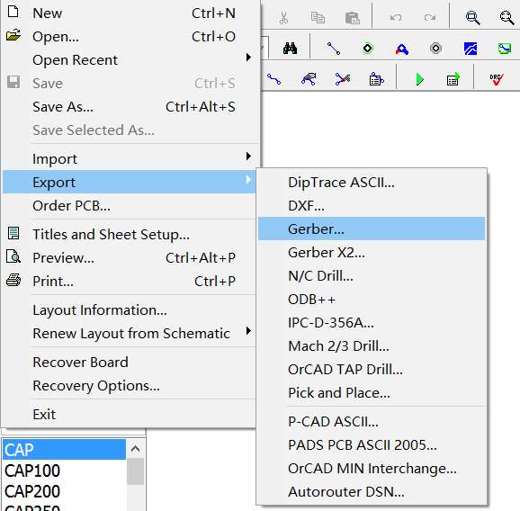
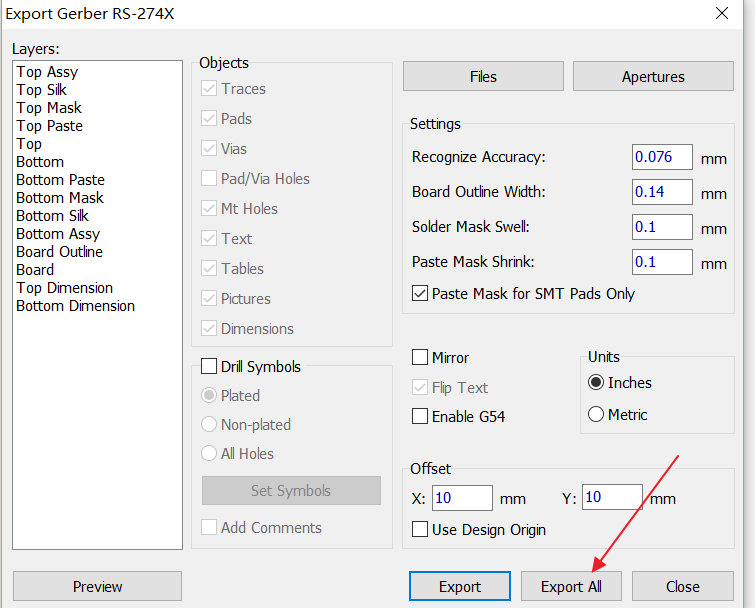
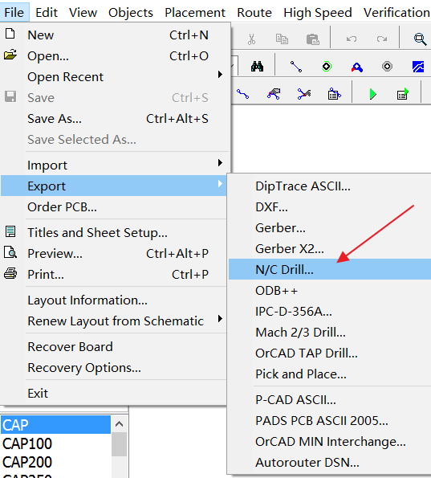

# How to export Diptrace PCB to gerber files

 
 

If you don't know how to choose, just click the Export ALL 

 

Don't forget to export the NC drill

Video

https://www.youtube.com/watch?v=tQL3wboqiZE

https://www.youtube.com/watch?v=rtn1gLe3OEI