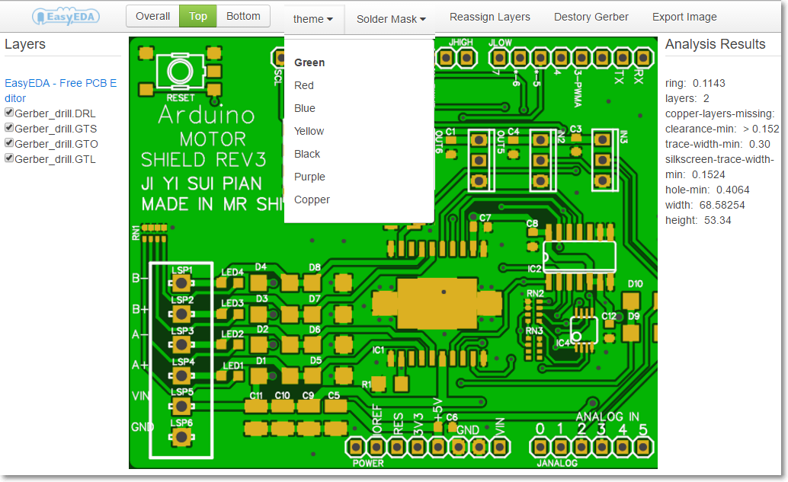
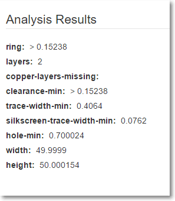
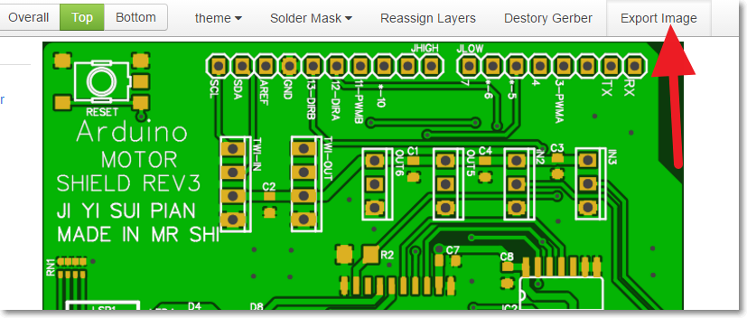
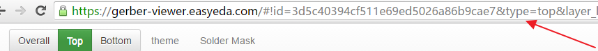
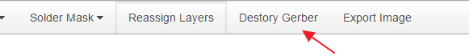
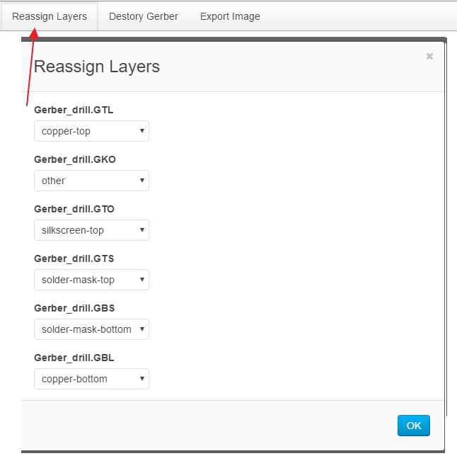
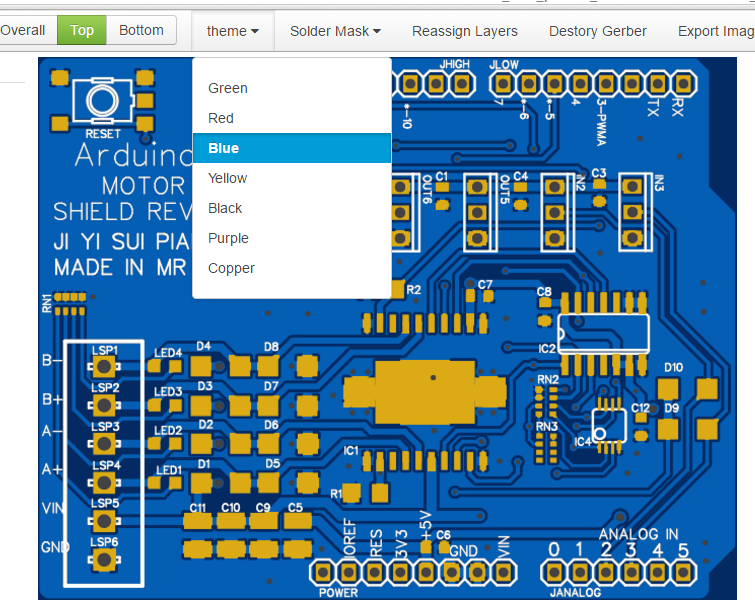
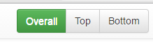
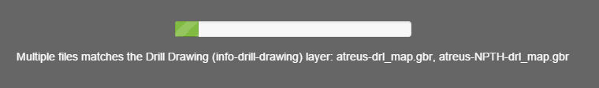

# Free online RS-274X (Gerber viewer) and Excellon  Viewer 
 
 EasyEDA **Gerber Viewer** is a viewer for Gerber RS-274X files, Excellon drill files online, 
 After you upload your gerber file, we will render it as images, and with top photo viewer and bottom photo viewer. At the same time, EasyEDA runs a simply DFM test, you can see the board size,   holes size, track size, clearance of the objects.

   

 #About Gerber Files

Gerber files are typically output by a PCB CAD tool (such as the EasyEDA, Eagle, Kicad, Altium, Pads, Diptrace's PCB), and are sent to a PCB manufacturer who uses the files for manufacturing Printed Circuit Boards (PCBs).

There are two standards defining Gerber files: An old one called RS-274D, and a newer one called RS-274X. Gerber files generated in the old format (RS-274D) lack aperture information, which must be supplied separately. The new standard (RS-274X) embeds aperture information into the file. Note: Gerbv displays RS-274X files! Make sure your gerber is RS-274X version.

#EasyEDA Gerber Viewer Featureset

1. It is free and online, no need to install any software, and can work on Windows, Mac, Linux.

2. provide simply and good enough DFM check.

3. Easy to find  your PCB parameter for [PCB order](https://easyeda.com/order).
     
  
4. Share the gerber viewer image
   You can click the export image button to get the an image link or just share the web site of your gerber link.
   

5. zoom in and out.
   Using your mouser to scroll to zoom in and out.

6. It is supper Easy. 

#EasyEDA Gerber Viewer FAQ

Q1: How can share my Gerber image with my friends?
 After you upload your gerber, you will get a url link, just need to copy the link to your friends.
 

Q2: Is my gerber safe?
  All of your gerber are unlist, if you don't share to any one, we don't share it to any one. If you are care about this, you can remove your gerber from our server.
   

Q3: Why I can't see the right photo viewer.
   If you are sure you upload a right gerber, Maybe your file names are not good, you maybe need to remap the gerbers to the gerber layers.
 

Q4: Why sometime it is slow?
If your gerber is big, EasyEDA gerber viewer need some time to analysis.
  
Q5:Why the board size is not right?
   Make sure your board outline is right. 

Q6: What gerber file names are expected?
  EasyEDA can detect the file name intelligent, if your gerber files can't be shown correct, please check Q3 and Reaasign layers.

 
Q6: How to get a blue PCB viewer.
Drop down the `Theme` menu.
 

Q7: How to change from gerber viewr, Top photo viewer and Bottom photo viewer

  There are three buttons at the top right.

Q8: How to submit a bug?
 Just email to 

Q9: What are the common errors for gerber.
Before placing an order, we must make the gerber is right.
There are some Common Errors we may happen.
1. Using the incorrect version. Want to order version B, but order in version A 
2. Without board outline.
3. Without drill file
4. without Top or bottom solder mask layer.
5. The holes are too small
6. The tracks are too small.
7. The clearance are too small. 

Q10: Why the EasyEDA gerber viewer stop.
Because EasyEDA gerber viewer integrated a DFM, so we don't allow the same gerber file name, such as two NPTH holes file, tow Top solder mask layer files. etc. If you see some message like bellow image, you may need to change the gerber file name and remove some bad files before you upload the gerber to EasyEDA gerber viewer.
   

