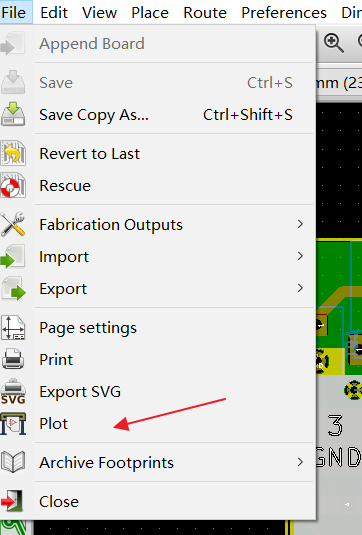
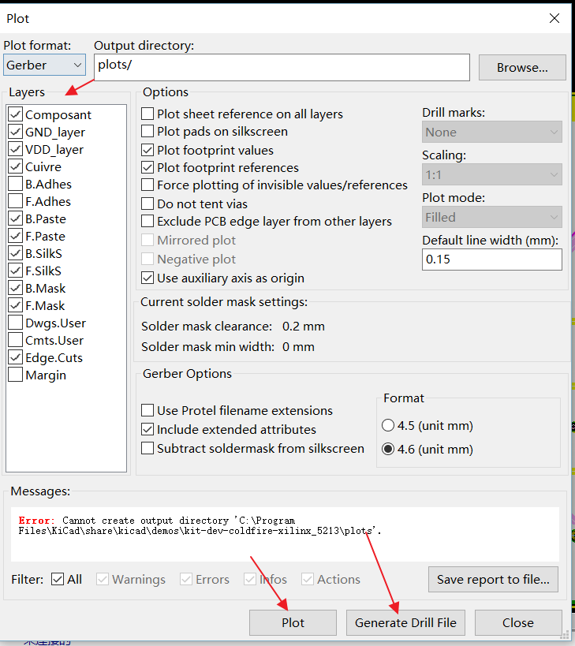

# How to export kicad PCB to gerber files

 
  

1. If you don't know which layers, please check all layers, EasyEDA PCB house will help you to use the right layers.

2. Don't forget to Generate the Drill Files.

Kicad users will forget to add the Drill file to order.

https://www.youtube.com/watch?v=4PnY2IUQ2Tg

https://www.wayneandlayne.com/blog/2013/02/27/kicad-tutorial-gerber-file-generation/

