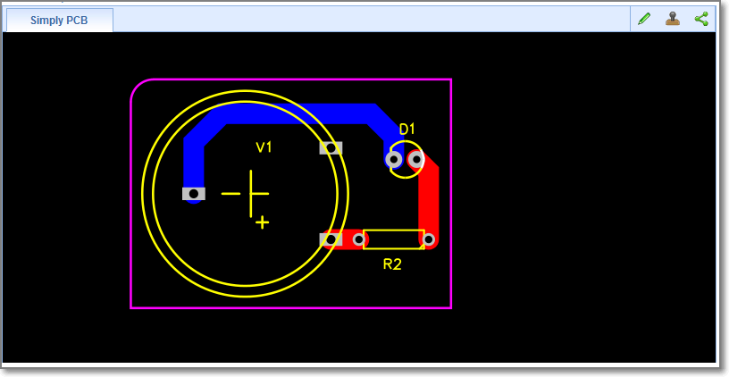

# Common Information
EasyEDA is a free, zero-install, Web and cloud-based EDA tool suite, integrating powerful schematic capture, mixed-mode circuit simulation and PCB layout.

EasyEDA team try to make our users happy, we provide a open ASCII file format. with these file format, you can create a schematic or PCB some codes, even a Notepad. When you try to add hundreds LEDs to schematic or PCB batch, you will find out to use codes to create an EasyEDA file, then import to EasyEDA. It is funny and quickly.

EasyEDA's file is a JSON file, but we compress all of the shape's attributes to a simply string, which will make the file size is small and save to server faster, more important, with this solution You can create some very big designs. Most of the browser will crash when try to decode the big JSON files.

Ok, let's explain them with examples.
## Example
### Schematic Example
[Schematic Example ](http://easyeda.com/file_view_simply-schematic_puoGYgasK.htm)

## Schematic JSON File Source 
check it via github gist [Schematic json](https://gist.github.com/dillonHe/0b62babdb8ab3d2ad7d3#file-schematic-json)

### PCB Example
[PCB Example](http://easyeda.com/file_view_Simply-PCB_K4gCYjhDB.htm)
[Schematic Example ](http://easyeda.com/file_view_simply-schematic_puoGYgasK.htm)

### PCB JSON File Source 
check it via github gist [PCB json](https://gist.github.com/dillonHe/279c55659bb7065258b6#file-pcb-json)

##General File Struck
###Delimiter Mark
From the above JSON source, you can find there are lots of **`**, **~**, **^^** and **#@$**  
 characters. These characters are used as **delimiter mark**. These characters are not used frequently in design.

 ***Note: although these characters are not picked property at the very begin, we can't change these, EasyEDA has already lots of designs***

#### ~ (Tilde)
 `~` is used to separate the attributes of the shapes. Taking rectangle as an example.  `R~170~100~10~10~200~130~#99FF00~1~0~none~gge36~`, when use pure JSON file, it should be look like below,
check it via github gist [rect json](https://gist.github.com/dillonHe/55151fae7c36785cdc31#file-rect-json).
.
 
So EasyEDA's source is small in file size and will trans from internet more faster.

#### `(Back quote)
  **`** is used to separate the custom attributes. 

**package`LED3MM** stands package:LED3MM 

#### ^^(Double circumflex) 
**^^** is used to join segments, just used in *netFlag* , *Pin* and *pAD*.

#### #@$(Octothorpe Ampersat Dollar) 
Union the characters **#@$** as a supper mark, it will be used to implode the [shapes](./schematic.htm#shapes) to a string, it just be used in *Schlib* and *PCBLIB*.

##Document Type 
check it via github gist [document type](https://gist.github.com/dillonHe/8c1a0e599540980bf7ab#file-document-type-js)

## Canvas Coordinates
The canvas is a two-dimensional grid.  
The upper-left corner of the canvas has coordinate (0,0)

## SVG
 EasyEDA uses [Scalable Vector Graphics (SVG)](http://en.wikipedia.org/wiki/SVG) which is an XML-based vector image format for two-dimensional graphics to realize the shapes.

##Q&A
### 1. How to check the json file format
 Check the [EasyEDA source dialog](http://easyeda.com/EasyEDAtutorial/introductiontoEasyEDA.html#h.c9qmiqe5x8jv) out, copy the text to text area, then click the `Apply` button. That is all.