#EasyEDA Schematic File Format

Note: Schematic, Schematic Library, Spice Symbol, Subpart and Subckt are used the same file format. Please check [Schematic JSON File Source](./common.htm#Schematic-JSON-File-Source) out before keeping read.

##Head
###Head information for schematic and subckt.  

	"head":"1~1.7.5~Author`Dillon`~TRAN`2u`2m`0`{AC`dec``0`0`{DC`0``0`0`{TF```"

**Format:**

1. [document type](./common.htm#Document-Type) :`1`
2. document version: `1.7.5`h
3. custom attributes: **key: value** pairs, separate with **`**, added via **Add new parameter**  
  
4. spice simulation configure store, Now can set four types `tran`, `AC`, `DC`, `TF`, every type split with `{`. When opening the simulation dialog, these information will be listed in like below image
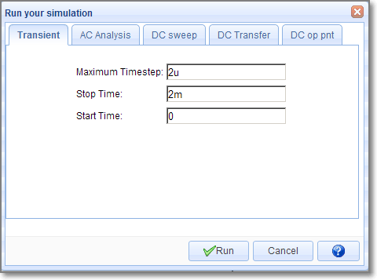


###Head information for Schematic Library, Spice Symbol and Subpart
	"head":"7~1.7.5~400~300~package`DIP08`nameDisplay`0`nameAlias`Model`Model`555`name`555`pre`U?`spicePre``Contributor`Dillon"

**Format:**

1. [document type](./common.htm#Document-Type) :`7`
2. document version: `1.7.5`
3. origin x position. **Reserved field, can't be changeded** 
4. origin y position. **Reserved field, can't be changeded** 
5. custom attributes: **key: value** pairs, separate with **`**, added via **Add new parameter**.   
*package*: *DIP08*  
*nameDispaly*: *0* (hide it is name when placed to schematic)  
*nameAlias*: *Model*   
*name*:*555*  
*pre*:*U?* , when place to schematic, will be marked as U1, U2. subpart will be set as *U?.1*, *U?.2* etc.  
*spicePre*:*X*, *X* stands for a subckt.  
*sourceId*:*xxxxxxxxx* (just for schematic Lib and spice symbol)
 
Place it to schematic canvas, it's attributes will be looked like below image. The name field is alias as Model and it is invisible. 
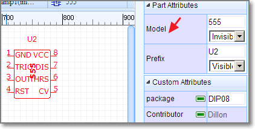

##Canvas
	"canvas":"CA~1200~1200~#FFFFFF~yes~#CCCCCC~10~1200~1200~line~10~pixel~5~400~300"
**Format:**  
1. command: CA
2. view box width: 1200, View Box Width / Canvas width = scaleX
3. view box height: 1200,View Box Height / Canvas Height = scaleY
4. back ground: #FFFFFF
5. grid visible: yes/none
6. grid color: #CCCCCC
7. grid size: 10 pixel
8. canvas width: 1200 pixel
9. canvas height: 1200 pixel
10. grid style: line/dot
11. snap size: 10 pixel
12. unit: pixel(Always pixel)
13. ALT snap size:5 (Snap Size when pressing the `ALT` Key)
14. origin x position
15. origin y position

Canvas setting image  
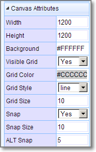

##Shapes
The shape is an array. EasyEDA store various shape in this field, they are different with a command which locate at the begin of the string. 

	"shape":[
	    "PL~210 100 260 100~#000000~2~0~none~gge58",
	    "R~210~110~~~50~30~#000000~1~0~none~gge61",
	    "I~90~90~271~105~0~https://easyeda.com/assets/static/images/logo-140x39.png~gge62",
	    "PG~310 100 350 130 300 150 290 150 270 120~#000000~2~0~none~gge64",
	    "PT~M230 170 C270 200 270 170 240 150 240 150 240 150 240 150~#000000~2~0~none~gge65"
	]

###Rectangle
	"R~650~0~20~20~230~160~#FF0000~2~1~#9966FF~gge5"

**Format:**  

Check [ Rect element of SVG](http://www.w3.org/TR/SVG11/shapes.html#RectElement) out.

1. command: R
2. x: 650
3. y: 0
4. rx: 20
5. ry: 20
6. width: 230
7. height: 160
8. strokeColor: #FF0000
9. strokeWidth: 2 //pixel
10. [strokeStyle](#strokeStyle): 1 
11. fillColor: #9966FF
12. id: gge36
13. locked:null
Rect's attributes and image looks like bellow image:
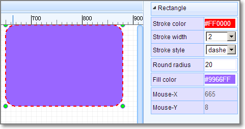

###Polyline
	"PL~610 130 780 130~#FF0000~5~0~none~gge6"

**Format:**  
Check [ Polyline element of SVG](http://www.w3.org/TR/SVG11/shapes.html#PolylineElement) out.

1. command: PL
2. points: 610 130 780 130
3. strokeColor: #FF0000
4. strokeWidth: 5 //pixel
5. [strokeStyle](#strokeStyle): 0 
6. fillColor: none
7. id: gge6
8. locked:null
Polyline's attributes and image looks like bellow image:


###Path
	"PT~M670 300 C830 370 850 230 920 300 920 300 920 300 920 300~#000000~1~0~none~gge17"
**Format:**  
Check [Path element of SVG](http://www.w3.org/TR/SVG11/paths.html#PathElement) out.

1. command: PT
2. pathString:M670 300 C830 370 850 230 920 300 920 300 920 300 920 300
3. strokeColor: #FF0000
4. strokeWidth: 5 //pixel
5. [strokeStyle](#strokeStyle): 0 
6. fillColor: none
7. id: gge6
8. locked:null
Path's attributes and image looks like bellow image:
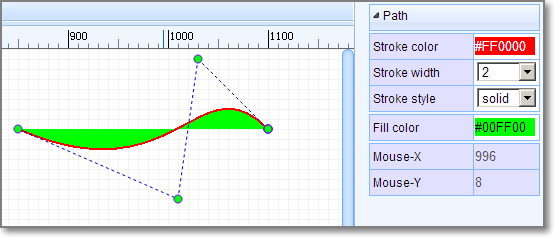
**bezier** is a **path** too.
###Arc

```"A~M 1020 60 A 80 80 0 0 1 953.096 199.904~968.78,121.45,1048.785,201.457,1018.785,61.457,948.785,221.45~#FF0000~3~0~none~gge19"```

**Format:**  
**Arc** is a **Path** element, Check [Path element of SVG](http://www.w3.org/TR/SVG11/paths.html#PathElement) out.

1. command: A
2. pathString:M670 300 C830 370 850 230 920 300 920 300 920 300 920 300
3. helperDots: the four green dots
4. strokeColor: #FF0000
5. strokeWidth: 3 //pixel
6. [strokeStyle](#strokeStyle): 0 
7. fillColor: none
8. id: gge19
9. locked:null


ARC's attributes and image looks like bellow image:


###Pie
	"PI~M 970 40 L 1189.9 34.4509 A 220 180 0 0 1 923.103 215.863 Z~970,40,1190,220,1327.7106323242188,30.973068237304688,923.1032104492188,215.86282348632812~#FF0000~3~0~#CCCCCC~gge22"
**Pie** is a **Path** element, Check [Path element of SVG](http://www.w3.org/TR/SVG11/paths.html#PathElement) out. Pie is similar with Arc, the pathString has a `Z`

1. command: PI
2. pathString:M 970 40 L 1189.9 34.4509 A 220 180 0 0 1 923.103 215.863 Z
3. helperDots: the four green dots
4. strokeColor: #FF0000
5. strokeWidth: 3 //pixel
6. [strokeStyle](#strokeStyle): 0 
7. fillColor: none
8. id: gge19
9. locked:null


Pie's attributes and image looks like bellow image:


###Bus Entry
	"BE~0~660~150~670~140~gge15"

**Format:** 

1. command: BE
2. rotation:0
3. start x1: 660
4. start y1: 150
5. end x1: 670
6. end y1: 140 
7. id: gge15
8. locked:null

Bus Entry's attributes and image looks like bellow image:
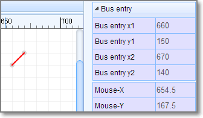	

###Image
	"I~610~10~271~105~0~https://easyeda.com/assets/static/images/logo-140x39.png~gge12"

**Format:**  
Check [ Image element of SVG](http://www.w3.org/TR/SVG11/struct.html#ImageElement) out.

1. command: I
2. x: 610
3. y: 10
4. width: 271
5. height: 105 
6. rotation: 0
7. href:https://easyeda.com/assets/static/images/logo-140x39.png
8. id: gge12
9. locked:null
Image's attributes and image looks like bellow image:
	


###Polygon
	"PG~640 10 900 40 920 140 760 230 560 140~#FF0000~2~0~#00FF00~gge10"

**Format:**  
Check [ Polygon element of SVG](http://www.w3.org/TR/SVG11/shapes.html#PolygonElement) out.

1. command: PG
2. points: 640 10 900 40 920 140 760 230 560 140
3. strokeColor: #FF0000
4. strokeWidth: 2 //pixel
5. [strokeStyle](#strokeStyle): 0 
6. fillColor: #00FF00
7. id: gge10
8. locked:null
Polygon's attributes and image looks like bellow image:


###Line
	"L~360~160~510~160~#FF0000~2~0~none~gge11"

**Format:**  
Check [ Line element of SVG](http://www.w3.org/TR/SVG11/shapes.html#LineElement) out.

1. command: L
2. x1:360
3. y1:160
4. x2:510
5. y2:160
6. strokeColor: #FF0000
7. strokeWidth: 2 //pixel
8. [strokeStyle](#strokeStyle): 0 
9. fillColor: #00FF00
10. id: gge11
11. locked:null
 
###Circle
	"C~710~170~105~#FF0000~2~0~#0000FF~gge12"
**Format:**  
Check [ Circle  element of SVG](http://www.w3.org/TR/SVG11/shapes.html#CircleElement) out.

1. command: C
2. cx:720
3. cy:90
4. r:105
5. strokeColor: #FF0000
6. strokeWidth: 2 //pixel
7. [strokeStyle](#strokeStyle): 0 
8. fillColor: #0000FF
9. id: gge12
10. locked:null


###Bus
	"B~570 130 680 130 680 210~#008800~2~0~none~gge19"

Bus is similar with [Polyline](#polyline), Bus is start with `B`, polyline start with `PL`.

###Pin
	"P~show~0~1~670~30~~gge23^^670~30^^M 670 30 h -20~#880000^^1~648~33~0~1~end~~11pt^^1~655~29~0~1~start~~11pt^^0~653~30^^0~M 650 27 L 647 30 L 650 33"

A Pin has seven segments, join these segments with [^^ (Double Circumflex)](./common.htm#Double-Circumflex) as a string like above.

1. **Pin configure** `P~show~0~1~670~30~~gge23`  
	1. command: P
	2. display: show/'' (*bad design, should use yes/none*)
	3. electric: 0, can be  ['Undefined', 'Input','Output','I/O','Power']
	4. spice pin number: 1
	5. position x: 670
	6. position y: 30
	7. rotation: null, can be ['null' or 0, '90', '180', '270']
	8. id: gge23
	9. locked: null
2. **pin dot** `670~30`  
	The gray dot at the end of the Pin, it is important.
	1. pin dot x: 670
	2. pin dot y: 30
	 
3. **pin path** `M 670 30 h -20~#880000`
    1. path: M 670 30 h -20, a 20 pixel horizontal line start from **pin dot**
    2. pin color: #880000
    
4. **name** `1~648~33~0~1~end~~11pt`
	1. visible : 1/0 stand show or hide
	2. position x: 648
	3. position y: 33
	4. rotation: 0
	5. text: **1**
	6. text anchor: end
	7. font family: null, default is **Verdana**
	8. font size: 11pt, default is 7pt
5. **number** `1~655~29~0~1~start~~11pt`

	 the same as **name** above
6. **dot** `0~653~30`

	stands for not. a circle with radius in 3 pixel 
	1. visible : 0/1 hide / show
	2. circle x: 653
	3. circle y: 30
7. **clock** `0~M 650 27 L 647 30 L 650 33`
	1. visible: 0/1 hide / show
	2. clock path: M 650 27 L 647 30 L 650 33

Pin's attributes and image looks like bellow image:
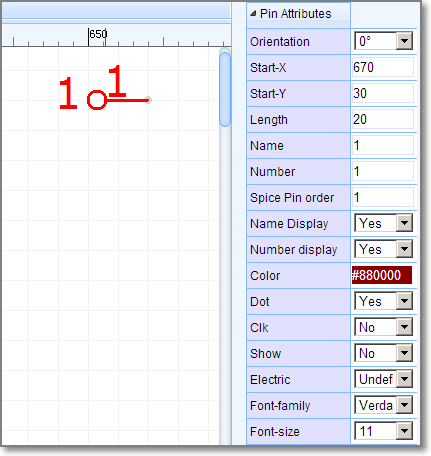


###Ellipse
	"E~720~90~105~65~#FF0000~2~0~#0000FF~gge12"

**Format:**  
Check [ Ellipse  element of SVG](http://www.w3.org/TR/SVG11/shapes.html#EllipseElement) out.

1. command: E
2. cx:720
3. cy:90
4. rx:105
5. ry:65
6. strokeColor: #FF0000
7. strokeWidth: 2 //pixel
8. [strokeStyle](#strokeStyle): 0 
9. fillColor: #0000FF
10. id: gge12
11. locked:null

Ellipse's attributes and image looks like bellow image:
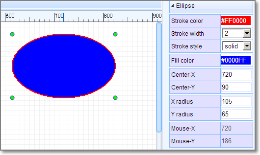

###Arrowhead

	"AR~part_arrowhead~1060~120~gge23~180~M 1060 120 L 1063 126 L 1055 120 L 1063 114 Z~#FF0000"

**Format:**  
  
1. command: AR
2. part Type:part_arrowhead, not used
3. x:1060
4. y:120
5. id:gge23
6. rotation: 180
7. path String: M 1060 120 L 1063 126 L 1055 120 L 1063 114 Z
9. fillColor: #FF0000
9. locked:null

Arrow head's attributes and image looks like bellow image:
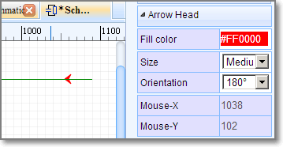

###Annotations
    "T~L~540~60~0~#0000FF~~9pt~bold~normal~~comment~Text~1~start~gge26"
     


Check [Text  element of SVG](http://www.w3.org/TR/SVG11/text.html#TextElement) out.
**Format:**  
  
1. command: T
2. mark: L // `L` = label, `N` = Name, `P` = prefix `N,P` are for [Schlib](#schlib)
3. position x:540
4. position y:60
5. rotation:0
6. fill color: #0000FF
7. font family: null, default is **Verdana**
8. font size: 9pt
9. font-weight: bold
10. font style: normal
11. dominant baseline: null 
12. text type: comment // **comment** or **spice** command
13. string: Text
14. visible: 1/0 show/hide (use for mark `N` or `P` )
15. text anchor: start (start middle end)
16. id:gge26
17. locked:null

Text's attributes and image looks like bellow image:
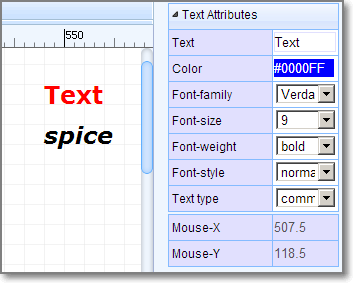

 
###Netlabels

	    "N~360~100~0~#FF0000~VCC~gge32~start~362~100~Times New Roman~",


**Format:**  
  
1. command: N
2. pin dot x: 360
3. pin dot y: 100
4. rotation: 0
5. fill color: #FF0000
6. name: VCC
7. id: gge32
8. text anchor: start (start middle end)
9. postion x: 362
10. postion y: 100
11. font family: Times New Roman
12. font size:null default is 7pt
13. locked:null


netlabel's attributes and image looks like bellow image:
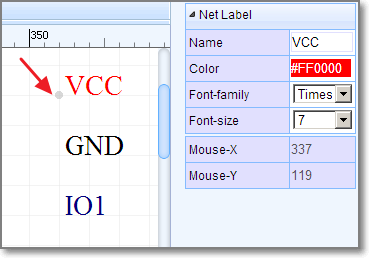

###Netflags
Netflag is very similar with netlabel

    "F~part_netLabel_gnD~330~110~~gge41^^330~110^^GND~#000080~319~97~0~start~0~Times New Roman~9pt^^PL~330 120 330 110~#000000~1~0~none~gge44^^PL~320 120 339 120~#000000~1~0~none~gge45^^PL~324 122 337 122~#000000~1~0~none~gge46^^PL~326 124 333 124~#000000~1~0~none~gge47^^PL~329 126 331 126~#000000~1~0~none~gge48",

A Netflag  has several segments, join these segments with [^^(Double Circumflex)](./common.htm#Double-Circumflex) as a string like above.

1. **configure** `P~show~0~1~670~30~~gge23`  
	1. command: F
	2. part id: part\_netLabel\_gnD
	3. position x: 330
	4. position y: 110
	5. rotation: null [0, 90, 180, 270]
	6. id: gge41,
	7. locked: null

2. **pin dot** `670~30`  
	The gray dot at the end of the Pin, it is important.
	1. pin dot x: 330
	2. pin dot y: 140
	
3. **mark string** `GND~#000080~319~97~0~start~0~Times New Roman~9pt`
	1. net flag string: GND
	2. color: #000080
	3. position x: 319
	4. position y: 97
	5. rotation: 0 [0, 90, 180, 270]
	6. text anchor: start (start middle end)
	7. visible: 1/0 show/hide the net flag string
	8. font family: Times New Roman
	9. font size:null default is 7pt
4. **shapes**

	All other items are [shapes](#shapes).

netflag's attributes and image looks like bellow image:


###Wire

		"W~570 130 680 130 680 210~#008800~2~0~none~gge19"
	

`Wire` is similar with [Polyline](#polyline), `Wire` is start with `W`, [polyline](#polyline) start with `PL`.

###Junctions

	    "J~420~140~2.5~#CC0000~gge18",


**Format:**  
  
1. command: J
2. pin dot x: 420
3. pin dot y: 140
4. junction circle radius: 2.5 pixel
5. fill color: #CC0000
6. id: gge18
7. locked:null


Junction's attributes and image looks like bellow image:


###No Connect Flag

	    "O~960~410~gge5~M956,406 L964,414 M964,406 L956,414~#FF0000"


**Format:**  
  
1. command: O
2. pin dot x: 960
3. pin dot y: 410
4. id: gge5
5. pathStr: M956,406 L964,414 M964,406 L956,414
6. color: #FF0000
7. locked:null


No Connect Flag's attributes and image looks like bellow image:


###SchLib


    "LIB~220~140~package`C1`nameAlias`Value(F)`Value(F)`1u`spicePre`C`spiceSymbolName`Capacitor`~~0~gge66#@$T~N~214~129~0~#000080~Arial~~~~~comment~1u~1~start~gge68#@$T~P~214~120~0~#000080~Arial~~~~~comment~C1~1~start~gge69#@$PL~218 148 218 132~#A00000~1~0~none~gge70#@$P~show~0~1~200~120~180~gge71^^200~140^^M 210 140 h -10~#800^^0~214~140~0~1~start~~^^0~206~136~0~1~end~~^^^^#@$PL~230 140 222 140~#A00000~1~0~none~gge72#@$PL~222 132 222 148~#A00000~1~0~none~gge73#@$P~show~0~2~210~120~0~gge74^^240~140^^M 230 140 h 10~#800^^0~226~140~0~2~end~~^^0~234~136~0~2~start~~^^^^#@$PL~218 140 210 140~#A00000~1~0~none~gge75"

A schlib  has several shapes, join these shapes with [#@$(Octothorpe Ampersat Dollar) ](./common.htm#Octothorpe-Ampersat-Dollar) as a string like above.

1. **configure** <code>LIB~270~140~package\`DO35-7\`nameAlias\`Model\`Model\`1N4001\`spicePre\`D\`spiceSymbolName\`Diode\`~~0~gge116</code>  

	1. command: LIB
	2. position x: 270
	3. position y: 140
	4. [custom attributes](common.htm#Back-Quote): *package\`DO35-7\`nameAlias\`Model\`Model\`1N4001\`spicePre\`D\`spiceSymbolName\`Diode\`*
	5. rotation: 0, can be ['null' or 0, '90', '180', '270']
	6. import flag: 0 just  used in import from eagle
	7. id: gge116
	8. locked: null
 
2. **shapes**

	All other items are [shapes](#shapes).


##strokeStyle
- 0 : solid
- 1 : dashed
- 2: dotted

##Q&A


###1. Why don't save the Wire, Annotion, netlabel, netflag to Shape field.
These items will be used to create netlist, save them to separate field will make you spent more less time to do this. We don't need to traversal all the shapes.
