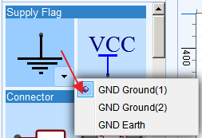

# Introduction to using a simulator

Using a simulator is not quite the same as building a real circuit. There are many things that can catch out the newcomer to simulation because neither real world nor most simulator components are ideal. The departures from ideal are often different between the two and if these differences between real and simulated components in a circuit are not clearly understood, they can lead to confusion when the results of a even a simple simulation are different from those expected.

Part of the problem is that a user's expectations are informed by experience of real world measurements. Therefore, it is important to understand exactly what measurements are being made and how the simulation circuit will affect the results. In cases where there are differences between real and simulated results this may also require a deeper understanding ofwhat is going on in those circuits and what assumptions are being made - often unconsciously - about them.

Learning to use a simulator means thinking more about what the real world really looks like, how it differs from the theoretical world of textbook problems and simple diagrammatic circuit representations and therefore what the results of measurements are likely to be.

##Avoiding common mistakes

The following section describes and illustrates some of the most common mistakes, misunderstandings and causes for confusion.

###Prefix conflict error

This error message will appear:

If:

There are two copies of the same schematic in the same project folder: CctA and Copy\_of\_CctA.

In this case, the component prefixes (reference designators) will be the same in both CctA and Copy\_of\_CctA.

Or:

There are two different schematics in the same project folder, CctA and CctB but there are some components in CctB that have the same prefixes as in CctA.

Then:

If a simulation run is attempted using:

**Green Man > Run the Project**

then EasyEDA will try to merge all the schematics in the Project into a single schematic and then run a simulation on that big schematic.

This will fail because EasyEDA will find repeated instances of components with the same prefix.

Else:

if you try to run a simulation using:

**Green Man > Run the Document**

or:

**CTRL+R**

then EasyEDA will run a simulation only on the schematic in the current active tab in the editor window (if you have only one schematic open then it will run that one but if you have more than one schematic open then it will run only the one in the selected tab).

If you have given a unique prefix to every component in that selected sheet then this simulation will run because EasyEDA will find only single instances of every component in the schematic.

### All simulation circuits MUST have a ground node

A feature of the way simulators work is that they MUST have a ground node (also referred to as the 0 net) somewhere in the circuit. All voltages probed in the circuit, unless explicitly probed as voltage differences are then measured with respect to that ground node. The ground node can be placed anywhere in the circuit that is convenient for the purposes of the simulation but it must exist somewhere in that circuit.

SIMULATION SCHEMATICS THAT DO NOT HAVE A GROUND NODE WILL NOT RUN.

This is illustrated in the following two examples:

With no ground symbol, the simulation will not run:

[All simulation schematics MUST have a ground 01](http://easyeda.com/editor#id=y20YWvRPp)

Once any of the available ground symbols is added, the simulation will run:

[All simulation schematics MUST have a ground 02](http://easyeda.com/editor#id=4WUSQNLJ5)

### All simulation circuits MUST have a power and/or signal source

In exactly the same way that a real circuit must have some sort of power supply - even if that power supply is actually the signal source itself (for example, a crystal set or a volume control potentiometer) or comes from a capacitor pre-charged to some voltage or an inductor pre-charged to some current prior switching the circuit on - a simulation schematic must have a power and/or a signal source or an initial condition such as a capacitor pre-charged to some voltage or an inductor pre-charged to some current prior to the start of the simulation.

Power supplies can be built from ideal zero series resistance voltage sources. Simple but more realstic models of battery and voltage regulator supplies can be built using voltage sources with some series resistance or current sources with a parallel resistance (i.e. Thevenin or Norton equivalent sources).

EasyEDA provides a wide range of signal sources. These will be covered in detail in their own section on Sources but the basic use of some of these sources to provide power to a circuit is illustrated below:

[All simulation schematics MUST have a power supply too](http://easyeda.com/editor#id=4ke8qIZTb)

###Every point in a simulation schematic MUST have a DC path to ground

Unlike real circuits, every point in a simulation schematic MUST have a DC path to ground (or 0 net). Attempting to run a simulation with a node that has no DC path to ground will fail with errors.

Before discussing the significance of the DC path to ground, however, it is essential to look at some of the basic components and sources that are used in almost all simulations and to understand how they affect these DC paths.

#### Values and DC paths of RLC components

This section is about the values of - and DC paths through - resistors, inductors and capacitors.

*   Inductors in ngspice have zero series resistance (i.e. ESR = 0).

 * Therefore, inductors have a DC path through them.
    
 * Inductors in ngspice have no parasitic parallel capacitance or resistance.

*   Capacitors in ngspice have no parasitic parallel conductance (i.e. they have an infinite DC resistance).
 *   Therefore capacitors in ngspice do not have a DC path.
 
 * Capacitors in ngspice have zero series resistance (i.e. ESR = 0).
 *  Capacitors in ngspice have no parasitic series inductance (i.e. ESL = 0).

*   Inductors and capacitors in ngspice can be set to positive and to negative values and to zero. Beware that setting a component to a negative value may cause the circuit connected to them to exhibit instability or oscillation. This in turn may cause the simulation to fail.
* 
*   Resistors obviously have a DC path through them.
*   
    Resistors in ngspice can be set to positive and to negative values but cannot be set to exactly zero: they MUST have a non-zero value. Setting a resistance to zero will cause the simulation run to fail with an error. This is basically because any voltage difference across a zero resistance (such as may occur normally in a circuit or even just as a consequence of numerical "noise" in the simulation calculations) will generate an infinite current, which will obviously crash out of the top end of the simulators calculation dynamic range. This applies to all resistors in ngspice, including the Ron and Roff values in switches and resistances given in device models.
    Beware that setting a resistor to a negative value may cause the circuit connected to it to exhibit instability or oscillation. This in turn may cause the simulation to fail.
*   A common cause of confusion in simulation is the apparently unexpected behaviour of circuits using open circuit switches.
    Just like switches in the real world, switches in EasyEDA have non-zero ON resistances (Ron). They also have finite OFF resistances (Roff). If an EasyEDA switch is connected in series with a voltage source into an open circuit load (such as presented by a VolProbe) then the voltage at the output of the switch will be equal to the open circuit voltage of the voltage source whether the switch is open or closed. This is different from the real world experience because in a real circuit, the voltage would be measured with a voltmeter or an oscilloscope probe having a much lower resistance than the open circuit resistance of the switch.
    To illustrate this, let’s take a simple example of a switch connected in series with an ideal voltage source set to 1V and then measure the V(Output) of the switch when open and closed.
    With the switch closed the expected output is V(Output) = 1V.
    And that’s what the simulation shows.
    OK. With the switch open the expected output is V(Output) = 0V.
    What the simulation actually shows is V(Output) = 1V.
    What’s that all about? Surely the switch must not be simulating properly and is stuck closed?
    Well, no actually; the switch and voltage are doing exactly what they should. It’s just that these results are unexpected  because there's a misunderstandingabout how the simulated circuit differs from a real circuit.
    No real switch has an infinite OFF state resistance but similarly, there is no such thing as a real open circuit that presents an infinite load impedance.
    The Voltage and Current Controlled Switches and the Static Switches in EasyEDA are not ideal: they all have a finite OFF resistance. For the voltage and current controlled switches, the OFF resistances are specified by the user editable R(off)(Ω) parameter in the right hand Properties panel with a default value of 1GΩ. The Static Switches have a fixed 10GΩ OFF resistance. In either case these resistances are large but certainly not infinite.
    However, the effective resistance to ground at the Output node using a Volprobe or plot expression, really is infinite. Therefore when operating into an infinite resistance load there would be no difference between the ON and OFF state voltages at the Output node.
    Note that if a load resistance of 1GΩ were to be connected from the Output node to ground, then there would be a clear ON/OFF state difference.
    This is illustrated in the following simulation:

    [EasyEDA switches are not ideal](http://easyeda.com/editor#id=0MEe2PNZp)
    Some further examples of the effects of
    

    finite switch resistances are illustrated in this next simulation:

    [Effects of finite switch resistances](http://easyeda.com/editor#id=Ba4mEWewq)

    Note that, in ngspice, the Ron and Roff values used in switches can be set such that Ron > Roff. This is a useful way to invert the logic sense of a switch.

    At this point it is worth noting that if it is important that the simulation results are as close as possible to those expected to be observed when probing a real circuit using real test equipment, it is sometimes useful to place a realistic load on wires (nets) in the simulation schematic where voltage measurements are to be made in the real circuit. Similarly for current measurements, realistic ammeter insertion impedances should be connected in series with the wire. To avoid unnecessary loading of the simulated circuit however, only place such loads in the locations where external measurement devices are to be connected to the real circuit and only in the same numbers as there are measurement instruments being used at the same time. For example, if there are two oscilloscope probes connected to a circuit but one of them is moved around, only connect loads representing simulated oscilloscope probes to two places in the simulated circuit. If different places need to be probed then move the simulated probes and rerun the simulation.

    #### DC paths through Voltage and Current Sources

    This section is about the DC paths through Voltage and Current Sources.

*   Voltage sources in ngspice (including independent V and dependent B and E voltage sources) have zero source resistance and have no current limit. The output voltage will be constant for any load current. This is true when sourcing or sinking current. sinking. This is not the same behaviour as regulated and current limited bench power supplies set to give a constant voltage output. Except for specialised supplies such as Source Measure Units, bench supplies can usually only source currents for positive outputs or sink currents for negative output voltages, up to some current limit set by the user.
    *   Voltage Sources in ngspice therefore have a DC path through them.

    As a consequence of their zero source resistance, in the same way that damagingly high currents will flow if real batteries are connected in parallel without some resistance between them, voltage sources in simulation schematics cannot be connected in parallel without some resistance in series between them. This is true even if they are set to exactly the same voltage. Attempting to do so will cause the simulation run to fail with an error.

    Similarly, in the same way that damagingly high currents will flow if an inductor is connected directly across a real power supply without some resistance between them, inductors in simulation schematics cannot be connected directly in parallel with voltage sources without some resistance in series between them.  Attempting to do so will cause the simulation run to fail with an error.

*   Current sources in ngspice (including independent I and dependent B and F sources) have an infinite source resistance and have no voltage limit. The output current will be constant for any load impedance and voltage across the current source. This is not the same behaviour as regulated and current limited bench power supplies when they are set to give a constant current output. Except for specialised supplies such as Source Measure Units, bench supplies can usually only source currents up to some maximum positive voltage at the output or sink currents down to some minimum negative voltage at the output, as set by the user.
*  Current Sources in ngspice therefore do not have a DC path through them.

As a consequence of their generating a constant current through an infinite source resistance, in the same way that damagingly high voltages can be generated if two real current sources are connected in series without some finite resistance across each source, current sources in simulation cannot be connected in series without some finite resistance connected in parallel with each source. Attempting to do so will cause the simulation run to fail with an error.

*   In simulation, connecting a capacitor in parallel with a current source generating a current, I, without also connecting a resistor, R, in parallel, will cause the voltage on the capacitor to ramp towards infinity. Even with the resistor in parallel, the voltage will ramp to I*R which may still be a large voltage. If such a circuit exists in a simulation schematic then, unless it is shorted out by a switch with some suitably low value resistance or set to some initial voltage, the voltage across the capacitor will already have ramped towards infinity at time t=0, i.e. as the simulation starts. This can lead to unexpectedly high voltages right from the start of a simulation.

#### The effects of adding DC paths

This section is about creating DC paths and some of the effects they can have.

*   A favourite of elementary electrical engineering classes and an example of a very tricky problem to solve using a simulator is a circuit that has two capacitors in series. This must have a DC path to ground from the common point between the two caps but the path to ground does not have to be direct. It can be via other elements in a circuit. For example if one end of one of the capacitors is connected to ground with the other end of the other capacitor connected directly to a grounded voltage source or to a Thevenin Source (a voltage source in series with a resistance) or to a Norton Source (a current source in parallel with a resistance) then placing a single high value resistor in parallel with either of the capacitors or simply from the junction of the two capacitors to ground would be sufficient.

The following simple example will not run because there is no DC path to ground from the common node B, between the two capacitors:

[Capacitors in series 01](http://easyeda.com/editor#id=b3btnFXQ8)

*   Resistors placed across capacitors to provide a DC path can be scaled so that the R_C time constant that they will create with the capacitors is very large compared to the time interval over which a Transient simulation is to be run. Another way to look at this for an AC Analysis is that the 1/(2_pi_R_C) frequency that they form is far outside the frequency range of interest.

The value of these resistances can be anywhere between milli&#937; (1e-3 &#937;) up to 1G &#937; (1e9 &#937;). In many cases the values can be smaller or larger than this range but in some circuits that can lead to simulations failing with errors. This is usually because the ratio of the largest to the smallest voltages or currents in the circuit is too high for the simulator to handle. As a general rule, keeping the ratio between the smallest and the largest component value for any given type of passive component to no more than 1e12 should help avoid this sort of simulation failure.

*   It must be noted however that whilst a purely theoretical analysis of the voltages across capacitors in series due to a current flowing through them based on Q=I_t=C_V, may yield sensible values, setting up both real and simulated circuits to demonstrate this can be quite challenging. Voltage measurements in real circuits can be difficult whilst the need for a DC path in simulations can present different but no less tricky problems.

*   Similarly, a transformer coupled circuit where the primary side is driven from mains live and neutral and one side of the secondary circuit is connected to earth (which is probably where the ground symbol would be placed in the circuit diagram), must have a DC path back to this ground from one or both ends of the transformer primary (or from a centre tap if one is available).

Similarly to placing resistors across capacitors, DC path resistors used with inductors can be scaled so that the R/L time constant that they will create is very large compared to the time interval over which a Transient simulation is to be run. Another way to look at this for an AC Analysis is that the 1/(2_pi_R*C) frequency that they form is far outside the frequency range of interest. capacitors

Another example of where very high value resistors would be added is in transformer coupled datacommunications networks such a 100BaseTx or 1000BaseT Ethernet. Here, the connections between the two transceivers are floating and so have to have DC paths to ground added to keep the simulator happy. Using resistances that are high in comparison to the network cable characteristic impedance and hence termination resistance is important in order not to introduce an impedance mismatch and so disrupt the signal integrity. In practice it is simplest therefore to add two resistors: one from each of the two signal wires to ground. This preserves the symmetry of the signalling on the wires and doubles the effective resistance between them.

In many transformer coupled circuits, the simplest solution is to ground one side of both the primary and the secondary sides of the circuit. This may look strange because the circuits are no longer galvanically isolated by the transformer but - as long as the reason for connecting the circuits this way is clearly indicated in the schematic (and removed or otherwise modified before passing into PCB layout!) - then it is a simple and very useful solution. Not only does it remove any problems with how large or small the DC path resistor has to be, it also refers the voltages on both the primary and the secondary sides to ground and so simplifies probing of many of the voltages on both sides of the transformer which might otherwise have to be probed differentially.

Some examples of this use of the ground return path resistor can be seen in the following collection of examples of transformers and coupled inductors, including a simpleexample of an open loop flyback converter:

[Transformers and coupled inductors](http://easyeda.com/editor#id=QHBTb5nFX|Uf3DByUS4|cQKEWe7pH|BEeOM8tPb)

[Transformers and coupled inductors 1](http://easyeda.com/editor#id=QHBTb5nFX)

[Transformers and coupled inductors 2](http://easyeda.com/editor#id=Uf3DByUS4)

[Transformers and coupled inductors 3](http://easyeda.com/editor#id=cQKEWe7pH)

[Open loop flyback converter](http://easyeda.com/editor#id=BEeOM8tPb)

*   To avoid confusion between passive schematics intended to be passed to PCB layout and simulation schematics that may have had DC path resistors added, it is a good idea to clearly identify any resistors added to a schematic soley to provide a DC path to ground. This can be done using resistor names such as RDCPATH1 or by labelling them for example as For simulation only.

*   It must be remembered that all voltages probed in a schematic are with respect to ground. This is particularly important to remember when probing signals that are floating, such as the transformer coupled examples discussed above. This is when B or E Sources can be used to probe two floating voltages and subtract them to simply generate the difference between them.

#### Common problems with DC paths

A DC path to ground is often provided by the rest of the circuit but here are some cases that are often overlooked:

*   All current sources (independent I and dependent B and F sources) are ideal: they have an infinite DC resistance (and AC impedance) and so do not have a DC path through them. Connecting a current source across a capacitor with one side grounded will throw an error even if the current source is set to zero (the capacitor voltage would ramp to infinity if a non-zero current were set and that would throw a different error!). So a resistor must be connected across the current source, to provide the DC path to ground to the other side of the current source / capacitor. A similar problem arises if two current sources are connected in series even if the two currents are identical (if they're not then the common node flies off to infinity again);
*   Switches have their own internal DC path between the switch terminals because they have finite OFF resistances. However, voltage controlled switches do not have a DC path between their control inputs.

*   Current controlled switches, Current Controlled Current Sources (CCCS)and Current Controlled Voltage Sources (CCVS)all have a zero resistance short circuit between their control inputs.Atfirst sight it might appear that connecting the output of a current source to the input of a current controlled switch would not cause a problem because the switch control input places a short circuit across the current source output. There is, however, no DC path to ground from the these connections so a resistor must be placed from one of the current controlled switch input pins to ground. If the current source output/switch control input part of the circuit is not connected to anything else then the resistor can be replaced by a connection to ground.

This is illustrated by the placement of the RDC_PATH_TO_GROUND 1kresistor connected to output side of the CCCS, F1, and input side of thecurrent controlled switch W1 in the example below:

[Controlling EasyEDA switches](http://easyeda.com/editor#id=hRL3WewOI)

*   Capacitors (unless using the more advanced options in ngspice) are ideal: they have no parasitic (leakage) DC resistance in parallel with them. This is why both ends of a capacitor must have a DC path to ground either through the external circuit or explicitly by adding a resistor;

*   Although the primary and the secondary or secondaries of transformers have DC paths, there is of course no DC path from primary to secondary. This must be added either by connecting one side of the primary and of the secondary to ground directly or through a resistor.

*   Voltage sources (including independent V and dependent B and E voltage sources) have the opposite problem. They are ideal so they have zero resistance. The same is true for simple inductors. If you connect voltage sources directly in parallel then ngspice will throw an error even if the voltage sources are set to the same value (if they're not then an infinite current would flow and that would then throw a different error). The same problem arises if you connect a voltage source directly in parallel with a simple, ideal, inductor because the voltage source tries to drive an infinite current through the inductor.

This problem often occurs when driving a transformer from a voltage source. Adding a small series resistance fixes this little gotcha (in practice there will always be a finite winding resistance anyway!).

### Components are connected by netnames

It is important to understand that although components in a schematic can be shown joined by wires or by netlabels, in a spice netlist they are joined by purely by the net names given to them either automatically by EasyEDA or manually by the user placing netlabels. This includes nets joined by any of the three NetFlag GND ground symbols. It also includes nets joined by the Net Port, NetFlag VCC and NetFlag +5 symbols as illustrated below:

[Nets can be joined by netnames 01](http://easyeda.com/editor#id=hnXVTQOMK)

It is equally important to understand that when a wire between two components in a schematic is broken then - unless the wire on both sides of the break is explicitly given the same netname by manually placing netlabels with the same name - then the wires on each side of the break will have different netnames because even though one side may already have a manually assigned netname, the other side will automatically have a new and arbitrary netname assigned to it by EasyEDA.

The significance of manually assigning net names will become apparent a little later when looking at how to probe voltages and using the voltage on nets in expressions for B sources.

[Nets can be joined by netnames 02](http://easyeda.com/editor#id=9XR92kewO)

As just illustrated, breaking a wire creates two segments of wire that are no longer connected to each other. This is because EasyEDA automatically assigns different netlabels to each end of a broken wire.

To rejoin the connection, add netlabels with the same name to each segment of the broken wire. NetPorts and NetFlags can be placed anywhere on a net but take care that the little grey connection dot is placed onto the wire.

To avoid accidentally connecting nets together that are not intended to be connected when manually assigning netlabels, take care to ensure the netnames assigned are unique to each net. For instance, in the following example, using the name 'mid' instead of 'ammeterneg' would connect the negative side of A1 to the 'mid' net and would short out R1.

[Nets can be joined by netnames 03](http://easyeda.com/editor#id=sqkBTN5nF)

### Probing signals

After spending ages building a schematic the time has finally arrived: the first simulation is run. The Simulation Results... window pop opens and there it is ...

Nothing.

No warnings.

No error messages.

No dire messages about Timestep too short or Trouble with node X

What's gone wrong?

The most likely cause is one of the most overlooked beginners' mistakes: there are no signal probes in the schematic. The simulation has run fine. It just didn't produce any results simply because it had not been asked to!

In order to view any useful output from a simulation, the circuit must have at least one voltage probe or one ammeter in the circuit. In basic simulations these will be the VolProbe and Ammeter symbols from the EasyEDA Libs. In more advanced simulations, these can be implemented using a probe command. In either case, at least one type of probe must exist in the simulation schematic. If no probe is present, the simulation will run but the Simulation Results... window will be empty and no WaveForm window will open.

#### Probing voltages

All voltage measurements in real circuits are actually measurements of voltage differences. In many cases such as when probing a voltage using an oscilloscope probe, it is easy to forget that the voltage being measured is, in reality, the difference between the voltage at the probe tip and wherever the probe ground lead is connected. In the same way it is easy to forget that probing a single ended voltage in a simulation schematic is with respect to wherever the ground node has been placed.

In a real circuit, probing a voltage between any two points places a resistive load between them. With a good quality voltmeter that resistance may be very high, in the order of hundreds of Meg&#937;. With an x10 oscilloscope probe it will be 10Meg&#937;. There will be some stray capacitance across that resistance. There will also be stray lead inductances. If the voltage being measured is an AC signal then impedances due to these stray and parasitic components will also load the circuit.

Note that in simulations, voltage probes present an infinite resistance and have no stray capacitance or inductance. In effect, voltage probes have an infinite bandwidth.

The following example illustrates some of the probing techniques decribed above:

[Probing voltages 01](http://easyeda.com/editor#id=Il5nTDx3z)

The following example shows a number of ways to measure voltages with respect to ground or differentially using;

*   The EasyEDA Voltmeter;

*   An `E` source (a.k.a. Voltage Controlled Voltage Source or VCVS) with a Voltage probe to probe the output;

*   A `B`, source (a.k.a. behavioural or dependent source) configured as a VCVS using a Voltage probe to probe the output.

The schematic also demonstrates the importance of:

1.  Giving voltage probes names that are identical to the nets to which they are attached;

2.  Naming all nets in a schematic;

[Probing voltages 02](http://easyeda.com/editor#id=PYWwIiSPN)

#### Probing currents

In a real circuit, probing the current in a wire places a resistive load between them. This will cause some voltage drop across the ammeter. With a good quality ammeter that voltage drop may be very low, in the order of milivolts. There will be some stray capacitance across the insertion resistance and from the ammeter connections to ground. There will also be stray lead inductances. If the current being measured is an AC signal then impedances due to these stray and parasitic components will also load the circuit.

Note that in simulations, current probes present zero insertion resistance and have no stray capacitance or inductance. In effect, current probes have an infinite bandwidth.

The following example shows a number of ways to measure currents with respect to ground or differentially using;

*   As a current using the Ammeter symbol;&nbsp;

*   As a linearly scaled voltage using an H Current Controlled Voltage Source (CCVS) (or an F Current Controlled Current Source (CCCS) with a resistor);&nbsp;

*   As a linearly scaled current using an F Current Controlled Current Source (CCCS) driving an Ammeter;&nbsp;

*   As a voltage that can be an arbitrary function of the current flowing through a 0V Voltage Source using a BV source (or a BI source with a resistor);&nbsp;

*   As a current that can be an arbitrary function of the current flowing through a 0V Voltage Source using a BI source driving an Ammeter.

Note however, that although a 0V source can be used to monitor a current, it cannot be used to measure a current so that it can be directly displayed in the Simulation Results... window or plotted in Waveform.

[Probing currents 01](http://easyeda.com/editor#id=ZzsK2Wewq)