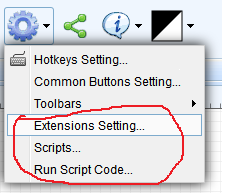
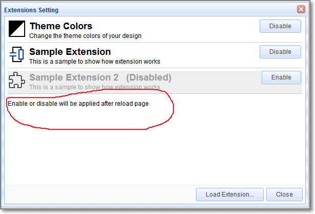
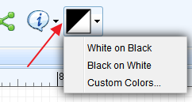
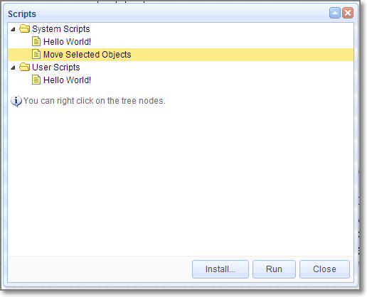

#EasyEDA API Plug
 Before reading this capture, please check [Open EasyEDA File Format](/Doc/Open-File-Format/) first.
##Why Need API
After route the PCB, you found out that you need to enlarge all tracks size a bit little, How?
After route the PCB, you found out that all Vias' hole size is too small, How to fix this?
How to create a board outline using code? 
EasyEDA API will let you control your designs in an easy way.
##How to use API

### How to find the plug entance

### Extensions Setting
You can enable or disable the default extensions, after enable, please **reload** the EasyEDA editor. We will give you a file about how to create an extensions soon. 

 
If you enable the **Theme Colors** Extension, you will find a button on the tool bar like bellow image
 
if you click the **Black On White**, you will find your schematic changes like bellow image, this is useful when you would like to print your design on a paper.
.
You can check our **github** codes of this API via [https://github.com/dillonHe/EasyEDA-Documents/tree/master/API/example/theme](https://github.com/dillonHe/EasyEDA-Documents/tree/master/API/example/theme), check the **manifest.json** and **main.js** out, you will find out how to create an extension.
#### How to install an extension
 
1. Click the Load Extension button
2. Click the select file button 
3. Select **All** the files.
4. Type a name
5. Click the load button.
6. **Close** EasyEDA editor and open it again.
.
### Scripts
If you just need some simple functions, you don't need to create an extension. You just need to create a single Javascipt file and keep it in this list.
.
1. You can select the `Hello World`, then click the `Run` button.
2. You can select some items, then try `Move Selected Objects`.

### Run Script code
In some case, you just need to run the function one time, such as create a user define board outline in codes, changing the Track width, change the hole size etc. You can use this way.
.
**example 1 Art **
You can open an empty schematic and copy [this example javascript codes](https://raw.githubusercontent.com/dillonHe/EasyEDA-Documents/master/API/example/schematicShapes.js) to the text box to run a test. After clicking the `Run` button, you will see bellow art image.

**example 2 Change track width and via hole size **
You can open a **PCB** and copy [this example javascript codes](https://raw.githubusercontent.com/dillonHe/EasyEDA-Documents/master/API/example/modifyTrackVia.js) to the text box to run a test. After that, All tracks will be 10mil.
##EasyEDA Coordinate System 
EasyEDA's editor is based [SVG](http://en.wikipedia.org/wiki/Scalable_Vector_Graphics), SVG viewport,(Coordinates increase **left-to-right** and **top-to-bottom**, the same as EasyEDA ). But SVG's origin is fixed at the left top corn, and EasyEDA's origin can be modified at the any place.
. 
Be careful this, they are different from **Cartesian coordinate system**
##Unit
There are two kinds of unit in our editor, SVG Canvas unit and real world EasyEDA unit. SVG Canvas unit is **Pixel**. The real world EasyEDA unit in schematic is also **Pixel**, but in PCB, there are **mm**, **mil** and **inch**. We use bellow map to convert Canvas to real world.
- 1 pixel = 10 mil
- 1 pixel = 0.254mm
- 1 pixel = 0.01inch
There are API for these convert.

	  //mm2pixel: convert 10mm to pixel
      var result = api('unitConvert', {type:'mm2pixel',value:10});

	  //mil2pixel: convert 10mil to pixel
      var result = api('unitConvert', {type:'mil2pixel',value:10});
 
There are other convert method, such as `inch2pixel`, `pixel2mm`, `pixel2mil` and `pixel2inch`.
 
  All EasyEDA's value is based pixel, if you can keep in mind that 1 pixel equal 10mil or 0.254 mm, you don't need to use any convert function. 
For example, if you want to change a Track to 20mil, so you just need to use 2.

##API List
###Get EasyEDA Source
1. get EasyEDA JSON objects, type is `json`, you can check  [PCB Json object](/Doc/Open-File-Format/PCBFileObject.htm) out to know more.

       var result = api('getSource', {type:'json'});

2. get [EasyEDA compress string](/Doc/Open-File-Format/PCB.htm), EasyEDA save this string to our database, it is a bit little hard to read and understand, but it is small in size. EasyEDA save this string to our database. 
    
       var result = api('getSource', {type:'compress'});

3. Get SVG string
       var result = api('getSource', {type:'svg'});     

Check the [Get EasyEDA source example codes](https://raw.githubusercontent.com/dillonHe/EasyEDA-Documents/master/API/example/modifyTrackVia.js).
###Apply Source
 After you can use your codes to hack EasyEDA's source, then you need to apply the source to EasyEDA's editor. You can 
1. Apply as compress string
      
       //will open a new editor and convert compressStr to EasyEDA file.
       api('applySource', {source:'compressStr', createNew: true});
2. Apply as Json object.

       //will modify the active file and convert json object to EasyEDA file.
       api('applySource', {source: json, createNew: !true});

Check the [Apply Source example codes](https://raw.githubusercontent.com/dillonHe/EasyEDA-Documents/master/API/example/modifyTrackVia.js).
###Get Shape
 If you want to get an EasyEDA json object by **id**, you can try to use bellow code.

          var obj = api('getShape', {id:'gge13'})
###Delete Shapes
  Removing shapes by follow code
   
###Update Shape
 If you want to modify an EasyEDA object, you can use this API.

	//Change the net to GND and the shape to ELLIPSE
	 api('updateShape', {
	  	"shapeType": "PAD",
	 	"jsonCache": {
	 	"gId": "gge5",
	 	"net": "GND"
	 	"shape": "ELLIPSE"
		});
 shapeType and gId are must provided.
1. Schematic `shapeType`
  `schlib`, `rect`, `polyline`, `polygon`, `wire`, `bus`, `image`, `circle`, `ellipse`, `line`, `path`, `arc`, `annotation`, `junction`, `netlabel`, `busentry`, `arrowhead`, `noconnectflag`, `pin`, `netflag`
2. PCB `shapeType`
  `FOOTPRINT`, `TRACK`, `COPPERAREA`, `SOLIDREGION`, `RECT`, `CIRCLE`, `TEXT`, `ARC`, `DIMENSION`, `PAD`, `VIA`, `HOLE`
 

###Create Shape
 If you want to create EasyEDA shape by codes, you can try. We will provide more information about this API soon, now we just provide examples. You will find out how to do. 
		/** with shortUrl
		 * @example
		 * api('createShape', {shapeType:'schlib', shortUrl:'nxlVIGgQO', from:'system', title:'556_DIL14', x:400, y:300});
		 * api('createShape', {shapeType:'FOOTPRINT', shortUrl:'RrkewO60i', from:'system', title:'ARDUINO_PRO_MINI', x:400, y:300});
		 */
		/** with jsonCache object
		 * @example
		 * api('createShape', {
		 *   "shapeType": "PAD",
		 *   "jsonCache": {
		 *     "gId": "gge5",
		 *     "layerid": "11",
		 *     "shape": "ELLIPSE",
		 *     "x": 382,
		 *     "y": 208,
		 *     "net": "",
		 *     "width": 6,
		 *     "height": 6,
		 *     "number": "1",
		 *     "holeR": 1.8,
		 *     "pointArr": [],
		 *     "rotation": "0"
		 *   }
		 * });
		 *
		 * @example
		 * api('createShape', {
		 *     "shapeType": "polygon",
		 *     "stroke": "#000000",
		 *     "stroke-width": "1",
		 *     "stroke-style": "dashed",
		 *     "fill": "none",
		 *     "points": [
		 *         {"x": 390, "y": 580},
		 *         {"x": 450, "y": 450},
		 *         {"x": 520, "y": 580},
		 *         {"x": 610, "y": 490}
		 *     ]
		 * });
		 *
		 * @example
		 * api('createShape', {
		 *     "shapeType": "arrowhead",
		 *     "x": 300,
		 *     "y": 300,
		 *     "color": "#339933",
		 *     "size": "3",
		 *     "rotation": 0
		 * });
		 *
		 * @example
		 * var ts = ["no_connect_flag", "arrowhead", "busentry", "netLabel_GNd", "netLabel_GnD", "netLabel_gnD", "netLabel_Bar", "netLabel_VEE", "netLabel_-5V", "netLabel_+5V", "netLabel_VCC", "netLabel_volProbe", "netLabel_netPort", "netLabel_text", "pin", "annotation"];
		 * for(var i=0;i<ts.length;i++){
		 *     api('createShape', {
		 *         "shapeType": ts[i],
		 *         "x": 300 + i%5*50,
		 *         "y": 300 + (i/5|0)*50
		 *     });
		 * }
		**/
		/** with cached or pre-defined libs
		 * @example
		 * api('createShape', {"shapeType": "pcblib", from:'GeneralPackages', title:'C0402', x:400, y:300});
		 * @example
		 * api('createShape', {"shapeType": "schlib", from:'EasyEDALibs', title:'HDR2X2', x:400, y:300});
		 *
		**/
		/**
		 * @example 4
		 * api('createShape', {
		 *     "shapeType": "schlib",
		 *     "gId": "gge6",
		 *     "head": {},
		 *     "itemOrder": [],
		 *     "annotation": {
		 *         "gge8": api('createShape', 'annotation', {}),
		 *         "gge9": api('createShape', 'annotation', {})
		 *     },
		 *     "pin": {
		 *         "gge11": api('createShape', 'pin', {}),
		 *         "gge14": api('createShape', 'pin', {})
		 *     },
		 *     "polyline": {
		 *         "gge10": api('createShape', 'polyline', {}),
		 *         "gge12": api('createShape', 'polyline', {})
		 *     }
		 * });
		 *
		 * @example 5
		 * api('createShape', {
		 *     "shapeType": "schlib",
		 *     "gId": "gge6",
		 *     "head": {},
		 *     "children": [
		 *         api('createShape', 'polyline', {}),
		 *         api('createShape', 'polyline', {}),
		 *         api('createShape', 'pin', {}),
		 *         api('createShape', 'pin', {}),
		 *         api('createShape', 'annotation', {}),
		 *         api('createShape', 'annotation', {})
		 *     ]
		 * });
		 *
		 * @example 6
		 * api('createShape', {
		 *     "shapeType": "schlib",
		 *     "gId": "gge6",
		 *     "head": {},
		 *     "children": api('createShape', [
		 *         ['polyline', {}],
		 *         ['polyline', {}],
		 *         ['pin', {}],
		 *         ['pin', {}],
		 *         ['annotation', {}],
		 *         ['annotation', {}]
		 *     ])
		 * });
		**/ 
### UI
   If you want to create an extension, not just a run one time script, maybe need toolbar buttoon. You can check the [example](https://github.com/dillonHe/EasyEDA-Documents/tree/master/API/example/theme) before you read.
####Create Toolbar Button

	 //@example create a button 
	 api('createToolbarButton', {
	  icon:'extensions/theme/icon.svg',
	  title:'Theme Colors...',
	  fordoctype:'sch,schlib',
	  cmd:"extension-theme-setting"
	 });

	 * @example toolbar with menu
	 * api('createToolbarButton', {
	 *  icon:'extensions/theme/icon.svg',
	 *  title:'Theme Colors...',
	 *  fordoctype:'sch,schlib',
	 *  "menu" : [
	 *      {"text":"White on Black", "cmd":"extension-theme-WhiteOnBlack"},
	 *      {"text":"Black on White", "cmd":"extension-theme-BlackOnWhite"},
	 *      {"text":"Custom Colors...", "cmd":"extension-theme-setting"}
	 *  ]
	 * });

####Create Extension Menu
	/**
	 * @example  
	 * api('createExtensionMenu', [
	 *  {
	 *      "text":"Theme Colors...",
	 *      "fordoctype": "sch,schlib",
	 *      "cmd": "extension-theme-white"
	 *  }
	 * ]);
	 */
###Create Dialog
  check the [example](https://github.com/dillonHe/EasyEDA-Documents/tree/master/API/example/theme) 
###Command List

####Clone
      // clone gge2 gge3 and return their new ids.
      var newIds = api('clone', {ids:["gge2","gge3"]})
####Delete
	  api('delete', {ids:["gge2","gge3"]});
####Rotate
    // rotate ids to 90 degree
    api('rotate', {ids:["gge2","gge3"],degree:90});
####Rotate Left
    //anticlockwise
    api('rotate_left', {ids:["gge2","gge3"]});
####Rotate Right

    //clockwise
    api('rotate_right', {ids:["gge2","gge3"]});
####Fliph
    api('fliph', {ids:["gge2","gge3"]});
####Flipv
    api('flipv', {ids:["gge2","gge3"]});
####Align Left
    api('align_left', {ids:["gge2","gge3"]});
####Align Right
    api('align_right', {ids:["gge2","gge3"]});
####Align Top
    api('align_top', {ids:["gge2","gge3"]});
####Align Bottom 
    api('align_bottom', {ids:["gge2","gge3"]});
###Selection
 Change or get selection states of EasyEDA objects in editor.
####Select

      // gge2 and gge3 will be marked as selected.
      api('select', {ids:["gge2","gge3"]});
####Select None
      //no objects will be selected.
      api('selectNone');
####Get Selected Ids
     var ids = api('getSelectedIds');
###Move
You can use [Update Shape](#UpdateShape) to change the shapes position, but the Move method is better in this case.
####Move Objects
Move shapes in relative coordinates, like move the shapes in arrow keys.

	//Move gge2 and gge3 from left to right in 20pixel or 200mil step
    //from top to bottom in 20pixel or 200mil step.
	api('moveObjs', {objs:[{gId:"gge2"},{gId:"gge3"}], addX: 20, addY: 20});

	//Move gge2 and gge3 from right to left in 20pixel or 200mil step
	api('moveObjs', {objs:["gge2","gge3"], addX:-20});

	//Move selected objects from left to right in 20pixel or 200mil step
	api('moveObjs', {addX:20});

####Move Objects To
How to move a `VIA` or `junction` to position `{x:'10mil', y:'10mil'}` ?, Move shapes to absolute coordinates.
	
	 //Move gge2 and gge3 to Canvas postion 20,20, the real coordinates are dedpend the origin.
	 api('moveObjsTo', {objs:[{gId:"gge2"},{gId:"gge3"}], x:20, y:20});

	//move gge2 and gge3 to 10mm, 10mm coordinates
	 api('moveObjsTo', {objs:["gge2","gge3"], x: api('coordConvert', {type:'real2canvas',x: '10mm'}), y: api('coordConvert', {type:'real2canvas',y: '10mm'})});

	//Move selected objects to Canvas postion 20,20, the real coordinates are dedpend the origin.
	 api('moveObjsTo', {x:20, y:20});
It is very easy to understand to move a PAD, VIA, Junction to absolution coordinates. But what are the effects of moving TRACK, FOOTPRINT, netlabel to some where. Just try to play the codes, you will find out the regular pattern.

###SetOriginXY
EasyEDA's canvas origin is 0,0, you can't change it. But the real coordinates can be mapped to any where. 
		//set the real origin point to canvas x = 400, y = 300. X,Y is pixel all the time.
       var result = api('setOriginXY', {x:400,y:300});
###Coordinate Convert
You can use mm or mil or inch as units, but when you apply the Parameters to SVG graph, you must use coordinate convert. 
    
    //convert the canvas x 400 to real postion, the value is depent your units and origin point.
    var result = api('coordConvert', {type:'canvas2real',x:400})

    //the default units is your canvas units, but you can add a units like 300mm. if your PCB's units is mil, then you will get the canvas coordinate 400mil,300mm.
     var result = api('coordConvert', {type:'real2canvas',x:400,y:'300mm'});

  If you set the origin to **0,0**. It is very easy to map the coordinate in your mind, you don't need to use API to convert. the canvas coordinate **100,100** equal the real coordinate **1000mil, 1000mil** or **1inch, 1inch** or **393.7mm, 393.7mm**

###Value Convert
 How to set the pad's hole size to 20mm? How to set the Track width to 20mil?
     
    //the default units is your canvas units, but you can add a units like mm, mil, inch, even pixel.
     var result = api('valConvert', {type:'real2canvas',val:400});
     result = api('valConvert', {type:'real2canvas',val:'400mm'})
    
     //convert the 400 pixel to real value, the value is depent your units , if the unit is mil, the result should be 4000
     //result = api('valConvert', {type:'canvas2real',val:400})

  If you can keep in mind 1pixel in canvas equal 10mil, so you don't need this API, you can do it in raw way. For example,
  If you want to update the track size to 20mil, you can do.

	 api('updateShape', {
	  	"shapeType": "TRACK",
	 	"jsonCache": {
		 	"gId": "gge5",
		 	"strokeWidth": 2
        }
		});
Or

	 api('updateShape', {
	  	"shapeType": "TRACK",
	 	"jsonCache": {
		 	"gId": "gge5",
		 	"strokeWidth":  api('valConvert', {type:'real2canvas',val:'20mil'})
        }
	 });

###Get SVG Arc Path
 SVG [Arc path Parameter](http://www.w3.org/TR/SVG11/paths.html#PathElement) is very complex,  We provide a API to convert human read ARC parameter to SVG path.

	 var result = api('getSvgArcPathByCRA', {cx:0, cy:0, rx:90, ry:90, startAngle:0.1, endAngle:0.7, sweepFlag:1});

result should be `M89.55037487502231 8.985007498214534A90 90 0 0 1 68.83579685560396 57.97959185139219`

##Examples
check [Github example](https://github.com/dillonHe/EasyEDA-Documents/tree/master/API/example)

Enjoy it, if you have any questions, do let us know.