<h1 align = "center">EasyEDA Tutorial</h1>

2017.08.31

EasyEDA Editor: <a href=https://easyeda.com/editor>https://easyeda.com/editor</a>

**Instruction:**

-	This document will be updated according to the updated EasyEDA editor.
-	The latest edition please refer to [https://easyeda.com/Doc/Tutorial/](https://easyeda.com/Doc/Tutorial/WhatsNew.htm#Download) .

 

**Update Record:**

<table width="100%"  style="font-family:'Times New Roman'; font-size:18px;">
   <tr>
      <td width="14%" style = font-weight:bold; >Update Date</td>
      <td width="16%" style = font-weight:bold; >Editor Verion</td>
      <td width="72%" style = font-weight:bold; >Description</td>
   </tr>
   <tr>
      <td>2017.08.31</td>
      <td>v4.8.5</td>
      <td>First update</td>
   </tr>
   <tr>
      <td>NA</td>
      <td></td>
      <td></td>
   </tr>
   <tr>
      <td>NA</td>
      <td></td>
      <td></td>
   </tr>
   <tr>
      <td>NA</td>
      <td></td>
      <td></td>
   </tr>
   <tr>
      <td>NA</td>
      <td></td>
      <td></td>
   </tr>
   <tr>
      <td>NA</td>
      <td></td>
      <td></td>
   </tr>
<table>

                 
             

# Introduction to EasyEDA

## What's EasyEDA

Welcome to EasyEDA, a great web based EDA tool for electronics engineers, educators, students, makers and enthusiasts.

There's no need to install any software. Just open EasyEDA in any HTML5 capable, standards compliant web browser.

Whether you are using Linux, Mac or Windows; Chrome, Firefox, IE, Opera, or Safari. EasyEDA has all the features you expect and need to rapidly and easily take your design from conception through to production.

[EasyEDA](https://easyeda.com/editor) provides:

-   Schematic capture
-   [NgSpice-based](http://ngspice.sourceforge.net/) simulation
-   PCB layout
-   PCB Design Rules and Checking
-   Export
-   PCB netlist in
  - Altium Designer
  - [Kicad](http://www.kicad-pcb.org/)
  - PADS
-   Spice netlist
-   WaveForm simulation plot data (in CSV format)
-   Schematic in
  -   pdf
  -   image
  -   SVG
-   Creation of BOM reports
-   Import
  -   Altium/ProtelDXP Ascii Schematic/PCB
  -   Eagle Schematic/PCB/libs
  -   LTspice Schematic/symbols (may require editing for Ngspice compatibility)
  -   [Kicad](http://www.kicad-pcb.org/) Libs/Modules (footprint libraries)
  -   Spice models and subcircuits
-   Symbol creation and editing
-   Multi-sheet and Hierarchical schematics (passive drawings and active simulation schematics)
-   Spice subcircuit creation
-   WaveForm viewer
-   Post simulation measurements
-   PCB footprint creation and editing
-   Simple but powerful general drawing capabilities
-   Schematic symbol, spice model and PCB footprint library management
-   Online sharing of and collaborative working on schematics, simulations, PCB layouts, designs and projects

## UI introduction

EasyEDA Editor has a clearly and friendly user interface. You can use its every function very easily when you become familiar with EasyEDA.

### Global UI

**Schematic UI**

**PCB  UI**
 

### The Clear EasyEDA UI

#### 1. Filter

Before using the Filter, you need to select what module you need in the left navigation panel, and then you can quickly and easily find projects, files, parts and footprints, just by typing a few letters of the title. For example, if you want to find all files containing “NE555” in the title, just type “555”, it is non-case-sensitive.  

  

The Filter only searches project, file and part titles and names. It does not search the Description and Content fields.

Click the X to clear the filter.

#### 2. Navigation Panel

The Navigation panel is very important for EasyEDA: it is from here that you can find all your projects, files, parts and footprints.

  

**Project**
Here, You can find all of your projects that are private or shared with the public, or fork from someone else's. 

Except for System IC, these options have a content menu. For example, if you drop down to My Projects and right click an item, you will get a tree menu like :

**EELib**

EElib means EasyEDA Libraries, It provides lots of components complete with simulation models, many of which have been developed for EasyEDA to make your simulation experience easier.  

**Design**

Design Manager, you can check each component and net easily, and it will provide DRC(Design rule check) to help your design better.

**Parts** 

Contains schematic symbols and PCB footprints for many readily available components and projects. And your own libs and modules will show up here.

**Shared**

About this module, if your partner shared his/her private project with you by using the **Access Control** option, then the project will show here.  

For more information you can refer to the [Access Control](./Share.htm#Access-Control) section.

**LCSC**

If you want to buy components to finish your PCBA, you should try the **LCSC** module, LCSC.com and EasyEDA are the same company.

EasyEDA partners with China's largest electronic components online store by customers and ordering quantity launch [https://lcsc.com](https://lcsc.com).
 LCSC means **L**ove **C**omponents? **S**ave **C**ost! We suggest to our users to use LCSC parts to design. Why?   
1. Small Quantity & Global Shipping.  
2. More Than 25,000 Kinds of Components.  
3. All components are genuine.   
4. It is easy to order co after design.   
5. You can save 40% cost at least.  
6. You can use our symbols and package.  

 
 

#### 3. ToolBar

EasyEDA's toolbar can be reconfigured via Common Buttons Setting…

The configure dialog is also easy to use:

Click on a button to select it. Then you can toggle button visibility by clicking on Show/Hide or by clicking on the tick space to the left of the button icon. You can change the button position using Move up and Move Down.

Many of the buttons have been assigned hotkeys, so you can use those to replace the button actions.

#### 4. Preview Dialog

The Preview dialog will help you choose components and packages and can help you to identify schematics and PCB layouts.

You can close or open this dialog via:  

 **Super Menu > View > Toolbars > Preview** or on the top toolbar **Config Icon > Toolbars > Preview**.

-  The Preview Dialog has a resizing handle in the bottom right corner.

  -The Preview Dialog can't be closed but double clicking on the top banner will roll up the panel or you can click the top right corner `—` . Double clicking top banner again toggles it back to the selected size.  

  

- Clicking on the little pencil edit tool opens the item in the preview for editing. Clicking on the location place tool in the top right corner of the preview dialog places the item onto the canvas. If you try to place PCB footprint into a schematic it will not provide any action and message.

#### 5. Wiring Tools

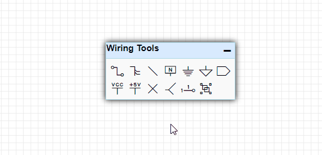

Wiring Tools are document type sensitive: different document types have different tools.

#### 6. User management menu

#### 7. Super menu

All EasyEDA's menus can be found here. Most of the time, we hope you can access these options via the Hotkeys or from the top toolbar but if you find that you use some of the more specialized options from this menu frequently then may want to set them as you own hotkeys.

#### 8. Drawing Tools

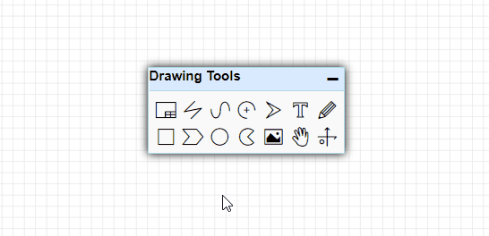

To keep EasyEDA's UI clean and sharp, the Wiring and Drawing tools palettes can be resized horizontally, rolled up or hidden so if you want to focus on drawing, you can roll up or hide the others to make more space and reduce the clutter.

#### 9. Canvas Attributes

You can find the canvas Properties setting by clicking on any of the blank space in the canvas.

Background and grid colors and the style, size, visibility and snap attributes of the grid can all be configured.

The canvas area can be set directly by the Width and Height or from available preset frame sizes.

#### 10. Canvas

This is where it all happens! This the area where you create and edit your schematics, PCB layouts, symbols, footprints and other drawings, run simulations and display WaveForm traces.

**Schematic**  
  

**PCB**  
  

**Symbols**  
  

**Footprints**  

**Other Drawing**  

**Simulation WaveForm**  

## How to Create A New Project or File

After logining in, you can create a new project:
 **Document > New > Project... > Create a new project/Schematic..etc**
   

The Project concept is important in EasyEDA because it is the foundation of how to organise your designs.

 

Give it a title: this will show in the project tree in the left hand panel.

You can make your project public or private by setting its Visibility.

If you choose to make you project Public, Categories allows you to select which category you want your project to be listed under on our website. If you keep your project private then the category is still applied but has no direct use in sorting your projects because this field is not searched in the Filter box in the left hand panel.

Adding a short description helps you and anyone you are sharing this project with understand what the project is about.

Once created, to modify your project, right click on it in the project tree in the left hand panel,

then will open a web page in which you can edit your project:

From here, you can change the Visibility, allow other people to comment on your project and type a more detailed description of the project content. To help you make your project stand out or to maybe simply make a detailed description of your project easier to read, you can use Markdown syntax. If you need more information on Markdown syntax, click on Markdown Syntax? just above the Content box.

### Version History
It is easy to use this function, right click on the document for which you need the version history in like in the image below  

 

After clicking on the version history link, you will get a list of all of the versions like in the image below.    
,  

Click the version number, you can open the saved file in the editor, if this is what you need, you can save it to your project and delete your bad file.

**Note:**  
*1. For now all of the versions are marked as number, we will allow you to add a tag soon.*  
*2. Don't save your files too frequently, or you will get lots of versions and it will be hard to find the exact one you want.*

​

## Function introduction

### Schematics 

EasyEDA can create highly professional looking schematics.

  

Because EasyEDA has some simple but powerful drawing capabilities, you can create your own symbols either by copying existing symbols into your own library and then editing and saving them, or by drawing them from scratch.

There is also a **Symbol Wizard** to quickly draw new symbols for `DIP`, `QFP` and `SIP`

A feature of EasyEDA is that as well as extensive libraries of the usual simple “2D” graphical schematic symbols, it has a library of drawn `3D` component symbols, i.e. symbols that look like the physical components that they represent.

If you have enough time and patience using the drawing features to full effect in symbol creation, your schematic can be built like this:

Another powerful feature is that it is also possible to import symbols from `Kicad`, `Eagle` and `Altium` libraries.

### Libraries management

Thanks to the Free and Open Source Kicad Libs and some Open Source Eagle libs, EasyEDA now has 100,000+ components, which should be enough for most projects.

Now you can enjoy using EasyEDA without having to spend so much time hunting for or building schematic symbols and PCB footprints.  

**Search symbols**

On the left hand Navigation panel you will find "**EElib**" and "**Parts**", just type what components you want and search.

**Create symbols**

EasyEDA supports creating symbols by yourself, after created you can find out your components at **Parts > My parts**, and it is easy to manage your parts.

To prepare for the final assembly stage you can create a Bill of Materials (**BOM**) via:

**Super Menu > Miscellaneous > BOM Report...**

and you can produce professional quality `SVG`, `.PNG` or `.PDF` output files for your documents.

All EasyEDA Schematic Symbol and PCB Footprint libs are public, so after you have created and saved a new symbol or footprint, others will be able to find your part and you will be credited as a contributor.   [https://easyeda.com/page/contribute](https://easyeda.com/page/contribute)​

### PCB Design

When you are satisfied with your schematic design and simulation results, you can then quickly proceed to produce your finished and populated PCB without leaving EasyEDA.

EasyEDA's PCB Design canvas helps you to quickly and easily lay out even complex multilayer designs from schematics you have already created in the Schematic canvas or directly as a layout with no schematic.

Passing an EasyEDA Schematic into the PCB Design editor is as easy as clicking a button: Just click the **Convert Project to PCB** PCB icon on the top toolbar!  

EasyEDA has extensive libraries of footprints. You can also build up your own library of unusual and specialized parts by copying and modifying existing parts or from scratch using EasyEDA's powerful footprint creation and editing tools.  

In a similar way as in the Schematic design canvas, to help you locate items and navigate your way around when working in the PCB Design canvas there is a PCB Design Manager.

**Left Navigation Panel > Design**

The PCB Design Manager is a very powerful tool for finding components, tracks (nets) and pads (Net Pads).

Clicking on any item highlights the component and pans it to the center of the window.

You can set up layers used in the PCB and their display colours and visibility using

**Super Menu > Miscellaneous > Layer Options...**

The active layer and layer visibility can be selected using the Layers Toolbar.

Default track widths, clearances and via hole dimensions can all be configured in the Design Rule Check dialog which is opened via:

**Super Menu > Miscellaneous > Design Rule Setting...**

From first setting up the Design Rule Check (**DRC**) at the start of your board layout, running a DRC is almost the last step in checking your PCB design before you generate **Gerber** and **Drill** files for board manufacture ready to place your order for a finished PCB.

The last step is to check the Gerber and Drill files using an easy to install and use Free and Open Source Software Gerber Viewer: [Gerbv: http://gerbv.geda-project.org/](http://gerbv.geda-project.org/) 

While you are waiting for your PCB to be delivered, you can create a Bill of Materials (BOM) via:

**Super Menu > Miscellaneous > BOM Report...**

and you can produce professional quality `SVG`, `.png` or `.pdf` output files for your documentation.

PCB Designs can be shared with colleagues and made public in the same way as Schematics.

The size of PCB that you can produce using EasyEDA is almost unlimited: designs of over 100cm * 100cm are possible … but you might need a powerful computer for that.

EasyEDA supports up to 6 layer PCBs by default but it is capable of handling more, so if you need more layers then please contact us as shown in the section on [How to get Help?](#How-to-get-help).

**Search footprints**  

Searching footprints is the same as searching symbols by using **Parts** in the Schematic.
You can place the selected footprints in the canvas after the search.

### Design Flow using EasyEDA 
You can create circuits design easily by using EasyEDA. Design flow as below:

### Account Management 

EasyEDA is a web-based service and although you are free to use it in Anonymous mode which you can do without creating an account, you are much better off creating an account to manage your own designs and parts libraries. Creating an account is easy and gives you free access to the full power of EasyEDA for as long as you wish.

#### Join

Click  **Join...** on the **User Management** menu:

After clicking on **Join**, a new webpage about **Create an account**  opens.

Just enter a username, invent a password, confirm it and type in an email address. A valid email address is needed so that we can send you a confirmation email before we create your account. This is also the address we will use to contact you with information or any questions about your PCB orders.

#### Login

The Login dialog image can be seen in the Join section above.

After clicking on Login, you can enter the username or email and password to login to EasyEDA. If you use a private device, you can check **Remember Me**, so you don't need to login again each time you open EasyEDA.

Alternatively, if you have a Google or Tencent QQ account, you can login in using [http://en.wikipedia.org/wiki/OpenID](http://en.wikipedia.org/wiki/OpenID); it is safe and easy.

**Note:** *QQ login only applies to users who have logged in EasyEDA with QQ before.*

#### Reset Your Password
Your password is encrypted, so EasyEDA team doesn't know it, but you can reset it via your email. Click the **Lost Password** menu and type your email. If you can't get the email after 10 minutes, please send an email to us.

#### Teams
EasyEDA provides a team feature with which you can work seamlessly with your partners. You can work as if everyone is logged in under the same account, with full access to all components, Schematics, PCBs and Projects.

**How to find the team function**

  Under the [dashboard](https://beta.easyeda.com/projects/mylists) , there is a team section.

    

**How to create a team**

  There is a link as shown in the image above, or click [https://easyeda.com/teams/create](https://easyeda.com/teams/create) after you login, Or you can click **User Management > Teams > Create Team** to open this link to create a team.  
    

  And then you need to invite your partner(s) to join this team at Team Manage of the dashboard:
  

**How to switch to team model**

  1) switch to the dashboard.
   After you have created a team, click the team name and the dashboard will switch to showing only the team projects, files and components.

     

   After switching to a team, there is a team management section where you can manage your team members, invite new team members and even delete the team.

  2) switch to the editor.
   Under your personal menu, there is a sub menu allowing you to switch to a team or to your personal account.

     

**How to Upgrade to a team**
  If you want to contribute all of your designs to a team, you can use this function. First you need to create a team, then click the link, shown below, under the dashboard. 

  **Be careful！**, because after you do that, **all** of your components, projects will be moved to your team.

  

**Tips about the team function.**  
1.If you switch to a team, you can't automatically use any Packages/Footprints which you have created under your personal account. You need to **Favorite** your personal package/components first. 

2.You need to be aware that your team and your personal accounts are the different, separate accounts and that you can't use them both at the same time.  

3.After making yourself the owner of a team, it is best to create any Components and Packages needed by the team under that team.

4.If you add a member, nominated to be your accountant, to your team then they can deal the team billing and invoices.

#### User Preferences

When EasyEDA shows up the login success popup in the bottom right of the window, your user management menu will be look like this:

Click on **User Preferences**,  

**Maximum backup level**: every open document can be saved at up to this number of different revisions.

**Auto save (minutes)**: this is the time interval between auto saves of all your open documents.

**Save to Server**: Save your preferences (Toolbar configurations, EasyEDA libs, Hotkey settings, language and so on) to the EasyEDA Server.

**Load from Server**: EasyEDA can't load your Preferences automatically but once you have saved them, you can load them manually. Then, when you change to a different computer or browser, you can load your preferences from the EasyEDA Server.

If you have not saved any preferences then **Load from Server** will have no effect.

#### Crash Recovery

No operating system, software or network is perfect, so sometimes things can go wrong. Having your Desktop or web browser freeze or your broadband connection drop, two hours into laying out a PCB, could spoil your day.

However, with EasyEDA, your day will be just fine.

This is because EasyEDA auto saves and makes backups of all your open files to your computer so crash recovery is built into EasyEDA.

In **user management menu**, click on **Crash Recovery**. Or you can click **Crash Recovery** button on the top Toolbar as below:

Select the file which you would like to **recover**, then click the Recover button; your file will be opened in a new tab. 

**Please note:**  
- *EasyEDA saves these crash recovery files on your computer and not on the EasyEDA server. Therefore you cannot recover files from a crash on one computer or browser by changing to a different computer or browser.*  
- *And if you cleaned your browser's cache, the recovery files will disappear.*
- *If you make a mistake to delete a file and remove the cache already, maybe you can find your document back via : [https://easyeda.com/document/recycle](https://easyeda.com/document/recycle).*

#### Close Account

If you want to close your account, you can go to [https://easyeda.com/account/close](https://easyeda.com/account/close)  
Before you close your account, please let us know why, and that will make us to be better.

### Hotkeys

After a while of using an EDA tool suite, clicking all over the place with a mouse gets very tedious and seriously reduces your productivity. Keyboard shortcuts or Hotkeys avoid much of that. EasyEDA not only provides lots of hotkeys, but also every hotkey can be reconfigured.

Under the Config toolbar, click the Hotkeys Setting... Menu which will open the Hotkey Setting dialog.

To change a Hotkey, click anywhere in the row for the hotkey you want to change and then press your new key.

For example, if you want to use R instead of space to rotate selected objects, click on the first row, then press `R`.

After you change the hotkey, don't forget to click Save Changes button.

The **docType** column describes which type of EasyEDA document each hotkey applies to. **docType** has three types:

- **ALL**: any document type in EasyEDA.
- **SCH**: schematic and schematic libs
- **PCB**: PCB and PCB libs.

The functions of some hotkeys may change between docTypes. For example, the hotkey `C` draws an Arc in SCH, but draws a circle in PCB.

A list of all the available default hotkeys is given below. 
<table>
   <tr>
      <td>ID</td>
      <td>docType</td>
      <td>shortcut</td>
      <td>function</td>
   </tr>
   <tr>
      <td>0</td>
      <td>ALL</td>
      <td>Space</td>
      <td>Rotate selected objects</td>
   </tr>
   <tr>
      <td>1</td>
      <td>ALL</td>
      <td>Left</td>
      <td>Scroll Or Move selected left</td>
   </tr>
   <tr>
      <td>2</td>
      <td>ALL</td>
      <td>Right</td>
      <td>Scroll or Move selected right</td>
   </tr>
   <tr>
      <td>3</td>
      <td>ALL</td>
      <td>Up</td>
      <td>Scroll or Move selected up</td>
   </tr>
   <tr>
      <td>4</td>
      <td>ALL</td>
      <td>Down</td>
      <td>Scroll or Move selected down</td>
   </tr>
   <tr>
      <td>5</td>
      <td>ALL</td>
      <td>Ctrl+X</td>
      <td>Cut</td>
   </tr>
   <tr>
      <td>6</td>
      <td>ALL</td>
      <td>Ctrl+C</td>
      <td>Copy</td>
   </tr>
   <tr>
      <td>7</td>
      <td>ALL</td>
      <td>Ctrl+V</td>
      <td>Paste</td>
   </tr>
   <tr>
      <td>8</td>
      <td>ALL</td>
      <td>Ctrl+Shift+V</td>
      <td>Cross Document Paste</td>
   </tr>
   <tr>
      <td>9</td>
      <td>ALL</td>
      <td>Delete</td>
      <td>Delete Selected</td>
   </tr>
   <tr>
      <td>10</td>
      <td>ALL</td>
      <td>Ctrl+A</td>
      <td>Select All</td>
   </tr>
   <tr>
      <td>11</td>
      <td>ALL</td>
      <td>Esc</td>
      <td>Cancel current drawing</td>
   </tr>
   <tr>
      <td>12</td>
      <td>ALL</td>
      <td>Ctrl+Z</td>
      <td>Undo</td>
   </tr>
   <tr>
      <td>13</td>
      <td>ALL</td>
      <td>Ctrl+Y</td>
      <td>Redo</td>
   </tr>
   <tr>
      <td>14</td>
      <td>ALL</td>
      <td>Ctrl+S</td>
      <td>Save</td>
   </tr>
   <tr>
      <td>15</td>
      <td>ALL</td>
      <td>A</td>
      <td>Zoom In</td>
   </tr>
   <tr>
      <td>16</td>
      <td>ALL</td>
      <td>Z</td>
      <td>Zoom Out</td>
   </tr>
   <tr>
      <td>17</td>
      <td>ALL</td>
      <td>X</td>
      <td>Flip Horizontal</td>
   </tr>
   <tr>
      <td>18</td>
      <td>ALL</td>
      <td>Y</td>
      <td>Flip Vertical</td>
   </tr>
   <tr>
      <td>19</td>
      <td>ALL</td>
      <td>G</td>
      <td>Snap</td>
   </tr>
   <tr>
      <td>20</td>
      <td>ALL</td>
      <td>Ctrl+F</td>
      <td>Find Component</td>
   </tr>
   <tr>
      <td>21</td>
      <td>ALL</td>
      <td>Ctrl+D</td>
      <td>Design Manager</td>
   </tr>
   <tr>
      <td>22</td>
      <td>ALL</td>
      <td>D</td>
      <td>Drag Tool</td>
   </tr>
   <tr>
      <td>23</td>
      <td>SCH</td>
      <td>W</td>
      <td>Draw Wire</td>
   </tr>
   <tr>
      <td>24</td>
      <td>SCH</td>
      <td>B</td>
      <td>Draw Bus</td>
   </tr>
   <tr>
      <td>25</td>
      <td>SCH</td>
      <td>U</td>
      <td>Bus Entry</td>
   </tr>
   <tr>
      <td>26</td>
      <td>SCH</td>
      <td>N</td>
      <td>NetLabel</td>
   </tr>
   <tr>
      <td>27</td>
      <td>SCH</td>
      <td>Ctrl+Q</td>
      <td>NetFlag VCC</td>
   </tr>
   <tr>
      <td>28</td>
      <td>SCH</td>
      <td>Ctrl+G</td>
      <td>NetFlag GND</td>
   </tr>
   <tr>
      <td>29</td>
      <td>SCH</td>
      <td>P</td>
      <td>Place Pin</td>
   </tr>
   <tr>
      <td>30</td>
      <td>SCH</td>
      <td>L</td>
      <td>Draw Polyline</td>
   </tr>
   <tr>
      <td>31</td>
      <td>SCH</td>
      <td>O</td>
      <td>Draw Polygon</td>
   </tr>
   <tr>
      <td>32</td>
      <td>SCH</td>
      <td>Q</td>
      <td>Draw Bezier</td>
   </tr>
   <tr>
      <td>33</td>
      <td>SCH</td>
      <td>C</td>
      <td>Draw Arc</td>
   </tr>
   <tr>
      <td>34</td>
      <td>SCH</td>
      <td>S</td>
      <td>Draw Rect</td>
   </tr>
   <tr>
      <td>35</td>
      <td>SCH</td>
      <td>E</td>
      <td>Draw Ellipse</td>
   </tr>
   <tr>
      <td>36</td>
      <td>SCH</td>
      <td>F</td>
      <td>Freehand Draw</td>
   </tr>
   <tr>
      <td>37</td>
      <td>SCH</td>
      <td>T</td>
      <td>Draw Text</td>
   </tr>
   <tr>
      <td>38</td>
      <td>SCH</td>
      <td>I</td>
      <td>Edit Selected Symbol</td>
   </tr>
   <tr>
      <td>39</td>
      <td>SCH</td>
      <td>Ctrl+R</td>
      <td>Run the Document</td>
   </tr>
   <tr>
      <td>40</td>
      <td>PCB</td>
      <td>W</td>
      <td>Draw Track</td>
   </tr>
   <tr>
      <td>41</td>
      <td>PCB</td>
      <td>U</td>
      <td>Draw Arc</td>
   </tr>
   <tr>
      <td>42</td>
      <td>PCB</td>
      <td>C</td>
      <td>Draw Circle</td>
   </tr>
   <tr>
      <td>43</td>
      <td>PCB</td>
      <td>N</td>
      <td>Draw Dimension</td>
   </tr>
   <tr>
      <td>44</td>
      <td>PCB</td>
      <td>S</td>
      <td>Draw Text</td>
   </tr>
   <tr>
      <td>45</td>
      <td>PCB</td>
      <td>O</td>
      <td>Draw Connect</td>
   </tr>
   <tr>
      <td>46</td>
      <td>PCB</td>
      <td>E</td>
      <td>Draw copperArea</td>
   </tr>
   <tr>
      <td>47</td>
      <td>PCB</td>
      <td>T</td>
      <td>Change To TopLayer</td>
   </tr>
   <tr>
      <td>48</td>
      <td>PCB</td>
      <td>B</td>
      <td>Change To BottomLayer</td>
   </tr>
   <tr>
      <td>49</td>
      <td>PCB</td>
      <td>1</td>
      <td>Change To Inner1</td>
   </tr>
   <tr>
      <td>50</td>
      <td>PCB</td>
      <td>2</td>
      <td>Change To Inner2</td>
   </tr>
   <tr>
      <td>51</td>
      <td>PCB</td>
      <td>3</td>
      <td>Change To Inner3</td>
   </tr>
   <tr>
      <td>52</td>
      <td>PCB</td>
      <td>4</td>
      <td>Change To Inner4</td>
   </tr>
   <tr>
      <td>53</td>
      <td>PCB</td>
      <td>P</td>
      <td>Place Pad</td>
   </tr>
   <tr>
      <td>54</td>
      <td>PCB</td>
      <td>V</td>
      <td>Place Via</td>
   </tr>
   <tr>
      <td>55</td>
      <td>PCB</td>
      <td>M</td>
      <td>Measure</td>
   </tr>
   <tr>
      <td>56</td>
      <td>PCB</td>
      <td>L</td>
      <td>Change Route Angle</td>
   </tr>
   <tr>
      <td>57</td>
      <td>PCB</td>
      <td>-</td>
      <td>Decrease Routing Width</td>
   </tr>
   <tr>
      <td>58</td>
      <td>PCB</td>
      <td>+</td>
      <td>Increase Routing Width</td>
   </tr>
   <tr>
      <td>59</td>
      <td>PCB</td>
      <td>Alt+-</td>
      <td>Decrease Snap Size</td>
   </tr>
   <tr>
      <td>60</td>
      <td>PCB</td>
      <td>Alt++</td>
      <td>Increase Snap Size</td>
   </tr>
   <tr>
      <td>61</td>
      <td>PCB</td>
      <td>H</td>
      <td>Highlight Net</td>
   </tr>
   <tr>
      <td>62</td>
      <td>PCB</td>
      <td>Shift+M</td>
      <td>Remove All Copper Area</td>
   </tr>
   <tr>
      <td>63</td>
      <td>PCB</td>
      <td>Shift+B</td>
      <td>Rebuild All Copper Area</td>
   </tr>
</table>

### Basic Driving Skills.

To use EasyEDA, you need to be familiar with a few basic terms and concepts. The best way to learn them is to open up EasyEDA, open a new schematic:

**Document > New > Schematic** , and play!

#### Resizing the canvas area

Hovering the mouse cursor over the areas indicated by the three green ellipses will bring up blue toolbar toggle lines. Clicking on them will toggle the visibility of their associated top, right and left toolbar areas to expand the canvas area. The vertical lines can also be dragged horizontally to resize the panels.  

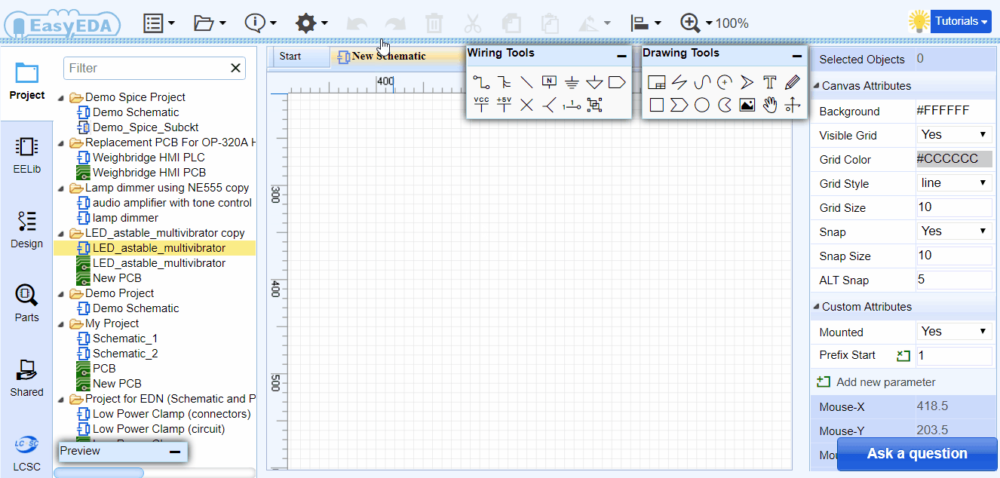

#### Cursor Style

 Some users don't like the cross cursor, so you can change it to arrow cursor like in the image below.

These difference between these options is as below: 

#### Clear

If you think your schematic or PCB looks terrible, and you want to redraw all units, you can:

- **Super Menu > Edit > Clear**.  
- Delete this schematic and create a new one.  
- Use **Global Delete** on the top toolbar **Tools**  
  

#### Left clicking

Similar to other EDA software: 

-   Click on an item to select it;
-   If over a selected item, click and hold to drag a selected item;
-   If not over a selected item, clicking and holding while dragging creates a selection box;
-   the selection box, using click and drag to the right, selects everything inside the box;
-   the selection box, using click and drag to the left, selects everything inside and intersected by the box;
-   Double click on a text area to edit it;
-   The exact left click functionality depends on what item is being selected and in what Canvas the item exists (Schematic or PCB).

#### Right clicking

EasyEDA does not support right click context menus in the Schematic or PCB Canvas. Instead, right clicking executes a context sensitive command:

-   When you are placing a symbol, after a right click, the active symbol will be removed;
-   When you are drawing a shape such as a polyline, after a right click, the polyline will be stopped at the place where you right click but the mouse will remain as a **cross**, so you can draw another shape;
-   To get out of the current active context sensitive command such as  placement or drawing mode and go back to **select mode**, just double right click.

**Ctrl+Right** clicking anywhere in the Schematic, waveForm or PCB Canvas drags the canvas around within the EasyEDA window.

#### ESC key

Pressing the `ESC` key ends the current drawing action but does not exit the current active context sensitive command mode (i.e. it does not return the cursor to select mode).

#### Select more shapes

-   Ctrl+left clicking on items adds those items to your selection;
-   Clicking and holding creates a selection box;
-   Creating a selection box, using click and drag to the right, selects everything inside the box;
-   Creating a selection box, using click and drag to the left, selects everything inside and intersected by the box;

#### Zoom in and Zoom out

-   Using the middle mouse button:
-   Roll forward to zoom in; 
-   Roll back to zoom out;
-   Using hotkeys, the default hotkey `A` for zoom in, `Z` for zoom out.

**Please note:**   
*Do not roll your mouse at the same time as pressing the CTRL key. Some browsers will zoom the whole site, not just the canvas in the EasyEDA window. If this happens, just press `Ctrl+0` to reset the browser zoom.*  

#### Double clicks

Double clicking any text area opens a resizable text box to allow you edit the text inline.

Press enter to create new line. Click outside the text box to close it.

#### Pan

-   Right click anywhere in the Schematic, WaveForm or PCB Canvas and Hold down right button to drags the canvas around within the EasyEDA window.
-   If your canvas is bigger than the EasyEDA window and is showing scroll bars, you can use either the scroll bars or the Arrow keys to scroll the canvas to pan.
-   When drawing a wire, a graphic line or shape that you wish to extend beyond the edge of the EasyEDA window holding down the left mouse button after starting the line will pan the canvas to keep the drawn item inside the window.

**Tip:**
*If you use Chrome, and cursor is in the canvas while pressing CTRL or ALT key and rolling your mouse, the canvas will move vertically, and when pressing SHIFT and rolling your mouse, the canvas will move horizontally.*

#### Rotate

After selecting one or more items, you can rotate the selected items using:

**Super Menu > Edit > Rotate** or click top ToolBar **Rotate and Flip > Rotate Left or Rotate Right**

or by pressing the default rotate hotkey: `Space`.

**Please note:**  
*Rotating a multiple selection rotates each item about its own symbol origin. It does not rotate the items about the centroid of the group of items.*

#### Flip

To place a Q2 as shown in the schematic below you need to Flip the item.

You can Flip one or more selected items using:   

**Rotate and Flip > Flip Horizontal or Flip Vertical**  from the toolbar,  

or by pressing the default flip hotkeys: `X` to Flip Horizontal, `Y` to Flip Vertical.

#### Align

EasyEDA provides many align option features, you can align your components or footprints very easily, it include:  

- Align Left
- Align Right
- Align Top
- Align Bottom
- Align Horizontal Center
- Align Vertical Center
- Distribute Horizontally
- Distribute Verticall
- Distribute Left Edges Equidistantly
- Distribute Top Edges Equidistantly
- Align Grid

#### Bring to Front and Send to Back

In the image below, both the rectangle and the ellipse are filled.

If you draw the ellipse before drawing the rectangle, the rectangle will overlap and therefore hide the ellipse. To reveal the ellipse, select the rectangle and then use:

**Align > Send to Back**  from the toolbar.

To bring the rectangle to the front again, you could select it and use:

**Align > Bring to Front**

or select the ellipse and then use:

**Align > Send to Back**

#### Documents Tab Switch

It's easy to fit your documents tab location.  
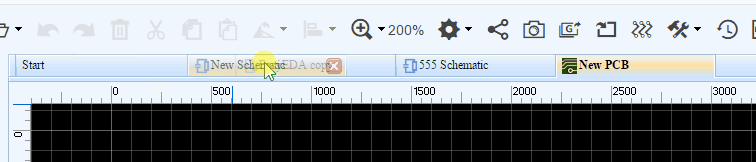

#### Saving Your Work Locally

Although EasyEDA saves all your files on our Server, sometimes you may want to save your work locally and EasyEDA provides a hack way to do this.

More detail you can view at [Export EasyEDA Source](./Export.htm#Export-EasyEDA-Source) section.

## About upgrade 

If you use EasyEDA online, it can seamlessly upgrade by itself. However,EasyEDA uses an App Cache technique to allow you to use EasyEDA offline ([W3C HTML5 Offline Web Applications](http://dev.w3.org/html5/offline-webapps/)) which may delay the automatic upgrading process. Therefore, if you want to upgrade to the latest version immediately, you can follow the two simple steps below.

1. Check the About... dialog; 

2. If the Built Date is older than 2017/06/01:

Close your browser open EasyEDA again.

If the Built Date is still showing older than 2017/06/01:

Close your browser and open EasyEDA again.

If the Built Date is at or newer than 2017/06/01, you don't need to do anything.

**Note:** **2017/06/01** *is just an example.*  

If those two steps don't work, you may need to clear your browser's cache:

**1.Mozilla Firefox**  

-  Go to “Preferences… > Advanced > Network > Offline Storage”,

  -Click on “Clear now”,

  -Reload easyeda again.

  

**2.Chrome**  

-  Open the following URL: **[chrome://appcache-internals/](chrome://appcache-internals/#)**   

-  Look for easyeda.com and click “Remove”  

-  reload easyeda again.  

      

-  Or you can use **Ctrl+shift+Delete** to delete Chrome caches.
   

## How to get help

It is easy to ask for help for any problem with EasyEDA, just click on **Let's Chat**, and then complete and Submit the Support request:

  

Please ask your questions in English or Chinese and don't worry if your English is not good! (Or your Chinese!)

1.  You can also ask your questions directly in the [EasyEDA forum](https://easyeda.com/bbs_lists_2.htm). We will try to respond to every post but please be patient. Maybe EasyEDA team is in a different timezone and we are a bit busy, so you may need to wait for a while.
2.  If you don't want your help requests to be public then you can drop us an email to [support@easyeda.com](mailto:support@easyeda.com)
3.  If maybe you have a design that you know worked in some other EDA package and you are having problems importing it to EasyEDA, let us know and we will take a look and try to help you to fix them.

**Please note that:**  
*EasyEDA team may not have the time or resources to help you fix all your problems; we may just be able to help you to fix problems commonly encountered by newbies, such as using a drawing polyline in place of a wire, finding a spice model for a simulation or selecting the right PCB footprint.*

[[1]](#ftnt_ref1) *Please note that although some browsers or plug-ins allow you to use gestures, EasyEDA does not work with gestures, so you should disable this function.*

[[2]](#ftnt_ref2) *Simultaneous editing is not yet fully supported: care must be taken because the last save by any collaborator overwrites all previous saves.*

[[3]](#ftnt_ref3) *It can also find the value text but it cannot step through multiple components with the same value.*

[[4]](#ftnt_ref4) *Take a few moments to think about your username because this is the name that other users will see on your designs and posts if you choose to share them or make them public. Once you have created an account, you cannot change your username.*

[[5]](#ftnt_ref5) *You can use upper and lower case letters, numbers and symbols to make a strong password but don't forget that the password entry is case sensitive.*

[[6]](#ftnt_ref6) *Except ordering of PCBs directly from EasyEDA.*

[[7]](#ftnt_ref7) *If you always open EasyEDA in the same browser on the same machine, your Anonymous files will appear under the Anonymous Files folder in the left hand panel but you should not rely on this as a way of keeping track of Anonymous files.*

Please email [support@easyeda.com](mailto:support@easyeda.com) when you need any help.

# Creating The Schematic 
During this tutorial we will to guide you in using EasyEDA Schematic capture.  
 

## Canvas Settings

You can find the canvas Properties setting by clicking on any the blank space in the canvas.

As described earlier, background and grid colours and the style, size, visibility and snap **attributes** of the grid can all be configured.

The canvas area can be set directly by the Width and Height or by using the available preset frame sizes.

### Grid

**Visible Grid** : Yes or No

**Grid Color**: Any valid colour

**Grid Style**: Line or Dot

**Grid Size**: To ensure proper alignment of all EasyEDA parts, it is advisable to set in 10, 20, 100.

**Grid** (and background) colour can be set directly by entering the hexadecimal value of the colour you want or by clicking on a colour in the palette that opens when you click on the colour value box:

### Snap

**Snap**: Yes or No. The default hotkey is G. Pressing this key toggles switching snap to grid on and off.

**Snap Size**: To ensure proper alignment of all EasyEDA parts, it is advisable to set in 10, 20, 100 but any valid number can work, such as 0.1, 1, 5.

It is strongly recommended that you keep **Snap = Yes** all the time. Once items are placed off-grid it can be very difficult to reset them back onto the grid. Off-grid placement can result in wires looking as though they are joined when in fact they are not and so causing netlisting errors that can be hard to track down.

If you need to draw detailed parts of new symbols or footprints that need to go between grid points, try to reduce the grid spacing to draw these elements and then reset the grid back to your chosen default value as soon as you have completed that part of the drawing. Setting Snap=No should only really be used as a last resort.

**ALT Sanp**: Snap size when pressing the `ALT` key.

## Wiring Tools

If you have hidden your tools , you can open them from here: 
Top toolbar **Config Gear Icon > Toolbars > ...**

**Note:** *All of the commands in Wiring Tools are electronics related. Don't use a wire when you just need to draw a line, shape or an arrow: use Drawing Tools instead.*  

### Wire

There are three ways to enter the wire mode in EasyEDA.

1.  Click the **Wire** button from the **Wiring Tools** palette.
2.  Press the `W` hotkey.
3.  Click on the end of a component pin (where the grey pin dot appears if you select the component): 

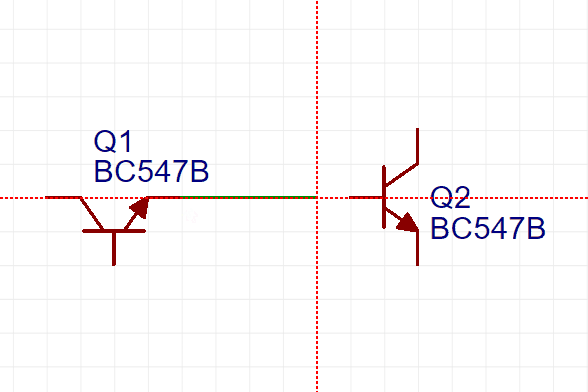 

EasyEDA automatically enters **Wire** mode.

Here is a screenshot of the **Astable Multivibrator LED project schematic** after wiring:

**Moving Components And Wires:**

If you place a component, such as a resistor, on top of a wire then the wire breaks and reconnects to the ends of the component.

When moving selected components using the mouse, they will drag attached wires with them (“rubber band”) to some extent but please be aware that the rubber banding feature has some limitations. When moving selected components most wire will move vertically and horizontally. Using the arrow keys will not rubber band. Selected wires do not rubber band.

A selected wire can be moved directly by clicking on it using the mouse or by the arrow keys. If a wire is selected by clicking on it using the mouse then green grab handles will appear at the ends and vertices.

### Bus

When you design a professional schematic, perhaps it will use a lot of wires. If you're wiring one by one, much time would be wasted, and then you need to use `Bus`.

  

### Bus Entry

If you decide to wire with `Bus` , the `Bus Entry` must connect to Bus and other nets with wires. such as in the above image.

### Net Label

**NetLabel and NetFlag**

**NetLabel** can be used to give your wires names to help you find them and identify any misconnections. You can find the **NetLabel** from the Wiring Tools palette or by using the `N` hotkey. When selecting the netlabel, you will find its attributes in the right hand Properties panel: 

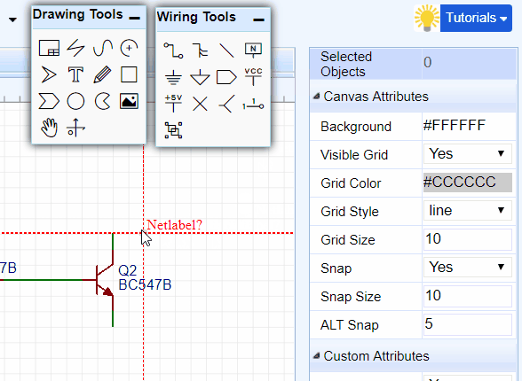

You can change its name and colour. If you only want to change its name, it may be easier to just double click the netlabel.

### Net Flag

**NetFlag** is the same as NetLabel, you can find the NetFlag from the Wiring Tools palette or using the `Ctrl+G` hotkeys for **GND** or `Ctrl+Q` for **VCC**. You can also change its name, for example from **VCC** to **VDD**:

The screenshot below is after adding NetLabels   

-	indicated by the little **egg marks**   
  -and a **GND** NetFlag   

This schematic is almost finished.

Wiring Tools palette provides NetFlag: Digital GND, Analog GND, VCC and +5V for your convenience.

### Net Port

When you don't want to route too many wires, how about trying  `Net Port` :  

It will make your schematic look more clean, and you just need to set each Net Port a net name.

### No Connect Flag

You can find the `NO Connect Flag` via wiring tool,   

,   

In the below schematic, if you don't add a `NO Connect Flag`, there is an error flag in the nets collection of the design manager. 

   

After adding a `NO Connect Flag`, the error disappears.  

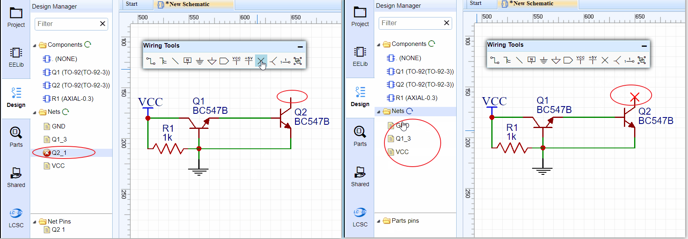  

**Note:** *`NO Connect Flag` only works on the symbol's pin directly.*

### Voltage Probe

 

EasyEDA provides a simulation feature for the schematic. After the simulation is running, you will see the waveform where you placed the voltage probes in the circuit.

For more detail about the simulation, please check the [Simulation](./SpiceSimulation.htm#Spice-Simulation) section.

### Pin

When you create a new symbol in schematic and schematic lib, you must use `Pin` to create pins for the new symbol, otherwise your symbol can't be wired with wires.

For more information please refer to the [Schematic Lib: Pin](./SchematicLibs.htm#Pins) section.

### Group/Ungroup

On the **Wiring Tools** palette there is the **Group/Ungroup Symbol…** button.

Just like the **Symbol Wizard**, this tool is also for you to quickly create schematic library symbols.

Using the **Symbol Wizard** you can only create generic symbols but how can you quickly and easily create symbols like these?

Here's how.

EasyEDA allows you to do something that very few other EAD tools support.

Using the `P` Hotkey, you are allowed to add a PIN directly onto the Schematic canvas. So you can add 8 Pins, draw a rectangle from the Drawing Tools palette and add 555 as text to form a symbol for the NE555 like the one shown below:

Now comes the clever bit.

Up to this point you have a collection of separate pins, a drawn rectangle and some text that are all separate items with no particular association with each other.

So now select all of the items and click the Group/Ungroup Symbol… button. A dialog will be opened:

After you click OK, all those separate elements will be grouped together to form your new symbol directly in the schematic.

Using the group function, you can create any symbol in the schematic, easily and quickly.

How cool is that?

So what does Ungroup do? Try selecting a symbol and then click the Group/ungroup command to see what happens!

**Note:** *The pin numbers and names cannot be moved independently of the pin.*

## Drawing Tools

### Sheet Setting

It is now possible to add design notes to the frame and the frame selection, for example A4, which can assist in aligning and improve the look of printed schematics and PCB designs. 

Click the frame button like in the image below, Or via: **Super Menu > Miscellaneous > Sheet Setting**

As illustrated in the image below:

  

And you can edit the blue text when you've selected the text attributes or double clicked it.

The bottom right zone can be selected and dragged or the frame can be dragged and deleted.

When you've selected the bottom right zone, you can edit the sheet attributes:
  

### Line

In the Schematic editor, you can draw a line with any direction. You can change its attribute as in the image below:

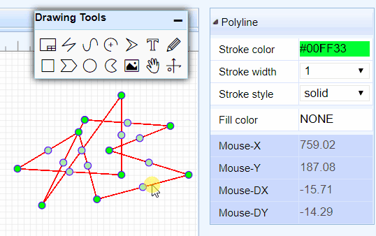  

### Bezier

With this tool, you can draw a pretty cool pattern.
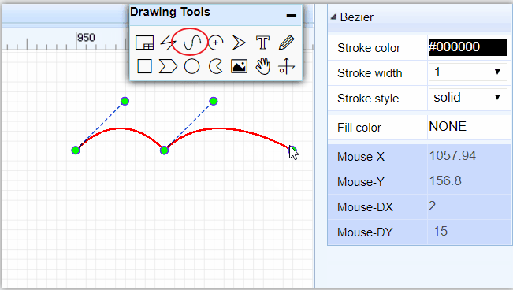  

### Arc

You can draw the arc of any shape.  
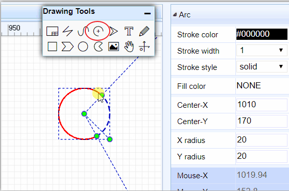 

### Arrow Head

You can add arrow head to marking text or important part.
 

### Text

Text attributes provide many parameters for setting:

-	**Text**: You can change text in inner box or double click the text. For every new text, the default text is `Text`.
  -**Color**: Defines text color.
  -**Font-family**: It provides 12 fonts for choosing.
  -**Font-Size**: Defines Text size.
  -**Font-weight**: Defines Text weight.
  -**Font-Style**: It contains (auto), normal, italic.
  -**Text-anchor**: It contains (auto), start, middle, end, inherit.
  -**Baseline**: It contains (auto), use-script, no-change, reset-size ... and so on.
  -**Text type**: types include comment and spice.

The editor will remember your last text parameters. 

 

### Image

When you select Image from the Drawing Tools palette, an image place holder will be inserted into the canvas:

Select the place holder, so you can see the image's attributes in the right hand Properties panel:

Set the URL of your image. For example, setting the URL to:

[http://upload.wikimedia.org/wikipedia/commons/thumb/c/c7/555_Pinout.svg/220px-555_Pinout.svg.png](http://upload.wikimedia.org/wikipedia/commons/thumb/c/c7/555_Pinout.svg/220px-555_Pinout.svg.png)

will make your image look like this:

Please note: at present, EasyEDA cannot host images, so you need to upload your images to an image sharing site such as [http://www.imgur.com](http://www.imgur.com).

### Drag

If you want to move some kind of parts and wires, you can use drag.  
Or you can select the parts and wires area first and move them.

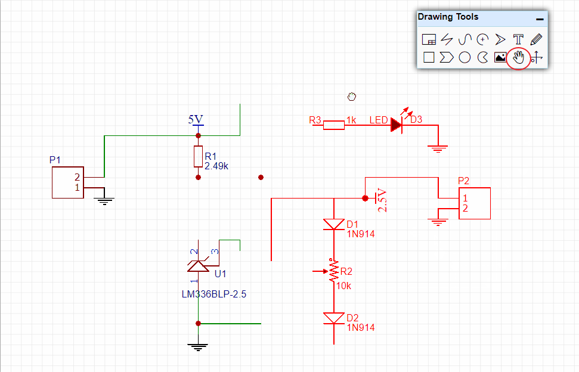

### Canvas Origin

Canvas origin default is set at left top corner of the schematic sheet, but you can set it where you want via Canvas Origin.  

For another way to set canvas origin, you can try **Super Menu > Miscellaneous > Canvas Origin**.  

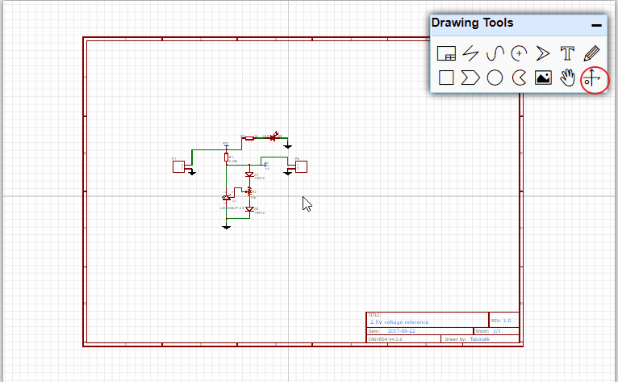

## Search symbols

On the left hand Navigation panel you will find "**EElib**" and "**Parts**" ,

1)  **EELibs** contains ready made symbols for a wide range of components and which can be simulated.

Many of these components have optional US and EU style symbols, we split them, so you can select those you like. Click on the drop down list or right click to popup the context menu, it contains many packages or parameters. EasyEDA will remember your choices for the next time.

Don't forget to use Filter to locate a component fast. For example, you just need to type `res` to find all of resistors:

2) **Parts**,  or press the hotkey combination `Shift+F`.  
then you will see a dialog as shown in the image below.
Simply type your part number or symbol's name to Search.

 

and then click the “Table of contents” to open the categories list to choose your components. 

From there you can scroll up and down to browse parts from each category.

Suppose you wanted the find the **MAX232** (which converts signals from an [RS-232](http://www.google.com/url?q=http%3A%2F%2Fen.wikipedia.org%2Fwiki%2FRS-232&sa=D&sntz=1&usg=AFQjCNFt_BArd4HZuR1QqCUxvKGW3ki3UA)  serial port to signals suitable for use in [TTL](http://www.google.com/url?q=http%3A%2F%2Fen.wikipedia.org%2Fwiki%2FTransistor-transistor_logic&sa=D&sntz=1&usg=AFQjCNFoI3eJYGc8PWqUdnfqHGREfTZccw)  compatible digital logic circuits). Simply type **Max232** into the Search box and press Enter:

When you hover the mouse over the picture of the Schematic symbol or PCB footprint, you will find a toolbar with ”Edit”, “Place”, “More” buttons.

**LCSC Assembly Components**

We add an LCSC Assembly Components option of the Parts, It's easy to choose which component can be assembled by LCSC. Yes, We  provide the assembly service.

**Place**:
For parts you use infrequently, you don't need to Favorite them; just Place it into your canvas directly.  

Note: 

- *EasyEDA supports multi-documents so please make sure that you are placing the part into the right (active) document. The active document is the one with the highlighted tab.*  

- *You can't place a Schematic symbol into a PCB file, or a PCB Footprint into a schematic.*

**Edit**:
If you want to create your own version of a symbol or footprint then you can open an existing part from the library to use as a template, edit it and then save it to your local **My Parts** library in **Parts** of the Navigation Panel.

**More**:
We can't promise that every component in the library is free of errors so please check all symbols and footprints carefully before you commit to a PCB order.

If you do find a mistake in a component, please [let us know(mail to support@easyeda.com)](mailto:support@easyeda.com) so that we can fix it.

Components with sub parts (multi-device packages).

When you find a component with sub-parts, you can't Place or Edit it, but you can Favorite and Clone it as your own part, which you can then edit.

### Find Components In The Schematic

Finding individual **components** in a dense schematic can be very time consuming. EasyEDA has an easy way to find and jump to components:

**Super Menu > Miscellaneous > Find Component…**

(or `Ctrl+F`)

  

**Note:** *You have to click OK in this dialog or use the Enter key.*

This feature will find, highlight and center in the window, parts by their Prefix (or reference designator).  However, it cannot be used to find net names or other text in a schematic.

This is where the Design Manager comes in.

**Left Navigation Panel > Design**, or use hotkey `ctrl+D`.

The Schematic Design Manager is a very powerful tool for finding **components**, **nets** and **pins**.

Clicking on a Component item **highlights** the component and pans it to the center of the window.

Clicking on a Part pins item brings up a temporary pointer:

## Placing Components

Find the component which you plan to place to your schematic, then move your mouse to the canvas and left click. If you want to add more, just left click again. To end the current sequence of placements, right click once or press `ESC`.

Don't try to Drag and Drop a component to the canvas: EasyEDA team thinks that Click-Click to place components will be easier to use than a Click-Drag mode.

## Rotating the Prefix and Value (Name) of components

The default Prefix and Value (or name) of EasyEDA components are horizontal. To change them to vertical like this...

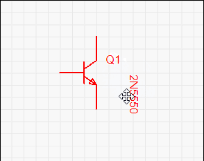

...Left click the prefix or value and when it is highlighted in **red** color, then press the **rotation** hotkey **Space** and you're done.

## Adjusting Components

About adjusting components you can:

1.  Move components with your mouse
2.  Move components with the arrow keys.
3.  Find components with the Design Manager via the `CTRL+D` hotkey: select the component in the Design Manager to pan it to the centre of the canvas and then move it with your mouse.
4.  Align the components:

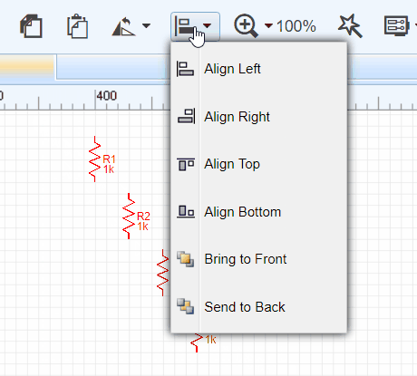

## Cross Probe

  

This tool is used to cross probe from chosen objects on the current schematic to its corresponding counterparts in the PCB, or from PCB Footprints to corresponding  counterparts in the schematic. 

**Note:** *You don't need to open PCB first before using cross probe in the schematic. Editor will open the PCB automatically.*  
And don't forget to use the hotkey `SHIFT+X`.  

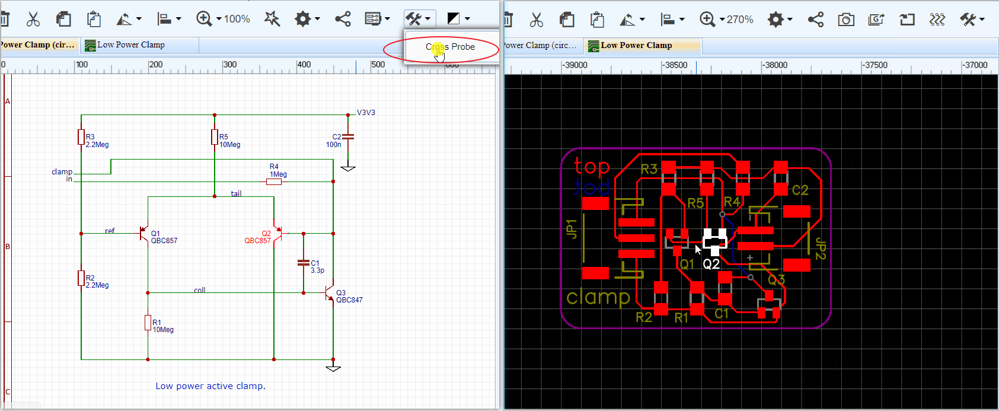  

## Multi-part Components

The number of pins on some components can be quite large. That's why it's easier to divide such a component into several parts or functional blocks. As a simple example, there are six gates in the 74HC04 Hex Inverter component. To avoid clutter in the schematic, GND and VCC pins of such components are usually served by a separate part of the component. This is really convenient as it doesn't interfere the working process with logical parts. The NetLabel names of VCC and GND Pin are usually hidden.

When placing the 74HC04 on a schematic, it will look like the screenshot below.   
**Note:** *The component Prefix will be in form of: U?.1, U?.2 etc.*

## Design Manager

With large schematics it can be hard to find the components quickly. Sometimes, you may make a mistake such as wiring to a wrong component pin. So you need a tool to help you out. **Design Manager** is just the tool.

Just press the `CTRL+D` hotkey to open the Design Manager.
or click it via on the left navigation panel:

1.  **Filter**: You can find your components or net name easily: for example, if you want to find all capacitances, you just need to type `C`;
2.  **Components**: Lists all the components in this schematic. Clicking on a Component item highlights that component and pans it to the center of the window.
3.  **Nets**: Lists all the nets in this schematic. A net must connect at least two Pins, or the net name will be marked as a red error.
4.  **Net Pins/Parts Pins**: Lists all the pins of the selected net name or components.

If you click the **Q1** Pin **1:VCC**, EasyEDA will show you where it is with a temporary marker from the top left of the canvas:

 

## Footprint Manager

Want to batch modify components? Can't identify the corresponding relationship between component pins and footprint pins? Don't worry, EasyEDA can do this.

There are two ways to open the footprint manager:

- Click top toolbar Tools icon:  
   

- Click the package input box of custom attributes when you've selected a component:  
  

1.Footprint manager will check your parts package correct or not automatically.  If the part without the package or this package doesn't exist in EasyEDA Libraries, or if the part's Pins doesn't correspond the package's Pads correctly, the footprint manager will show the red alert.  For example, If your part U1 has 2 pins, pin number are 1 and 2, pin name is A and B, but you assigned a footprint has 2 pads, [pad number](./PCB.htm#Pad) are A and B, the part's pin number doesn't match the pad number, so the the footprint manager will alert red, in order to solve this, method 1: [change part's pin number](./Schematic.htm#Pinmap-Modify-symbol-information) as A and B, method 2: change package's pad number as 1 and 2, method 3: find an other package and update.  

2.In the preview area, you can zoom in, zoom out and pan with mouse.

### Update Package

If you want to change the Package, for example, select a component such as Q1, from **TO-92** TO **TO220**, you just need to click in the package input box. EasyEDA will popup the footprint manager dialog. You can follow the instructions. 

-	Type **TO220** into the search box and search,   
-	Select the **TO220** package,   
-	Verify it in the preview box,  
-	then press the **Update** button.   

After that you will find you have changed the package to **TO220**.

**Note:** *To ensure that you use a package type that is already in the EasyEDA libraries, it is recommended that you use this technique to change component packages rather than just typing a package type directly into the package text box.*

**Batch Update/Modify Packages**

If you want to batch modify components' packages, in the footprint manager dialog you can press `CTRL` and select all components you want. If your schematic has many components, you should filter them first with package name. Such as in the below .gif which will show you how to batch modify resistors' packages from `AXIAL-0.3` to `0603`.  
If you want to use your own packages, you can select **My Parts** on Pattern Libraries area.

**Modify Pin Map Information**

And you can modify component's pin map information in here.

## Component Attributes

After selecting a component, you can find the component's attributes in the right hand Properties panel.

1.**Part Attributes:** You can change the **Prefix** and **Name** here，And make them **visible** or **invisible**.  
If you want edit this component, you can click **Edit Symbol**.
    

2.**Custom Attributes:** You can change *component's supplier*, *mounted or not*, *change package*, and *add new parameter*.

### Define BOM Parameters
After selected a schematic symbol, you can add a parameter, and you can mark it as `In BOM`, when you export a BOM file, you can find this parameter in CSV file.  

## Annotate

After creating a schematic, it is quite likely that you have component Prefixes (reference designators) that are in no particular order on the canvas. You may also have duplicates. You can automatically renumber all the components using the **Annotate** function.

**Super menu > Miscellaneous > Annotate**

Various Annotate possibilities  are available:

-   **Active Schematic only**: applies annotation actions to the current schematic only.
-   **All Opened Schematics**: applies annotation actions to all Schematics that are open in EasyEDA.

**Note:** *This option applies even if the opened schematics are from different Projects! If the project that you want to annotate has more than one schematic, you should open all of them and close any schematics that are open from other Projects.*

-   **Re-annotate all**: resets all existing annotation and then annotates all components again from scratch;
-   **Keep existing annotation**: annotates new components only (i.e. those whose reference designator finishes with ? like R? or U?).
-   **Direction**: Rows annotates across the schematic in a raster pattern from top left to bottom right; Cols annotates down the schematic in a raster pattern from top left to bottom right.
-   **Annotate**: applies the selected annotation actions. 

**Note:** *Annotation cannot be undone! if you do not accept the result: close all of the affected schematics without saving. If you do accept the result: make sure you save all of the affected schematics.*

-   **Reset**: if you want to reset all the reference designators to end with '?', just click the Reset button. After that, R1 will be R?, U1 will be U? etc.

**Note:** *Reset does not reset annotation back to where it was before pressing the Annotate button.*

 

## Symbol Wizard

How many times have you hit a schematic capture roadblock because you couldn't find a component symbol?

Well, in EasyEDA that would be never because the **Symbol Wizard** provides a quick and easy way to create a general schematic library symbol.   

The **Symbol Wizard...** command can be found in the top toolbar. 

Or **Super Menu > Miscellaneous > Schematic Library Wizard** in a new schematic lib document.

 

Using the **NE555** timer as an example: this device is available in a **DIP8** package so select **DIP**. Then enter the NE555 pin names into the **Pin Names** text box separated by new line or space, Then press OK. Abracadabra! As if by magic, you will find a perfectly formed dual in line 8 pin symbol for the NE555 attached to your mouse cursor, ready to be placed! You just need a few seconds to build a NE555 symbol, quickly and easily.

The EasyEDA Schematic Symbol Wizard allows you to create DIP, QPF or SIP styles symbols. If you are designing Arduino Shields then you will need lots of SIP symbol, so you can create a SIP symbol like the one shown below in a few seconds.

If you are not too worried that the symbols may not look quite the way people might expect and that they may not look anything like the **Package** type you enter, then of course you can use the wizard to create symbols for any component:

## Pinmap Modify symbol information

When you select a component, for opening the Modify symbol information dialog, you can do:

1.**Super menu > Miscellaneous > Edit Symbol...**;  
2.Or press the `I` hotkey;  
3.Or click the Edit Symbol on the Parts Attributes on the left panel.  

Using this dialog you can edit the pin names and numbers, for example, to suit a different package or device variant. You can also enter a Spice Prefix and swap the spice Pin order to make your symbol usable in simulation.   

More detailed description of PCB and Spice Prefixes and pin numbers at next section.

## Prefix Start
Every **NEW** schematic file has a `Prefix Start` custom parameter, some users would like use  **multi-sheet designs**, but they hate every prefix start by 1, they hope one schematic start by 1, next start by 100, 200, 300. So you can use this solution.

## Prefixes And Pin Numbers 

Device and subcircuit (or hierarchical block) symbols created for use in schematics that are intended to be run as spice simulations, in addition to having a PCB Prefix that is used for the reference designator in the schematic, also have a **Spice Prefix**. They also have two sets of pin numbers: PCB pins and Spice pins.

### PCB And Spice Prefix 

The rules on the assignment of the PCB Prefix or reference designator of a schematic symbol are somewhat dependent on the EDA tool and on the user's preferences. Depending on how a device is graphically represented by its schematic symbol it may have a different **PCB Prefix** or** reference designator**. For example, a single discrete MOSFET device may have a PCB Prefix of Q, M or perhaps TR, whereas if it is part of a monolithic multiple transistor array it may have a PCB Prefix of U or IC.  

The rules on the assignment of the **Spice Prefix** of a schematic symbol are strict. This is because the Spice Prefix is used to tell the simulator which circuit element the symbol represents and therefore which simulation model it is to use.

Simulation models for most of the spice circuit elements are in the form of a single-line .model statement however some of them may be in the form of a multi-line .**subckt** subcircuit definition. For example, some MOSFETs may be described by a .model statement in which case their Spice Prefix is **M** but many MOSFETs are described by a .subckt and so their Spice Prefix is **X**.

Therefore, irrespective of the PCB Prefix chosen for a schematic symbol, the Spice Prefix for a schematic symbol representing a given circuit element must match the type of model required to simulate that instance of that circuit element in your schematic.

For example, if you have two different n-channel MOSFETs in a schematic; Q1, a BSS123 which is modelled by a .model statement:

BSS123*SRC=BSS123;DI_BSS123;MOSFETs N;Enh;100V 0.170A 1.00ohms  Diodes Inc.

MOSFET

	.MODEL DI_BSS123  NMOS( LEVEL=1 VTO=1.00 KP=6.37m  GAMMA=1.24
	+ PHI=.75  LAMBDA=625u RD=0.140 RS=0.140
	+ IS=85.0f  PB=0.800 MJ=0.460 CBD=19.8p
	+ CBS=23.7p  CGSO=36.0n CGDO=30.0n CGBO=124n  )
	*   -- Assumes default L=100U W=100U --
	and Q2, a BSS127S which is modelled by a .subckt:
	BSS127S*---------- BSS127S Spice Model ----------
	.SUBCKT BSS127S 10 20 30
	*     TERMINALS:  D  G  S
	M1 1 2 3 3 NMOS L = 1E-006 W = 1E-006
	RD 10 1 84.22
	RS 30 3 0.001
	RG 20 2 29
	CGS 2 3 1.958E-011
	EGD 12 0 2 1 1
	VFB 14 0 0
	FFB 2 1 VFB 1
	CGD 13 14 2E-011
	R1 13 0 1
	D1 12 13 DLIM
	DDG 15 14 DCGD
	R2 12 15 1
	D2 15 0 DLIM
	DSD 3 10 DSUB
	.MODEL NMOS NMOS LEVEL = 3 VMAX = 8E+005 ETA = 1E-012 VTO = 3.419
	+ TOX = 6E-008 NSUB = 1E+016 KP = 0.127 U0 = 400 KAPPA = 1.044E-015
	.MODEL DCGD D CJO = 1.135E-011 VJ = 0.9232 M = 0.9816
	.MODEL DSUB D IS = 2.294E-010 N = 1.601 RS = 0.1079 BV = 65
	+ CJO = 1.956E-011 VJ = 1.514 M = 0.8171
	.MODEL DLIM D IS = 0.0001
	.ENDS
	*Diodes BSS127S Spice Model v1.0 Last Revised 2012/6/6

then even though both have the same PCB Prefix of **Q**: Q1 must have a Spice Prefix of M and **Q2** must have a Spice Prefix of **X**.

A list of Spice Prefixes and their associated circuit elements is given in the table below.

For more information on circuit elements in Ngspice, please refer to:

[http://ngspice.sourceforge.net/docs/ngspice-manual.pdf#subsection.2.1.2](http://ngspice.sourceforge.net/docs/ngspice-manual.pdf#subsection.2.1.2)

### PCB and Spice pin numbers 

The two sets of pin numbers are:

-   PCB pin number: these are the numbers for the real, physical device pins in its package. They are required so that the pins of a device symbol in a schematic can be mapped onto the physical pins of a PCB footprint. In other words, so that the connections shown in the schematic, end up connected properly by copper on the PCB.

-   Spice pin number or pin order:  these are the numbers that map the pins on the symbol to their respective functions in the spice model or subcircuit.

Actually the spice pin ordering has a slightly deeper meaning.

Spice has no concept of component symbols: they are a construct of the schematic editor.

When a spice netlist is generated, the symbol in the schematic editor is either - in the case of model defined devices such as resistors, capacitors, inductors, diodes, transistors and sources - mapped directly to the relevant models (defined by the device prefix such as R, C, L, D, Q and so on), or in the case of a subcircuit, converted into a subcircuit call statement.

The spice pin ordering for the majority of built-in models such as resistors, capacitors, inductors, diodes, transistors and sources are defined and generally taken care of by the schematic editor, more care has to be taken with the spice pin ordering of subcircuits.

This can be illustrated by a simple opamp with 5 pins: inverting and non-inverting inputs; output and positive and negative supply pins but the principle applies to all spice subcircuits.

The subcircuit call for this opamp might look like this in the spice netlist:

X1 input feedback vpos vneg output opamp_ANF01

where:

X1 is the name of the subcircuit in the top level (i.e. the calling) circuit;

input feedback vpos vneg output are the netnames in the circuit calling (i.e. containing) the subcircuit and

opamp_ANF01 is the name of the subcircuit being called.

Pay special attention to the order of the netnames in the subcircuit call.

The spice pin ordering for the majority of opamp subcircuits is like that shown

in the example below:  
​	

	*

	* opamp_ANF01

	*

	* Simplified behavioural opamp

	*

	* Node assignments

	*                    noninverting input

	*                    |   inverting input  

	*                    |   |   positive supply

	*                    |   |   |   negative supply

	*                    |   |   |   |   output

	*                    |   |   |   |   |

	* spice pin order:   1   2   3   4   5

	*                    |   |   |   |   |

	.subckt opamp_ANF01 inp inn vcc vee out ; these are the netnames

	*                                         used internally to the

	*                                         subcircuit.

	B1 out 0

	+ V=(TANH((V(inp)-V(inn))*{Avol}*2/(V(vcc)-V(vee)))*(V(vcc)-V(vee))

	+ +(V(vcc)+V(vee)))/2

	*

	.ends opamp_ANF01

	*

**Note:** *The spice pin order of the subcircuit call is in exactly the same order as that of the subcircuit.*

Although the physical pin numbering of any device is critical for successfully mapping the pins on a schematic symbol onto a physical package footprint when laying out the PCB, because spice only knows about single devices and does not care about how they are physically packaged, each instance of any device in a spice schematic has to be mapped onto its own copy of the spice model or subcircuit, irrespective of where it is in any physical package.

Therefore, for the physical, package pin numbering of the four opamps in a quad opamp in say, a **SOIC14** or a **DIP14** package, as shown below, to work with the example subcircuit above, the spice pin ordering would be:

	Opamp A         pin number         spice pin order

	OUT                1                5

	IN-                2                2

	IN+                3                1

	V+                4                3

	V-                11                4

	Opamp B         pin number         spice pin order

	OUT                7                5

	IN-                6                2

	IN+                5                1

	V+                4                3

	V-                11                4

	Opamp C         pin number         spice pin order

	OUT                8                5

	IN-                9                2

	IN+                10                1

	V+                4                3

	V-                11                4

	Opamp D         pin number         spice pin order

	OUT                14                5

	IN-                13                2

	IN+                12                1

	V+                4                3

	V-                11                4

The physical package pin numbering reflects that of each opamp in the package.

The spice pin ordering is the same for each instance of the individual opamps.

Of course there is only one physical instance of each supply pin on the schematic symbol for the quad opamp in this example but each spice subcircuit must have the supply pins explicitly defined.

Exactly how this is handled is at the schematic symbol level depends on how the schematic capture package handles symbols for multiple devices with shared supply pins but the generation of a spice netlist from the schematic will always generate the complete set of pins required in the subcircuit calls.

In cases where the subcircuit is built by the user  as opposed to where it is supplied by a vendor for a particular device, exactly the same rules apply except that it is up to the user to specify the subcircuit pin order and to construct the symbol appropriately.

Although as described earlier, built in spice models usually have defined spice pin orders, not all  subcircuits have the same spice pin numbering. Therefore if your spice circuit throws errors - especially if there are warnings about pin numbers or pin names - it is worth remembering to check that the pin order of the symbol that is netlisted to form the calling statement matches that of the subcircuit that is being called!  

----------​

[[8]](#ftnt_ref8) In Debian based distributions gerbv is listed under Electronics in the package management system. The version in the repositories may be an earlier version but some users may find it easier to install than the SourceForge archive.

[[9]](#ftnt_ref9) As is the opamp_ANF01 example above

## Prefix Conflict Error

Sometimes, when you convert a project to PCB, open the Design manager or run a simulation, you will get a Prefix Conflict error message.

In this schematic, you will find two components with the R4 reference designator, so you just need to change one to Rx where x is a unique number in that schematic.

It may be tempting to backup a schematic into the same project as the original, however, if an attempt is then made to do Convert Project to PCB, you will get the Prefix Conflict error for every component.

In the above image, you can find the two identical copies of the same schematic, which when you Convert Project to PCB, EasyEDA will try to merge into a single schematic, so every item will have 2 copies.   
To fix this, you just need to create a backup project and remove or better still save backup copies of your schematics to that project.

## Net Name Conflict Error

Sometimes, when you convert project to PCB, open the Design manager or run a simulation, you will get a **Net Name Conflict** error message.

In this schematic, you will find four net label/net flag(EasyEDA takes volprobe, GND VCC as netlabel too) in the same wire, So you must remove the others.

If you would like to probe a GND, you can use [Probe command](./SpiceSimulation.htm#Probe)

## Converting Schematics To PCB

Most of the time, schematics are created with the aim of producing a PCB. So how do you convert your schematic to a PCB in EasyEDA? You just need to to click the PCB icon on the toolbar with the title **Convert project to PCB**.  

**Note:** *Before converting, you need to use the Design Manager and Footprint Manager to check all the components, nets(connection) and packages/footprints to ensure no errors exist.*

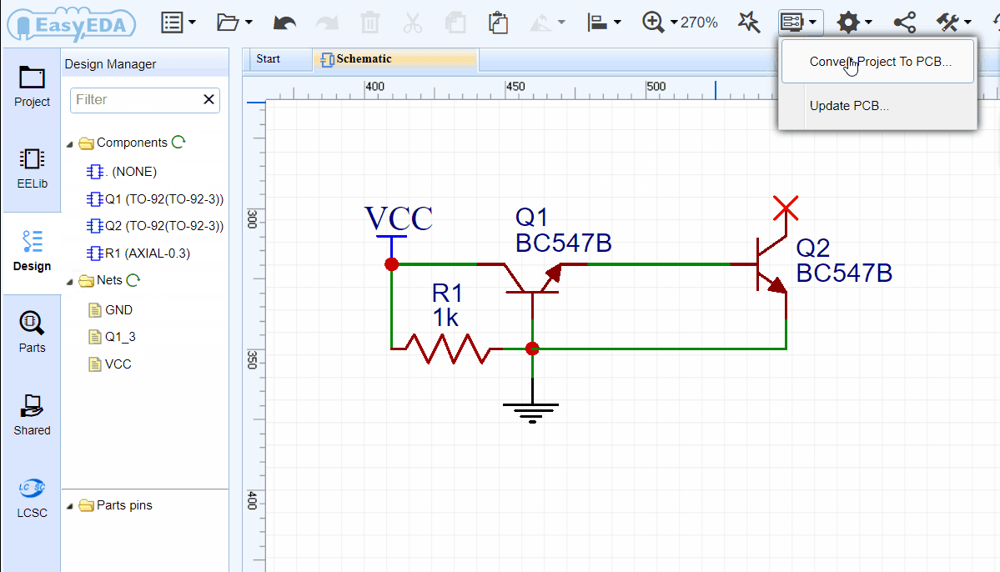

### PCB Libs search order 

To find PCB footprints to match the package type attributes of your Schematic symbols, EasyEDA will search the available PCB libraries.   

EasyEDA will search your own PCB Libs from the **My Parts** section first. If it doesn't find a matching footprint there then it will search in the System PCB Libs. 

So, for example, if your symbol calls up a “**TO220**” package, you have a **TO220**  package in your My Parts section and there is a “**TO220**” package in the system PCB Libs, then EasyEDA will use the  “**TO220**” package in your My Parts and ignore the system PCB Lib.

### Verify Packages and Build PCB 

After clicking the **Convert project to PCB** button, if the project has errors the following dialog will open:

The row in red indicates that EasyEDA can't find a PCB footprint matching the Package that the schematic symbol is calling for.   

This could be because you have made an error entering the package attribute in the symbol's Properties or maybe you haven't yet created a PCB footprint for the package that your symbol is calling for.   

In this case the package should have been **TO-92(TO-92-3)** but instead it is empty. To correct it you can click on the row and change it to **TO-92(TO-92-3)**.

After making any necessary corrections, click the **Convert project to PCB** button and EasyEDA will automatically load all the package PCB footprints into the PCB editor as shown in the image below.

This shows the footprints placed in arbitrary positions with the connections between them shown as blue Rat lines.

### Update PCB

Converting a schematic to PCB can be done using the `Convert Project to PCB...` , but if you do modifications to the schematic, by using the `Update PCB` button you can immediately be passed forward to update the selected PCB without having the PCB editor window already open or without creating a new PCB file.   
      

## Hierarchy

EasyEDA does not support true hierarchical designs but it does support **multi-sheet designs**. You can put several schematics in one project with connections between made by netlabels. All nets in EasyEDA are global so if you create a netlabel DATA0 in schematic A and then create a netlabel DATA0 in schematic B, when Schematic A and schematic B are in the same project, they will be connected.

**Multi-sheet designs**(equivalent to a circuit spread over several pieces of
paper), all schematics under the same project will be merged into one when be converted to PCB connecting in **netlabe**, **netflag**. 

**Note:**   
*Please make all of the prefixes unique, if the Schematic A has a R1, and the Schematic B has a R1, then you will get a [Prefix Conflict Error](/Doc/Tutorial/introduction.htm#Prefix-Conflict-Error) on above section.*

**Tip:**   
*Every schematic's prefix will start from 1, such as R1, C1, U1 etc.*   
*1. you can use [Annotate](/Doc/Tutorial/schematic.htm#Annotate) to fix prefix.*  
*2. You can set the prefix start to 100, then your components will start from R100, C100.*   

## Modules

Copying codes is an easy job for coders, now copying and reusing a schematic or PCB is easy.
Take a power supply unit for example, you can save this unit as a schematic module.

 

After saving, you can find it at the **Parts > My Modules** section. And you can place the whole block to your schematic.

  

## BOM/Netlist

### Export BOM

You can **export** the Bill of Materials (BOM) for the active schematic (Document) and PCB or for the active project (i.e. the BOM for all the sheets in the project) as shown below，click the top toolbar `BOM` icon:

After clicking the BOM export option, the dialog below will open.

In this dialog，you can assign LCSC part's order code for your components.

After clicking on the assign icon，the components and packages search dialog will pop up, and you can choose which component you want to assign.

When you click "Export BOM at LCSC", we will help you to list all the components of your BOM,  If you want to buy the components form LCSC, and you just need to put them to the cart and check out.  
  

And Click the "BOM" button to download the BOM file. You can open it in any text editor or spreadsheet.

### Export Netlist

EasyEDA can export the netlist for the active schematic (Document) and/or for the whole active project:

**Super menu > Miscellaneous > Netlist for Document or Netlist for Project**

EasyEDA can export a netlist in a variety of formats: 

-   **Spice**: this is a Spice3f5 compatible netlist generated by the simulation engine of EasyEDA, [Ngspice](http://www.google.com/url?q=http%3A%2F%2Fngspice.sourceforge.net%2Fpresentation.html&sa=D&sntz=1&usg=AFQjCNEvVOggHskD819G-5EW8EB59FL5mw). It is not normally used as the basis for as a PCB layout.
-   [KiCad](http://www.kicad-pcb.org/): a PCB netlist in a format that can be imported straight into Pcbnew, the PCB layout tool part of the free, open source cross-platform EDA suite.
-   **Altium Designer**: a PCB netlist in a format that can be imported straight into Altium Designer and it's predecessor, Protel. 
-   **Pads**: a PCB netlist in a format that can be imported straight into Pads PCB layout tools.
-   [FreePCB](http://www.freepcb.com/): a PCB netlist in a format that can be imported straight into FreePCB, a  free, open source PCB editor for Windows.

# Creating the Schematic Libs

Using **Symbol Wizard** and **Group/Ungroup...** is a quick way to create schematic symbols but they are placed directly into the schematic that they are built in. It is possible to reuse them by copying them (`CTRL+C` hotkeys) from the schematic they were created in and then cross-document-pasting them (`CTRL+SHIFT+V` hotkeys) into a different schematic but this quickly gets messy if you need to copy symbols that were created in several different schematics. OK, you could keep copying new symbols into a dedicated “symbol library” schematic sheet to save searching for them but EasyEDA offers you an easier way to create and manage your symbols in a library.

Start a new Schematic Lib as shown below or by doing:

**Document > New > Schematic Lib**

This opens the New Schematic Lib symbol editor.

You can now create a symbol using Symbol Wizard as before or draw it using the Drawing Tools palette and add pins using the `P` hotkey (except that you no longer need to use **Group/Ungroup...**).

Then you can edit the pin map using:

**Super menu > Miscellaneous > Pin Map...**

Note the Origin Point. To simplify rotating and flipping your symbols when they are placed into a schematic, make sure all of your symbols are created as near as possible centered around that point.

## Pins

Symbols pins are the most important part of any Schematic Lib symbol. They are the things that allow wires to be attached to symbols to connect up your circuit.

You can use the **P** hotkey to add a Pin or from the toolbar:

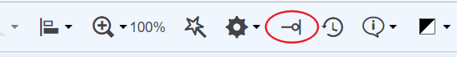

Before placing it on the canvas, you can use the rotation hotkey or rotate and flip from the menu to rotate it to the right orientation. Make sure the **Pin Dot(black dot)** is in the right position. The **Pin Dot** will be used to connect your wires or netlabels. Whenever a PIN is either placed as directly onto the canvas or as part of a symbol, the mouse has to point to the **Pin Dot** position to automatically start the Wire mode or to join a wire to it.

Whenever a Pin is placed as part of a symbol, the **Pin dot** should be **outside** of — and pointing away from — the symbol like in example 1(correct position), inside or pointing towards the symbol as shown in example 2(wrong position).

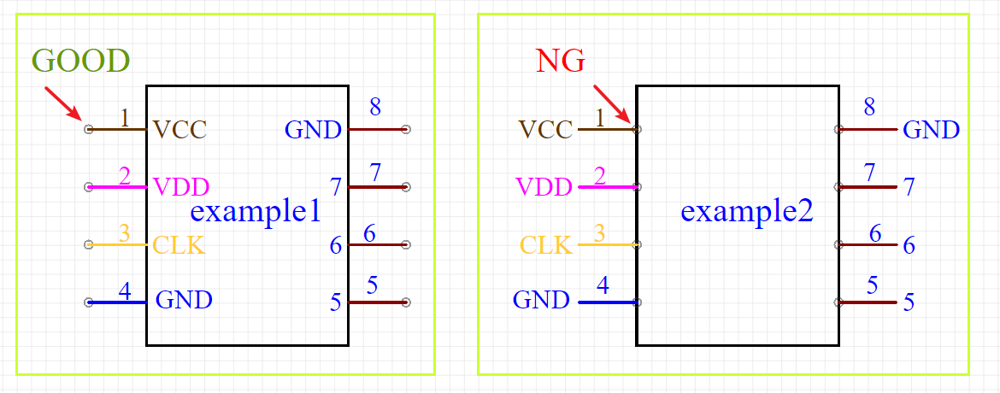

When you select a single Pin, the **Pin attributes** will be shown in the right hand **Properties** panel:

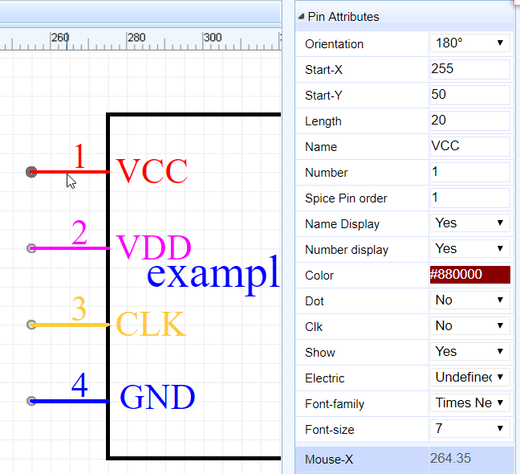

**Orientation**: 0°,90°, 180° and 270°。If you want to create a 45° pin, you need to set it length as 0, and draw a line with 45°。

**Start-X and Start-Y**: The pindot position. Sometimes it may be difficult to move the pin to the desired position using the mouse, so you can move the pin via Start-X and Start-Y.

**Length**: Pin length.

**Name**: In this example, *VCC* is the name of the Pin.

**Number**: In this example, *1* is the number of the Pin. This number is the pin number of the device in a physical package and so will be the pin number used in the device footprint for that device in that package in your PCB lib.

Note that you can use alphanumeric identifiers such as; A1, B1, C1, A2, B2 and so on as the Number.

**Spice Pin order**: These are the pin numbers used to connect your symbol to the corresponding pins defined by the .model or .subckt used to simulate your device. The pin numbers of the simulation model may be different from the physical package pin numbers and - unless the model is specifically created to model multiple devices in a single package - do not change for different instances of a device in a multi-device package. The Spice Pin order must be **numerals** only.

For more information about Spice Pin order please see the section on [Prefixes And Pin Numbers](./Schematic.htm#Prefixes-And-Pin-Numbers).

**Name Display**: If you don't want to show *VCC*, switch it to NO.

**Number Display**: If you don't want to show *1*, switch it to NO.

You can adjust the Name or Number position using your mouse but note that rotate and flip applies to the whole pin including the name and pin number; these items cannot be rotated and flipped independently of the pin itself.

Note also that rotate and flip actions do not result in upside down or mirrored pin number or names.

**Color**: You can set the Pin to different colours, such as *PIN3:CLK* as orange and *PIN4:GND* as blue. In this example, the PIN1 is set as color `#880000`, but it shows as red, because it is selected. After deselecting it, the pin will appear color `#880000`.

**Dot**: adds a circle to the inside end of the pin to indicate logical (or analogue) inversion.

**Clk**: adds a `>` to the inside end of the pin to indicate that the pin is logical clock input.  

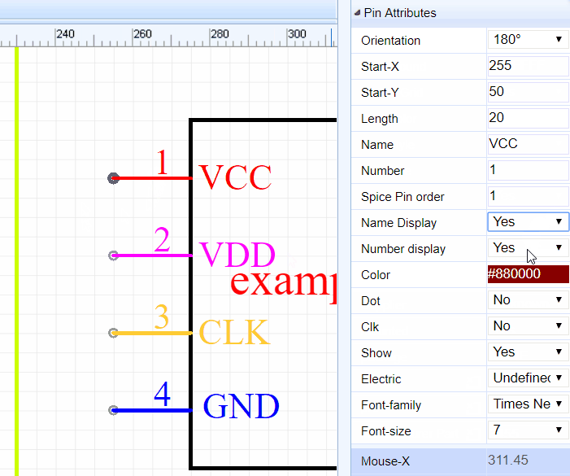

**Show**: YES/NO. Allows you to hide the pin. When set it to NO, this Pin will be hidden when the symbol is placed on the schematic editor canvas.

Note that the pin is not hidden here in the Schematic Lib symbol editor canvas because if it was, it would disappear from view and so how would you find it to make it visible again? For the same reason this option has no effect in symbols made using Group/Ungroup…

*We may not have thought of everything in EasyEDA but we do try.  :)*

**Electric**: [Undefined, Input, Output, I/O, Power] 

EasyEDA provides Electrical Rules Checking (ERC) right now, But you still need to set electric of your Schematic libs. 

If you set the PIN as Power and set the pin to be hidden, then the Pin will be connected by Name which is the NetLabel. If the Name is VCC, it will be connected to the net in your circuit with the NetLabel or NetFlag VCC. This is helps to keep the schematic clear and uncluttered when using Multi-part Components.

After created the Lib, use `CTRL+S` will open the save dialog:

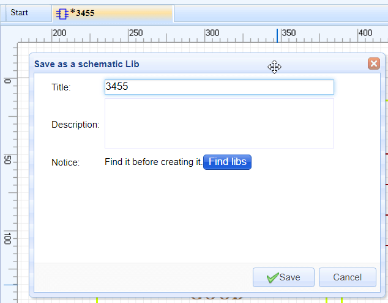

After clicking **Save**, you will see it appears in **Parts > My Parts > Schematic Lib** of the left hand Navigation panel.  
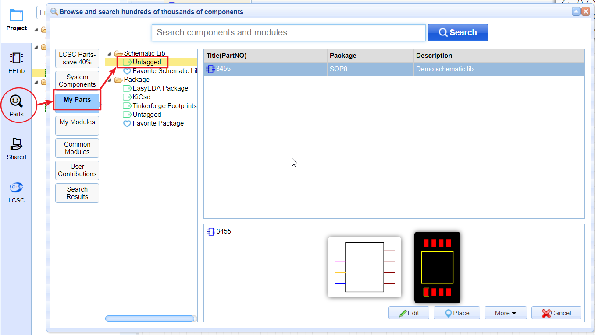

You can add a tag for your new symbol: **Parts > My Parts > Schematic Lib > Select New Lib > More > Modify**, otherwise it will appears on **Untagged**.

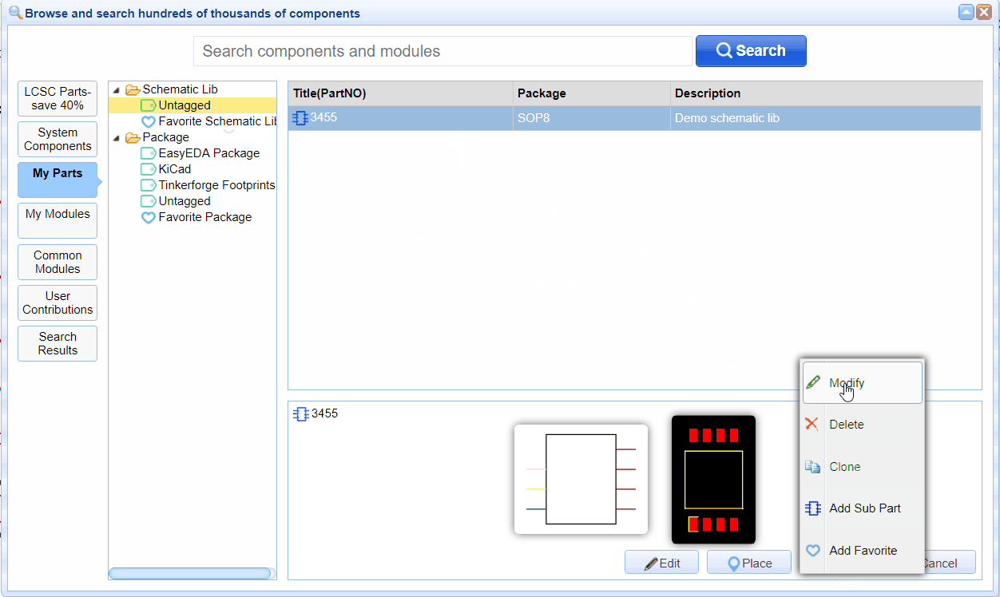

## Subparts

We have already touched on how EasyEDA can support **Multi-part Components**  but how do you create **multi-part components**?

EasyEDA provides a sub parts facility to do this.

After creating a part, you can right click the part in the My Parts section to pop up the content menu.

Suppose you have created your own symbol for a 74HCT04 hex inverter.

Right Click **Add sub part** and that will add 74HCT04.*1*,  

Click again to add 74HCT04.*2* , up to 74HCT04.*6*. 

Then double click on each sub part in turn to modify the Pin Name and Number attributes.

Easy or what?

## Custom Attributes

In the Schematic Lib editor's canvas Properties panel, you will find a **Custom Attributes** section:

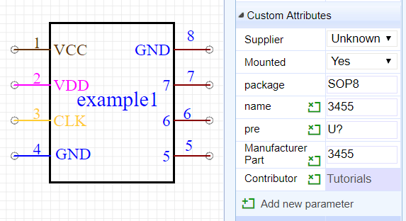

**Mounted**

You can control this part mounted or not on the PCB. If you choose No, this component will not appear in the BOM report.

**Package**

If you would like to built a PCB, you need to assign a package for your schematic Lib symbol. Although there are other ways to do this in EasyEDA, here is the right place to do it.

Click in the **Package** input box, and the  **Parts** dialog will open as used to do this task in the Schematic Editor.

**Prefix**

The default Schematic symbol Prefix is **U?** If you create a resistor, you can set the Prefix to **R?**

**Name**

You can change the schematic lib's name here, it is can be different from the part's file name.

**Contributor**

This is your registered user name. Other EasyEDA's users will remember your contributions!  

​
# Spice Simulation

## Build the circuit 

To simulate your circuit, at least until you become more familiar with the idea and concepts of simulation, first you should build a circuit as described in the chapter on **Creating The Schematic.**

The circuit below is the **simulation schematic** for the **Astable Multivibrator LED project**:

Now, to make your circuit simulatable, you should note that:

1.  You do not have to draw the whole schematic again from scratch. You can `CTRL+C` copy the schematic you have already drawn for the PCB layout and `CTRL+SHIFT+V` paste it into a new schematic canvas and then save it into a new Project folder (with maybe the same name but with “simulation copy” or something added to the end to avoid the Design Manager flagging up duplicates or you accidentally editing the original);

2.  You should then remove anything from the schematic that you do not want to include in the simulation. Connectors and mechanical items such as heatsinks and often manually operated switches can be removed. (Although there are situations where these items may need to be included in the simulation; that is getting off the topic and into advanced simulation territory so we will leave it there for the moment…)

3.  You may want to replace a simple battery or - to simplify the simulation, reduce the size of the simulation output file and reduce the simulation time, a complicated power supply - with a simple spice V voltage source. You will almost certainly need to add some sort of voltage or current signal input source such as a simple SIN or PULSE source or maybe something more complex such as the EasyEDA electret microphone model, a guitar pickup model, a photodiode or an optoisolator. If you are simulating a power supply or a power amplifier of some sort, you may also need to add a representative load of some sort. Unless you are specifically simulating the effects of wiring impedances for Power Integrity, you can usually omit any power supply decoupling capacitors hung directly off the supply rails: they have no effect, clutter up the circuit, generate lots of useless output data and add to the simulation time;

4.  Your circuits **must** have a **GND** net. You can use a NetLabel or NetFlag to add one. You can call this net GND or 0 (the numeral zero);

5.  You should use the Schematic Design Manager to help verify that your circuits are wired correctly. It can be hard to debug wiring errors from the Simulation Results... dialog error messages;

6.  As you draw a schematic, EasyEDA assigns default net names to all the wires. Any section of wires that are joined will be assigned the same net name. This is how EasyEDA “knows” that those wires are joined together.

These default net names are usually of the form N001, N002, etc.

Adding NetLabels to name nets (wires or nodes) which you would like to observe (probe) makes it much easier to identify traces when the simulator shows them in WaveForm. Remember that in any circuit, you may want to probe the voltages on nets other than the obvious Input or Output nodes that may be the nets you first think you will want to probe.

## Probing voltages and currents

To probe voltages, you can add some Voltage Probes which can be found in the Wiring Tools palette. These will appear on your schematic auto-numbered as volProbe1, volprobe2, etc.

When you place a voltage probe onto a net, the name you give the voltage probe will overwrite any name that is already assigned to that net. So if you place a voltage probe called foo on a net call bar, that net is renamed to foo.

Therefore it is strongly recommended that you change the name of the voltage probe to be identical to the name of the net onto which you then place that probe (except for the letter case which is ignored).

If this net name is used somewhere else in the simulation - for example in an expression for an arbitrary source - then it is possible that the voltage probe name overwriting the net name will break the expression and so the simulation will give unexpected results or throw errors. Giving voltage probes identical names to their target nets avoids this problem.

It is also recommended that you name all nets because if you have used an EasyEDA-assigned default net name in an expression then, if you edit the schematic, say to insert an extra resistor or a current probe, then EasyEDA will reassign the default net names to different nets. This breaks the expression and so the simulation will give unexpected results or throw errors.

To probe the current in a wire you can place an instance of the Ammeter component, from the EasyEDA Libs, in series with the wire.

For an alternative method of probing voltages on nets and currents through the EasyEDA Ammeter component, see [Probe](#h.tqz4ifmtwxqz).

## Checking models and subckts

You then need to check that all the devices in the simulation schematic have the necessary and the correct spice models and/or subckts.

Missing spice models and subckts will be indicated in the Simulation Results… dialog after attempting to run a simulation but it is much easier to do this before you try to run a simulation.

Simple components such as resistors, capacitors and inductors do not pull models into the netlist because their models are built-in to Ngspice at a very low level but almost all other components will pull in either a .model statement or a set of line enclosed in the .subckt … .ends spice keywords.

By looking at the spice netlist that is generated as a simulation schematic is being created,

**Super menu > Miscellaneous > Netlist for Document > Spice…**

or

**Super menu > Miscellaneous > Netlist for Project > Spice...**

it is easier to check that each component in the schematic has pulled into the netlist an associated .model statement or .subckt … .ends block of lines.

In the astable example spice netlist below, Q1 - Q4 are 2N3904 devices which all pull in - and share - the .model 2N3904 statement.

Similarly, D1 - D3 are the same LED device and pull in the shared .model LED statement.

Astable Multivibrator simulation copy

	.param pi = 3.141593
	V1 VBUS GND  5
	R7 D3A VBUS  1k
	R6 D2A Q4E  1k
	R5 Q3C VBUS  10k
	R4 Q3B VBUS  100k
	R3 Q2B VBUS  100k
	R2 Q2C VBUS  10k
	R1 D1A Q1E  1k
	Q4 VBUS Q3C Q4E 2N3904
	Q3 Q3C Q3B GND 2N3904
	Q2 Q2C Q2B GND 2N3904
	Q1 VBUS Q2C Q1E 2N3904
	D3 D3A GND LED
	D2 D2A GND LED
	D1 D1A GND LED
	C3 GND VBUS  10u
	C2 Q2B Q3C  10u
	C1 Q2C Q3B  10u 
	
	 
	.MODEL 2N3904 npn
	+IS=1.26532e-10 BF=206.302 NF=1.5 VAF=1000
	+IKF=0.0272221 ISE=2.30771e-09 NE=3.31052 BR=20.6302
	+NR=2.89609 VAR=9.39809 IKR=0.272221 ISC=2.30771e-09
	+NC=1.9876 RB=5.8376 IRB=50.3624 RBM=0.634251
	+RE=0.0001 RC=2.65711 XTB=0.1 XTI=1
	+EG=1.05 CJE=4.64214e-12 VJE=0.4 MJE=0.256227
	+TF=4.19578e-10 XTF=0.906167 VTF=8.75418 ITF=0.0105823
	+CJC=3.76961e-12 VJC=0.4 MJC=0.238109 XCJC=0.8
	+FC=0.512134 CJS=0 VJS=0.75 MJS=0.5
	+TR=6.82023e-08 PTF=0 KF=0 AF=1
	.MODEL LED D
	+ IS=661.43E-24
	+ N=1.6455
	+ RS=4.8592
	.control
	probe V(D1A) V(D2A) V(Q2C) V(Q3C)
	quit
	.endc
	.END

In fact the astable example circuit has no elements defined by subcircuits but the principle is the same as for .model statements.

The example below of a simple 555 timer based monostable, includes a .model statement for a type of 2N7002 MOSFET and a subcircuit for the 555 timer which in turn, calls up .model statements for the bipolar transistors, QN and QP and the diode DA that are used within the subcircuit.

It is quite possible to call one subcircuit from within another subcircuit but let's not get too carried away just yet ...
  555 monostable

	.param pi = 3.141593
	XU1 GND XU1_2 OUT VCC XU1_5 XU1_6 XU1_6 VCC 555
	VGATE GATE GND  PULSE(0 9 0 10u 10u 10m 300m) AC 0
	VBATT VCC GND  9
	R4 XU1_2 VCC  2k
	R1 XU1_6 VCC  100k
	M1 XU1_2 GATE GND GND DI_2N7002K 
	C4 VCC GND  1u
	C2 XU1_5 GND  10n
	C1 XU1_6 GND  1u
	****************************************
	* Bipolar 555 timer model
	**
	* Rfix added to stop V(out) exceeding V(vcc)
	* with no external load on OUTPUT pin.
	**
	* Last edited 140111
	**
	*           GND
	*           |  TRIGGER
	*           |  |  OUTPUT
	*           |  |  |  RESET  
	*           |  |  |  |  CONTROL
	*           |  |  |  |  | THRESHOLD
	*           |  |  |  |  |  |  DISCHARGE  
	*           |  |  |  |  |  |  | VCC
	*           |  |  |  |  |  |  | |
	.SUBCKT 555 34 32 30 19 23 33 1 21
	****************************************
	Q4 25 2 3 QP
	Q5 34 6 3 QP
	Q6 6 6 8 QP
	R1 9 21 4.7K
	R2 3 21 830
	R3 8 21 4.7K
	Q7 2 33 5 QN
	Q8 2 5 17 QN
	Q9 6 4 17 QN
	Q10 6 23 4 QN
	Q11 12 20 10 QP
	R4 10 21 1K
	Q12 22 11 12 QP
	Q13 14 13 12 QP
	Q14 34 32 11 QP
	Q15 14 18 13 QP
	R5 14 34 100K
	R6 22 34 100K
	R7 17 34 10K
	Q16 1 15 34 QN
	Q17 15 19 31 QP
	R8 18 23 5K
	R9 18 34 5K
	R10 21 23 5K
	Q18 27 20 21 QP
	Q19 20 20 21 QP
	R11 20 31 5K
	D1 31 24 DA
	Q20 24 25 34 QN
	Q21 25 22 34 QN
	Q22 27 24 34 QN
	R12 25 27 4.7K
	R13 21 29 6.8K
	Q23 21 29 28 QN
	Q24 29 27 16 QN
	Q25 30 26 34 QN
	Q26 21 28 30 QN
	D2 30 29 DA
	R14 16 15 100
	R15 16 26 220
	R16 16 34 4.7K
	R17 28 30 3.9K
	Rfix 30 0 1G
	Q3 2 2 9 QP
	.MODEL DA D (RS=40 IS=1.0E-14 CJO=1PF)
	.MODEL QP PNP (level=1 BF=20 BR=0.02 RC=4 RB=25 IS=1.0E-14 VA=50 NE=2)
	+ CJE=12.4P VJE=1.1 MJE=.5 CJC=4.02P VJC=.3 MJC=.3 TF=229P TR=159N)
	.MODEL QN NPN (level=1 IS=5.07F NF=1 BF=100 VAF=161 IKF=30M ISE=3.9P NE=2
	+ BR=4 NR=1 VAR=16 IKR=45M RE=1.03 RB=4.12 RC=.412 XTB=1.5
	+ CJE=12.4P VJE=1.1 MJE=.5 CJC=4.02P VJC=.3 MJC=.3 TF=229P TR=959P)
	.ENDS
	*SRC=2N7002K;DI_2N7002K;MOSFETs N;Enh;60.0V 0.300A 2.00ohms  Diodes Inc. MOSFET
	.MODEL DI_2N7002K  NMOS( LEVEL=1 VTO=2.50 KP=32.0m  GAMMA=3.10
	+ PHI=.75  LAMBDA=104u RD=0.280 RS=0.280
	+ IS=150f  PB=0.800 MJ=0.460 CBD=98.8p
	+ CBS=119p  CGSO=60.0n CGDO=50.0n CGBO=390n  )
	*   -- Assumes default L=100U W=100U --
	.control
	tran 500u 500m
	probe V(GATE) V(OUT)
	quit
	.endc
	.END 

Whoa! I thought this was supposed to be easy?

At this stage you might be forgiven for feeling a sense of panic at the sudden complexity of what should be a simple job of checking that all the symbols in your simulation schematic have the necessary and correct models associated with them.

Well, to quote the Hitchhikers Guide to the Galaxy:

Don't Panic!

All you have to do is check that every different type of device - not every instance - in your simulation schematic has a corresponding .model or .subckt statement associated with it.

If it hasn't then the first thing to check is that you have got all the device names right.

If you still haven't pulled in a .model or a .subckt then it probably means that a simulation model for that device is not available in the EasyEDA libraries. This may be because we haven't been able to find a copyright unrestricted model, we haven't had time to build our own or we just haven't caught up with entering all the thousands of possible models yet …

If you're desperate then EasyEDA gives you several ways that you can include third party models in your simulation but more of that later.

If you're really desperate then if you ask us nicely we just might find or even build one for you. Please see the section on [How to get help?](./Introduction.htm#How-to-get-help)

Once you are satisfied that you have done everything to pull in the right models then you can save and then run the simulation, but don't worry, EasyEDA will still tell you if you have made any mistakes in the Simulation Results.. dialog. It's just that until you are familiar with using simulation it really is easier if you do the checking before your run a simulation because the error reporting from Ngspice may include warnings and error messages about other things besides just missing models and that can make it very confusing for beginners.

## Run Simulation

Your schematic is ready, so now you can run it. **SuperMenu > Miscellaneous > Simulation > Run The...**

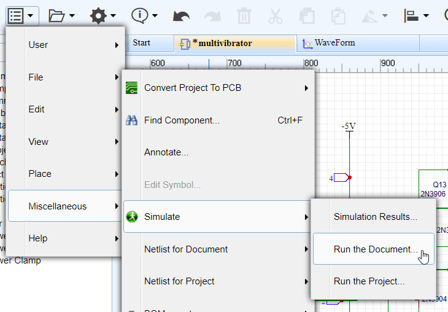

**Run the Document**: Just for the active schematic, you can also open this dialog using the `CTRL+R` hotkeys.

**Run the Project**: EasyEDA will merge all the schematics in the project to one, and simulate them.

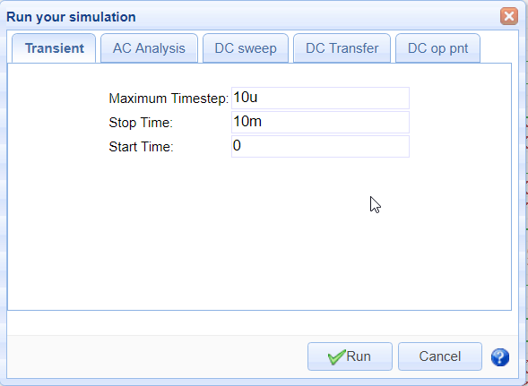

EasyEDA provides the following simulation analyses:

-   Transient: the time domain response of the circuit;
-   AC Analysis: the frequency domain response of the circuit (including an experimental FFT);
-   DC sweep: the DC response of the circuit as a voltage or current source or a component or parameter is swept between user specified limits; 
-   DC Transfer: computes the DC small-signal value of a transfer function (ratio of output variable to input source), input resistance, and output resistance of the circuit;
-   DC op simulation: computes the dc operating point of the circuit with inductors shorted and capacitors opened.

For more information about these analyses, please refer to:

[http://ngspice.sourceforge.net/docs/ngspice-manual.pdf#subsection.1.2.1](http://ngspice.sourceforge.net/docs/ngspice-manual.pdf#subsection.1.2.1)

[http://ngspice.sourceforge.net/docs/ngspice-manual.pdf#subsection.1.2.2](http://ngspice.sourceforge.net/docs/ngspice-manual.pdf#subsection.1.2.2)

[http://ngspice.sourceforge.net/docs/ngspice-manual.pdf#subsection.1.2.3](http://ngspice.sourceforge.net/docs/ngspice-manual.pdf#subsection.1.2.3)

Please note that although using Ngspice for it's simulation engine, at present (140218) EasyEDA does not support all the possible analysis modes available in Ngspice.

Note that for transient simulations, at present (140218):

the maximum value of (Stop Time-Start Time)/(Maximum Timestep) = 1000

See also [CTRL+R to Run Simulation Immediately](#h.ew7ltgf338o)

## WaveForm

EasyEDA's WaveForm display is super easy but to make sure you don't miss any of the features it supports, we've put some detailed information into this tutorial.

Transient, AC Analysis and DC Sweep simulation results are shown in the WaveForm trace viewer.

After you run a spice simulation which should plot some traces, EasyEDA will automatically open a WaveForm tab like the image below.

The Waveform window width and height, trace, grid and background colours and the placement of traces in up to three panes can all be configured using the WaveForm Config dialog. To open the WaveForm Config dialog, click the Config button on the toolbar above the Waveform window.

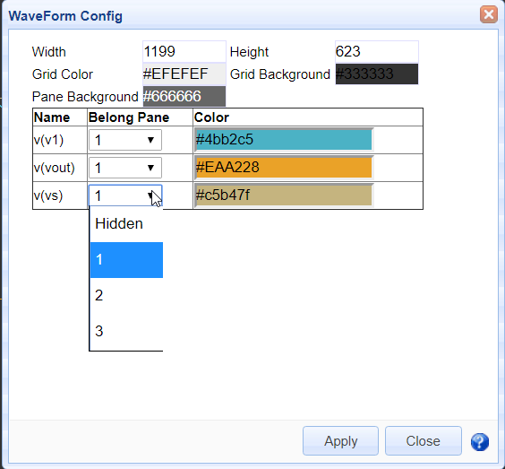

WaveForm allows the display of traces in any selection of up to three vertically stacked plot panes. The Y axes automatically scale to fit the units and the range of the traces being displayed. Traces can be hidden but at least one trace must be visible.

X and Y trace data can be seen on-screen just by moving the mouse cursor around the plot area of a pane with the readout adapting to the Y axes in each pane.

Delta X and delta Y trace data can be seen on-screen using a Left-Click and Drag select box, with the readout adapting to the Y axes in each pane. Returning the cursor to within a small radius of the starting point of the select box -without releasing the Left-Click - returns the readout to X and Y trace data.

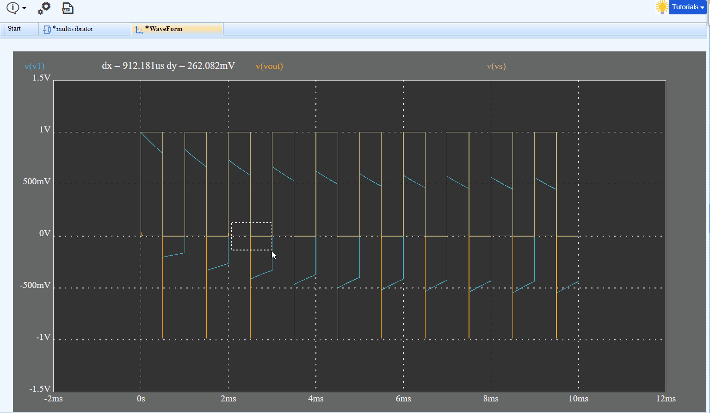

Left-Click, Drag and then releasing the Left-Click zooms all plots, synchronised across all panes, horizontally. Double clicking anywhere in the WaveForm window resets the zoom.

Vertical plot zoom is not supported but traces are dynamically autoscaled to fit the available pane height as the horizontal zoom is changed.

The window can moved around within the EasyEDA window using the horizontal and vertical scroll bars or using Right-Click and Drag.

WaveForm plot data can be exported in CSV format for further analysis and manipulation in external programs such as LibreOffice Calc, Scilab or Excel, however a particular feature of EasyEDA is that the WaveForm window can not only be saved in an EasyEDA Project but that the plots in a saved WaveForm window can be viewed and manipulated in exactly the same way as when they first appear as a result of a simulation. This makes it easy to compare the results from several simulations.  

Once saved in a Project, a WaveForm window can be exported as a .pdf, .png or .svg file into your browser window. This can then be saved to your device so it is easy to create professional quality documentation.

## Build Your Own Simulation Component

There are several reasons why you may want to build your own simulation component.

-   You may have downloaded a spice model in text form for a device for which EasyEDA has no symbol;
-   Perhaps you have designed a simulation schematic of a circuit for which there is no readily available spice model and you need to create your own symbol for it;
-   You have a subckt for a device and EasyEDA already has a symbol for it but you want to use your subckt in place of the one already attached to the EasyEDA symbol.

EasyEDA gives you three ways to build your own components so that you can simulate them:

### 1.From a model in text form 

1.  If you already have a spice subcircuit in text form, for example one that you have downloaded from a component manufacturer's website but you haven't got a spice symbol for it, then you can create a spice symbol and attach a .subckt definition to it.

2.  First make a note of the exact name given in the .subckt line. Spice names are case insensitive but can only be made up from alphabetical, numeric and underscore characters.

	For example: LM741EE_demo would be a valid name and would be seen as identical to lm741ee\_Demo but **LM741EE-demo** and **LM741EE~demo** are **invalid** names because they contain invalid characters.
	
	In this example we shall assume that you have a .subckt with the name: *Demo\_Spice\_Symbol*

3.  Next, create your symbol.

	You need to do this using:

	**Document > New > Spice Symbol...** instead of: **Document > New > Schematic Lib...**

	because that option does not support attaching a spice model to a schematic symbol.

	Using **Document > New > Spice Symbol…** also automatically sets the Spice Prefix of the symbol to X which is essential for a .subckt definition to attach to your symbol.

	Remember that the Spice Pin names assigned to the symbol **must** be numbered in the same order that they appear in the .subckt. So, if there are four pins named A, B, C and D in the order 1, 2, 3 and 4 in the subckt, then the corresponding pins on the symbol must be in the same number order. They don't have to have the same names: you could have symbol pins named; fish, go, moo and banana but if they correspond, in the same order, to the .subckt names A, B, C and D then they must be numbered as: 

	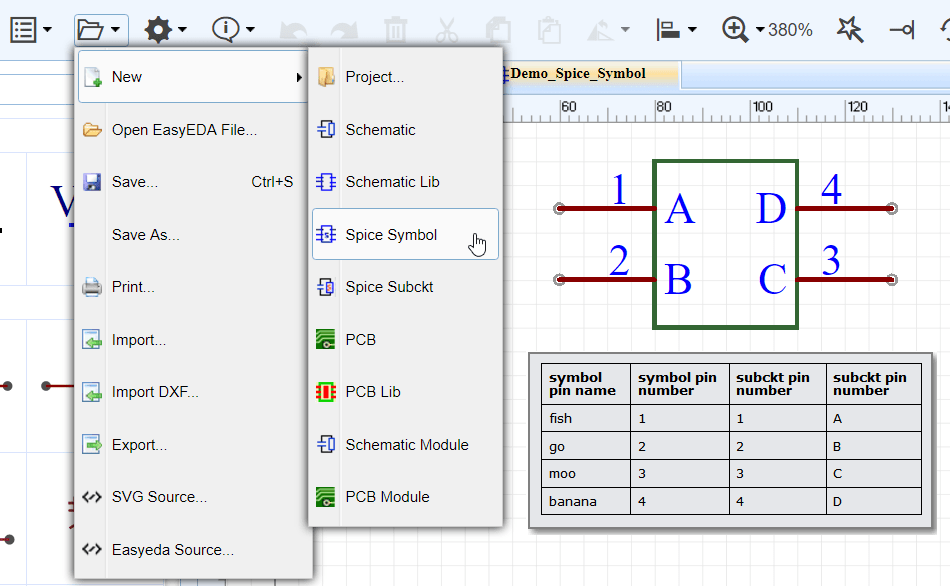  

4.	You are now ready to attach your subcircuit to the symbol by opening the attached this spice symbol with subckt dialog using:

	**Super menu > Miscellaneous > Edit Subckt...**

	and then pasting the .subckt definition that you wish to use into the Subckt string: text area.

	 

5.  Click OK and save the symbol but remember: the symbol name must be identical to the name of the subckt:

	**.SUBCKT Demo\_Spice\_Symbol A B C D**

6.  Lastly, add your new spice symbol to a schematic and run a simulation.

	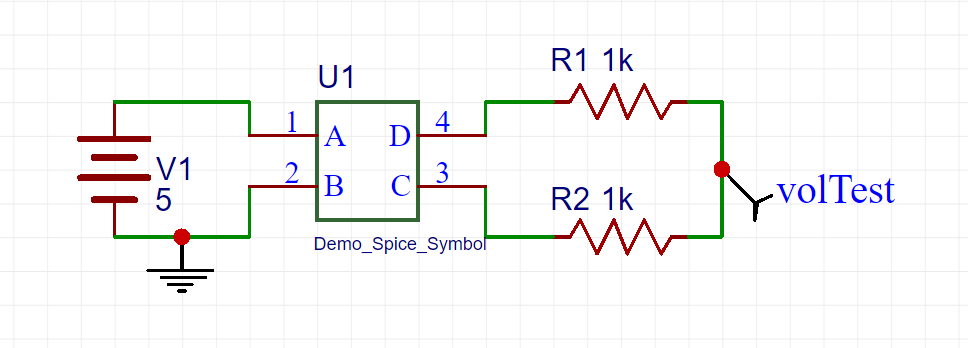 

7.  If you run a DC op simulation on this example, the result, shown in the Simulation Results... window, should be 2.5V

### 2.From a subcircuit in schematic form

1. Create a spice symbol and subckt circuit.

2. The same as (1) above, create a spice symbol.

3. Next create a spice subckt as a schematic:

	**Document > New > Spice Subckt...**

	 

	Draw the schematic that you want EasyEDA to turn into a subckt and attach to your symbol.

	To connect your simulation schematic to your symbol there must be a net in the circuit that is to be attached to each pin of the symbol. Each of these connecting nets in your circuit must have the same name as that of the symbol pin to which it connects. For example if your symbol has four pins called A, B, C and D then your simulation schematic must have exactly four connecting nets; one called A, one called B, one called C and one called D.

	To attach these nets in the schematic to the pins in the symbol you must name them using NetPort from the Wiring Tools palette.

	**Do not use NetLabel or NetFlag.**

	NetPort is used to distinguish those subckt nets that are to connect to symbol pins from all other nets named using EasyEDA default net names and those added using NetLabel or NetFlag.  

4. Save your spice subckt with exactly the same name as your spice symbol.

	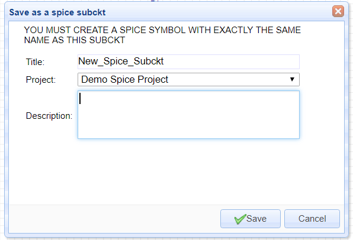   

5. Lastly, add your new spice symbol to a schematic the same as in (1) above and run a simulation.  

6. If you run a DC op simulation on this example, the result, shown in the Simulation Results... window, should be 2.5V.  

 

### 3.From a spice directive in a schematic

1.  When you already have a spice symbol which has a subckt attached to it - for example, an opamp symbol from the EasyEDA Libs - but you want to use a subckt for a different device which is not already in the EasyEDA Libs, then you can use this method to easily attach a subckt to a symbol directly in your schematic.  

2.  Paste your .subckt text into the schematic.

3.  Next, select the pasted text and, in the right hand Properties panel, change the Text type from comment to spice. This will create a spice directive which the simulator will then incorporate into the spice netlist.
4.  Next, select the symbol and, either directly in the symbol or in the right hand Properties panel, edit the Model text to exactly the same name as in your pasted subckt.
5.  Check that the Spice pin order of the symbol matches that of the pasted .subckt and edit it if necessary (not all subckts for a given type of device use the same Spice Pin order!).
6.  Save your schematic and then you can run your simulation.

	

### 4.Using .models instead of .subckts

1. All three techniques can be used to attach .model statements to symbols in exactly the same way as .subckts but after placing the symbol in your schematic, you must use:

	**Super menu > Miscellaneous > Edit Symbol...**
	to set the symbol's Spice Prefix to the appropriate letter for the device model you are using.

2. You also have to know the spice pin order for the type of .model statement you are using because, unlike .subckts, the .model statement does not show this explicitly.

	The Spice Prefixes and Spice Pin names and orders for the most commonly used devices for which you may want to use different models are listed below:

	

Actually there is a way to save the symbol with the required Spice Prefix so that you don't have to edit it every time you place a new instance of the symbol into a schematic … but that needs a bit more insight into editing the EasyEDA Source for the symbol so will be left for the moment.

We did say that EasyEDA Source enables some powerful ways to manipulate schematic and spice files and symbols! :)

## Advance Tips

EasyEDA uses [Ngspice](http://ngspice.sourceforge.net/presentation.html) as the simulation engine, so once you get more familiar with it you can use many [other commands and feature](http://ngspice.sourceforge.net/docs/ngspice-manual.pdf)[s of Ngspice](http://ngspice.sourceforge.net/docs/ngspice-manual.pdf) that are not directly available via the EasyEDA UI.

The lists below show which Ngspice commands are currently supported by EasyEDA and which are not.

### Ngspice Commands Whitelist

EasyEDA allows these commands:

let define option options unlet op tf tran pss ac dc pz sens disto noise fft fourier meas alter run while repeat dowhile foreach if else end break continue label goto linearize print probe echo

### Ngspice Commands Blacklist

EasyEDA does not currently allow these Ngspice commands:

reshape snsave snload circbyline alias deftype display destroy setplot setcirc setscale transpose xgraph gnuplot wrdata wrs2p hardcopy asciiplot write compose print eprint codemodel load cross undefine listing edit dump psd spec show showmod sysinfo altermod resume state stop trace save iplot altermod status delete step remcirc reset aspice jobs rspice bug where newhelp tutorial help oldhelp removecirc quit source shift unset unalias history shell rusage cd version diff rehash cdump mdump mrdump settype strcmp devhelp inventory source

### Probe

An alternative to using the volProbe element to probe voltages in a circuit - which avoids the possibility described in [Probing voltages and currents](#h.vl7fdqh8iyf8) of overwriting net names and consequently corrupting any expressions that use them - is to use the Probe command.

For example, to probe the voltages on two nets named in and out all you have to do is enter this text into the schematic:

Probe V(out) V(in)

and then, in the Properties panel, set the Text type to spice to set it to be included in the spice netlist as a spice directive.

You can also use the Probe command to probe a current in your circuit.

To measure the current in a wire you insert an Ammeter, from the EasyEDA Libs, in series with the wire you wish to probe. EasyEDA then inserts a small subckt comprising a 0V, zero resistance, voltage source in series with the wire and then probes the current in that voltage source. Hence although an ammeter in an EasyEDA schematic is shown with an A prefix, it is spice netlisted with an X prefix (for a subckt call) followed by V (for the voltage source).

For example, to add the current in an Ammeter, named A_load_current1, to the command probing the two voltage probes above, you would change the Probe command in your schematic to:

`Probe V(out) V(in) I(XVA_load_current1)`

It is also possible to use expressions in a Probe command. In the example above, if we assume that V(out) is connected directly to a grounded load then, to plot the power dissipation of the load, you can add this expression:

`V(out)*I(XVA_load_current1)`

the Probe command list:

`Probe V(out) V(in) I(XVA_load_current1) V(out)*I(XVA_load_current1)`

Note that your probe list can be as long as you like but all entries in a Probe command list must be entered as a single line of text with no returns.

A useful feature allowing you to easily switch between different sets of probe points is that any number of Probe commands, each with their own list of probe points, can be included in a schematic by setting the Text type of only one at a time to spice and setting all others to comment.

But this is just the tip of the iceberg ...

### Using CTRL+R to Run Simulation Immediately

As described in [Run Simulation](#h.omum7qtdqc2), using:

`CTRL+R`

will open the

Run the Document

or

Run the Project

simulation control dialog.

That approach is a great way for you to quickly and easily set up and Run any of the most commonly used simulation analyses types but EasyEDA gives you a way to harness the real power of **Ngspice**.

Simply by entering your simulation control commands as text, directly into the schematic and setting the Text type to spice, you can set up powerful spice analyses. You can run these straight away, without needing the Run your simulation dialog just using the `CTRL+R` hotkeys.

Using this method it's quick and easy to create and run more advanced simulation analyses and to make automated measurements on your circuit.

Here's a quick insight into how it works but you can skip this if you like and just get into how to make this amazing feature work for you!

EasyEDA automatically embeds the simulation commands set up in the Run your simulation dialogs within a control section. You can see this in the spice netlist for any circuit that has been through a simulation run at least once via:

**Simulate > Simulation Results… > Download netlist**

The control section starts with the .control command and ends with the .endc command. All commands between these delimiters are run in an Ngspice interactive simulation control mode.

Now, you don't need to worry about these two commands because EasyEDA automatically inserts them in the netlist in the right place to enclose your commands so all you need to do is to enter a list of commands as text, anywhere in the schematic canvas and then, in the Properties panel, set the Text type to spice for it to be included in the spice netlist as a **spice directive**.

The following examples show some of the things you can do using **spice directives**.

--------------------------------------------
Run a **transient simulation** with the following parameters:

**Maximum Timestep**: 10u
**Stop time**: 11ms
**Start Time**: 1ms

just add this text anywhere on the schematic canvas:

	tran 1u 11m 1m

set Text type to **spice** 

then type:

`CTRL+R`

--------------------------------

Run an **AC Analysis** with the following parameters:

**Type of Sweep**: Decade

**Number of points**: 100 (per decade)

**Start Frequency**: 1k

**Stop Frequency**: 1Meg

just add this text anywhere on the schematic canvas:

	ac dec 100 1k 1Meg

set Text type to **spice** 

then type:

`CTRL+R`

------------------------------------
Run a **DC Sweep** with the following parameters:

(And, yes, you can sweep component values, not just sources!)

**Source to Sweep**: R1  

**Start Value**: 1k

**Stop Value**: 2k

**Increment**: 100

just add this text anywhere on the schematic canvas:

	dc R1 1k 2k 100

set Text type to **spice** 

then type:

`CTRL+R`

--------------------------------------------
A couple of more advanced examples:

Run a **Fourier** analysis:

	tran 2u 2m 0
	fourier 1K V(volOut)
	run
	probe V(volOut)  

set Text type to spice 

then type:

`CTRL+R`

---------------------------------------
For more information on Fourier Ngspice, see:

[http://ngspice.sourceforge.net/docs/ngspice-manual.pdf#subsection.17.5.24](http://cs/ngspice-manual.pdf#subsection.17.5.24)

Run an **FFT** analysis:

	tran .1m 2s 0
	run
	linearize
	fft v(out)
	probe db(mag(v(out)))

set Text type to spice 

then type:

`CTRL+R`

For more information on **FFT** in Ngspice, see:

[http://ngspice.sourceforge.net/docs/ngspice-manual.pdf#subsection.17.5.25](http://ngspice.sourceforge.net/docs/ngspice-manual.pdf#subsection.17.5.25)

----------------------------------------
Run a DC op pnt analysis and Print the power in the load into the Simulation results window:

	op
	print V(out)*I(XVA_load_current1)

set Text type to spice 

then type:

`CTRL+R`

-------------------------------
Measure the gain and 3dB bandwidth of an amplifier. 

This prints the gain and bandwidth values of this x1 and x10 amplifier example:

[https://easyeda.com/file_view_Find-gain-and-bandwidth_8GE0KRFDn.htm](https://easyeda.com/file_view_Find-gain-and-bandwidth_8GE0KRFDn.htm)

 in the Simulation Results… window:

	* This is a control block.
	* Note: variables in a control block must start with
	* a letter.
	 
	* Set up an AC analysis:
	 
	ac dec 100 1k 10Meg
	 
	* Define a 3dB value:
	 
	let neg3dB = 20*log10(sqrt(2)/2)
	 
	* Convert the outputs of both amplifiers into dB:
	 
	let x1gain_dB = DB(v(x1Avcl))
	let x10gain_dB = DB(v(x10Avcl))
	 
	* Find the low frequency gain of each amplifier
	* (look at the Bode plots in WaveForm and choose
	* a frequency where the gain is level; i.e. well
	* below any possible hf gain peaking):
	 
	meas ac x1_lfgain_dB find x1gain_dB at=1k
	meas ac x10_lfgain_dB find x10gain_dB at=1k
	 
	* Subtract 3dB from the lf gains to find
	* a value 3dB down from the lf gain:
	 
	let x1_3dBdown = x1_lfgain_dB + neg3dB
	let x10_3dBdown = x10_lfgain_dB + neg3dB
	 
	* Find the frequencies at which the outputs
	* are 3dB down from the lf gains:
	 
	meas ac x1_f3dB when x1gain_dB = x1_3dBdown
	meas ac x10_f3dB when x10gain_dB = x10_3dBdown

set Text type to spice 

then type:

`CTRL+R`

For more information on the meas statement, see:

[http://ngspice.sourceforge.net/docs/ngspice-manual.pdf#subsection.17.5.37](http://ngspice.sourceforge.net/docs/ngspice-manual.pdf#subsection.17.5.37)
                     

# PCB Design Editor 

After the initial conversion of a schematic to PCB, it is time to learn how to manage EasyEDA's PCB Design Editor.

## Canvas 

Lots of PCB canvas attributes are the same as Schematic canvas attributes. The key is that you can set **units** in PCB canvas attributes.

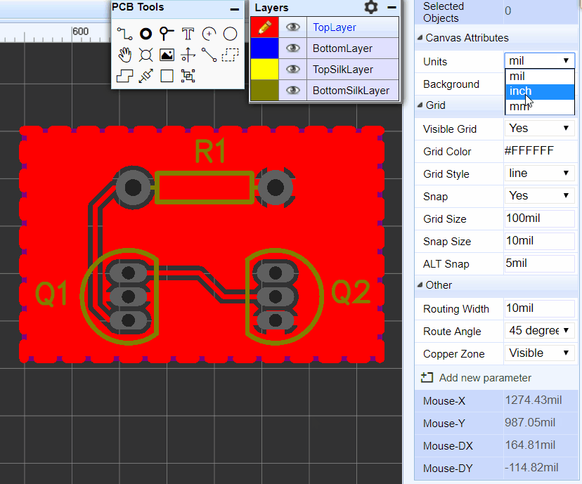

## PCB Tools 
PCB tools provide many function to fulfill your PCB design requirement.
Such as: Track, Pad, Via, Text, Arc, Circle, Move, Hole, Image, Canvas Origin, Connect Pad to Pad, Copper Area, Solid Region, Measure/Dimension, Rect, Group/Ungroup. etc.

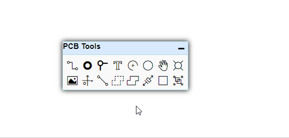

### Track 

In the schematic editor, we use Wire or the `W` Hotkey to connect Pins, in a similar way in the PCB editor, we use Track to connect Pads. Track allows you to draw PCB tracks and can be found on the PCB Tools palette or using the `W` Hotkey (not T: see above!).

**Some Tips about Track.**

1.  Single click to start drawing a track. Single click again to pin the track to the canvas and continue on from that point. Right click to end a track. Double right-click to exit track mode.

2.   Drawing a track at the same time as using a hotkey(for example hotkey `B`) for changing the active layer will automatically insert a Via:  
  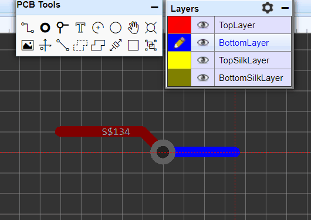 
If you start drawing a track on the top layer - you will see it drawn in red - then press the B key to change to bottom layer and you will see EasyEDA insert a grey via and then the track will continue being drawn but now on the bottom layer in blue.

3.  Pressing the `+` or `-` Hotkeys when drawing the track will change the width of the track on the fly.

4.  Double clicking on a drawn section of the track will add a new vertex at that point. You can drag the vertex to form a new corner.  
  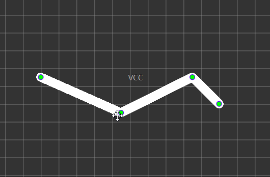

5.  Click to select the track and then Click and Drag on a segment of the track to adjust the segment between vertices.
  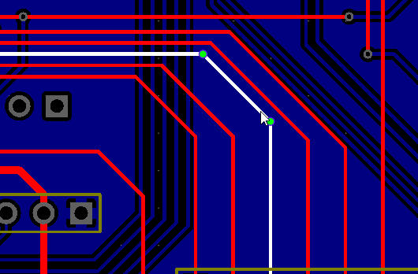

6.  Pressing the `L` Hotkey when drawing the track will change the track's Route Angle on the fly. And you can change Route Angle on the Canvas Attributes of the right panel before the next drawing.
  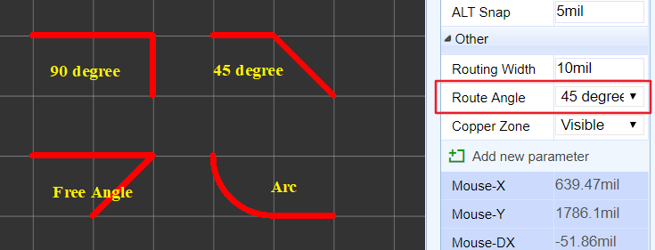

7.  You can change inflection direction when routing, just press `Space` key.
  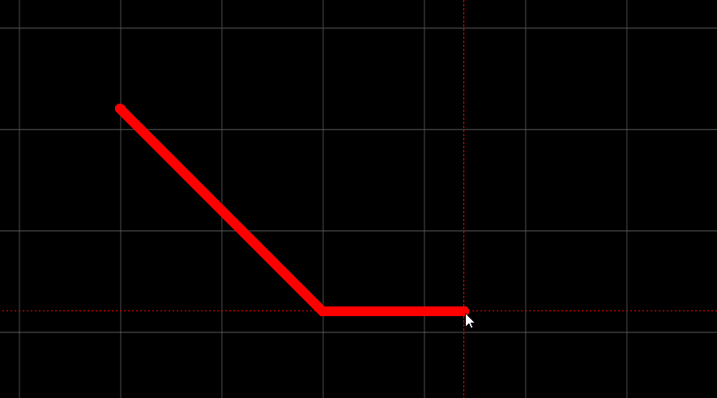

**Track Length**

When a track is selected, you can find its Length attribute in the right panel.
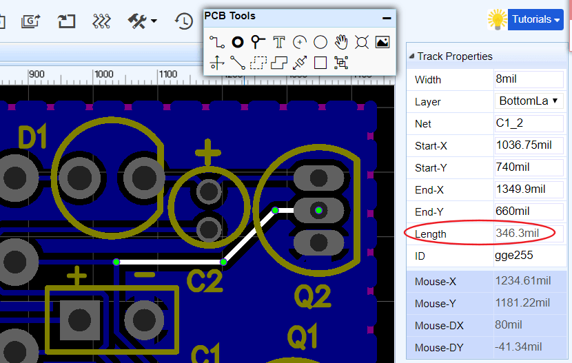  

**Delete a Segment from a Track**

In lots of other EDA tools, the track is segment line, but in EasyEDA, the track is polyline. Sometimes, if we want to delete a segment, we must delete the whole track and route again. Now we provide a better way to do this. Move your mouse to the segment which you want to delete, click it, then hold `SHIFT` and **double click it**. the segment will be removed.

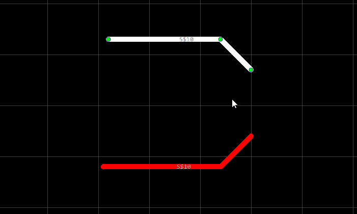

### Pad 

You can add pads using the Pads button from the PCBLib Tools palette or using the `P` hotkey.

After selecting one of the pads, you can view and adjust its attributes in the right hand Properties panel.

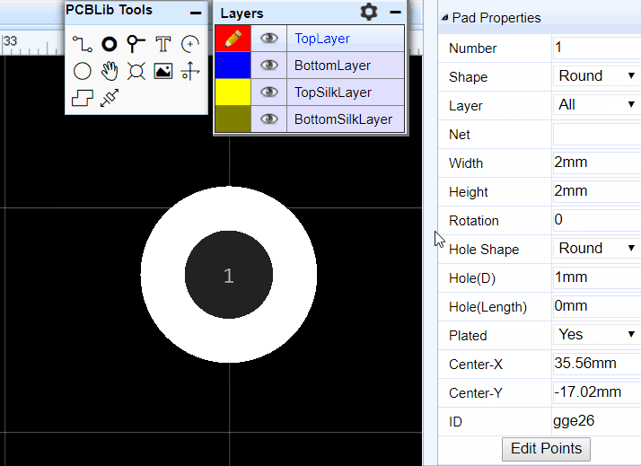

**Number:** Remembering the pin numbers you set in the schematic symbol in your Schematic Lib: to connect those schematic symbol pins to the pads in your PCB footprint, the pad numbers you set here in the PCB Lib footprint must be the same.

**Shape:** Round , Rectangular ,  Oval and Polygon.

EasyEDA supports four shapes: `Round` , `Rectangular` , `OVAL` and `POLYGON`.  

-	`OVAL` PAD will give your more space.   
-	`POLYGON` PAD will let you to create some strange pad.  

Like in the image below, you can edit the PADs points when you select a `POLYGON` PAD
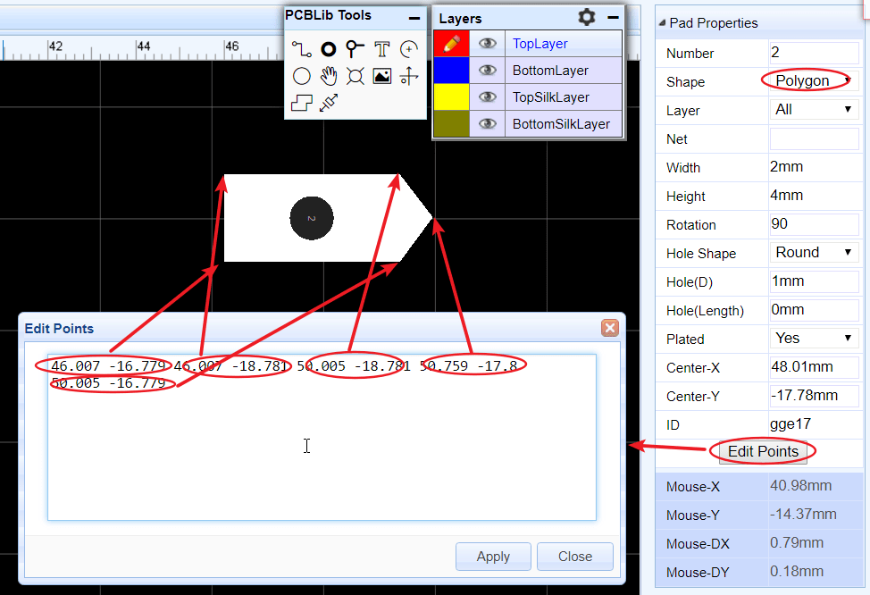 

**Layer:** If the pads are part of a **SMD** footprint, you can set it to **Top layer** or **Bottom layer**. For through hole components you should set it to **All**.

**Net:** You don't need to enter anything here because at present this footprint is not connected to anything in a circuit.

**Width and Height:** When the shape is set to Round, Width will equal Height.

**Rotation:** Here you can set the Pad's rotation as you want.

**Hole(D):**  This is the drill hole **diameter** for a through hole pad. For a SMD Pad, set this to **zero**.

**Center-X and Center-Y:** using these two attributes, you can set the pad's position with more precision, compared to using the mouse.

**Plated：** Yes or No.

### Via

When you want to lay a multilayer PCB, you need to add Vias for nets getting through layer and layer.

**Place a Via On a Track**

When placing a `via` on a track, the track will be cut to two segments.  Placing two vias on a tracks, you will get three segments, then you can change one segment to other layer id, or remove one of them.   
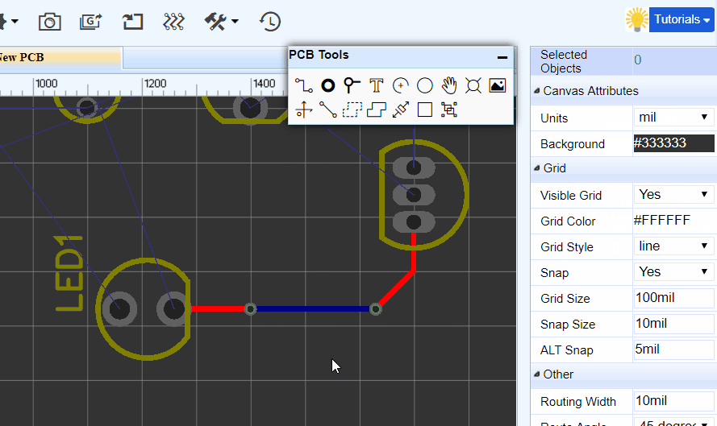

### Text

You can add more fonts from your computer or download some [free fonts:www.1001freefonts.com](http://www.1001freefonts.com/) .

Select the text, then you can find a Font-family attribute on the right panel like in the image below.  
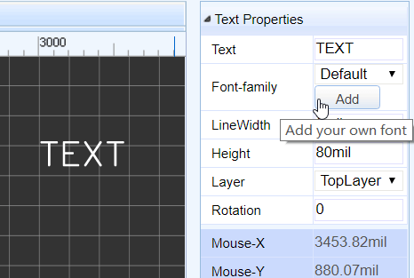  

Click the add button, then choose the font, the font file must be `ttf` or `otf`.  
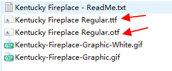  

So you can add any fonts by yourself. EasyEDA doesn't cache the font on our server, so if you close the editor, you need to add the font again by yourself.

**Note:** *If you use the other font, the `LineWidth` attribute is useless, because it will be automatically set by changing the `Height`.*

### Arc

You can draw many Arcs with different sizes, it's easy to create a pretty cool PCB as you like.  

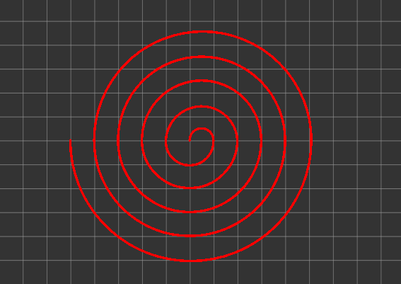  

EasyEDA provides two Arc tools:

- Start point fixed, you can change the end point position and radius.  
  
- Center point fixed, you can change the radius.  
  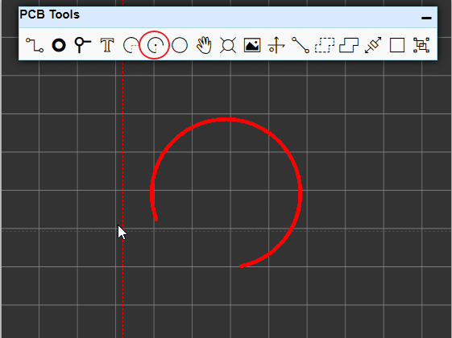

### Circle

You can draw a circle in PCB , but it can only be drawn at SilkLayer and Document Layer. If you want to draw a circle at TopLayer or BottomLayer, please use Arc.

### Move

This option is same as schematic's drag.

### Hole

There were lots of users that didn't know how to use PAD or VIA as a HOLE, they asked EasyEDA for help, so EasyEDA added a HOLE TOOL in the PCB toolbar.  
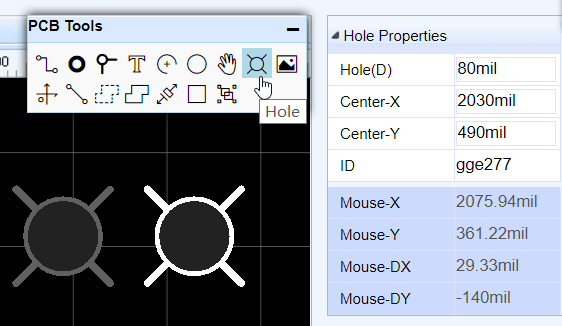

### Image  

On PCB and PCB Lib editor, there is a nice feature on the PCB Tools bar.

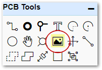

After clicking on the image icon, you will see the Insert Image window as below.  
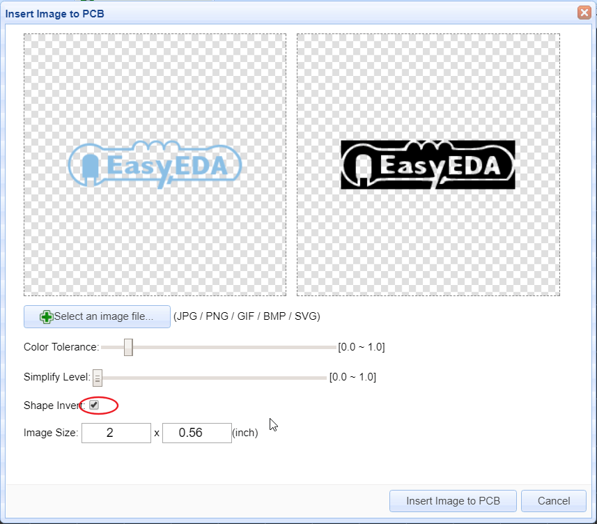  

In this dialog, you can choose your favorite image, EasyEDA support `JPG`, `BMP`, `PNG`, `GIF`, and `SVG`. Unlike some other EDA tools which only support a Monochrome Bitmap image, EasyEDA supports full color, but Monochrome Bitmap is welcome.

You can adjust the color tolerance, simplify level and reset the image size there.

And you can select shape invert. 

The image will be inserted to the active layer, if it is not right, you can change the attribute. Such as TopSilkLayer.    
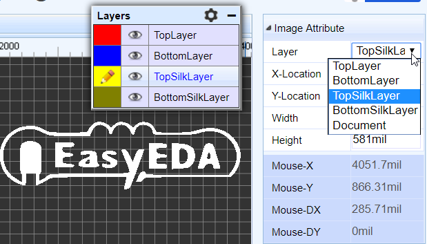  

### Canvas Origin

This option is the same as schematic's Canvas Origin.

### Protractor

We provide a protractor for PCB tools.  
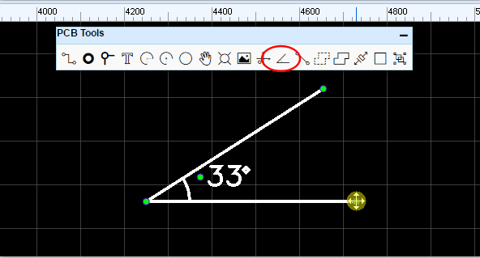

### Connect Pad to Pad

When creating a PCB without a Schematic, none of the pads on the Footprints have nets connecting them so there will be no ratlines. 

Rather than try to track the pads from scratch, it is a good idea to connect them up by hand first using `Connect Pad to Pad` from the PCB Tools palette. This will help you to remember to track the pads correctly with fewer mistakes.   

You could also do this by setting net names for all the pads: if the two pads are given the same net name then EasyEDA will understand that they are connected together and will automatically create a ratline between them.  

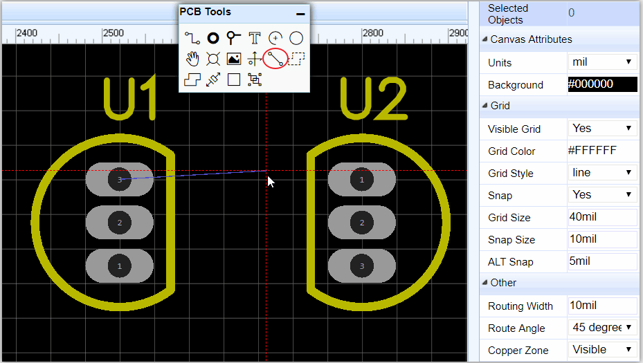  

Or you can set these two pads with the same net name at the right panel Pad Properties after you click the pad.

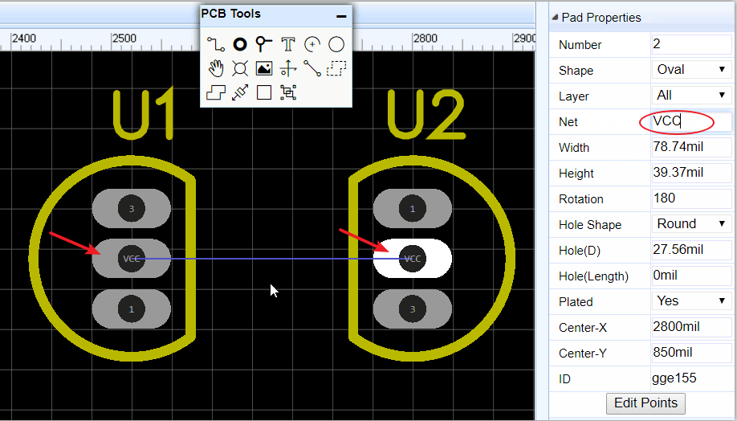  

For more information about Ratline you can refer to the [Ratline](./PCB.htm#Ratline) section.

### Copper Area 

Sometimes you will want to fill in or flood an area with copper. Usually this copper area will be connected to a net such as **GND** or a supply rail. You can draw the outline of a flood using the **Copper Area** button from the PCB Tools palette.

When selecting a copper area, you can find its attributes from the right hand **Properties** panels.

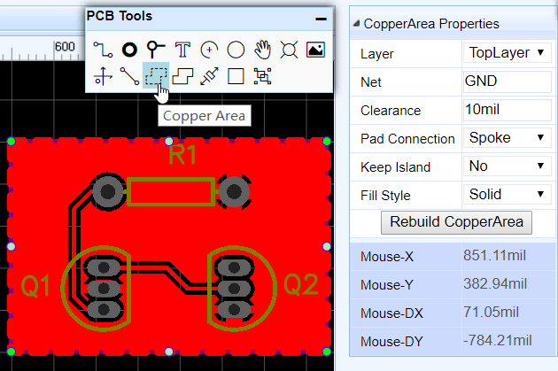

**Layer:** Bottom, Top, Inner1, Inner2, Inner3, Inner4;

**Net:** the net that the copper area is connected to;

**Clearance:** clearance of the copper area from other nets and floods;

**Pad Connection:** direct or spoke (i.e. a cross shaped heat shunt);

**Keep Island:** Yes/No. This keeps or removes any isolated areas of copper created as part of the flooding process. It is usually good practice to removes these unless you really need them to maintain a more even spread of copper (copper balance) on your PCB;

**Fill Style:** No/Filled. No removes the fill so that you can see the tracking more clearly;

After drawing the copper area, set the net it is to be connected to (floating copper areas are not recommended because they can cause EMC and Signal Integrity (SI) problems).

Lastly, don't forget to click the button Rebuild Copper Area to **rebuild** the flood.

**Two Tips:**

1.  Hotkey `Shift+B` to build all of the copper areas.
2.  Hotkey `Shift+M` to clear all of the copper areas.

### Solid Region

EasyEDA has added a new tool Solid Region for PCB design

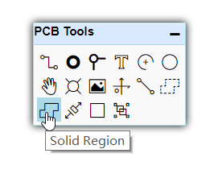

This is a very useful, quick way to connect Pads. You can draw a Solid Region to include all of these pads with same net name, then set the region to the same net name as the pads. It is like Copper Area but easier to use for small areas. To use Solid Region like this, set the Type attribute (in the right hand Properties panel)  to Solid.

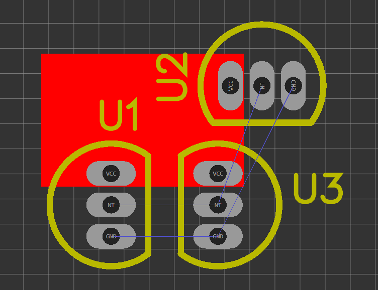

The Solid Region can also be used to create a cutout in a copper area.

If you have a copper area but need an area inside it to not be filled then you can draw a Solid Region  and set the Type attribute (in the right hand Properties panel)  to Cutout , then this area will be free of copper, as shown in the image below:

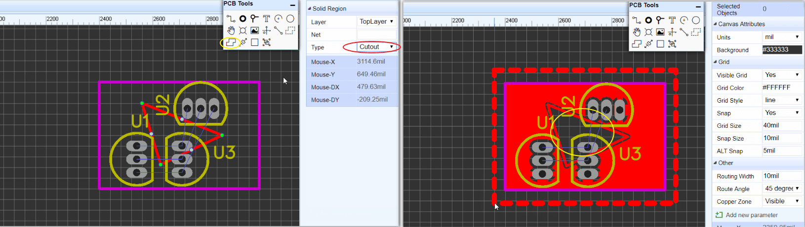

Lastly, by setting the Type attribute (in the right hand Properties panel) to NPTH(Non Plated Through Hole), Solid Region can be used to create a *Non Plated Through Hole* of an arbitrary shape.

When the Gerber files are generated, an area defined by a Solid Region set to a Type NPTH in the PCB editor will create an area defined to be a NPTH hole and you can see it in the PCB photo view as below:

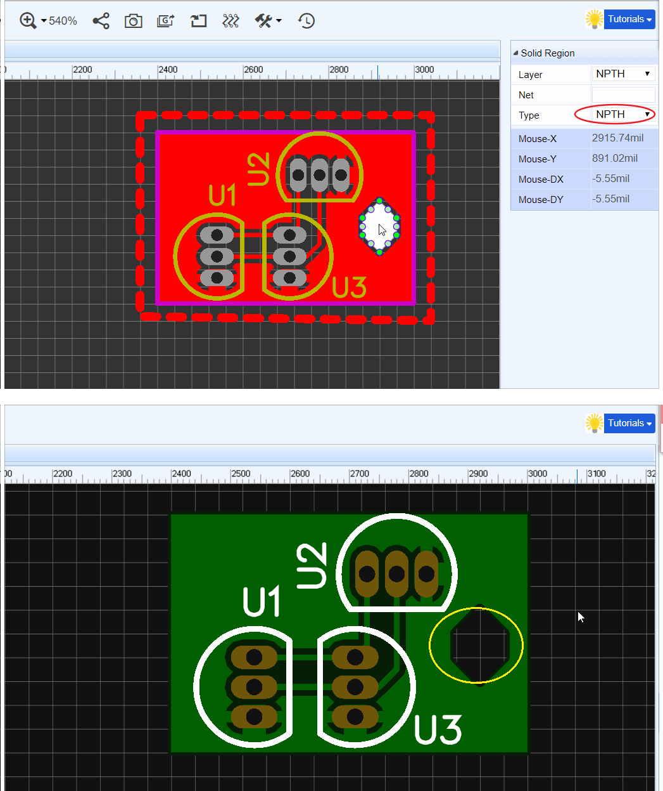

### Measure/Dimension 

Making and adding measurements is useful in PCB design. EasyEDA provides two methods to do this.

1.  Dimension tool in the PCB Tools palette:  
  This tool can show three units on the canvas, milliliter, inch and millimeter.

  

  When you click one side of the dimension on the PCB, you can drag it for any directions or change its length.
  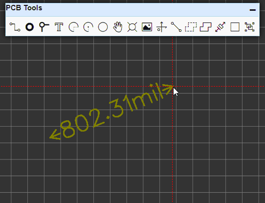

2.  Measure a distance using **M** Hotkey: press **M**, Or Via: **Super menu > Miscellaneous > Measure Distance**, then click the two points which you would like to measure.    
  **Note:** *This method will display the distance units which is the canvas' units.*  
  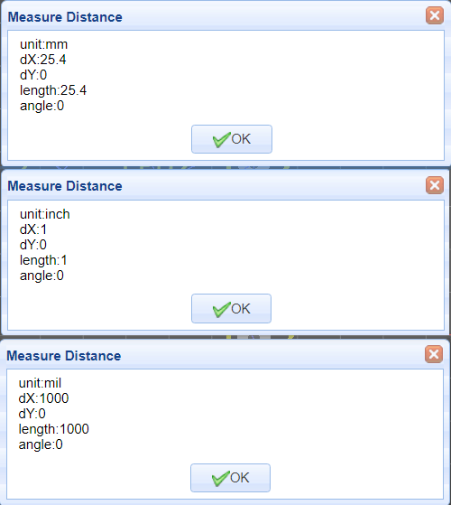

### Rect

It looks like a Solid Region, but it can't be set Nets and you can't set the Layer as NTPH.

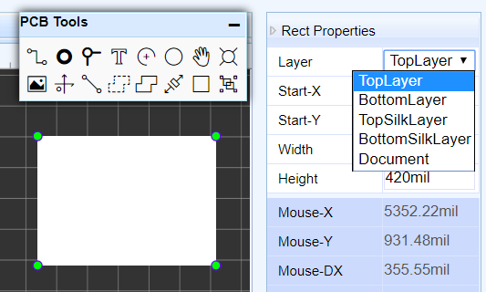

### Group/Ungroup

Just like Group/Ungroup in the Schematic Editor can be used to create a schematic lib symbol, you can use Group/Ungroup from the PCB Tools palette to create a PCB Lib footprint in the PCB editor.

For example, place Tracks and Pads on the canvas, then select all of them and click **Group/Ungroup** to group them like in the image below:

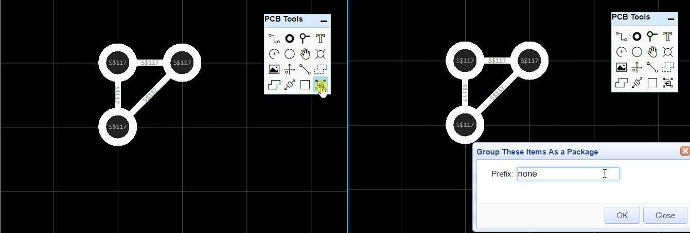

## Ratline

When you lay the track in the PCB, Between PIN and PIN as they have the same net name, a Ratline will be automatically shown among them to reveal that they can be connected with a track.

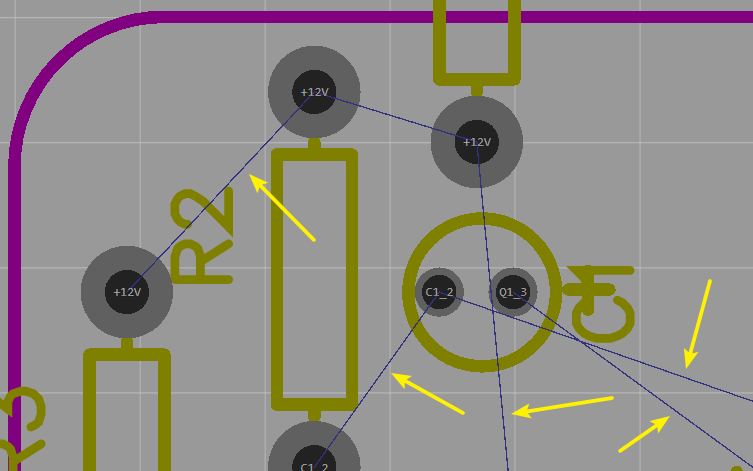

If you want some type of ratline to not show on the PCB editor, you can untick the net you like in the design manager, as below deselect `+12V`:
If you still draw a track in `+12V` after deselecting, canvas will not display this track , but it will show a text with `+12V` as below.

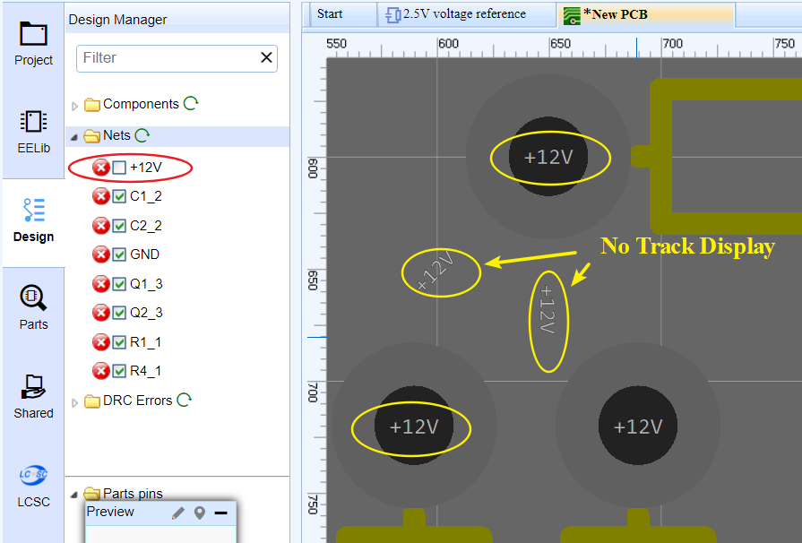

Based on this skill， you don't need to lay GND net before copper area in the PCB.

If you want to check the ratlines with highlight, you can click the pencil on the Ratlines Layer as below, and you can change the ratline's color.

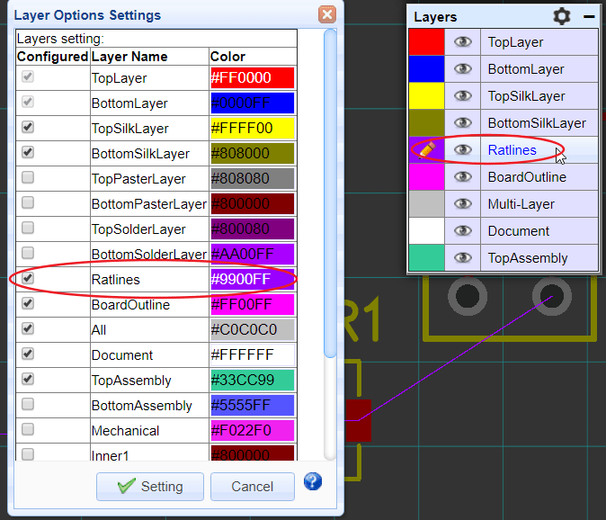

## PCB Net

### Net Name Visible

PCB editor can display net name in the track or Pads, if you don't need this feature, just need to turn it off via： 

**Super menu > View > PCB Net Visible**, or press hotkey `Q` .

### Net Length

After selecting a track, and then pressing `H` key, EasyEDA will highlight the whole net and pop a message box to tell you the whole net's length. like in the image below  

## Layer Setting 

Via **Super menu > Miscellaneous > Layer Options...**, Or Click **Layers**' gear icon.

You can find the Layer Options Settings dialog.

In this dialog, you can change the layer's Color and configure which layers are shown in the Layers Tool. If you plan to design a PCB with more than 2 layers, then you must tick Inner1 and Inner2 for a 4 layer PCB plus Inner3 and Inner4 for a 6 layer PCB.

## Layers Tool 

Active Layer: The colours of the layers in the **Layers Tool** are defined in the Layer Options Settings. To work on a layer then you must make it the Active layer. To do this; click on the coloured rectangle representing the required layer. The pencil icon in the coloured rectangle indicates that this is the active layer.

Show/Hide layers: click on the eye icons to show/hide layers.

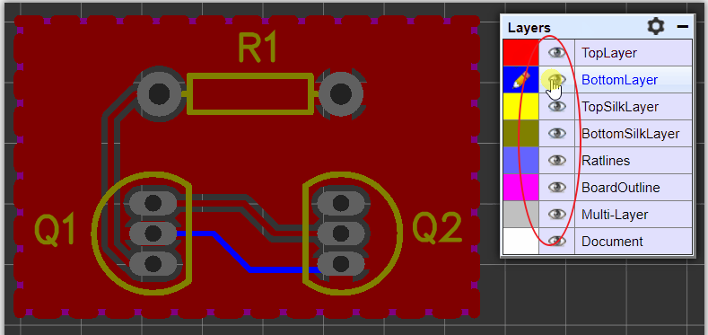

HotKeys for layer activation:

**T:** Top Layer is active  
**B:** Bottom Layer  
**1:** Inner1 Layer  
**2:** Inner2 Layer  
**3:** Inner3 Layer  
**4:** Inner4 Layer  

## Footprint attributes 

When selecting a Footprint, you can find its attributes at the right hand Properties panel.

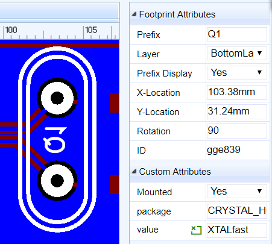

**Layer**: You can set a footrpint to be on the TopLayer or BottomLayer.   
*Note: The footprint mirrors when swapping layers.*

**X-Location and Y-Location**: Moves the origin of the footprint to a precise position.

**Rotation**: Rotates the footprint about its origin over the range from 0o to any angle in 1o steps (visually of course multiples of 360o will appear identical).

**ID**: EasyEDA will assign a unique ID for each footprint automatically, you can't modify it.  

### Change Attributes in Batch on PCB Editor

Sometimes, we need to change some attributes of multiple objects together, such as the track width, hole size and font size.  
Now, you can select them and do some changes. Taking the track for an example. If you select 3 tracks, now you can change their `Width`, `Layer`, `Net` together.  

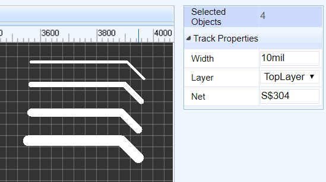

You could also use it with other items such as `Pad`, `Via`, and  `TEXT`. 

## Layout A PCB Without Schematic 

For some small PCB projects, maybe you don't need a schematic. EasyEDA allows you to lay the PCB directly from the PCB Editor.

Start a new PCB and you can add footprints directly from the PCB Libs from Left Navigation Panel **Parts** and then just track them.  

For setting pad to pad connections, you can check the above section : [Connect Pad to Pad](./PCB.htm#Connect-Pad-to-Pad)

## Board Outline

Before placing footprints we need to create a board outline. The board outline must be drawn on the **BoardOutLine** layer. So first, set **BoardOutLine** as the active layer, then draw the board outline using **Track** and **Arc** from the PCB Tools palette.

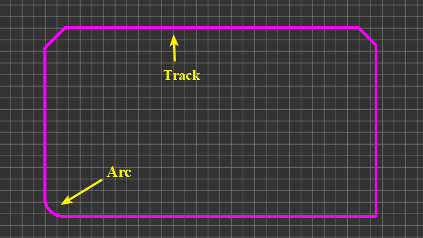

When converting a Schematic to PCB, EasyEDA will try to create a board outline for you.

The area of the default board outline area is 1.5 times the sum of the area of all of your footprints, so you can place all of your footprints into this board outline with some allowance for tracking. If you do not like the board outline, you can remove the elements it is made up from  and draw your own.

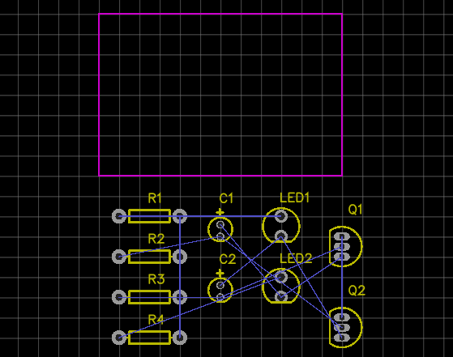

To create a simple rectangular board outline, this arc can be removed and the line X and Y end points edited - either directly in the Properties panel or by dragging the line ends - to close the rectangle.

Alternatively, an outline with more rounded corners can be created by copying the arc and rotating it in 90 degree steps to position it over the desired right angle corners and then editing the line X and Y end points - either by dragging the line ends or directly in the Properties panel - to overlap the arc end points (also shown but not editable in the Properties panel).  

And EasyEDA provides a **Board outline wizard**, so it is very easy to create a board outline.
Via: **Super menu > Miscellaneous > Set Board Outline**, Or find it on the toolbar.  

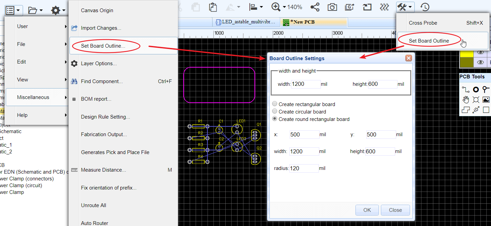

In this dialog, there's a choice of 3 types of board outlines, Rectangular , Circular, Round Rect. If you need a different more complex board outline, you need to import a DXF file.

## Design Manager 

Just like Schematic's Design Manager, PCB's Design Manager can be found via:

**Left Navigation panel > Design**

or just press the `CTRL+D` hotkey to open the Design Manager dialog.

In this dialog, you can:

1.  Click a component to highlight it.

2.  Check/uncheck a component to show/hide it.

3.  Filter to find a component or net.

4.  Click a net to highlight the tracks/vias with the same net.

5.  Check/uncheck the net to show/hide the net. For example, very often you may want to use this to hide a GND or supply net which has had a copper flood added to turn it into a plane and then show it again later.

6.  Double click the net to remove all of the tracks and vias with the net name. If you want to reroute a net, this is the recommended method to use to un-route it first.

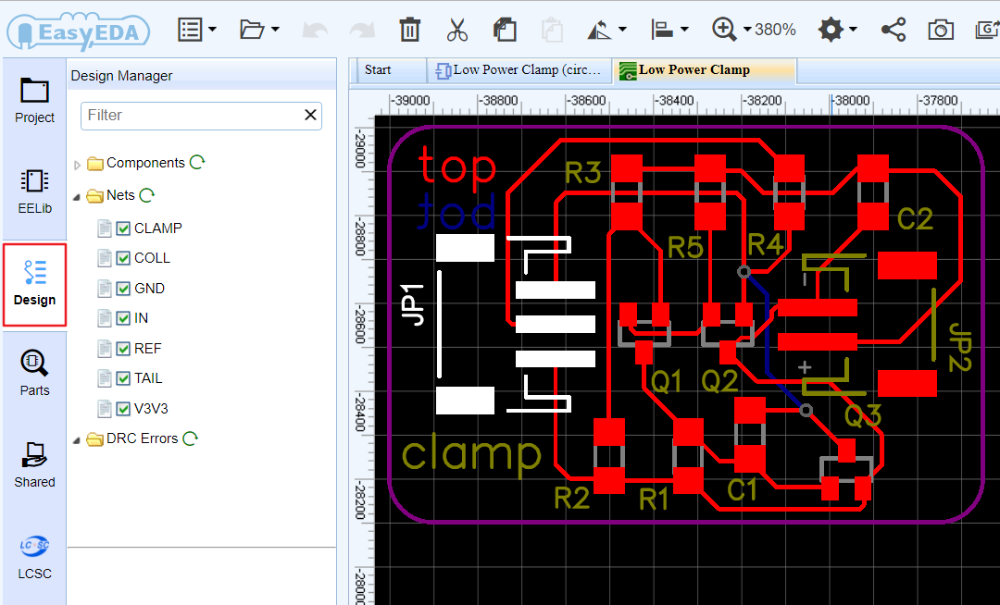

## Import Changes 

Sometimes, while working on a project, you need to make changes to the schematic and then update your board, to incorporate them.

It's easy to do this with EasyEDA.

Go to the **PCB Editor**,

**Super menu > Miscellaneous > Import Changes**

Or click that button at the tool bar  

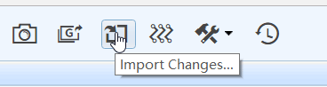

You will get a Confirm Importing changes information dialog:

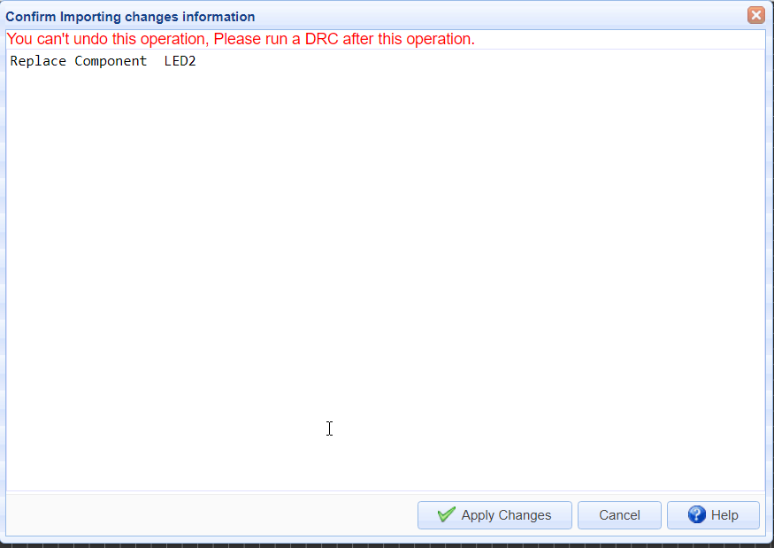

If you are happy with your changes, just click the Apply Change button.

The changes will then be passed into the PCB layout and you can then adjust the tracking to suit.

## Invalid Packages 

Sometimes, when you try to convert a schematic to a PCB, you will get an error message dialog like below. Don't worry, it is easy to fix this problem.

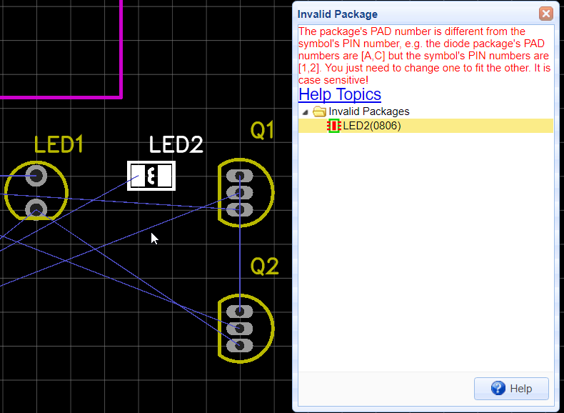

From the error message, you will find that the symbol's PIN number is different from PAD number. What caused that? Check the image below,

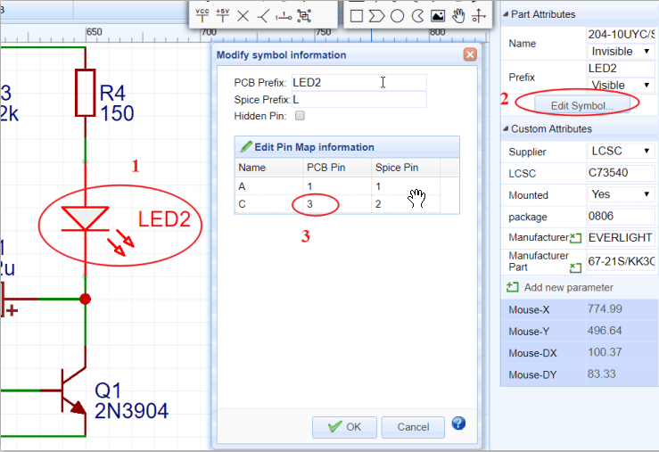

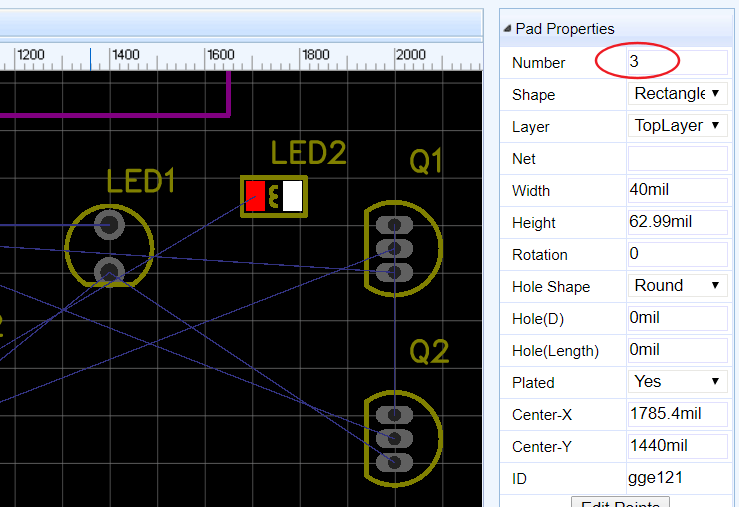

From the image, we can get the PIN number in the schematic symbol is set as `3`, but the PAD Number in the PCB Footprint is set as `2`. Now that we've found the problem, how to fix this? 

- Solution One: Change the schematic symbol.
   Using [PinMap function](./Schematic.htm#Pinmap-Modify-symbol-information). Change the PCB PIN from `3` to `2`. And save your schematic , and update PCB.

- Solution Two: Modify the Footprint.
   Edit the Footprint, change the PAD from `2` to `3`. And set this PAD net name to be the same as LED2 net name in the schematic.  
   So, we should be aware that PIN number should be the same as Pad number.

## Design Rule Check

EasyEDA provides a powerful real time DRC(Design Rule Check) function. 

Via at:**Super menu > Miscellaneous > Design Rule Setting** to open the **DRC** setting dialog:  
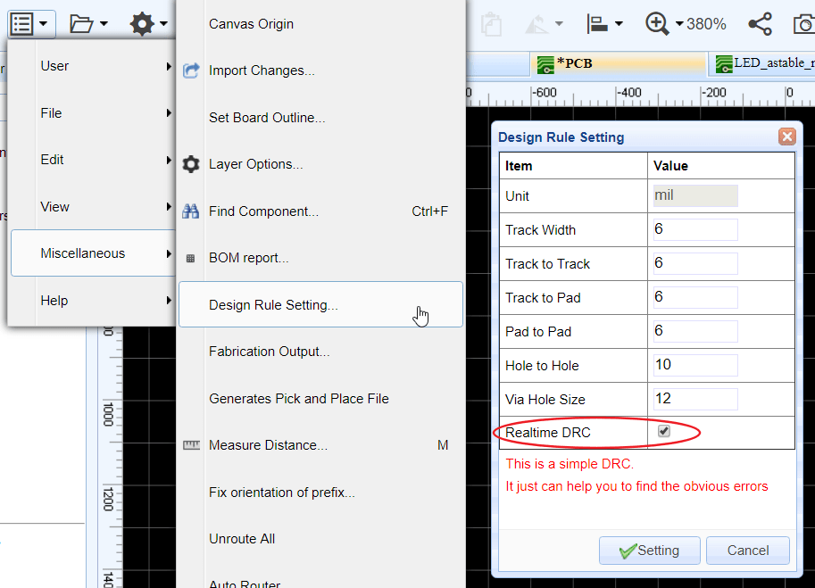   

**Note:** *When you convert a schematic to PCB, the real time DRC is open. But in the old PCB, the real time DRC is closed. you can open it as in the image above.*  

This is a big feature of EasyEDA. It is hard to fix DRC errors after laying out the PCB. Now EasyEDA will let you know the error in routing. You will find an `X` flag to mark the error, such as Track to Track or Track to PAD like in the image below

## Auto Router

For some simple or prototype PCBs, you may want to use the auto router function to save time. Layout is a time costly and dull job. EasyEDA spends lots of time to provide such a feature and it is loved by our users.
Steps:

**1 Click the the auto router button from the toolbar**

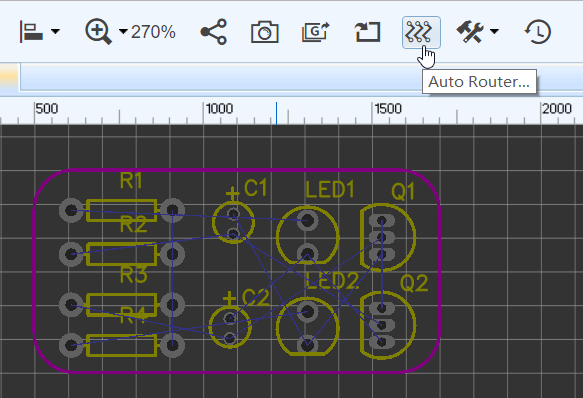

**2 Config the auto router**

 After you click that button, you will get a config dialog like in the image below.  

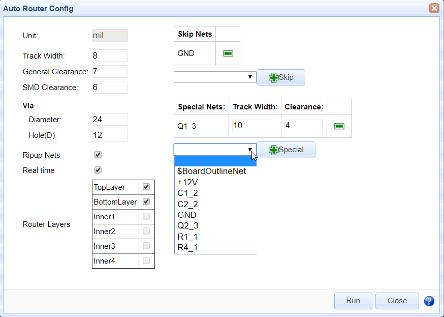  

In the config dialog, you can set some rules to make the auto router result professional.

If you want to keep the routed tracks, you need to uncheck the `Ripup Nets`

The real time check box will let you see how it is going, but it will make the process a little bit slow.   
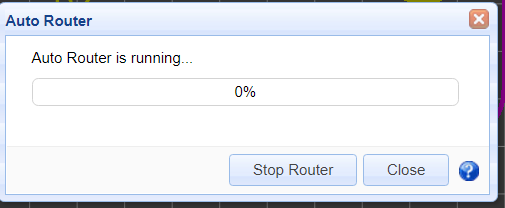 

If you like to keep the a net with no route, you can skip it. For example, if you want to use copper area to connect `GND` net, you can skip the `GND` net. 

For the power supply track, you may want it to be bigger, so you can add some special rules. 

**3 Run it**

Click the run button, wait for a few seconds, after adding bottom and top copper area, you will get a finished PCB board like in the image below.

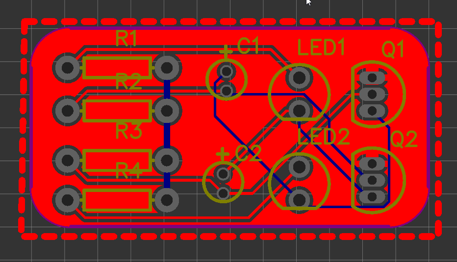 

Sometimes, if you can't get it done, try the tips below.

1. Skip the GND nets, add copper area to GND net.
2. use small tracks and small clearance, but make sure the value is more than 6mil.
3. Route some key tracks manually before auto routing. 
4. Add more layers, 4 layers or 6 layers

Some professional people don't like the auto router, because they think auto router is not professional, but you can use the auto router to check your placement. to check the density of your PCB. 

## Photo View

EasyEDA has no 3D View at present, but we provide a nice Photo View to help you to check the PCB. There is a `PhotoView` button on the PCB document toolbar, like in the image below. If you can't see this button, try to **reload** the PCB again.

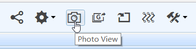

After converting the PCB to Photo View, you can see the result as in the image below.

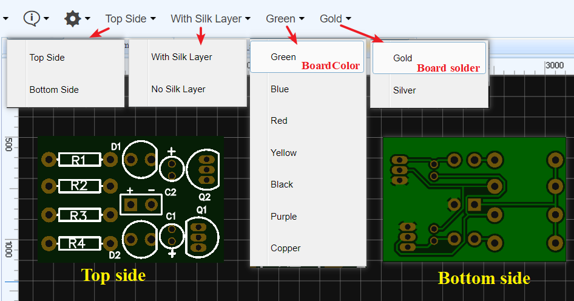

The photo view background default set as black and the right panel was hidden , you can popup up the right attribute panel and modify it.

## Getting Fabrication Files

When you finish your PCB, you can output the Fabrication Files(gerber file) via :  
**Super menu > Miscellaneous > Fabrication Output**，or by clicking the Fabrication Output button from the toolbar.

It will open a webpage to you, and you can download the gerber as a zipfile.

# Creating The PCB Libs

There will be times when you will need a PCB footprint that is not already in the EasyEDA libraries.  

The process of creating your own PCB Libs is very similar to how you make symbols for your own Schematic Libs.

You can start a new PCB lib as shown below:

## PCBLib Tools

PCBLib Tools almost are the same as PCB tools, just lacking some of the functions.
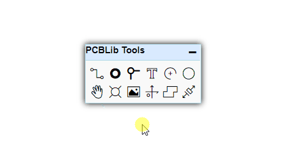

## Others 

1.  It is important to set the right Snap and Grid sizes to ensure that the pads on the finished footprint snap exactly to the grid and so connect the nets. For example, if you are creating a DIP package, set the Grid size to 100mil.

2.  Keep all other shapes such as component outlines and any associated pin identification marks or text on the TopSilkLayer. EasyEDA will automatically take care of the actual layer assignment when you place the footprint on the PCB.

3.  `CTRL+S` to save your footprint designs and you will find them saved into the **Parts > My Parts > Packages** section of the left Navigation panel. 

4.  Annular ring of the pad/via is too small, keep the annular ring >= 4mil. In this case, you can add a `Hole`

  

# Import 

EasyEDA provides importing from:

-   Altium/ProtelDXP Ascii Schematic/PCB
-   Eagle Schematic/PCB/libs

You can find the import menu from the Document menu:

**Document > Import...**

which opens the Import file from your computer dialog:

Please note that in File Operation: the Extract Libs option is only supported when importing Altium Designer and Eagle libraries.

## Import Altium Designer 

You can import Altium Designer's Schematic and PCB files into EasyEDA but only from **ASCII** files, so you need to save the designs as Ascii files like this.

EasyEDA offers an excellent experience in importing Alitum Designer's Schematic and PCB: as you can see from the image below of a schematic imported from Altium Designer:

Altium Designer's Schematic and PCB libraries are not available as **ASCII** files, so how can you import them?

In the Import file from your computer dialog to the right of File Operation; tick the Extract Libs option and EasyEDA will extract all of the libs from the Schematic files or PCB Files. So, if you want to import Altium Designer's Libs, you can add them to your Altium Designer Schematic or PCB and then extract them again into your EasyEDA library.

## Import Eagle 

Eagle Schematic/PCB/libs can be imported, but EasyEDA can only support version 6 and later (6+) because that was when Version 6 Eagle adopted an **ASCII XML** data structure as their native file format.

                    

## Import DXF File 

How to create irregular board outlines or complex board outline in EasyEDA?   This is sometimes needed when you are designing a PCB for an enclosure that may have a curved profile, or other unavoidable mechanical features for which one must design.  

Find the import DXF menu under the file menu.  
 

After selecting the *.DXF file, you will find a dialog like in the image below

EasyEDA provides two options, unit(mm or inch), and selection of the layer to which the shapes will be applied.

After clicking the import button, you will find them on your PCB canvas.

 You can try this to import this example by yourself. [DXF example](/Doc/Tutorial/Doc/test.dxf)  
 
Please note:  
1. The file must have a *.dxf filename extension  
2. The circles will be converted to holes if you choose the layer as board outline.  
3. There are some items which are not supported.  

# Export 

For documentation and other purposes, you can export your Schematic and PCB designs for many items.

## Exporting Schematics

Using:

**Document > Export…**

will open this dialog:

From here you can choose to export your design to SVG, image (.png) and PDF file format.

For all file formats:

**Width:** This is images' width , 0 is a 1:1 export of your image, higher numbers scale your image , if you set number as 1024 , the width will be 1024 pixels of the export PNG .

**PenWidth-Increase:** 0 represents a default line width of 1 pixel; if you set this to 1, the line will be 2 pixels. This is illustrated in the image below.

### Export BOM

You can **export** the Bill of Materials (BOM) for the active schematic (Document) and PCB or for the active project (i.e. the BOM for all the sheets in the project) as shown below，click the top toolbar `BOM` icon:

After clicking the BOM export option, the dialog below will open.

In this dialog，you can assign LCSC part's order code for your components.

After clicking on the assign icon，the components and packages search dialog will pop up, and you can choose which component you want to assign.

When you click "Export BOM at LCSC", we will help you to list all the components of your BOM,  If you want to buy the components form LCSC, and you just need to put them to the cart and check out.  
  

And Click the "BOM" button to download the BOM file. You can open it in any text editor or spreadsheet.

### Export Netlist

EasyEDA can export the netlist for the active schematic (Document) and/or for the whole active project:

**Super menu > Miscellaneous > Netlist for Document or Netlist for Project**

EasyEDA can export a netlist in a variety of formats: 

-   **Spice**: this is a Spice3f5 compatible netlist generated by the simulation engine of EasyEDA, [Ngspice](http://www.google.com/url?q=http%3A%2F%2Fngspice.sourceforge.net%2Fpresentation.html&sa=D&sntz=1&usg=AFQjCNEvVOggHskD819G-5EW8EB59FL5mw). It is not normally used as the basis for as a PCB layout.
-   [KiCad](http://www.kicad-pcb.org/): a PCB netlist in a format that can be imported straight into Pcbnew, the PCB layout tool part of the free, open source cross-platform EDA suite.
-   **Altium Designer**: a PCB netlist in a format that can be imported straight into Altium Designer and it's predecessor, Protel. 
-   **Pads**: a PCB netlist in a format that can be imported straight into Pads PCB layout tools.
-   [FreePCB](http://www.freepcb.com/): a PCB netlist in a format that can be imported straight into FreePCB, a  free, open source PCB editor for Windows.

## Exporting PCB designs

### Exporting Fabrication Files

When you finish your PCB, you can output the Fabrication Files(gerber file) via :  
**Super menu > Miscellaneous > Fabrication Output**，or by clicking the Fabrication Output button from the toolbar.

It will open a webpage to you, and you can download the gerber as a zipfile.

### Exporting Generates Pick And Place File

In PCB editor, if you want to generate Pick And Place as a CSV file, you can via:   

**Super Menu > Miscellaneous > Generates Pick And Place File**  

When you open the exported CSV file, you can see:  

### Exporting in documentation formats

Exporting a PCB design or footprints from EasyEDA is very similar to exporting a Schematic or a Symbol.

Using:

**Document > Export…**

you can open this dialog:

You can select to export in PDF, drawing (.PNG) or SVG format.

**Note:** *If you want to print the PCB 1:1 with the paper, you need to choose to export PDF(1:1).*

You can select to print individual layers or selected layers merged into a single file.

It is also possible to mirror selected layers for example to show bottom layers in easily readable orientation.

### Exporting Print For Etching

If you don't want to order your PCBs from EasyEDA then maybe - for single and double sided PCB designs -  you might like to try like using some home made PCB tech:

[http://hackaday.com/2012/12/10/10-ways-to-etch-pcbs-at-home/](http://hackaday.com/2012/12/10/10-ways-to-etch-pcbs-at-home/)

So here's how you can print your PCB layer by layer and then etch it onto a PCB.

Step 1) Export it to PDF, Using: **Document > Export…**, or **Document > Print…**

   

**Note:** *Make sure the Colour is Black on White Background.*

Step 2) Open the pdf file in a viewer

Step 3) Print it to paper

Step 4) Copy it to the copper

Step 5) Etch it.

Step 6) Drill it ...

Step 7) Get your soldering iron out!

 

## Export SVG Source 

You can create an SVG sourcefile via: 

**Document > SVG source...**

then copy the contents of this box into a text editor and save the file with a .svg extension. You can edit it in [Inkscape](http://www.inkscape.org/) or open it in your browser.

This solution doesn't need an internet connect so if you open EasyEDA offline, you can use it.

  

## Export EasyEDA Source

You can create an EasyEDA source file via: 

**Document > EasyEDA Source...**

  

EasyEDA Source is a **JSON** file which can be read by many other programs. Please see:

[http://en.wikipedia.org/wiki/JSON](http://en.wikipedia.org/wiki/JSON)

for more information.

The open EasyEDA Source file allows you to work on files at a text level which enables some powerful ways to manipulate schematic and spice files and symbols as well as PCB files and footprints.

Click on the **Download** button or copy the contents of this EasyEDA source into any text editor, then save the file. You can paste the text back into this box and click Apply to update the display. If you have made no changes to the text then the canvas will show your file exactly as if it was saved and reopened from the EasyEDA server.

This is a good way to share/backup your works. Your file doesn't need to be saved to EasyEDA's server. It can be highly compressed in any readily available format such as such as zip or 7z. It can be emailed to anyone who can then open it in EasyEDA without worrying if they have the same libraries as you.

EasyEDA team will provide more details of the EasyEDA Source soon to show how you can edit and even create drawings, schematics, symbols, footprints and PCB layouts in EasyEDA Source. It is also possible to copy and edit symbols straight out of a Schematic and save them as new Schematic Lib or Spice Symbols and even to create a new Spice Subckt from a Schematic.

# Sharing 

Sharing your work with others is a big feature of web based EDA tools and EasyEDA is no exception in offering you some nice features.

## Share to Public 

Did you create a really cool project with EasyEDA? Show it off and be super helpful to other EasyEDA users, you just need to set your projects to public, so others can explore your circuits.

All projects in EasyEDA are set to private by default, your private project can not be shared with anyone.  
i.e. to make it public, you should create a new project or right click and edit your existing project to be a Public project:  

**Create New Project：**
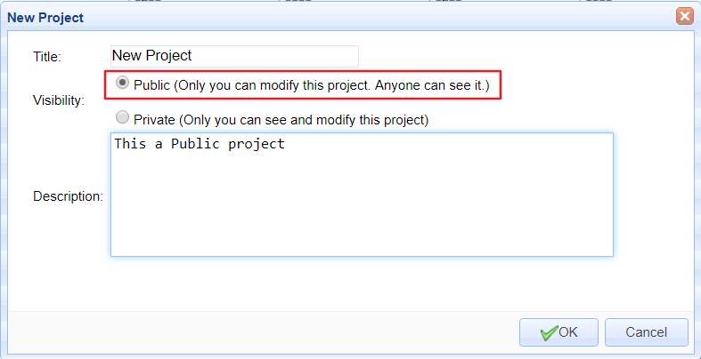  

**Edit Existing Project:**    

When you click **Edit Project**, it will open a website to allow you to set your project to be public.

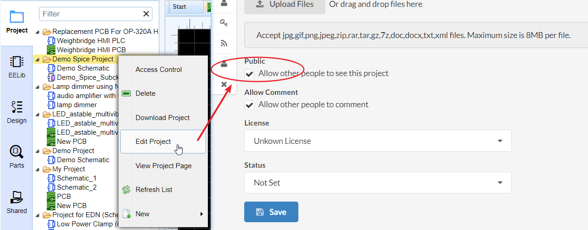  

After setting the project as public, you will see that the Project folder Icon is now shown as a hand holding the folder.

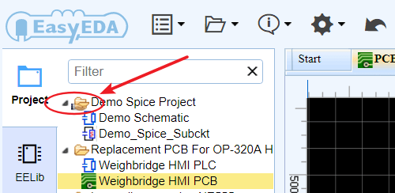

If you then open one of the documents in this share folder, you can then click the Share icon on the toolbar to open the Share my works dialog.

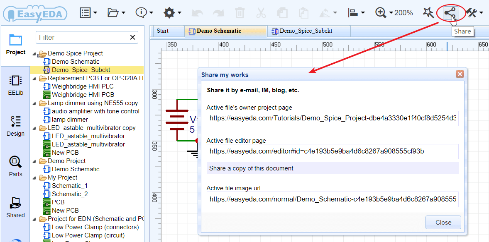

## Access Control 

How about sharing with selected people?

Can you share a private project with your partner? Can your partner modify your designs?

Yes, you can use **Access control** to do this.

Right click the project and you will see the Access Control on the context menu; clicking on it will open the Access Control dialog.  
After adding a user, a user icon will show up beside the project folder icon as below.

So if you want to share a project with someone,

1.  You just need to know their E-mail address which they have used to create an account with EasyEDA

2.  You can share your project as **read** **only** or **read/write**.

After setting up **Access Control** and Permissions, your partner will find your project in the **Shared** section from the left **Navigation Panel** when they login.

If you partner doesn't wish to accept the shared project, they can reject it by right clicking on the project in the Shared with Me section and then clicking on Reject Sharing;

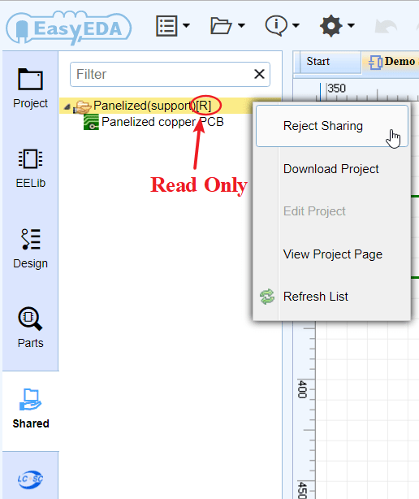 

And you also can check projects that your partner has shared with you in the account dashboard:  

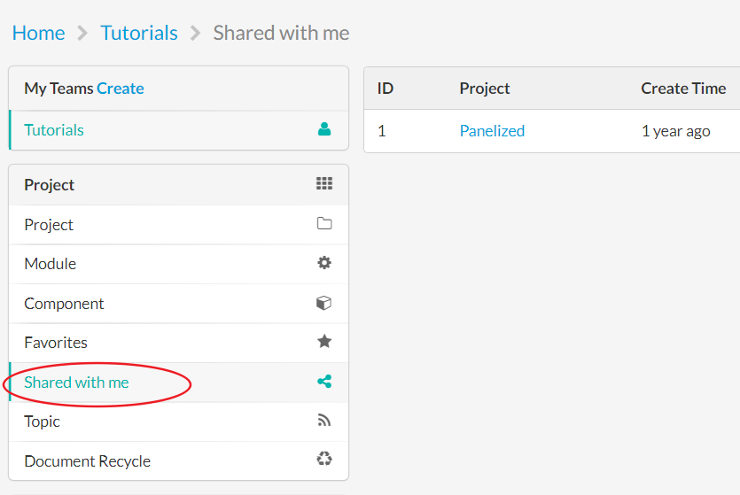 

# EasyEDA API Plug

 Before reading this capture, please check [Open EasyEDA File Format](/Doc/Open-File-Format/) first.

## Why Need API

After route the PCB, you found out that you need to enlarge all tracks size a bit little, How?
After route the PCB, you found out that all Vias' hole size is too small, How to fix this?
How to create a board outline using code? 
EasyEDA API will let you control your designs in an easy way.

## How to use API

### How to find the plug entrance

You can click **Config Icon > Extensions Setting** on the top toolbar image as below.

### Extensions Setting

You can enable or disable the default extensions, after enable, please **reload** the EasyEDA editor. We will give you a file about how to create an extensions soon.   

 
If you enable the **Theme Colors** Extension, you will find a button on the tool bar like bellow image:  
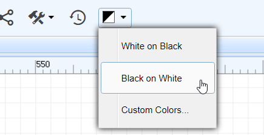   

If you click the **Black On White**, you will find your schematic changes like bellow image, this is useful when you would like to print your design on a paper.  
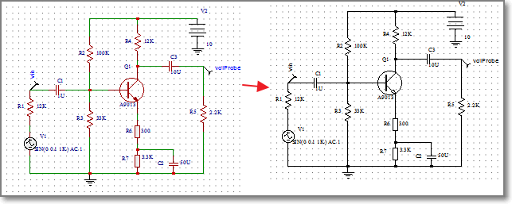.  

You can check our **github** codes of this API via [https://github.com/dillonHe/EasyEDA-Documents/tree/master/API/example/theme](https://github.com/dillonHe/EasyEDA-Documents/tree/master/API/example/theme), check the **manifest.json** and **main.js** out, you will find out how to create an extension.  

**How to install an extension**
 
1. Click the Load Extension button
2. Click the select file button 
3. Select **All** the files.
4. Type a name
5. Click the load button.
6. **Close** EasyEDA editor and open it again.  
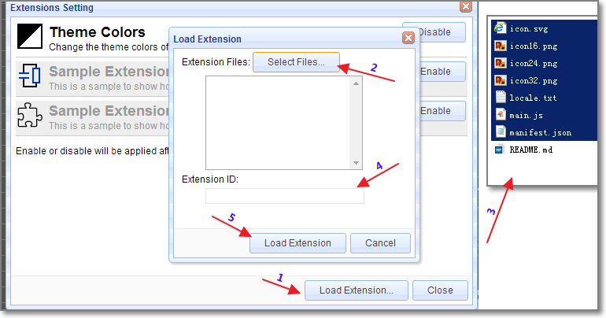.  

### Scripts

If you just need some simple functions, you don't need to create an extension. You just need to create a single Javascipt file and keep it in this list.  

1. You can select the `Hello World`, then click the `Run` button, the response as below image.
2. You can select some items, then try `Move Selected Objects`.
3. You can install your own scripts, then they will show on **User Scripts**.
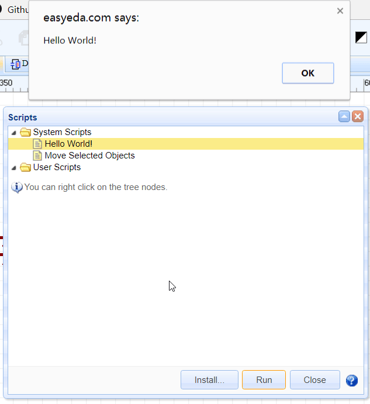.  

### Run Script code

In some case, you just need to run the function one time, such as create a user define board outline in codes, changing the Track width, change the hole size etc. You can use this way.
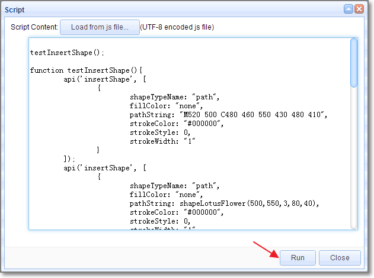.  

**example 1 Art**  
You can open an empty schematic and copy [this example javascript codes](https://raw.githubusercontent.com/dillonHe/EasyEDA-Documents/master/API/example/schematicShapes.js) to the text box to run a test. After clicking the `Run` button, you will see bellow art image.  
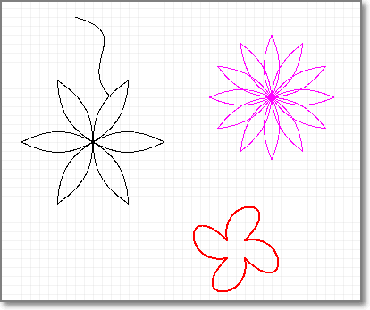

**example 2 Change track width and via hole size**  
You can open a **PCB** and copy [this example javascript codes](https://raw.githubusercontent.com/dillonHe/EasyEDA-Documents/master/API/example/modifyTrackVia.js) to the text box to run a test. After that, All tracks will be 10mil.

## EasyEDA Coordinate System 

EasyEDA's editor is based [SVG](http://en.wikipedia.org/wiki/Scalable_Vector_Graphics), SVG viewport,(Coordinates increase **left-to-right** and **top-to-bottom**, the same as EasyEDA ). But SVG's origin is fixed at the left top corn, and EasyEDA's origin can be modified at the any place.
.   

Be careful this, they are different from **Cartesian coordinate system**  

## Unit

There are two kinds of unit in our editor, SVG Canvas unit and real world EasyEDA unit. SVG Canvas unit is **Pixel**. The real world EasyEDA unit in schematic is also **Pixel**, but in PCB, there are **mm**, **mil** and **inch**. We use bellow map to convert Canvas to real world.
- 1 pixel = 10 mil
- 1 pixel = 0.254mm
- 1 pixel = 0.01inch
There are API for these convert.

	  //mm2pixel: convert 10mm to pixel
      var result = api('unitConvert', {type:'mm2pixel',value:10});

	  //mil2pixel: convert 10mil to pixel
      var result = api('unitConvert', {type:'mil2pixel',value:10});
 
There are other convert method, such as `inch2pixel`, `pixel2mm`, `pixel2mil` and `pixel2inch`.
 
  All EasyEDA's value is based pixel, if you can keep in mind that 1 pixel equal 10mil or 0.254 mm, you don't need to use any convert function. 
For example, if you want to change a Track to 20mil, so you just need to use 2.

## API List

### Get EasyEDA Source

1. get EasyEDA JSON objects, type is `json`, you can check  [PCB Json object](/Doc/Open-File-Format/PCBFileObject.htm) out to know more.

		var result = api('getSource', {type:'json'});

2. get [EasyEDA compress string](/Doc/Open-File-Format/PCB.htm), EasyEDA save this string to our database, it is a bit little hard to read and understand, but it is small in size. EasyEDA save this string to our database. 
    
		var result = api('getSource', {type:'compress'});

3. Get SVG string  

		var result = api('getSource', {type:'svg'});     

Check the [Get EasyEDA source example codes](https://raw.githubusercontent.com/dillonHe/EasyEDA-Documents/master/API/example/modifyTrackVia.js).

### Apply Source

 After you can use your codes to hack EasyEDA's source, then you need to apply the source to EasyEDA's editor. You can  
 
1. Apply as compress string
      
		//will open a new editor and convert compressStr to EasyEDA file.
		api('applySource', {source:'compressStr', createNew: true});
2. Apply as Json object.

		//will modify the active file and convert json object to EasyEDA file.
		api('applySource', {source: json, createNew: !true});

Check the [Apply Source example codes](https://raw.githubusercontent.com/dillonHe/EasyEDA-Documents/master/API/example/modifyTrackVia.js).

### Get Shape

 If you want to get an EasyEDA json object by **id**, you can try to use bellow code.

          var obj = api('getShape', {id:'gge13'})

### Delete Shapes

  Removing shapes by follow code
   
### Update Shape

 If you want to modify an EasyEDA object, you can use this API.

	//Change the net to GND and the shape to ELLIPSE
	 api('updateShape', {
	  	"shapeType": "PAD",
	 	"jsonCache": {
	 	"gId": "gge5",
	 	"net": "GND"
	 	"shape": "ELLIPSE"
		});
 shapeType and gId are must provided.  
1. Schematic   
`shapeType`, `schlib`, `rect`, `polyline`, `polygon`, `wire`, `bus`, `image`, `circle`, `ellipse`, `line`, `path`, `arc`, `annotation`, `junction`, `netlabel`, `busentry`, `arrowhead`, `noconnectflag`, `pin`, `netflag`  
2. PCB   
`shapeType`, `FOOTPRINT`, `TRACK`, `COPPERAREA`, `SOLIDREGION`, `RECT`, `CIRCLE`, `TEXT`, `ARC`, `DIMENSION`, `PAD`, `VIA`, `HOLE`
 

### Create Shape

 If you want to create EasyEDA shape by codes, you can try. We will provide more information about this API soon, now we just provide examples. You will find out how to do.   

		/** with shortUrl
		 * @example
		 * api('createShape', {shapeType:'schlib', shortUrl:'nxlVIGgQO', from:'system', title:'556_DIL14', x:400, y:300});
		 * api('createShape', {shapeType:'FOOTPRINT', shortUrl:'RrkewO60i', from:'system', title:'ARDUINO_PRO_MINI', x:400, y:300});
		 */
		/** with jsonCache object
		 * @example
		 * api('createShape', {
		 *   "shapeType": "PAD",
		 *   "jsonCache": {
		 *     "gId": "gge5",
		 *     "layerid": "11",
		 *     "shape": "ELLIPSE",
		 *     "x": 382,
		 *     "y": 208,
		 *     "net": "",
		 *     "width": 6,
		 *     "height": 6,
		 *     "number": "1",
		 *     "holeR": 1.8,
		 *     "pointArr": [],
		 *     "rotation": "0"
		 *   }
		 * });
		 *
		 * @example
		 * api('createShape', {
		 *     "shapeType": "polygon",
		 *     "stroke": "#000000",
		 *     "stroke-width": "1",
		 *     "stroke-style": "dashed",
		 *     "fill": "none",
		 *     "points": [
		 *         {"x": 390, "y": 580},
		 *         {"x": 450, "y": 450},
		 *         {"x": 520, "y": 580},
		 *         {"x": 610, "y": 490}
		 *     ]
		 * });
		 *
		 * @example
		 * api('createShape', {
		 *     "shapeType": "arrowhead",
		 *     "x": 300,
		 *     "y": 300,
		 *     "color": "#339933",
		 *     "size": "3",
		 *     "rotation": 0
		 * });
		 *
		 * @example
		 * var ts = ["no_connect_flag", "arrowhead", "busentry", "netLabel_GNd", "netLabel_GnD", "netLabel_gnD", "netLabel_Bar", "netLabel_VEE", "netLabel_-5V", "netLabel_+5V", "netLabel_VCC", "netLabel_volProbe", "netLabel_netPort", "netLabel_text", "pin", "annotation"];
		 * for(var i=0;i<ts.length;i++){
		 *     api('createShape', {
		 *         "shapeType": ts[i],
		 *         "x": 300 + i%5*50,
		 *         "y": 300 + (i/5|0)*50
		 *     });
		 * }
		**/
		/** with cached or pre-defined libs
		 * @example
		 * api('createShape', {"shapeType": "pcblib", from:'GeneralPackages', title:'C0402', x:400, y:300});
		 * @example
		 * api('createShape', {"shapeType": "schlib", from:'EasyEDALibs', title:'HDR2X2', x:400, y:300});
		 *
		**/
		/**
		 * @example 4
		 * api('createShape', {
		 *     "shapeType": "schlib",
		 *     "gId": "gge6",
		 *     "head": {},
		 *     "itemOrder": [],
		 *     "annotation": {
		 *         "gge8": api('createShape', 'annotation', {}),
		 *         "gge9": api('createShape', 'annotation', {})
		 *     },
		 *     "pin": {
		 *         "gge11": api('createShape', 'pin', {}),
		 *         "gge14": api('createShape', 'pin', {})
		 *     },
		 *     "polyline": {
		 *         "gge10": api('createShape', 'polyline', {}),
		 *         "gge12": api('createShape', 'polyline', {})
		 *     }
		 * });
		 *
		 * @example 5
		 * api('createShape', {
		 *     "shapeType": "schlib",
		 *     "gId": "gge6",
		 *     "head": {},
		 *     "children": [
		 *         api('createShape', 'polyline', {}),
		 *         api('createShape', 'polyline', {}),
		 *         api('createShape', 'pin', {}),
		 *         api('createShape', 'pin', {}),
		 *         api('createShape', 'annotation', {}),
		 *         api('createShape', 'annotation', {})
		 *     ]
		 * });
		 *
		 * @example 6
		 * api('createShape', {
		 *     "shapeType": "schlib",
		 *     "gId": "gge6",
		 *     "head": {},
		 *     "children": api('createShape', [
		 *         ['polyline', {}],
		 *         ['polyline', {}],
		 *         ['pin', {}],
		 *         ['pin', {}],
		 *         ['annotation', {}],
		 *         ['annotation', {}]
		 *     ])
		 * });
		**/ 

### UI

   If you want to create an extension, not just a run one time script, maybe need toolbar button. You can check the [example](https://github.com/dillonHe/EasyEDA-Documents/tree/master/API/example/theme) before you read.

#### Create Toolbar Button

	 //@example create a button 
	 api('createToolbarButton', {
	  icon:'extensions/theme/icon.svg',
	  title:'Theme Colors...',
	  fordoctype:'sch,schlib',
	  cmd:"extension-theme-setting"
	 });

	 * @example toolbar with menu
	 * api('createToolbarButton', {
	 *  icon:'extensions/theme/icon.svg',
	 *  title:'Theme Colors...',
	 *  fordoctype:'sch,schlib',
	 *  "menu" : [
	 *      {"text":"White on Black", "cmd":"extension-theme-WhiteOnBlack"},
	 *      {"text":"Black on White", "cmd":"extension-theme-BlackOnWhite"},
	 *      {"text":"Custom Colors...", "cmd":"extension-theme-setting"}
	 *  ]
	 * });

#### Create Extension Menu

	/**
	 * @example  
	 * api('createExtensionMenu', [
	 *  {
	 *      "text":"Theme Colors...",
	 *      "fordoctype": "sch,schlib",
	 *      "cmd": "extension-theme-white"
	 *  }
	 * ]);
	 */

### Create Dialog
  check the [example](https://github.com/dillonHe/EasyEDA-Documents/tree/master/API/example/theme) 

### Command List

#### Clone

      // clone gge2 gge3 and return their new ids.
      var newIds = api('clone', {ids:["gge2","gge3"]})

#### Delete

	  api('delete', {ids:["gge2","gge3"]});

#### Rotate

    // rotate ids to 90 degree
    api('rotate', {ids:["gge2","gge3"],degree:90});

#### Rotate Left

    //anticlockwise
    api('rotate_left', {ids:["gge2","gge3"]});

#### Rotate Right

    //clockwise
    api('rotate_right', {ids:["gge2","gge3"]});

#### Fliph

    api('fliph', {ids:["gge2","gge3"]});

#### Flipv

    api('flipv', {ids:["gge2","gge3"]});

#### Align Left

    api('align_left', {ids:["gge2","gge3"]});

#### Align Right

    api('align_right', {ids:["gge2","gge3"]});

#### Align Top

    api('align_top', {ids:["gge2","gge3"]});

#### Align Bottom 

    api('align_bottom', {ids:["gge2","gge3"]});

### Selection

 Change or get selection states of EasyEDA objects in editor.

#### Select

      // gge2 and gge3 will be marked as selected.
      api('select', {ids:["gge2","gge3"]});

#### Select None

      //no objects will be selected.
      api('selectNone');

#### Get Selected Ids

     var ids = api('getSelectedIds');

### Move

You can use [Update Shape](#UpdateShape) to change the shapes position, but the Move method is better in this case.

#### Move Objects

Move shapes in relative coordinates, like move the shapes in arrow keys.

	//Move gge2 and gge3 from left to right in 20pixel or 200mil step
    //from top to bottom in 20pixel or 200mil step.
	api('moveObjs', {objs:[{gId:"gge2"},{gId:"gge3"}], addX: 20, addY: 20});

	//Move gge2 and gge3 from right to left in 20pixel or 200mil step
	api('moveObjs', {objs:["gge2","gge3"], addX:-20});

	//Move selected objects from left to right in 20pixel or 200mil step
	api('moveObjs', {addX:20});

#### Move Objects To

How to move a `VIA` or `junction` to position `{x:'10mil', y:'10mil'}` ?, Move shapes to absolute coordinates.
	
	 //Move gge2 and gge3 to Canvas postion 20,20, the real coordinates are dedpend the origin.
	 api('moveObjsTo', {objs:[{gId:"gge2"},{gId:"gge3"}], x:20, y:20});

	//move gge2 and gge3 to 10mm, 10mm coordinates
	 api('moveObjsTo', {objs:["gge2","gge3"], x: api('coordConvert', {type:'real2canvas',x: '10mm'}), y: api('coordConvert', {type:'real2canvas',y: '10mm'})});

	//Move selected objects to Canvas postion 20,20, the real coordinates are dedpend the origin.
	 api('moveObjsTo', {x:20, y:20});
It is very easy to understand to move a PAD, VIA, Junction to absolution coordinates. But what are the effects of moving TRACK, FOOTPRINT, netlabel to some where. Just try to play the codes, you will find out the regular pattern.

### SetOriginXY

EasyEDA's canvas origin is 0,0, you can't change it. But the real coordinates can be mapped to any where.   

	//set the real origin point to canvas x = 400, y = 300. X,Y is pixel all the time.
    var result = api('setOriginXY', {x:400,y:300});

### Coordinate Convert

You can use mm or mil or inch as units, but when you apply the Parameters to SVG graph, you must use coordinate convert. 
    
    //convert the canvas x 400 to real postion, the value is depent your units and origin point.
    var result = api('coordConvert', {type:'canvas2real',x:400})

    //the default units is your canvas units, but you can add a units like 300mm. 
    //if your PCB's units is mil, then you will get the canvas coordinate 400mil,300mm.
     var result = api('coordConvert', {type:'real2canvas',x:400,y:'300mm'});

  If you set the origin to **0,0**. It is very easy to map the coordinate in your mind, you don't need to use API to convert. the canvas coordinate **100,100** equal the real coordinate **1000mil, 1000mil** or **1inch, 1inch** or **393.7mm, 393.7mm**

### Value Convert

 How to set the pad's hole size to 20mm? How to set the Track width to 20mil?
     
    //the default units is your canvas units, but you can add a units like mm, mil, inch, even pixel.
     var result = api('valConvert', {type:'real2canvas',val:400});
     result = api('valConvert', {type:'real2canvas',val:'400mm'})
    
     //convert the 400 pixel to real value, the value is depent your units , if the unit is mil, the result should be 4000
     //result = api('valConvert', {type:'canvas2real',val:400})

  If you can keep in mind 1pixel in canvas equal 10mil, so you don't need this API, you can do it in raw way. For example,
  If you want to update the track size to 20mil, you can do.

	 api('updateShape', {
	  	"shapeType": "TRACK",
	 	"jsonCache": {
		 	"gId": "gge5",
		 	"strokeWidth": 2
        }
		});
  Or

	 api('updateShape', {
	  	"shapeType": "TRACK",
	 	"jsonCache": {
		 	"gId": "gge5",
		 	"strokeWidth":  api('valConvert', {type:'real2canvas',val:'20mil'})
        }
	 });

### Get SVG Arc Path

 SVG [Arc path Parameter](http://www.w3.org/TR/SVG11/paths.html#PathElement) is very complex,  We provide a API to convert human read ARC parameter to SVG path.

	 var result = api('getSvgArcPathByCRA', {cx:0, cy:0, rx:90, ry:90, startAngle:0.1, endAngle:0.7, sweepFlag:1});

result should be `M89.55037487502231 8.985007498214534A90 90 0 0 1 68.83579685560396 57.97959185139219`

## Examples

Check [Github example](https://github.com/dillonHe/EasyEDA-Documents/tree/master/API/example)

Enjoy it, if you have any questions, do let us know.                    

# FAQ

Please spend a few minutes reading this FAQ, it will save you lots of time getting started with EasyEDA.

## Concept

### How to find the list of hotkeys.

[https://easyeda.com/Doc/Tutorial/Introduction.htm#Hotkeys](https://easyeda.com/Doc/Tutorial/Introduction.htm#Hotkeys)

### Where are my files?

Your files are stored on EasyEDA servers, so you can access them anywhere and share them with your partners.
 
### Why does EasyEDA focus on Cloud based EDA?

EasyEDA is built for people who like to work anywhere, who like to build projects together with other team members, who like to share their projects, who like something that operates like a github for hardware design. The only way to meet these needs is to build a Cloud version EDA.

### How can I work if there is no internet?

Although most of the time there are ways to access the internet easily and cheaply there may be times when, for whatever the reason, internet access is simply not possible. For times like this, EasyEDA is working to provide a desktop client soon.
  
### Does EasyEDA have a desktop version?

   At present, no but EasyEDA is developing and testing a desktop version to be introduced soon. 
   
   A Windows version will be available at the end of this year. Mac and Linux versions will be available early next year. 

### Which Browser is best for EasyEDA?

  **Chrome**. Firefox and Safari are OK too. If you are restricted to using other browsers, it would be better to download the EasyEDA desktop client when it becomes available (see above).

### How to go to your dashboard.

In the [Dashboard](https://easyeda.com/projects/mylists), you can check all your Projects, Modules, Components and Favorites, projects others have shared with you, forum posts and orders. 
 
There are two ways to arrive there.  

1. From the Editor, you can click on the EasyEDA logo or user logo:  
	      

	  

2. From the homepage, you can click My Projects:  
	 

## Projects and Files
  
### How to delete a project.

   Select it and right click to open a context menu, like the image below.
   

 
### How to delete a schematic or PCB.

   Select it and right click to open a context menu, like the image below.
 
 

### How to share a project with others.

1. Make your project public.  
Open [https://easyeda.com/projects/mylists](https://easyeda.com/projects/mylists), then click the red `No entry' icon where indicated by the arrows. This icon will change to a green 'Tick' icon to show that the project is now public.
  

2. To share a project privately with only selected collaborators via:  
[Access Control](https://easyeda.com/Doc/Tutorial/Share.htm#Access-Control)   
You can right click your project and select the access control menu:
 
  
       
### How to find the version history of schematics and PCBs.

  The version history of your EasyEDA schematics and PCBs can be accessed by right-clicking on the file you wish to query to open the context menu as shown in the image below: 
  
   
 
 Then click on the version number that you wish to view.
 
 **Note:** *saving a previous version will restore that version to being the current version of the file.*

## Schematic

### If I update the schematic, how do I then update the PCB?
  
The initial conversion of a schematic to PCB is done from within the Schematic Editor using the `Convert Project to PCB...` button as illustrated in the toolbar below but a new `Update PCB` button has been added so that modifications to the schematic can immediately be passed forward to update a selected PCB without having the PCB editor window already open. 
   

Alternatively, you can import changes from the schematic from within the PCB Editor:

[https://easyeda.com/Doc/Tutorial/PCB.htm#Import-Changes](https://easyeda.com/Doc/Tutorial/PCB.htm#Import-Changes)

### How to rename a Sheet/Document or modify description.

In this menu, there is a `Modify` option, so you can rename your files.  
  

### How to find components

The component search function has been significantly improved to make finding part symbols and footprints quicker and easier. Press `SHIFT+F` or click on the `Parts` icon on the left navigation panel: 

 

In the new components dialog, it is easy to select the right components via tags and you can set tags for your own components.

### How to add sub parts to a schematic.

 You can add sub parts to a schematic one by one but please note that the sub parts prefix must be in the form of U1.1 U1.2 etc, and not U1.A U1.B.
 

### What is the unit of the schematic sheet?

  The basic unit of the schematic sheet is the pixel. 1 pixel is about 10mil (0.001 inch) but please note that this use of the pixels as a unit in a schematic is just for reference.

### For a complex project, I want to split the schematic over several sheets. Does EasyEDA support hierarchy?

 Please check out this link [https://easyeda.com/Doc/Tutorial/Schematic.htm#Hierarchy](https://easyeda.com/Doc/Tutorial/Schematic.htm#Hierarchy)

 
### How to change the sheet size and modify the design information.

To change the sheet size, move the mouse anywhere over the lower right area of the drawing border or frame until the whole border highlights red and then right-click on it. Paper size and orientation can then be changed in `Sheet Attributes` in the right hand panel.

To modify the design information, left-click on the relevant blue text in the lower right area of the drawing border or frame to change it in `Text Attributes` in the right hand panel.  Double left-clicking the blue text will allow you to type new information directly into the field. 

   

##Schematic library symbol

### How to create a schematic library symbol.

**Document > New > Schematic Lib**

 

### How to tag my schematic library symbol.
  
   

### How to create sub parts for multi-part components.

In My Parts, Right click the part then select **Add Sub Part** from the menu that opens:
   

### How to change the Package for a component.

[https://easyeda.com/Doc/Tutorial/Schematic.htm#Update-Package](https://easyeda.com/Doc/Tutorial/Schematic.htm#Update-Package)

## PCB

### How to change the Units of PCB from mil to mm or inch.

There is an option for that in PCB canvas attributes:   
 
 
### How to pick and move the components on the PCB canvas quickly.

 Before routing the PCB, the components need to be positioned in suitable places on the PCB. In the PCB Editor, it can sometimes be quite difficult to select components by clicking on the silkscreen outline or the pads. To select and move them more easily, please use drag mode (Hot Key `D`) or click the `Move` icon in the PCB Tools toolbar:  
 
     

### Can I create a PCB without creating schematic?
  Yes but for any but the simplest PCBs, please see:
  
[https://easyeda.com/forum/topic/The_best_way_to_design_a_PCB_in_EasyEDA-ThR3pwqIC]( https://easyeda.com/forum/topic/The_best_way_to_design_a_PCB_in_EasyEDA-ThR3pwqIC)

### How to add more fonts for PCB.

You can refer to [Text](./PCB.htm#Text) of PCB section.

### How to insert an Image/Logo to PCB.

You can refer to [Image](./PCB.htm#Image) of PCB section.

### How to insert a DXF board outline.

You can refer to [Import DXF File](./Import.htm#Import-DXF-File) of Import section.

### How to create non rectangular pcb outline such as round? 
  You can import a DXF file for the board outline. For a round board outline, you can use an arc to do that, you just need to change to the board outline layer, then draw 1 arc like in the image below (need to adjust a bit later), you can use lines and arcs to create complex board outlines.

 

### How to add a slot and cut out. 

[https://easyeda.com/Doc/Tutorial/PCB.htm#Pad](https://easyeda.com/Doc/Tutorial/PCB.htm#Pad)
and [https://easyeda.com/Doc/Tutorial/PCB.htm#Solid-Region](https://easyeda.com/Doc/Tutorial/PCB.htm#Solid-Region)

### How to measure dimensions on a PCB.

[https://easyeda.com/Doc/Tutorial/PCB.htm#Measure-Dimension](https://easyeda.com/Doc/Tutorial/PCB.htm#Measure-Dimension)

### How to add more layers.
 Click the layer options button, then tick the extra layers in the dialog that opens.
  
 
### How to add solder mask.
It is possible to get boards with the copper exposed so that you can apply a layer of solder over those tracks to further increase their current carrying capacity. In this case, you need to add solder mask over a copper (copper area, track, solid region). 
EasyEDA will add solder mask for pads automatically. Sometimes however, you may need to add an aperture in the solder mask to expose and area of copper.  

1. First, add a top or bottom solder mask layer, as required.  

	   

2. Next, draw a region in the solder mask layer over a copper item as illustrated in the image below. This in effect draws an aperture in the solder mask so that the copper item inside the region, in this case the track, will be not be covered by the green film of solder mask.  
  
	    

A common mistake is to just draw a solder mask, without a copper area, like the track pointed to by the yellow arrow. That is incorrect and does not produce the desired result.
 
### How do I set the dimensions of my PCB in the layout?

 PCB's dimension/size depends on the board outline, you can create your board outline, please refer to [Board Outline](./PCB.htm#Board-Outline) of the PCB section.

### My PCB is complex, how can I be sure that I have routed all of the tracks?

 Please refer to [Design Manager](./PCB.htm#Design-Manager) of PCB section. 
 

### I need to start my layout again, how can I remove all of the tracks?

### How to put a component on the bottom layer?
 There are two ways to do this.
 
1. If your active layer is the bottom layer, then every component you place will be placed on the bottom layer automatically.
2. You can place a component then select it and change its layer attribute to `Bottom layer` in the right hand panel.
 

### I can't convert schematic to PCB. Why is this?
 1. You have not set the right packages for your components. 
 2. https://easyeda.com/Doc/Tutorial/Schematic.htm#Prefix-Conflict-Error
 3. https://easyeda.com/Doc/Tutorial/PCB.htm#Invalid-Packages

## PCB package.
### How to create a PCB package/library.
   

##Keep in Mind

  1. There is no need to back up your schematics and PCBs manually. After the first save of any file, EasyEDA will back up all saved files automatically  under the [Version History](https://easyeda.com/Doc/Tutorial/Introduction.htm#Version-History). If you want to back up your files locally, you can download a copy of the whole project or of individual files in a project in EasyEDA Source (JSON) format:
  
   
  
  and;
  
  **Document > EasyEDA Source > Download**
  
   
 
  
  2. If you need help, you can contact us  or ask via our [Support Forum](https://easyeda.com/forum); we will respond ASAP.
   
  
## Most Common Errors on EasyEDA.

  1. Manually creating backup schematics into the same project. When a project is converted to PCB, EasyEDA will merge all of the schematics under the same project into a single PCB. If there are multiple copies of the same schematic in a project then this will create errors such as duplicate part prefixes. Especially if you are new to EasyEDA, just keep one copy of each unique schematic in any one project. 
  2. Saving schematic and PCB into different projects. Unless you are absolutely sure that you will not need to update (Synchronise) your PCB from changes made to your schematic then please keep the schematics and PCB under the same project.
  3. Bad packages. Schematic symbols must have the appropriate footprints assigned to them, these footprints must exist in the library and - for any footprint that you have not created yourself - you must have clicked on the **Favorite** option in the component search window to add it to your **Favorite Parts** list in the left hand Navigation panel.
  
  4. Using the polyline from the Drawing Tools Palette to connect symbol pins. To connect components together, you must use Wires from the Wiring Tools Palette.
  
 
## Spice Simulation FAQ

EasyEDA's main target is schematic and PCB, not simulation. EasyEDA only support simple schematics simulation.

### How to set the resistance of a resistor 

   You can use the name attribute. Just set the name or double click the value text.

 

### Where Can I find the Probe?

  Voltage probe   
   

### Why I can't simulate my schematic

   EasyEDA only has very few simulation models, EasyEDA is powered by [http://ngspice.sourceforge.net/](http://ngspice.sourceforge.net/) please check Ngspice to know what can be simulated.

## Others.

### Does EasyEDA canvas use the Cartesian coordinate system?

 Yes and no. 
 
 It uses X and Y coordinates where the horizontal X coordinate is positive to the right of the origin and negative to the left but the vertical Y coordinate is positive **below** the origin and negative above it. 
 
 Actually, we think our coordinate system is not very good but it is hard to change. 
 
  

# PCB Order 
  After laying out your PCB, you probably want to order some **PCBs**. We have made it easy for you to save time and money by using our **awesome service** to order **low cost**, **high quality** PCBs *directly* from EasyEDA. More importantly, if you are not satisfied with the quality of our PCBs, EasyEDA will refund your money in full.

  Although EasyEDA makes it easy to order PCBs for your projects and offers an exceptionally low PCB Manufacturing fee, you are free to download the Gerber files and order your PCBs from any other vendor. However, if you like EasyEDA, please give us a chance to fab. the PCB for you. We think you won't be disappointed.

## PCB Quality
   As engineers, we have spent more than 6 years building EasyEDA. As artisans, we believe that if you like using our EDA tools, then you will like our PCBs. 

   EasyEDA's PCBs are in a group buy model and all PCBs are given 100% E-test. This allows us to provide you with good quality, tested PCBs at a great price. We have shipped thousands to our users, all of whom like our PCBs. 

 No matter how good we tell you our service is, maybe you still have doubts. The easy way to remove those doubts is to try it out because - as we have said above - if you are not satisfied with the quality of our PCBs, we will refund your money in full. For details of this offer, please check the [Warranty and Return](#WarrantyandReturn). 

## Order Button
To order PCBs from us, just click the **Fabrication Output...** button in the PCB Editor window, as shown in the image below, and you will be redirected to an order page. In that page you can place an order quickly and easily. At the same time, at the click of a button, you can check the Gerber and drill files in our Online Gerber Viewer and then download your files. Obviously, we hope that you will support EasyEDA by ordering your PCBs from us but you are welcome to download the Gerber and drill files and send them to your favorite PCB house.

## PCB Order from EasyEDA Editor
   When you click the `Fabrication Output...` button your order is coming from within the EasyEDA editor environment so you don't need to input information about **Layers**, **Width** and **Height**; EasyEDA fills this information in for you. 

   On the order form page you will find a real time price. Most of the time this price is the final cost however if, for example, you change the Layers to 4 or 6, you will find the price field changes to **Quote**. If that happens, don't worry: just click the `Save to Cart` button and we will email a quote for the final price to you ASAP. 

 **Note:**   

- *When you add your PCB to the cart, EasyEDA saves a copy of Gerber files at that time.*   

- *If you then change your PCB back in the PCB editor, **EasyEDA does not synchronize your Gerber files to the updated PCB design**.*  

- *The only way is to delete the earlier version of the PCB from your Cart and then add the updated design as a new item.*

 

## PCB Order from Order Link
  If you would like to upload your own Gerber files from a third party PCB tool such as Eagle, Pads, or Altium Design, just click on this link [https://easyeda.com/order](https://easyeda.com/order) to order. This page will let you upload your own Gerber Files.

 

## PCB Capabilities 

<table>
<tbody>
<tr>
<td width="200">Number of Copper Layers*</td>
<td width="400">1-16</td>
</tr>
<tr>
<td>PCB Material</td>
<td>FR-4, FR4-Tg, FR4-High Tg</td>
</tr>
<tr>
<td>Available Solder Mask Colors</td>
<td>Green, Red, Yellow, Blue, White, Black</td>
</tr>
<tr>
<td>Silk Screen Colors</td>
<td>White, Black (For White Solder Mask only)</td>
</tr>
<tr>
<td>Minimum Quantity</td>
<td>5</td>
</tr>
<tr>
<td>Minimum dimensions*</td>
<td>0.4cm x 0.4cm</td>
</tr>
<tr>
<td>Maximum dimensions*</td>
<td>100cm x 100cm</td>
</tr>
</tbody>
</table>

* If your PCB requires more than the default maximum of 6 layers (up to a maximum of 16) or larger dimensions, then please contact us before placing your order

* If your PCB dimensions are bigger than 45cm * 45cm, it may add some additional cost  

## Manufacturing Specifications:
<table border="1" cellpadding="2" cellspacing="2">
<tbody>
<tr bgcolor="#ccc">
<td rowspan="2">Item</td>
<td colspan="3">Specs</td>
</tr>
<tr bgcolor="#ccc">
<td>Unit: mm</td>
<td>Unit: mil</td>
</tr>
<tr>
<td>Available Board Thickness</td>
<td>0.4, 0.6 (except 4 layer), 0.8, 1.0, 1.2, 1.6, 2.0</td>
<td>15.7, 23.6 (except 4 layer), 31.5, 39.4, 47.2, 63.0, 78.7</td>
</tr>
<tr>
<td>Thickness Tolerance</td>
<td>(t &gt;= 1.0) ± 10%</td>
<td>(t &gt;= 39.4) ± 10%</td>
</tr>
<tr>
<td>Thickness Tolerance</td>
<td>(t &lt; 1.0) ± 0.1%</td>
<td>(t &lt; 39.4) ± 0.1%</td>
</tr>
<tr>
<td>Insulation Layer Thickness</td>
<td>0.075 - 5.0</td>
<td>2.95 - 196.85</td>
</tr>
<tr>
<td>Minimum trace width</td>
<td>0.089</td>
<td>3.5</td>
</tr>
<tr>
<td>Minimum inner trace width </td>
<td>0.127</td>
<td>5</td>
</tr>
<tr>
<td>Minimum trace/vias/pads space</td>
<td>0.102</td>
<td>4</td>
</tr>
<tr>
<td>Minimum inner trace/vias/pads space </td>
<td>0.102</td>
<td>4</td>
</tr>
<tr>
<td>Minimum silkscreen width</td>
<td>0.1524</td>
<td>6</td>
</tr>
<tr>
<td>Minimum silkscreen text size</td>
<td>0.8128</td>
<td>32</td>
</tr>
<tr>
<td>Outer Layer Copper Thickness</td>
<td>&gt; 0.03</td>
<td>&gt; 1.18</td>
</tr>

<tr>
<td>Drilled Hole Diameter (Mechanical)</td>
<td>0.3 - 6.35</td>
<td>11.81 - 250.00</td>
<tr>
<td>Drilled Hole Diameter (Laser)</td>
<td>0.2 - 0.3</td>
<td>7.87 - 11.81</td>
</tr>

<tr>
<td>Diameter Tolerance (Mechanical)</td>
<td>	±0.08 </td>
<td>	± 3.148</td>

<tr>
<td>Solder Mask Bridges</td>
<td>0.1</td>
<td>3.94</td>
</tr>

<tr>
<td>Circuit to edge</td>
<td>≥0.3</td>
<td>≥11.8</td>
</tr>
<tr>
<td>Slot</td>
<td>≥0.6</td>
<td>≥23.6</td>
</tr>
<tr>
<td>Slot Tolerance(Mechanical)</td>
<td>±0.15</td>
<td>±6</td>
</tr>

<tr>
<td>Aspect Ratio</td>
<td colspan="2">8:1</td>
</tr>
<tr>
<td>Solder Mask Type</td>
<td colspan="2">Photosensitive ink</td>
</tr>
</tbody>
</table>

If you have any special PCB requirements, please contact us before placing your order. 

## Price

All Prices stated are FOB Shenzhen. This does not include transportation costs which shall be borne by the customer. 

### Manufacturing Price

Price is dependent on many factors, such as the quantity of PCBs you order, PCB Color, Surface Finish, PCB Thickness, PCB Dimensions, Hole size etc. 

EasyEDA uses a group buy business model and we are sure it will be hard to find a better PCB supplier than EasyEDA offering the same price and quality.

EasyEDA needs 2~4 days to manufacture the PCBs after you submit payment.

### Shipping Costs
<table>
<tbody>
<tr bgcolor="#ccc">
<td width="50">Method</td>
<td width="300">note</td>
<td width="50">Price</td>
<td  >Service</td>
</tr>
<tr>
<td><strong>&nbsp;Air Mail</strong></td>
<td>&nbsp;Delivery Time: 8-35 days. Most of our users receive their PCBs in two weeks.</td>
<td>From $6</td>
<td >Usually  http://www.singpost.com/ </td>
</tr>
<tr>
<td>&nbsp;<strong>Express</strong></td>
<td>&nbsp;Delivery Time: 3-7 days</td>
<td>From $24</td>
<td >Usually delivered by http://www.DHL.com/ </td>
</tr>
<tr>
</tbody>
</table>

Note: The shipping cost is estimated. EasyEDA will always try to find the best shipping option.  If you are in some [Remote Areas](http://raslist.dhl.com/jsp/first.jsp), we will ask you to pay for more or change to some other express service such as Fedex, UPS. Sometimes, we will use [Hongkongpost](http://www.hongkongpost.hk/eng/index.htm) for delivery by Airmail.

## File Name
If your Gerber file names are good, this will save us a lot of time in checking your design. 
There are many different PCB design software packages so there are many variations of Gerber file names and filename extensions. 

Gerber Type

 

If you don't know how to map your files, don't worry about changing the file names and please contact support for help.

**We encourage you to use our free online [gerber viewer](https://gerber-viewer.easyeda.com/) to check your gerber files before placing an order.**

## E-Test
All PCBs undergo a 100% AOI (Automated Optical Inspection) to make sure that all tracks and pads are connected.
In addition to this the PCBs can be tested by a flying probe to make sure that all vias are connected, because this is not visible by the AOI. Single layer PCBs do not require this test because there are no vias but boards with 2 layers and above will always be 100% tested with a flying probe.

## Payment
We accept the PayPal, Credit Card and Wire Transfers. 

### PayPal and Credit Card
We use Paypal as our payment; it is safe and easy. If you don't have a Paypal account, you can still use Paypal to pay with a debit or credit card.

 

### Wire Transfers
Wire Transfers can only be used on orders with a grand total (subtotal plus all additions and deductions but excluding shipping fees) of at least $600. For orders > $2000, payment by Wire Transfer is preferred. In this circumstance, 3.5% extra discount will be applied for the grand total (subtotal plus all additions and deductions but excluding shipping fees). Wire Transfer payments usually take 3-5 business days to clear. We will not ship your order until your payment is verified by our bank. Please send a copy of the Wire Transfer receipt to our customer service because although it is not sufficient to release an order, it will help us to push the delivery date. 

## Customs, Duties and Taxes
You should expect to pay any amount charged by the government in your respective country. This includes but is not limited to: duties, taxes and any extra fees charged by the courier company. We will not be held responsible for any extra charges once the original package has been shipped. If the customer refuses to pay these extra charges, the return shipping and any additional fees will be taken out of the cost of the order, with any remaining funds being refunded to the customer.
Customs are quite different in each country. Please include information about particular Customs requirements as necessary, while you are placing your order: we will support you as much as possible. 

## Warranty and Return
For your first order for a PCB laid out in **EasyEDA**, we have the top return policy on the planet! If you don't like them, just send an email to 

, no reason needed. We will provide your full money back - including product + shipping costs - in one working day. 

For subsequent orders, because you now know the quality level of our PCBs, if you are not satisfied with a product you bought from us for whatever reason, you just need to email us some pictures of the product and explain why you are not happy with it. We will then refund the full money of the product. Shipping fees will only be refunded if the return is a result of a shipping error on our part. 

# PCB Parameter Description
##PCB Dimension
EasyEDA supports the design of PCBs up to 50cm * 50cm however we suggest our customers try to limit the design to a PCB size of no larger than 45cm * 45cm. We may have to charge more for PCB sizes greater than this because they are harder to fabricate and need a bigger box with more packaging to protect them in shipping.

* If the size is smaller than 2cm, you need to panelize them to big size, or we can't help you to do the E-test.

##PCB Quantity
 EasyEDA uses a group buy model, so the price is very low, but the minimum number of PCBs should be 5 pcs. So for example, if you need 2 pcs, you need to order 5 pcs and similarly, if you need 7 pcs you need to order 10 pcs. 

##PCB Thickness
   EasyEDA PCB provides 0.4mm, 0.6mm, 0.8mm, 1.0mm, 1.2mm, 1.6mm, 2.0mm thickness to choose from. If you need a 2.5mm or 3mm thickness board, please ask us for a quote via email.  Please note that not all thicknesses will be available for all numbers of layers; for example no PCB house can fabricate a 32 layer PCB with a 0.4mm thickness!

##PCB Stack up

###2 Layer PCB stackup 1Oz
  

###2 Layer PCB stackup 2Oz
  

###4 Layer PCB stackup 1Oz
 

###4 Layer PCB stackup 2Oz
 

###6 Layer PCB stackup 1Oz
 

For other numbers of layers or for a different layer stack up, please email us before placing your order.

##Copper Weight
  You can select 1oz, 2oz in our order page. 

   1. For 1Oz, the track width and clearance can be 3mil. 

   2. For 2Oz, please make sure the clearance is bigger than 8mil. 

##Different Design in Panel 
Some customers would like to merge more than 1 PCB in the same Gerber. We know you want to save money but this may make it **hard to cut the board outline** and more importantly this will take a lot more time to pick up and package the PCB. Although by ,doing this, you just have the one order, this complicates the fabrication of the panel and separation of the individual PCBs, so we will usually charge more for this. Similarly, using holes or slots as break off sections between boards are treated the same way as putting more than one design on a panel, each with its' own board outline. 

Note: This additional charge only applies if the PCBs on a panel are different. Boards such as in the left hand image below will not incur an additional charge because they are easy to pick up but boards such as in the right hand image would incur an additional charge.

   

If you are just in the prototype phase and want to save money, then you can use the following trick. Place your different designs all inside one overall board outline and use lines drawn in the silk layer to mark out the separate the PCBs. Then, when you receive the PCB, carefully cut them apart yourself (we recommend you do this before you assemble the PCBs!). Like the PCB shown below, the yellow lines are drawn in the silk layers showing how you can merge 3 different PCBs in one gerber without incurring any extra costs.

  

## V-cut/V-Groove

   This will help you to build a PCB Array to save time by making it faster to solder the PCB in SMT. 

   

   1.  The V-cut line should be the same as the outline of the Sub-PCB. That is to say, there is zero space between the sub-boards.

   2.  The PCB panel needs to be larger than 8 * 8cm.

   3.  The V-cut line must cross the whole panel or else the factory can't add a V-groove on the PCB because the milling cutter may destroy any sub-PCBs on the V-cut line. They also cannot stop part way across the panel. The V-cut lines shown below are not acceptable:

   
​     

##Material Details
  EasyEDA supports FR4-Standard Tg 140C, FR4-Tg 150C, FR4-High Tg 170C. The FR4 TG's lead time may be more than 6 days. 90% of EasyEDA orders use FR4-Standard. For more information about this, please check the [FR4 Material pdf](images/FR4-material.pdf "FR4 material")

##Smallest Holes Diameter
   0.3mm for mechanical drill, 0.2mm for the laser drill. To save money, please use a minimum drill diameter of 0.3mm.

##Ring
 The width of the ring around vias or pads should be wider than 6mil/0.15mm.

  

##Min. Tracing/Spacing
 We support down to 4mil but to save money, please use 6mil.   
  

##Grid size
Make sure the Grid filled size is bigger than 8mil/8mil ( track/space), if less than that, we will change it to 8mil/8mil .

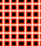

##Impedance Control
 We support 5% and 10% precision. Please add enough information about your impedance control requirements to help us to fabricate your PCB.

##Gold Fingers
If you wish to built PCBs that plug directly into edge connectors, such as memory cards, please choose **Gold Fingers** as shown in the image below:  
  

 

##Half-cut/Castellated Holes
If you need to build some PCBs as shown in the image below, please choose **Half-cut** holes.

##Panel by EasyEDA
 When your Gerber is for just one design and you need EasyEDA to help you to duplicate many copies onto one panel, you can use this option.
   You can drag across the rectangles to select then click on the panel to set how many rows and columns as shown in the image below:

For this image, we will merge 10 small PCBs to 1 big panel. If you order 5 pcs, then we will send 5 big panels to you, each with 10 PCBs on it so you will end up with 50 small PCBs.

If you select the **Edge Rails**, we will add a 5mm board edge as shown in the image below:
This is 2 rows and 5 cols panel PCB.

   

**Note:**   

1. *Make sure the single PCB size is bigger than 2cm x 2cm, or we will charge $20 for the v-cut cost. Small PCB is hard to v-cut.* 
2. *Make sure the board outline is simple, for complex board outlines, you need to panelize by yourself. Or you can pay us $15 to do that, we will send the panelized gerber to you to confirm.*
   ​    

# Stencil Parameter Description
A Stencil can help you to solder the PCB quickly. For efficient and reliable SMT assembly a Stencil is a must.
EasyEDA can provide the option of NON-FRAMEWORK (or frameless) and FRAMEWORK stencils.
The right hand image below shows a frameless stencil. Frameless stencils are cheaper and lower weight(0.2Kg) so they can help to reduce the shipping cost.

  

 

# Order FAQ

## How to check the Shipping Cost?

We can ship PCBs to any country. The shipping cost depends on the weight of the boards, country, and shipping method. Before you pay, you can see the shipping cost and select the shipping method. So you just need to add it to your cart and then you will see some options like in the image below:

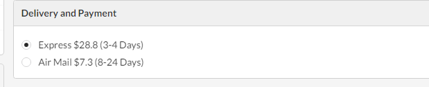

## How to order lots of PCB together?

EasyEDA allows you to order many different PCBs together,  just add the PCB to cart one by one , at last to pay for together.

## How to remove the customer ID on the PCB?
EasyEDA uses a group buy model to save the cost of production, for picking up your PCB easier, we need to add a very small string to your PCB, the string might be under some IC, and if you solder the PCB, the string will be hidden. If you don't like it, there are two ways.

1. Email us, we will fabricate your PCB in another way, but the cost will be higher.

2. When you order, you can use https://easyeda.com/Doc/Tutorial/PCBOrderFAQ#Panel-by-EasyEDA and keep the edge, we will add the string at the dirty edge, so there is no string on your product PCB.

​                    