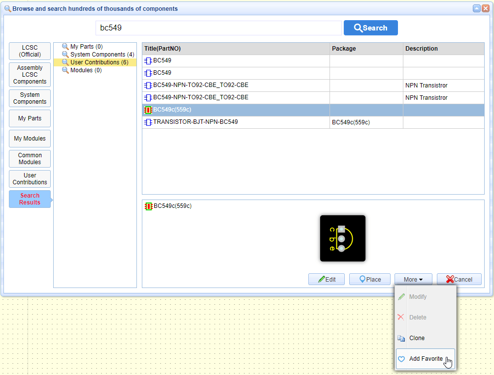
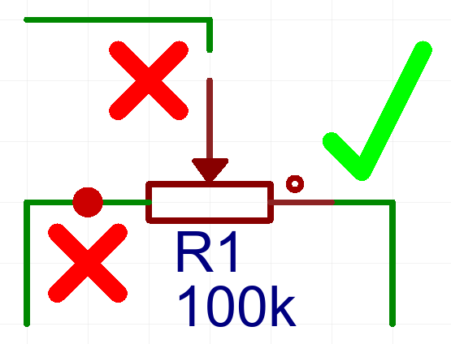
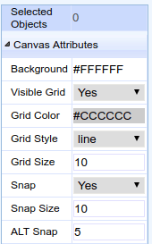
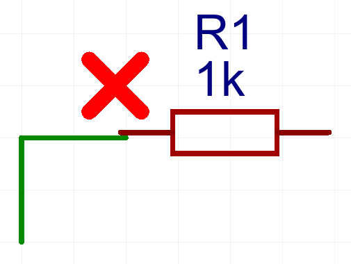
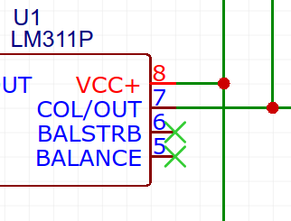
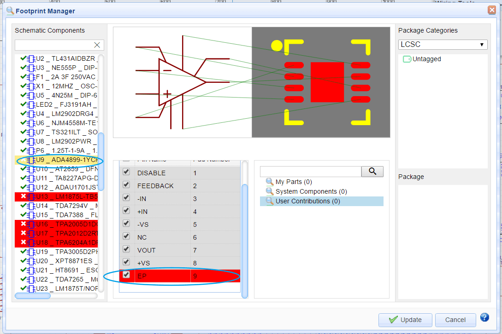
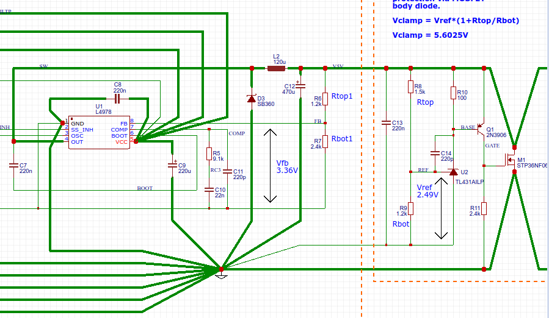
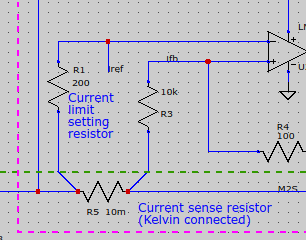

# Essential Check

## Introduction

By following - and constantly checking against - a set of procedures, it is possible to avoid just about all of the common mistakes and omissions that can significantly delay or even stop a schematic being successfully converted to a PCB and then that PCB being successfully updated from the schematic as a design progresses.

It can also significantly reduce the likelihood of a PCB being made that subsequently is found to not work correctly due to mistakes made during the creation of the original schematic (Schematic Capture). 

After spending hours on Schematic Capture, it is very frustrating to be presented with error messages about prefix conflicts, missing or invalid packages when first attempting to pass a schematic through to the PCB Editor by clicking on the **Convert Project to PCB…** button or, after making changes to a schematic, similar error messages or having components that disappear from the PCB when attempting to update an existing PCB using the **Update PCB…** button in the Schematic Editor or the **Import Changes…** button in the PCB Editor. 

These issues can be avoided by running through a series of checks for the first time each new Part (i.e. the first instance) is placed into the schematic.

There are several other issues that arise from mistakes in and omissions from the schematic that people encounter only after they are part way through a PCB design or - worse still - only when they receive their PCBs in the post.

Almost all of these other issues can be avoided by running through a further series of checks (i) during Schematic Capture, (ii) once Schematic Capture is complete but before first attempting to convert the schematic into a PCB and (iii) when updating the PCB as work progresses.

This document pulls together all the essential procedures to follow and things to check in the schematic before clicking on the **Convert Project to PCB…**, **Update PCB…** or **Import Changes…** buttons.

## Things to understand before using this document.

Before using the document it is important that the following points are clearly understood:

### What constitutes a Part in a schematic and a PCB?

A Part is any element of the circuit that is to be mounted on the PCB plus any element which is ultimately intended to be mounted on or form an integral part of the PCB such as heat sinks, PCB mounting holes, mounting holes for PCB mounted potentiometers and switches (for example where a PCB is used as a front panel or as a self-contained test jig), test points, wire links or jumpers, fuse holders and even image based elements such as high voltage warnings and logos.

Note that fuses that are fitted into PCB mounted fuse holders are best dealt with in a schematic by showing the fuse using a fuse symbol in the schematic but assigning to that fuse symbol the BoM information - including the package - that is for the required fuse holder. The required fuse ratings, type and supplier information can then be included in the BoM using Add new parameter function.

Other socketed devices can be treated in the same way.

### What is the relationship between Parts, Schematic Symbols and PCB Packages?

Any Part must have a Schematic Symbol to represent it in the schematic (a.k.a. Schematic Lib) and that Schematic Symbol must have a PCB Package (a.k.a. PCB Lib) assigned to it either when the symbol is created or after placing the first instance of it into the schematic. 

The associated PCB Package must exist in the library.

* Ensuring that every Part has a Schematic Symbol with a PCB Package associated with it **and** that that PCB Package actually exists in the Parts (SHIFT+F) library will avoid a **Missing package** error being issued on Conversion or Update to PCB.

It is possible that a component may comprise more than one device in a package, for example logic gates. Some symbols represent both devices in a single symbol but quite often a separate symbol is used to represent each of the devices. This may mean that some of the pin numbers and/or names on the symbols representing each of the two devices may be different although both may have the same power and ground pin numbers and/or names.

High pin count devices such as processors and FPGAs may be split into several symbols representing different sections or ports. It is important to ensure that pin numbers and names are unique across all the symbols.

It is possible that a component may be available in different packages. For example the LM358-N dual operational amplifier is available in several different packages. The pin numbering and/or naming of the symbol may be different depending on which package the component is supplied in.

It is easy in EasyEDA to change the pin numbering and/or naming for a Schematic Symbol (using the `I` Hotkey) or a PCB Package so it may be tempting to think of an LM358-N as the same part in a different package and just put down a symbol, edit the package assigned to it and then hack the pin numbers and names about until they match the PCB package.

However, an LM358-N in a SOIC-8 package has a different pinout, a different part number and has to be physically ordered as a different part from an LM358-N in a DSBGA-8 package.

* They are therefore two *different*  Parts. 

When thought of like this it should be clear that there should be one Schematic Symbol (or pair if each device has a separate symbol) and a matching PCB Package for an LM358-N in a SOIC-8 package and another Schematic Symbol (or pair if each device has a separate symbol) and a matching PCB Package for an LM358-N in a DSBGA-8 package.

* Ensuring that the pin numbers/names of the Schematic Symbol for a Part are correct, unique and match those of the PCB package associated *with that particular part* will avoid the generation of the **Invalid package** error being issued on Conversion or Update to PCB.

### Why do Parts in a PCB disappear when the PCB is updated from the schematic?

It is important to understand that any Part that is supposed to form part of or be mounted on the PCB must have a corresponding Schematic Symbol in the schematic. 

If it *does* then as soon as the PCB is created, the PCB Package for that Part , even such a seemingly abstract item as a mounting hole, warning sign or a logo, will be pulled into the PCB layout without having to be added to the PCB later by hand.

If it *does not* then not only will the PCB package for that Part not be pulled into the PCB layout as it is created but when it is added to the PCB later by hand and the PCB is then updated to bring in changes made to the original schematic, *that PCB package will be deleted*.

Such elements can be added to the schematic later and then imported into the PCB but if they do not exist in the schematic at the time the PCB is updated from that schematic then they will always be deleted and will therefore have to be added back to the PCB by hand.

### What is the relationship between User Contributions and the other Parts categories (LCSC (Official), Assembly LCSC Components, System Components, My Parts, My Modules and Common Modules)?

Any Schematic Symbol or PCB Package chosen from the **User Contributions** category MUST be added to your local library by doing:

**Parts (or SHIFT+F) > Search for and select the part then > More > Add Favorite**

* Failure to do this will result in the package not being found and a **Missing package** error being issued on Conversion or Update to PCB.

Packages in the other library sections will be found automatically.

Note however that although Schematic Symbols and PCB packages created by a user within a Team will automatically appear in that user’s My Parts library, once that user swaps to another Team, those parts will no longer appear in their My Parts library but will only be available via the **Add Favorite** option from the User Contributions library.

## Procedures and Checklist

* Verify that the Schematic has been drawn to show clearly how the components in the circuit are connected together;  

The schematic must help the reader understand signal and power flow in the circuit with inputs on the left, outputs on the right, positive supplies at the top, negative supplies at the bottom and netlabels used to clarify connections and reduce congestion. 

Components may be grouped by function and boxes may be drawn around them. 

Decoupling components may be drawn adjacent to the devices they are associated with or symbols with dedicated sub-parts for power pins can be used to reduce congestion;

* Use the Design Manager (left-click the **Design** button in the left hand panel) to check that all components are present in the schematic and that all nets have been assigned reasonable mnemonic names and have at least two connection. 

Naming nets instead of relying on the EasyEDA auto-generated alphanumeric names makes signal tracing and debugging the final PCB much easier but care must be taken to ensure that names are correct and that there are no unintended duplicate names or accidental increments in numbered nets;

* Verify that there are no duplicate prefixes in the schematic:

[https://easyeda.com/forum/topic/How_to_resolve_quotPrefix_Conflictquot_error_-gpbca8642](https://easyeda.com/forum/topic/How_to_resolve_quotPrefix_Conflictquot_error_-gpbca8642)

Remember to check across all sheets of a multi-sheet schematic;

* Check that the schematic is drawn correctly.   
In particular, check that no nets have been accidentally cross connected, that wires have join dots where they are intended to be joined, that they are properly connected to component pins and that nets joined by netlabels are correctly named and that there are no unintended duplicate net names.  

* Verify that junctions of 4 or more wires are drawn to show staggered junctions to avoid confusion with wires that cross but are not joined at the crossing point.  

* Check that all parts and nets have been placed with the Canvas Attribute **Snap = Yes**:  
  
and that no parts have been placed off grid so that although they may appear to be connected on close inspection it can be seen that they are not:  

* Check that pins have been terminated (pulled up, down, left open etc.) as specified in manufacturers'  datasheets. 

* Check that all unconnected pins have **No Connect** symbols attached directly to them. Unconnected pins without No Connect symbols attached directly to them will show up as alphanumeric net names in the Design Manager but will not highlight when clicked on in the Design Manager.  
No Connect symbols must be attached directly to component pins. There should be no wire between the No Connect symbol and the pin.  
  
Note that the No Connect symbol changed in V4.8.5 of EasyEDA from a red cross to a green one to make the highlighted state of a selected symbol clear;

* Check that the device ratings are suitable for the circuit in which they are to be used. For example, capacitor, diode, transistor, connector and switch voltage ratings, transistor, resistor and zener diode power dissipations, inductor, diode (including LED), transistor, connector and switch current ratings.  

Although these parameters should have been checked at the time of specifying the components as an essential part of the circuit design stage prior to or during Schematic Capture, there is plenty of scope for them to have gone astray during the part selection, placement and editing steps of Schematic Capture.  

An undetected mistake now can result in the wrong size part being chosen. For example a larger diameter or even a taller electrolytic capacitor may be needed. Whilst this is easy to correct in the PCB design stage, at best this may waste time in having to redesign part of the PCB. At worst the mistake may not be discovered before the PCB design is completed and sent for manufacturing.

* Check that diode (including LED) and bipolar transistor base-emitter junction reverse breakdown voltage ratings and that input differential and common mode voltage ratings of operational amplifiers and comparators are not exceeded during any state of operation of the circuit including power up and power down. 

Consider adding diode or MOSFET reverse supply protection especially for battery powered circuits.

An example of MOSFET reverse protection is described in:

[https://easyeda.com/example/Uberclamp_Schematic_PCB_and_BoM-r4YgysK2k](https://easyeda.com/example/Uberclamp_Schematic_PCB_and_BoM-r4YgysK2k)

Pay special attention to this in operational amplifier or comparator devices that exhibit `output phase reversal` under some input conditions. For more information about this see:

[http://www.analog.com/media/en/training-seminars/tutorials/MT-036.pdf](http://www.analog.com/media/en/training-seminars/tutorials/MT-036.pdf)

For example, the TL081 exhibits this behaviour but it is not documented in more recent versions of the datasheet. See Applications Hints on page 5 of this earlier version:

[http://www.physics.ucc.ie/fpetersweb/FrankWeb/courses/PY2108/spec%20sheets/TL081%20OpAmp.pdf](http://www.physics.ucc.ie/fpetersweb/FrankWeb/courses/PY2108/spec%20sheets/TL081%20OpAmp.pdf)

Consider adding diode or MOSFET reverse supply protection especially for battery powered circuits.

An example of MOSFET reverse protection is described in:

[https://easyeda.com/example/Uberclamp_Schematic_PCB_and_BoM-r4YgysK2k](https://easyeda.com/example/Uberclamp_Schematic_PCB_and_BoM-r4YgysK2k)

* Check that LED currents are supplied through series current limiting resistors or from constant current sources.

For background on this please see:

[https://easyeda.com/andyfierman/LEDs_must_have_series_resistors-OoGYgCK2k](https://easyeda.com/andyfierman/LEDs_must_have_series_resistors-OoGYgCK2k)

* Check that signal connectors have sufficient ground pins to maintain signal integrity by minimising signal return path impedances (i.e. ground loop area). This is especially important in designs with high speed signals through the connectors but can also be important for lower speed signalling with long wire interconnects and/or fast edge speeds.

* Check that power connectors have sufficient ground and power pins pins to maintain power integrity by minimising power and ground return path impedances. 

* Verify that device power supply decoupling complies with manufacturers’ recommendations. 

Where possible, check datasheets, applications notes and schematics and PCBs for Reference Designs or Evaluation Boards.

For some background on the importance of adequate decoupling please see:

[https://easyeda.com/andyfierman/Power_supply_decoupling_and_why_it_matters_-451e18a0d36b4f208394b2a2ff7642c9](https://easyeda.com/andyfierman/Power_supply_decoupling_and_why_it_matters_-451e18a0d36b4f208394b2a2ff7642c9)

* Verify that a Schematic Symbol and an associated PCB Package has been created for every Part needed to construct the complete PCB. 

Remember to include Schematic Symbols and an associated PCB Packages for things like heat sinks, PCB mounting holes, mounting holes for PCB mounted potentiometers and switches (for example where a PCB is used as a front panel or as a self-contained test jig), test points, wire links or jumpers, fuse holders and even image based elements such as high voltage warnings and logos; 

Look in: 

**Parts (or SHIFT+F) > MyParts > Schematic Lib > Favorite Schematic Lib**

and:

**Parts (or SHIFT+F) > MyParts > Package > Favorite Package**

and verify that every Schematic Symbol and associated PCB Package chosen from the **User Contributions** category has been added to your local library;

* Verify that the pin numbers/names of the Schematic Symbol(s) for every Part are correct, unique and match those of the PCB package associated *with that particular part*;

* Verify that the pin order (pin mapping) of the PCB Package associated with every part is correct.

This task is simplified using the EasyEDA Footprint Manager:

[https://easyeda.com/Doc/Tutorial/Schematic.htm#Footprint-Manager](https://easyeda.com/Doc/Tutorial/Schematic.htm#Footprint-Manager)

Remember that in EasyEDA, the PCB Footprint is viewed looking down onto the component side of the board. This view is assumed to be with all components mounted on the Top Layer. Packages can subsequently be placed on the top or bottom layers as required.

* Verify that all necessary information about the specific components (and any suitable alternatives) that are to be used in the circuit and which are ultimately intended to be mounted on or form an integral part of the PCB, from which a Bill of Materials (BoM) can be generated has been added to the Schematic Symbols.

For more information about this please see:

[https://easyeda.com/forum/topic/How_to_add_extra_information_to_the_Bill_of_Materials_BOM-Hp9rJCUcu](https://easyeda.com/forum/topic/How_to_add_extra_information_to_the_Bill_of_Materials_BOM-Hp9rJCUcu)

* Verify that any necessary information relating to the physical placement of components and layout of copper traces and areas has been annotated in the schematic.

Including text (or even diagrammatic information in the schematic about component positioning and orientation, clearances around heatsinks for airflow or copper areas for heat sinking, current and voltage ratings of traces, trace length matching, controlled impedance transmission lines and differential pairing can all help in the following stages of PCB design.

Nets that are carrying high currents may be drawn using thicker wires (Stroke width).

Nets can be drawn converging at star points to help illustrate where this type of PCB layout is required on the PCB:

Kelvin connections to current sense resistors can be drawn in a similar way:

Nets can be colour coded but beware using red because it can be very hard to see when such nets are highlighted.

* Generate - and check - the Bill of Materials (BoM) information and check the availability of components.

Whilst it is easy to change parts in the PCB design stage, at best this may waste time in having to redesign part of the PCB. At worst the unavailability of a part may not be discovered before the PCB design is completed and sent for manufacturing.

* Use the Design Manager (left-click the **Design** button in the left hand panel) to check everything again!

