# FAQ

Please spend a few minutes reading this FAQ, it will save you lots of time getting started with EasyEDA.

## Contents
**Concept**  
	- *How to find the list of hotkeys*  
	- *Where are my files*  
	- *Why does EasyEDA focus on Cloud based EDA*  
	- *How can I work if there is no internet*  
	- *Does EasyEDA have a desktop version*  
	- *Which Browser is best for EasyEDA*  
	- *How to go to your dashboard*  
**Projects and Files**  
	- *How to delete a project*  
	- *How to delete a schematic or PCB*  
	- *How to share a project with others*  
	- *How to find the version history of schematics and PCBs*  
**Schematic**  
	- *If I update the schematic, how do I then update the PCB*  
	- *How to rename a Sheet/Document or modify description*  
	- *How to find components*  
	- *How to add sub parts to a schematic*  
	- *What is the unit of the schematic sheet*  
	- *For a complex project, I want to split the schematic over several sheets.   Does EasyEDA support hierarchy*    
	- *How to change the sheet size and modify the design information*  
**Schematic library symbol**  
	- *How to create a schematic library symbol*  
	- *How to tag my schematic library symbol*  
	- *How to create sub parts for multi-part components*  
	- *How to change the Package for a component*  
**PCB**  
	- *How to change the Units of PCB from mil to mm or inch*  
	- *How to pick and move the components on the PCB canvas quickly*  
	- *Can I create a PCB without creating schematic*  
	- *How to add more fonts for PCB*  
	- *How to insert an Image/Logo to PCB*  
	- *How to insert a DXF board outline*  
	- *How to create non rectangular PCB outline such as round*  
	- *How to add a slot and cut out*  
	- *How to measure dimensions on a PCB*  
	- *How to add more layers*  
	- *How to add solder mask*  
	- *How do I set the dimensions of my PCB in the layout*  
	- *My PCB is complex, how can I be sure that I have routed all of the tracks*  
	- *I need to start my layout again, how can I remove all of the tracks*  
	- *How to put a component on the bottom layer*  
	- *I can't convert schematic to PCB*   Why is this*  
**PCB package**  
	- *How to create a PCB package/library*  
	- *Keep in Mind*  
	- *Most Common Errors on EasyEDA*  
	- *Spice Simulation FAQ*  
	- *How to set the resistance of a resistor*  
	- *Where Can I find the Probe*  
	- *Why I can't simulate my schematic*
**Others**  
	- *Does EasyEDA canvas use the Cartesian coordinate system*    
	

## Concept

### How to find the list of hotkeys.

[https://easyeda.com/Doc/Tutorial/Introduction.htm#Hotkeys](https://easyeda.com/Doc/Tutorial/Introduction.htm#Hotkeys)

### Where are my files?

Your files are stored on EasyEDA servers, so you can access them anywhere and share them with your partners.
 
### Why does EasyEDA focus on Cloud based EDA?

EasyEDA is built for people who like to work anywhere, who like to build projects together with other team members, who like to share their projects, who like something that operates like a github for hardware design. The only way to meet these needs is to build a Cloud version EDA.

### How can I work if there is no internet?

Although most of the time there are ways to access the internet easily and cheaply there may be times when, for whatever the reason, internet access is simply not possible. For times like this, EasyEDA is working to provide a desktop client soon.
  
### Does EasyEDA have a desktop version?

   At present, no but EasyEDA is developing and testing a desktop version to be introduced soon. 
   
   A Windows version will be available at the end of this year. Mac and Linux versions will be available early next year. 

### Which Browser is best for EasyEDA?

  **Chrome**. Firefox and Safari are OK too. If you are restricted to using other browsers, it would be better to download the EasyEDA desktop client when it becomes available (see above).

### How to go to your dashboard.

In the [Dashboard](https://easyeda.com/projects/mylists), you can check all your Projects, Modules, Components and Favorites, projects others have shared with you, forum posts and orders. 
 
There are two ways to arrive there.  

1. From the Editor, you can click on the EasyEDA logo or user logo:  
	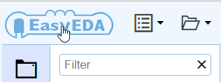      

	  

2. From the homepage, you can click My Projects:  
	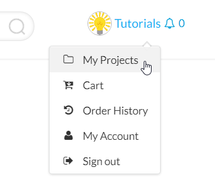 

## Projects and Files
  
### How to delete a project.

   Select it and right click to open a context menu, like the image below.
   
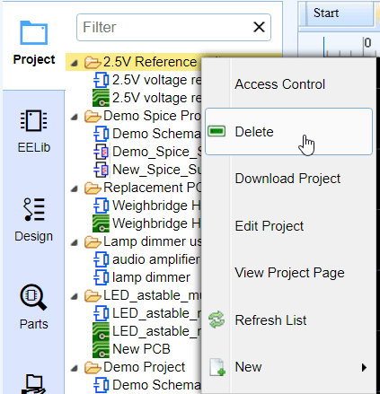
 
### How to delete a schematic or PCB.

   Select it and right click to open a context menu, like the image below.
 
 

### How to share a project with others.

   1. Make your project public.
  Open [https://easyeda.com/projects/mylists](https://easyeda.com/projects/mylists), then click the red `No entry' icon where indicated by the arrows. This icon will change to a green 'Tick' icon to show that the project is now public.
   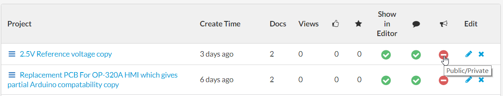  

   2. To share a project privately with only selected collaborators via: 
   
	[Access Control](https://easyeda.com/Doc/Tutorial/share.htm#Access-Control) 
   
	You can right click your project and select the access control menu:

	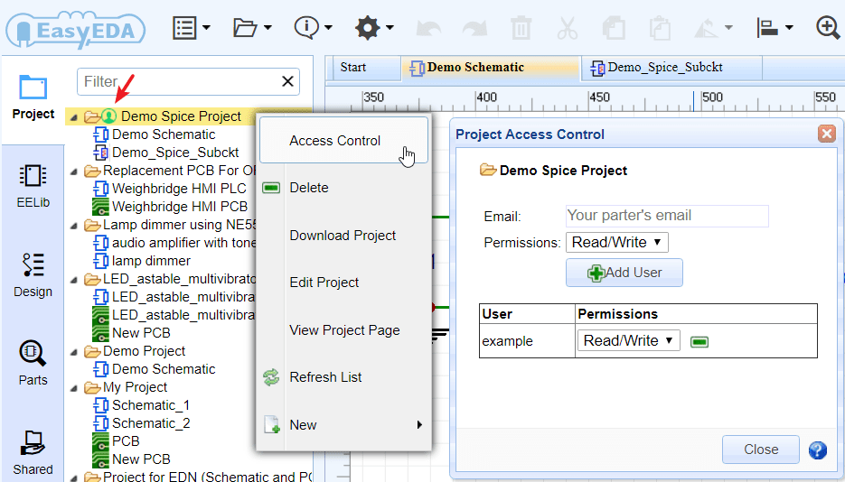 
  
       
### How to find the version history of schematics and PCBs.

  The version history of your EasyEDA schematics and PCBs can be accessed by right-clicking on the file you wish to query to open the context menu as shown in the image below: 
  
   
 
 Then click on the version number that you wish to view.
 
 **Note:** *saving a previous version will restore that version to being the current version of the file.*

## Schematic

### If I update the schematic, how do I then update the PCB?
  
The initial conversion of a schematic to PCB is done from within the Schematic Editor using the `Convert Project to PCB...` button as illustrated in the toolbar below but a new `Update PCB` button has been added so that modifications to the schematic can immediately be passed forward to update a selected PCB without having the PCB editor window already open. 
  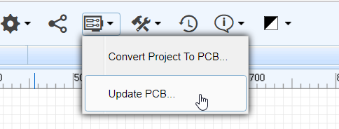 

Alternatively, you can import changes from the schematic from within the PCB Editor:

[https://easyeda.com/Doc/Tutorial/PCB.htm#Import-Changes](https://easyeda.com/Doc/Tutorial/PCB.htm#Import-Changes)

### How to rename a Sheet/Document or modify description.

In this menu, there is a `Modify` option, so you can rename your files.  
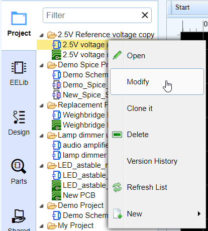  

### How to find components

The component search function has been significantly improved to make finding part symbols and footprints quicker and easier. Press `SHIFT+F` or click on the `Parts` icon on the left navigation panel: 

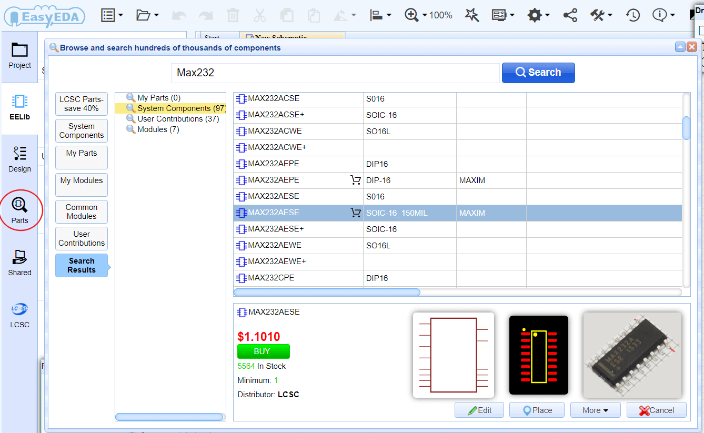 

In the new components dialog, it is easy to select the right components via tags and you can set tags for your own components.

### How to add sub parts to a schematic.

 You can add sub parts to a schematic one by one but please note that the sub parts prefix must be in the form of U1.1 U1.2 etc, and not U1.A U1.B.
 
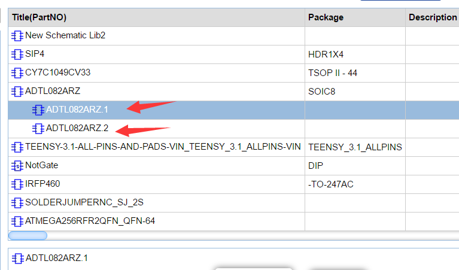

### What is the unit of the schematic sheet?

  The basic unit of the schematic sheet is the pixel. 1 pixel is about 10mil (0.001 inch) but please note that this use of the pixels as a unit in a schematic is just for reference.

### For a complex project, I want to split the schematic over several sheets. Does EasyEDA support hierarchy?

 Please check out this link [https://easyeda.com/Doc/Tutorial/Schematic.htm#Hierarchy](https://easyeda.com/Doc/Tutorial/Schematic.htm#Hierarchy)

 
### How to change the sheet size and modify the design information.

To change the sheet size, move the mouse anywhere over the lower right area of the drawing border or frame until the whole border highlights red and then right-click on it. Paper size and orientation can then be changed in `Sheet Attributes` in the right hand panel.

To modify the design information, left-click on the relevant blue text in the lower right area of the drawing border or frame to change it in `Text Attributes` in the right hand panel.  Double left-clicking the blue text will allow you to type new information directly into the field. 

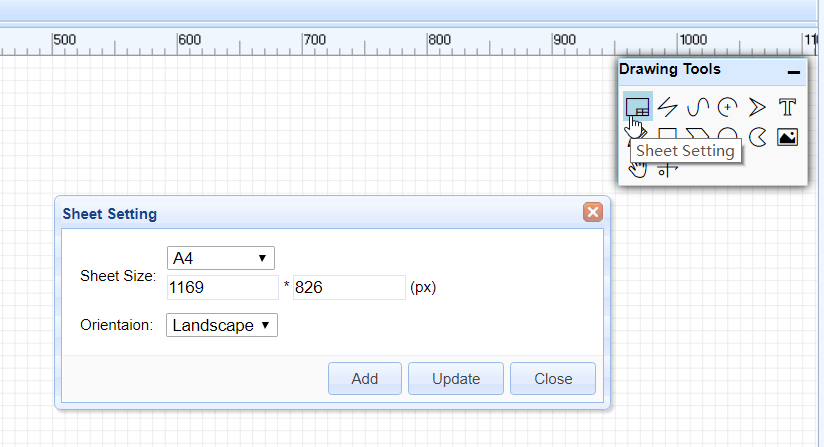   
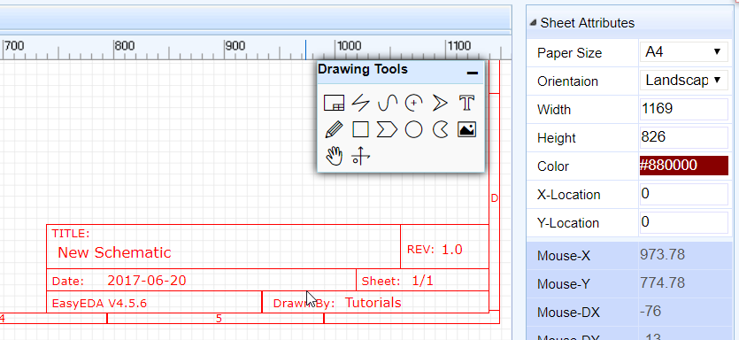

##Schematic library symbol

### How to create a schematic library symbol.

**Document > New > Schematic Lib**

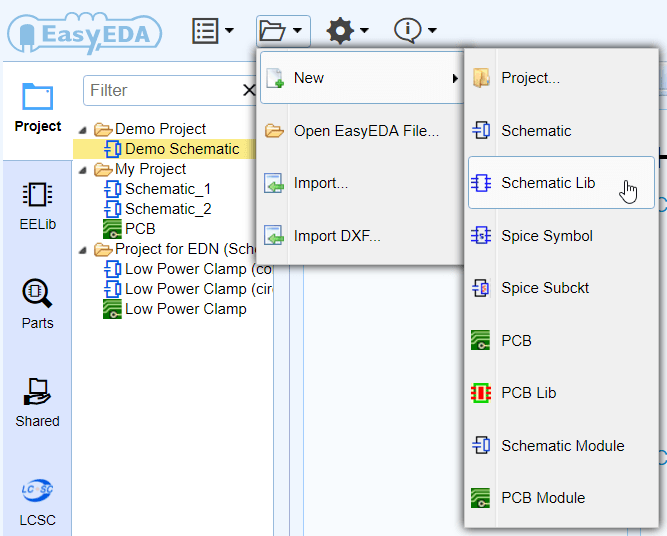 

### How to tag my schematic library symbol.
  
  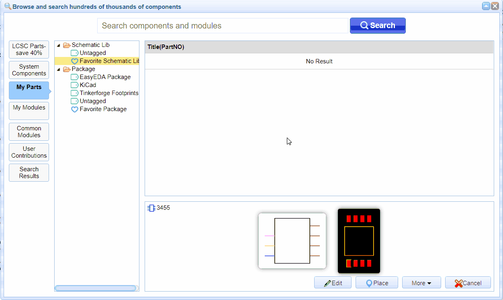 

### How to create sub parts for multi-part components.

In My Parts, Right click the part then select **Add Sub Part** from the menu that opens:
  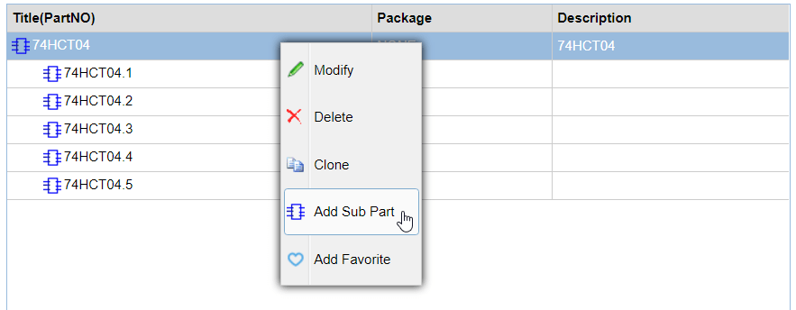 

### How to change the Package for a component.

[https://easyeda.com/Doc/Tutorial/Schematic.htm#Update-Package](https://easyeda.com/Doc/Tutorial/Schematic.htm#Update-Package)

## PCB

### How to change the Units of PCB from mil to mm or inch.

There is an option for that in PCB canvas attributes:   
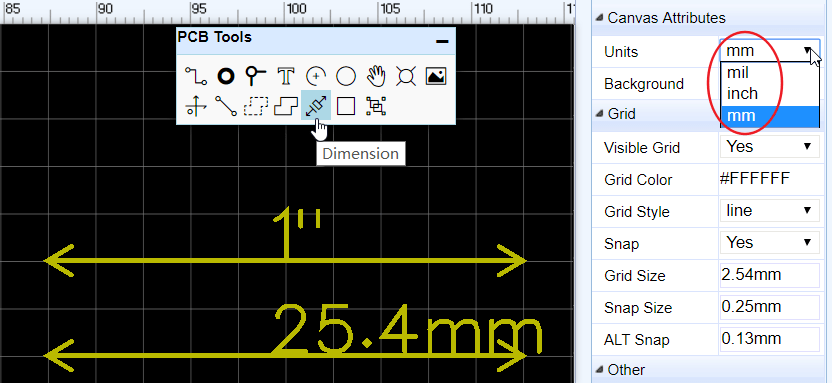 
 
### How to pick and move the components on the PCB canvas quickly.

 Before routing the PCB, the components need to be positioned in suitable places on the PCB. In the PCB Editor, it can sometimes be quite difficult to select components by clicking on the silkscreen outline or the pads. To select and move them more easily, please use drag mode (Hot Key `D`) or click the `Move` icon in the PCB Tools toolbar:  
 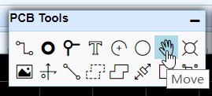
     

### Can I create a PCB without creating schematic?
  Yes but for any but the simplest PCBs, please see:
  
[https://easyeda.com/forum/topic/The_best_way_to_design_a_PCB_in_EasyEDA-ThR3pwqIC]( https://easyeda.com/forum/topic/The_best_way_to_design_a_PCB_in_EasyEDA-ThR3pwqIC)

### How to add more fonts for PCB.

You can refer to [Text](./PCB.htm#Text) of PCB section.

### How to insert an Image/Logo to PCB.

You can refer to [Image](./PCB.htm#Image) of PCB section.

### How to insert a DXF board outline.

You can refer to [Import DXF File](./Import.htm#Import-DXF-File) of Import section.

### How to create non rectangular pcb outline such as round? 
  You can import a DXF file for the board outline. For a round board outline, you can use an arc to do that, you just need to change to the board outline layer, then draw 1 arc like in the image below (need to adjust a bit later), you can use lines and arcs to create complex board outlines.

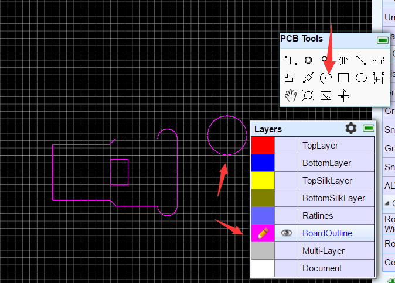 

### How to add a slot and cut out. 

[https://easyeda.com/Doc/Tutorial/PCB.htm#Pad](https://easyeda.com/Doc/Tutorial/PCB.htm#Pad)
and [https://easyeda.com/Doc/Tutorial/PCB.htm#Solid-Region](https://easyeda.com/Doc/Tutorial/PCB.htm#Solid-Region)

### How to measure dimensions on a PCB.

[https://easyeda.com/Doc/Tutorial/PCB.htm#Measure-Dimension](https://easyeda.com/Doc/Tutorial/PCB.htm#Measure-Dimension)

### How to add more layers.
 Click the layer options button, then tick the extra layers in the dialog that opens.
 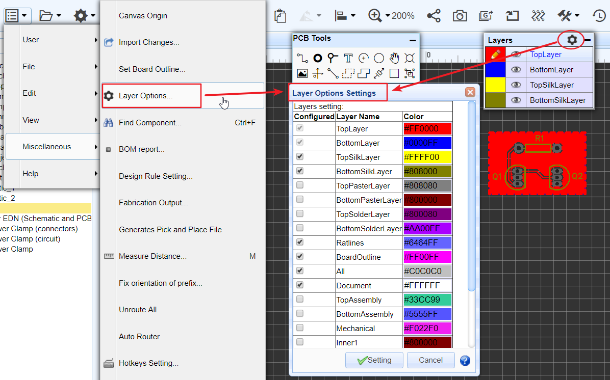 
 
### How to add solder mask.
It is possible to get boards with the copper exposed so that you can apply a layer of solder over those tracks to further increase their current carrying capacity. In this case, you need to add solder mask over a copper (copper area, track, solid region). 
EasyEDA will add solder mask for pads automatically. Sometimes however, you may need to add an aperture in the solder mask to expose and area of copper.  

1. First, add a top or bottom solder mask layer, as required.  

	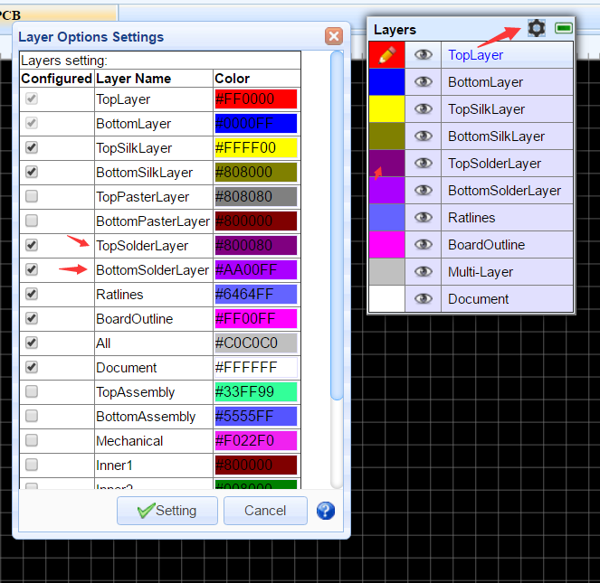   

2. Next, draw a region in the solder mask layer over a copper item as illustrated in the image below. This in effect draws an aperture in the solder mask so that the copper item inside the region, in this case the track, will be not be covered by the green film of solder mask.  
  
	    

A common mistake is to just draw a solder mask, without a copper area, like the track pointed to by the yellow arrow. That is incorrect and does not produce the desired result.
 
### How do I set the dimensions of my PCB in the layout?

 PCB's dimension/size depends on the board outline, you can create your board outline, please refer to [Board Outline](./PCB.htm#Board-Outline) of the PCB section.

### My PCB is complex, how can I be sure that I have routed all of the tracks?

 Please refer to [Design Manager](./PCB.htm#Design-Manager) of PCB section. 
 

### I need to start my layout again, how can I remove all of the tracks?

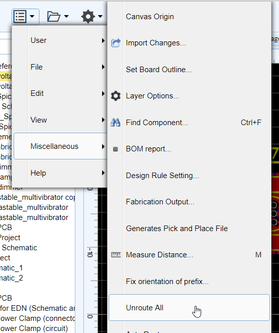

### How to put a component on the bottom layer?
 There are two ways to do this.
 
1. If your active layer is the bottom layer, then every component you place will be placed on the bottom layer automatically.
2. You can place a component then select it and change its layer attribute to `Bottom layer` in the right hand panel.
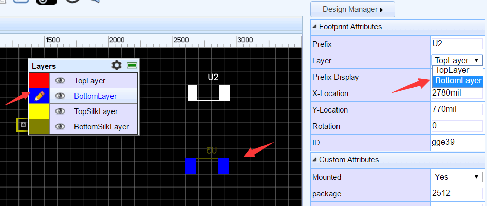 

### I can't convert schematic to PCB. Why is this?
 1. You have not set the right packages for your components. 
 2. https://easyeda.com/Doc/Tutorial/Schematic.htm#Prefix-Conflict-Error
 3. https://easyeda.com/Doc/Tutorial/PCB.htm#Invalid-Packages

## PCB package.
### How to create a PCB package/library.
   

##Keep in Mind

  1. There is no need to back up your schematics and PCBs manually. After the first save of any file, EasyEDA will back up all saved files automatically  under the [Version History](https://easyeda.com/Doc/Tutorial/Introduction.htm#Version-History). If you want to back up your files locally, you can download a copy of the whole project or of individual files in a project in EasyEDA Source (JSON) format:
  
   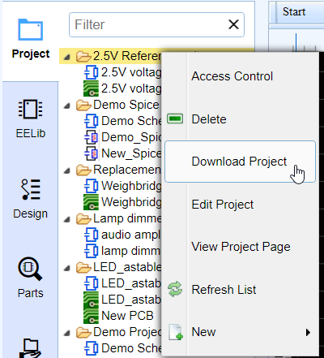
  
  and;
  
  **Document > EasyEDA Source > Download**
  
   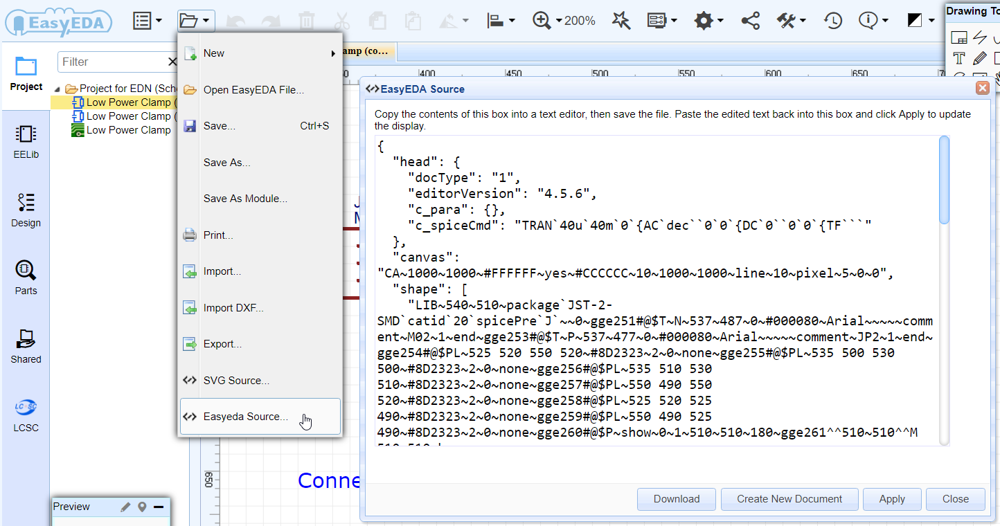
 
  
  2. If you need help, you can contact us  or ask via our [Support Forum](https://easyeda.com/forum); we will respond ASAP.
   
  
## Most Common Errors on EasyEDA.

  1. Manually creating backup schematics into the same project. When a project is converted to PCB, EasyEDA will merge all of the schematics under the same project into a single PCB. If there are multiple copies of the same schematic in a project then this will create errors such as duplicate part prefixes. Especially if you are new to EasyEDA, just keep one copy of each unique schematic in any one project. 
  2. Saving schematic and PCB into different projects. Unless you are absolutely sure that you will not need to update (Synchronise) your PCB from changes made to your schematic then please keep the schematics and PCB under the same project.
  3. Bad packages. Schematic symbols must have the appropriate footprints assigned to them, these footprints must exist in the library and - for any footprint that you have not created yourself - you must have clicked on the **Favorite** option in the component search window to add it to your **Favorite Parts** list in the left hand Navigation panel.
  
  4. Using the polyline from the Drawing Tools Palette to connect symbol pins. To connect components together, you must use Wires from the Wiring Tools Palette.
  
 
## Spice Simulation FAQ

EasyEDA's main target is schematic and PCB, not simulation. EasyEDA only support simple schematics simulation.

### How to set the resistance of a resistor 

   You can use the name attribute. Just set the name or double click the value text.

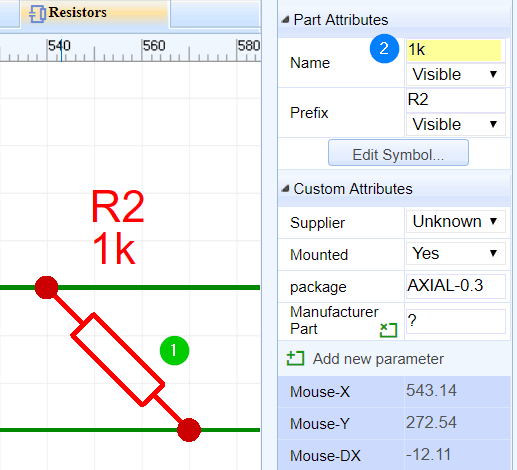 

### Where Can I find the Probe?

  Voltage probe   
  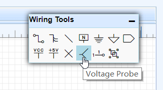 

### Why I can't simulate my schematic

   EasyEDA only has very few simulation models, EasyEDA is powered by [http://ngspice.sourceforge.net/](http://ngspice.sourceforge.net/) please check Ngspice to know what can be simulated.

## Others.

### Does EasyEDA canvas use the Cartesian coordinate system?

 Yes and no. 
 
 It uses X and Y coordinates where the horizontal X coordinate is positive to the right of the origin and negative to the left but the vertical Y coordinate is positive **below** the origin and negative above it. 
 
 Actually, we think our coordinate system is not very good but it is hard to change. 
 
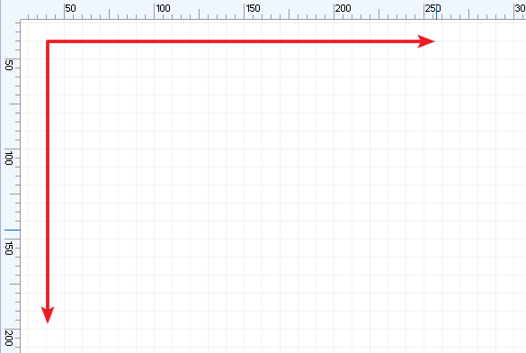  
