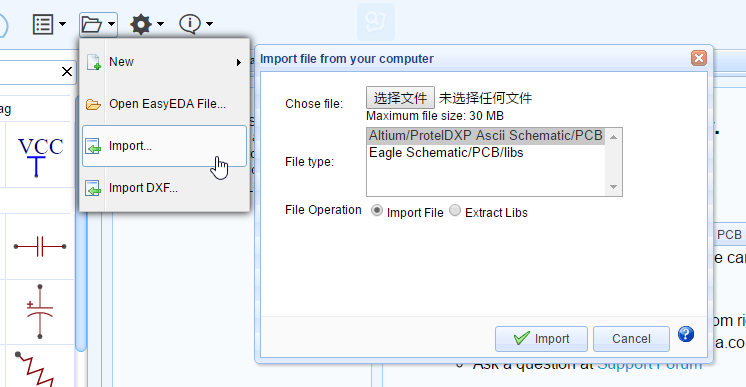
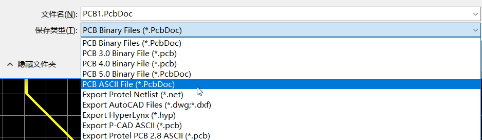
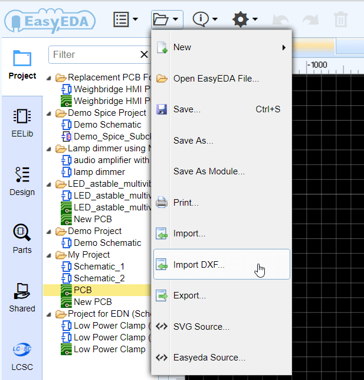
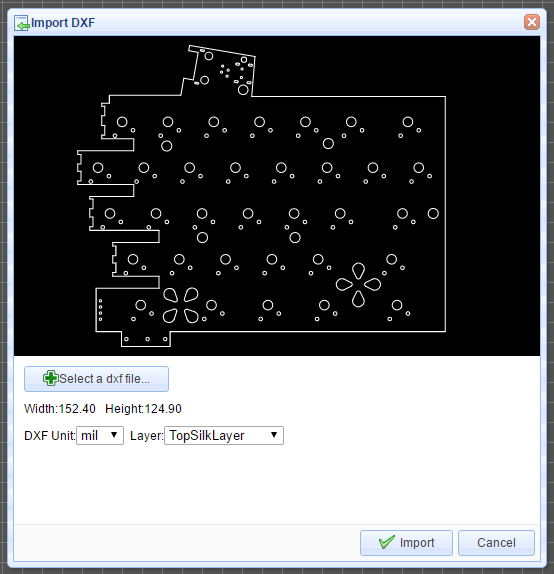
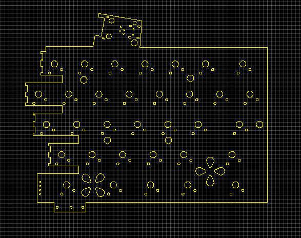

# Import 

EasyEDA provides importing from:

-   Altium/ProtelDXP Ascii Schematic/PCB
-   Eagle Schematic/PCB/libs

You can find the import menu from the Document menu:

**Document > Import...**

which opens the Import file from your computer dialog:

Please note that in File Operation: the Extract Libs option is only supported when importing Altium Designer and Eagle libraries.

## Import Altium Designer 

You can import Altium Designer's Schematic and PCB files into EasyEDA but only from **ASCII** files, so you need to save the designs as Ascii files like this.

EasyEDA offers an excellent experience in importing Alitum Designer's Schematic and PCB as you can see from the image below of a schematic imported from Altium Designer:

If your schematic and PCB are Protel 99se format files, please open at Altium Designer and save as ASCII format, and then import them.

Altium Designer's Schematic and PCB libraries are not available as **ASCII** files, so how can you import them?

In the Import file from your computer dialog to the right of File Operation; tick the Extract Libs option and EasyEDA will extract all of the libs from the Schematic files or PCB Files. So, if you want to import Altium Designer's Libs, you can add them to your Altium Designer Schematic or PCB and then extract them again into your EasyEDA library.

## Import Eagle 

Eagle Schematic/PCB/libs can be imported, but EasyEDA can only support version 6 and later (6+) because that was when Version 6 Eagle adopted an **ASCII XML** data structure as their native file format.

                    

## Import DXF File 

How to create irregular board outlines or complex board outline in EasyEDA?   This is sometimes needed when you are designing a PCB for an enclosure that may have a curved profile, or other unavoidable mechanical features for which one must design.  

Find the import DXF menu under the file menu.  
 

After selecting the *.DXF file, you will find a dialog like in the image below

EasyEDA provides two options, unit(mm or inch), and selection of the layer to which the shapes will be applied.

After clicking the import button, you will find them on your PCB canvas.

 You can try this to import this example by yourself. [DXF example](/Doc/Tutorial/Doc/test.dxf)  
 
Please note:  
1. The file must have a *.dxf filename extension  
2. The circles will be converted to holes if you choose the layer as board outline.  
3. There are some items which are not supported.  