# Introduction to EasyEDA

## What's EasyEDA

Welcome to EasyEDA, a great web based EDA tool for electronics engineers, educators, students, makers and enthusiasts. 

There's no need to install any software. Just open EasyEDA in any HTML5 capable, standards compliant web browser.

Whether you are using Linux, Mac or Windows; Chrome, Firefox, IE, Opera, or Safari. Highly recommend to use Chrome and Firefox.
EasyEDA has all the features you expect and need to rapidly and easily take your design from conception through to production.

**EasyEDA Editor:** [https://easyeda.com/editor](https://easyeda.com/editor)  
**EasyEDA Editor Beta:** [https://beta.easyeda.com/editor](https://beta.easyeda.com/editor)

**Instruction:**   

-	This tutorial document will be updated according to the updated EasyEDA editor.
-	The Editor beta version will release the new future and enhancement first, but maybe have some bugs, please using carefully.

**EasyEDA Provides:**   

-	Simple, Easier, Friendly, and Powerful general drawing capabilities
-	Working Anywhere, Anytime, Any Device
-	Real-time Team Cooperation
-	Sharing Online
-	Thousands of open source projects
-	Integrated [PCB fabrication](https://jlcpcb.com) and [Components purchase](https://lcsc.com) chain
-	API provide
-	Script support
-	Schematic Capture
	-	[NgSpice-based](http://ngspice.sourceforge.net/) Simulation
	-	Spice models and subcircuits create
	-	WaveForm viewer and data export(CSV)
	-	Netlist export(Spice, Protel/Altium Designer, Pads, FreePCB)
	-	Documentation export(PDF, PNG, SVG)
	-	EasyEDA source file export(json)
	-	Altium Designer format export
	-	BOM export
	-	Mutil-sheet and hierarchical schematics
	-	Schematic module
	-	Theme setting
	-	Document recovery
-	PCB Layout
	-	Design Rules Checking
	-	Mutil-Layer
	-	Documentation export(PDF, PNG, SVG)
	-	EasyEDA source file export(json)
	-	Altium Designer format export
	-	BOM export
	-	Photo view
	-	Gerber output
	-	Pick and Place File output
	-	Auto Router
	-	PCB module
	-	Document recovery
-	Import
	-	Altium/ProtelDXP ASCII Schematic/PCB
	-	Eagle Schematic/PCB/Libraries
	-	LTspice Schematic/Schematic Libraries
	-	DXF
-	Libraries
	-	More than 500,000 Libraries(Symbol and Footprint)
	-	Libraries management
	-	Symbol/Subpart create and edit
	-	Spice symbol/model create and edit
	-	Libraries management
	-	Footprint create and edit
	

## Design Flow by Using EasyEDA 

You can create circuits design easily by using EasyEDA. The design flow as below:
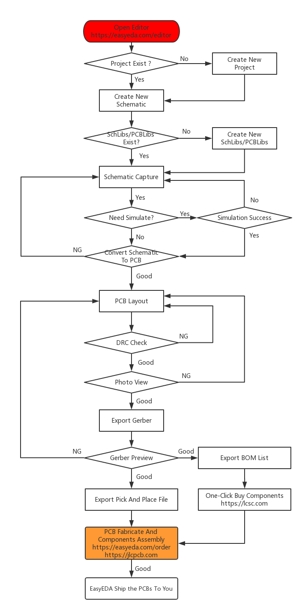

## UI introduction

EasyEDA Editor has a clearly and friendly user interface. You can use its every function very easily when you become familiar with EasyEDA.

### Global UI

**Schematic UI**
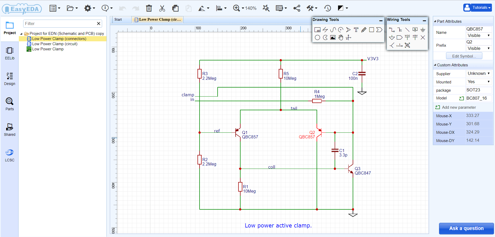

**PCB  UI**
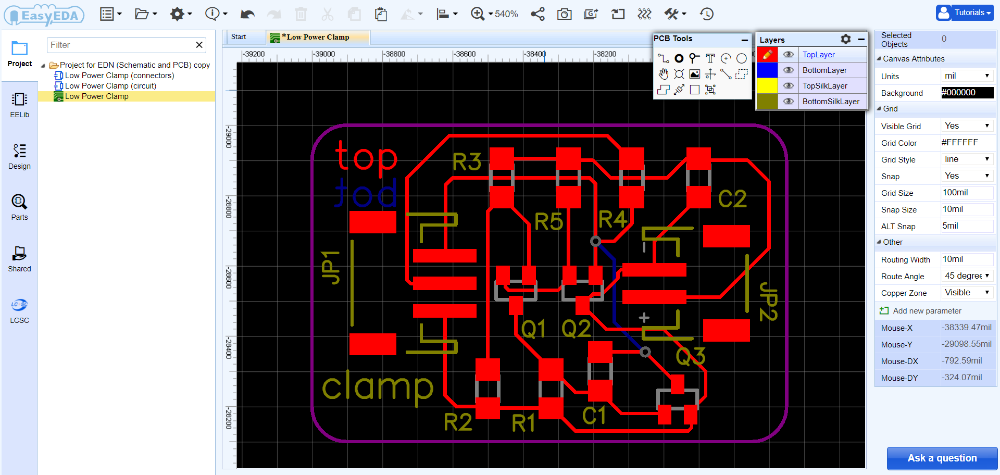 

### The Clear EasyEDA UI

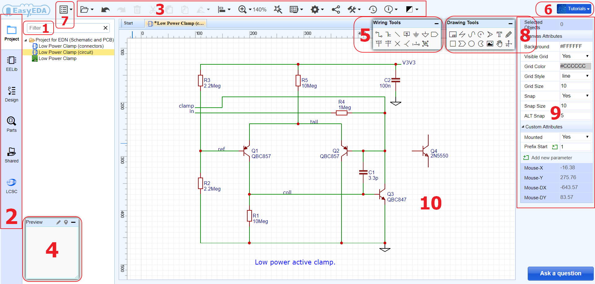

#### 1. Filter

Before using the Filter, you need to select what module you need in the left navigation panel, and then you can quickly and easily find projects, files, parts and footprints, just by typing a few letters of the title. For example, if you want to find all files containing “NE555” in the title, just type “555”, it is non-case-sensitive.  

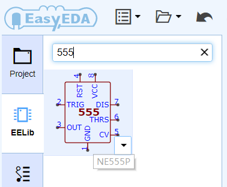  

The Filter only searches project, file and part titles and names. It does not search the Description and Content fields.

Click the X to clear the filter.

#### 2. Navigation Panel

The Navigation panel is very important for EasyEDA: it is from here that you can find all your projects, files, parts and footprints.

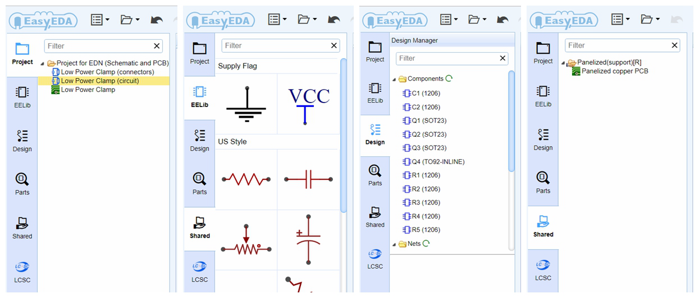  

**Project**
Here, You can find all of your projects that are private or shared with the public, or fork from someone else's. 

Except for System IC, these options have a content menu. For example, if you drop down to My Projects and right click an item, you will get a tree menu like :

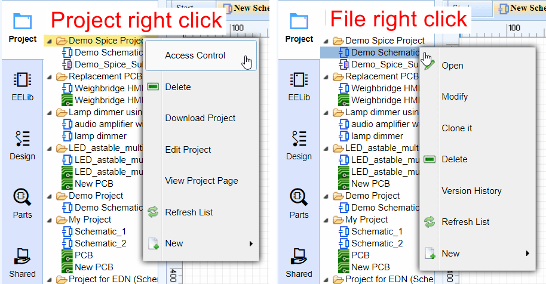

**EELib**

EElib means EasyEDA Libraries, It provides lots of components complete with simulation models, many of which have been developed for EasyEDA to make your simulation experience easier.  

**Design**

Design Manager, you can check each component and net easily, and it will provide DRC(Design rule check) to help your design better.

**Parts** 

Contains schematic symbols and PCB footprints for many readily available components and projects. And your own libs and modules will show up here.

**Shared**

About this module, if your partner shared his/her private project with you by using the **Access Control** option, then the project will show here.  

For more information you can refer to the [Access Control](./Share.htm#Access-Control) section.

**LCSC**

If you want to buy components to finish your PCBA, you should try the **LCSC** module, LCSC.com and EasyEDA are the same company.

EasyEDA partners with China's largest electronic components online store by customers and ordering quantity launch [https://lcsc.com](https://lcsc.com).
 LCSC means **L**ove **C**omponents? **S**ave **C**ost! We suggest to our users to use LCSC parts to design. Why?   
1. Small Quantity & Global Shipping.  
2. More Than 25,000 Kinds of Components.  
3. All components are genuine.   
4. It is easy to order co after design.   
5. You can save 40% cost at least.  
6. You can use our symbols and package.  

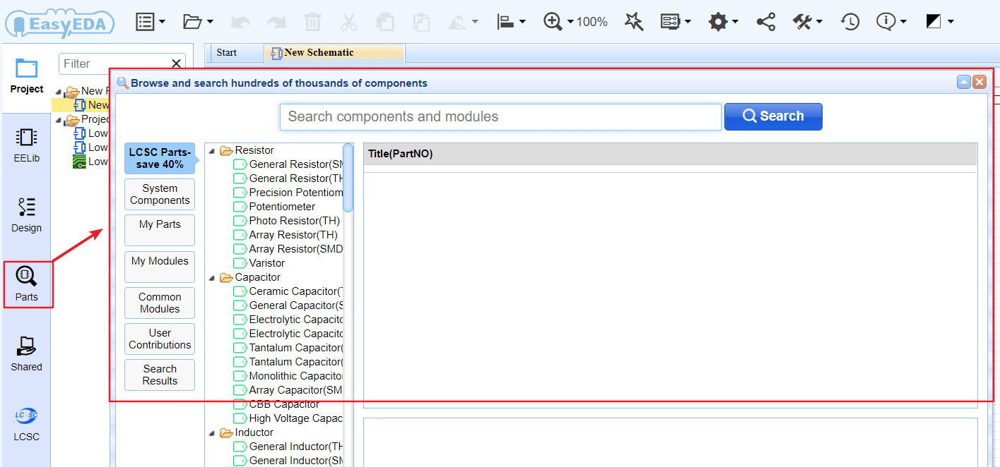 
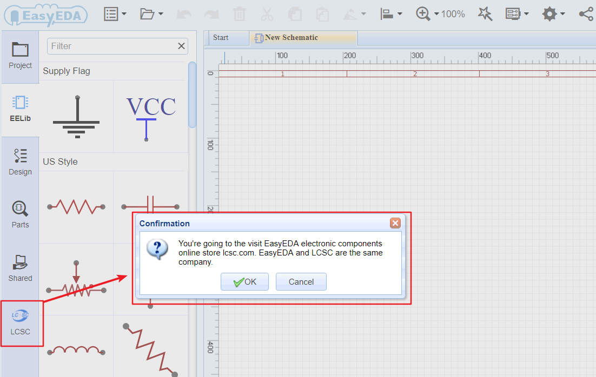 

#### 3. ToolBar

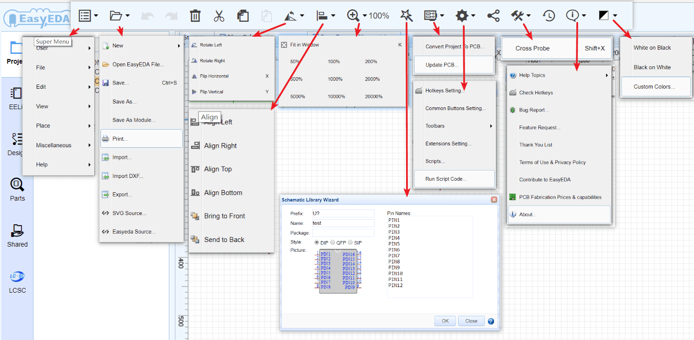

EasyEDA's toolbar can be reconfigured via Common Buttons Setting…

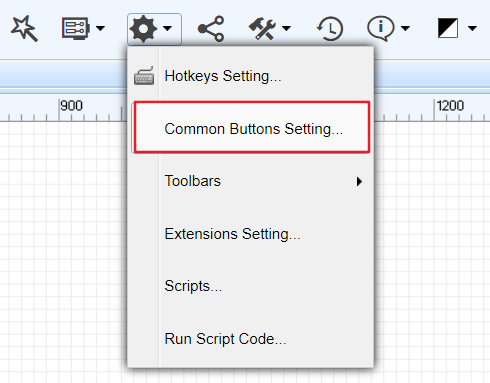

The configure dialog is also easy to use:

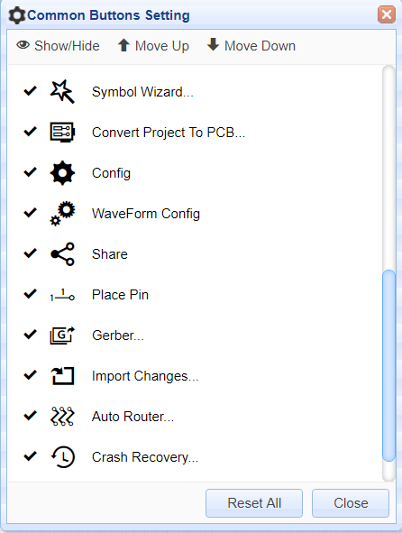

Click on a button to select it. Then you can toggle button visibility by clicking on Show/Hide or by clicking on the tick space to the left of the button icon. You can change the button position using Move up and Move Down.

Many of the buttons have been assigned hotkeys, so you can use those to replace the button actions.

#### 4. Preview Dialog

The Preview dialog will help you choose components and packages and can help you to identify schematics and PCB layouts.

You can close or open this dialog via:  

 **Super Menu > View > Toolbars > Preview** or on the top toolbar **Config Icon > Toolbars > Preview**.

-	The Preview Dialog has a resizing handle in the bottom right corner.

-	The Preview Dialog can't be closed but double clicking on the top banner will roll up the panel or you can click the top right corner `—` . Double clicking top banner again toggles it back to the selected size.    
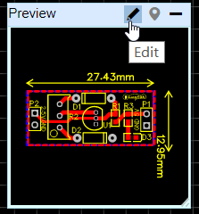

-	Clicking on the little pencil edit tool opens the item in the preview for editing. Clicking on the location place tool in the top right corner of the preview dialog places the item onto the canvas. If you try to place PCB footprint into a schematic it will not provide any action and message.

#### 5. Wiring Tools

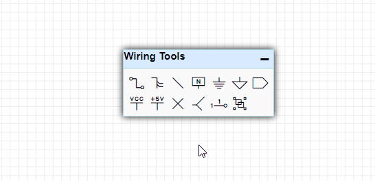

Wiring Tools are document type sensitive: different document types have different tools.

#### 6. User management menu

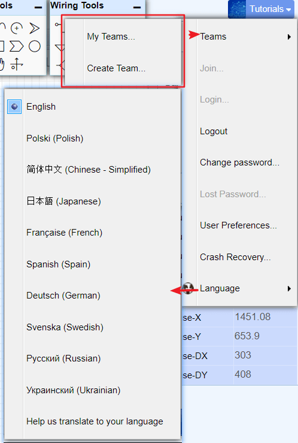

#### 7. Super menu

All EasyEDA's menus can be found here. Most of the time, we hope you can access these options via the Hotkeys or from the top toolbar but if you find that you use some of the more specialized options from this menu frequently then may want to set them as you own hotkeys.

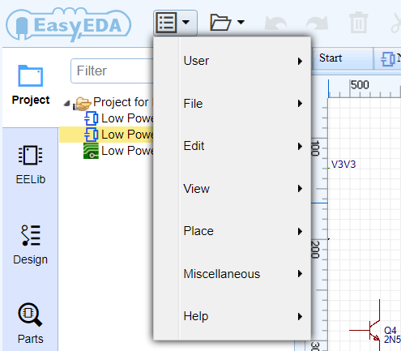

#### 8. Drawing Tools

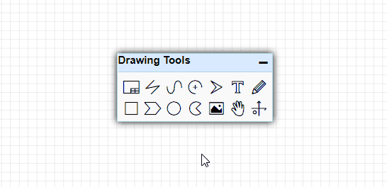

To keep EasyEDA's UI clean and sharp, the Wiring and Drawing tools palettes can be resized horizontally, rolled up or hidden so if you want to focus on drawing, you can roll up or hide the others to make more space and reduce the clutter.

#### 9. Canvas Attributes

You can find the canvas Properties setting by clicking on any of the blank space in the canvas.

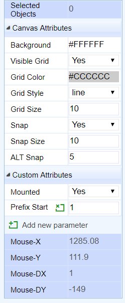

Background and grid colors and the style, size, visibility and snap attributes of the grid can all be configured.

The canvas area can be set directly by the Width and Height or from available preset frame sizes.

#### 10. Canvas

This is where it all happens! This the area where you create and edit your schematics, PCB layouts, symbols, footprints and other drawings, run simulations and display WaveForm traces.

**Schematic**  
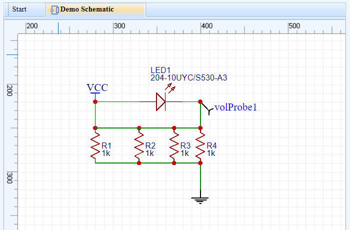  

**PCB**  
  

**Symbols**  
  

**Footprints**  
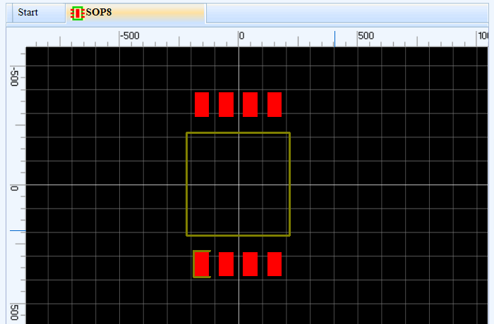

**Other Drawing**  
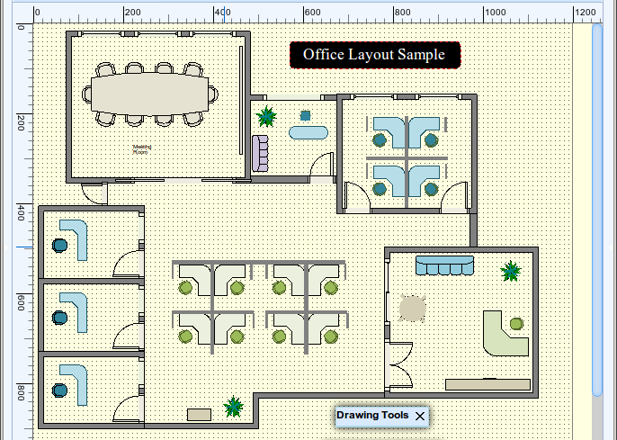

**Simulation WaveForm**  
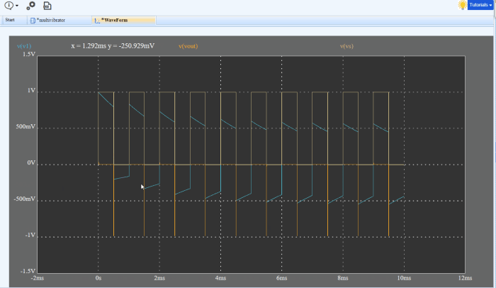

## How to Create A New Project or File

After logining in, you can create a new project:
 **Document > New > Project... > Create a new project/Schematic..etc**
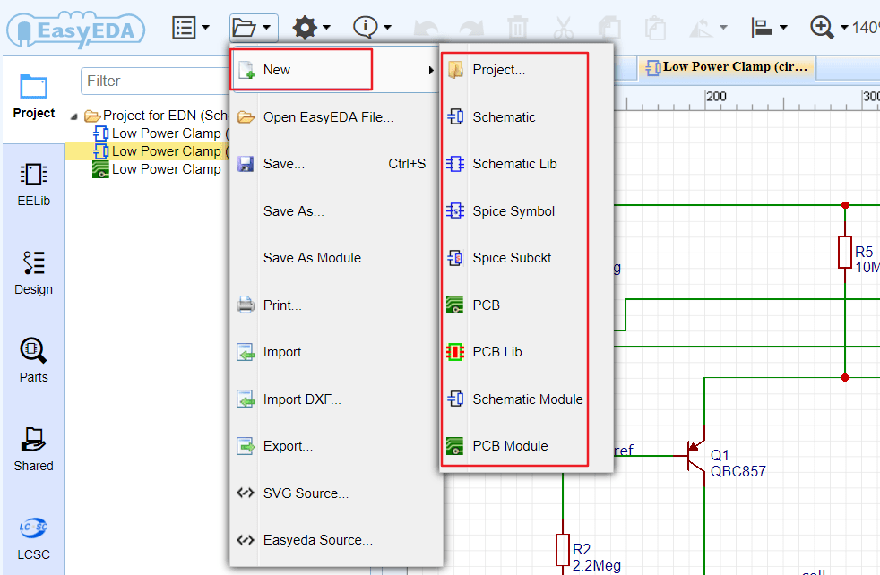   

The Project concept is important in EasyEDA because it is the foundation of how to organise your designs.

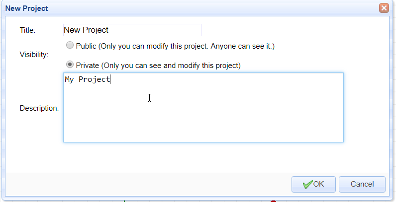 

Give it a title: this will show in the project tree in the left hand panel.

You can make your project public or private by setting its Visibility.

If you choose to make you project Public, Categories allows you to select which category you want your project to be listed under on our website. If you keep your project private then the category is still applied but has no direct use in sorting your projects because this field is not searched in the Filter box in the left hand panel.

Adding a short description helps you and anyone you are sharing this project with understand what the project is about.

Once created, to modify your project, right click on it in the project tree in the left hand panel,

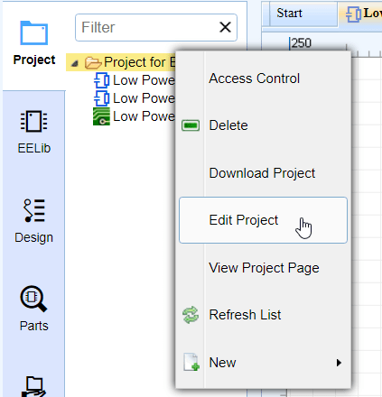

then will open a web page in which you can edit your project:

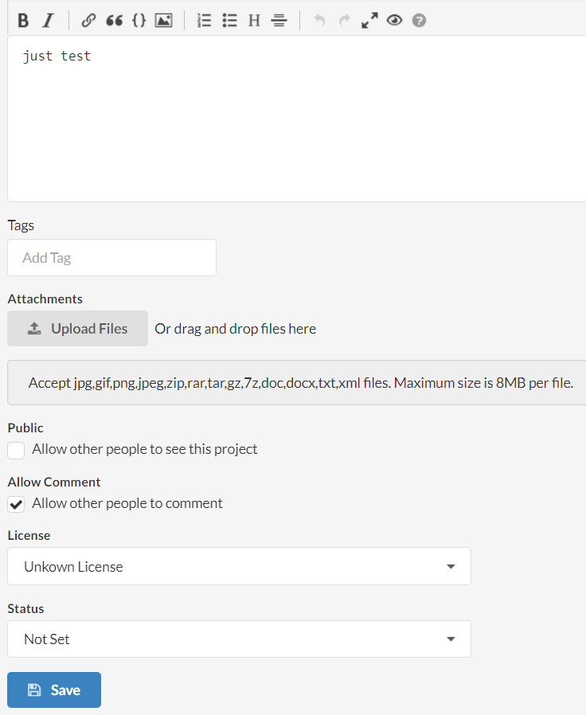

From here, you can change the Visibility, allow other people to comment on your project and type a more detailed description of the project content. To help you make your project stand out or to maybe simply make a detailed description of your project easier to read, you can use Markdown syntax. If you need more information on Markdown syntax, click on Markdown Syntax? just above the Content box.

​

## Function introduction

### Schematics 

EasyEDA can create highly professional looking schematics.

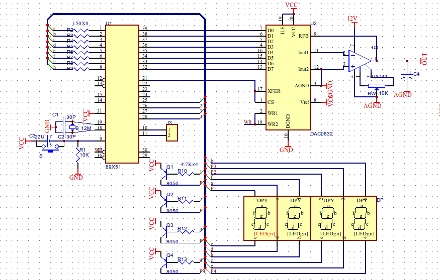  

Because EasyEDA has some simple but powerful drawing capabilities, you can create your own symbols either by copying existing symbols into your own library and then editing and saving them, or by drawing them from scratch.

There is also a **Symbol Wizard** to quickly draw new symbols for `DIP`, `QFP` and `SIP`

A feature of EasyEDA is that as well as extensive libraries of the usual simple “2D” graphical schematic symbols, it has a library of drawn `3D` component symbols, i.e. symbols that look like the physical components that they represent.

If you have enough time and patience using the drawing features to full effect in symbol creation, your schematic can be built like this:

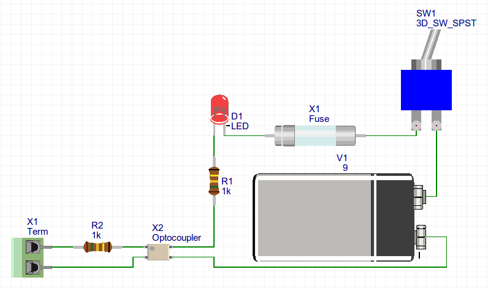

Another powerful feature is that it is also possible to import symbols from `Kicad`, `Eagle` and `Altium` libraries.

### Libraries management

Thanks to the Free and Open Source Kicad Libs and some Open Source Eagle libs, EasyEDA now has 100,000+ components, which should be enough for most projects.

Now you can enjoy using EasyEDA without having to spend so much time hunting for or building schematic symbols and PCB footprints.  

**Search symbols**

On the left hand Navigation panel you will find "**EElib**" and "**Parts**"，just type what components you want and search.

**Create symbols**

EasyEDA supports creating symbols by yourself, after created you can find out your components at **Parts > My parts**， and it is easy to manage your parts.

To prepare for the final assembly stage you can create a Bill of Materials (**BOM**) via:

**Super Menu > Miscellaneous > BOM Report...**

and you can produce professional quality `SVG`, `.PNG` or `.PDF` output files for your documents.

All EasyEDA Schematic Symbol and PCB Footprint libs are public, so after you have created and saved a new symbol or footprint, others will be able to find your part and you will be credited as a contributor.   [https://easyeda.com/page/contribute](https://easyeda.com/page/contribute)​

### PCB Design

When you are satisfied with your schematic design and simulation results, you can then quickly proceed to produce your finished and populated PCB without leaving EasyEDA.

EasyEDA's PCB Design canvas helps you to quickly and easily lay out even complex multilayer designs from schematics you have already created in the Schematic canvas or directly as a layout with no schematic.

Passing an EasyEDA Schematic into the PCB Design editor is as easy as clicking a button: Just click the **Convert Project to PCB** PCB icon on the top toolbar!  
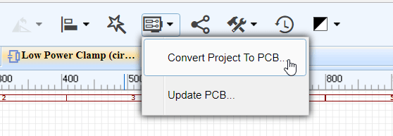

EasyEDA has extensive libraries of footprints. You can also build up your own library of unusual and specialized parts by copying and modifying existing parts or from scratch using EasyEDA's powerful footprint creation and editing tools.

In a similar way as in the Schematic design canvas, to help you locate items and navigate your way around when working in the PCB Design canvas there is a PCB Design Manager.

**Left Navigation Panel > Design**

The PCB Design Manager is a very powerful tool for finding components, tracks (nets) and pads (Net Pads).

Clicking on any item highlights the component and pans it to the center of the window.

You can set up layers used in the PCB and their display colours and visibility using

**Super Menu > Miscellaneous > Layer Options...**

The active layer and layer visibility can be selected using the Layers Toolbar.

Default track widths, clearances and via hole dimensions can all be configured in the Design Rule Check dialog which is opened via:

**Super Menu > Miscellaneous > Design Rule Setting...**

From first setting up the Design Rule Check (**DRC**) at the start of your board layout, running a DRC is almost the last step in checking your PCB design before you generate **Gerber** and **Drill** files for board manufacture ready to place your order for a finished PCB.

The last step is to check the Gerber and Drill files using an easy to install and use Free and Open Source Software Gerber Viewer: [Gerbv: http://gerbv.geda-project.org/](http://gerbv.geda-project.org/) 

While you are waiting for your PCB to be delivered, you can create a Bill of Materials (BOM) via:

**Super Menu > Miscellaneous > BOM Report...**

and you can produce professional quality `SVG`, `.png` or `.pdf` output files for your documentation.

PCB Designs can be shared with colleagues and made public in the same way as Schematics.

The size of PCB that you can produce using EasyEDA is almost unlimited: designs of over 100cm * 100cm are possible … but you might need a powerful computer for that.

EasyEDA supports up to 6 layer PCBs by default but it is capable of handling more, so if you need more layers then please contact us as shown in the section on [How to get Help?](#How-To-Get-Help).

**Search footprints**  

Searching footprints is the same as searching symbols by using **Parts** in the Schematic.
You can place the selected footprints in the canvas after the search.

### Account Management 

EasyEDA is a web-based service and although you are free to use it in Anonymous mode which you can do without creating an account, you are much better off creating an account to manage your own designs and parts libraries. Creating an account is easy and gives you free access to the full power of EasyEDA for as long as you wish.

#### Join

Click  **Join...** on the **User Management** menu:

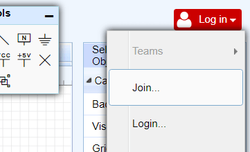

After clicking on **Join**, a new webpage about **Create an account**  opens.

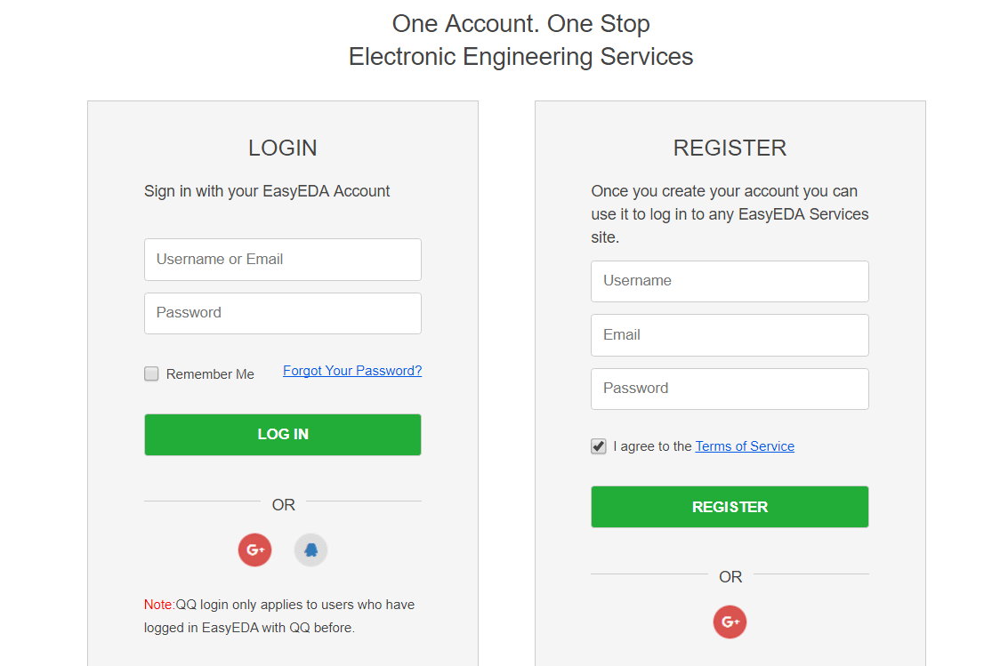

Just enter a username, invent a password, confirm it and type in an email address. A valid email address is needed so that we can send you a confirmation email before we create your account. This is also the address we will use to contact you with information or any questions about your PCB orders.

#### Login

The Login dialog image can be seen in the Join section above.

After clicking on Login, you can enter the username or email and password to login to EasyEDA. If you use a private device, you can check **Remember Me**, so you don't need to login again each time you open EasyEDA.

Alternatively, if you have a Google or Tencent QQ account, you can login in using [http://en.wikipedia.org/wiki/OpenID](http://en.wikipedia.org/wiki/OpenID); it is safe and easy.

**Note:** *QQ login only applies to users who have logged in EasyEDA with QQ before.*

#### Reset Your Password
Your password is encrypted, so EasyEDA team doesn't know it, but you can reset it via your email. Click the **Lost Password** menu and type your email. If you can't get the email after 10 minutes, please send an email to us.

#### Teams
EasyEDA provides a team feature with which you can work seamlessly with your partners. You can work as if everyone is logged in under the same account, with full access to all components, Schematics, PCBs and Projects.

**How to find the team function**

  Under the [dashboard](https://beta.easyeda.com/projects/mylists) , there is a team section.

 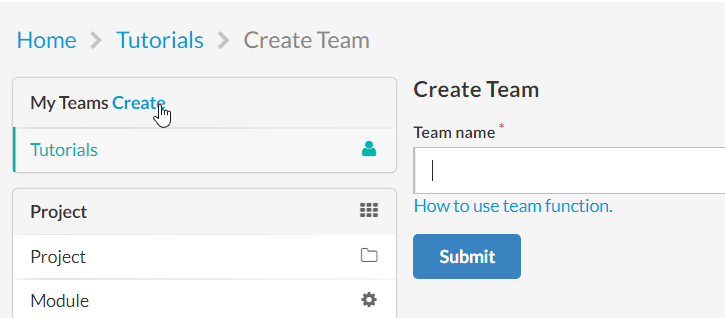   

**How to create a team**

  There is a link as shown in the image above, or click [https://easyeda.com/teams/create](https://easyeda.com/teams/create) after you login, Or you can click **User Management > Teams > Create Team** to open this link to create a team.  
 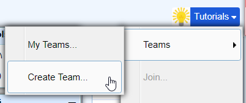   

  And then you need to invite your partner(s) to join this team at Team Manage of the dashboard:
 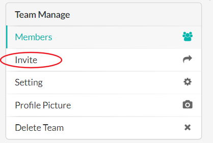 

**How to switch to team model**

  1) switch to the dashboard.
   After you have created a team, click the team name and the dashboard will switch to showing only the team projects, files and components.

   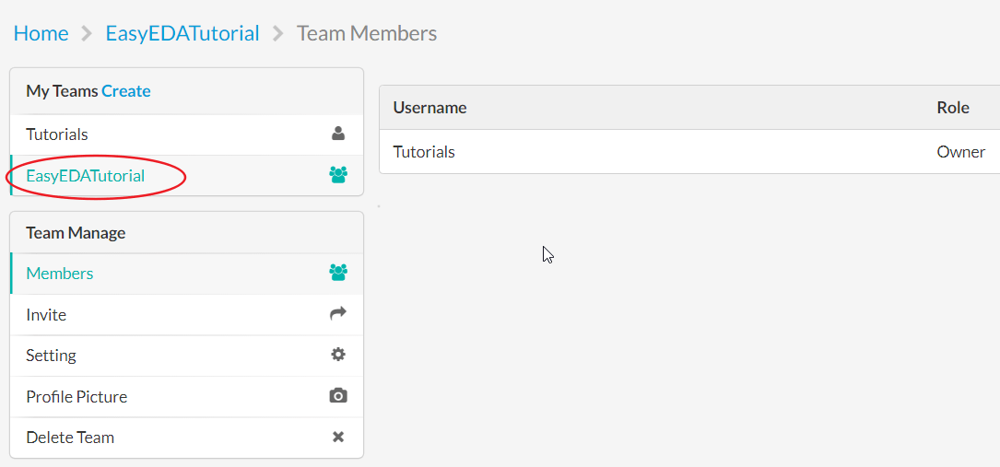  

   After switching to a team, there is a team management section where you can manage your team members, invite new team members and even delete the team.

  2) switch to the editor.
   Under your personal menu, there is a sub menu allowing you to switch to a team or to your personal account.

   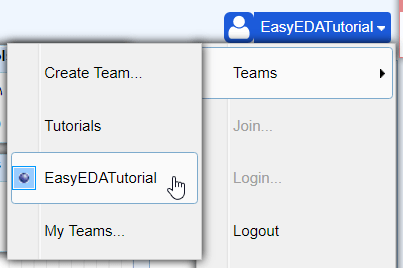  

**How to Upgrade to a team**
  If you want to contribute all of your designs to a team, you can use this function. First you need to create a team, then click the link, shown below, under the dashboard. 

  **Be careful！**, because after you do that, **all** of your components, projects will be moved to your team.

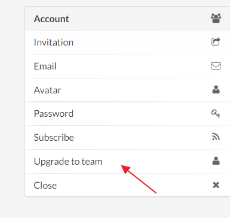  

**Tips about the team function.**  
1.If you switch to a team, you can't automatically use any Packages/Footprints which you have created under your personal account. You need to **Favorite** your personal package/components first. 

2.You need to be aware that your team and your personal accounts are the different, separate accounts and that you can't use them both at the same time.  

3.After making yourself the owner of a team, it is best to create any Components and Packages needed by the team under that team.

4.If you add a member, nominated to be your accountant, to your team then they can deal the team billing and invoices.

#### User Preferences

When EasyEDA shows up the login success popup in the bottom right of the window, your user management menu will be look like this:

Click on **User Preferences**,  

**Maximum backup level**: every open document can be saved at up to this number of different revisions.

**Auto save (minutes)**: this is the time interval between auto saves of all your open documents.

**Save to Server**: Save your preferences (Toolbar configurations, EasyEDA libs, Hotkey settings, language and so on) to the EasyEDA Server.

**Load from Server**: EasyEDA can't load your Preferences automatically but once you have saved them, you can load them manually. Then, when you change to a different computer or browser, you can load your preferences from the EasyEDA Server.

If you have not saved any preferences then **Load from Server** will have no effect.

#### Close Account

If you want to close your account, you can go to [https://easyeda.com/account/close](https://easyeda.com/account/close)  
Before you close your account, please let us know why, and that will make us to be better.

### Hotkeys

After a while of using an EDA tool suite, clicking all over the place with a mouse gets very tedious and seriously reduces your productivity. Keyboard shortcuts or Hotkeys avoid much of that. EasyEDA not only provides lots of hotkeys, but also every hotkey can be reconfigured.

Under the Config toolbar, click the Hotkeys Setting... Menu which will open the Hotkey Setting dialog.

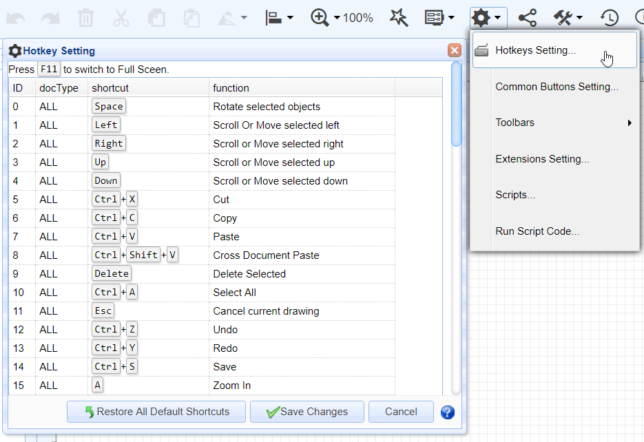

To change a Hotkey, click anywhere in the row for the hotkey you want to change and then press your new key.

For example, if you want to use R instead of space to rotate selected objects, click on the first row, then press `R`.

After you change the hotkey, don't forget to click Save Changes button.

The **docType** column describes which type of EasyEDA document each hotkey applies to. **docType** has three types:

- **ALL**: any document type in EasyEDA.
- **SCH**: schematic and schematic libs
- **PCB**: PCB and PCB libs.

The functions of some hotkeys may change between docTypes. For example, the hotkey `C` draws an Arc in SCH, but draws a circle in PCB.

A list of all the available default hotkeys is given below. 
<table>
   <tr>
      <td>ID</td>
      <td>docType</td>
      <td>shortcut</td>
      <td>function</td>
   </tr>
   <tr>
      <td>0</td>
      <td>ALL</td>
      <td>Space</td>
      <td>Rotate selected objects</td>
   </tr>
   <tr>
      <td>1</td>
      <td>ALL</td>
      <td>Left</td>
      <td>Scroll Or Move selected left</td>
   </tr>
   <tr>
      <td>2</td>
      <td>ALL</td>
      <td>Right</td>
      <td>Scroll or Move selected right</td>
   </tr>
   <tr>
      <td>3</td>
      <td>ALL</td>
      <td>Up</td>
      <td>Scroll or Move selected up</td>
   </tr>
   <tr>
      <td>4</td>
      <td>ALL</td>
      <td>Down</td>
      <td>Scroll or Move selected down</td>
   </tr>
   <tr>
      <td>5</td>
      <td>ALL</td>
      <td>Ctrl+X</td>
      <td>Cut</td>
   </tr>
   <tr>
      <td>6</td>
      <td>ALL</td>
      <td>Ctrl+C</td>
      <td>Copy</td>
   </tr>
   <tr>
      <td>7</td>
      <td>ALL</td>
      <td>Ctrl+V</td>
      <td>Paste</td>
   </tr>
   <tr>
      <td>9</td>
      <td>ALL</td>
      <td>Delete</td>
      <td>Delete Selected</td>
   </tr>
   <tr>
      <td>10</td>
      <td>ALL</td>
      <td>Ctrl+A</td>
      <td>Select All</td>
   </tr>
   <tr>
      <td>11</td>
      <td>ALL</td>
      <td>Esc</td>
      <td>Cancel current drawing</td>
   </tr>
   <tr>
      <td>12</td>
      <td>ALL</td>
      <td>Ctrl+Z</td>
      <td>Undo</td>
   </tr>
   <tr>
      <td>13</td>
      <td>ALL</td>
      <td>Ctrl+Y</td>
      <td>Redo</td>
   </tr>
   <tr>
      <td>14</td>
      <td>ALL</td>
      <td>Ctrl+S</td>
      <td>Save</td>
   </tr>
   <tr>
      <td>15</td>
      <td>ALL</td>
      <td>A</td>
      <td>Zoom In</td>
   </tr>
   <tr>
      <td>16</td>
      <td>ALL</td>
      <td>Z</td>
      <td>Zoom Out</td>
   </tr>
   <tr>
      <td>17</td>
      <td>ALL</td>
      <td>X</td>
      <td>Flip Horizontal</td>
   </tr>
   <tr>
      <td>18</td>
      <td>ALL</td>
      <td>Y</td>
      <td>Flip Vertical</td>
   </tr>
   <tr>
      <td>19</td>
      <td>ALL</td>
      <td>G</td>
      <td>Snap</td>
   </tr>
   <tr>
      <td>20</td>
      <td>ALL</td>
      <td>Ctrl+F</td>
      <td>Find Component</td>
   </tr>
   <tr>
      <td>21</td>
      <td>ALL</td>
      <td>Ctrl+D</td>
      <td>Design Manager</td>
   </tr>
   <tr>
      <td>22</td>
      <td>ALL</td>
      <td>D</td>
      <td>Drag Tool</td>
   </tr>
   <tr>
      <td>23</td>
      <td>SCH</td>
      <td>W</td>
      <td>Draw Wire</td>
   </tr>
   <tr>
      <td>24</td>
      <td>SCH</td>
      <td>B</td>
      <td>Draw Bus</td>
   </tr>
   <tr>
      <td>25</td>
      <td>SCH</td>
      <td>U</td>
      <td>Bus Entry</td>
   </tr>
   <tr>
      <td>26</td>
      <td>SCH</td>
      <td>N</td>
      <td>NetLabel</td>
   </tr>
   <tr>
      <td>27</td>
      <td>SCH</td>
      <td>Ctrl+Q</td>
      <td>NetFlag VCC</td>
   </tr>
   <tr>
      <td>28</td>
      <td>SCH</td>
      <td>Ctrl+G</td>
      <td>NetFlag GND</td>
   </tr>
   <tr>
      <td>29</td>
      <td>SCH</td>
      <td>P</td>
      <td>Place Pin</td>
   </tr>
   <tr>
      <td>30</td>
      <td>SCH</td>
      <td>L</td>
      <td>Draw Polyline</td>
   </tr>
   <tr>
      <td>31</td>
      <td>SCH</td>
      <td>O</td>
      <td>Draw Polygon</td>
   </tr>
   <tr>
      <td>32</td>
      <td>SCH</td>
      <td>Q</td>
      <td>Draw Bezier</td>
   </tr>
   <tr>
      <td>33</td>
      <td>SCH</td>
      <td>C</td>
      <td>Draw Arc</td>
   </tr>
   <tr>
      <td>34</td>
      <td>SCH</td>
      <td>S</td>
      <td>Draw Rect</td>
   </tr>
   <tr>
      <td>35</td>
      <td>SCH</td>
      <td>E</td>
      <td>Draw Ellipse</td>
   </tr>
   <tr>
      <td>36</td>
      <td>SCH</td>
      <td>F</td>
      <td>Freehand Draw</td>
   </tr>
   <tr>
      <td>37</td>
      <td>SCH</td>
      <td>T</td>
      <td>Draw Text</td>
   </tr>
   <tr>
      <td>38</td>
      <td>SCH</td>
      <td>I</td>
      <td>Edit Selected Symbol</td>
   </tr>
   <tr>
      <td>39</td>
      <td>SCH</td>
      <td>Ctrl+R</td>
      <td>Run the Document</td>
   </tr>
   <tr>
      <td>40</td>
      <td>PCB</td>
      <td>W</td>
      <td>Draw Track</td>
   </tr>
   <tr>
      <td>41</td>
      <td>PCB</td>
      <td>U</td>
      <td>Draw Arc</td>
   </tr>
   <tr>
      <td>42</td>
      <td>PCB</td>
      <td>C</td>
      <td>Draw Circle</td>
   </tr>
   <tr>
      <td>43</td>
      <td>PCB</td>
      <td>N</td>
      <td>Draw Dimension</td>
   </tr>
   <tr>
      <td>44</td>
      <td>PCB</td>
      <td>S</td>
      <td>Draw Text</td>
   </tr>
   <tr>
      <td>45</td>
      <td>PCB</td>
      <td>O</td>
      <td>Draw Connect</td>
   </tr>
   <tr>
      <td>46</td>
      <td>PCB</td>
      <td>E</td>
      <td>Draw copperArea</td>
   </tr>
   <tr>
      <td>47</td>
      <td>PCB</td>
      <td>T</td>
      <td>Change To TopLayer</td>
   </tr>
   <tr>
      <td>48</td>
      <td>PCB</td>
      <td>B</td>
      <td>Change To BottomLayer</td>
   </tr>
   <tr>
      <td>49</td>
      <td>PCB</td>
      <td>1</td>
      <td>Change To Inner1</td>
   </tr>
   <tr>
      <td>50</td>
      <td>PCB</td>
      <td>2</td>
      <td>Change To Inner2</td>
   </tr>
   <tr>
      <td>51</td>
      <td>PCB</td>
      <td>3</td>
      <td>Change To Inner3</td>
   </tr>
   <tr>
      <td>52</td>
      <td>PCB</td>
      <td>4</td>
      <td>Change To Inner4</td>
   </tr>
   <tr>
      <td>53</td>
      <td>PCB</td>
      <td>P</td>
      <td>Place Pad</td>
   </tr>
   <tr>
      <td>54</td>
      <td>PCB</td>
      <td>V</td>
      <td>Place Via</td>
   </tr>
   <tr>
      <td>55</td>
      <td>PCB</td>
      <td>M</td>
      <td>Measure</td>
   </tr>
   <tr>
      <td>56</td>
      <td>PCB</td>
      <td>L</td>
      <td>Change Route Angle</td>
   </tr>
   <tr>
      <td>57</td>
      <td>PCB</td>
      <td>-</td>
      <td>Decrease Routing Width</td>
   </tr>
   <tr>
      <td>58</td>
      <td>PCB</td>
      <td>+</td>
      <td>Increase Routing Width</td>
   </tr>
   <tr>
      <td>59</td>
      <td>PCB</td>
      <td>Alt+-</td>
      <td>Decrease Snap Size</td>
   </tr>
   <tr>
      <td>60</td>
      <td>PCB</td>
      <td>Alt++</td>
      <td>Increase Snap Size</td>
   </tr>
   <tr>
      <td>61</td>
      <td>PCB</td>
      <td>H</td>
      <td>Highlight Net</td>
   </tr>
   <tr>
      <td>62</td>
      <td>PCB</td>
      <td>Shift+M</td>
      <td>Remove All Copper Area</td>
   </tr>
   <tr>
      <td>63</td>
      <td>PCB</td>
      <td>Shift+B</td>
      <td>Rebuild All Copper Area</td>
   </tr>
</table>

### Basic Driving Skills.

To use EasyEDA, you need to be familiar with a few basic terms and concepts. The best way to learn them is to open up EasyEDA, open a new schematic:

**Document > New > Schematic** , and play!

#### Version History
It is easy to use this function, right click on the document for which you need the version history in like in the image below:  
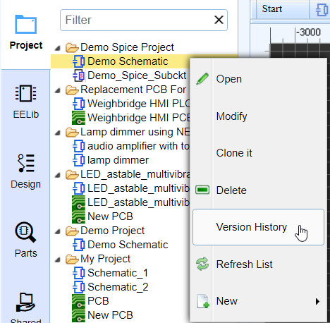

 

After clicking on the version history link, you will get a list of all of the versions like in the image below.    
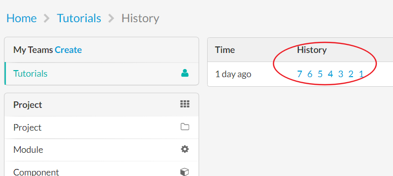  

Click the version number, you can open the saved file in the editor, if this is what you need, you can save it to your project and delete your bad file.

**Note:**  
*1. For now all of the versions are marked as number, we will allow you to add a tag soon.*  
*2. Don't save your files too frequently, or you will get lots of versions and it will be hard to find the exact one you want.*

#### Crash Recovery

No operating system, software or network is perfect, so sometimes things can go wrong. Having your Desktop or web browser freeze or your broadband connection drop, two hours into laying out a PCB, could spoil your day.

However, with EasyEDA, your day will be just fine.

This is because EasyEDA auto saves and makes backups of all your open files to your computer so crash recovery is built into EasyEDA.

In **user management menu**, click on **Crash Recovery**. Or you can click **Crash Recovery** button on the top Toolbar as below:

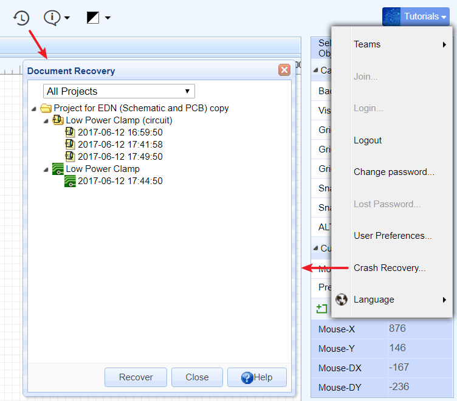

Select the file which you would like to **recover**, then click the Recover button; your file will be opened in a new tab. 

**Please note:**  
-	*EasyEDA saves these crash recovery files on your computer and not on the EasyEDA server. Therefore you cannot recover files from a crash on one computer or browser by changing to a different computer or browser.*  
-	*And if you cleaned your browser's cache, the recovery files will disappear.*
-	*If you make a mistake to delete a file and remove the cache already, maybe you can find your document back via : [https://easyeda.com/document/recycle](https://easyeda.com/document/recycle).*

#### Resizing the canvas area

Hovering the mouse cursor over the areas indicated by the three green ellipses will bring up blue toolbar toggle lines. Clicking on them will toggle the visibility of their associated top, right and left toolbar areas to expand the canvas area. The vertical lines can also be dragged horizontally to resize the panels.  

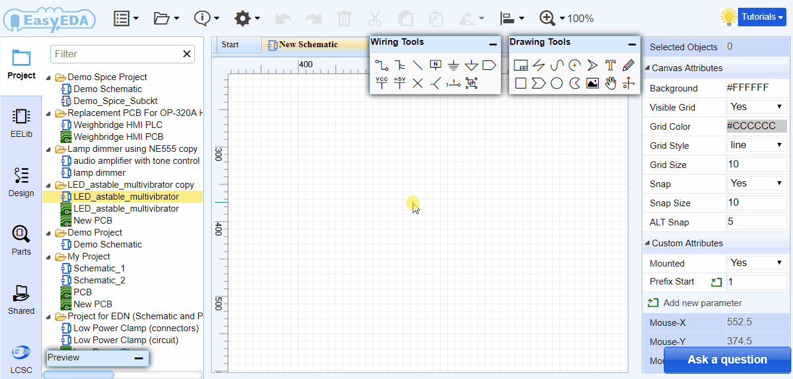

#### Cursor Style

 Some users don't like the cross cursor, so you can change it to arrow cursor like in the image below.

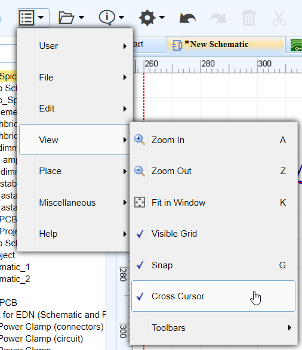

These difference between these options is as below: 

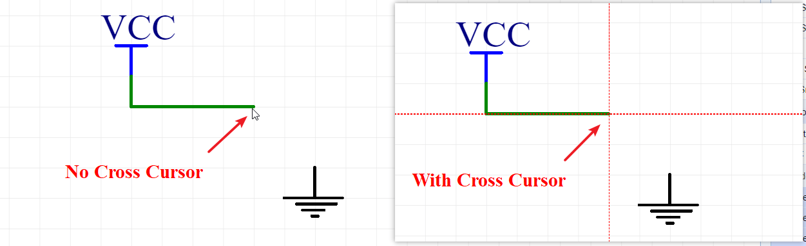

#### Clear

If you think your schematic or PCB looks terrible, and you want to redraw all units, you can:

- **Super Menu > Edit > Clear**.  
- Delete this schematic and create a new one.  
- Use **Global Delete** on the top toolbar **Tools**  
  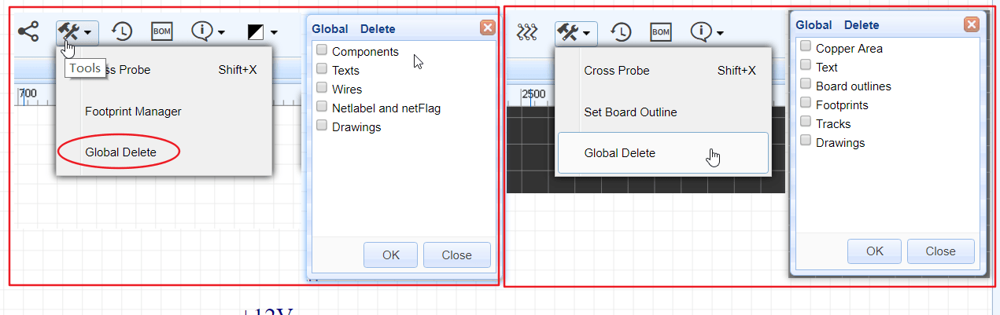

#### Left clicking

Similar to other EDA software: 

-   Click on an item to select it;
-   If over a selected item, click and hold to drag a selected item;
-   If not over a selected item, clicking and holding while dragging creates a selection box;
-   the selection box, using click and drag to the right, selects everything inside the box;
-   the selection box, using click and drag to the left, selects everything inside and intersected by the box;
-   Double click on a text area to edit it;
-   The exact left click functionality depends on what item is being selected and in what Canvas the item exists (Schematic or PCB).

#### Right clicking

EasyEDA does not support right click context menus in the Schematic or PCB Canvas. Instead, right clicking executes a context sensitive command:

-   When you are placing a symbol, after a right click, the active symbol will be removed;
-   When you are drawing a shape such as a polyline, after a right click, the polyline will be stopped at the place where you right click but the mouse will remain as a **cross**, so you can draw another shape;
-   To get out of the current active context sensitive command such as  placement or drawing mode and go back to **select mode**, just double right click.

**Ctrl+Right** clicking anywhere in the Schematic, waveForm or PCB Canvas drags the canvas around within the EasyEDA window.

#### ESC key

Pressing the `ESC` key ends the current drawing action but does not exit the current active context sensitive command mode (i.e. it does not return the cursor to select mode).

#### Select more shapes

-   Ctrl+left clicking on items adds those items to your selection;
-   Clicking and holding creates a selection box;
-   Creating a selection box, using click and drag to the right, selects everything inside the box;
-   Creating a selection box, using click and drag to the left, selects everything inside and intersected by the box;

#### Zoom in and Zoom out

-   Using the middle mouse button:
-   Roll forward to zoom in; 
-   Roll back to zoom out;
-   Using hotkeys, the default hotkey `A` for zoom in, `Z` for zoom out.

**Please note:**   
*Do not roll your mouse at the same time as pressing the CTRL key. Some browsers will zoom the whole site, not just the canvas in the EasyEDA window. If this happens, just press `Ctrl+0` to reset the browser zoom.*  

#### Double clicks

Double clicking any text area opens a resizable text box to allow you edit the text inline.

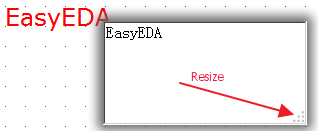

Press enter to create new line. Click outside the text box to close it.

#### Pan

-   Right click anywhere in the Schematic, WaveForm or PCB Canvas and Hold down right button to drags the canvas around within the EasyEDA window.
-   If your canvas is bigger than the EasyEDA window and is showing scroll bars, you can use either the scroll bars or the Arrow keys to scroll the canvas to pan.
-   When drawing a wire, a graphic line or shape that you wish to extend beyond the edge of the EasyEDA window holding down the left mouse button after starting the line will pan the canvas to keep the drawn item inside the window.

**Tip:**
*If you use Chrome, and cursor is in the canvas while pressing CTRL or ALT key and rolling your mouse, the canvas will move vertically, and when pressing SHIFT and rolling your mouse, the canvas will move horizontally.*

#### Rotate

After selecting one or more items, you can rotate the selected items using:

**Super Menu > Edit > Rotate** or click top ToolBar **Rotate and Flip > Rotate Left or Rotate Right**

or by pressing the default rotate hotkey: `Space`.

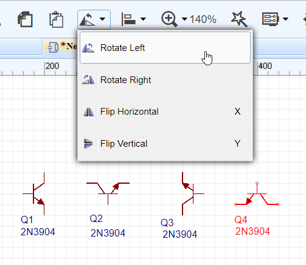

**Please note:**  
*Rotating a multiple selection rotates each item about its own symbol origin. It does not rotate the items about the centroid of the group of items.*

#### Flip

To place a Q2 as shown in the schematic below you need to Flip the item.

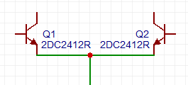

You can Flip one or more selected items using:   

**Rotate and Flip > Flip Horizontal or Flip Vertical**  from the toolbar,  

or by pressing the default flip hotkeys: `X` to Flip Horizontal, `Y` to Flip Vertical.

#### Align

EasyEDA provides many align option features, you can align your components or footprints very easily, it include:  

- Align Left
- Align Right
- Align Top
- Align Bottom
- Align Horizontal Center
- Align Vertical Center
- Distribute Horizontally
- Distribute Verticall
- Distribute Left Edges Equidistantly
- Distribute Top Edges Equidistantly
- Align Grid

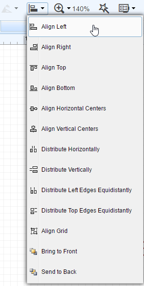

#### Bring to Front and Send to Back

In the image below, both the rectangle and the ellipse are filled.

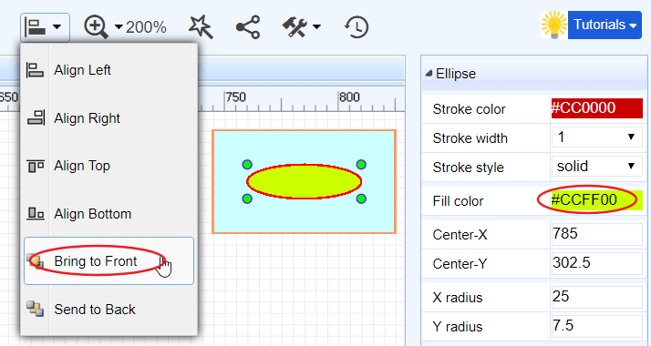

If you draw the ellipse before drawing the rectangle, the rectangle will overlap and therefore hide the ellipse. To reveal the ellipse, select the rectangle and then use:

**Align > Send to Back**  from the toolbar.

To bring the rectangle to the front again, you could select it and use:

**Align > Bring to Front**

or select the ellipse and then use:

**Align > Send to Back**

#### Documents Tab Switch

It's easy to fit your documents tab location.  
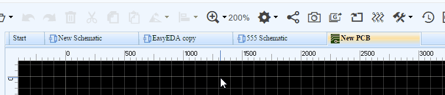

#### Saving Your Work Locally

Although EasyEDA saves all your files on our Server, sometimes you may want to save your work locally and EasyEDA provides a hack way to do this.

More detail you can view at [Export EasyEDA Source](./Export.htm#Export-EasyEDA-Source) section.

## About Upgrade 

If you use EasyEDA online, it can seamlessly upgrade by itself. However,EasyEDA uses an App Cache technique to allow you to use EasyEDA offline ([W3C HTML5 Offline Web Applications](http://dev.w3.org/html5/offline-webapps/)) which may delay the automatic upgrading process. Therefore, if you want to upgrade to the latest version immediately, you can follow the two simple steps below.

1. Check the About... dialog; 

2. If the Built Date is older than 2017/06/01:

Close your browser open EasyEDA again.

If the Built Date is still showing older than 2017/06/01:

Close your browser and open EasyEDA again.

If the Built Date is at or newer than 2017/06/01, you don't need to do anything.

**Note:** **2017/06/01** *is just an example.*  

If those two steps don't work, you may need to clear your browser's cache:

**1.Mozilla Firefox**  

-  Go to “Preferences… > Advanced > Network > Offline Storage”,

  -Click on “Clear now”,

  -Reload easyeda again.

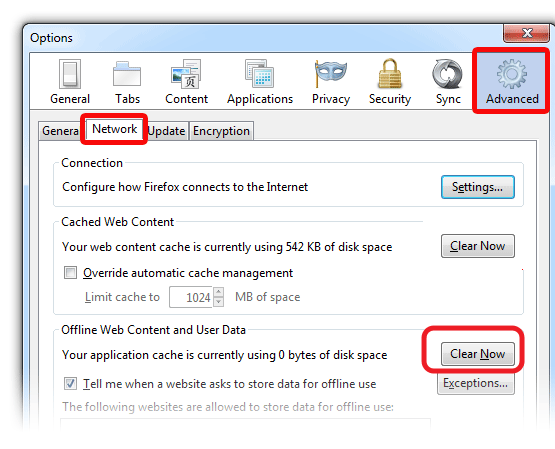  

**2.Chrome**  

-  Open the following URL: **[chrome://appcache-internals/](chrome://appcache-internals/#)**   

-  Look for easyeda.com and click “Remove”  

-  reload easyeda again.  

    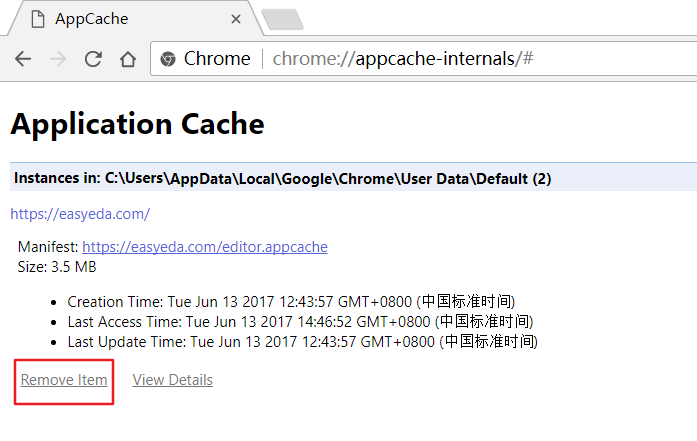  

-  Or you can use **Ctrl+shift+Delete** to delete Chrome caches.
  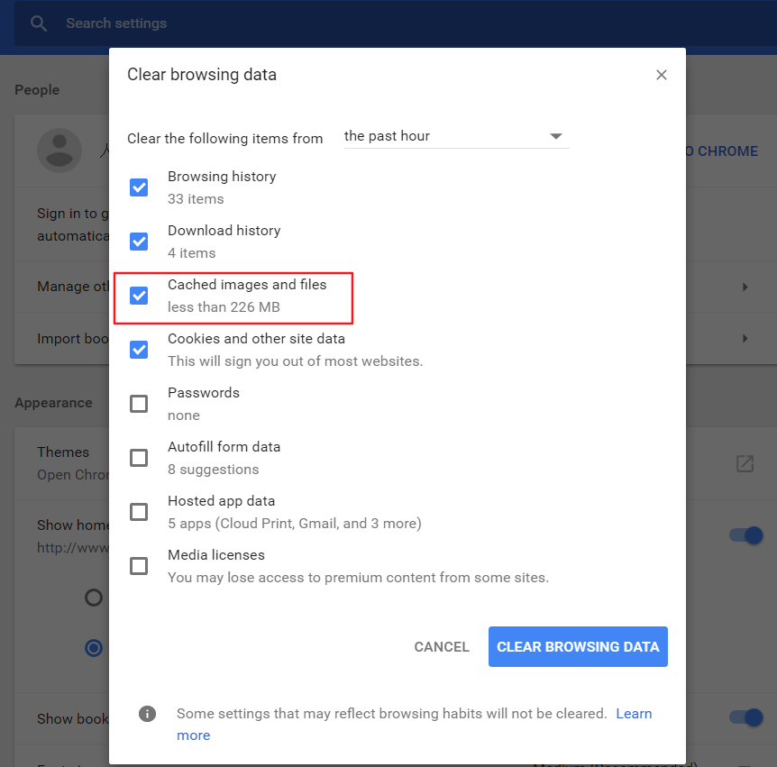 

## How To Get Help

It is easy to ask for help for any problem with EasyEDA, just click on **Let's Chat**, and then complete and Submit the Support request:

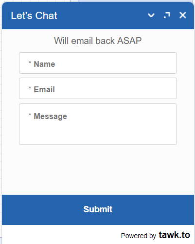  

Please ask your questions in English or Chinese and don't worry if your English is not good! (Or your Chinese!)

1.  You can also ask your questions directly in the [EasyEDA forum](https://easyeda.com/bbs_lists_2.htm). We will try to respond to every post but please be patient. Maybe EasyEDA team is in a different timezone and we are a bit busy, so you may need to wait for a while.
2.  If you don't want your help requests to be public then you can drop us an email to [support@easyeda.com](mailto:support@easyeda.com)
3.  If maybe you have a design that you know worked in some other EDA package and you are having problems importing it to EasyEDA, let us know and we will take a look and try to help you to fix them.

**Please note that:**  
*EasyEDA team may not have the time or resources to help you fix all your problems; we may just be able to help you to fix problems commonly encountered by newbies, such as using a drawing polyline in place of a wire, finding a spice model for a simulation or selecting the right PCB footprint.*

[[1]](#ftnt_ref1) *Please note that although some browsers or plug-ins allow you to use gestures, EasyEDA does not work with gestures, so you should disable this function.*

[[2]](#ftnt_ref2) *Simultaneous editing is not yet fully supported: care must be taken because the last save by any collaborator overwrites all previous saves.*

[[3]](#ftnt_ref3) *It can also find the value text but it cannot step through multiple components with the same value.*

[[4]](#ftnt_ref4) *Take a few moments to think about your username because this is the name that other users will see on your designs and posts if you choose to share them or make them public. Once you have created an account, you cannot change your username.*

[[5]](#ftnt_ref5) *You can use upper and lower case letters, numbers and symbols to make a strong password but don't forget that the password entry is case sensitive.*

[[6]](#ftnt_ref6) *Except ordering of PCBs directly from EasyEDA.*

[[7]](#ftnt_ref7) *If you always open EasyEDA in the same browser on the same machine, your Anonymous files will appear under the Anonymous Files folder in the left hand panel but you should not rely on this as a way of keeping track of Anonymous files.*

Please email [support@easyeda.com](mailto:support@easyeda.com) when you need any help.