# PCB Design Editor 

<iframe width="920" height="540" src="//www.youtube.com/embed/EoT2D2PLzVE" frameborder="0" allowfullscreen></iframe>
After the initial conversion of a schematic to PCB, it is time to learn how to manage EasyEDA’s PCB Design Editor.

## Canvas 

Lots of PCB canvas attributes are the same as Schematic canvas attributes. The key is that you can set **units** in PCB canvas attributes.

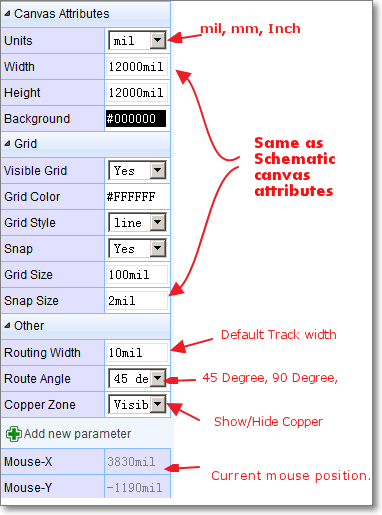

## PCB Tools 

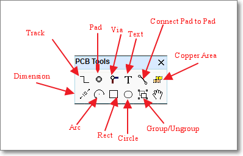

## Layer Setting 

Via

**Super menu > Miscellaneous > Layer Options...**

you can find the Layer Options Settings dialog.

In this dialog, you can change the layer’s Color and configure which layers are shown on the Layers Tool. If you plan to design a PCB with more than 2 layers, then you must tick Inner1 and Inner2 for a 4 layer PCB plus Inner3 and Inner4 for a 6 layer PCB.

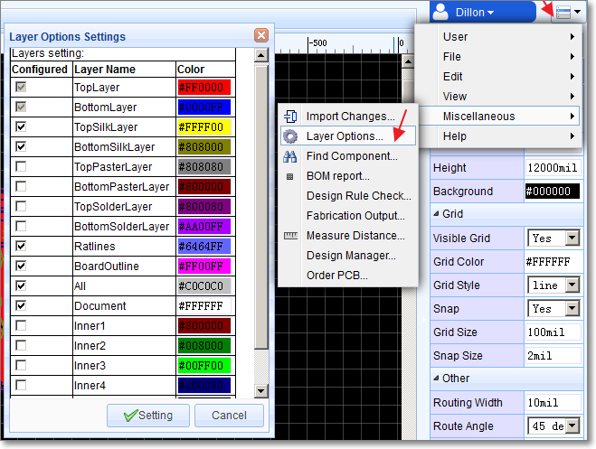

## Layers Tool 

Active Layer: The colours of the layers in the **Layers Tool** are defined in the Layer Options Settings. To work on a layer then you must make it the Active layer. To do this; click on the coloured rectangle representing the required layer. The pencil icon in the coloured rectangle, indicates that this is the active layer.

Show/Hide layers: click on the eye icons to show/hide layers.

In the example below, the Top Layer is the active layer and all layers are shown:

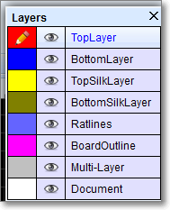

In this image the Top layer is the active layer.

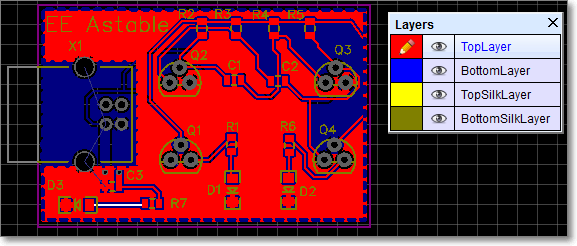

In this image the Bottom layer is the active layer.

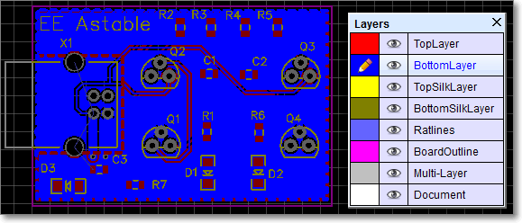

In this image, the Top layer is active and the bottom layer has been hidden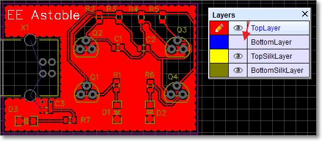

HotKeys for layer activation:

**T:** Top Layer is active  
**B:** Bottom Layer  
**1:** Inner1 Layer  
**2:** Inner2 Layer  
**3:** Inner3 Layer  
**4:** Inner4 Layer  

## Track 

In the schematic editor, we use Wire or the `W` Hotkey to connect Pins: in a similar way in the PCB editor, we use Track to connect Pads. Track allows you to draw PCB tracks and can be found on the PCB Tools palette or using the `W` Hotkey (not T: see above!).

**Some Tips about Track.**

1.  Single click to start drawing a track. Single click again to pin the track to the canvas and continue on from that point. Right click to end a track. Double right-click to exit track mode.

2.  Changing the active layer at the same time to drawing a track, will automatically insert a Via:

	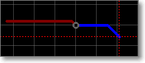 
	
	If you start drawing a track on the top layer - you will see it drawn in red - then press the B key to change to bottom layer and you will see EasyEDA insert a grey via and then the track will continue being drawn but now on the bottom layer in blue.

3.  Pressing the + or - Hotkeys when drawing the track will change the width of the track on the fly.

4.  Double clicking the on a drawn section of track will add a new vertex at that point. You can drag the vertex to form a new corner.
	
	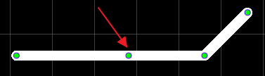

5.  Click to select the track and then Click and Drag on a segment of track adjusts the segment between vertices.
	
	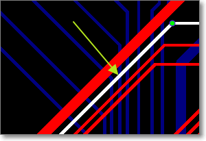

6.  Pressing the L Hotkey when drawing the track will change the track’s Route Angle on the fly.
	
	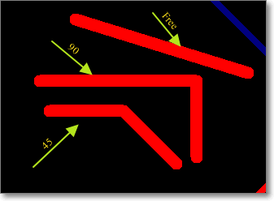

 

## Footprint attributes 

When selecting a Footprint, you can find it’s attributes at the right hand Properties panel.

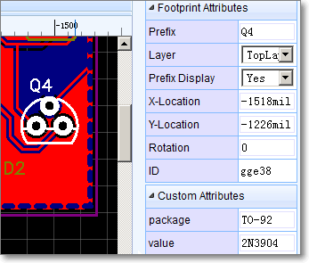

**Layer**: You can set a footrpint to be on the Toplayer or Bottomlayer. Note that the footprint mirrors when swapping layers.

**X-Location and Y-Location**: Move the origin of the footprint to a precise position.

**Rotation**: Rotates the footprint about it’s origin over the range from 0o to any angle in 1o steps (visually of course multiples of 360o will appear identical).

## Layout A PCB Without Schematic 

In some small PCB projects, maybe you don’t need a schematic. EasyEDA allows you to layout the PCB directly from the PCB Editor.

Start a new PCB as shown in the image below and you can add footprints directly from the PCB Libs from Left Navigation List and then just track them.

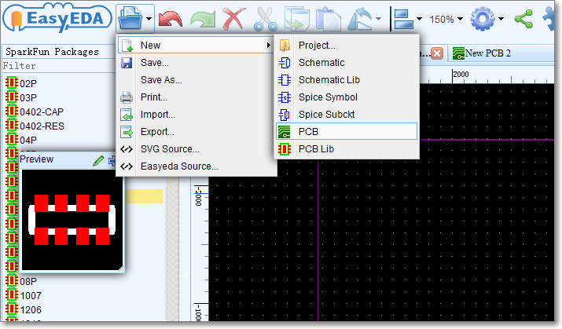

### Group/Ungroup

Just like Group/Ungroup in the Schematic Editor can be used to create a schematic lib symbol in, you can use Group/Ungroup from the PCB Tools palette to create a PCB Lib footprint in the PCB editor.

First, place Tracks and Pads on the canvas, then select all of them a click ** Group/Ungroup** to group them like the image below:

### Ratline

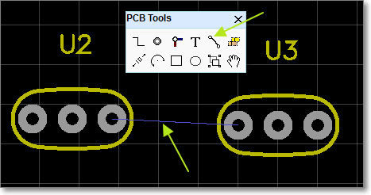

When creating a PCB without Schematic, none of the pads on the Footprints have nets connecting them so there will be no ratlines. Rather than try to track the pads from scratch, it is a good idea to connect them up by hand first using Ratline from the PCB Tools palette. This will help you to remember to track the pads correctly with fewer mistakes. You can could also do this by setting netnames for all the pads: if the two pads are given the same net name then EasyEDA will understand that they are connected together and will automatically create a ratline between them.
 

## Solid Region in PCB

EasyEDA has added a new tool Solid Region for PCB design

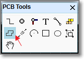

This is a very useful, quick way to connect Pads:

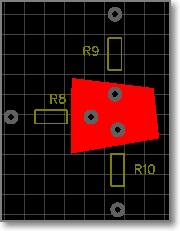

You can draw a Solid Region to include all of these pads with same net name, then set the region to the same net name as the pads. It is like Copper Area but easier to use for small areas. To use Solid Region like this, set the Type attribute (in the right hand Properties panel)  to Solid,

The Solid Region can also be used to create a cutout in a copper area.

If you have a copper area but need an area inside it to not be filled then you can draw a Solid Region  and set the Type attribute (in the right hand Properties panel)  to Cutout , then this area will be free of copper, as shown in the image below:

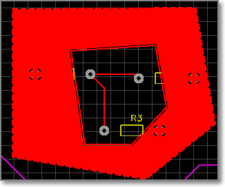

Lastly, by setting the Type attribute (in the right hand Properties panel) to NPTH, Solid Region can be used to create a Non Plated Through Hole of an arbitrary shape.

 

When the Gerber files are generated, an area defined by a Solid Region set to a Type NPTH such as shown in the image below, will create an  area defined to be a NPTH hole.

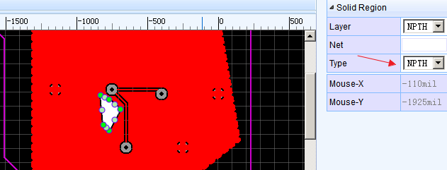

## Board Outline

Before placing footprint we need to create a board outline. The board outline must be drawn on the **BoardOutLine** layer. So first, set **BoardOutLine** as the active layer, then draw the board outline using **Track** and **Arc** from the PCB Tools palette.

When converting a Schematic to PCB, EasyEDA will try to create a board outline for you.

The area of the default board outline area is 1.5 times the sum of the area of all of your footprints, so you can place all of your footprints into this board outline with some allowance for tracking. If you do not like the board outline, you can remove the elements it is made up from  and draw your own.

The top left corner of the outline is drawn as an Arc simply to illustrate that EasyEDA supports drawing arcs as part of a board outline.

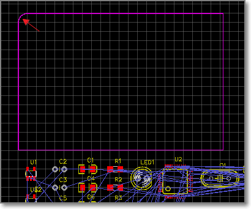

To create a simple rectangular board outline, this arc can be removed and the line X and Y end points edited - either directly in the Properties panel or by dragging the line ends - to close the rectangle.

Alternatively, an outline with more rounded corners can be created by copying the arc and rotating it in 90 degree steps to position it over the desired right angle corners and then editing the line X and Y end points - either by dragging the line ends or directly in the Propertiespanel - to overlap the arc end points (also shown but not editable in the Properties panel).

## Design Manager 

Just like Schematic’s Design Manager, PCB’s Design Manager can be found via:

**Super menu > Miscellaneous > Design Manager,**

or just press the `CTRL+D` hotkeys to open the Design Manager dialog.

In this dialog, you can:

1.  Click a component to highlight it.

2.  Check/uncheck a component to show/hide it.

3.  Filter to find a component or net.

4.  Click a net to highlight the tracks/vias with the same net.

5.  Check/uncheck the net to show/hide the net. For example, very often you may want to use this to hide a GND or supply net which has had a copper flood added to turn it into a plane and then show it again later.

6.  Double click the net to remove all of the track and via with the net name. If you want to reroute a net, this is the recommended method to use to unroute it first.

## Import Changes 

Sometimes, while working on a project, you need to make changes to the schematic and then update your board, to incorporate them.

It's easy to do this with EasyEDA.

Go to the **PCB Editor**,

**Super menu > Miscellaneous > Import Changes**

Or click that button at the tool bar
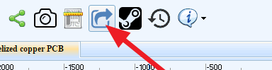

If you change the schematic, you will get a Confirm Importing changes information dialog:

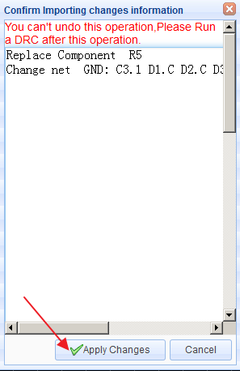

If you are happy with your changes, just click the Apply Change button.

The changes will then be passed into the PCB layout and you can then adjust the tracking to suit.

## Invalid Packages 

Some times, when you try to convert a schematic to a PCB, you will get an error message dialog like below. Don’t worry, it is easy to fix this problem.

From the error message, you will find that the symbol’s PIN number is different from PAD number. How cause that? Check the below image,

From the image, we can get the PIN number in the schematic symbol is marked as C, but the PAD Number in the PCB Footprint is mark as K. Now you have know the problem, how to fix this? 

 Solution one, Change the schematic symbol.
 Using [PinMap function](./schematic.htm#Pinmap-Modify-symbol-information). Change the PCB PIN from C to K. And save your schematic again.

 Solution Two, Modify the Footprint.
 Edit the Footprint, change the PAD from **K** to **C**. 
 So, we should aware that PIN number should be the same as Pad number.

## Measure 

Making and adding measurements is useful in PCB design. EasyEDA provides two methods to do this.

1.  Dimension tool in the PCB Tools palette:

	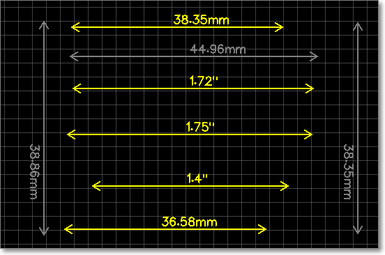

2.  Measure a distance use **M** Hotkey: press **M**, then click the two points which you would like to measure.

	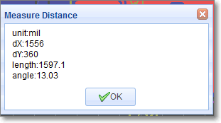

## Copper Area 

Sometimes you will want to fill in or flood an area with copper. Usually this copper area will be connected to a net such as **GND** or a supply rail. You can draw the outline of a flood using the **Copper Area** button from the PCB Tools palette.

When selecting a copper area, you can find it’s attributes from the right hand **Properties** panels.

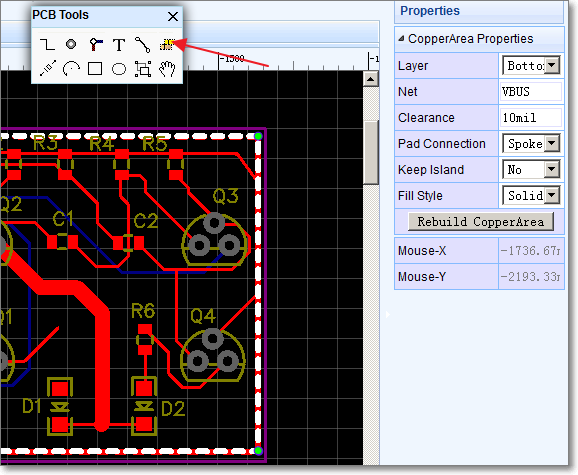

**Layer:** Bottom, Top, Inner1, Inner2, Inner3, Inner4;

**Net:** the net that the copper area is connected to;

**Clearance:** clearance of the copper area from other nets and floods;

**Pad Connection:** direct or spoke (i.e. a cross shaped heat shunt);

**Keep Island:** Yes/No. This keeps or removes any isolated areas of copper created as part of the flooding process. It is usually good practice to removes these unless you really need them to maintain a more even spread of copper (copper balance) on your PCB);

**Fill Style:** No/Filled. No removes the fill so that you can see the tracking more clearly;

After drawing the copper area, set the net it is to be connected to (floating copper areas are not recommended because they can cause EMC and Signal Integrity (SI) problems).

Lastly, don’t forget to click the button Rebuild CopperArea to **rebuild** the flood.

**Two Tips:**

1.  Hotkey `Shift+B` to build all of the copper areas.
2.  Hotkey `Shift+M` to clear all of the copper areas.

 

## Real Time DRC

**Super menu > Miscellaneous > Design Rule Check **

to open the **DRC** setting dialog:

This is a big feature of EasyEDA. It is hard to fix DRC errors after layout the PCB. Now EasyEDA will let you know the error in routing. You will find a `X` flag to mark the error, such as Track to Track or Track to PAD like bellow image
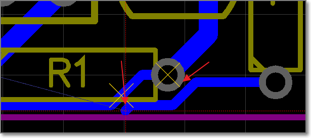.
TIP: When you convert a schematic to PCB, the real time DRC is open. In the old PCB, the real time DRC is closed. you can open it via Supper menu-> Miscellaneous->Design Rule Setting, like bellow image.

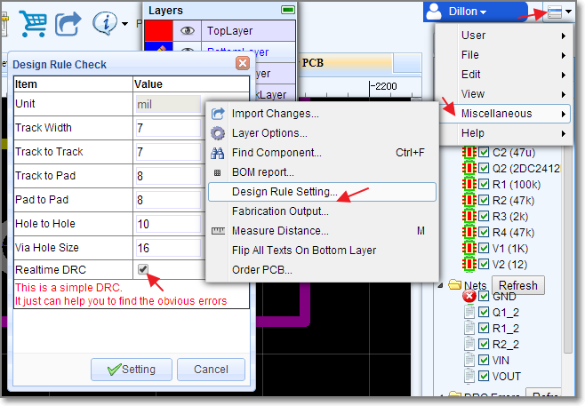. 

##Track and Net length
when select a track, you can find it's Length attribute in the right panel.
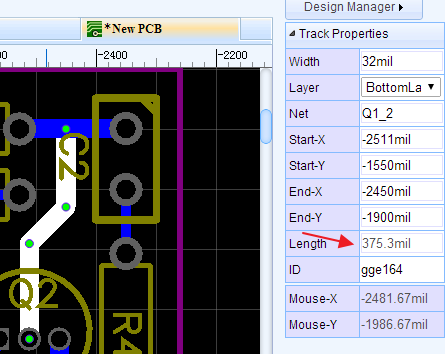
When select a track, then press `H` key, EasyEDA will highligh the whole net and pop a message box to tell you the whole net's length. like bellow image
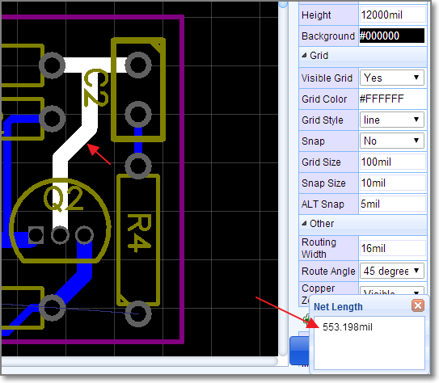

 

##HOLE
There are lots of users don't know using PAD or VIA as a HOLE, they asked EasyEDA for help, so EasyEDA add a HOLE TOOL in the PCB toolbar.
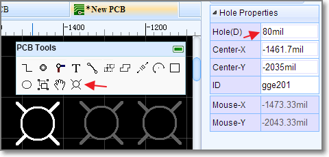

##Photo View
EasyEDA has not a 3D View at present, but we provide a nice Photo View to help you to check the PCB. There is a `PhotoView` button on the PCB document toolbar, like bellow image. If you can't see this button, try to **reload** again.
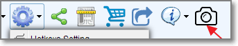.

After convert PCB to Photo View, you can see bellow image.
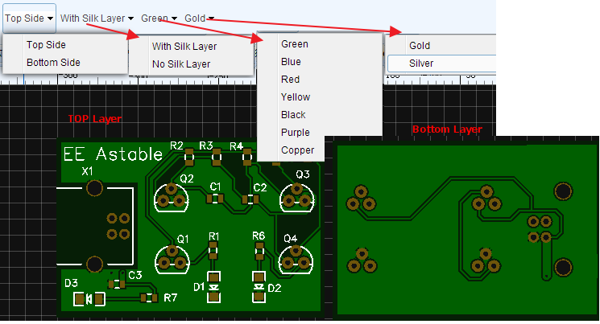.

In this view, you can find some components are too closest and silk layer on the Pad, bad Footprint etc.

Bellow image is a blue and purple board.
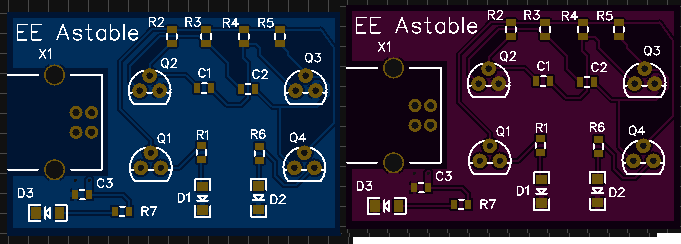.

##Place a Via On a Track
When placing a `via` on a track, the track will be cuted to two segments.  Place two vias on a tracks, you will get three segments, then you can change one segment to other layer id, or remove one of them. 
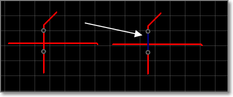. 