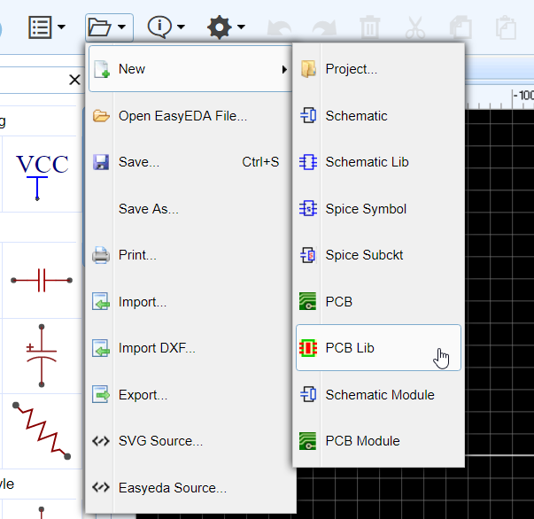
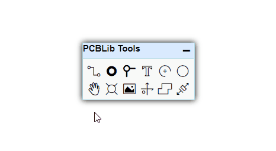
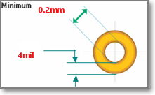
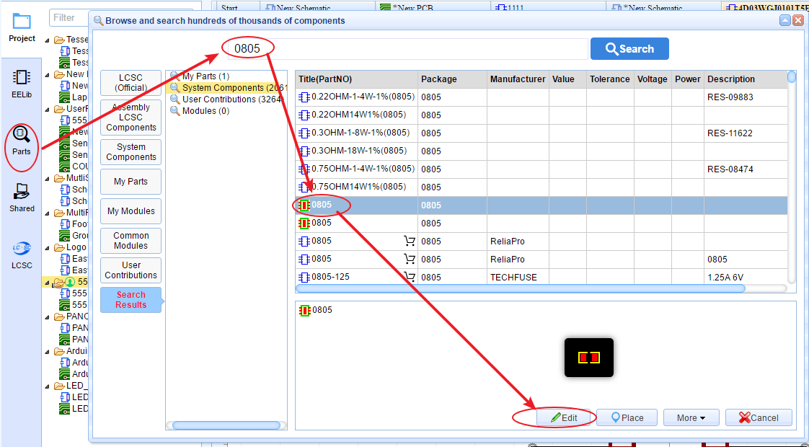

# Creating The PCB Libs

There will be times when you will need a PCB footprint that is not already in the EasyEDA libraries.  

The process of creating your own PCB Libs is very similar to how you make symbols for your own Schematic Libs.

You can start a new PCB lib as shown below:

## PCBLib Tools

PCBLib Tools almost are the same as PCB tools, just lacking some of the functions.

## Others 

1.  It is important to set the right Snap and Grid sizes to ensure that the pads on the finished footprint snap exactly to the grid and so connect the nets. For example, if you are creating a DIP package, set the Grid size to 100mil.

2.  Keep all other shapes such as component outlines and any associated pin identification marks or text on the TopSilkLayer. EasyEDA will automatically take care of the actual layer assignment when you place the footprint on the PCB.

3.  `CTRL+S` to save your footprint designs and you will find them saved into the **Parts > My Parts > Packages** section of the left Navigation panel. 

4.  Annular ring of the pad/via is too small, keep the annular ring >= 4mil. In this case, you can add a `Hole`  
  

## Edit PCBLibs

When you feel the PCB Libs(footprint) can not be satisfy for you, you can edit it.

Via **"Parts" > "Search Part/My Parts/LCSC Parts/System Components/User Contributions" > Select Package > Edit**

when you finish and save , it will be saved to your personal libraries "My Parts" and become your personal libraries.
​ 
And you can add a tag for your PCBLib:

**"Parts" > "My Parts" > Select Package > Right Click > Modify**

About the tag suggest that using as below:
Through-Hole:
	AXIAL: AXIAL-0.3 etc.
	RAD：Radial
	HEADER：Headers, connectors
	DIP：Dual-In-Line components
	SDIP：small dual in-line package
	SIP: single in-line package
	ZIP: zig-zag in-line package
	TO-92: Transistor Outline 92
	TO-220: Transistor Outline 220
Gull-wing：
	QFP,MQFP,PQFP: Quad Flat Pack
	TQFP：Thin Quad Flat Pack
	VQFP: Very Fine Quad Flat Pack
	PSOP: Plastic Small Outline Pack
	SOIC: Small Outline IC, narrow/wide
	VSSOP,SOIC: Miniature small Outline IC
	SOD123,SOD323,SOD523: Small Outline Diode
	SOT23,SOT223,SOT3X3,SOT523,SOT563: Small Outline Transistor
	TSOT,TSSOP: Thin Small Outline Package
	SSOP: Shrink Small Outline Package
	DFN,SON: Dual Flat No-lead
	QFN: Quad Flat No-lead
	TQFN: Thin Quad Flat No-lead
J-lead:
	SOJ: Small Outline IC, J-lead
	PLCC: Plastic Leaded Chip Carrier
	JLCC: J-Lead Chio Carrier
Other:
	SMD: Chip resister, Chip capacitor
	MELF: Metal Electrode Leadless
