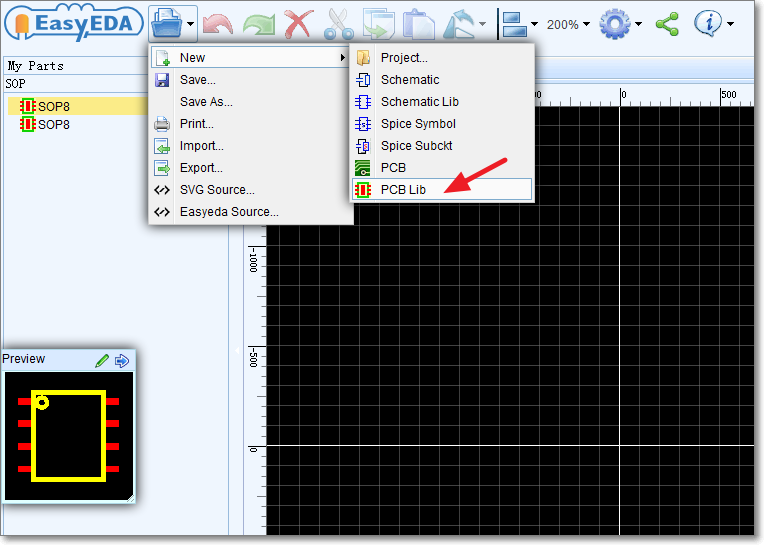
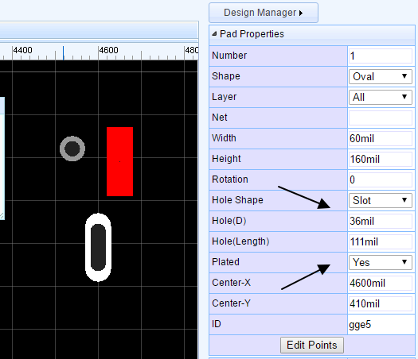
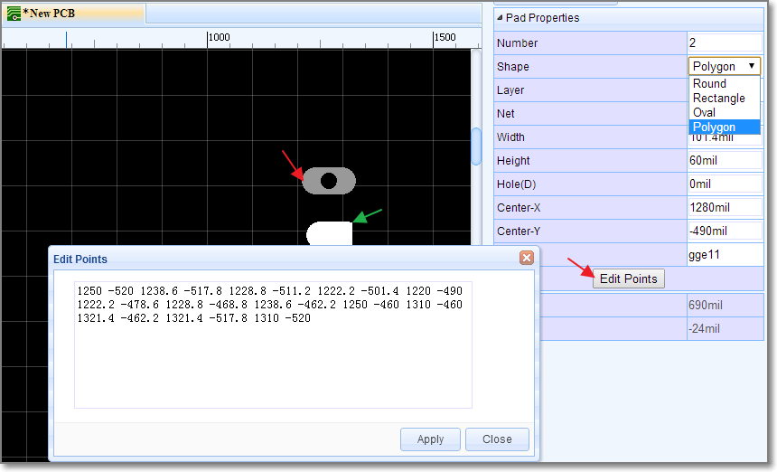

# Creating The PCB Libs

<iframe width="920" height="540" src="//www.youtube.com/embed/-SDbxVLjhNk" frameborder="0" allowfullscreen></iframe>
There will be times when you will need a PCB footprint that is not already in the EasyEDA libraries. The process of creating your own PCB Libs is very similar to how you make symbols for your own Schematic Libs.

You can start a new PCB lib as shown below:

## Pad 

You can add pads using the Pads button from the PCBLib Tools palette or using the `P` hotkey.

Selecting one of the pads, you can view and adjust it’s attributes in the right hand Properties panel.

**Number:** Remembering the pin numbers you set in the schematic symbol in your Schematic Lib: to connect those schematic symbol pins to the pads in your PCB footprint, the pad numbers you set here in the PCB Lib footprint must be the same.

**Shape:** Round or Rectanglular

**Layer:** If the pads are part of a **SMD** footprint, you can set it to **Top layer** or **Bottom layer**. For through hole components you should set it to **All**.

**Net:** You don’t need to enter anything here because at present this footprint is not connected to anything in a circuit.

Width and Height: When the shape is set to Round, Width will equal Height.
**
**Hole(D)**:  This is the drill hole **diameter** for a through hole pad. For a SMD Pad, set this to **zero**.

**Center-X and Center-Y:** using these two attributes, you can set the pad’s position with more precison, compared to using the mouse.
 
### New Pad shapes
EasyEDA supports two new shapes, `OVAL` and `POLYGON`, `OVAL` PAD will give your more space. `POLYGON` PAD will let you to create some strange pad, like bellow image, you can edit the PAD'S points when you select a `POLYGON` PAD
 
## Others 

1.  It is important to set the right Snap and Grid sizes to ensure that the pads on the finished footprint snap exactly to the grid and so connect the nets. For example, if you are creating a DIP package, set the Grid size to 100mil.

2.  Keep all other shapes such as component outlines and any associated pin identiifcation marks or text on the TopSilkLayer. EasyEDA will automatically take care of the actual layer assignment when you place the footprint on the PCB.

3.  CTRL+S to save your footprint design and you will find them saved into the My Parts section of the Navigation List. 

4.  Annular ring of the pad/via is too small, keep the annular ring >= 4mil. In this case, you can add a `Hole`
