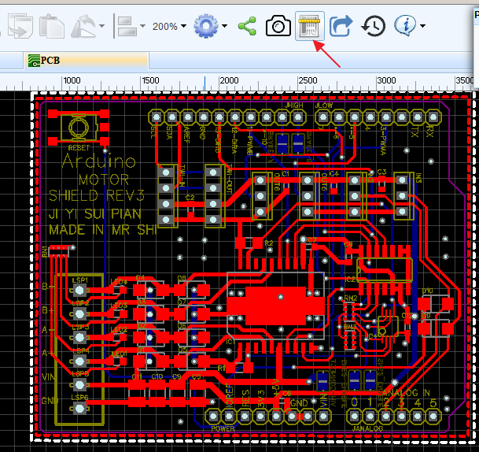
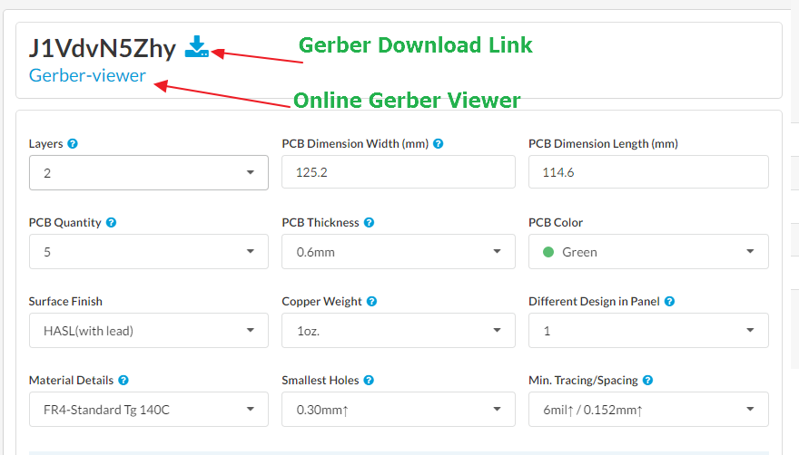
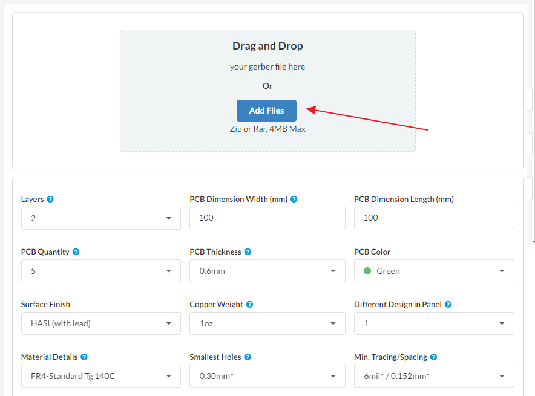
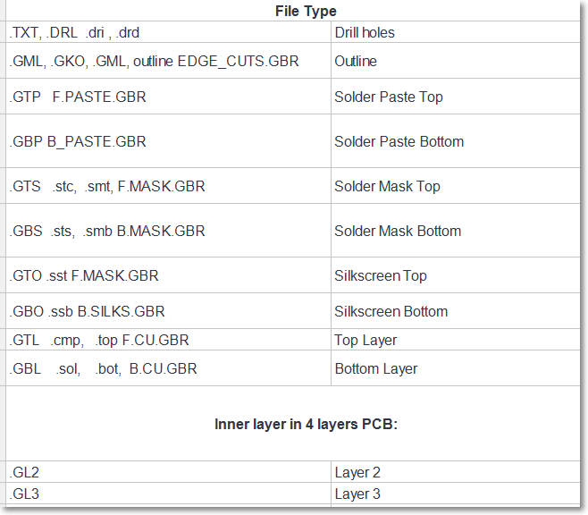
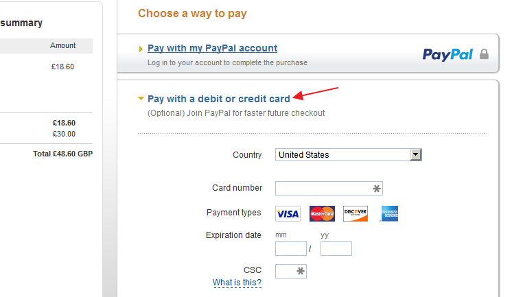

# PCB Order 
  After laying out your PCB, you probably want to order some **PCBs**. We have made it easy for you to save time and money by using our **awesome service** to order **low cost**, **high quality** PCBs *directly* from EasyEDA. More importantly, if you are not satisfied with the quality of our PCBs, EasyEDA will refund your money in full.

  Although EasyEDA makes it easy to order PCBs for your projects and offers an exceptionally low PCB Manufacturing fee, you are free to download the Gerber files and order your PCBs from any other vendor. However, if you like EasyEDA, please give us a chance to fab. the PCB for you. We think you won't be disappointed.

## PCB Quality
   As engineers, we have spent more than 6 years building EasyEDA. As artisans, we believe that if you like using our EDA tools, then you will like our PCBs. 

   EasyEDA's PCB are in a group buy model and all PCBs are given 100% E-test This allows us to provide you with good quality, tested PCBs at a great price. We have shipped thousands to our users, all of whom like our PCBs. 

 No matter how good we tell you our service is, maybe you still have doubts. The easy way to remove those doubts is to try it out because - as we have said above - if you are not satisfied with the quality of our PCBs, we will refund your money in full. For details of this offer, please check the [Warranty and Return](#WarrantyandReturn). 
 

## Order Button
To order PCBs from us, just click the **Fabrication Output...** button in the PCB Editor window, as shown in the image below, and you will be redirected to an order page. In that page you can place an order quickly and easily. At the same time, at the clcik of a button, you can check the Gerber and drill files in our Online Gerber Viewer and then download your files. Obviously, we hope that you will support EasyEDA by ordering your PCBs from us but you are welcome to download the Gerber and drill files and send them to your favorite PCB house.

## PCB Order from EasyEDA Editor
   When you click the `Fabrication Output...` button your order is coming from within the EasyEDA editor environment so you don't need to input information about **Layers**, **Width** and **Height**; EasyEDA fills this information in for you. 
   
   On the order form page you will find a real time price. Most of the time this price is the final cost however if, for example, you change the Layers to 4 or 6, you will find the price field changes to **Quote**. If that happens, don't worry: just click the `Save to Cart` button and we will email a quote for the final price to you ASAP. 

 **Note.** When you add your PCB to the cart, EasyEDA saves a copy of Gerber files *at that time*. If you then change your PCB back in the PCB editor, *EasyEDA does not synchronize your Gerber files to the updated PCB design*. The only way is to delete the earlier version of the PCB from your Cart and then add the updated design as a new item.
 
 

## PCB Order from Order Link
  If you would like to upload your own Gerber files from a third party PCB tool such as Eagle, Pads, or Altium Design. To do this, just click this link [https://easyeda.com/order](https://easyeda.com/order) to order. This page will let you upload your own Gerber Files.
 
 

## PCB Capabilities 

<table>
<tbody>
<tr>
<td width="200">Number of Copper Layers*</td>
<td width="400">1-16</td>
</tr>
<tr>
<td>PCB Material</td>
<td>FR-4, FR4-Tg, FR4-High Tg</td>
</tr>
<tr>
<td>Available Solder Mask Colors</td>
<td>Green, Red, Yellow, Blue, White, Black</td>
</tr>
<tr>
<td>Silk Screen Colors</td>
<td>White, Black (For White Solder Mask only)</td>
</tr>
<tr>
<td>Minimum Quantity</td>
<td>5</td>
</tr>
<tr>
<td>Minimum dimensions*</td>
<td>0.4cm x 0.4cm</td>
</tr>
<tr>
<td>Maximum dimensions*</td>
<td>100cm x 100cm</td>
</tr>
</tbody>
</table>

* If your PCB requires more than the default maximum of 6 layers (up to a maximum of 16) or larger dimensions, please contact us before placing your order
 
* If your PCB dimensions are bigger than 45cm * 45cm, maybe add a few addition cost  

## Manufacturing Specifications:
<table border="1" cellpadding="2" cellspacing="2">
<tbody>
<tr bgcolor="#ccc">
<td rowspan="2">Item</td>
<td colspan="3">Specs</td>
</tr>
<tr bgcolor="#ccc">
<td>Unit: mm</td>
<td>Unit: mil</td>
</tr>
<tr>
<td>Available Board Thickness</td>
<td>0.4, 0.6 (except 4 layer), 0.8, 1.0, 1.2, 1.6, 2.0</td>
<td>15.7, 23.6 (except 4 layer), 31.5, 39.4, 47.2, 63.0, 78.7</td>
</tr>
<tr>
<td>Thickness Tolerance</td>
<td>(t &gt;= 1.0) ± 10%</td>
<td>(t &gt;= 39.4) ± 10%</td>
</tr>
<tr>
<td>Thickness Tolerance</td>
<td>(t &lt; 1.0) ± 0.1%</td>
<td>(t &lt; 39.4) ± 0.1%</td>
</tr>
<tr>
<td>Insulation Layer Thickness</td>
<td>0.075 - 5.0</td>
<td>2.95 - 196.85</td>
</tr>
<tr>
<td>Minimum trace width</td>
<td>0.089</td>
<td>3.5</td>
</tr>
<tr>
<td>Minimum inner trace width </td>
<td>0.127</td>
<td>5</td>
</tr>
<tr>
<td>Minimum trace/vias/pads space</td>
<td>0.102</td>
<td>4</td>
</tr>
<tr>
<td>Minimum inner trace/vias/pads space </td>
<td>0.102</td>
<td>4</td>
</tr>
<tr>
<td>Minimum silkscreen width</td>
<td>0.1524</td>
<td>6</td>
</tr>
<tr>
<td>Minimum silkscreen text size</td>
<td>0.8128</td>
<td>32</td>
</tr>
<tr>
<td>Outer Layer Copper Thickness</td>
<td>&gt; 0.03</td>
<td>&gt; 1.18</td>
</tr>

<tr>
<td>Drilled Hole Diameter (Mechanical)</td>
<td>0.3 - 6.35</td>
<td>11.81 - 250.00</td>
<tr>
<td>Drilled Hole Diameter (Laser)</td>
<td>0.2 - 0.3</td>
<td>7.87 - 11.81</td>
</tr>

<tr>
<td>Diameter Tolerance (Mechanical)</td>
<td>	±0.08 </td>
<td>	± 3.148</td>

<tr>
<td>Solder Mask Bridges</td>
<td>0.1</td>
<td>3.94</td>
</tr>

<tr>
<td>Circuit to edge</td>
<td>≥0.3</td>
<td>≥11.8</td>
</tr>
<tr>
<td>Slot</td>
<td>≥0.6</td>
<td>≥23.6</td>
</tr>
<tr>
<td>Slot Tolerance(Mechanical)</td>
<td>±0.15</td>
<td>±6</td>
</tr>

<tr>
<td>Aspect Ratio</td>
<td colspan="2">8:1</td>
</tr>
<tr>
<td>Solder Mask Type</td>
<td colspan="2">Photosensitive ink</td>
</tr>
</tbody>
</table>

If you have any special PCB requirements, please contact us before placing your order. 

## Price

 All Prices stated are FOB Shenzhen. This does not include transportation costs which shall be borne by the customer. 
 
 
### Manufacturing Price

Price is dependant on many factors, such as the quantity of PCBs you order, PCB Color, Surface Finish, PCB Thickness, PCB Dimensions, Hole size etc. 

EasyEDA uses a group buy business model and we are sure it will be hard to find a better PCB suppler than EasyEDA offering the same price and quality.

EasyEDA needs 2~4 days to manufacture the PCBs after you submit payment.

### Shipping Costs
<table>
<tbody>
<tr bgcolor="#ccc">
<td width="50">Method</td>
<td width="300">note</td>
<td width="50">Price</td>
<td  >Service</td>
</tr>
<tr>
<td><strong>&nbsp;Air Mail</strong></td>
<td>&nbsp;Delivery Time: 8-35 days. Most of our users receive their PCBs in two weeks.</td>
<td>From $6</td>
<td >Usually  http://www.singpost.com/ </td>
</tr>
<tr>
<td>&nbsp;<strong>Express</strong></td>
<td>&nbsp;Delivery Time: 3-7 days</td>
<td>From $24</td>
<td >Usually delivered by http://www.DHL.com/ </td>
</tr>
<tr>
</tbody>
</table>
 
Note: The shipping cost is estimated. EasyEDA will always try to find the best shipping option.  If you are in some [Remote Areas](http://raslist.dhl.com/jsp/first.jsp), we will ask you to pay for more or change to some other express service such as Fedex, UPS. Sometimes, we will use [Hongkongpost](http://www.hongkongpost.hk/eng/index.htm) for delivery by Airmail.

## File Name
If your gerber files name are good, this will save us a lot of time in checking your design. 
There are many different PCB design software packages so there are many variations of gerber file names and filename extensions. 

Gerber Type

 
 
If you don't know how to map your files, don't worry about changing the file names please contact support for help.

**We encourage you to use our free online [gerber viewer](https://gerber-viewer.easyeda.com/) to check your gerber files before place an order.**

## E-Test
All PCBs undergo a 100% AOI (Automated Optical Inspection) to make sure that all tracks and pads are connected.
In addition to this the PCBs can be tested by a flying probe to make sure that all vias are connected, because this is not visible by the AOI. Single layer PCBs do not require this test because there are no vias but boards with 2 layers and above will always be 100% tested with a flying probe.

## Payment
We accept the PayPal, Credit Card and Wire Transfers. 

### PayPal and Credit Card
We use Paypal as our payment; it is safe and easy. If you don't have a Paypal account, you can still use Paypal to pay with a debit or credit card.

 

### Wire Transfers
Wire Transfers can only be used on orders with a grand total (subtotal plus all additions and deductions but excluding shipping fees) of at least $600. For orders > $2000, payment by Wire Transfer is preferred. In this circumstance, 3.5% extra discount will be applied for the grand total (subtotal plus all additions and deductions but excluding shipping fees). Wire Transfer payments usually take 3-5 business days to clear. We will not ship your order until your payment is verified by our bank. Please send a copy of the Wire Transfer receipt to our customer service because although it is not sufficient to release an order, it will help us to push the delivery date. 

## Customs, Duties and Taxes
You should expect to pay any amount charged by the government in your respective country. This includes but is not limited to: duties, taxes and any extra fees charged by the courier company. We will not be held responsible for any extra charges once the original package has been shipped. If the customer refuses to pay these extra charges, the return shipping and any additional fees will be taken out of the cost of the order, with any remaining funds being refunded to the customer.
Customs are quite different in each country. Please include information about particular Customs requirements as necessary, while you are placing your order: we will support you as much as possible. 

## Warranty and Return
For your first order for a PCB laid out in **EasyEDA**, we have the top return policy on the planet! If you don't like them, just send an email to 

, no reason needed. We will provide your full money back - including product + shipping costs - in one working day. 

For subsequent orders, because you now know the quality level of our PCBs, if you are not satisfied with a product you bought from us for whatever reason, you just need to email us some pictures of the product and explain why you are not happy with it. We will then refund the full money of the product. Shipping fees will only be refunded if the return is a result of a shipping error on our part. 

