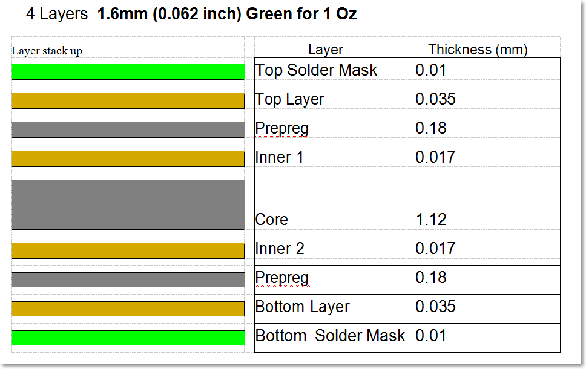
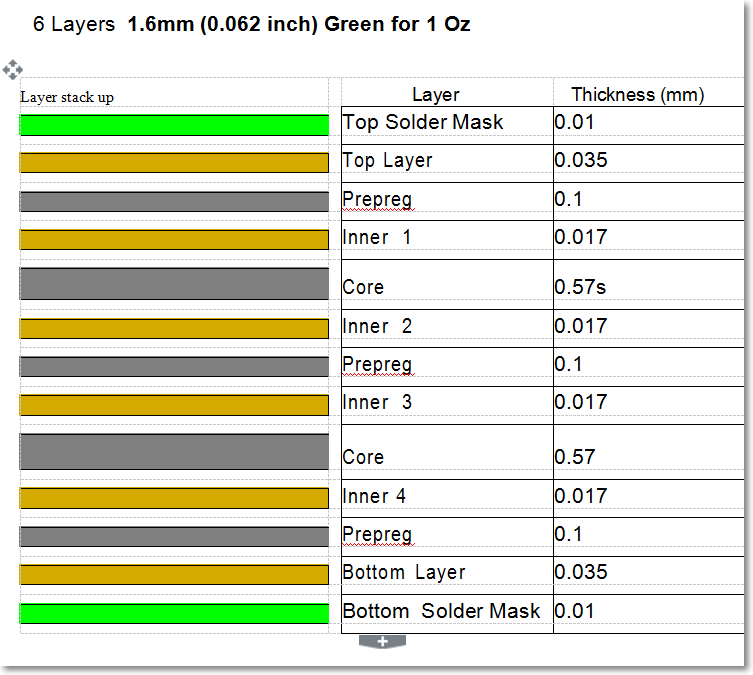
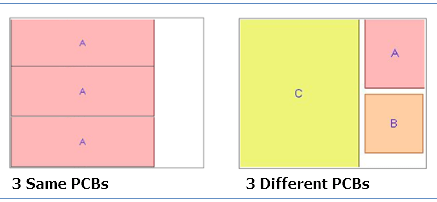
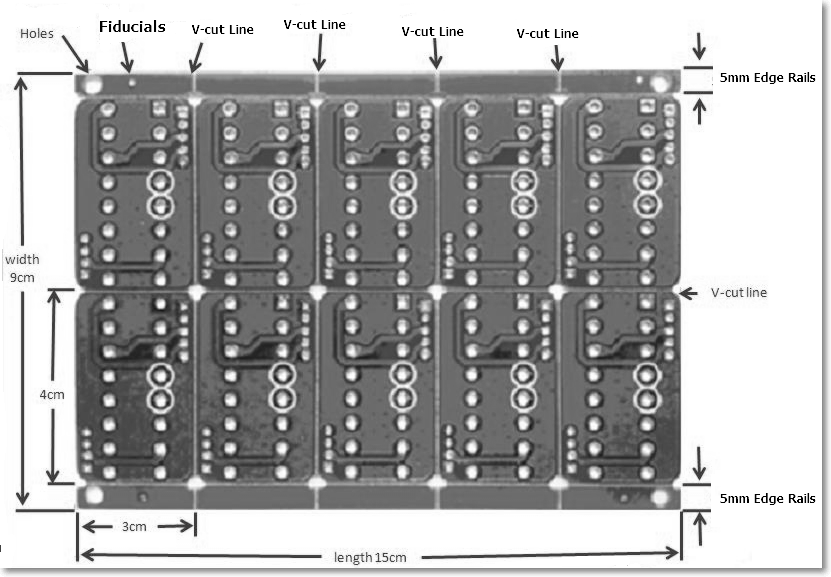
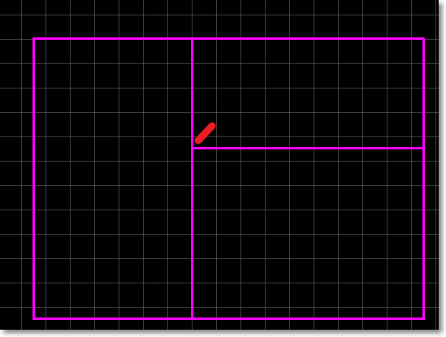
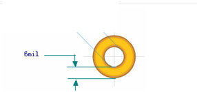
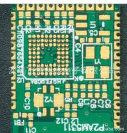
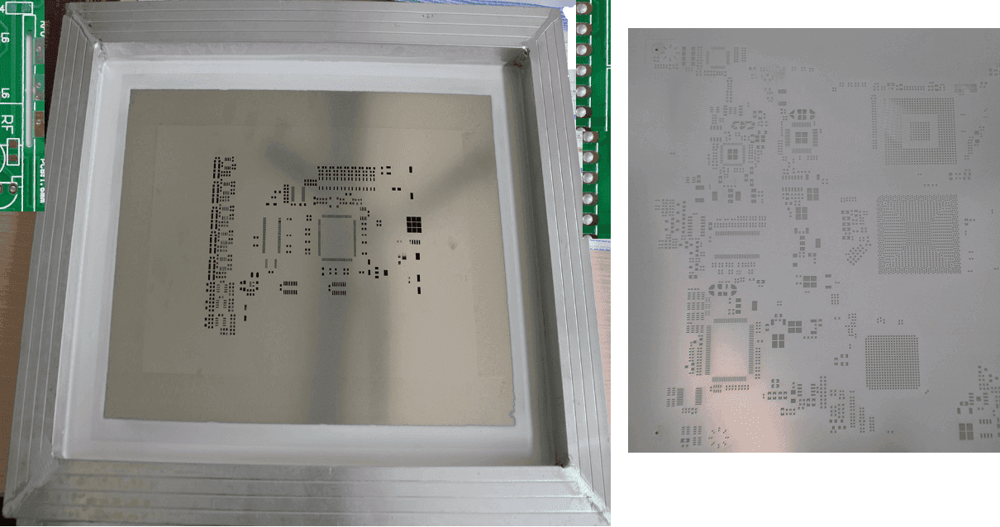

# PCB Parameter Description
##PCB Dimension
EasyEDA supports 100cm * 100cm, but we don't suggest our customers design a PCB's size more than 40cm, if the size bigger than 40cm, we may charge more cost, because it is hard to fabircate and need a bigger box to package.

##PCB Quantity
 EasyEDA uses a group buy model, so the price is very low, but the PCB number should be 5X. If you need 2 pcs, you need to order 5 pcs, if you need 7 pcs you need to order 10 pcs. 
 
##PCB Thickness
   EasyEDA PCB provides 0.4mm, 0.6mm, 0.8mm, 1.0mm, 1.2mm, 1.6mm, 2.0mm thickness for choose, if you need 2.5mm and 3mm, you can quote via email.  Please note the thickness can't be used for all layers, for example no PCB house can fabricate a 32 layers PCB in 0.4mm. 

##PCB Stack up
  ###2 Layers PCB stackup 1Oz
  
 

###2 Layers PCB stackup 2Oz
  

 ###4 Layers PCB stackup 1Oz
 

###4 Layers PCB stackup 2Oz
 

###6 Layers PCB stackup 1Oz
 

Other layers'  layer stack up, you would better to email to us before order.

##Copper Weight
  You can select 1oz, 2oz, 3oz in our order page, if you need some special coper weight, please quote via email, we can help you to fabricate from 0.5oz to 16oz.

##Different Design in Panel 
Some customers would like to merger more than 1 PCB in the same gerber, We know you want to save money, but this will make us **hard to cut the board outline**, more import this will spend us lot of time to pick up and package the PCB, you just have one order, but we will try to pick up more PCB. So we will charge some cost for this.  At the same time, using holes or slot are the same as boart outline. 
 Note: They should be diffirent PCBs, left image no need to add more money, they are easy to pick up, but the right should be charged more money.
   

If you just in prototype, and want to save money, you can use bellow ways, use slik layer to sepreate the PCBs, and cut it by your self after you get the PCB. Like the bellow PCB, the yellow lines are silk layers, you can merge 3 diffirent PCBs in one gerber and don't need to pay for more cost.

  

## V-cut/V-Groove
  
   This will help you to build PCB Array to save time to solde the PCB faster in SMT. 
   

  1.  The V-cut line should be same as the outline of the Sub-PCB. That is to say, it is zero space between the sub-boards.

  2.  The V-cut line should through the whole panel, or the factory can't add V-groove on the PCB, because the milling cutter may destroy the sub-PCBs on the V-cut line.

  3.  The PCB panel needs to be larger than 8*8cm.
  4.  The V-cut lines must be from one side to other side, can't stop. bellow v-cut lines are not OK.
   
   
     

##Material Details
  EasyEDA supports FR4-Standard Tg 140C, FR4-Tg 150C, FR4-High Tg 170C. The FR4 TG's lead time should be more than 6 days.

##Smallest Holes Diameter
   0.3mm for mechanical drill, 0.2mm for the laster drill. Please use 0.3mm to save money.

##Ring
 The vias or pads's ring should be bigger than 6mil/0.15mm
  

##Min. Tracing/Spacing
 We support 4mil, but you would better to use 6mil to save money. 
  

##Impedance Control
 support 5% and 10% precision, Do add enough information to help you to fabricate your PCB.

##Gold Fingers
If you built some PCBs like memory card, you need to use Gold Fingers like bellow image
  

##Half-cut/Castellated Holes
If you need to build some PCBs like bellow image, you need to choose Half-cut holes.

##Panel by EasyEDA
 When your gerber is just one panel, and need EasyEDA to help you to panel to many copy, you can use this option.
   You can choose the how many rows and how many cols like bellow image.

For this image, we will merge 10 small PCB to 1 big, if you order 5 pcs, then we will send  5 big panels to you, you will get 50 small pcs.

If you select the Edge rails, we will add a 5mm board edge for you like bellow image.
This is 2 rows and 5 cols panel PCB.

 

# Stencil Parameter Description
Stencil can help you to solder the PCB quickly, the SMT must use stencil.
EasyEDA provides NON-FRAMEWORK and  FRAMEWORK stencil.
Right image is frameless stencil, it is cheaper and low weight(0.2Kg), can help you to save the shipping cost.
  

 

