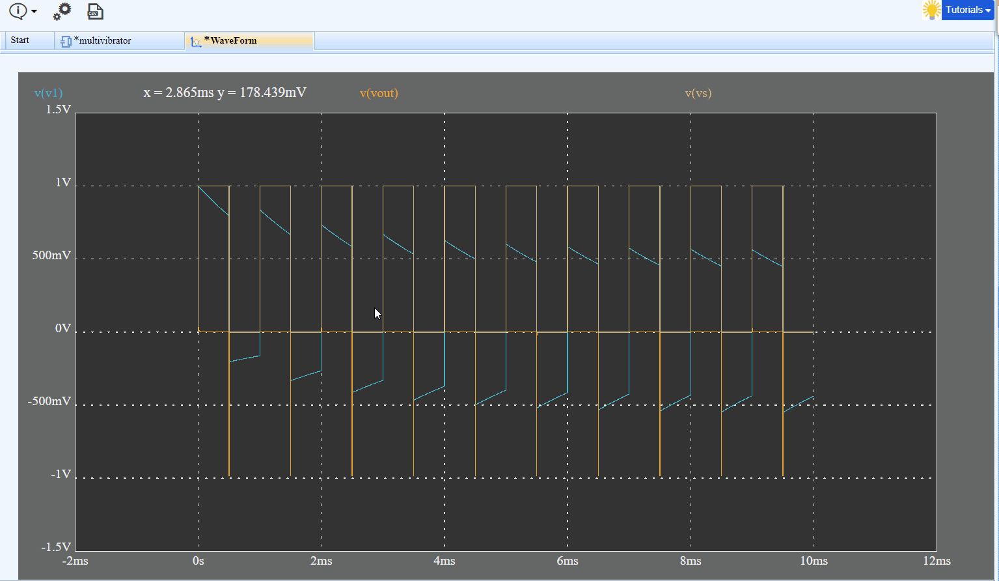
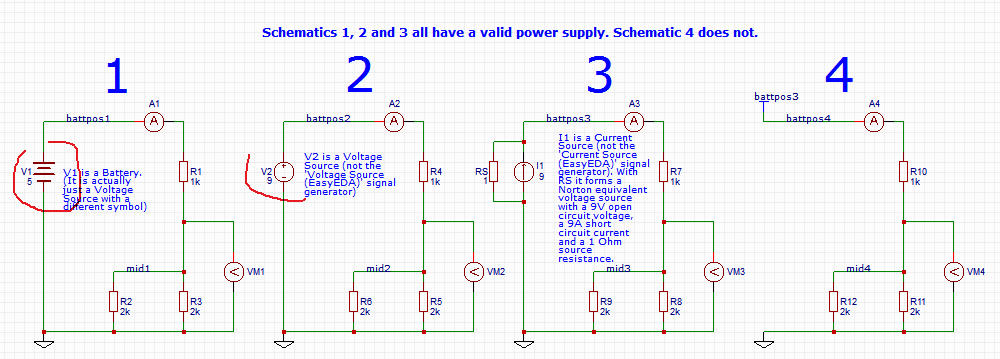
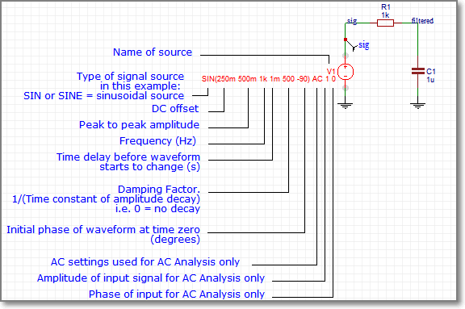
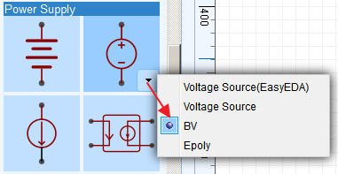

# Simulation

## Spice Simulation

### Build the circuit 

To simulate your circuit, at least until you become more familiar with the idea and concepts of simulation, first you should build a circuit as described in the chapter on **Creating The Schematic.**

The circuit below is the **simulation schematic** for the **Astable Multivibrator LED project**:

Now, to make your circuit simulatable, you should note that:

1.  You do not have to draw the whole schematic again from scratch. You can `CTRL+C` copy the schematic you have already drawn for the PCB layout and `CTRL+SHIFT+V` paste it into a new schematic canvas and then save it into a new Project folder (with maybe the same name but with “simulation copy” or something added to the end to avoid the Design Manager flagging up duplicates or you accidentally editing the original);

2.  You should then remove anything from the schematic that you do not want to include in the simulation. Connectors and mechanical items such as heatsinks and often manually operated switches can be removed. (Although there are situations where these items may need to be included in the simulation; that is getting off the topic and into advanced simulation territory so we will leave it there for the moment…)

3.  You may want to replace a simple battery or - to simplify the simulation, reduce the size of the simulation output file and reduce the simulation time, a complicated power supply - with a simple spice V voltage source. You will almost certainly need to add some sort of voltage or current signal input source such as a simple SIN or PULSE source or maybe something more complex such as the EasyEDA electret microphone model, a guitar pickup model, a photodiode or an optoisolator. If you are simulating a power supply or a power amplifier of some sort, you may also need to add a representative load of some sort. Unless you are specifically simulating the effects of wiring impedances for Power Integrity, you can usually omit any power supply decoupling capacitors hung directly off the supply rails: they have no effect, clutter up the circuit, generate lots of useless output data and add to the simulation time;

4.  Your circuits **must** have a **GND** net. You can use a NetLabel or NetFlag to add one. You can call this net GND or 0 (the numeral zero);

5.  You should use the Schematic Design Manager to help verify that your circuits are wired correctly. It can be hard to debug wiring errors from the Simulation Results... dialog error messages;

6.  As you draw a schematic, EasyEDA assigns default net names to all the wires. Any section of wires that are joined will be assigned the same net name. This is how EasyEDA “knows” that those wires are joined together.

These default net names are usually of the form N001, N002, etc.

Adding NetLabels to name nets (wires or nodes) which you would like to observe (probe) makes it much easier to identify traces when the simulator shows them in WaveForm. Remember that in any circuit, you may want to probe the voltages on nets other than the obvious Input or Output nodes that may be the nets you first think you will want to probe.

### Probing voltages and currents

To probe voltages, you can add some Voltage Probes which can be found in the Wiring Tools palette. These will appear on your schematic auto-numbered as volProbe1, volprobe2, etc.

When you place a voltage probe onto a net, the name you give the voltage probe will overwrite any name that is already assigned to that net. So if you place a voltage probe called foo on a net call bar, that net is renamed to foo.

Therefore it is strongly recommended that you change the name of the voltage probe to be identical to the name of the net onto which you then place that probe (except for the letter case which is ignored).

If this net name is used somewhere else in the simulation - for example in an expression for an arbitrary source - then it is possible that the voltage probe name overwriting the net name will break the expression and so the simulation will give unexpected results or throw errors. Giving voltage probes identical names to their target nets avoids this problem.

It is also recommended that you name all nets because if you have used an EasyEDA-assigned default net name in an expression then, if you edit the schematic, say to insert an extra resistor or a current probe, then EasyEDA will reassign the default net names to different nets. This breaks the expression and so the simulation will give unexpected results or throw errors.

To probe the current in a wire you can place an instance of the Ammeter component, from the EasyEDA Libs, in series with the wire.

For an alternative method of probing voltages on nets and currents through the EasyEDA Ammeter component, see [Probe](#h.tqz4ifmtwxqz).

### Checking models and subckts

You then need to check that all the devices in the simulation schematic have the necessary and the correct spice models and/or subckts.

Missing spice models and subckts will be indicated in the Simulation Results… dialog after attempting to run a simulation but it is much easier to do this before you try to run a simulation.

Simple components such as resistors, capacitors and inductors do not pull models into the netlist because their models are built-in to Ngspice at a very low level but almost all other components will pull in either a .model statement or a set of line enclosed in the .subckt … .ends spice keywords.

By looking at the spice netlist that is generated as a simulation schematic is being created,

**Super menu > Miscellaneous > Netlist for Document > Spice…**

or

**Super menu > Miscellaneous > Netlist for Project > Spice...**

it is easier to check that each component in the schematic has pulled into the netlist an associated .model statement or .subckt … .ends block of lines.

In the astable example spice netlist below, Q1 - Q4 are 2N3904 devices which all pull in - and share - the .model 2N3904 statement.

Similarly, D1 - D3 are the same LED device and pull in the shared .model LED statement.

Astable Multivibrator simulation copy

	.param pi = 3.141593
	V1 VBUS GND  5
	R7 D3A VBUS  1k
	R6 D2A Q4E  1k
	R5 Q3C VBUS  10k
	R4 Q3B VBUS  100k
	R3 Q2B VBUS  100k
	R2 Q2C VBUS  10k
	R1 D1A Q1E  1k
	Q4 VBUS Q3C Q4E 2N3904
	Q3 Q3C Q3B GND 2N3904
	Q2 Q2C Q2B GND 2N3904
	Q1 VBUS Q2C Q1E 2N3904
	D3 D3A GND LED
	D2 D2A GND LED
	D1 D1A GND LED
	C3 GND VBUS  10u
	C2 Q2B Q3C  10u
	C1 Q2C Q3B  10u 
	
	 
	.MODEL 2N3904 npn
	+IS=1.26532e-10 BF=206.302 NF=1.5 VAF=1000
	+IKF=0.0272221 ISE=2.30771e-09 NE=3.31052 BR=20.6302
	+NR=2.89609 VAR=9.39809 IKR=0.272221 ISC=2.30771e-09
	+NC=1.9876 RB=5.8376 IRB=50.3624 RBM=0.634251
	+RE=0.0001 RC=2.65711 XTB=0.1 XTI=1
	+EG=1.05 CJE=4.64214e-12 VJE=0.4 MJE=0.256227
	+TF=4.19578e-10 XTF=0.906167 VTF=8.75418 ITF=0.0105823
	+CJC=3.76961e-12 VJC=0.4 MJC=0.238109 XCJC=0.8
	+FC=0.512134 CJS=0 VJS=0.75 MJS=0.5
	+TR=6.82023e-08 PTF=0 KF=0 AF=1
	.MODEL LED D
	+ IS=661.43E-24
	+ N=1.6455
	+ RS=4.8592
	.control
	probe V(D1A) V(D2A) V(Q2C) V(Q3C)
	quit
	.endc
	.END

In fact the astable example circuit has no elements defined by subcircuits but the principle is the same as for .model statements.

The example below of a simple 555 timer based monostable, includes a .model statement for a type of 2N7002 MOSFET and a subcircuit for the 555 timer which in turn, calls up .model statements for the bipolar transistors, QN and QP and the diode DA that are used within the subcircuit.

It is quite possible to call one subcircuit from within another subcircuit but let's not get too carried away just yet ...
  555 monostable

	.param pi = 3.141593
	XU1 GND XU1_2 OUT VCC XU1_5 XU1_6 XU1_6 VCC 555
	VGATE GATE GND  PULSE(0 9 0 10u 10u 10m 300m) AC 0
	VBATT VCC GND  9
	R4 XU1_2 VCC  2k
	R1 XU1_6 VCC  100k
	M1 XU1_2 GATE GND GND DI_2N7002K 
	C4 VCC GND  1u
	C2 XU1_5 GND  10n
	C1 XU1_6 GND  1u
	*****************************************
	* Bipolar 555 timer model
	**
	* Rfix added to stop V(out) exceeding V(vcc)
	* with no external load on OUTPUT pin.
	**
	* Last edited 140111
	**
	*           GND
	*           |  TRIGGER
	*           |  |  OUTPUT
	*           |  |  |  RESET  
	*           |  |  |  |  CONTROL
	*           |  |  |  |  | THRESHOLD
	*           |  |  |  |  |  |  DISCHARGE  
	*           |  |  |  |  |  |  | VCC
	*           |  |  |  |  |  |  | |
	.SUBCKT 555 34 32 30 19 23 33 1 21
	**
	Q4 25 2 3 QP
	Q5 34 6 3 QP
	Q6 6 6 8 QP
	R1 9 21 4.7K
	R2 3 21 830
	R3 8 21 4.7K
	Q7 2 33 5 QN
	Q8 2 5 17 QN
	Q9 6 4 17 QN
	Q10 6 23 4 QN
	Q11 12 20 10 QP
	R4 10 21 1K
	Q12 22 11 12 QP
	Q13 14 13 12 QP
	Q14 34 32 11 QP
	Q15 14 18 13 QP
	R5 14 34 100K
	R6 22 34 100K
	R7 17 34 10K
	Q16 1 15 34 QN
	Q17 15 19 31 QP
	R8 18 23 5K
	R9 18 34 5K
	R10 21 23 5K
	Q18 27 20 21 QP
	Q19 20 20 21 QP
	R11 20 31 5K
	D1 31 24 DA
	Q20 24 25 34 QN
	Q21 25 22 34 QN
	Q22 27 24 34 QN
	R12 25 27 4.7K
	R13 21 29 6.8K
	Q23 21 29 28 QN
	Q24 29 27 16 QN
	Q25 30 26 34 QN
	Q26 21 28 30 QN
	D2 30 29 DA
	R14 16 15 100
	R15 16 26 220
	R16 16 34 4.7K
	R17 28 30 3.9K
	Rfix 30 0 1G
	Q3 2 2 9 QP
	.MODEL DA D (RS=40 IS=1.0E-14 CJO=1PF)
	.MODEL QP PNP (level=1 BF=20 BR=0.02 RC=4 RB=25 IS=1.0E-14 VA=50 NE=2)
	+ CJE=12.4P VJE=1.1 MJE=.5 CJC=4.02P VJC=.3 MJC=.3 TF=229P TR=159N)
	.MODEL QN NPN (level=1 IS=5.07F NF=1 BF=100 VAF=161 IKF=30M ISE=3.9P NE=2
	+ BR=4 NR=1 VAR=16 IKR=45M RE=1.03 RB=4.12 RC=.412 XTB=1.5
	+ CJE=12.4P VJE=1.1 MJE=.5 CJC=4.02P VJC=.3 MJC=.3 TF=229P TR=959P)
	.ENDS
	*SRC=2N7002K;DI_2N7002K;MOSFETs N;Enh;60.0V 0.300A 2.00ohms  Diodes Inc. MOSFET
	.MODEL DI_2N7002K  NMOS( LEVEL=1 VTO=2.50 KP=32.0m  GAMMA=3.10
	+ PHI=.75  LAMBDA=104u RD=0.280 RS=0.280
	+ IS=150f  PB=0.800 MJ=0.460 CBD=98.8p
	+ CBS=119p  CGSO=60.0n CGDO=50.0n CGBO=390n  )
	*   -- Assumes default L=100U W=100U --
	.control
	tran 500u 500m
	probe V(GATE) V(OUT)
	quit
	.endc
	.END 

 Whoa! I thought this was supposed to be easy?

At this stage you might be forgiven for feeling a sense of panic at the sudden complexity of what should be a simple job of checking that all the symbols in your simulation schematic have the necessary and correct models associated with them.

Well, to quote the Hitchhikers Guide to the Galaxy:

Don't Panic!

All you have to do is check that every different type of device - not every instance - in your simulation schematic has a corresponding .model or .subckt statement associated with it.

If it hasn't then the first thing to check is that you have got all the device names right.

If you still haven't pulled in a .model or a .subckt then it probably means that a simulation model for that device is not available in the EasyEDA libraries. This may be because we haven't been able to find a copyright unrestricted model, we haven't had time to build our own or we just haven't caught up with entering all the thousands of possible models yet …

If you're desperate then EasyEDA gives you several ways that you can include third party models in your simulation but more of that later.

If you're really desperate then if you ask us nicely we just might find or even build one for you. Please see the section on [How to get help?](./Introduction.htm#How-to-get-help)

Once you are satisfied that you have done everything to pull in the right models then you can save and then run the simulation, but don't worry, EasyEDA will still tell you if you have made any mistakes in the Simulation Results.. dialog. It's just that until you are familiar with using simulation it really is easier if you do the checking before your run a simulation because the error reporting from Ngspice may include warnings and error messages about other things besides just missing models and that can make it very confusing for beginners.

### Run Simulation

Your schematic is ready, so now you can run it. **SuperMenu > Miscellaneous > Simulation > Run The...**

**Run the Document**: Just for the active schematic, you can also open this dialog using the `CTRL+R` hotkeys.

**Run the Project**: EasyEDA will merge all the schematics in the project to one, and simulate them.

EasyEDA provides the following simulation analyses:

-   Transient: the time domain response of the circuit;
-   AC Analysis: the frequency domain response of the circuit (including an experimental FFT);
-   DC sweep: the DC response of the circuit as a voltage or current source or a component or parameter is swept between user specified limits; 
-   DC Transfer: computes the DC small-signal value of a transfer function (ratio of output variable to input source), input resistance, and output resistance of the circuit;
-   DC op simulation: computes the dc operating point of the circuit with inductors shorted and capacitors opened.

For more information about these analyses, please refer to:

[http://ngspice.sourceforge.net/docs/ngspice-manual.pdf#subsection.1.2.1](http://ngspice.sourceforge.net/docs/ngspice-manual.pdf#subsection.1.2.1)

[http://ngspice.sourceforge.net/docs/ngspice-manual.pdf#subsection.1.2.2](http://ngspice.sourceforge.net/docs/ngspice-manual.pdf#subsection.1.2.2)

[http://ngspice.sourceforge.net/docs/ngspice-manual.pdf#subsection.1.2.3](http://ngspice.sourceforge.net/docs/ngspice-manual.pdf#subsection.1.2.3)

Please note that although using Ngspice for it's simulation engine, at present (140218) EasyEDA does not support all the possible analysis modes available in Ngspice.

Note that for transient simulations, at present (140218):

the maximum value of (Stop Time-Start Time)/(Maximum Timestep) = 1000

See also [CTRL+R to Run Simulation Immediately](#h.ew7ltgf338o)

### WaveForm

EasyEDA's WaveForm display is super easy but to make sure you don't miss any of the features it supports, we've put some detailed information into this tutorial.

Transient, AC Analysis and DC Sweep simulation results are shown in the WaveForm trace viewer.

After you run a spice simulation which should plot some traces, EasyEDA will automatically open a WaveForm tab like the image below.

The Waveform window width and height, trace, grid and background colours and the placement of traces in up to three panes can all be configured using the WaveForm Config dialog. To open the WaveForm Config dialog, click the Config button on the toolbar above the Waveform window.

WaveForm allows the display of traces in any selection of up to three vertically stacked plot panes. The Y axes automatically scale to fit the units and the range of the traces being displayed. Traces can be hidden but at least one trace must be visible.

X and Y trace data can be seen on-screen just by moving the mouse cursor around the plot area of a pane with the readout adapting to the Y axes in each pane.

Delta X and delta Y trace data can be seen on-screen using a Left-Click and Drag select box, with the readout adapting to the Y axes in each pane. Returning the cursor to within a small radius of the starting point of the select box -without releasing the Left-Click - returns the readout to X and Y trace data.

Left-Click, Drag and then releasing the Left-Click zooms all plots, synchronised across all panes, horizontally. Double clicking anywhere in the WaveForm window resets the zoom.

Vertical plot zoom is not supported but traces are dynamically autoscaled to fit the available pane height as the horizontal zoom is changed.

The window can moved around within the EasyEDA window using the horizontal and vertical scroll bars or using Right-Click and Drag.

WaveForm plot data can be exported in CSV format for further analysis and manipulation in external programs such as LibreOffice Calc, Scilab or Excel, however a particular feature of EasyEDA is that the WaveForm window can not only be saved in an EasyEDA Project but that the plots in a saved WaveForm window can be viewed and manipulated in exactly the same way as when they first appear as a result of a simulation. This makes it easy to compare the results from several simulations.  

Once saved in a Project, a WaveForm window can be exported as a .pdf, .png or .svg file into your browser window. This can then be saved to your device so it is easy to create professional quality documentation.

### Build Your Own Simulation Component

There are several reasons why you may want to build your own simulation component.

-   You may have downloaded a spice model in text form for a device for which EasyEDA has no symbol;
-   Perhaps you have designed a simulation schematic of a circuit for which there is no readily available spice model and you need to create your own symbol for it;
-   You have a subckt for a device and EasyEDA already has a symbol for it but you want to use your subckt in place of the one already attached to the EasyEDA symbol.

EasyEDA gives you three ways to build your own components so that you can simulate them:

#### 1.From a model in text form 

1.  If you already have a spice subcircuit in text form, for example one that you have downloaded from a component manufacturer's website but you haven't got a spice symbol for it, then you can create a spice symbol and attach a .subckt definition to it.

2.  First make a note of the exact name given in the .subckt line. Spice names are case insensitive but can only be made up from alphabetical, numeric and underscore characters.

	For example: LM741EE_demo would be a valid name and would be seen as identical to lm741ee\_Demo but **LM741EE-demo** and **LM741EE~demo** are **invalid** names because they contain invalid characters.
	
	In this example we shall assume that you have a .subckt with the name: *Demo\_Spice\_Symbol*

3.  Next, create your symbol.

	You need to do this using:

	**Document > New > Spice Symbol...** instead of: **Document > New > Schematic Lib...**

	because that option does not support attaching a spice model to a schematic symbol.

	Using **Document > New > Spice Symbol…** also automatically sets the Spice Prefix of the symbol to X which is essential for a .subckt definition to attach to your symbol.

	Remember that the Spice Pin names assigned to the symbol **must** be numbered in the same order that they appear in the .subckt. So, if there are four pins named A, B, C and D in the order 1, 2, 3 and 4 in the subckt, then the corresponding pins on the symbol must be in the same number order. They don't have to have the same names: you could have symbol pins named; fish, go, moo and banana but if they correspond, in the same order, to the .subckt names A, B, C and D then they must be numbered as: 

	  

4.	You are now ready to attach your subcircuit to the symbol by opening the attached this spice symbol with subckt dialog using:

	**Super menu > Miscellaneous > Edit Subckt...**

	and then pasting the .subckt definition that you wish to use into the Subckt string: text area.

	 

5.  Click OK and save the symbol but remember: the symbol name must be identical to the name of the subckt:

	**.SUBCKT Demo\_Spice\_Symbol A B C D**

6.  Lastly, add your new spice symbol to a schematic and run a simulation.

	 

7.  If you run a DC op simulation on this example, the result, shown in the Simulation Results... window, should be 2.5V

#### 2.From a subcircuit in schematic form

1. Create a spice symbol and subckt circuit.

2. The same as (1) above, create a spice symbol.

3. Next create a spice subckt as a schematic:

	**Document > New > Spice Subckt...**

	 

	Draw the schematic that you want EasyEDA to turn into a subckt and attach to your symbol.

	To connect your simulation schematic to your symbol there must be a net in the circuit that is to be attached to each pin of the symbol. Each of these connecting nets in your circuit must have the same name as that of the symbol pin to which it connects. For example if your symbol has four pins called A, B, C and D then your simulation schematic must have exactly four connecting nets; one called A, one called B, one called C and one called D.

	To attach these nets in the schematic to the pins in the symbol you must name them using NetPort from the Wiring Tools palette.

	**Do not use NetLabel or NetFlag.**

	NetPort is used to distinguish those subckt nets that are to connect to symbol pins from all other nets named using EasyEDA default net names and those added using NetLabel or NetFlag.  

4. Save your spice subckt with exactly the same name as your spice symbol.

	   

5. Lastly, add your new spice symbol to a schematic the same as in (1) above and run a simulation.  

6. If you run a DC op simulation on this example, the result, shown in the Simulation Results... window, should be 2.5V.  

 

#### 3.From a spice directive in a schematic

1.  When you already have a spice symbol which has a subckt attached to it - for example, an opamp symbol from the EasyEDA Libs - but you want to use a subckt for a different device which is not already in the EasyEDA Libs, then you can use this method to easily attach a subckt to a symbol directly in your schematic.  

2.  Paste your .subckt text into the schematic.

3.  Next, select the pasted text and, in the right hand Properties panel, change the Text type from comment to spice. This will create a spice directive which the simulator will then incorporate into the spice netlist.
4.  Next, select the symbol and, either directly in the symbol or in the right hand Properties panel, edit the Model text to exactly the same name as in your pasted subckt.
5.  Check that the Spice pin order of the symbol matches that of the pasted .subckt and edit it if necessary (not all subckts for a given type of device use the same Spice Pin order!).
6.  Save your schematic and then you can run your simulation.

	

#### 4.Using .models instead of .subckts

1. All three techniques can be used to attach .model statements to symbols in exactly the same way as .subckts but after placing the symbol in your schematic, you must use:

	**Super menu > Miscellaneous > Edit Symbol...**
	to set the symbol's Spice Prefix to the appropriate letter for the device model you are using.

2. You also have to know the spice pin order for the type of .model statement you are using because, unlike .subckts, the .model statement does not show this explicitly.

	The Spice Prefixes and Spice Pin names and orders for the most commonly used devices for which you may want to use different models are listed below:

	

Actually there is a way to save the symbol with the required Spice Prefix so that you don't have to edit it every time you place a new instance of the symbol into a schematic … but that needs a bit more insight into editing the EasyEDA Source for the symbol so will be left for the moment.

We did say that EasyEDA Source enables some powerful ways to manipulate schematic and spice files and symbols! :)

### Advance Tips

EasyEDA uses [Ngspice](http://ngspice.sourceforge.net/presentation.html) as the simulation engine, so once you get more familiar with it you can use many [other commands and feature](http://ngspice.sourceforge.net/docs/ngspice-manual.pdf)[s of Ngspice](http://ngspice.sourceforge.net/docs/ngspice-manual.pdf) that are not directly available via the EasyEDA UI.

The lists below show which Ngspice commands are currently supported by EasyEDA and which are not.

#### Ngspice Commands Whitelist

EasyEDA allows these commands:

let define option options unlet op tf tran pss ac dc pz sens disto noise fft fourier meas alter run while repeat dowhile foreach if else end break continue label goto linearize print probe echo

#### Ngspice Commands Blacklist

EasyEDA does not currently allow these Ngspice commands:

reshape snsave snload circbyline alias deftype display destroy setplot setcirc setscale transpose xgraph gnuplot wrdata wrs2p hardcopy asciiplot write compose print eprint codemodel load cross undefine listing edit dump psd spec show showmod sysinfo altermod resume state stop trace save iplot altermod status delete step remcirc reset aspice jobs rspice bug where newhelp tutorial help oldhelp removecirc quit source shift unset unalias history shell rusage cd version diff rehash cdump mdump mrdump settype strcmp devhelp inventory source

#### Probe

An alternative to using the volProbe element to probe voltages in a circuit - which avoids the possibility described in [Probing voltages and currents](#h.vl7fdqh8iyf8) of overwriting net names and consequently corrupting any expressions that use them - is to use the Probe command.

For example, to probe the voltages on two nets named in and out all you have to do is enter this text into the schematic:

Probe V(out) V(in)

and then, in the Properties panel, set the Text type to spice to set it to be included in the spice netlist as a spice directive.

You can also use the Probe command to probe a current in your circuit.

To measure the current in a wire you insert an Ammeter, from the EasyEDA Libs, in series with the wire you wish to probe. EasyEDA then inserts a small subckt comprising a 0V, zero resistance, voltage source in series with the wire and then probes the current in that voltage source. Hence although an ammeter in an EasyEDA schematic is shown with an A prefix, it is spice netlisted with an X prefix (for a subckt call) followed by V (for the voltage source).

For example, to add the current in an Ammeter, named A_load_current1, to the command probing the two voltage probes above, you would change the Probe command in your schematic to:

`Probe V(out) V(in) I(XVA_load_current1)`

It is also possible to use expressions in a Probe command. In the example above, if we assume that V(out) is connected directly to a grounded load then, to plot the power dissipation of the load, you can add this expression:

`V(out)*I(XVA_load_current1)`

the Probe command list:

`Probe V(out) V(in) I(XVA_load_current1) V(out)*I(XVA_load_current1)`

Note that your probe list can be as long as you like but all entries in a Probe command list must be entered as a single line of text with no returns.

A useful feature allowing you to easily switch between different sets of probe points is that any number of Probe commands, each with their own list of probe points, can be included in a schematic by setting the Text type of only one at a time to spice and setting all others to comment.

But this is just the tip of the iceberg ...

#### Using CTRL+R to Run Simulation Immediately

As described in [Run Simulation](#h.omum7qtdqc2), using:

`CTRL+R`

will open the

Run the Document

or

Run the Project

simulation control dialog.

That approach is a great way for you to quickly and easily set up and Run any of the most commonly used simulation analyses types but EasyEDA gives you a way to harness the real power of **Ngspice**.

Simply by entering your simulation control commands as text, directly into the schematic and setting the Text type to spice, you can set up powerful spice analyses. You can run these straight away, without needing the Run your simulation dialog just using the `CTRL+R` hotkeys.

Using this method it's quick and easy to create and run more advanced simulation analyses and to make automated measurements on your circuit.

Here's a quick insight into how it works but you can skip this if you like and just get into how to make this amazing feature work for you!

EasyEDA automatically embeds the simulation commands set up in the Run your simulation dialogs within a control section. You can see this in the spice netlist for any circuit that has been through a simulation run at least once via:

**Simulate > Simulation Results… > Download netlist**

The control section starts with the .control command and ends with the .endc command. All commands between these delimiters are run in an Ngspice interactive simulation control mode.

Now, you don't need to worry about these two commands because EasyEDA automatically inserts them in the netlist in the right place to enclose your commands so all you need to do is to enter a list of commands as text, anywhere in the schematic canvas and then, in the Properties panel, set the Text type to spice for it to be included in the spice netlist as a **spice directive**.

The following examples show some of the things you can do using **spice directives**.

--------------------------------------------
Run a **transient simulation** with the following parameters:

**Maximum Timestep**: 10u
**Stop time**: 11ms
**Start Time**: 1ms

just add this text anywhere on the schematic canvas:

	tran 1u 11m 1m

set Text type to **spice** 

then type:

`CTRL+R`

--------------------------------

Run an **AC Analysis** with the following parameters:

**Type of Sweep**: Decade

**Number of points**: 100 (per decade)

**Start Frequency**: 1k

**Stop Frequency**: 1Meg

just add this text anywhere on the schematic canvas:

	ac dec 100 1k 1Meg

set Text type to **spice** 

then type:

`CTRL+R`

------------------------------------
Run a **DC Sweep** with the following parameters:

(And, yes, you can sweep component values, not just sources!)

**Source to Sweep**: R1  

**Start Value**: 1k

**Stop Value**: 2k

**Increment**: 100

just add this text anywhere on the schematic canvas:

	dc R1 1k 2k 100

set Text type to **spice** 

then type:

`CTRL+R`

--------------------------------------------
A couple of more advanced examples:

Run a **Fourier** analysis:

	tran 2u 2m 0
	fourier 1K V(volOut)
	run
	probe V(volOut)  

set Text type to spice 

then type:

`CTRL+R`

---------------------------------------
For more information on Fourier Ngspice, see:

[http://ngspice.sourceforge.net/docs/ngspice-manual.pdf#subsection.17.5.24](http://cs/ngspice-manual.pdf#subsection.17.5.24)

Run an **FFT** analysis:

	tran .1m 2s 0
	run
	linearize
	fft v(out)
	probe db(mag(v(out)))

set Text type to spice 

then type:

`CTRL+R`

For more information on **FFT** in Ngspice, see:

[http://ngspice.sourceforge.net/docs/ngspice-manual.pdf#subsection.17.5.25](http://ngspice.sourceforge.net/docs/ngspice-manual.pdf#subsection.17.5.25)

----------------------------------------
Run a DC op pnt analysis and Print the power in the load into the Simulation results window:

	op
	print V(out)*I(XVA_load_current1)

set Text type to spice 

then type:

`CTRL+R`

-------------------------------
Measure the gain and 3dB bandwidth of an amplifier. 

This prints the gain and bandwidth values of this x1 and x10 amplifier example:

[https://easyeda.com/file_view_Find-gain-and-bandwidth_8GE0KRFDn.htm](https://easyeda.com/file_view_Find-gain-and-bandwidth_8GE0KRFDn.htm)

 in the Simulation Results… window:

	* This is a control block.
	* Note: variables in a control block must start with
	* a letter.
	 
	* Set up an AC analysis:
	 
	ac dec 100 1k 10Meg
	 
	* Define a 3dB value:
	 
	let neg3dB = 20*log10(sqrt(2)/2)
	 
	* Convert the outputs of both amplifiers into dB:
	 
	let x1gain_dB = DB(v(x1Avcl))
	let x10gain_dB = DB(v(x10Avcl))
	 
	* Find the low frequency gain of each amplifier
	* (look at the Bode plots in WaveForm and choose
	* a frequency where the gain is level; i.e. well
	* below any possible hf gain peaking):
	 
	meas ac x1_lfgain_dB find x1gain_dB at=1k
	meas ac x10_lfgain_dB find x10gain_dB at=1k
	 
	* Subtract 3dB from the lf gains to find
	* a value 3dB down from the lf gain:
	 
	let x1_3dBdown = x1_lfgain_dB + neg3dB
	let x10_3dBdown = x10_lfgain_dB + neg3dB
	 
	* Find the frequencies at which the outputs
	* are 3dB down from the lf gains:
	 
	meas ac x1_f3dB when x1gain_dB = x1_3dBdown
	meas ac x10_f3dB when x10gain_dB = x10_3dBdown

set Text type to spice 

then type:

`CTRL+R`

For more information on the meas statement, see:

[http://ngspice.sourceforge.net/docs/ngspice-manual.pdf#subsection.17.5.37](http://ngspice.sourceforge.net/docs/ngspice-manual.pdf#subsection.17.5.37)

## Simulation eBook 

### Introduction

EasyEDA is not just a way to draw circuit diagrams and design PCBs. It is also a circuit simulator.

A circuit simulator is basically a specialised mathematical program, optimised to construct and then solve the equations that define the behaviour of the circuit that has been described to it in the circuit diagram.

The circuit simulation program that EasyEDA uses is called ngspice. Ngspice is Free and Open Source Software (FOSS) that is in turn based on a simulator called SPICE that was originally written by Larry Nagel.

#### What this book is for

This book is an introduction to circuit simulation in EasyEDA using ngspice.

It starts with the basics of how to avoid some of the most common mistakes that cause simulations to fail and then goes on to illustrate how to set up a circuit so that it will simulate successfully and produce meaningful results. It also discusses some aspects of understanding how, what might at first appear to be unexpected or even nonsensical results, can arise.

The book then introduces and illustrates more advanced techniques such as:

*   probing signals such as voltages, currents, powers and resistances;

*   configuring signal sources;

*   setting up different types of analyses;

*   making measurements such as rise times, RMS values and bandwidths;

*   defining component values using parameters;

*   using expressions to calculate component values such as for a resistor to draw a given load current or capacitances for a specified filter cutoff frequency;

*   using manufacturer's device models;

*   setting up complex simulations including arbitrary voltage and current sources.

#### What this book is not for

*   This is not a book about learning to use EasyEDA to draw schematics. For general information about using EasyEDA please refer to the [EasyEDA Tutorial](https://easyeda.com/Doc/Tutorial/);

*   This book does not teach electronics. Whilst there may be examples of circuits and explanatory text that are helpful in understanding electronics, it is assumed that the user already has sufficient knowledge of electronics to understand the content of this book.* Although ngspice is similar to other variants of spice and a lot of the information and techniques in this book may be applicable to some of those variants, this book is written specifically about circuit simulation in EasyEDA using ngspice.

*   Except where necessary to help explain some aspect of the behaviour of simulation, this book does not go into any detail of how circuit simulation in general and ngspice in particular actually works. For more information about those areas, please see the links below:

More information about Larry Nagel and SPICE is available from here:

[http://www.omega-enterprises.net/The%20Origins%20of%20SPICE.html](http://www.omega-enterprises.net/The%20Origins%20of%20SPICE.html)

Larry Nagel's PhD Dissertation:

Laurence W. Nagel., &#8220;SPICE2: A Computer Program to Simulate Semiconductor Circuits,&#8221;

Memorandum No. ERL-M520, University of California, Berkeley, May 1975.

[http://www.eecs.berkeley.edu/Pubs/TechRpts/1975/ERL-520.pdf](http://www.eecs.berkeley.edu/Pubs/TechRpts/1975/ERL-520.pdf)

is actually very readable and instructive.

For more information about electronic circuit simulation and spice in particular, see:

[http://en.wikipedia.org/wiki/Electronic_circuit_simulation](http://en.wikipedia.org/wiki/Electronic_circuit_simulation)

and:

[http://en.wikipedia.org/wiki/SPICE](http://en.wikipedia.org/wiki/SPICE)

More information about ngpsice is available from here:

[http://ngspice.sourceforge.net/presentation.html](http://ngspice.sourceforge.net/presentation.html)

#### Who this book is for

All simulation tools and how they interact with schematic capture tools are different so even for people with experience of using simulation tools, it is worth at least skimming through the sections of this book to get an idea of where to find information if things don't seem to go quite as planned.

However, for people with limited or no previous experience of using simulation tools, this book is essential reading.

Why?

Because, as a newcomer to the world of circuit simulation, it is very tempting just to launch straight into trying to build and run lots of interesting and exciting simulations.

Sadly, however, this will almost certainly be a very frustrating and discouraging experience because many of those simulations will either not run, will not function correctly as circuits or will appear to give nonsensical results! This can happen for all sorts of very simple reasons but to newcomers with no experience of simulation, those reasons can seem utterly incomprehensible.

So, to avoid a lot of discouragement and wasted time, it is worth taking a few minutes to understand some of the most common things that can cause a simulation to fail or to run but give unexpected answers.

#### How the book is structured

This book is not some dry tome with lots of words, diagrams and snippets of code. It is written as a live, interactive document. Rather than having to read lots of text and then having to go into EasyEDA to create circuits to try things out, live simulation examples are embedded directly into the text to illustrate the points being discussed.

Just go to a topic or a section heading; read a couple of paragraphs and then open and run the embedded simulation to see exactly what the text is about.

Every embedded simulation must be saved before it can be run. Users who have joined EasyEDA can save the files to their own project folder. Non-registered users can save the files to Anonymous Files. In either case, examples can be copied and edited so that users can try out different things in whatever way helps their understanding of what the example is trying to explain, building up their own personal library of teaching examples as they progress through the book.

Newcomers are encouraged to work through the book in a linear manner because each section builds on the knowledge and insights gained from all the previous ones. Skipping sections leaves gaps that can catch out the novice and hinder understanding ideas presented in later sections.

*   The book begins by introducing some of the concepts and terms that are essential for a basic understanding of what a simulator is and how to use it effectively.
*   Then, using simple interactive simulation examples it describes and illustrates how to avoid the most common pitfalls in building, running and interpreting the results from simulations.

*   The book goes on to illustrate ways to create and show connectivity using wires and netlabels in schematics. It then discusses techniques for probing voltages and currents and how they relate to and can affect or be affected by the netnames that are assigned to nets either automatically by EasyEDA or manually by the user placing netlabels.

*   More advanced techniques for probing voltages and currents using the 'probe' command are described, moving on to using this command to measure power dissipations, resistances and conductances.

This section describes the use of 0V sources to measure currents also introduces and E,F, G and H dependent sources and the very powerful arbitrary or B Dependent Sources.

In this section, the concept of the 'Spice Directive' is also introduced, describing how to turn inactive 'comment' text into active 'spice' text that the simulator then recognises as an instruction to do something.

*   The 'probe' concept is then extended by describing how several different 'probe' commands can be typed into a schematic and - simply by selecting which one is switched from being 'comment' text into 'spice' text - they can be used to swap between different selections of values and nodes to be probed.

*   The use of the 'let' command to further extend and simplify the probing of signals is introduced with a simple example. This command will feature heavily in later sections about making measurements based on the results of simulations.

*   Early interactive simulation examples introduce the basic way of setting up and running a simulation using the green running man 'Simulate...' icon (the Green Man) via the 'Run the Document...' option to open the 'Run your simulation' dialogue and then select the type of analysis to run.

*   Later examples show how to use the CTRL+R Hotkey as a shortcut to the 'Run your simulation' dialogue.

This idea is then extended with the concept of using 'spice directives' to run simulations straight from the CTRL+R Hotkey so that, with a few simple key strokes, it is easy to switch between several different simulations from a single simulation schematic.

*   DC operating point, DC Transfer function, DC Sweep, AC (frequency domain) and Transient (time domain) Analyses are described in some detail.

Using the DC Sweep to sweep the value of a resistance in a circuit and to sweep the ambient temperature for circuit is covered in this section.

There are detailed sections on setting up each of the various time

domain signal sources that are available, such as SINE, PULSE and more.

Configuring and using the frequency domain AC source that is built into to every independent signal source is covered.

*   The need for and different ways of defining initial conditions such as voltages on nets and across capacitors and currents in inductors are demonstrated.

Using PULSE, EXP, PWL and B Sources to 'kick start' circuits is also illustrated in this section.

*   The concept of using parameters (i.e. variables that are used in the simulation) to define things like multiple component values and signal source settings is described.

*   The use of parameters in expressions (i.e. formulas or equations) to calculate values such as the capacitance for a given RC time constant with a given resistance is covered and then extended into using them in B Sources.

*   The concept of predefined functions and their use in expressions is described in detail extending into the creation of user defined functions using the .func statement.

*   The concept and scope of device models in simulation is discussed in detail.

*   Ways to add 3rd party models and subcircuits into schematics and to use them with the predefined schematic symbols from the EasyEDA Libs is covered in detail.

*   The use of 3rd party models is extended into attaching them to custom schematic symbols.

*   The use of expressions and functions in the creation of custom behavioural models is covered with reference to some of the in-house EasyEDA (EE suffix) models.

### Introductory concepts of Spice simulation

For every circuit being simulated, EasyEDA converts the schematic into a textual description of the circuit that is then passed to the simulator.

This textual description of the circuit is called a **spice netlist.**

*   Note that the spice netlist is not the same as the netlist that is generated from a schematic and which is then passed though to PCB layout.

The netlist is a list of all the components used, how they are connected together and descriptions of them, called **models**, so that the simulator knows the behaviour of each component is to be simulated. The netlist also includes instructions to the simulator, called **spice directives**, to tell it what type of **analysis** is to be run. It may also include lists of values, called **parameters**, that are to be used to directly define component values or as part of more extensive calculations, called **expressions**.

Just like real ones, circuits to simulated require power sources and often signal sources. Therefore the netlist will include any **voltage sources** and **current sources**. These can be **Independent Sources** or **Dependent Sources**. Independent Sources just generate DC voltages or currents or can generate time domain signals such as sinusoids and pulses or they can generate a signal of a given amplitude and phase for frequency domain simulations (in fact they can be configured to generate all three but that will be covered later). Dependent Sources can also be used to generate DC voltages or currents but their main use is to generate outputs that are **functions** of that other signals in the circuit, for example by using an expression to describe the output of a source as a current that is equal to the sum of the squares of two input voltages.

The netlists of more advanced simulations can include instructions, called **measure statements**, to the simulator to perform calculations on the results of the simulation itself, for example to measure the rise time of a pulse, the RMS value of a signal or the 3dB bandwidth of a filter circuit.

### About naming conventions

Before going any further it is important to understand the naming conventions used throughout this book and throughout all the simulations

Fields on a line are separated by one or more blanks, a comma, an equal (=) sign, or a left or right parenthesis; extra spaces are ignored. A line may be continued by entering a "+" (plus) in column 1 of the following line; ngspice continues reading beginning with column 2. A name field must begin with a letter (A through Z) and cannot contain any delimiters. A number field may be an integer field (12, -44), a floating point field (3.14159), either an integer or floating point number followed by an integer exponent (1e-14, 2.65e3), or either an integer or a floating point number followed by one of the following scale factors:
<table border="1" cellspacing="0"><colgroup span="3" width="85"></colgroup><tbody><tr><td align="left">Suffix</td><td align="left">Name</td><td align="left">Factor</td></tr><tr><td align="left">T</td><td align="left">Tera</td><td align="left">1e12</td></tr><tr><td align="left">G</td><td align="left">Giga</td><td align="left">1e9</td></tr><tr><td align="left">Meg</td><td align="left">Mega</td><td align="left">1e6</td></tr><tr><td align="left">K</td><td align="left">Kilo</td><td align="left">1e3</td></tr><tr><td align="left">mil</td><td align="left">Mil</td><td align="left">25.4×1e-6</td></tr><tr><td align="left">m</td><td align="left">milli</td><td align="left">1e-3</td></tr><tr><td align="left">u</td><td align="left">micro</td><td align="left">1e-6</td></tr><tr><td align="left">n</td><td align="left">nano</td><td align="left">1e-9</td></tr><tr><td align="left">p</td><td align="left">pico</td><td align="left">1e-12</td></tr><tr><td align="left">f</td><td align="left">femto</td><td align="left">1e-15</td></tr></tbody></table>

Letters immediately following a number that are not scale factors are ignored, and letters immediately following a scale factor are ignored. Hence, 10, 10V, 10Volts, and 10Hz all represent the same number, and M, MA, MSec, and MMhos all represent the same scale factor. Note that 1000, 1000.0, 1000Hz, 1e3, 1.0e3, 1kHz, and 1k all represent the same number. Note that M or m denote 'milli', i.e. 1e?3

*   The suffix Meg MUST to be used for 1e6

Node names are case insensitive.

Node names may either be plain numbers or arbitrary character strings, not starting with a number.

The ground node must be named "0" (zero). For compatibility reasons "gnd" is accepted as the ground node and will internally be treated as a global node and be converted to "0".

Note the difference in ngspice where the nodes are treated as character strings and not evaluated as numbers, thus "0" and "00" are distinct nodes in ngspice (whereas they are not in SPICE2).

Ngspice and therefore, EasyEDA, requires that the following topological constraints are satisfied:

*   Each circuit has to have a ground node (gnd or 0)!
*   The circuit cannot contain a loop of voltage sources and/or inductors and cannot contain a cut-set (series connected set) of current sources and/or capacitors.
*   Each node in the circuit must have a dc path to ground.
*   Every node must have at least two connections except for transmission line nodes (to permit unterminated transmission lines) and MOSFET substrate nodes (which have two internal connections anyway).

These constraints will be covered in more detail later,

### Introduction to using a simulator

Using a simulator is not quite the same as building a real circuit. There are many things that can catch out the newcomer to simulation because neither real world nor most simulator components are ideal. The departures from ideal are often different between the two and if these differences between real and simulated components in a circuit are not clearly understood, they can lead to confusion when the results of a even a simple simulation are different from those expected.

Part of the problem is that a user's expectations are informed by experience of real world measurements. Therefore, it is important to understand exactly what measurements are being made and how the simulation circuit will affect the results. In cases where there are differences between real and simulated results this may also require a deeper understanding ofwhat is going on in those circuits and what assumptions are being made - often unconsciously - about them.

Learning to use a simulator means thinking more about what the real world really looks like, how it differs from the theoretical world of textbook problems and simple diagrammatic circuit representations and therefore what the results of measurements are likely to be.

#### Avoiding common mistakes

The following section describes and illustrates some of the most common mistakes, misunderstandings and causes for confusion.

##### Prefix conflict error

This error message will appear:

If:

There are two copies of the same schematic in the same project folder: CctA and Copy\_of\_CctA.

In this case, the component prefixes (reference designators) will be the same in both CctA and Copy\_of\_CctA.

Or:

There are two different schematics in the same project folder, CctA and CctB but there are some components in CctB that have the same prefixes as in CctA.

Then:

If a simulation run is attempted using:

**Green Man > Run the Project**

then EasyEDA will try to merge all the schematics in the Project into a single schematic and then run a simulation on that big schematic.

This will fail because EasyEDA will find repeated instances of components with the same prefix.

Else:

if you try to run a simulation using:

**Green Man > Run the Document**

or:

**CTRL+R**

then EasyEDA will run a simulation only on the schematic in the current active tab in the editor window (if you have only one schematic open then it will run that one but if you have more than one schematic open then it will run only the one in the selected tab).

If you have given a unique prefix to every component in that selected sheet then this simulation will run because EasyEDA will find only single instances of every component in the schematic.

##### All simulation circuits MUST have a ground node

A feature of the way simulators work is that they MUST have a ground node (also referred to as the 0 net) somewhere in the circuit. All voltages probed in the circuit, unless explicitly probed as voltage differences are then measured with respect to that ground node. The ground node can be placed anywhere in the circuit that is convenient for the purposes of the simulation but it must exist somewhere in that circuit.

SIMULATION SCHEMATICS THAT DO NOT HAVE A GROUND NODE WILL NOT RUN.

This is illustrated in the following two examples:

With no ground symbol, the simulation will not run:

[All simulation schematics MUST have a ground 01](https://easyeda.com/editor#id=y20YWvRPp)

Once any of the available ground symbols is added, the simulation will run:

[All simulation schematics MUST have a ground 02](https://easyeda.com/editor#id=4WUSQNLJ5)

##### All simulation circuits MUST have a power and/or signal source

In exactly the same way that a real circuit must have some sort of power supply - even if that power supply is actually the signal source itself (for example, a crystal set or a volume control potentiometer) or comes from a capacitor pre-charged to some voltage or an inductor pre-charged to some current prior switching the circuit on - a simulation schematic must have a power and/or a signal source or an initial condition such as a capacitor pre-charged to some voltage or an inductor pre-charged to some current prior to the start of the simulation.

Power supplies can be built from ideal zero series resistance voltage sources. Simple but more realstic models of battery and voltage regulator supplies can be built using voltage sources with some series resistance or current sources with a parallel resistance (i.e. Thevenin or Norton equivalent sources).

EasyEDA provides a wide range of signal sources. These will be covered in detail in their own section on Sources but the basic use of some of these sources to provide power to a circuit is illustrated below:

[All simulation schematics MUST have a power supply too](https://easyeda.com/editor#id=4ke8qIZTb)

##### Every point in a simulation schematic MUST have a DC path to ground

Unlike real circuits, every point in a simulation schematic MUST have a DC path to ground (or 0 net). Attempting to run a simulation with a node that has no DC path to ground will fail with errors.

Before discussing the significance of the DC path to ground, however, it is essential to look at some of the basic components and sources that are used in almost all simulations and to understand how they affect these DC paths.

##### Values and DC paths of RLC components

This section is about the values of - and DC paths through - resistors, inductors and capacitors.

*   Inductors in ngspice have zero series resistance (i.e. ESR = 0).

 * Therefore, inductors have a DC path through them.
    
 * Inductors in ngspice have no parasitic parallel capacitance or resistance.

*   Capacitors in ngspice have no parasitic parallel conductance (i.e. they have an infinite DC resistance).
 *   Therefore capacitors in ngspice do not have a DC path.
 
 * Capacitors in ngspice have zero series resistance (i.e. ESR = 0).
 *  Capacitors in ngspice have no parasitic series inductance (i.e. ESL = 0).

*   Inductors and capacitors in ngspice can be set to positive and to negative values and to zero. Beware that setting a component to a negative value may cause the circuit connected to them to exhibit instability or oscillation. This in turn may cause the simulation to fail.

*   Resistors obviously have a DC path through them.
*   Resistors in ngspice can be set to positive and to negative values but cannot be set to exactly zero: they MUST have a non-zero value. Setting a resistance to zero will cause the simulation run to fail with an error. This is basically because any voltage difference across a zero resistance (such as may occur normally in a circuit or even just as a consequence of numerical "noise" in the simulation calculations) will generate an infinite current, which will obviously crash out of the top end of the simulators calculation dynamic range. This applies to all resistors in ngspice, including the Ron and Roff values in switches and resistances given in device models.
    Beware that setting a resistor to a negative value may cause the circuit connected to it to exhibit instability or oscillation. This in turn may cause the simulation to fail.
*   A common cause of confusion in simulation is the apparently unexpected behaviour of circuits using open circuit switches.
    Just like switches in the real world, switches in EasyEDA have non-zero ON resistances (Ron). They also have finite OFF resistances (Roff). If an EasyEDA switch is connected in series with a voltage source into an open circuit load (such as presented by a VolProbe) then the voltage at the output of the switch will be equal to the open circuit voltage of the voltage source whether the switch is open or closed. This is different from the real world experience because in a real circuit, the voltage would be measured with a voltmeter or an oscilloscope probe having a much lower resistance than the open circuit resistance of the switch.  
    To illustrate this, let’s take a simple example of a switch connected in series with an ideal voltage source set to 1V and then measure the V(Output) of the switch when open and closed.  
    With the switch closed the expected output is V(Output) = 1V.  
    And that’s what the simulation shows.  
    OK. With the switch open the expected output is V(Output) = 0V.  
    What the simulation actually shows is V(Output) = 1V.  
    What’s that all about? Surely the switch must not be simulating properly and is stuck closed?  
    Well, no actually; the switch and voltage are doing exactly what they should. It’s just that these results are unexpected  because there's a misunderstandingabout how the simulated circuit differs from a real circuit.  
    No real switch has an infinite OFF state resistance but similarly, there is no such thing as a real open circuit that presents an infinite load impedance.  
    The Voltage and Current Controlled Switches and the Static Switches in EasyEDA are not ideal: they all have a finite OFF resistance. For the voltage and current controlled switches, the OFF resistances are specified by the user editable R(off)(Ω) parameter in the right hand Properties panel with a default value of 1GΩ. The Static Switches have a fixed 10GΩ OFF resistance. In either case these resistances are large but certainly not infinite.  
    However, the effective resistance to ground at the Output node using a Volprobe or plot expression, really is infinite. Therefore when operating into an infinite resistance load there would be no difference between the ON and OFF state voltages at the Output node.  
    Note that if a load resistance of 1GΩ were to be connected from the Output node to ground, then there would be a clear ON/OFF state difference.  
    This is illustrated in the following simulation:    
    [EasyEDA switches are not ideal](https://easyeda.com/editor#id=0MEe2PNZp)  
    Some further examples of the effects of finite switch resistances are illustrated in this next simulation:  
    [Effects of finite switch resistances](https://easyeda.com/editor#id=Ba4mEWewq)  
    Note that, in ngspice, the Ron and Roff values used in switches can be set such that Ron > Roff. This is a useful way to invert the logic sense of a switch.  
    At this point it is worth noting that if it is important that the simulation results are as close as possible to those expected to be observed when probing a real circuit using real test equipment, it is sometimes useful to place a realistic load on wires (nets) in the simulation schematic where voltage measurements are to be made in the real circuit. Similarly for current measurements, realistic ammeter insertion impedances should be connected in series with the wire. To avoid unnecessary loading of the simulated circuit however, only place such loads in the locations where external measurement devices are to be connected to the real circuit and only in the same numbers as there are measurement instruments being used at the same time. For example, if there are two oscilloscope probes connected to a circuit but one of them is moved around, only connect loads representing simulated oscilloscope probes to two places in the simulated circuit. If different places need to be probed then move the simulated probes and rerun the simulation.  

##### DC paths through Voltage and Current Sources

This section is about the DC paths through Voltage and Current Sources.

*   Voltage sources in ngspice (including independent V and dependent B and E voltage sources) have zero source resistance and have no current limit. The output voltage will be constant for any load current. This is true when sourcing or sinking current. sinking. This is not the same behaviour as regulated and current limited bench power supplies set to give a constant voltage output. Except for specialised supplies such as Source Measure Units, bench supplies can usually only source currents for positive outputs or sink currents for negative output voltages, up to some current limit set by the user.
    *   Voltage Sources in ngspice therefore have a DC path through them.  
    As a consequence of their zero source resistance, in the same way that damagingly high currents will flow if real batteries are connected in parallel without some resistance between them, voltage sources in simulation schematics cannot be connected in parallel without some resistance in series between them. This is true even if they are set to exactly the same voltage. Attempting to do so will cause the simulation run to fail with an error.  
    Similarly, in the same way that damagingly high currents will flow if an inductor is connected directly across a real power supply without some resistance between them, inductors in simulation schematics cannot be connected directly in parallel with voltage sources without some resistance in series between them.  Attempting to do so will cause the simulation run to fail with an error.

*   Current sources in ngspice (including independent I and dependent B and F sources) have an infinite source resistance and have no voltage limit. The output current will be constant for any load impedance and voltage across the current source. This is not the same behaviour as regulated and current limited bench power supplies when they are set to give a constant current output. Except for specialised supplies such as Source Measure Units, bench supplies can usually only source currents up to some maximum positive voltage at the output or sink currents down to some minimum negative voltage at the output, as set by the user.
*  Current Sources in ngspice therefore do not have a DC path through them.    

As a consequence of their generating a constant current through an infinite source resistance, in the same way that damagingly high voltages can be generated if two real current sources are connected in series without some finite resistance across each source, current sources in simulation cannot be connected in series without some finite resistance connected in parallel with each source. Attempting to do so will cause the simulation run to fail with an error.

*   In simulation, connecting a capacitor in parallel with a current source generating a current, I, without also connecting a resistor, R, in parallel, will cause the voltage on the capacitor to ramp towards infinity. Even with the resistor in parallel, the voltage will ramp to I*R which may still be a large voltage. If such a circuit exists in a simulation schematic then, unless it is shorted out by a switch with some suitably low value resistance or set to some initial voltage, the voltage across the capacitor will already have ramped towards infinity at time t=0, i.e. as the simulation starts. This can lead to unexpectedly high voltages right from the start of a simulation.

##### The effects of adding DC paths

This section is about creating DC paths and some of the effects they can have.

*   A favourite of elementary electrical engineering classes and an example of a very tricky problem to solve using a simulator is a circuit that has two capacitors in series. This must have a DC path to ground from the common point between the two caps but the path to ground does not have to be direct. It can be via other elements in a circuit. For example if one end of one of the capacitors is connected to ground with the other end of the other capacitor connected directly to a grounded voltage source or to a Thevenin Source (a voltage source in series with a resistance) or to a Norton Source (a current source in parallel with a resistance) then placing a single high value resistor in parallel with either of the capacitors or simply from the junction of the two capacitors to ground would be sufficient.

The following simple example will not run because there is no DC path to ground from the common node B, between the two capacitors:

[Capacitors in series 01](https://easyeda.com/editor#id=b3btnFXQ8)

*   Resistors placed across capacitors to provide a DC path can be scaled so that the R_C time constant that they will create with the capacitors is very large compared to the time interval over which a Transient simulation is to be run. Another way to look at this for an AC Analysis is that the 1/(2_pi_R_C) frequency that they form is far outside the frequency range of interest.

The value of these resistances can be anywhere between milli&#937; (1e-3 &#937;) up to 1G &#937; (1e9 &#937;). In many cases the values can be smaller or larger than this range but in some circuits that can lead to simulations failing with errors. This is usually because the ratio of the largest to the smallest voltages or currents in the circuit is too high for the simulator to handle. As a general rule, keeping the ratio between the smallest and the largest component value for any given type of passive component to no more than 1e12 should help avoid this sort of simulation failure.

*   It must be noted however that whilst a purely theoretical analysis of the voltages across capacitors in series due to a current flowing through them based on Q=I_t=C_V, may yield sensible values, setting up both real and simulated circuits to demonstrate this can be quite challenging. Voltage measurements in real circuits can be difficult whilst the need for a DC path in simulations can present different but no less tricky problems.

*   Similarly, a transformer coupled circuit where the primary side is driven from mains live and neutral and one side of the secondary circuit is connected to earth (which is probably where the ground symbol would be placed in the circuit diagram), must have a DC path back to this ground from one or both ends of the transformer primary (or from a centre tap if one is available).

Similarly to placing resistors across capacitors, DC path resistors used with inductors can be scaled so that the R/L time constant that they will create is very large compared to the time interval over which a Transient simulation is to be run. Another way to look at this for an AC Analysis is that the 1/(2_pi_R*C) frequency that they form is far outside the frequency range of interest. capacitors

Another example of where very high value resistors would be added is in transformer coupled datacommunications networks such a 100BaseTx or 1000BaseT Ethernet. Here, the connections between the two transceivers are floating and so have to have DC paths to ground added to keep the simulator happy. Using resistances that are high in comparison to the network cable characteristic impedance and hence termination resistance is important in order not to introduce an impedance mismatch and so disrupt the signal integrity. In practice it is simplest therefore to add two resistors: one from each of the two signal wires to ground. This preserves the symmetry of the signalling on the wires and doubles the effective resistance between them.

In many transformer coupled circuits, the simplest solution is to ground one side of both the primary and the secondary sides of the circuit. This may look strange because the circuits are no longer galvanically isolated by the transformer but - as long as the reason for connecting the circuits this way is clearly indicated in the schematic (and removed or otherwise modified before passing into PCB layout!) - then it is a simple and very useful solution. Not only does it remove any problems with how large or small the DC path resistor has to be, it also refers the voltages on both the primary and the secondary sides to ground and so simplifies probing of many of the voltages on both sides of the transformer which might otherwise have to be probed differentially.

Some examples of this use of the ground return path resistor can be seen in the following collection of examples of transformers and coupled inductors, including a simpleexample of an open loop flyback converter:

[Transformers and coupled inductors](https://easyeda.com/editor#id=QHBTb5nFX|Uf3DByUS4|cQKEWe7pH|BEeOM8tPb)

[Transformers and coupled inductors 1](https://easyeda.com/editor#id=QHBTb5nFX)

[Transformers and coupled inductors 2](https://easyeda.com/editor#id=Uf3DByUS4)

[Transformers and coupled inductors 3](https://easyeda.com/editor#id=cQKEWe7pH)

[Open loop flyback converter](https://easyeda.com/editor#id=BEeOM8tPb)

*   To avoid confusion between passive schematics intended to be passed to PCB layout and simulation schematics that may have had DC path resistors added, it is a good idea to clearly identify any resistors added to a schematic soley to provide a DC path to ground. This can be done using resistor names such as RDCPATH1 or by labelling them for example as For simulation only.

*   It must be remembered that all voltages probed in a schematic are with respect to ground. This is particularly important to remember when probing signals that are floating, such as the transformer coupled examples discussed above. This is when B or E Sources can be used to probe two floating voltages and subtract them to simply generate the difference between them.

##### Common problems with DC paths

A DC path to ground is often provided by the rest of the circuit but here are some cases that are often overlooked:

*   All current sources (independent I and dependent B and F sources) are ideal: they have an infinite DC resistance (and AC impedance) and so do not have a DC path through them. Connecting a current source across a capacitor with one side grounded will throw an error even if the current source is set to zero (the capacitor voltage would ramp to infinity if a non-zero current were set and that would throw a different error!). So a resistor must be connected across the current source, to provide the DC path to ground to the other side of the current source / capacitor. A similar problem arises if two current sources are connected in series even if the two currents are identical (if they're not then the common node flies off to infinity again);
*   Switches have their own internal DC path between the switch terminals because they have finite OFF resistances. However, voltage controlled switches do not have a DC path between their control inputs.

*   Current controlled switches, Current Controlled Current Sources (CCCS)and Current Controlled Voltage Sources (CCVS)all have a zero resistance short circuit between their control inputs.Atfirst sight it might appear that connecting the output of a current source to the input of a current controlled switch would not cause a problem because the switch control input places a short circuit across the current source output. There is, however, no DC path to ground from the these connections so a resistor must be placed from one of the current controlled switch input pins to ground. If the current source output/switch control input part of the circuit is not connected to anything else then the resistor can be replaced by a connection to ground.

This is illustrated by the placement of the RDC_PATH_TO_GROUND 1kresistor connected to output side of the CCCS, F1, and input side of thecurrent controlled switch W1 in the example below:

[Controlling EasyEDA switches](https://easyeda.com/editor#id=hRL3WewOI)

*   Capacitors (unless using the more advanced options in ngspice) are ideal: they have no parasitic (leakage) DC resistance in parallel with them. This is why both ends of a capacitor must have a DC path to ground either through the external circuit or explicitly by adding a resistor;

*   Although the primary and the secondary or secondaries of transformers have DC paths, there is of course no DC path from primary to secondary. This must be added either by connecting one side of the primary and of the secondary to ground directly or through a resistor.

*   Voltage sources (including independent V and dependent B and E voltage sources) have the opposite problem. They are ideal so they have zero resistance. The same is true for simple inductors. If you connect voltage sources directly in parallel then ngspice will throw an error even if the voltage sources are set to the same value (if they're not then an infinite current would flow and that would then throw a different error). The same problem arises if you connect a voltage source directly in parallel with a simple, ideal, inductor because the voltage source tries to drive an infinite current through the inductor.

This problem often occurs when driving a transformer from a voltage source. Adding a small series resistance fixes this little gotcha (in practice there will always be a finite winding resistance anyway!).

##### Components are connected by netnames

It is important to understand that although components in a schematic can be shown joined by wires or by netlabels, in a spice netlist they are joined by purely by the net names given to them either automatically by EasyEDA or manually by the user placing netlabels. This includes nets joined by any of the three NetFlag GND ground symbols. It also includes nets joined by the Net Port, NetFlag VCC and NetFlag +5 symbols as illustrated below:

[Nets can be joined by netnames 01](https://easyeda.com/editor#id=hnXVTQOMK)

It is equally important to understand that when a wire between two components in a schematic is broken then - unless the wire on both sides of the break is explicitly given the same netname by manually placing netlabels with the same name - then the wires on each side of the break will have different netnames because even though one side may already have a manually assigned netname, the other side will automatically have a new and arbitrary netname assigned to it by EasyEDA.

The significance of manually assigning net names will become apparent a little later when looking at how to probe voltages and using the voltage on nets in expressions for B sources.

[Nets can be joined by netnames 02](https://easyeda.com/editor#id=9XR92kewO)

As just illustrated, breaking a wire creates two segments of wire that are no longer connected to each other. This is because EasyEDA automatically assigns different netlabels to each end of a broken wire.

To rejoin the connection, add netlabels with the same name to each segment of the broken wire. NetPorts and NetFlags can be placed anywhere on a net but take care that the little grey connection dot is placed onto the wire.

To avoid accidentally connecting nets together that are not intended to be connected when manually assigning netlabels, take care to ensure the netnames assigned are unique to each net. For instance, in the following example, using the name 'mid' instead of 'ammeterneg' would connect the negative side of A1 to the 'mid' net and would short out R1.

[Nets can be joined by netnames 03](https://easyeda.com/editor#id=sqkBTN5nF)

##### Probing signals

After spending ages building a schematic the time has finally arrived: the first simulation is run. The Simulation Results... window pop opens and there it is ...

Nothing.

No warnings.

No error messages.

No dire messages about Timestep too short or Trouble with node X

What's gone wrong?

The most likely cause is one of the most overlooked beginners' mistakes: there are no signal probes in the schematic. The simulation has run fine. It just didn't produce any results simply because it had not been asked to!

In order to view any useful output from a simulation, the circuit must have at least one voltage probe or one ammeter in the circuit. In basic simulations these will be the VolProbe and Ammeter symbols from the EasyEDA Libs. In more advanced simulations, these can be implemented using a probe command. In either case, at least one type of probe must exist in the simulation schematic. If no probe is present, the simulation will run but the Simulation Results... window will be empty and no WaveForm window will open.

##### Probing voltages

All voltage measurements in real circuits are actually measurements of voltage differences. In many cases such as when probing a voltage using an oscilloscope probe, it is easy to forget that the voltage being measured is, in reality, the difference between the voltage at the probe tip and wherever the probe ground lead is connected. In the same way it is easy to forget that probing a single ended voltage in a simulation schematic is with respect to wherever the ground node has been placed.

In a real circuit, probing a voltage between any two points places a resistive load between them. With a good quality voltmeter that resistance may be very high, in the order of hundreds of Meg&#937;. With an x10 oscilloscope probe it will be 10Meg&#937;. There will be some stray capacitance across that resistance. There will also be stray lead inductances. If the voltage being measured is an AC signal then impedances due to these stray and parasitic components will also load the circuit.

Note that in simulations, voltage probes present an infinite resistance and have no stray capacitance or inductance. In effect, voltage probes have an infinite bandwidth.

The following example illustrates some of the probing techniques decribed above:

[Probing voltages 01](https://easyeda.com/editor#id=Il5nTDx3z)

The following example shows a number of ways to measure voltages with respect to ground or differentially using;

*   The EasyEDA Voltmeter;

*   An `E` source (a.k.a. Voltage Controlled Voltage Source or VCVS) with a Voltage probe to probe the output;

*   A `B`, source (a.k.a. behavioural or dependent source) configured as a VCVS using a Voltage probe to probe the output.

The schematic also demonstrates the importance of:

1.  Giving voltage probes names that are identical to the nets to which they are attached;

2.  Naming all nets in a schematic;

[Probing voltages 02](https://easyeda.com/editor#id=PYWwIiSPN)

##### Probing currents

In a real circuit, probing the current in a wire places a resistive load between them. This will cause some voltage drop across the ammeter. With a good quality ammeter that voltage drop may be very low, in the order of milivolts. There will be some stray capacitance across the insertion resistance and from the ammeter connections to ground. There will also be stray lead inductances. If the current being measured is an AC signal then impedances due to these stray and parasitic components will also load the circuit.

Note that in simulations, current probes present zero insertion resistance and have no stray capacitance or inductance. In effect, current probes have an infinite bandwidth.

The following example shows a number of ways to measure currents with respect to ground or differentially using;

*   As a current using the Ammeter symbol;&nbsp;

*   As a linearly scaled voltage using an H Current Controlled Voltage Source (CCVS) (or an F Current Controlled Current Source (CCCS) with a resistor);&nbsp;

*   As a linearly scaled current using an F Current Controlled Current Source (CCCS) driving an Ammeter;&nbsp;

*   As a voltage that can be an arbitrary function of the current flowing through a 0V Voltage Source using a BV source (or a BI source with a resistor);&nbsp;

*   As a current that can be an arbitrary function of the current flowing through a 0V Voltage Source using a BI source driving an Ammeter.

Note however, that although a 0V source can be used to monitor a current, it cannot be used to measure a current so that it can be directly displayed in the Simulation Results... window or plotted in Waveform.

[Probing currents 01](https://easyeda.com/editor#id=ZzsK2Wewq)

### Configuring Voltage and Current Sources

EasyEDA Libs provides a range of what are referred to in ngspice as **Dependent Sources**.

These are Voltage and Current Sources whose outputs are defined by a list of values or parameters. The outputs do not depend on anything else.

These sources have already been discussed in terms of their DC source resistances and DC paths.

In most of the examples so far, they have been used to provide DC supply voltages either as ideal voltage sources or as Thevenin or Norton Sources.

Their use to provide time domain (time varying) signals has been introduced in the examples about transformers but has not so far been explained.
Find them from below   

This section describes in detail how any dependent source can be set up to provide the following types of signal sources:

*   SINE or SIN: a sinusoidal signal;
*   PULSE: a general pulse waveform;
*   EXP: a single pulse with exponential rising and falling edges;
*   SFFM: (Single Frequency Frequency Modulated) a single sinsusoidal carrier, frequency modulated by single sinusoidal frequency;
*   AM: (Amplitude Modulated) a single sinusoidal carrier, amplitude modulated by a single frequency;
*   PWL: (PieceWise Linear sources} an arbitrary waveform source with signals created as a list of times and levels with the signal linearly interpolated between each time point.

Although the examples in this section only illustrate how to configure Dependent Voltage Sources, Dependent Current Sources are configured in exactly the same way.

#### Configuring the SIN or SINE option

Configuring the SINE option to create an unmodulated, single frequency sinusoidal signal source.

[Spice Sinusoidal Source example](https://easyeda.com/editor#id=cw641ZlxT)

#### More ways to use the SIN (or SINE) option

[Spice Sinusoidal Source: more examples](https://easyeda.com/editor#id=vLFyQ82kC)

#### Configuring the PULSE option

Configuring the PULSE option to create a pulse signal source.

[Spice PULSE Source](https://easyeda.com/editor#id=XPJDUcuoG)

#### More ways to use the PULSE option

[Spice PULSE Source: more examples](https://easyeda.com/editor#id=oOICUcun3)

#### Configuring the EXP option

Configuring the EXP option to create a single pulse source with exponential rising and falling edges.

[Spice EXP Source](https://easyeda.com/editor#id=cewqI0hzR)

#### Configuring the SFFM option

Configuring the SFFM option to create a simple, single frequency, frequency modulated sinusoidal signal source.

[Spice SFFM Source](https://easyeda.com/editor#id=SwqI0izRL)

#### Configuring the AM option

Configuring the AM option to create a simple, single frequency, amplitude modulated sinusoidal signal source.

[Spice AM Source](https://easyeda.com/editor#id=KGZNnJtdX)

#### Configuring the PWL option

Configuring the PWL option to create an arbitrary piecewise linear waveform signal source.

[Spice PWL Source](https://easyeda.com/editor#id=wxhbHBvN5)

#### Configuring the AC source option

It can be quite hard to visualise what the Amplitude and the Phase settings in the AC Source options of the Independent Voltage and Current Sources really mean when the signals in an AC Analysis cannot be viewed in the time domain in a Transient Analysis. To try to help visualise these settings and what they represent, the following couple of examples demonstrate the settings in ways that can be related back to their equivalents in the time domain.

The first example shows how more than one AC Source can be configured in a circuit to represent different signal sources at the same frequency but with different phases. The example also shows how the phase settings relate to the same signals in the time domain.

In this example both AC Sources are set to the same amplitude of 1. They could be set to different amplitudes: try it and compare the results with the same amplitude changes in the time domain part of the signal sources.

[Configuring AC Sources 01](https://easyeda.com/editor#id=JPlfL2kew)

Note, however, that the AC Analysis assumes that the circuit is perfectly linear so even if an AC Source amplitude 100 were to be specified, the output would still look as if it came from a perfectly linear circuit. Compare that with what happens if the time domain parts of the sources are set to 100!

The DC offset of the inphase AC Source in this example is important because it biases Q1 into a range where both the emitter and collector swings are operating in the linear region.

This can clearly be seen by probing V(Q1E) and V(Q1C) in a Transient Analysis. If the DC Offset is increased, eventually the V(Q1C) as V(Q1E) rises will until they meet as Q1 saturates and V(Q1E) starts to pull V(Q1C) back up again. At the point where this happens the small signal gain of the collector output passes though zero and then becomes a noninverting gain of somewhat less than unity.

If the DC offset is reduced to near ground or even below it, Q1 is cut off so both the collector and the emitter output small signal gains fall effectively to zero. Again this can clearly be seen in a Transient Analysis.

What is not so obvious is that although these effects still occur in the AC Analysis, because they are represented in the frequency domain, they can sometimes be hard to interpret.

So, the information to take away from this is that if an AC Analysis seems to be showing a lower than expected gain then it is worth checking that the DC operating point of the circuit is not forcing some part of it into saturation or cutoff. One example of this is incorrectly biasing an opamp input so that the output has hit one or the other of the supply rails. Forgetting to connect up a power supply rail is another common mistake.

It must also be understood that although any number of AC Sources can be placed in a circuit, each with their own amplitude and phase, all the sources will operate at exactly the same frequency as this is determined by the AC Analysis settings and not by the sources themselves.

In a circuit with several Independent Sources in it, AC sources can simply be added to, removed from or moved around it simply by adding the AC amplitude and phase values to the required source. So in the example above, the response of the inphase and outofphase side of the all pass network can be observed simply by setting one AC Source or the other to have zero amplitude or just by deleting the AC parts of the Source configuration.

Another example of this might be that the frequency response of an amplifier from signal input to output can be plotted using an AC Source at the input source whilst the frequency response of the amplifer from power supply ripple to output can be plotted by swapping the AC Source settings to the voltage source being used for the power supply.

The second simulation also shows how more than one AC Source can be configured in a circuit to represent different signal sources at the same frequency but this time with different amplitudes and phases. This example also shows how the amplitude and phase settings relate to the same signals in the time domain.

[Configuring AC Sources 02](https://easyeda.com/editor#id=PDxrJDjAu)

### Setting up Analyses

#### What are Analyses?

An analysis is simply the instruction to the simulator telling itwhat type of simulation to carry out on the spice netlist.

There are several different types of analysis that can be carriedout when a simulation is run.

EasyEDA supports a subset of the spice analyses that are availablein ngspice. The supported analyses supported by the Simulate...dialogue box (accessed via the green running man &gt; Run the Documentor Run the Project options or directly via CTRL+R) are described below.

##### SPICE Analyses available from the Green Man / Simulate... button

Clicking on the Green Man (Simulate...) icon opens the Simulation options menu.

*   Run the Document...
This is to run a simulation on a single schematic sheet.

*   Run the Project...
This is to run a simulation on all the schematic sheets in a project.

Note that the component prefixes (reference designators) must be unique across all schematic sheets: i.e. there must be no duplicate reference designators.

   Attempting to run a simulation on any sheet or collection of sheets containing duplicate reference designators will generate the 'Prefix conflict error'.

  By doing:

Simulate... &gt; Run the Document... / Runthe Project...

the following SPICE analyses can be run from a simple dialogue box.For more information about what they do, please scroll down to therelevant sections.

1) DC op pnt

2) DC Transfer

3) DC Sweep

4) AC Analysis

5) Transient

##### SPICE Analyses and Control Statement Syntax

The following SPICE analyses can also be entered directly into atext box in a schematic.

Several analysis statements can be entered in a single schematic butone and only one can be made active for any one simulation run. To makean analysis statement active, do:

**Properties &gt; Text Attributes &gt; Texttype &gt; spice**

To make an analysis statement inactive, do:

**Properties &gt; Text Attributes &gt; Texttype &gt; comment**

They can then be run simply by doing:

**CTRL+R**

Several analysis statements can be entered in a single schematic butone and only one can be made active for any one simulation run.

##### 1) OP: Perform an Operating Point Analysis

General form:

op

Example:

op

Causes SPICE to perform an operating-point analysis to determine thethe quiescent state of the circuit with inductors shorted andcapacitors opened. The results of this analysis are used to calculatevalues for the the linearised, small-signal models of nonlinear devices.

##### 2) TF: Perform a DC Transfer Function Analysis

The dc transfer function analysis portion of SPICE computes thefollowing small signal characteristics:

the ratio of output variable to inputvariable (gain or tranfer gain)

the resistance with respect to the inputsource

the resistance with respect to the outputterminals

The TF statement can be used to find the Thevenin small signalequivalent resistance. (The Thevenin voltage is given by the nodevoltage at the open circuit terminal, as a result of the OP statement).

General form:

	tf OUTvar inSRC

Examples:

	tf V(5, 3) VIN

	tf I(VLOAD) VIN

The TF command defines the small-signal output and input for the DCsmall-signal analysis. OUTvar is the small-signal output variable andinSRC is the small-signal input source. If this line is included, SPICEcomputes the DC small-signal value of the transfer function(output/input), input resistance and the output resistance.

##### 3) DC: Perform a DC-Sweep Analysis

During a DC-sweep analysis SPICE steps the value of a specifiedindependent voltage or current source over the user-specified range andperforms an operating point analysis at each value. This permits theevaluation of the DC transfer function, and also provides a mechanismfor plotting the characteristic curves of devices and models.

General form:

dc Source-Name Vstart Vstop Vincr [Source2 Vstart2 Vstop2 Vincr2 ]

Examples:

	dc vin 0.25 5.0 0.25
	
	dc vin 0 10 .5 vgs 0 5 1
	
	dc vce 0 10 .25 ib 0 10u 1u
	
	dc R1 0 1k 100
	
	dc TEMP 0 100 1

The parameters define the dc transfer-curve source and sweep limits.Source-Name is the name of an independent voltage or current source, aresistor or the circuit temperature. Vstart, Vstop, and Vincr are thestarting, final, and incrementing values respectively. The firstexample causes the value of the voltage source vin to be swept from0.25 volts to 5.0 volts in increments of 0.25 volts. A second source(Source2) may optionally be specified with associated sweep parameters.In this case, the first source is swept over it's range for each valueof the second source.

It is worth highlighting that the DC Sweep Spice Analysis allows notjust voltage and current sources to be swept but also temperature andresistances because Source-Name can also refer to a resistor in thecircuit or to the keyword TEMP meaning temperature in degrees Celcius.

The following simulations illustrate sweeping:

*   a voltage source;

[Plot and compare diode forward currents vs. voltage](https://easyeda.com/editor#id=HFzR8qkCU)

*   a resistor value;

[Sweep a resistor value](https://easyeda.com/editor#id=ikGqM8RdX)

*   the ambient temperature applied to every component in the simulation:

[Sweep the ambient temperature](https://easyeda.com/editor#id=P0UO6oGAS)

##### 4) AC: Perform a Small-Signal AC (frequency domain) Analysis

The ac small-signal portion of SPICE computes the ac outputvariables as a function of frequency. The program first computes the dcoperating point of the circuit and determines linearized, small-signalmodels for all of the nonlinear devices in the circuit. The resultantlinear circuit is then analyzed over a user-specified range offrequencies. The desired output of an ac small-signal analysis isusually a transfer function (voltage gain, transimpedance, etc). If thecircuit has only one ac input, it is convenient to set that input tounity and zero phase, so that output variables have the same value asthe transfer function of the output variable with respect to the input.

General form:

	ac ( DEC | OCT | LIN ) N Fstart Fstop

Examples:

	ac dec 10 1 10K
	
	ac dec 10 1k 100Meg
	
	ac lin 100 1 100HZ

Use:

'**dec**' for decade variation, in which caseN is the number of points per decade;

'**oct**' for octave variation, in which caseN is the number of points per octave;

'**lin**' for linear variation, when N is thetotal number of points.

Fstart is the starting frequency, and Fstop is the final frequency.

##### 5) TRAN: Perform a Transient (time domain) Analysis

The transient analysis portion of SPICE computes the transientoutput variables as a function of time over a user-specified timeinterval. The initial conditions are automatically determined by a dcanalysis. All sources which are not time dependent (for example, powersupplies) are set to their dc value.

General form:

	tran Tstep Tstop [ Tstart [ Tmax ] ] [uic ]

Examples:

	tran 1ns 100ns 0ns 2ns
	
	tran 1ns 1000ns 500ns 10ns
	
	tran 10ns 1us 0us 20ns uic
	
	Tstep is the suggested computing increment.
	
	Tstop is the final time.
	
	Tstart is the initial time.

If Tstart is omitted, it is assumed to be zero. The transientanalysis always begins at time zero.

In the interval<zero, tstart="">, the circuit is analyzed (toreach a steady state), but no outputs are stored. In the interval<tstart, tstop="">, the circuit is analyzed and outputs are stored. Tmax is themaximum step-size that SPICE uses; try Tmax=(Tstop-Tstart)/50.0 tostart with.</tstart,></zero,>

The optional keyword 'uic' (use initial conditions) indicates thatthe user does not want ngspice to solve for the quiescent operatingpoint before beginning the transient analysis. If this keyword isspecified, ngspice uses the values specified using IC=... on thevarious elements as the initial transient condition and proceeds withthe analysis. If the .ic control line has been specified, then thenode voltages on the .ic line are used to compute the initialconditions for the devices. IC=... will take precedence over the valuesgiven in the .ic control line. If neither IC=... nor the .ic controlline is given for a specific node, node voltage zero is assumed.

Please see the description below of the .ic control line for itsinterpretation when uic is not specified.

##### IC: Set Initial Conditions

General form:

	.IC V(n1)=VAL &lt;V(n2)=VAL&gt;&lt;...&gt;

Example:

	.IC V(11)=5 V(4)=-5 V(2)=2.2

The IC line is for setting initial transient conditions. It has twodifferent interpretations depending on whether the UIC parameter isspecified on the .TRAN control line. One should not confuse this linewith the .NODESET line. The .NODESET line is only to help DCconvergence, and does not affect final bias solution (except formulti-stable circuits). The two interpretationsof this line are as follows:

*     When the uic parameter is specified on the .tran line, thenthe node voltages specified on the .iccontrol line are used to compute the capacitor, diode, BJT, JFET, andMOSFET initial conditions. This is equivalent to specifying the ic=...parameter on each device line, but is much more convenient. Theic=... parameter can still be specified and takes precedence over the.ic values. Since no dc bias (initial transient) solution is computedbefore the transient analysis, one should take care to specify all dcsource voltages on the .ic control line if they are to be used tocompute device initial conditions.
*     When the uic parameter is not specified on the .tran controlline, the dc bias (initial transient) solution is computed before thetransient analysis. In this case, the node voltages specified on the.ic control line is forced to the desired initial values during thebias solution. During transient analysis, the constraint on these nodevoltages is removed. This is the preferred method since it allowsngspice to compute a consistent dc solution.
*   Note that the 'uic' option must be used with caution.

Normally, a DC operating point analysis is performed before starting the transient analysis. Theresults of this DC operating point analysis provide the initial conditions for the circuit at time t=0.

The 'uic' spice directive suppresses this initialization.

The initial conditions of some circuit elements can be specified on an instance-per-instance basis. Forexample: transistors can be specified to be in an OFF initial state; switches can be specified to be inan ON or an OFF initial state; the .IC spice directive allows the voltages on nets at t=0 to bespecified.

If the 'uic' option is added to a tran spice directive then all specified initial conditions are used.

It is important to realise however that if the 'uic' directive is used without explicitly stating theinitial conditions then, because the DC operating point analysis is omitted, default values are assumed.This can cause problems in some simulations because the default values can lead to nonphysical initialconditions around a circuit. For example, consider an ideal voltage source connected in parallel to anideal capacitor. Unless it is specified otherwise, the default initial value of the voltage source istaken as zero. Therefore, the voltage across the capacitor is also zero at t=0. Then, in the first timestep, the voltage source is set to the operating output voltage so an infinite current is drawn from itto charge the capacitor up to this operating voltage. The simulator cannot find a short enough timestep to make this current finite, and a "time step too small convergence fail" message is issued.

Note that if the 'uic' option is not used then any .IC directives included in the simulation are used anyway.

### Initial conditions and starting up circuits

#### Some background and basic start-up techniques

All time domain simulations start at time t=0.

Even though it is possible to start plotting the results of a simulation at some time after t=0, the simulation itself always starts at t=0.

The initial DC conditions of a circuit are completely defined by the initial levels or DC offsets of any sources present in the circuit. So for example a DC power rail that is set to 9V is treated by the simulator as having been at 9V for all time prior to t=0.

Similalrly a SINE source with a -1V DC offset or a PULSE source with an initial level of 1V are treated by the simulator as having been at -1V DC for all time prior to t=0.

Therefore the voltages in a circuit, such as bjt base bias potential dividers and so on, will have been set to DC steady state values for all t&lt;0. Consequently, the voltages across all capacitors and the currents through all inductors in the circuit will have reached their DC steady state values prior to the simulation starting at t=0.

Even if the circuit is an oscillator, prior to t=0 it will have been assumed to be in a stable non-oscillating steady state. At t=0 the circuit will then start from those initial DC conditions. It will then either continue in that steady non-osillating state or will slowly drift away from the steady DC state and oscillations will build up.

The initial state of oscillators based on a tuned circuit such as phase shift, Wien Bridge and Crystal Oscillators will be defined by their DC bias conditions. If there are no noise sources in the circuit (the default state for all components unless otherwise specified such as resistors defined to have noise contributions) then there is nothing to nudge the circuit away from equilibrium and so it may never start oscillating.

Although in most cases such oscillators will eventually start up due to the 'hidden' noise source which is simply due to the mathematical noise generated by the finite resoluton and rounding errors of the calculations carried out in running a simulaton, this can take a very long time compared to the time taken to run the oscillator in a stable oscillatory state for a few cycles. Crystal oscillators in particular can take many hunderds of thousands of times the oscillator period to start up and reach a stable state.

To minimise the simulation time spent waiting for an oscillator to start, it is useful to introduce some initial start-up condition to 'kick-start' the circuit into oscillation.

The simplest way to kick-start a circuit into oscillation is to replace a simple DC supply source with a PULSE source set to an initial level of the desired power supply voltage but configured to generate a short pulse of the supply voltage plus or minus some small voltage. So for example a circuit with a 9V supply that is to run for 1ms with a time step of 1us could have a PULSE source set to an initial level of 9V pulsed down to 8.5V for 1us with 100ns rise and fall times. Or an initial level of 8.5V with a delay of 1us before a 100ns risetime step up to a pulse level of 9V.

The same trick can be carried out using a voltage source inserted into the circuit almost anywhere in the circuit simply to inject a small step or pulse into a bias voltage but it must be remembered that if the voltage step or pulse does not return to 0 after the kick then it will represent an offset voltage in that part of the circuit.

An example of this is in forcing crystal oscillators to start.

Crystal oscillators take a very long time to start up because of the extremely high Q of the crystal.

The same thing is true of their simulations so, to avoid simulations taking too long to run and generating massive data files, they may need to be run in stages with increasing start and stop times but a small (Tstop - Tstart) value.

As discussed earlier, injecting a small step into the supply voltage or an internal node of the circuit can help to start the oscillations a little earlier but the idea of injecting a small step or pulse into a circuit to kick it into life is taken to an extreme in the EasyEDA crystal model.

The technique used in the XTALfast subckt is to include a PULSE source internal to the crystal model to introduce a very high amplitude impulse at t=0 inside the model. This starts the oscillator almost instantly and because an impulse with a very wideband spectrum is used rather than a step (or a sinusoidal burst at the crystals natural resonant frequency), the oscillations start at the actual resonant frequency of the crystal in the application circuit.

The start up time of the example below using the XTALfast subckt can be compared with the same crystal model but with an unassisted start simply by editing the name of the crystal model from XTALfast to XTALnofast.

[Crystal oscillator using the EasyEDA quick starting crystal model](https://easyeda.com/editor#id=a71jBTb5n)

The EXP and PWL sources can also be used as kick-starter supply sources.

Most relaxation oscillators such as the classic two transistor astable multivibrator or the 555 timer have two stable states. Oscillation is normally maintained by the circuit switching between these two states however, under DC bias prior to t=0, these circuits often settle into one or the other of these stable states and so are stuck there at t=0. This means that they never start oscillating.

This is an example of a simple RC relaxation oscillator that does not start up by itself:

[Relaxation oscillator startup 01](https://easyeda.com/editor#id=FeKga4mgy)

This type of circuit may need a rather more vigorous kick to get it started. This can be done using a PULSE source but instead of introducing a small step, the supply is ramped up to the desired supply voltage from 0. So, for example, by setting an initial level of 0 and a pulse level of 9 with zero delay time, with a risetime of 200us the circuit starts up cleanly up from all internal nodes being at zero:

[Relaxation oscillator startup 03](https://easyeda.com/editor#id=53XfxrI0i)

Another possibility - which will be explained in more detail later - is to use an expression that is a function of time in a B source.

For example, this expression in a B source:

	V=9_(1-exp(-1_time/100u))

generates a voltage that starts at zero and rises exponentially to a final value of 9V with a time constant of 100us:

[Relaxation oscillator startup 04](https://easyeda.com/editor#id=SKEyQ8qkB)

With symmetrical circuits such as the two transistor astable multivibrator, even this may not be enough to disturb the equilibrium enough to get them oscillating. It may be necessary to introduce some delibrate asymmetry or imbalance into the circuit, for example by making a one base pullup resistor or a timing capacitor a fraction different from the other. Even changes of less than the expected real component tolerance can be enough to tip the circuit into self sustained oscillation with a zero to rated voltage ramped supply start-up.

Sometimes complex circuits - or simple circuits with complex models - may fail to simulate because the simulator cannot find the DC operating point prior to t=0. Such circuits will very often simulate fine if the supply (or supplies) are ramped up from 0. In the same way as slightly imbalancing symmetrical components can help start-up, slightly imbalancing the voltages, delay or rise times of the supply voltage ramps may help start-up more 'difficult' simulations.

There is, however, a down side of using the start-up from zero supply ramp. As already stated, at the start of a transient simulation, the voltages across all capacitors and the currents through all inductors in the circuit will have reached their DC steady state values prior to the simulation starting at t=0. If the simulation starts with the supply voltages set to zero at t=0 then obviously all the internal voltages and currents must also be zero (except for some small offsets due to the initial levels of any signal sources and sometimes, badly designed sources internal to models that do not collapse to zero with zero supply voltages).

If all the internal voltages and currents are zero at t=0 then it may take much longer than the desired simulation stop time for all the internal nodes to reach their DC steady states.

A simple solution to this is to run the simulation for long enough for everything to have settled but to only plot the results for just long enough before the stop time to show the signals of interest. So, for example a circuit that is driven by a 1kHz source but which takes 95ms to settle could be observed from say, t=98ms to t=100ms by setting the transient anaylsis to have a maximum timestep of 1us, a stop time of 100ms and a Start time of 98ms, like this:

	tran 1u 100m 98m

This solution works very well but, in this example, over 95% of the simulation time is used just to get the circuit to a steady state before any useful results are generated. This is very wasteful of simulation time and for complex simulations such as switch mode power supply (SMPS) simulations - where exactly this situation is likely to arise - can take many minutes of real time.

This is where another technique for setting initial conditions in a circuit can sometimes be useful.

#### Setting initial voltages on nets and currents through components

There are occasions where it is required to start a simulation in some predetermined state. For example, a capacitor may be required to start a transient simulation at time t=0, precharged to some given voltage. Similarly the current in an inductor may need to be specified at time t=0. In a larger simulation it may be helpful to precharge the output smoothing capacitor of a power supply to approximately the right voltage to save the time taken for it to be charged up from zero. If the capacitor is at the output of an SMPS then it may be useful to charge the inductor(s) in the SMPS to their average operating current(s) too.

##### Using the ic spice directive

Using the `.ic` spice directive to set an initial voltage condition on a net

For more information about the .ic spice directive see:

[About-spice-analyses-in-EasyEDA](https://easyeda.com/file_view_About-spice-analyses-in-EasyEDA_CNHZFztL3.htm)

Use of the '.ic' spice directive is illustrated in these two examples:

[Setting initial circuit conditions 01](https://easyeda.com/editor#id=hZXjgCYWU)

[Relaxation oscillator startup 02](https://easyeda.com/editor#id=yUOHZhztL)

These next examples show two ways to use append the 'uic' option to a Transient Analysis but for the reasons already given in the description of the 'uic' option in the section on 'IC: Set Initial Conditions' in 'Setting up Analyses', care should be taken in using this option.

[Relaxation oscillator startup 05](https://easyeda.com/editor#id=6smEWP7pH)

[Relaxation oscillator startup 06](https://easyeda.com/editor#id=IOMK531Zl)

##### Using a current source to set an initial current through an inductor

The `.ic` spice directive can only be used to set initial voltage conditions on one or more nets. It cannot be used to set an initial current through a component. This example illustrates a simple way to use a current source to set an initial current through a component.

[Setting initial circuit conditions 02](https://easyeda.com/editor#id=Emy7tPbxv)

##### Setting a capacitor voltage using an XSPICE capacitor model

An alternative to using the '.ic': setting the initial voltage across a capacitor using an XSPICE capacitor model in place of the default EasyEDA capacitor.

[Setting initial circuit conditions 03](https://easyeda.com/editor#id=bBJe82kCw)

##### Setting an inductor current using an XSPICE inductor model

An alternative to using a current source in parallel with an inductor: setting the initial current through an inductor using an XSPICE inductor model in place of the default EasyEDA inductor.

[Setting initial circuit conditions 04](https://easyeda.com/editor#id=SKSMic60h)

Some circuits may start up on their own but simply changing a component model may cause it to fail to start-up. Don't be afraid to try these techniques before spending ages trying to find some other obscure cause.

#### Using a 1V source to help start-up

This is an advanced technique which has limited application but which in the right circumstances can be very useful.

By placing a 1V voltage source in a schematic, naming it's output as, say, 'unity' and then multiplying using expressions in B Sources by V(unity), it is possible to force all the B sources in the simulation to start from zero during the early DC operating point parts of a transient simulation.

This can sometimes help produce a clean startup from zero internal initial states.

It must be borne in mind however, that as with other techniques that bring a simulation up from zero, any attemtp to run an OP, TF or an AC simulation will usually return zero results because all the internal states and in many cases the gains of B sources will have been forced to a zero initial value.

#### Replacing ideal and Thevenin voltage sources with band-limited Norton Sources to help start-up

This is technique is very widely applicable since it helps improve the overall convergence of simulations and not just their startup behaviour.

Ideal voltage sources in simulations are capable of producing infinite currents so a load which looks capacitive at any point during the simulation has the potential to cause an instantaneous infinite current flow. This can cause a simulation to go into overflow or to fail to find a valid next step from which to proceed. In either case, the simulation will fail to converge. To prevent this it is good practice to always include some resistance in series with every voltage source, whether that is an independent V, dependent E or H source or a dependent B source configured as a voltage source.

This turns all ideal voltage sources into Thevenin Sources, i.e. voltage sources with a finite source resistance.

Internally, however, the simulator is actually more efficient at calculating the currents and voltages around a Norton Source than a Thevenin source. So, the next step of the process is to convert all the Thevenin sources in a simulation into Norton Sources.

A Norton Source is the exact equivalent circuit of a Thevenin Source. To convert a Thevenin source to the Norton Equivalent source, the voltage source of the Thevenin source is replaced with a current source equal to the short circuit current of the Thevenin source and the series resistance of the Thevenin source is reconnected in parallel with this current source. Both sources than have identical source resistances, open circuit voltages and short circuit currents.

So far these steps of converting ideal voltage sources to Thevein sources and then to Norton equivalent sources generally increases the simulation speed of most simulations but the final step of limiting the bandwidth of the Norton sources can significantly improve the start-up and convergence of many simulations.

Limiting the bandwidth (or band-limiting) a Norton Source is easy: all that is required is to connect a capacitor in parallel with the source resistance that has already been connected in parallel with the current source. This creates a lowpass filter across the output of the Norton source which reduces the output at high frequencies. This means that even if the source is passing or generating highly non-linear signals that can produce exactly the kind of very fast and even discontinuous signals that spice struggles to deal with in its internal calculations, as the frequency content of these signals and transitions exceeds the lowpass filter cutoff frequency, they are reduced to relatively slower edged (i.e. reduced high-frequency content) signals. Such signals then have finite rise and fall times and so spice no longer struggles to deal with them. They become much more spice friendly continuous signals.

Even better is that if there are several such band-limited sources sprinkled around the circuit (such as the input signal sources) then very often the derivatives of these signals also become continuous. This is also a big help to spice because much of the internal calculation in spice is in estimating not just where a signal is but also making estimates about where it is going and how fast it is getting there.

Some words of warning are needed here though. Replacing voltage and Thevein sources with band-limited Norton sources is a great technique but it requires a high degree of understanding of what is really going on in a simulation circuit.

The statement above about:

"...all that is required is to connect a capacitor in parallel with the source resistance that has already been connected in parallel with the current source. This creates a lowpass filter across the output of the Norton source which reduces the output at high frequencies."

is all very well but it skirts around the question of what should the value of this capacitance actually be? There is no signal answer that question because the cutoff frequency required to avoid convergence or start-up problems will vary from one circuit to another and even from one location to another in a circuit. The single biggest factor affecting the value of simply that the cutoff frequency must be much higher than the working frequencies of not the circuit itslef but of the devices in it. So for example, an audio amplifier circuit designed for a bandwidth of 20kHz may use an opamp that is operated with a closed loop bandwidth that is 200kHz but which internally may have a gain bandwidth of 2MHz or even 20MHz.

In practice, setting the cutoff frequency with an RC time constant of 1ps (1e-12s) i.e. approximately 160GHz should be safe for most 'ordinary' simulations of amplifiers, linear and switch mode power supply circuits but for high frequency and RF circuits the band-limiting must be increased accordingly.

The value of the resistor in this parallel RC circuit can be also be very tricky to decide. For many lightly loaded voltage sources, a value of 1 &#937; is OK and simplifies the calculation of the parallel capacitance to 1pF. In some sources, however, it may be necessary to use a higher (or lower value) of parallel resistance. This in turn will require the use of a proportionately smaller (or larger) capacitance for the same cutoff frequency.

This band-limiting technique should generally not be applied around any existing current sources in a simulation circuit. Placing an RC circuit in parallel with a pure current source may do more damage to the operation of the circuit by reducing the in-band source impedance of the current source than the band-limiting avoids!

Although not an example of start-up or initialisation problem, the Ideal and Thevein to Norton Source conversion is demonstrated in steps (i), (ii) and (iii) of this simulation:

[Parameters, expressions, functions and B Sources](https://easyeda.com/editor#id=8MhztnFXf)

#### Using the 'OFF' option to help start-up

Some components, such as switches, bjts, jfets, MOSFETs and MESFETs have an 'OFF' option to specify the device to be in an intial OFF state.

Switches also have an 'ON' option to specify the device to be in an intial ON state.

This option can be very useful to ensure that for example, one side of a two transistor bistable or monostable circuit or an astable mutlivibrator is off, so avoiding the situation described above where both transistors are on in the intitial state. Whilst this does not in itself guarantee that the circuit will start up from t=0 but it may simplify any other measures that have to be taken to ensure it does.

These states are simply invoked by appending the keyword OFF (or, for switches only, ON) after the device name. This can be done either by directly editing the name in place in the schematic or via the right hand panel Properties dialogue. For example, to set a switch with the name MYSWITCH to be initially ON the name should be edited to:

MYSWITCH ON

Similarly, to set a bjt with the name 2N2222 to be initially OFF the name should be edited to:

2N2222 OFF

### Expressions

Expressions can be used to define component values and to help configure Voltage and Current Sources.

#### Operators

In expressions, parentheses are evaluated before the other operators. The operators are evaluated following a list of precedence as shwn in the table below. For equal precedence binary ops, evaluation goes left to right. Functions operate on real values only!
<table border="1" cellspacing="0">
<colgroup span="4" width="100"></colgroup>
<tbody>
<tr>
	<td align="left">
		Operator
	</td>
	<td align="left">
		Alias
	</td>
	<td align="left">
		Precedence
	</td>
	<td align="left">
		Description
	</td>
</tr>
<tr>
	<td align="left">
		-
	</td>
	<td align="left">
	</td>
	<td align="left">
		1
	</td>
	<td align="left">
		unary negate (see Note 1 below)
	</td>
</tr>
<tr>
	<td align="left">
		!
	</td>
	<td align="left">
	</td>
	<td align="left">
		1
	</td>
	<td align="left">
		unary not
	</td>
</tr>
<tr>
	<td align="left">
		**
	</td>
	<td align="left">
		^
	</td>
	<td align="left">
		2
	</td>
	<td align="left">
		power (but see also the pow(x,a), pwr(x,a) and pwrs(x,a) functions)
	</td>
</tr>
<tr>
	<td align="left">
		*
	</td>
	<td align="left">
	</td>
	<td align="left">
		3
	</td>
	<td align="left">
		multiply
	</td>
</tr>
<tr>
	<td align="left">
		/
	</td>
	<td align="left">
	</td>
	<td align="left">
		3
	</td>
	<td align="left">
		divide
	</td>
</tr>
<tr>
	<td align="left">
		%
	</td>
	<td align="left">
	</td>
	<td align="left">
		3
	</td>
	<td align="left">
		modulo (does not work in B Source expressions)
	</td>
</tr>
<tr>
	<td align="left">
		\
	</td>
	<td align="left">
	</td>
	<td align="left">
		3
	</td>
	<td align="left">
		integer divide (does not work in B Source expressions)
	</td>
</tr>
<tr>
	<td align="left">
		+
	</td>
	<td align="left">
	</td>
	<td align="left">
		4
	</td>
	<td align="left">
		add
	</td>
</tr>
<tr>
	<td align="left">
		-
	</td>
	<td align="left">
	</td>
	<td align="left">
		4
	</td>
	<td align="left">
		subtract
	</td>
</tr>
<tr>
	<td align="left">
		==
	</td>
	<td align="left">
	</td>
	<td align="left">
		5
	</td>
	<td align="left">
		equality
	</td>
</tr>
<tr>
	<td align="left">
		!=
	</td>
	<td align="left">
		&lt;&gt;
	</td>
	<td align="left">
		5
	</td>
	<td align="left">
		non-equal
	</td>
</tr>
<tr>
	<td align="left">
		&lt;=
	</td>
	<td align="left">
	</td>
	<td align="left">
		5
	</td>
	<td align="left">
		less or equal
	</td>
</tr>
<tr>
	<td align="left">
		&gt;=
	</td>
	<td align="left">
	</td>
	<td align="left">
		5
	</td>
	<td align="left">
		greater or equal
	</td>
</tr>
<tr>
	<td align="left">
		&lt;
	</td>
	<td align="left">
	</td>
	<td align="left">
		5
	</td>
	<td align="left">
		less than
	</td>
</tr>
<tr>
	<td align="left">
		&gt;
	</td>
	<td align="left">
	</td>
	<td align="left">
		5
	</td>
	<td align="left">
		greater than
	</td>
</tr>
<tr>
	<td align="left">
		&amp;&amp;
	</td>
	<td align="left">
	</td>
	<td align="left">
		6
	</td>
	<td align="left">
		boolean and
	</td>
</tr>
<tr>
	<td align="left">
		||
	</td>
	<td align="left">
	</td>
	<td align="left">
		7
	</td>
	<td align="left">
		boolean or
	</td>
</tr>
<tr>
	<td align="left">
		c?x:y
	</td>
	<td align="left">
	</td>
	<td align="left">
		8
	</td>
	<td align="left">
		ternary operator (See also the if(x,y,z) and ifx(x,y,z) functions)
	</td>
</tr>
</tbody>
</table>

**Note 1**

At the time of writing (141021), the ngspice implementation of the unary negate or subtract symbol works as expected when used in this type of expression:

	.param myparameter={A-B}

but may produce unexpected results when used in an expression for a B Source (or in a .func statement) like this:

	V=5*(1-exp(-time/1m))

This expression must be written instead as:

	V=5_(1-exp(-1_time/1m))

This is a feature of ngspice. It is hoped that this anomaly will be corrected at some point in the future and that this will feed into later revisions of EasyEDA.

The number zero is used to represent boolean False. Any other number represents boolean True. The result of logical operators is 1 or 0.

Some examples of logical operators used to defined value of voltage sources:

	V1or 1 0 {1 | | 0}
	
	V2and 2 0 {1 &amp;&amp; 0}
	
	V3not 3 0 { ! 1}
	
	V4mod 4 0 {5 % 3}
	
	V5div 5 0 {5 \ 3}
	
	V6not 6 0 { ! 0}

Note that when used directly in component and source value fields, expressions MUST be on a single line. When used like this, expressions cannot be wrapped over more than one line.

#### Using Expressions to define component values

The -3dB frequency, fc, of a first order RC lowpass filter is given by:

	fc = 1/(2_pi_R*C)

Exactly the same expression applies to a first order RC highpass filter.

If fc is specified as 10kHz and R is chosen as 1k then:

	C = 1/(2_pi_1k*10k)

Suppose the high pass filter output is required to be attenuated by a factor, A.

The total value of R for the highpass filter is still 1k but it must be split into a lower resistor with a value given by:

	Rlower = (Rupper+Rlower)*1/A

whilst the upper value is given by:

	Rupper = (Rupper+Rlower)*(1-1/A)

If we choose A=3 then for the chosen value of R=1k

	Rlower = 1k*1/3

and:

	Rupper = 1k*2/3

Simply by entering the right hand side of these expressions into the component values fields, enclosed in curly brackets like this:

	{expression}

the value of those components will be defined directly by those expressions, as illustrated in Rupper and Rlower in this example.

#### Using Expressions to configure voltage and current sources

In this example, PULSE source V1 is configured to generate a signal with a 20us rise and fall time, a frequency of 5kHz and exactly equal high and low times: in other words, a slow edged squarewave of 200us period and a 50% duty cycle.

Because a PULSE source is defined in terms of Trise and Ton, it can be helpful to think of the time interval from the start of the rising (leading) edge to the start of the falling (trailing) edge as the 'pulse width', Twidth:

	Twidth = Trise+Ton

It is then a simple matter to define the PULSE source in terms of Trise and Twidth without having to manually calculate a value for Ton because:

	Ton = Twidth-Trise

From this we can also see that if the 'duty cycle' is defined as:

	D = Twidth/Tperiod

then for a given D:

	Ton = D*Tperiod - Trise

Lastly, it is sometimes convenient to define the period of a PULSE source in terms of a frequency:

	Frequency = 1/Tperiod

To use an expression in a source, simply enter it in place of the value you wish to calculate and enclose it in curly brackets like this:

	{expression}

The use of expressions is illustrated in the following example:

[Using expressions 01](https://easyeda.com/editor#id=MAIB71VP7)

### Parameters

Usually, the values of components are specified directly in the component's value field. There are, however, occasions where it is desirable to be able to set or change the value of several components at once without having to edit each individual component value.

The simple resistor attenuator circuit used to illustrate several of the early examples has one resistor of 1k and two of 2k. Instead of entering the value 1k into one resistor resistor 2k into each of the others, it is possible to set up two variables to represent these values.

To create two variables, R1val=1k and R2val=2k, a  `.param`  statement is placed into the schematic and turned into a spice directive (by doing: Properties &gt; Text type = spice):

.param R1val=1k R2val=2k

The parameters are then used to define the values of the components in their value fields.

By placing more than one .param statement in a schematic and doing:

**Properties &gt; Text type = comment**

and

**Properties &gt; Text type = spice**

It is possible to switch sets of values without having to edit individual components evey time.

Using .param statements therefore makes it possible to:

*   change the value of several components a single edit;
*   define parameters in terms of other parameters;
*   define parameters in terms of functions of other parameters.

Note that it is also possible to have several .param statements active in a simulation at the same time but to avoid the conflict caused by duplicate definitions, the parameter identifier names in each set must be unique.

The syntax of .param statements is:

	.param
	 <param_name1>=<value1> <param_name2>=<value2> ... <param_nameN>=<valueN>

'.param' statements can wrap over more than one line by using the '+' continuation character:
	.param 
	+ <param_name>=<value1> 
	+ <param_name2>=<value2> 
	+ ... + 
	+ ... +
	+  ... 
	+ <param_nameN>=<valueN>
 
Parameters can be numbers, other defined parameters or expressions made up from any combination of numbers and defined parameters.

Parameter identifier names must begin with an alphabetic character. The other characters must be either alphabetic, a number, or ! # $ % [ ] _ as special characters.

**Note that when used in .param statements, expressions can wrap over more than one line by using the '+' continuation character:**

	.param 
	+ <param_name>=<value1> 
	+ <param_name2>=<value2>
	+ <param_name3>=<{expression1}>
	+ <param_name4>=<{part of expression2 
	+ continuation of expression2}> 
	+ ... 
	+ <param_nameN>=<valueN>

Care must be taken in choosing the line break points to clearly distinguish the use of the '+' character as a continuation character from any mathematical use of the '+' character as an addition operator in an expression.

For example:

	.param x=3 y=4 
	+ hypotenuse={sqrt(x^2+ 
	+ y^2)}</xmp>

and:

	.param x=3 y=4 
	+ hypotenuse={sqrt(x^2 + 
	+y^2)}

are valid wrappings of expression in a .param statement which will give the expected results, whereas:

	.param x=3 y=4 
	+ hypotenuse={sqrt(x^2 
	+ y^2)}

or:

	.param x=3 y=4 
	+ hypotenuse={sqrt(x^2+ 
	y^2)}

or:

	.param x=3 y=4 
	+ hypotenuse={sqrt(x^2 
	+y^2)}

may give unexpected results or may fail with errors.

*   **Note that the variables TIME, TEMPER or TEMP and HERTZ are NOT valid identifier names.**

Note that to use a parameter in a component value field, it must be enclosed in curly brackets:

**{...}**

A parameter should also be enclosed in curly brackets if it is being used to define the value of another parameter, as in the example here of:

	R3val={R2val}

Although not shown here, the use of curly brackets to enclose expressions containing parameters which are then used to define other parameters is mandatory so, even though the use of curly brackets in the example shown above is not mandatory, it is good practice to always enclose in curly brackets any parameter or expression used in a parameter definition.

Note, however, that parameters in expressions used in B Sources must should not be enclosed in curly brackets.

The basic use of parameters is illustrated below:

[Using parameters 01](https://easyeda.com/editor#id=OKVvtr1Ay)

#### Using parameters in expressions

Expressions and parameters can be combined to simplify and automate the calculation of component and source configuration values, as illustrated in the following example:

[Using parameters in expressions 01](https://easyeda.com/editor#id=GQ5F1BzVu)

### Functions

The sections on expressions and parameters shows how component and source values can be defined using arithmetic equations. The examples used to illustrate this used only simple linear expressions. This section introduces the concept of functions.

Functions hugely expand the power of parameters and expressions by allowing the creation of expressions including non-linear functions of other parameters

#### Predefined functions

EasyEDA has a number of pre-defined functions. Many of them are immediately available to be used in expressions because they are built-in to ngspice or they are automatically added in to the spice netlist by EasyEDA at the time of first saving a schematic.

Some are not yet automatically added in to the netlist so their definitions must be pasted in manually before they can be used. These function definitions are clearly indicated in the examples illustrating each function.

These functions will be appended to the list of those automatically added to the netlist soon.

All the currently available pre-defined functions are listed, together with illustrative examples, in the table below.

Note that all the functions in this list can be used in any context in EasyEDA: in the value fields and in expressions for component values, Independent Sources and for B Sources.

##### Table of functions
<table border="1" cellspacing="0">

  <colgroup width="130"></colgroup> <colgroup span="3" width="120"></colgroup>
  <tbody>
    <tr>
      <td align="left">Function</td>
      <td align="left">Description</td>
      <td align="left">ngspice native or EasyEDA special</td>
      <td align="left">Where useable</td>
    </tr>
    <tr>
      <td align="left"><a href="https://easyeda.com/file_view_abs-x_xMic6oGYg.htm" target="blank">abs(x)</a></td>
      <td align="left">Absolute value of x </td>
      <td align="left">ngspice</td>
      <td align="left">E, I, B</td>
    </tr>
    <tr>
      <td align="left"><a href="https://easyeda.com/file_view_acos-x_HEWQ8qI0U.htm" target="blank">acos(x)</a></td>
      <td align="left">Arc cosine of x. Fails to converge for x &lt; -1
and x &gt; +1. Use invcos(x) instead.</td>
      <td align="left">ngspice</td>
      <td align="left">E, I, B</td>
    </tr>
    <tr>
      <td align="left"><a href="https://easyeda.com/file_view_acosh-x_IGztLFXfV.htm" target="blank">acosh(x)</a></td>
      <td align="left">Real part of the arc hyperbolic cosine of x,
e.g., acosh(.5) returns 0, not 1.0472i</td>
      <td align="left">EasyEDA</td>
      <td align="left">E, I, B</td>
    </tr>
    <tr>
      <td align="left"><a href="https://easyeda.com/file_view_atan-x-arctan-x_oOICUcunF.htm" target="blank">arctan(x)</a></td>
      <td align="left">Alternate syntax to atan(x)</td>
      <td align="left">ngspice</td>
      <td align="left">E, I, B</td>
    </tr>
    <tr>
      <td align="left"><a href="https://easyeda.com/file_view_asin-x_hDxP71jAS.htm" target="blank">asin(x)</a></td>
      <td align="left">Arc sine of x. Fails to converge for x &lt; -1
and x &gt; +1. Use invsin(x) instead.</td>
      <td align="left">ngspice</td>
      <td align="left">E, I, B</td>
    </tr>
    <tr>
      <td align="left"><a href="https://easyeda.com/file_view_asinh-x_dNHZhbRL3.htm" target="blank">asinh(x)</a></td>
      <td align="left">Arc hyperbolic sine</td>
      <td align="left">EasyEDA</td>
      <td align="left">E, I, B</td>
    </tr>
    <tr>
      <td align="left"><a href="https://easyeda.com/file_view_atan-x-arctan-x_oOICUcunF.htm" target="blank">atan(x)</a></td>
      <td align="left">Arc tangent of x</td>
      <td align="left">ngspice</td>
      <td align="left">E, I, B</td>
    </tr>
    <tr>
      <td align="left"><a href="https://easyeda.com/file_view_atan2-y-x_r1VdvpHZT.htm" target="blank">atan2(y,x)</a></td>
      <td align="left">4 quadrant arc tangent of x/y (tan^-1(x/y))</td>
      <td align="left">EasyEDA</td>
      <td align="left">E, I, B</td>
    </tr>
    <tr>
      <td align="left"><a href="https://easyeda.com/file_view_atanh-x_OZTN5ZhzR.htm" target="blank">atanh(x)</a></td>
      <td align="left">Arc hyperbolic tangent. (Limited output swing to
avoid numerical under/overflow failure.)</td>
      <td align="left">EasyEDA</td>
      <td align="left">E, I, B</td>
    </tr>
    <tr>
      <td align="left"><a href="https://easyeda.com/file_view_buf-x_YxrJDVdvN.htm" target="blank">buf(x)</a></td>
      <td align="left">Returns 1 if x &gt; 0.5, else 0</td>
      <td align="left">EasyEDA</td>
      <td align="left">E, I, B</td>
    </tr>
    <tr>
      <td align="left"><a href="https://easyeda.com/file_view_ceil-x_dQmEWe8qI.htm" target="blank">ceil(x)</a></td>
      <td align="left">Integer equal or greater than x</td>
      <td align="left">ngspice</td>
      <td align="left">E, I, B</td>
    </tr>
    <tr>
      <td align="left"><a href="https://easyeda.com/file_view_cos-x_Xx3lfxOI0.htm" target="blank">cos(x)</a></td>
      <td align="left">Cosine of x</td>
      <td align="left">ngspice</td>
      <td align="left">E, I, B</td>
    </tr>
    <tr>
      <td align="left"><a href="https://easyeda.com/file_view_cosh-x_y82kewO5n.htm" target="blank">cosh(x)</a></td>
      <td align="left">Hyperbolic cosine of x</td>
      <td align="left">ngspice</td>
      <td align="left">E, I, B</td>
    </tr>
    <tr>
      <td align="left"><a href="https://easyeda.com/file_view_exp-x_co4YgaQJ1.htm" target="blank">exp(x)</a></td>
      <td align="left">e to the x</td>
      <td align="left">ngspice</td>
      <td align="left">E, I, B</td>
    </tr>
    <tr>
      <td align="left"><a href="https://easyeda.com/file_view_floor-x_E82ke86oF.htm" target="blank">floor(x)</a></td>
      <td align="left">Integer equal to or less than x</td>
      <td align="left">ngspice</td>
      <td align="left">E, I, B</td>
    </tr>
    <tr>
      <td align="left"><a href="https://easyeda.com/file_view_if-x-y-z_aAICTN5nh.htm" target="blank">if(x,y,z)</a></td>
      <td align="left">IF x &gt; 0.5, THEN y ELSE z</td>
      <td align="left">EasyEDA</td>
      <td align="left">E, I, B</td>
    </tr>
    <tr>
      <td align="left"><a href="https://easyeda.com/file_view_ifx-x-y-z_9lR8qICUc.htm" target="blank">ifx(x,y,z)</a></td>
      <td align="left">IF x, THEN y ELSE z</td>
      <td align="left">EasyEDA</td>
      <td align="left">E, I, B</td>
    </tr>
    <tr>
      <td align="left"><a href="https://easyeda.com/file_view_int-x_M82kCwO6o.htm" target="blank">int(x)</a></td>
      <td align="left">Convert x to integer</td>
      <td align="left">EasyEDA</td>
      <td align="left">E, I, B</td>
    </tr>
    <tr>
      <td align="left"><a href="https://easyeda.com/file_view_inv-x_JHBTb5nFX.htm" target="blank">inv(x)</a></td>
      <td align="left">Returns 0 if x &gt; 0.5, else 1</td>
      <td align="left">EasyEDA</td>
      <td align="left">E, I, B</td>
    </tr>
    <tr>
      <td align="left"><a href="https://easyeda.com/file_view_invcos-x_WUN5nFXf9.htm" target="blank">invcos(x)</a></td>
      <td align="left">Real part of the arc cosine of x, e.g., acos(-5)
returns 3.14159, not 3.14159+2.29243i</td>
      <td align="left">EasyEDA</td>
      <td align="left">E, I, B</td>
    </tr>
    <tr>
      <td align="left"><a href="https://easyeda.com/file_view_invsin-x_6GASM4KEV.htm" target="blank">invsin(x)</a></td>
      <td align="left">Real part of the arc sine of x, asin(-5) returns
-1.57080, not -1.57080+2.29243i</td>
      <td align="left">EasyEDA</td>
      <td align="left">E, I, B</td>
    </tr>
    <tr>
      <td align="left"><a href="https://easyeda.com/file_view_invtan-x_x71jBTasm.htm" target="blank">invtan(x)</a></td>
      <td align="left">Alternate syntax to atan(x)</td>
      <td align="left">EasyEDA</td>
      <td align="left">E, I, B</td>
    </tr>
    <tr>
      <td align="left"><a href="https://easyeda.com/file_view_limit-x-L-U_tX9JjgeOC.htm" target="blank">limit(x, L, U)</a></td>
      <td align="left">Value of x, bounded by L and U</td>
      <td align="left">EasyEDA</td>
      <td align="left">E, I, B</td>
    </tr>
    <tr>
      <td align="left"><a href="https://easyeda.com/file_view_ln-x_tJDVd7pGY.htm" target="blank">ln(x)</a></td>
      <td align="left">Natural logarithm of x. Fails with errors for
negative x. Use log(x) instead.</td>
      <td align="left">ngspice</td>
      <td align="left">E, I, B</td>
    </tr>
    <tr>
      <td align="left"><a href="https://easyeda.com/file_view_log-x_CzRL3lDVd.htm" target="blank">log(x)</a></td>
      <td align="left">Natural logarithm of x. Generates a real valued
output for all x, limited to a minimum of approximately -230.5 for x
&lt;= 1e-100.</td>
      <td align="left">EasyEDA</td>
      <td align="left">E, I, B</td>
    </tr>
    <tr>
      <td align="left"><a href="https://easyeda.com/file_view_log-x_CzRL3lDVd.htm" target="blank">log(x)</a></td>
      <td align="left">Base 10 logarithm. Generates a real valued
output for all x, limited to a minimum of -100 for x &lt;= 1e-100.</td>
      <td align="left">EasyEDA</td>
      <td align="left">E, I, B</td>
    </tr>
    <tr>
      <td align="left"><a href="https://easyeda.com/file_view_max-x-y_dHhsqoYWw.htm" target="blank">max(x,y)</a></td>
      <td align="left">The greater of x or y</td>
      <td align="left">ngspice</td>
      <td align="left">E, I, B</td>
    </tr>
    <tr>
      <td align="left"><a href="https://easyeda.com/file_view_min-x-y_Hzxusq0mk.htm" target="blank">min(x,y)</a></td>
      <td align="left">The smaller of x or y</td>
      <td align="left">ngspice</td>
      <td align="left">E, I, B</td>
    </tr>
    <tr>
      <td align="left"><a href="https://easyeda.com/file_view_pow-x-a-pwr-x-a-pwrs-x-a-power-functions_LNHBvN5nF.htm" target="blank">pow(x,a)</a></td>
      <td align="left">Real part of x raised to the power of a. Zero
for negative x and fractional a</td>
      <td align="left">EasyEDA</td>
      <td align="left">E, I, B</td>
    </tr>
    <tr>
      <td align="left"><a href="https://easyeda.com/file_view_pow-x-a-pwr-x-a-pwrs-x-a-power-functions_LNHBvN5nF.htm" target="blank">pwr(x,a)</a></td>
      <td align="left">The absolute value of x raised to the power of a</td>
      <td align="left">EasyEDA</td>
      <td align="left">E, I, B</td>
    </tr>
    <tr>
      <td align="left"><a href="https://easyeda.com/file_view_pow-x-a-pwr-x-a-pwrs-x-a-power-functions_LNHBvN5nF.htm" target="blank">pwrs(x,a)</a></td>
      <td align="left">pwr(x) multiplied by the sign of x </td>
      <td align="left">EasyEDA</td>
      <td align="left">E, I, B</td>
    </tr>
    <tr>
      <td align="left"><a href="https://easyeda.com/file_view_sgn-x_iEyrJ1jBT.htm" target="blank">sgn(x)</a></td>
      <td align="left">Sign of x. Returns -1 for x &lt; 0, 0 for x == 0
(where == means 'exactly equal to') and 1 for x &gt; 0</td>
      <td align="left">ngspice</td>
      <td align="left">E, I, B</td>
    </tr>
    <tr>
      <td align="left"><a href="https://easyeda.com/file_view_sin-x_FnhasmEWQ.htm" target="blank">sin(x)</a></td>
      <td align="left">Sine of x</td>
      <td align="left">ngspice</td>
      <td align="left">E, I, B</td>
    </tr>
    <tr>
      <td align="left"><a href="https://easyeda.com/file_view_sinh-x_USa4KEVdv.htm" target="blank">sinh(x)</a></td>
      <td align="left">Hyperbolic sine of x</td>
      <td align="left">ngspice</td>
      <td align="left">E, I, B</td>
    </tr>
<tr>
      <td align="left"><a href="https://easyeda.com/file_view_softlim-ip-lo-hi-sharp_t3lfxO60i.htm" target="blank">softlim(ip, lo, hi, sharp)</a></td>
      <td align="left">Value of ip, bounded by lo and hi with the sharpness of the transition between linear and limited regions defined by 'sharp'.</td>
      <td align="left">EasyEDA</td>
      <td align="left">E, I, B</td>
    </tr>
    <tr>
      <td align="left"><a href="https://easyeda.com/file_view_sqr-x_AyQ82kCUc.htm" target="blank">sqr(x)</a></td>
      <td align="left">Square of x</td>
      <td align="left">EasyEDA</td>
      <td align="left">E, I, B</td>
    </tr>
    <tr>
      <td align="left"><a href="https://easyeda.com/file_view_sqrt-x_Aa4m2We8O.htm" target="blank">sqrt(x)</a></td>
      <td align="left">Real part of the square root of x. Zero for
negative x</td>
      <td align="left">EasyEDA</td>
      <td align="left">E, I, B</td>
    </tr>
    <tr>
      <td align="left"><a href="https://easyeda.com/file_view_u-x-stp-x_dM4mgyQ8q.htm" target="blank">stp(x)</a></td>
      <td align="left">Alternate syntax for u(x)</td>
      <td align="left">EasyEDA</td>
      <td align="left">E, I, B</td>
    </tr>
    <tr>
      <td align="left"><a href="https://easyeda.com/file_view_tan-x_cZJDVPJeY.htm" target="blank">tan(x)</a></td>
      <td align="left">Tangent of x</td>
      <td align="left">ngspice</td>
      <td align="left">E, I, B</td>
    </tr>
    <tr>
      <td align="left"><a href="https://easyeda.com/file_view_tanh-x_db4YgyQ8q.htm" target="blank">tanh(x)</a></td>
      <td align="left">Hyperbolic tangent of x</td>
      <td align="left">ngspice</td>
      <td align="left">E, I, B</td>
    </tr>
    <tr>
      <td align="left"><a href="https://easyeda.com/file_view_u-x-stp-x_dM4mgyQ8q.htm" target="blank">u(x)</a></td>
      <td align="left">Unit step, i.e., 1 if x &gt; 0., else 0</td>
      <td align="left">EasyEDA</td>
      <td align="left">E, I, B</td>
    </tr>
    <tr>
      <td align="left"><a href="https://easyeda.com/file_view_u2-x_ec6ohzR9r.htm" target="blank">u2(x)</a></td>
      <td align="left">Returns 1 for x &gt;= to 1, x for x between 0
and 1, 0 for x &lt;= 0.</td>
      <td align="left">EasyEDA</td>
      <td align="left">E, I, B</td>
    </tr>
    <tr>
      <td align="left"><a href="https://easyeda.com/file_view_uramp-x_B5hRPpYy8.htm" target="blank">uramp(x)</a></td>
      <td align="left">x if x &gt; 0, else 0</td>
      <td align="left">EasyEDA</td>
      <td align="left">E, I, B</td>
    </tr>
  </tbody>
</table>

#### User defined functions

There may be occasions where a function is required that maybe has to be used in several places in a schematic or it is useful in several different schematics. To save having to copy and paste a complicated expression as a block of text each time it is needed, the .func statement makes it is possible to create a user defined function.

The syntax of the .func statement is very simple:

	.func myfunctionname(a,b,c, ...n) {expression of functions of a, b, c ... n}

For example:

	.func hypotenuse(x,y) {sqrt(x^2+y^2)}

defines a function that calculates the length of the hypotenuse of a right angle triangle with sides length x and y.

Once a function has been defined in a schematic in a project in this way it can be used anywhere in any schematic in that project, i.e. it does not have to be defined separately in every sheet in which it is used in a project. It does, however, have to be defined in a sheet in every project in which it is to be used but, if it's a really useful function, let us know and maybe we'll add it to the growing list of pre-defined functions!

To use the function all that is then required is to paste hypotenuse(x,y) into wherever it is needed and to substitute the 'x' and 'y' with the required variables. So, for example to use the function in a parametric expression:

	.param a=3 b=4 hypot=hypotenuse(a,b)

or in a current output B Source driven by two voltages, V(oneside) and V(otherside):

	I=hypotenuse(V(oneside), V(otherside))

There are many examples of functions defined by the .func statement in the simulations linked to in the table above and in all EasyEDA spice netlists for the automatically appended predefined functions.

Note that when used in .func statements, expressions can wrap over more than one line by using the '+' continuation character.

There are several examples of this in the simulations linked to in the table above and in all EasyEDA spice netlists for the automatically appended predefined functions. For example:

	.func POW(x,a) 
	+ {(((a-(int(a)))==0)||(sgn(x)>=0))_( max(exp(ln(uramp(x))_a),0) +
	+ (2_(0.5-ABS((int(a))-2_int(a/2))))_max(exp(ln(uramp(-1_x))*a),0) )}

can be found appended to every EasyEDA spice netlist.

### B sources spice simulation
B sources are one of the most powerful components in EasyEDA. They are available as a BV voltage 
source and as BI current source (although in fact at the spice netlist level they are the same device 
just defined to have a voltage or a current output). 

The function of every B source is defined by an equation. 

The left hand side of the equation defines whether the output of the source is a voltage or a current. 

The right hand side is an expression made up from numbers, the basic arithmetic operators and functions 
not only of parameters but, crucially, of dynamic voltages and currents from within the circuit being simulated. 
In other words, B sources can perform a range of functions in simulations that is limited only by the imagination 
of the simulation designer.

**How to add BV source in EasyEDA **

The syntax of the equations to define a BV source in EasyEDA is very simple:

V=expression

For example:

	V=3*V(a,b)

defines a BV source that generates an output voltage equal to 3 times the difference between the voltage on the 
'a' net (V(a)) and the voltage on the 'b' net (V(b)).

	V=scale*uramp(V(a,b))/ABS(I(Vimon))

defines a BV source that generates an output voltage equal to the parameter, scale, multiplied by the positive 
difference between the voltage on the 'a' net (V(a)) and the voltage on the 'b' net (V(b)), divided by the absolute 
value of the current through the 0V source Vimon (I(Vimon)).

	V=Vswing_tanh(V(a,b)_Avol)

defines a differential gain block with an small signal gain of Avol and an output voltage swing 
which is limited with a tanh function to +/-Vswing.

The syntax of the equations to define a BI source in EasyEDA is equally simple:
**How to add BV source in EasyEDA **

I=expression

	I=V(a)*I(Vimon)

defines a BI source that generates an output current equal to the voltage on the 
'a' net (V(a)) multiplied by the current through the 0V source Vimon (I(Vimon)).

	I=LIMIT(V(a), 3, minval^2)

defines a BI source that generates an output current equal to the voltage on the 'a' net (V(a)) but clamped to 
the value of 3 and the square of the value of the minval parameter for all values of V(a) outside the range defined by 
3 and minval^2.

	I=V(a,b)/Rval

when the  '-' and '+' terminals of the B source are named 'a' and 'b' respectively then this expression defines a resistor of value Rval.

Note that curly brackets are not used in expressions for B Sources.

There are several examples of the uses of B Sources in the following simulations.

1. [B Sources 01 example->](https://easyeda.com/editor#id=gQKEWevpH)

 

2. [limit-x-L-U](https://easyeda.com/editor#id=tX9JjgeOC)

3. [Parameters, expressions, functions and B Sources](https://easyeda.com/editor#id=8MhztnFXf)

Note that when entered directly in a B Source value 
field in a schematic, expressions MUST be on a single line. When used like this, 
they cannot be wrapped over more than one line.

Expressions entered into a netlist, however, such as inside a 
.subckt model definition, can wrap over more than one line by using the '+' continuation 
character. Several examples of this can be found by inspecting the netlists of circuits 
using some of the EasyEDA .subckt models. For example in the netlist of the opamp5pEE 
Parameterised 5 pin opamp model there are these B sources:

	Bipbias1 inp isum I=(ibias+ios)*V(supply_ok)
	+ ( uramp(V(inn)-(V(vp)+inmax)) - uramp(-V(inn)+(V(vn)-inmin)) )/Rser

and

	Bstg1 0 stage1 I=Islew_tanh(V(indiff)_Kg)
	+ - ( uramp(V(stage1)-(V(vp)-outhi)) - uramp(-V(stage1)+(V(vn)+outlo)) )/Rser
	+ - sel*( uramp(V(stage1)-(V(out)+oooclmphi)) - uramp(-V(stage1)+(V(out)-oooclmplo)) )/Rser

and in the opamp_ANF01 .subckt example found elsewhere in this document, there is another example:

	B1 out 0
	+ V=(TANH((V(inp)-V(inn))_{Avol}_2/(V(vcc)-V(vee)))*(V(vcc)-V(vee))
	+ +(V(vcc)+V(vee)))/2

	

### Device models

In order to simulate the behaviour of the individual components, they have to be described mathematically. The underlying equations that describe the behaviour of a component are written into the simulator program (sometimes they can be added by the user).

The equations that describe basic components such as resistors (I = V/R), capacitors (I = C_dV/dt) and inductors (V = L_di/dt) may be reasonably straightforward. The equations that describe diodes, bipolar (bjt) and a variety of field effect (jfet) and MOS transistors become increasingly complex, sometimes with several equations describing the behaviour of different aspects of device performance in different regions of operation.

Because these sets of equations are very much based on the semiconductor physics of devices and the manufacturing processes used to fabricate them, for some families of devices, such as MOSFETs, different sets of equations may be used to describe devices in the same family. The different sets of equations may be used because the manufacturer wishes to describe the operation of their devices to a greater or lesser degree of accuracy.

Although the equations themselves are hidden deep in the source code for a simulator, in general the coefficients of the sets of equations are collected together in the form of a list. Individual devices of any particular device family can then be described by a list of coefficients.

This list of coefficients is called a  **model** .

The individual coefficients in a model are called the **model parameters**.

A device model written in this way is called a **.model** statement.

Some devices such as Thyristors, opamps, linear regulators and switch mode supply chips are made up from a number of other devices connected together to form subcircuits.

A spice netlist of a device defined by a subcircuit is also referred to as a **model**.

A device model written in this way is called a **.subckt**.

Subcircuit models may themselves contain .model statements.

Subcircuits can also contain parameters and can also have parameters passed to them to change their characteristics for example to tailor them to a particular device variant.

#### Why are there different models for the same device?

Because each family of devices (resistors, diodes, bjts, jfets, MOSFETs etc.) is described by one or more sets of equations, each family has one or more models available for it.

One reason there are different models available for devices in the same family is because manufacturers give device models away for free. Therefore they do not want to spend any more time on developing device models than they need to. Basically, the more complex a model is, the more time the manufacturer has to spend on making measurements in order to derive the model parameters. Therefore if they feel that a device can be adequately described by a simple model then they will use that rather than a more accurate but more complex and so more expensive one.

Another reason there may be differences between models of the same device is that there may be slight differences in the semiconductor fabrication processes of different manufacturers.

In the same way that there may be more than one .model available for a device. there may be different .subckt defined models available.

There may be differences between .subckt models because there are implementation differences in the device models and/or the physical devices from different manufacturers. For example there are slight differences in internal timings and even a subtle difference in the internal circuitry of the oscillator section of the UC384x family of SMPS controllers between the various different manufacturers.

Sometimes, there are differences in the models just to get around the copyright protection. Some differences are to optimise the model for a particular simulator and some differences are simply down to the preferences of the model writer.

#### .model statements

In the spice netlist of a circuit, the user can see the models listed in .model statements. When a schematic is saved, these .model statements are pulled in to the netlist by EasyEDA recognising the symbols and their associated device names given in the schematic. Each model may either be pulled in from a library or - for devices that are not in the EasyEDA libraries - by downloading a model from a manufacturer's website and then manually pasting it directly into the schematic (the process of doing this will be described later).

##### Ngspice model types

To help identify model types and in particular if they are for N or P type devices, the following table of model types may be helpful.
<table border="1" cellspacing="0">
<colgroup span="2" width="50%"></colgroup>
<tbody>
<tr>
	<td align="left">
		Code
	</td>
	<td align="left">
		Model Type
	</td>
</tr>
<tr>
	<td align="left">
		R
	</td>
	<td align="left">
		Semiconductor resistor model
	</td>
</tr>
<tr>
	<td align="left">
		C
	</td>
	<td align="left">
		Semiconductor capacitor model
	</td>
</tr>
<tr>
	<td align="left">
		L
	</td>
	<td align="left">
		Inductor model
	</td>
</tr>
<tr>
	<td align="left">
		SW
	</td>
	<td align="left">
		Voltage controlled switch
	</td>
</tr>
<tr>
	<td align="left">
		CSW
	</td>
	<td align="left">
		Current controlled switch
	</td>
</tr>
<tr>
	<td align="left">
		URC
	</td>
	<td align="left">
		Uniform distributed RC model
	</td>
</tr>
<tr>
	<td align="left">
		LTRA
	</td>
	<td align="left">
		Lossy transmission line model
	</td>
</tr>
<tr>
	<td align="left">
		D
	</td>
	<td align="left">
		Diode model
	</td>
</tr>
<tr>
	<td align="left">
		NPN
	</td>
	<td align="left">
		NPN BJT model
	</td>
</tr>
<tr>
	<td align="left">
		PNP
	</td>
	<td align="left">
		PNP BJT model
	</td>
</tr>
<tr>
	<td align="left">
		NJF
	</td>
	<td align="left">
		N-channel JFET model
	</td>
</tr>
<tr>
	<td align="left">
		PJF
	</td>
	<td align="left">
		P-channel JFET model
	</td>
</tr>
<tr>
	<td align="left">
		NMOS
	</td>
	<td align="left">
		N-channel MOSFET model
	</td>
</tr>
<tr>
	<td align="left">
		PMOS
	</td>
	<td align="left">
		P-channel MOSFET model
	</td>
</tr>
<tr>
	<td align="left">
		NMF
	</td>
	<td align="left">
		N-channel MESFET model
	</td>
</tr>
<tr>
	<td align="left">
		PMF
	</td>
	<td align="left">
		P-channel MESFET model
	</td>
</tr>
</tbody>
</table>

Although it is beyond the scope of this document to go into detail there are some other points about models that are worth mentioning.

*   Models for the basic resistors, capacitors and inductors used in a schematic are usually not shown in the netlist;
*   Some device models have a full list of parameters, some may only have a partially completed list. Missing parameters in models are simply replaced by default values.

*   Different simulators support different sets of models so in some cases the simulator may warn the user that some parameters are unrecognised and so are ignored. This generally has little effect on the simulation results but if the user is particularly concerned about their effects than the only option is to change to using a simulator that supports all the relevant parameters.

#### .subckt definitions

Not all devices are described by .model statements.

Models of more complex devices such as Thyristors (SCRs, Triacs and also Diacs), Insulated Gate Bipolar Transistors (IGBTs), operational amplifiers (opamps) and even many MOSFETs are often made up by connecting lower level devices to make a circuit that behaves like the desired device. This is called a **subcircuit**. The spice netlist of this subcircuit is then used to create a type of device model defined by what is called a **.subckt**. The low level components in subcircuits are described by the same sort of models (those lists of parameters or coefficients) as for the basic diodes etc., already referred to so a .subckt will often contain a list of .model statements describing the devices that are used to build the .subckt itself. Complex .subckts may even call other .subckts.

#### Behavioural models

Using Behavioural Voltage and Current Sources and expressions it is possible to create what are called **behavioural models** of components. These are models that behave like a device but which have little of the actual underlying realistic circuit defined and are mostly - or perhaps completely - described by explicitly defined expressions (equations). The models for most devices internally comprising more than one active component, i.e. ICs, are largely behavioural. This is a way of hiding the detailed information about the manufacturer's process technology that low level spice modelling reveals.

The use of expressions and behavioural sources in EasyEDA is explained later in the book.

#### What if there is no model available for a device?

Not all devices have spice models that can be run in ngspice. There are a number of possible reasons for this.

1.  Some models are encrypted and can only be run in certain proprietary simulation tools;

2.  Some proprietary simulators support models that are not available in ngspice;

3.  Some devices have models that only run in specific non-spice based simulation tools and which, for whatever reason, cannot be translated into spice models;

4.  Some devices do not have publically available models;

5.  Many devices predating the creation of the original spice program do not have models;

6.  Models for some devices simply do not exist because the manufacturers have never created them;

7.  Some models may be unavailable in EasyEDA because they are restricted by copyright or end user licenses so they can only be run in certain proprietary simulation tools or cannot be shared publically.

In cases (1) to (3), there is no way they can be run in ngspice. They must be run in the simulation tools for which they were written.

In cases (4) to (7), it is sometimes possible to find an equivalent, alternative or similar device for which a spice model is available. The user must exercise caution and use their judgement in deciding if such an approach offers satisfactory simulation results.

It must be noted that spice was not originally written with support for thermionic devices (valves or tubes) so models for such devices exist only in .subckt form. They are usually created by enthusiasts rather than manufacturers and so they (a) can be hard to find and (b) should be used with caution. EasyEDA does have a library of valve models gathered from sources that we believe have written reasonably accurate models.

Note that models obtained from manufacturers are often subject to copyright restrictions. Please respect any copyright notices contained either in end user license agreements that may have to be accepted prior to the granting of access to a downloadable copy of a model or in the models themselves.

Similarly, models contained in the libraries of commercial simulation tools are subject to copyright restrictions.

It is often possible to find device models offered in forums, discussion groups and various online collections of models. Again, the user must exercise caution and use their judgement in deciding if such models really are suitable. Often it is not possible to establish where they originate from so their validity is very hard to verify.It is also possible that such models have been copied in breach of the originators copyright.

#### The relationship between spice models and device datasheets

Although some of the device models in EasyEDA have been specially written so that the user can easily tailor them to simulate a range of devices by editing parameters that can be found directly in - or inferred from - device datasheets (see: About the relationship between spice models and real world behaviour below), most of them are off-the-shelf models from the device manufacturers.

It is important to understand that, for many of these off-the-shelf models, the underlying equations and therefore the .model parameters and .subckt definitions bear little relationship to the sort of information that is given in typical component datasheets. Therefore it is usually not possible to take a device datasheet and simply write down a device models from the information given in it.

Whilst it is possible to extract spice parameters for a variety of devices from device datasheets and from actual device measurements, it is beyond the scope of this document to describe how this can be done.

More information about what the model parameters mean in diodes, bipolar transistors and MOSFETs, is available from:

[http://www3.imperial.ac.uk/pls/portallive/docs/1/56133736.PDF](http://www3.imperial.ac.uk/pls/portallive/docs/1/56133736.PDF)

with individual slide sets:

[http://www3.imperial.ac.uk/pls/portallive/docs/1/7292571.PDF](http://www3.imperial.ac.uk/pls/portallive/docs/1/7292571.PDF)

[http://www3.imperial.ac.uk/pls/portallive/docs/1/7292572.PDF](http://www3.imperial.ac.uk/pls/portallive/docs/1/7292572.PDF)

[http://www3.imperial.ac.uk/pls/portallive/docs/1/7292573.PDF](http://www3.imperial.ac.uk/pls/portallive/docs/1/7292573.PDF)

For more detailed information about bjt's in particular, this book:

[Modelling the Bipolar Transistor by Ian Getreu](http://ieeexplore.ieee.org/stamp/stamp.jsp?arnumber=01480193)

is available from:

[http://www.lulu.com/spotlight/iangetreu](http://www.lulu.com/spotlight/iangetreu)

and

[http://www.amazon.com/Modeling-Bipolar-Transistor-Ian-Getreu/dp/B000EYPQLU](http://www.amazon.com/Modeling-Bipolar-Transistor-Ian-Getreu/dp/B000EYPQLU)

Another excellent (and free) book about transistor modelling, is available by going to:

[http://www.aeng.com/spice_modeling.htm](http://www.aeng.com/spice_modeling.htm)

and registering to get a copy of:

[*Definitive Handbook of Transistor Modeling*](http://www.aeng.com/pdf/RGVmaW5pdGl2ZSBIYW5kYm9vayBvZiBUcmFuc2lzdG9yIE1vZGVsaW5n.pdf)

*More information about ngpsice is available from here:*

[*http://ngspice.sourceforge.net/presentation.html*](http://ngspice.sourceforge.net/presentation.html)

*More information about Larry Nagel and SPICE is available from here:*

[*http://www.omega-enterprises.net/The%20Origins%20of%20SPICE.html*](http://www.omega-enterprises.net/The%20Origins%20of%20SPICE.html)

*Larry&#8217;s PhD dissertation Dissertation:*

*Laurence W. Nagel., &#8220;SPICE2: A Computer Program to Simulate Semiconductor Circuits,&#8221;*

*Memorandum No. ERL-M520, University of California, Berkeley, May 1975.

[*http://www.eecs.berkeley.edu/Pubs/TechRpts/1975/ERL-520.pdf*](http://www.eecs.berkeley.edu/Pubs/TechRpts/1975/ERL-520.pdf)

*is actually very readable and instructive.*

*For more information about electronic circuit simulation and spice in particular, see:*

[*http://en.wikipedia.org/wiki/Electronic_circuit_simulation*](http://en.wikipedia.org/wiki/Electronic_circuit_simulation)

*and:*

[*http://en.wikipedia.org/wiki/SPICE*](http://en.wikipedia.org/wiki/SPICE)

#### The relationship between spice models and real world behaviour

Not all spice models are created equal. Here are just some of the things to be aware of.

Models of the same device from different manufacturers may offer differing degrees of accuracy. Sometimes models are kept simple in the interests of speeding up the simulations at the expense of accuracy. Sometimes they are complex because accuracy is considered to be more important than simulation speed. Models may contain some text at the beginnings of them to describe some of their limitations or their special features. It is often useful to read this information as it can help improve the convergence of simulations using them.

Not all diode models simulate reverse breakdown voltage.

Zener diode models can be of varying accuracy and are best put into test jigs to run a curve trace on them to compare them with the datasheet. Zener diodes are sometimes used as white noise sources. Zener models do not accurately generate the levels and spectrum of noise seen in real devices.

None of the bjt models simulate the reverse bias base-emitter breakdown voltage. Very few model collector-emitter or collector-base junction breakdown voltages.

Some models, particularly of high speed and high frequency devices may include package parasitics such as lead inductances and pin capacitances. Such models are almost always .subckt definitions of devices defined by .model statements but which have the parasitics connected to form a subckt. If the high frequency behaviour is not important, simulation speed can be improved by using only the .model statement without the parasitics. This .model can be cut and pasted out of the .subckt definition but often the .model statement will be for a transistor that is defined as a .model in it's own right somewhere else on the manufacturers site or as an equivalent from another vendor.

Thyristor and Triac models can be of varying accuracy or simulate only a limited selection of all the device parameters.

EasyEDA has an in-house behavioural Thyristor macromodel and a behavioural Triac macromodel.

As far as possible, the EasyEDA in-house Thyristor and Triac models model almost all the datasheet parameters of the target device with the exception of di/dt behaviour with inductive loads. These devices can be tailored to model almost any device simply using the values taken from the datasheet for the target device.

Metal Oxide Varistors (MOVs) are a nightmare to model and are best avoided! Even the commercially available models sometimes do not run reliably in all conditions.

Some opamp models are hugely detailed and can be very accurate but care must be taken to check that they are written using a syntax that is compatible with ngspice. Devices tailored for some of the commercial simulators will not run in ngspice without some syntax changes. Some may require special **.option**s to be invoked for the simulator.

Beware that even some quite complex opamp models do not simulate supply current drains even as simple DC quiescent currents let alone the dynamic behaviour with load currents added in. This can be an advantage since it reduces the signal currents that have to be simulated. It also means that there is absolutely no point in including any supply rail decoupling for those device that are known to not model supply current drains since they do not draw any current: they only use the supply voltage to define things like common mode range or output swing.

Here is an example of a third party opamp model that does not model supply or output currents:

[LM108 test jig](https://easyeda.com/editor#id=htnFzR9OI)

Some opamp models may make no attempt to accurately simulate the output stage behaviour versus load current. Similarly, many device models do not simulate the behaviour of inputs and outputs when they are taken above or below the supply rails.

Few device models simulate the excessive supply current drain of a supply reversed misconnection or a correctly connected device that is subject to a supply voltage above the stated absolute maximum supply differential.

There are a several device models in EasyEDA that have been specially written to reproduce the real world behaviour of the devices that they model.

For example, the EasyEDA in-house opamp behavioural macromodel can be set up to give an output voltage swing anywhere from a rail-to-rail to the more restricted swings of non-rail-to-rail output opamps. The output swing can be asymmetric.

Input resistance, bias and offset current and input offset voltage are modelled.

The input differential and common mode voltage ranges are modelled.

The current drain behaviour of the device if input or output pins are taken above or below the supply rails or if the supply polarities are reversed are modelled. Output polarity reversal due to inputs exceeding the common mode range is modelled for devices that exhibit such behaviour.

Frequency dependent common mode and power supply rejection are modelled.

Noise and temperature dependent effects are not modelled at present.

EasyEDA has an in-house behavioural macromodel which can be tailored to model a wide range of 3 terminal fixed and adjustable positive and negative linear voltage regulators which feature similar real-world behaviour to the opamp models.

For all of the in-house EasyEDA models, more information about them can be found in the .subckt definition itself simply by viewing the spice netlist of any saved circuit thay have been put into.

#### How to change the model attached to a symbol

**Please note that before attempting to edit device models, it is *essential* that the user is familiar with and understands the relationship between spice pin names and numbering, described in the section on 'Schematic symbols: prefixes and pin numbers'.**

**We are working to provide a search function for the device simulation models available in EasyEDA.**

Right now there are a couple of ways to change the model for a device.

1) Place a device from the EasyEDA Libs and then edit the device model name either in place in the schematic or in the right hand properties panel.

For instance, when an NPN bjt is placed in a schematic, it comes in with a default name of editing the model name of 2DC2412R. This name pulls the associated default 2DC2412R model into the spice netlist. Editing the device name from 2DC2412R to 2N2222 will pull the 2N2222 model from EasyEDA's spice model library into the netlist.

The problem here is that until a model search function is up and running this approach is obviously too hit and miss for an arbitrary choice because there no way to see which models are available to choose from.

2) The second option is a bit more fiddly but it allows almost any unencrypted device model to be run in a simulation. The process is similar for both .model and .subckt defined models.

**These processes are described in detail in 'Associating spice models with schematic symbols' as part of the following section on 'Schematic symbols: prefixes and pin numbers' but it is strongly recommended that the whole of that section is read in order, to make sense of the detailed descriptions.** 

### Schematic symbols: prefixes and pin numbers 

**Please note that before attempting to edit device models, it is *essential* that the user is familiar with and understands the relationship between spice pin names and numbering, described in this section.**

Device and subcircuit (or hierarchical block) symbols created for use in schematics that are intended to be run as spice simulations, in addition to having a PCB Prefix that is used for the reference designator in the schematic, also have a Spice Prefix. They also have two sets of pin numbers: PCB pins and Spice pins.

#### PCB and Spice Prefix

The rules on the assignment of the PCB Prefix or reference designator of a schematic symbol are somewhat dependent on the EDA tool and on the user's preferences. Depending on how a device is graphically represented by it's schematic symbol it may have a different PCB Prefix or reference designator. For example, a single discrete MOSFET device may have a PCB Prefix of Q, M or perhaps TR, whereas if it is part of a monolithic multiple transistor array it may have a PCB Prefix of U or IC.

The rules on the assignment of the Spice Prefix of a schematic symbol are strict. This is because the Spice Prefix is used to tell the simulator which circuit element the symbol represents and therefore which simulation model it is to use.

Simulation models for most of the spice circuit elements are in the form of a single-line .model statement however some of them may be in the form of a multi-line .subckt subcircuit definition. For example, some MOSFETs may be described by a .model statement in which case their Spice Prefix is M but many MOSFETs are described by a .subckt and so their Spice Prefix is X.

Therefore, irrespective of the PCB Prefix chosen for a schematic symbol, the Spice Prefix for a schematic symbol representing a given circuit element must match the type of model required to simulate that instance of that circuit element in your schematic.

For example, if there are two different n-channel MOSFETs in a schematic; Q1, a BSS123 which is modelled by a .model statement:
~~~~
*SRC=BSS123;DI_BSS123;MOSFETs N;Enh;100V 0.170A 1.00ohms Diodes Inc. MOSFET 
.MODEL DI_BSS123 NMOS( LEVEL=1 VTO=1.00 KP=6.37m GAMMA=1.24 
+ PHI=.75 LAMBDA=625u RD=0.140 RS=0.140 
+ IS=85.0f PB=0.800 MJ=0.460 CBD=19.8p 
+ CBS=23.7p CGSO=36.0n CGDO=30.0n CGBO=124n 
* -- Assumes default L=100U W=100U --
~~~~
and Q2, a BSS127S which is modelled by a .subckt:
~~~~
*---------- BSS127S Spice Model ---------- 
.SUBCKT BSS127S 10 20 30 
* TERMINALS: D G S M1 1 2 3 3 NMOS L = 1E-006 W = 1E-006 
RD 10 1 84.22 
RS 30 3 0.001 
RG 20 2 29 
CGS 2 3 1.958E-011 
EGD 12 0 2 1 1 
VFB 14 0 0 
FFB 2 1 VFB 1 
CGD 13 14 2E-011 
R1 13 0 1 
D1 12 13 
DLIM DDG 15 14 
DCGD R2 12 15 1 
D2 15 0 DLIM 
DSD 3 10 DSUB 
.MODEL NMOS NMOS LEVEL = 3 VMAX = 8E+005 ETA = 1E-012 VTO = 3.419 
+ TOX = 6E-008 NSUB = 1E+016 KP = 0.127 U0 = 400 KAPPA = 1.044E-015 
.MODEL DCGD D CJO = 1.135E-011 VJ = 0.9232 M = 0.9816 
.MODEL DSUB D IS = 2.294E-010 N = 1.601 RS = 0.1079 BV = 65 
+ CJO = 1.956E-011 VJ = 1.514 M = 0.8171 
.MODEL DLIM D IS = 0.0001 
.ENDS 
*Diodes BSS127S Spice Model v1.0 Last Revised 2012/6/6
~~~~
then even though both have the same PCB Prefix of Q: Q1 must have a Spice Prefix of M and Q2 must have a Spice Prefix of X.

A list of Spice Prefixes and their associated circuit elements is given in the table below.

<table style="text-align: left; width: 600px;" cellpadding="2" cellspacing="2" border="1">

<tbody>

<tr>

<td style="vertical-align: top;font-weight: bold;">Element description</td>

<td style="vertical-align: top;font-weight: bold;">Spice Prefix</td>

<td style="vertical-align: top;font-weight: bold;">Comment</td>

</tr>

<tr>

<td style="vertical-align: top;">A</td>

<td style="vertical-align: top;">XSPICE code model</td>

<td style="vertical-align: top;">analogue, digital, mixed signal</td>

</tr>

<tr>

<td style="vertical-align: top;">B</td>

<td style="vertical-align: top;">Behavioural (arbitrary) source</td>

<td style="vertical-align: top;"></td>

</tr>

<tr>

<td style="vertical-align: top;">C</td>

<td style="vertical-align: top;">Capacitor</td>

<td style="vertical-align: top;"></td>

</tr>

<tr>

<td style="vertical-align: top;">D</td>

<td style="vertical-align: top;">Diode</td>

<td style="vertical-align: top;"></td>

</tr>

<tr>

<td style="vertical-align: top;">E</td>

<td style="vertical-align: top;">Voltage-controlled voltage source (VCVS)</td>

<td style="vertical-align: top;">linear, non-linear</td>

</tr>

<tr>

<td style="vertical-align: top;">F</td>

<td style="vertical-align: top;">Current-controlled current source (CCCS)</td>

<td style="vertical-align: top;">linear</td>

</tr>

<tr>

<td style="vertical-align: top;">G</td>

<td style="vertical-align: top;">Voltage-controlled current source (VCCS)</td>

<td style="vertical-align: top;">linear, non-linear</td>

</tr>

<tr>

<td style="vertical-align: top;">H</td>

<td style="vertical-align: top;">Current-controlled voltage source (CCVS)</td>

<td style="vertical-align: top;">linear</td>

</tr>

<tr>

<td style="vertical-align: top;">I</td>

<td style="vertical-align: top;">Current source</td>

<td style="vertical-align: top;"></td>

</tr>

<tr>

<td style="vertical-align: top;">J</td>

<td style="vertical-align: top;">Junction field effect transistor (JFET)</td>

<td style="vertical-align: top;">spice pin order: D G S</td>

</tr>

<tr>

<td style="vertical-align: top;">K</td>

<td style="vertical-align: top;">Coupled (Mutual) Inductors</td>

<td style="vertical-align: top;"></td>

</tr>

<tr>

<td style="vertical-align: top;">L</td>

<td style="vertical-align: top;">Inductor</td>

<td style="vertical-align: top;"></td>

</tr>

<tr>

<td style="vertical-align: top;">M</td>

<td style="vertical-align: top;">Metal oxide field effect transistor (MOSFET)</td>

<td style="vertical-align: top;">spice pin order: D G S</td>

</tr>

<tr>

<td style="vertical-align: top;">N</td>

<td style="vertical-align: top;">Numerical device for GSS</td>

<td style="vertical-align: top;"></td>

</tr>

<tr>

<td style="vertical-align: top;">O</td>

<td style="vertical-align: top;">Lossy transmission line</td>

<td style="vertical-align: top;"></td>

</tr>

<tr>

<td style="vertical-align: top;">P</td>

<td style="vertical-align: top;">Coupled multiconductor line (CPL)</td>

<td style="vertical-align: top;"></td>

</tr>

<tr>

<td style="vertical-align: top;">Q</td>

<td style="vertical-align: top;">Bipolar junction transistor (BJT)</td>

<td style="vertical-align: top;">spice pin order: C B E</td>

</tr>

<tr>

<td style="vertical-align: top;">R</td>

<td style="vertical-align: top;">Resistor</td>

<td style="vertical-align: top;"></td>

</tr>

<tr>

<td style="vertical-align: top;">S</td>

<td style="vertical-align: top;">Switch (voltage-controlled)</td>

<td style="vertical-align: top;"></td>

</tr>

<tr>

<td style="vertical-align: top;">T</td>

<td style="vertical-align: top;">Lossless transmission line</td>

<td style="vertical-align: top;"></td>

</tr>

<tr>

<td style="vertical-align: top;">U</td>

<td style="vertical-align: top;">Uniformly distributed RC line</td>

<td style="vertical-align: top;"></td>

</tr>

<tr>

<td style="vertical-align: top;">V</td>

<td style="vertical-align: top;">Voltage source</td>

<td style="vertical-align: top;"></td>

</tr>

<tr>

<td style="vertical-align: top;">W</td>

<td style="vertical-align: top;">Switch (current-controlled)</td>

<td style="vertical-align: top;"></td>

</tr>

<tr>

<td style="vertical-align: top;">X</td>

<td style="vertical-align: top;">Subcircuit</td>

<td style="vertical-align: top;">spice pin order: depends on subckt</td>

</tr>

<tr>

<td style="vertical-align: top;">Y</td>

<td style="vertical-align: top;">Single lossy transmission line (TXL)</td>

<td style="vertical-align: top;"></td>

</tr>

<tr>

<td style="vertical-align: top;">Z</td>

<td style="vertical-align: top;">Metal semiconductor field effect transistor (MESFET)</td>

<td style="vertical-align: top;">spice pin order: D G S</td>

</tr>

</tbody>

</table>

For more information on circuit elements in Ngspice, please refer to:

[http://ngspice.sourceforge.net/docs/ngspice-manual.pdf#subsection.2.1.2](http://ngspice.sourceforge.net/docs/ngspice-manual.pdf#subsection.2.1.2)  

#### PCB and Spice pin numbers

The two sets of pin numbers are:

1. PCB pin number: these are the numbers for the real, physical device pins in its package. They are required so that the pins of a device symbol in a schematic can be mapped onto the physical pins of a PCB footprint. In other words, so that the connections shown in the schematic, end up connected properly by copper on the PCB.

2. Spice pin number or pin order: these are the numbers that map the pins on the symbol to their respective functions in the spice model or subcircuit.

Actually the spice pin ordering has a slightly deeper meaning.

Spice has no concept of component symbols: they are a construct of the schematic editor.

When a spice netlist is generated, the symbol in the schematic editor is either - in the case of model defined devices such as resistors, capacitors, inductors, diodes, transistors and sources - mapped directly to the relevant models (defined by the device prefix such as R, C, L, D, Q and so on), or in the case of a subcircuit, converted into a subcircuit call statement.

The spice pin ordering for the majority of built-in models such as resistors, capacitors, inductors, diodes, transistors and sources are defined and generally taken care of by the schematic editor, more care has to be taken with the spice pin ordering of subcircuits.

This can be illustrated by a simple opamp with 5 pins: inverting and non-inverting inputs; output and positive and negative supply pins but the principle applies to all spice subcircuits.

The subcircuit call for this opamp might look like this in the spice netlist:

~~~~
X1 input feedback vpos vneg output opamp_ANF01
~~~~

where:

`X1` is the name of the subcircuit in the top level (i.e. the calling) circuit;

`input feedback vpos vneg output` are the netnames in the circuit calling (i.e. containing) the subcircuit and

`opamp_ANF01` is the name of the subcircuit being called.

* Pay special attention to the order of the netnames in the subcircuit call.

The spice pin ordering for the majority of opamp subcircuits is like that shown in the example below:
~~~~
*******************************
* opamp_ANF01 * 
* Simplified behavioural opamp
* Node assignments 
*                    noninverting input 
*                    | inverting input 
*                    | | positive supply 
*                    | | | negative supply 
*                    | | | | output 
*                    | | | | | 
* spice pin order:   1   2   3   4   5 
*                    |   |   |   |   | 
.subckt opamp_ANF01 inp inn vcc vee out ; these are the netnames 
* used internally to the subcircuit. 
*
B1 out 0 + V=(TANH((V(inp)-V(inn))*{Avol}*2/(V(vcc)-V(vee)))*(V(vcc)-V(vee)) + +(V(vcc)+V(vee)))/2 
.ends opamp_ANF01
*******************************
~~~~

Note that the spice pin order of the subcircuit call is in exactly the same order as that of the subcircuit.

Although the physical pin numbering of any device is critical for successfully mapping the pins of a schematic symbol onto a physical package footprint when laying out the PCB, because spice only knows about single devices and does not care about how they are physically packaged, each instance of any device in a spice schematic has to be mapped onto the same pins of the spice model or subcircuit, irrespective of where it is in any physical package.

Therefore, for the physical, package pin numbering of the four opamps in a quad opamp in say, a SOIC14 or a DIP14 package as shown below, to work with the example subcircuit above, the spice pin ordering would be:

<table style="text-align: left; width: 600px;" cellpadding="2" cellspacing="2" border="1">

<tbody>

<tr>

<td style="vertical-align: top; font-weight: bold;">Opamp A</td>

<td style="vertical-align: top; font-weight: bold;">PCB Pin Number</td>

<td style="vertical-align: top; font-weight: bold;">Spice Pin Order</td>

</tr>

<tr>

<td style="vertical-align: top;">OUT</td>

<td style="vertical-align: top;">1</td>

<td style="vertical-align: top;">5</td>

</tr>

<tr>

<td style="vertical-align: top;">IN-</td>

<td style="vertical-align: top;">2</td>

<td style="vertical-align: top;">2</td>

</tr>

<tr>

<td style="vertical-align: top;">IN+</td>

<td style="vertical-align: top;">3</td>

<td style="vertical-align: top;">1</td>

</tr>

<tr>

<td style="vertical-align: top;">V+</td>

<td style="vertical-align: top;">4</td>

<td style="vertical-align: top;">3</td>

</tr>

<tr>

<td style="vertical-align: top;">V-</td>

<td style="vertical-align: top;">11</td>

<td style="vertical-align: top;">4</td>

</tr>

<tr>

<td style="vertical-align: top; font-weight: bold;">Opamp B</td>

<td style="vertical-align: top; font-weight: bold;">PCB Pin Number</td>

<td style="vertical-align: top; font-weight: bold;">Spice Pin Order</td>

</tr>

<tr>

<td style="vertical-align: top;">OUT</td>

<td style="vertical-align: top;">7</td>

<td style="vertical-align: top;">5</td>

</tr>

<tr>

<td style="vertical-align: top;">IN-</td>

<td style="vertical-align: top;">6</td>

<td style="vertical-align: top;">2</td>

</tr>

<tr>

<td style="vertical-align: top;">IN+</td>

<td style="vertical-align: top;">5</td>

<td style="vertical-align: top;">1</td>

</tr>

<tr>

<td style="vertical-align: top;">V+</td>

<td style="vertical-align: top;">4</td>

<td style="vertical-align: top;">3</td>

</tr>

<tr>

<td style="vertical-align: top;">V-</td>

<td style="vertical-align: top;">11</td>

<td style="vertical-align: top;">4</td>

</tr>

<tr>

<td style="vertical-align: top; font-weight: bold;">Opamp C</td>

<td style="vertical-align: top; font-weight: bold;">PCB Pin Number</td>

<td style="vertical-align: top; font-weight: bold;">Spice Pin Order</td>

</tr>

<tr>

<td style="vertical-align: top;">OUT</td>

<td style="vertical-align: top;">8</td>

<td style="vertical-align: top;">5</td>

</tr>

<tr>

<td style="vertical-align: top;">IN-</td>

<td style="vertical-align: top;">9</td>

<td style="vertical-align: top;">2</td>

</tr>

<tr>

<td style="vertical-align: top;">IN+</td>

<td style="vertical-align: top;">10</td>

<td style="vertical-align: top;">1</td>

</tr>

<tr>

<td style="vertical-align: top;">V+</td>

<td style="vertical-align: top;">4</td>

<td style="vertical-align: top;">3</td>

</tr>

<tr>

<td style="vertical-align: top;">V-</td>

<td style="vertical-align: top;">11</td>

<td style="vertical-align: top;">4</td>

</tr>

<tr>

<td style="vertical-align: top; font-weight: bold;">Opamp D</td>

<td style="vertical-align: top; font-weight: bold;">PCB Pin Number</td>

<td style="vertical-align: top; font-weight: bold;">Spice Pin Order</td>

</tr>

<tr>

<td style="vertical-align: top;">OUT</td>

<td style="vertical-align: top;">14</td>

<td style="vertical-align: top;">5</td>

</tr>

<tr>

<td style="vertical-align: top;">IN-</td>

<td style="vertical-align: top;">13</td>

<td style="vertical-align: top;">2</td>

</tr>

<tr>

<td style="vertical-align: top;">IN+</td>

<td style="vertical-align: top;">12</td>

<td style="vertical-align: top;">1</td>

</tr>

<tr>

<td style="vertical-align: top;">V+</td>

<td style="vertical-align: top;">4</td>

<td style="vertical-align: top;">3</td>

</tr>

<tr>

<td style="vertical-align: top;">V-</td>

<td style="vertical-align: top;">11</td>

<td style="vertical-align: top;">4</td>

</tr>

</tbody>

</table>

The physical package pin numbering reflects that of each opamp in the package.

The spice pin ordering is the same for each instance of the individual opamps.

Of course there is only one physical instance of each supply pin on the schematic symbol for the quad opamp in this example but each spice subcircuit must have the supply pins explicitly defined.

Exactly how this is handled at the schematic symbol level depends on how the schematic capture package deals with symbols for multiple devices with shared supply pins but the generation of a spice netlist from the schematic will always generate the complete set of pins required in the subcircuit calls.

In cases where the subcircuit is built by the user as opposed to where it is supplied by a vendor for a particular device, exactly the same rules apply except that it is up to the user to specify the subcircuit pin order and to construct the symbol appropriately.

Although as described earlier, built-in spice models usually have defined spice pin orders, not all subcircuits have the same spice pin numbering. Therefore if your spice circuit throws errors - especially if there are warnings about pin numbers or pin names - it is worth remembering to check that the pin order of the symbol that is netlisted to form the calling statement matches that of the subcircuit that is being called!

#### Associating spice models to schematic symbols

##### For .MODEL defined models

1.  Find a spice .model for your target device;
2.  Copy and paste it into a text placeholder (the `T` hotkey) in your schematic (but please respect the EULA and copyright of commercial files);
3.  In the right hand properties panel, change the text type from comment to spice;

    **Properties > Text type > spice**

4.  Place a symbol for the device from the EasyEDA Libs palette onto the schematic;
5.  Edit the model name to the exact name of the model in the pasted file;
6.  Done!

There's an example of this here:

[Playing with model parameters](https://easyeda.com/editor#id=Ev5rpnJG2)

This is another example showing using a generic depletion mode MOSFET.

It also shows a way to hack a MOSFET defined by a LEVEL 3 .model statement but which has a problem with some of the parameters not being recognised as being part of the model by ngspice, so that it can still be used directly with the MOSFET symbol.

In this example the L and W parameters of the original model are recognised as part of the .model statement. Note also that some of the other parameters are also simply not recognised by ngspice.

Here's how:

1.  Find a spice .model for your target device;
2.  Copy and paste the .model statement into the schematic canvas;
3.  Turn it into a spice directive:

    **Properties > Text Attributes > Text type > spice**

4.  Place an N channel depletion mode MOSFET symbol onto the schematic;
5.  Edit the 'model' attribute for M1 to include the unrecognised or modified L and W parameters so they look like this:

    `IXTT20N50D L=2E-6 W=5.5`

    This can be done either in place or via:

    **Part Attributes > Model >** `IXTT20N50D L=2E-6 W=5.5`

Note that adding an asterisk at the start of the two lines in the .model statement that define the L and W parameters (and any other unrecognised parameters as deemed necessary) will comment them out. This stops these parameters being reported as model issues in the simulation report but it is not required to do so.

This process is illustrated in the following example:

[N channel depletion mode MOSFET using a .model statement](https://easyeda.com/editor#id=NnhztL2kC)

##### For .SUBCKT defined models

The process described above works fine for simple .model defined models but for .subckt defined models it is a little more complicated because you need to tell EasyEDA that the model is a .subckt and not a simple .model.

Note that even some humble diode models are in fact .subckt defined to include things like package parasitics. For example, compare the 1N4148 and the 1N4148W-V models in the netlist.

There are three stages in attaching a .subckt to a symbol that already has a spice prefix of 'X' and so is expecting to call a .subckt statement.

*   Place the .subckt text into the schematic and activate it;
*   Place the symbol in the schematic;
*   Change the name of the symbol to exactly the same as the name of the .subckt;

The detailed steps to associate a new .subckt model to the symbol are:

1.  Find a spice .SUBCKT for your target device;
2.  Copy and paste it into a text box (the `T` hotkey) in your schematic (but please respect the EULA and copyright of commercial files);
3.  In the right hand properties panel, change the text type from comment to spice;

    **Properties > Text type > spice**

4.  Place a symbol for the device from the EasyEDA Libs palette onto the schematic;
5.  Edit the model name to the exact name of the model in the pasted file;
6.  Press the `I` Hotkey or:

    Click the blue **Edit Symbol...** button in the Properties panel:

    **Properties > Edit Symbol...**

    or do:

    **Super Menu > Miscellaneous > Edit Symbol**

7.  In the **Modify your symbol information** dialogue box, check that the **Spice Prefix** is `X`;
8.  Check that the NUMBER of pins in 'Edit Pin Map information' is exactly the same as in the .SUBCKT pasted into the schematic: if it is not then the wrong symbol has been placed for the chosen .SUBCKT (or vice versa) so a different symbol (or .SUBCKT) must be chosen.

    Note that 'number of pins' here means how many pins, not the pin numbers or names used to describe the nets they connect to in the .subckt netlist;
9.  Check that the ORDER of the pins in **Edit Pin Map information** is exactly the same as in the .SUBCKT pasted into the schematic. This can be very confusing because the pin NAMES may be different between the symbol and the .SUBCKT so it is first necessary to reconcile the two sets of names before attempting to confirm their order.
10.  Click **OK** in the **Modify your symbol information** dialogue box;
11.  Done!

    This process is illustrated in the following example:

    [Attaching a .subckt to a symbol 01](https://easyeda.com/editor#id=808qkCTN5)

Some of the EasyEDA symbols from the EasyEDA Libs have a Spice Prefix that is expecting to call a .model statement (i.e. any symbol with a Spice Prefix other than 'X'!). For example, the bjts symbols have a Spice Prefix of 'Q' whilst the MOSFET symbols have a Spice Prefix of 'M'. There are some diodes, for example some zener diodes, which some are defined by .models and others by .subckts. Even the humble 1N4148 may have a .model from one manufacturer and a .subckt from another. Some bjt models are defined by .subckts such as most Darlington transistors and some Avalanche transistors. Apart from some low power MOSFETs and those used in IC design, most MOSFET models are defined by .subckts. Therefore it is quite common to have to associate a .subckt to a symbol with a Spice Prefix that is expecting to call a .model statement. 

This can be done in four stages as illustrated in the following example, the NMOS_E symbol placed into the schematic from the EasyEDA Libs palette must be edited to change the 'Spice Prefix' of the symbol from 'M' (for a .model defined part) to 'X' (for a .subckt defined part).

*   Place the .subckt text into the schematic and activate it;
*   Place the symbol in the schematic;
*   Change the name of the symbol to exactly the same as the name of the .subckt;
*   Change the 'Spice Prefix' of the symbol from 'M' (for a .model defined part) to 'X' (for a .subckt defined part).

The detailed steps to associate a new model to a symbol and to tell EasyEDA that a device model is a .subckt and not a simple .model are:

1.  Find a spice .SUBCKT for your target device;
2.  Copy and paste it into a text box (the `T` hotkey) in your schematic (but please respect the EULA and copyright of commercial files);
3.  In the right hand properties panel, change the text type from comment to spice;

    **Properties > Text type > spice**

4.  Place a symbol for the device from the EasyEDA Libs palette onto the schematic;
5.  Edit the model name to the exact name of the model in the pasted file;
6.  Press the `I` Hotkey or:

    Click the blue **Edit Symbol...** button in the Properties panel:

    **Properties > Edit Symbol...**

    or do:

    **Super Menu > Miscellaneous > Edit Symbol**

7.  In the 'Modify your symbol information' dialogue box, change the **Spice Prefix** from `M` (for a .model defined part) to `X` (for a .subckt defined part);

8.  Check that the NUMBER of pins in **Edit Pin Map information** is exactly the same as in the .SUBCKT pasted into the schematic: if it is not then the wrong symbol has been placed for the chosen .SUBCKT (or vice versa) so a different symbol (or .SUBCKT) must be chosen.

    Note that 'number of pins' here means how many pins, not the pin numbers or names used to describe the nets they connect to in the .subckt netlist;

9.  Check that the ORDER of the pins in **Edit Pin Map information** is exactly the same as in the .SUBCKT pasted into the schematic. This can be very confusing because the pin NAMES may be different between the symbol and the .SUBCKT so it is first necessary to reconcile the two sets of names before attempting to confirm their order.
10.  Click OK in the **Modify your symbol information** dialogue box;
11.  Done!

    This process is illustrated in the following example:

    [Attaching a .subckt to a symbol 02](https://easyeda.com/editor#id=6OkCwO5nF)

Another example of the process described above to change the Spice Prefix of a symbol is illustrated with the same EasyEDA N channel depletion mode MOSFET symbol from the EasyEDA Libs that was used earlier with the IXTT20N50D .model statement. In this example the MOSFET symbol is attached to a .subckt that has been created from the orignal IXTT20N50D .model statement in order to wrap up the L=2E-6 W=5.5 parameters and so make using the original model easier.

[An N-channel depletion mode MOSFET using an EasyEDA .subckt](https://easyeda.com/editor#id=sHBTNtZhz)

##### Attaching models to custom symbols

This is basically the same as attaching a model to any of the predefined symbols from the EasyEDA Libs except that the symbol is one that has been created from scratch or by editing an existing symbol. The rules for assigning and checking that the spice prefix matches the type of model to be attached (i.e. 'X' for .subckt or any Spice Prefix other than 'X' for .model) and checking that the spice pin numbering matches that of the type of device defined by the .model statement or by the pin sequence of a .subckt defined model.
  

### Custom modelling

This is an advanced topic and this section will be filled out when time permits.

However, browsing through some of the EasyEDA in-house models can be informative because, although they do not come with a 'How it works' written into them, there is some documentation in their .subckt definitions that may give some insights into the wild and wonderful world of custom modelling.

Some examples to look through the netlists of are:

[LDR test](https://easyeda.com/editor#id=aXt93XfVP)

[Electret microphone model](https://easyeda.com/editor#id=ZxlGcuoGY)

[Electret microphone model .subckt](https://easyeda.com/editor#id=7LhztK2ke)

[Electret microphone model test jig](https://easyeda.com/editor#id=7nhbtL3le)

[LM56EE demo jig](https://easyeda.com/editor#id=lvHhROomk)

[How to include a 5 Pin Comparator in a schematic](https://easyeda.com/editor#id=JrXRL3Xfw)

and this project:

[An EasyEDA logic family](https://easyeda.com/editor#id=7qCcaKIhf|80AyvtrNn|F9lUus2Cc|6AMKVTt31|HNnkG2oYW|3w6GgQNnl|uXLlVvs20|E75rpL742|YsEBbnlVh|17HhRq0YW|Wq0UgepVP|2vtrpZXUS|860iAuL3l|amf93lDVd|ZRromkige)

#### Making measurements of simulation results

In the same way that digital storage oscilloscopes (DSO) allow measurements to be made of signals displayed on the screen using cursors and directly reading values from their positions and from mathematical analysis of the waveform data stored in the DSO memory, EasyEDA allows measurements to be made of simulation results directly using cursors and by analysis of the data used to create the WaveForm trace display using the meas command.

##### Using the WaveForm display cursors

The WaveForm X and Y cursor functions are a simple and quick way to make measurements of points in waveforms and to make measurements of differences between points.

WaveForm allows the display of traces in any selection of up to three vertically stacked plot panes. The Y axes automatically scale to fit the units and the range of the traces being displayed. Traces can be hidden but at least one trace must be visible. X and Y trace data can be seen on-screen just by moving the mouse cursor around the plot area of a pane with the readout adapting to the Y axes in each pane.

Delta X and delta Y trace data can be seen on-screen using a Left-Click and Drag select box, with the readout adapting to the Y axes in each pane. Returning the cursor to within a small radius of the starting point of the select box - without releasing the Left-Click - returns the readout to X and Y trace data.

The cursor placement and results produced are volatile, meaning that they cannot be copied and pasted. They are not saved as part of a saved WaveForm file. However, using a screenshot utility, it is possible to save an image of the WaveForm display showing the cursor positions and their associated readout.

Note that the screenshot utility must have a user definable time delay to allow cursor placement to be carried out between initiating the screenshot and the screenshot actually being taken.

For more information on displaying simulation results in Waveform, please refer to [WaveForm](/Doc/Tutorial/spiceSimulation.htm#WaveForm) in the EasyEDA Tutorial.

##### Using the meas command

The meas command is used to analyse the output data of a dc, ac, tran or fft (or spec) simulation. The command is executed immediately after the simulation has finished.

#### The meaning of terms in MEAS commands

The meas type {DC|AC|TRAN|SP} depends on the data which are to be evaluated, either originating from a DC, AC analysis, TRANsient or SPectrum analysis (using the fft (or spec) analysis) simulation.

result will be a vector containing the result of the measurement.

trig_variable_, targvariable, and out_variable are vectors stemming from the simulation, e.g. a voltage vector v(out).

VAL=val expects a real number val. val may also be a real parameter or an expression enclosed by in â&#8364;&#157; or {} that expands to a real number.

TD=td and AT=time expect a time value if the meas type is tran. For ac and sp, AT will be a frequency value and TD is ignored.

For dc analysis AT is a voltage (or current), and TD is ignored.

CROSS=# requires an integer number #. CROSS=LAST is possible as well. The same is expected by RISE and FALL.

Frequency and time values may start at 0 and extend to positive real numbers. Voltage (or current) inputs for the independent (scale) axis in a dc analysis may start or end at arbitrary real valued numbers.

#### Examples of the forms and syntaxes of MEAS commands

##### Trig Targ

A meas command using the Trig Targ syntax of General Form 1 measures the difference in dc voltage, frequency or time between two points selected from one or two output vectors. The following examples all are using transient simulation. Measurements for tran analysis start after a delay time td. If other examples are run with ac simulation or spectrum analysis, time may be replaced by frequency whilst after a dc simulation, the independent variable may become a voltage or current.

General Form 1:

MEAS {DC | AC | TRAN | SP} result TRIG trig_variable VAL=val

&lt;TD=td&gt; &lt;CROSS=# | cross="LAST"&gt;

&lt;RISE=# | rise="LAST"&gt; &lt;FALL=# | fall="LAST"&gt;

&lt;TRIG at="time"&gt; TARG targ_variable VAL=val &lt;TD=td&gt;

&lt;CROSS=# | cross="LAST"&gt;

&lt;RISE=# | rise="LAST"&gt; &lt;FALL=# | fall="LAST"&gt;

&lt;TARG at="time"&gt;

Measure statement example:

	meas tran tdiff TRIG v(1) VAL=0.5 RISE=1 TARG v(1) VAL=0.5 RISE=2

measures the time difference between v(1) reaching 0.5 V for the first time on its first rising slope (TRIG) versus reaching 0.5 V again on its second rising slope (TARG); i.e. it measures the signal period.

Output:

	tdiff = 1.000000e-003 targ= 1.083343e-003 trig= 8.334295e-005

Measure statement example:

	meas tran tdiff TRIG v(1) VAL=0.5 RISE=1 TARG v(1) VAL=0.5 RISE=3

measures the time difference between v(1) reaching 0.5 V for the first time on its rising slope versus reaching 0.5 V on its rising slope for the third time (i.e. two periods).

Measure statement example:

	meas tran tdiff TRIG v(1) VAL=0.5 RISE=1 TARG v(1) VAL=0.5 FALL=1

measures the time difference between v(1) reaching 0.5V for the first time on its rising slope versus reaching 0.5 V on its first falling slope.

Measure statement example:

	meas tran tdiff TRIG v(1) VAL=0 FALL=3 TARG v(2) VAL=0 FALL=3

measures the time difference between v(1) reaching 0V its third falling slope versus v(2) reach- ing 0 V on its third falling slope.

Measure statement example:

	meas tran tdiff TRIG v(1) VAL=-0.6 CROSS=1 TARG v(2) VAL=-0.8 CROSS=1

measures the time difference between v(1) crossing -0.6 V for the first time (any slope) versus v(2) crossing -0.8 V for the first time (any slope).

	Measure statement example:

meas tran tdiff TRIG AT=1m TARG v(2) VAL=-0.8 CROSS=3

measures the time difference between the time point 1ms versus the time when v(2) crosses -0.8 V for the third time (any slope).

##### Find ... When

The FIND and WHEN functions allow to measure any dependent or independent time, frequency, or dc parameter, when two signals cross each other or a signal crosses a given value.

Measurements start after a delay TD and may be restricted to a range between FROM and TO.

General Form 2:

MEAS {DC | AC | TRAN | SP } result WHEN out_variable=val

&lt;TD= td&gt; &lt;FROM=val&gt; &lt;TO= val&gt;

&lt;CROSS=# | cross="LAST"&gt;

&lt;RISE| rise="LAST"&gt; &lt;FALL=# | fall="LAST"&gt;

Measure statement example:

	meas tran teval WHEN v(2)=0.7 CROSS=LAST

	measures the time point when v(2) crosses 0.7 V for the last time (any slope).

General Form 3:

MEAS {DC | AC | TRAN | SP } result WHEN out_variable=out_variable2

&lt;TD= td&gt; &lt;FROM= val&gt; &lt;TO= val&gt;

&lt;CROSS=# cross="LAST"&gt;

&lt;RISE | rise="LAST"&gt; &lt;FALL=# | fall="LAST"&gt;

Measure statement example:

	meas tran teval WHEN v(2)=v(1) RISE=LAST

measures the time point when v(2) and v(1) are equal, v(2) rising for the last time.

General Form 4:

MEAS {DC | AC | TRAN | SP } result FIND out_variable WHEN out_variable2=val

&lt;TD= td&gt; &lt;FROM= val&gt; &lt;TO= val&gt;

&lt;CROSS=# | cross="LAST"&gt; &lt;RISE | rise="LAST"&gt;

&lt;FALL=# | fall="LAST"&gt;

Measure statement example:

	meas tran yeval FIND v(2) WHEN v(1)=-0.4 FALL=LAST

returns the dependent (y) variable drawn from v(2) at the time point when v(1) equals a value of -0.4, v(1) falling for the last time.

General Form 5:

MEAS {DC | AC | TRAN | SP } result FIND out_variable WHEN out_variable2=val=out_variable3

&lt;TD= td&gt; &lt;CROSS=# | cross="LAST"&gt; &lt;RISE | rise="LAST"&gt; &lt;FALL | fall="LAST"&gt;

Measure statement example:

	meas tran yeval FIND v(2) WHEN v(1)=v(3) FALL=2

returns the dependent (y) variable drawn from v(2) at the time point when v(1) crosses v(3), v(1) falling for the second time.

General Form 6:

MEAS {DC | AC | TRAN | SP } result FIND out_variable AT=val

Measure statement example:

	meas tran yeval FIND v(2) AT=2m

returns the dependent (y) variable drawn from v(2) at the time point 2 ms (given by AT=time).

##### AVG | MIN | MAX | PP | RMS | MIN_AT | MAX_AT

General Form 7:

MEAS {DC | AC | TRAN | SP } result {AVG | MIN |MAX| PP | RMS | MIN_AT | MAX_AT} out_variable

&lt;TD= td&gt; &lt;FROM=val&gt; &lt;TO=val&gt;

Measure statement example:

	meas tran ymax MAX v(2) from=2m to=3m

returns the maximum value of v(2) inside the time interval between 2 ms and 3 ms.

Measure statement example:

	meas tran tymax MAX_AT v(2) from=2m to=3m

returns the time point of the maximum value of v(2) inside the time interval between 2 ms and 3 ms.

Measure statement example:

	meas tran ypp PP v(1) from=2m to=4m

returns the peak to peak value of v(1) inside the time interval between 2 ms and 4 ms.

Measure statement example:

	meas tran yrms RMS v(1) from=2m to=4m

returns the root mean square value of v(1) inside the time interval between 2 ms and 4 ms.

Measure statement example:

	meas tran yavg AVG v(1) from=2m to=4m

returns the average value of v(1) inside the time interval between 2 ms and 4 ms.

##### INTEG

A meas statement with the INTEG form returns the area under out_variable inside the time interval between FROM val and TO val.

General Form 8:

MEAS {DC | AC | TRAN | SP} result INTEG&lt;RAL&gt; out_variable

&lt;TD=td&gt; &lt;FROM=val&gt; &lt;TO=val&gt;

Measure statement example:

	meas tran yint INTEG v(2) from=2m to=3m

returns the area under v(2) inside the time interval between 2 ms and 3 ms.

##### DERIV

Please note that meas {DC|AC|TRAN|SP} result DERIV&lt;ATIVE&gt; ... is not yet available in ngspice

##### More measure statements

	meas tran inv_delay 2 trig v(in) val='vp/2' td=1n fall=1 targ v(out) val='vp/2' rise=1
	
	meas tran test_data1 trig AT=1n targ v(out) val='vp/2' rise=3
	
	meas tran out_slew trig v(out) val=' 0.2_vp' rise=2 targ v(out) val=' 0.8_vp' rise=2
	
	meas tran skew when v(out)=0.6
	
	meas tran skew2 when v(out)=skew_meas
	
	meas tran skew3 when v(out)=skew_meas fall=2
	
	meas tran skew4 when v(out)=skew_meas fall=LAST
	
	meas tran skew5 FIND v(out) AT=2n
	
	meas tran v0_min min i(v0) from='dfall' to='dfall+period'
	
	meas tran v0_avg avg i(v0) from='dfall' to='dfall+period'
	
	meas tran v0_integ integ i(v0) from='dfall' to='dfall+period'
	
	meas tran v0_rms rms i(v0) from='dfall' to='dfall+period'
	
	meas dc is_at FIND i(vs) AT=1
	
	meas dc is_max max i(vs) from=0 to=3.5
	
	meas dc vds_at when i(vs)=0.01
	
	meas ac vout_at FIND v(out) AT=1MEG
	
	meas ac vout_atd FIND vdb (out) AT=1MEG
	
	meas ac vout_max max v(out) from=1 k to=10MEG
	
	meas ac freq_at when v(out)=0.1
	
	meas ac vout_diff trig v(out) val=01 rise=1 targ v(out) val=01 fall=1
	
	meas ac fixed_diff trig AT=10k targ v(out) val=0.1 rise=1
	
	meas ac vout_avg avg v(out) from=10k to=1MEG
	
	meas ac vout_integ integ v(out) from=20k to=500k
	
	meas ac freq_at2 when v(out)=01 fall=LAST
	
	meas ac vout_rms rms v(out) from=10 to=1G

The following examples illustrate some of the measurements that can be made this way.

[Measuring WaveForm parameters 01](https://easyeda.com/editor#id=CAuM4XfxP)

[Measuring WaveForm parameters 02](https://easyeda.com/editor#id=USM4YgyQK)

[Measuring settling time](https://easyeda.com/editor#id=qoiAt9rlD)

[Find gain and bandwidth](https://easyeda.com/editor#id=8GE0KRFDn)

