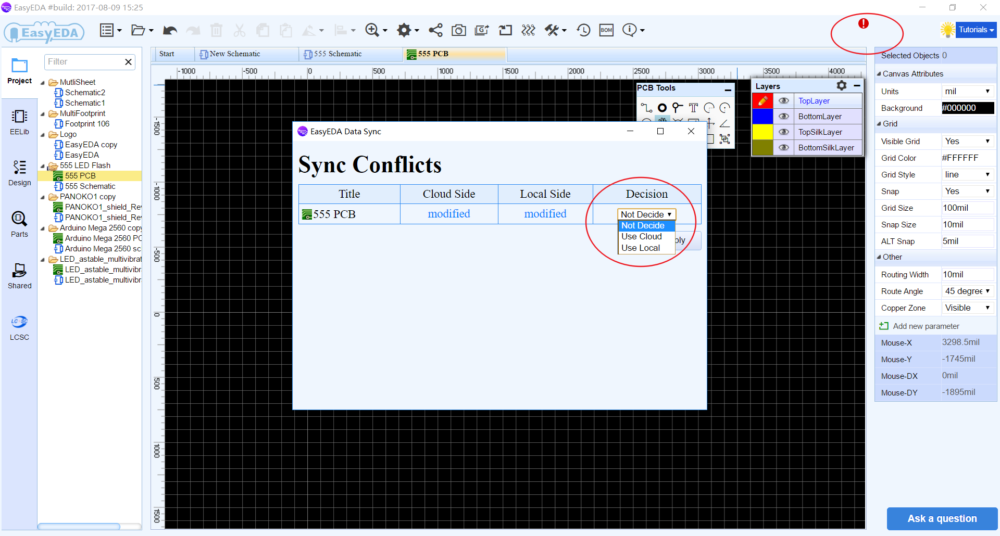

# Demo Video

<iframe width="906" height="488" src="https://www.youtube.com/embed/gnffNQcJezY" frameborder="0" allowfullscreen></iframe>

# Download

**Tutorial PDF Download**

The latest documentation of tutorial is providing .PDF now , and download via : [EasyEDA\_Tutorial\_20170918.pdf](./Doc/EasyEDA_Tutorial_20170918.pdf)

**Desktop Client Download**

We are glad to tell you that we are providing desktop client application now. In desktop client application you can keep your design at local.   
The more information and download, Please refer to [https://easyeda.com/page/download](https://easyeda.com/page/download)  

**Notice:**

-	*If you edit the same document in the desktop version and web editor at the same time, the desktop version will show the data sync conflicts icon beside the avatar.*
-	*Click the icon the conflicts dialog box will open, and you have to choose which side data you want, otherwise your local changes will not sync to the server, and the gerber output will not generate from the latest PCB of the desktop version too.*
-	*If you choose the cloud version and has applied it, you have to colse the document and open it again for implement changes if  the confilct document was opened. Otherwise when you keeping edit and save, the cloud version will be overwritten.*

# Updated Instructions

**What is new in v4.8.5**
 
EasyEDA has lots of new features in the version v4.8.5.  
Try it via [https://easyeda.com/editor](https://easyeda.com/editor).

-	**Footprint Manager Enhanced**

	-	**1.**Footprint manager will check your part's package correct or not automatically.  If the part without the package or this package doesn't exist in EasyEDA Libraries, or if the part's Pins Number doesn't correspond the package's Pads Number correctly, the footprint manager will show the red alert.  
	**Notice:** *If your schematic have many different packages, the footprint manager will take a few seconds to compare the packages' pads and your components' pins. Please wait for it.*  

	-	**2.**In the preview area, you can zoom in, zoom out and pan with mouse.  

-	**LCSC Assembly Components**

	-	We add an LCSC Assembly Components option of the Parts, It was be contained in LCSC Parts,  It's easy to choose which component can be assembled by LCSC.   
Yes, We will provide the assembly service at end of this year.

-	**Buy Components From LCSC More Easily**

	-	We change the BOM export location in at LCSC.
  

	-	When you click **"Export BOM at LCSC"**, we will help you to list all the components of your BOM,  and you just need to put them to the cart and check out.  

	-	And Click the **"BOM"**button to download the BOM file.

-	**Documents Tab Switch**

	-	It's easy to fit your documents tab location.  

-	**Protractor**

	-	We add a protractor for PCB tools.  

**What is new in v4.6.4** 

-	**New Footprint Manager**

	-	In this version we provide a powerful footprint manager tool. It supports batch modifying component packages. For more detail please refer to the [Footprint Manager](./Schematic.htm#Footprint-Manager) section.  

-	**New Arc tool**

	-	A new arc tool which is center point fixed, and you can change the radius easily.  

-	**Global Delete**

	-	Have you been upset because you couldn't delete the same units of schematic or PCB. Now we tried to solve this problem via the global delete feature.  You can globally delete the same units of your choice easily.

-	**Move selected component**

	-	When moving the selected component, the connected wire will move vertically and horizontally.  

-	**BOM export on the top toolbar**  

	-	In the BOM export dialog，you can assign LCSC part's order code for your components.  

	-	After clicking on the assign icon，the components and packages search dialog will open in which you can choose the component that you want to assign.  

-	**More Align options**

	-	The Editor provides more alignment options as below.  These options can make your design more convenient.  

-	**Import enhance**

	-	**New Altium Design Import**  
                It is faster and better, and it support big files. Please make sure that you save the file as ASCII before importing.  

	-	**Better DXF Import**  
		Importing DXF file to PCB is better.

