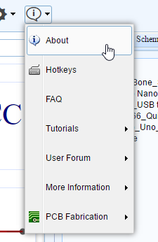
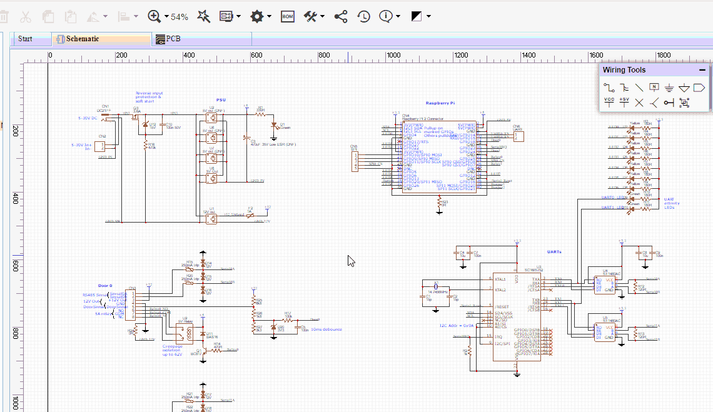
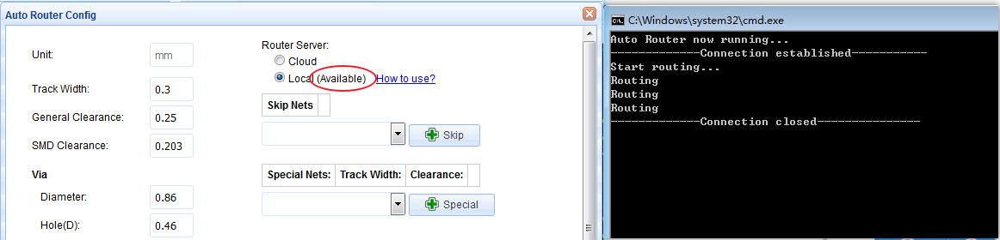
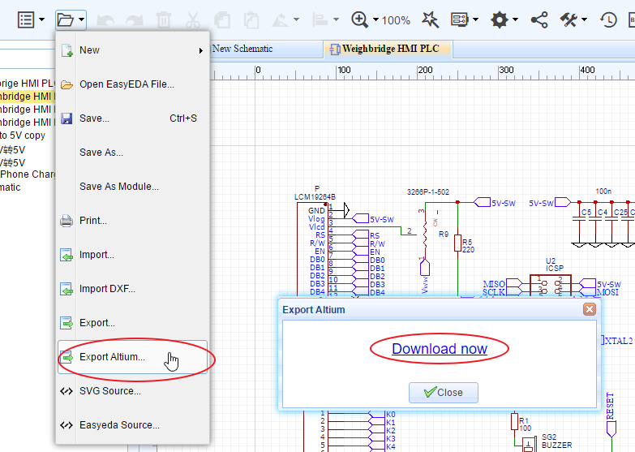
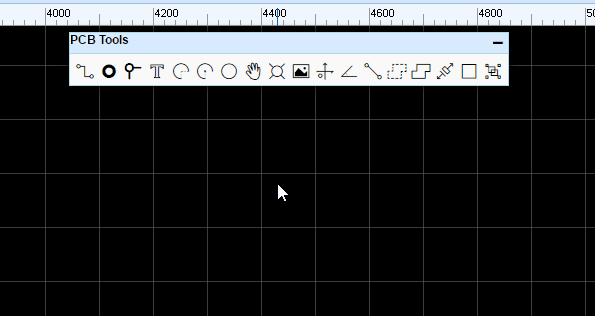
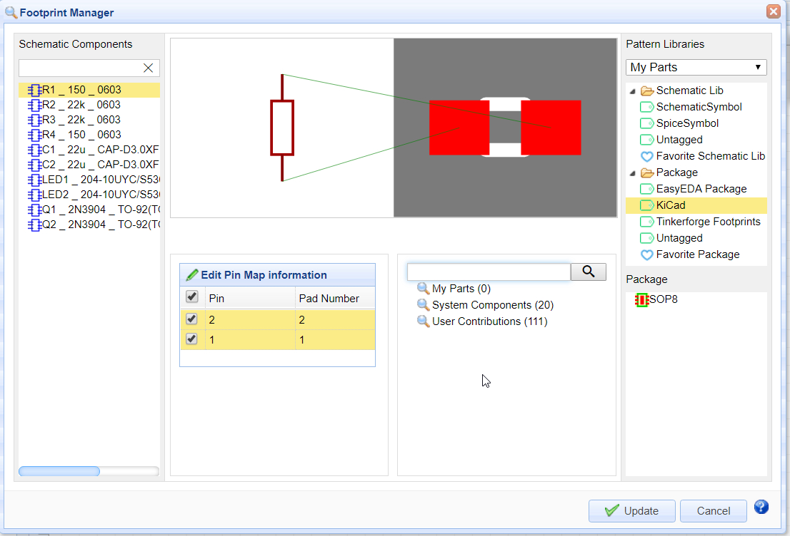
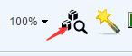

# Demo Video

<iframe width="906" height="488" src="https://www.youtube.com/embed/gnffNQcJezY" frameborder="0" allowfullscreen></iframe>

# Download

**Tutorial PDF & Local Auto Router Download**

The latest documentation of tutorial and Local Auto Router is providing download now , via :   
Link1(Google Drive)：[EasyEDA\_Tutorial.pdf & EasyEDA Router.7z](https://drive.google.com/drive/folders/0BwqCaNlgtS3UZkM3UFZqVkRqNHM?usp=sharing)  
Link2(GitHub)：[EasyEDA\_Tutorial.pdf & EasyEDA Router.7z](https://github.com/dillonHe/EasyEDA-Documents/tree/master/Tutorial/Doc)

**Desktop Client Download**

We're sorry to inform you that EasyEDA desktop client is temporarily stopped for download and development (The new desktop version will come back in one year). Due to the rapid updates of Web-based EasyEDA, its too many new features can't be applied to EasyEDA desktop quickly and the desktop version is not suitable for weekly or even daily updates. We strongly suggest synchronizing your data to the server or download to your local hard drive, and then use web-based EasyEDA for your project design. 
Meanwhile, EasyEDA will soon provide privatization deployment which you can deploy a server similar to EasyEDA in your intranet.
Any questions, please contact our technical support via support@easyeda.com. 

2017.09.30

# Updated Instructions

**What is new in v4.11.9**

2017.11.22:

-	Improvement:

	-	Fixed copper area can't generate the clearance issue.
	-	Fixed simulation can't run issue.

**What is new in v4.11.5**

2017.11.17:

-	Improvement:
	-	Fixed the connect pad to pad function of the PCB tool.
	-	Fixed when copy and paste the pads the pad number doesn't increase issue.
	-	Fixed the footprint manager will show red issue when the footprint has the same pad number.
	-	Fixed when autoroute or change the track layer will cause the double via issue.
	-	Improved mutil-layer pad change to single layer experience. 
	-	Fixed when measure the pad inside don't show the result issue.
	-	New [KiCAD](http://kicad-pcb.org/) SCH Libs and PCB Libs.
	-	Improved the annotate function.
	-	Fixed some special situations will cause the copper area function don't work properly issue.
	-	Improved when close the snap the wire did not connect correctly issue.
	-	Remove shortcut key `G` and `ctrl+shift+v`.
	-	Fixed when the PCB import change with the no pad footprint will make the excursion issue.
	

**What is new in v4.10.3**

2017.10.20:

-	Improvement:

	-	Improved the efficiency for delete much tracks. Before, it takes a few minutes to delete 1000+ tracks, now, it only takes a few seconds.
	-	Fixed the problem that the ratline will not disappear after routing.
	-	Fixed the problem that the copper area will not disappear after deleting the copper.

**What is new in v4.10.2**

2017.10.17:

-	Improvement:

	-	Fixed netlabel can't be connected issue.

**What is new in v4.10.1**

2017.10.16:

-	New Feature:

	-	New menu of "Help".
	
	-	New Function: [Cross Probe and Place](https://easyeda.com/Doc/Tutorial/Schematic.htm#Cross-Probe-And-Place), hotkey "ctrl + shift + x".
    
	-	Local auto router support Linux (64bit).
	
-	Improvement:

	-	Optimized the sort rule of nets in the schematic.
	-	Optimized the multi-netlabel in one wire display in the schematic design manager.  
	*In the earlier version, when you place a component at a wire, its net name will change, and if you update to PCB, the tracks and net name will be change too. but since this verison, that problem is fixed, but the earlier PCB tracks and net name we can't keep the same as before, If you want to keep the PCB layout, you'd better use the `Convert to PCB` rather than `Update PCB`.*
	-	Improved the schematic drawing is not fluent issue.
	-	Fixed the package title with space will cause the package update fail issue.
	-	Fixed when paste the copy with right click will make undo fail issue.
	-	Fixed when change the PIN length cause the rotation error issue.
	-	Fixed the text alignment issue.
	-	Improved the Firefox zoom in and zoom out fluency.
	-	Fixed the special charaters will cause the auto router fail issue.
	-	Fixed the circle copper area will casue the edge rag issue.
	-	Improved BOM export.
	-	Added milimeter unit for Pick and place file output. The unit follow the PCB unit setting.

**What is new in v4.9.3**

-	**Local Auto Router**

	-	To solve the auto router always busy, we provide the local auto router function now.

Download via: [EasyEDA Router.zip](https://lceda.cn/EasyEDA-Router.zip)  
Before run the local auto router, you have to configure the browser, for more information please refer: [https://easyeda.com/Doc/Tutorial/PCB.htm#Local-Auto-Router](https://easyeda.com/Doc/Tutorial/PCB.htm#Local-Auto-Router)

-	**Export the Altium Designer file format**

	-	Now EasyEDA is support to export the Altium Designer file format, because of this is the first version, maybe have some problem we haven't found, please check carefully when you open at Altium Designer.  
  
The more information please refer to :  
[https://easyeda.com/Doc/Tutorial/Export.htm#Exporting-Schematics-In-Altium-Designer-Format](https://easyeda.com/Doc/Tutorial/Export.htm#Exporting-Schematics-In-Altium-Designer-Format)  
[https://easyeda.com/Doc/Tutorial/Export.htm#Exporting-PCB-In-Altium-Designer-Format](https://easyeda.com/Doc/Tutorial/Export.htm#Exporting-PCB-In-Altium-Designer-Format)

**What is new in v4.8.5**

-	**Footprint Manager Enhanced**

	-	**1.**Footprint manager will check your part's package correct or not automatically.  If the part without the package or this package doesn't exist in EasyEDA Libraries, or if the part's Pins Number doesn't correspond the package's Pads Number correctly, the footprint manager will show the red alert.  
	**Notice:** *If your schematic have many different packages, the footprint manager will take a few seconds to compare the packages' pads and your components' pins. Please wait for it.*  

	-	**2.**In the preview area, you can zoom in, zoom out and pan with mouse.  

-	**LCSC Assembly Components**

	-	We add an LCSC Assembly Components option of the Parts, It was be contained in LCSC Parts,  It's easy to choose which component can be assembled by LCSC.   
Yes, We will provide the assembly service at end of this year.

-	**Buy Components From LCSC More Easily**

	-	We change the BOM export location in at LCSC.
  

	-	When you click **"Export BOM at LCSC"**, we will help you to list all the components of your BOM,  and you just need to put them to the cart and check out.  

	-	And Click the **"BOM"**button to download the BOM file.

-	**Documents Tab Switch**

	-	It's easy to fit your documents tab location.  

-	**Protractor**

	-	We add a protractor for PCB tools.  

**What is new in v4.6.4** 

-	**New Footprint Manager**

	-	In this version we provide a powerful footprint manager tool. It supports batch modifying component packages. For more detail please refer to the [Footprint Manager](./Schematic.htm#Footprint-Manager) section.  

-	**New Arc tool**

	-	A new arc tool which is center point fixed, and you can change the radius easily.  

-	**Global Delete**

	-	Have you been upset because you couldn't delete the same units of schematic or PCB. Now we tried to solve this problem via the global delete feature.  You can globally delete the same units of your choice easily.

-	**Move selected component**

	-	When moving the selected component, the connected wire will move vertically and horizontally.  

-	**BOM export on the top toolbar**  

	-	In the BOM export dialog，you can assign LCSC part's order code for your components.  

	-	After clicking on the assign icon，the components and packages search dialog will open in which you can choose the component that you want to assign.  

-	**More Align options**

	-	The Editor provides more alignment options as below.  These options can make your design more convenient.  

-	**Import enhance**

	-	**New Altium Design Import**  
        It is faster and better, and it support big files. Please make sure that you save the file as ASCII before importing.  

	-	**Better DXF Import**  
		Importing DXF file to PCB is better.

		

**What is new in the V4.5.6**  
 
After 7 years of development, EasyEDA are pleased to announce the new version: V4.5.6. which introduces many new features.   Try it at [https://easyeda.com/editor](https://easyeda.com/editor)
 
 
-	**New UI**  
Before V4.5,  EasyEDA's UI is not professional, now we redesign the icons and theme. 
 

-	**LCSC**
  EasyEDA partner with China’s largest electronic components online store by customers and ordering quantity launch https://lcsc.com.  
	 -	LCSC means **L**ove **C**omponents? **S**ave **C**ost! We suggest our users to use LCSC parts to design. Why? 
	-	1. Small Quantity & Global Shipping.
	-	2. More Than 25,000 Kinds of Components.
	-	3. All components are genuine. 
	-	4. It is easy to order co after design. 
	-	5. You can save 40% cost at least.
	-	6. You can use our symbols and package.

 
-	**Cross Probe in Schematic and PCB**  
This tool is used to cross probe from  chosen objects on the current schematic  to its corresponding counterparts in the PCB, or from PCB Footprints to corresponding  counterparts in the schematic.   
Note, you need to open the schematics and PCB.  Don't forget to use hotkey `SHIFT+X`  
Thanks to this topic https://easyeda.com/forum/topic/TAB_to_toggle_between_PCB_amp_schematic-LDdaKIigs

-	**Board outline wizard**  
Some users want to set  very precision board outlines, now we can do in this way. Open your PCB, find the menu via toolbar. 
Then you can see such a dialog. 
In this dialog, we provide 3 type board outline setting, Rectangular , Circular, Round Rect.
If you need other complex board outline, you can import a DXF file.

-	**Change Supper Menu position**  
In old version, the supper menu is a bit litter hard to find, now we set it at a good place.

-	**New Design Manger**   
The old design manager is hard to find too, now we move it to the left panel.
We hope you enjoy the new version!   
And as always, if you have any questions or suggestions, do let us know. support@easeda.com

**What is new in the V4.1.1.X**  

 After 7 years of development, EasyEDA are pleased to announce the new version: V4.1.1. which introduces many new features.   Try it at [https://easyeda.com/editor](https://easyeda.com/editor).

-	**2017 Spring Festival Notification**  
 Please check this link  [2017 Spring Festival Notification](https://easyeda.com/support/2017_Spring_Festival_Notification-fd4f25a28c864b51851ddccc69375b92)

-	**EasyEDA ambitions in 2017**  
**1. Provide components ordering with your PCB.**
   So you can not only order your PCB from us; you will also be able to order many common components directly from us. We will ship the components with your PCB so saving you lots of time and money because there's no need to hunt for components and compare pricing from big name suppliers.  
**2. Provide PCB assembly service.**
  For a long time, EasyEDA has been able to provide a PCB assembly service but up to now just a few customers who chat with us via email know about this service. In 2017, we will make this service public. So after you design the PCB, we will not only help you to source the components but we will kit and assemble them onto your PCB before shipping the completed PCBs to you. That way, you can focus more of your time and effort into the design and debug tasks.

-	**New EasyEDA libs**  
 From this version, we have changed the EasyEDA Libs to try make it easier to find, place and order components and to make schematic conversion to PCB simpler. Placing any component from the EasyEDA Libs into a schematic will therefore also automatically complete the PCB package and all the required BoM information fields.   
 For Resistor, Capacitor, Inductor symbols, EasyEDA now provides the components with package selection and provides dedicated **US styles** and **IEC styles**  
For other common parts such as discretes and ICs, we now provide symbols for components with specific packages and which can be ordered from EasyEDA.  
For the Connector section,  
 EasyEDA now provides Header-Male, Header-Female, Screw Terminal, IDC box, RJ45, RJ11, USB and audio interface. All of these components can be ordered straight from EasyEDA with your PCB.  
* Note however that this is a big change from the earlier versions of the EasyEDA Libs because from V4.1.1 most of the non-passive components in the EasyEDA Libs will no longer have spice models attached to them.   
Schematic symbols with spice simulation models attached to them can now be found using the **More Libraries...** button (or SHIFT+F) under **System Components > Spice Simulation**  
So, you do need to spend some time to explore these changes.

-	**Images for EasyEDA components**.  
Sometimes, it can be hard to visualise what a component really looks like just from package or schematic symbols, so now we provide real product images, photographed against a 1mm grid for reference, 

-	**Work as a team**   
Before EasyEDA version V4, if you wanted to work together with your partners, you had to use the [Access Control](https://easyeda.com/Doc/Tutorial/share.htm#Access-Control) function.   
Access Control has lots of limitations on who can create projects, schematics and PCBs and more importantly, when you try to convert your schematics to PCB, you may find that some packages create error messages which can be hard to track down.  
Now EasyEDA provides a new team feature with which you can work seamlessly with your partners. You can work as if everyone is logged in under the same account, with full access to all components, Schematics, PCBs and Projects.

	-	**How to find the team function**.  
 Under the [dashboard](https://beta.easyeda.com/projects/mylists) , there is a team section.
 
	-	**How to create a team**.  
   There is a link as shown in the image above, or click[ this link](https://beta.easyeda.com/teams/create) after you login.

	-	**How to switch to team model**.  
1) switch in the dashboard.  
  After you have created a team, click the team name and the dashboard will switch to showing only the team projects, files and components.  
After switching to a team, there is a team management section where you can manage your team members, invite new team members and even delete the team.  
2) switch in the editor.    
  Under your personal menu, there is a sub menu allowing you to switch to a team or to your personal account.

	-	**How to Upgrade to a team**
 If you want to contribute all of your designs to a team, you can use this function. First you need to create a team, then click the link, shown below, under dashboard.   
  Be careful with this function because after you do that, **all** of your components, projects will be moved to your team.

	-	**Tips about the team function**.  
  		1. If you switch to a team, you can't automatically use any Packages/Footprints which you have created under your personal account. You need to **Favorite** your personal package/componments first.   
  		2. You need to be aware that your team and your personal accounts are the different, separate accountsand that you can't use them both at the same time.    
 		3. After making yourself the owner of a team, it is best to create any Components and Packages needed by the team under that team.  
		4. If you add a member, nominated to be your accountant, to your team then they can deal the team billing and invoices.
  

-	**Warning**  
 After you modify a PCB, please remember to rebuild the copper area before placing the final PCB order.  
 In a few weeks time, we will introduce the feature that EasyEDA will force you to rebuild the copper area before placing the final PCB order but for now you need to remember: Easyeda does not rebuild the copper area automatically for you before placing your order.
 

-	**Desktop Version beta version**   
A download link for this will be available  soon.

We hope you enjoy the new version! 
And as always, if you have any questions or suggestions, do let us know.
 
 
 
 
**What is new in the V3.10.X**
 
The new version EasyEDA, V3.10.x. introduces lots of new features. Try it at [https://easyeda.com/editor](https://easyeda.com/editor).

-	**Better Mac User Experience**   
*Please note that when running EasyEDA on a Mac, for the best user experience, we recommend using Chrome instead of Safari.*

	-	**1. Pan**
 
	 	-	**When Using the Mouse**  
Hold down the right click and move your mouse and the canvas will pan with the cursor.  
Before using the Magic Mouse, you need to enable the right click function via this video. https://www.youtube.com/watch?v=ekzIoAxXSHE,

		 -	**When Using the Touchpad**  
Hold down the `SHIFT` key then move a single finger: the canvas will pan horizontally.  
Hold down the `CONTROL` key then move a single finger: the canvas will pan vertically. 

	-	**2. Zoom**

		 -	**When Using the Mouse**  
Scroll the middle button of the mouse (or Magic mouse).

		 -	**When Using the Touchpad **  
Sliding a single finger up zooms in and sliding down zooms out.

-	**New Pad attribute.**  
New `Slot` and `Plated` attributes have been added for the hole in a pad as illustrated in the image below

-	**Components**   
The component search function has been significantly improved to make finding part symbols and footprints quicker and easier. Press hot key `SHIFT+F` or click it via toolbar  
In the new components dialog, it is easy to select the right components via tags and you can set tags for your own components.

-	**New Dialog**  
When creating a schematic lib, there is an input dialog for entering sourcing information, such as supplier information, supplier part number and datasheet. Information can be added at the time the schematic lib is created or these steps can be skipped at this stage and add these later.

	-	**New Component attribute**  
  The new version of EasyEDA adds a `Mounted` attribute at the component, to simplify the identification and kitting of optional components which may be fitted in one assembly but not in another. This attribute  can be set to `YES` to list the part in the BoM. If the `Mounted` attribute is set to `NO` as illustrated in the image below then the part will not be listed in the BOM.
  

	-	**Components search dialog**  
If the `EasyEDA Components` option is selected, then a dialog opens as illustrated in the image below.  
EasyEDA team has spent a lot of time to build these `EasyEDA Components` components and packages and we recommend them as preferred components, because the packages have been carefully checked and verified, the footprints have been designed for reliable soldering by our PCB manufacturing and because these components can all be ordered directly from EasyEDA.  
There are several other categories to explore but these components may need more carefully checking or may be a little harder to source.

-	**New search filter**  
When updating a package, using new filter terms, it is now possible to search only for a symbol or only for a package/footprint. For example in the filter entry below:   
`AXIAL doctype:pcb`   
the filter term:  
`doctype:pcb`   
will just search for a PCB package with the name AXIAL.  
Similarly, the filter term:  
  `doctype:sch`   
 will just search for components (symbols) without listing packages.  

 
-	**Synchronous schematic and PCB**
Converting a schematic to PCB can be done using the `Convert Project to PCB...` button as illustrated in the toolbar below but a new `update PCB` button has been added so that modifications to the schematic can immediately be passed forward to update the a selected PCB without having the PCB editor window already open. 

-	**Add Frame**  
It is now possible to add design notes to the frame and the frame selection, for example A4, can assist in aligning and improve the look of printed schematics and PCB designs.  
click the frame button like bellow image 
As illustrated in the image below: 
the bottom right zone can be selected and dragged or the frame can be dragged and deleted.

-	**Hide the simulation button**  
EasyEDA's simulation function is powerful but it is not easy to use. Many of our users run a schematic which, for example, may include symbols or blocks - such Wifi modules, MCU, DSP and ADC devices - for which no simulation models exist. This can be very discouraging and frustrating, especially for users that are new to simulation and - because it is a CPU intensive task - at the same time can also waste lots of CPU resource at the expense of other tasks such as autorouting and rendering on larger PCBs.  
To reduce the casual use of simulaton we have taken the decision, not to remove it but to simply hide the simulation button from the tool bar. Simulations can still be constructed and saved exactly as before but they can now only be run using the CTRL+R to run the simulation and we strongly recommend first studying - and trying out the many examples in - the EasyEDA Simulation eBook. 

-	**Desktop version coming soon**  
EasyEDA will provide a desktop version for offline use. 

We hope you enjoy the new version! 
And as always, if you have any questions or suggestions, do let us know.

 

**What is new in the V3.2.X**  

The new version is V3.2.x. EasyEDA has lots of new features in the version. Try it via [https://easyeda.com/editor](https://easyeda.com/editor).

-	**Invite Friends to Win a Gift**  
If you like to help your friends to use this nice web based EDA tool, you can invite him/her to join EasyEDA. At the same time, you and your friends will get a $5 coupon to order PCB from EasyEDA. Why not to give this feature a try?   
Click this link  [invite your friends now](https://easyeda.com/account/invitation)
 
-	**Version History**  
It is easy to get this fundtion, right click the document which you need to find it's version like bellow image  
After clicking the history version link, you will get a list of all of the versions  like bellow image.  
 click the version number, you can open the saved file on the editor, if this is what you need, you can save it to your project and delete your bad file.  
**Note:** 
	1. Now all of the versions are marked as number, we will allow you to add a tag soon.
	2. Don't save your files too frequently, or you will get lots of versions and hardly to find the exact one.

-	**Auto Router**  
For some simply or prototype PCBs, you may want to use the auto router function to save time. Layout is a time cost and dull job. EasyEDA spends lots of time to provide such feature and loved by our users.
Steps:  
	-	**1 Click the the auto router button from the toolbar**  
	-	**2 Config the auto router**  
 After you click that button, you will get a config dialog like bellow image.  
In the config dialog, you can set some rules to make the auto router profession.  
If you want to keep the routed tracks, you need unchecked the `Ripup Nets`  
The real time check box will let you see how it is going, but it will make the process a bit litter slow.   
If you like to keep the a net no route, you can skip it. For example, if you want to use copper area to connect `GND` net, you can skip the `GND` net.   
For the power supply track, you may want it to bigger, then you can add some specail rules.   
	-	**3 Run it**  
Click the run button, waiting for  a few seconds, after add bottom and top copper area, you will get a finished PCB board like bellow image.  
Some time, if you can't get it done, try bellow tips.  
		1. Skip the GND nets, add copper area to GND net.
		2. use small tracks and small clearance, but make sure the value is more than 6mil.
		3. Routing some key tracks manual before auto router. 
		4. Add more layers, 4 layers or 6 layers  
Some profession guys don't like the auto router, because they think auto router is not profession, but you can the auto router to check your placement. to check the density of your PCB. 

-	**Insert Image/Logo to PCB**    
On PCB and PCB Lib editor, there is a new feature on the PCB Tool bar like the bellow image.  
After click it and select the image, you will goto bellow image.  
In this dialog, you can choose your favorite image, EasyEDA support `jpg`, `BMP`, 'PNG`, 'GIF`, and `SVG`.  not likes some other EDA tools, they just support a Monochrome Bitmap image, EasyEDA support full color. but Monochrome Bitmap is welcome.  
You can adjust the tolerance and reset the image size at there.   
The image will be inserted to the active layer, if it is not right, you can change the attribute of it. Such as TopSilkLayer.

-	**More Fonts  for PCB**  
From V3.2.x, You can add more fonts from your computer or download some [free fonts](http://www.1001freefonts.com/) .  
Select the text, then you can find a Font-family attribute on the right panel like bellow image.  
Click the add button, then choose the font, the font file must be `ttf` or `otf`.  
So you can add any fonts by your self. EasyEDA desn't cache the font on our server, so if you close the editor, you need to add the font again by your self.  
Note:  
If you use the other font, the `LineWidth` attribute is useless, because it will be auo by change the `Height`.

-	**Change Attributes in Batch on PCB Editor**  
Some times, we need to change some attributes in the same together, such as the track width, hole size and font size.  
Now, you can select them and do some changes. Taking the track for an example. If you select 3 tracks, now you can change their `Width`, `Layer`, `Net` together.  
Other items such as `Pad`, `Via`, and  `TEXT`, you can try to play this feature.

-	**New Track Style**   
When routing, some time we need to add an Arc segment, or change the inflection direction. Now we can do this easily.
Change to Arc style, You can use Hot key `L` to toggle from 45 degree to Arc.  
You can change  inflection direction when router, from A to B, we have two ways.  
When you router from A to B, the default track is 1, but if you press `Space bar` key, the track will be changed to 2.

 
-	**Modules**   
Copying codes is an easy job for coders, now copy and reuse a schematic or PCB are easy now.
Take a power supply unit for example, you can save this unit as a schematic module.
After saving, you can find it at the module section. And you can place the whole block to your schematic.

-	**Get a Invoice After PCB Order**  
For company users, after order PCB, they may need an invoice, you can find it at .
[History orders](https://easyeda.com/my-order). There is an invoice link, you can open it and save it as pdf or html file.

-	**Contribute Your Symbols and Package to EasyEDA**  
Right click your parts, you can share symbols and package to EasyEDA system libs, then, every one can use them as their own parts. 

-	**Delete a Segment from a Track**  
 In lots of other EDA tools, the track is segment line, but in EasyEDA, the track is polyline. some time, if we want to delete a segment, we must delete the whole track and router again. Now we provide a not bad way to do this. Moving your mouse to the segment which you want to delete, click it, then hold the `SHIFT` and **double click it**. the segment will be removed.

-	**Change Cursor Style**  
Some users don't like the cross cursor, so you can change it to arrow cursor like bellow image.

-	**Better Navigation Bar for Components.**  
 On [How To Find The Schematic Libraries](/Doc/Tutorial/schematic.htm#How-To-Find-The-Schematic-Libraries), you can find a way to use many many components and package, now EasyEDA provide a great navigation bar on the top. You can use some open source parts and [Pololu Module](https://easyeda.com/component/pololu) , like bellow image.

Enjoy it, if you have any questions, do let us know.

 

 
 

 

 
 

 
