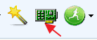
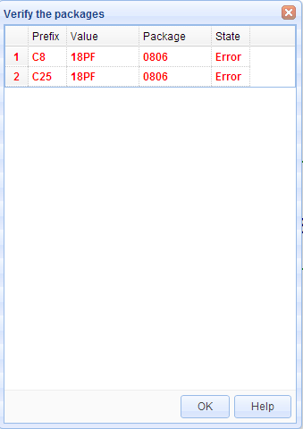
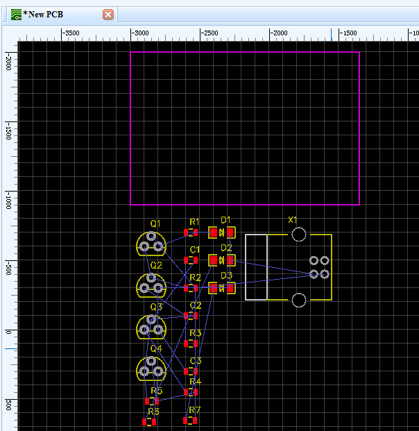

# Converting Your Schematics To PCB

<iframe width="920" height="540" src="//www.youtube.com/embed/JOiT7KA5wRw" frameborder="0" allowfullscreen></iframe>
Most of the time, schematics are created with the aim of producing a PCB. So how do you convert your schematic to a PCB in EasyEDA? The first step you need to take is to click the PCB icon on the toolbar with the title Convert project to PCB

## PCB Libs search order 

To find PCB footprints to match the package type attributes of your Schematic symbols, EasyEDA will search the available PCB libraries. EasyEDA will search your own PCB Libs on the **My Parts** section first. If it doesn’t find a matching footprint there then it will search in the System PCB Libs. So, for example, if your symbol calls up a “**TO220**” package, you have a “**TO220**” package in your My Parts section and there is a “**TO220**” package in the system PCB Libs, then EasyEDA will use the  “**TO220**” package in your My Parts and ignore the system PCB Lib.

##   Verify Packages and Build PCB 

After clicking the Convert project to PCB button, the following dialog will open:

The row in red indicates that EasyEDA can’t find a PCB footprint matching the Package that the schematic symbol is calling for. This could be because you have made an error entering the package attribute in the symbol’s Properties or maybe you haven’t yet created a PCB footprint for the package that your symbol is calling for. In this case the package should have been and **0806** is just a typing error. To correct it on you can click on the row and change it to **0805**.

After making any necessary corrections, click the ** Build PCB** button and EasyEDA will automatically load all the package PCB footprints into the PCB editor as shown in the image below.

This shows the footprints placed in arbitrary positions with the connections between them shown as blue Rat lines.
 