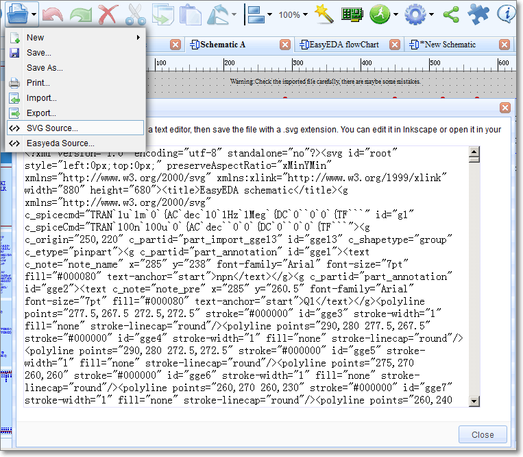
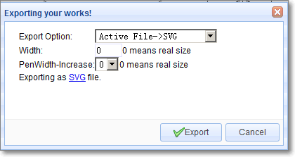
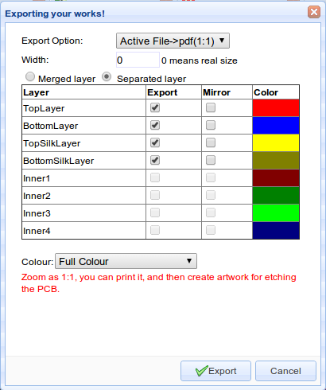
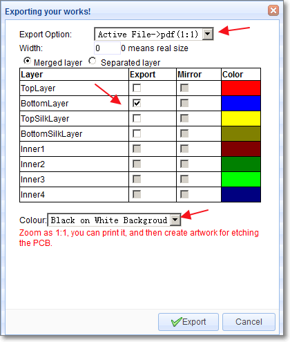
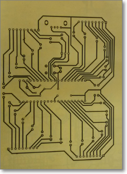
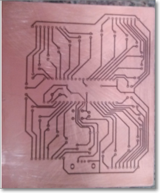
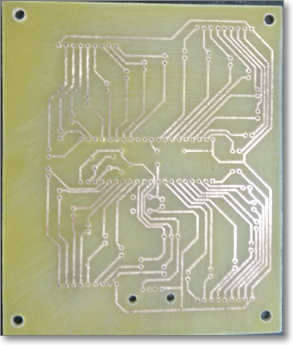
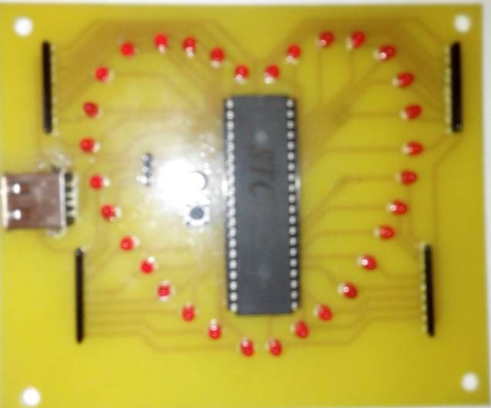

# Export 
<iframe width="920" height="540" src="//www.youtube.com/embed/nTQtx8UZ0fM" frameborder="0" allowfullscreen></iframe>
For documentation and other purposes, you can export your Schematic and PCB designs to the following formats:

-   EasyEDA Source 
-   SVG Source
-   SVG
-   Image(Png)
-   Pdf 

## SVG Source 

You can create an SVG sourcefile via: 

**Document > SVG source...**

then copy the contents of this box into a text editor and save the file with a .svg extension. You can edit it in [Inkscape](http://www.inkscape.org/) or open it in your browser.

This solution doesn’t need an internet connect so if you open EasyEDA offline, you can use it.

## General Exporting 

### Exporting Schematics.

Using:

**Document > Export… **

you can open this dialog:

From here you can choose to export your design to SVG, image (.png) and Pdf file format.

For all file formats:

Width: 0 is a 1:1 export of your image, higher numbers zoom your image.

PenWidth-Increase: 0 represents a default line width of 1 pixel; if you set this to 1, the line will be 2 pixels. This is illustrated in the image below.

### Exporting PCB designs

#### Exporting in documentation formats

Exporting a PCB design or footprints from EasyEDA is very similar to exporting a Schematic or a Symbol.

Using:

**Document > Export…**

you can open this dialog:

You can select to export in pdf, drawing (.png) or SVG format.

You can select to print individual layers or selected layers merged into a single file.

It is also possible to mirror selected layers for example to show bottom layers in easily readable orientation.

#### Print For Etching

If you don’t want to order your PCBs from EasyEDA then maybe - for single and double sided PCB designs -  you might like to try like using some home made PCB tech:

[http://hackaday.com/2012/12/10/10-ways-to-etch-pcbs-at-home/](http://hackaday.com/2012/12/10/10-ways-to-etch-pcbs-at-home/)

So here’s how you can print your PCB layer by layer and then etching it onto a PCB.

Step 1) Export it to Pdf

   

Make sure the Colour is Black on White Background

Step 2) Open the pdf file in a viewer

Step 3) Print it to paper

Step 4) Copy it to the copper

Step 5) Etch it.

Step 6) Drill it ...

Step 7) Get your soldering iron out!

 