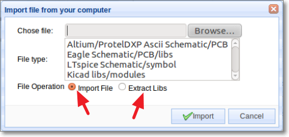
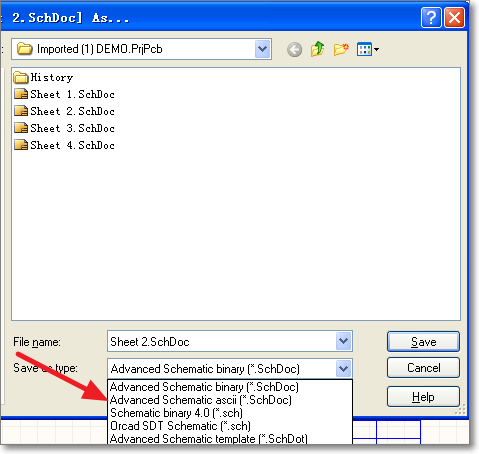
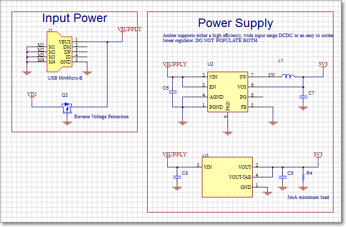
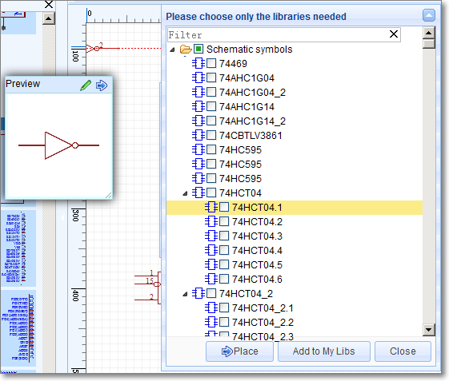
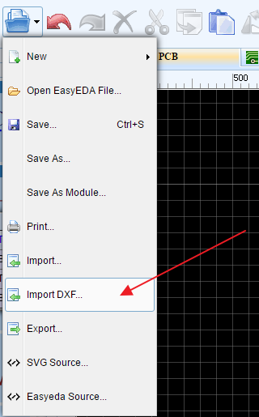
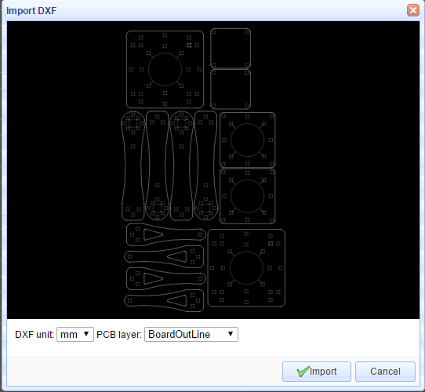
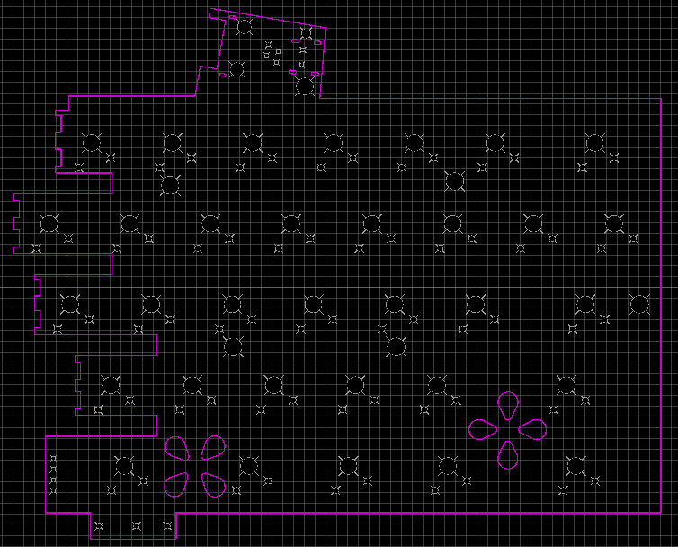

# Import 
<iframe width="920" height="540" src="//www.youtube.com/embed/rl3EMkRp5t8" frameborder="0" allowfullscreen></iframe>
EasyEDA provides importing from:

-   Altium/ProtelDXP Ascii Schematic/PCB
-   Eagle Schematic/PCB/libs
-   LTspice Schematic/symbols (some editing may be required for Ngspice compatibility)
-   Kicad libs/modules (symbol and footprint libraries)

You can find the import menu from the Document menu:

**Document > Import...**

which opens the Import file from your computer dialog:

Please note in File Operation: the Extract Libs option is only supported to import Altium Designer and Eagle libraries.

## Import Altium Designer 

You can import Altium Designer’s Schematic and PCB files into EasyEDA but only from Ascii files, so you need to save the designs as Ascii files like this.

EasyEDA offers an excellent experience in importing Alitum Designer’s Schematic and PCB: as you can see from the image below of a schematic imported from Altium Designer:

Altium Designer’s Schematic and PCB libraries are not available as **Ascii** files, so how can you import them?

In the Import file from your computer dialog to the right of File Operation; tick the Extract Libs option and EasyEDA will extract all of the libs from the Schematic files or PCB Files. So, if you want to import Altium Designer’s Libs, you can add them to your Altium Designer Schematic or PCB and then extract them again into your EasyEDA library.

## Import Eagle 

Eagle Schematic/PCB/libs can be imported, but EasyEDA can only support version 6 and later (6+) because that was when Version 6 Eagle adopted an **ASCII XML** data structure as their native file format.

## Import LTspice 

EasyEDA has all of the standard symbols of LTspice built in so if your LTspice schematic includes only LTspice native symbols (i.e. no symbols which have been created by any third party) then you can import them directly into EasyEDA. If your schematic does contain third party symbols then you should import the symbol (.asy) files first and then import the schematic (.asc) file.

The image below shows an LTspice schematic imported into EasyEDA.

Please note that because LTspice and EasyEDA use different simulation engines and may use different spice .model and .subckt models, you must check and if necessary edit them to ensure that they are compatible with Ngspice.

The simulation statement in the imported LTspice schematic can be converted into a spice directive that will be understood by EasyEDA simply be deleting the leading “.” For example .tran statement imported as part of the LTspice simulation schematic illustrated above can be converted into the EasyEDA spice directive, tran.

You should also check and if necessary, edit or add any functions used in the simulations. For example, in Ngspice the LIMIT function does not exist natively and, although a function can be created to substitute for this missing function, the the order of arguments in the Ngspice function is important whereas in the original LTspice function the order does not matter.

For more help in reconciling the differences between LTspice and Ngspice please refer to the LTspice Help files and the Ngspice User Manual:

[http://ngspice.sourceforge.net/docs/ngspice-manual.pdf](http://ngspice.sourceforge.net/docs/ngspice-manual.pdf)

 Please also see the section on: [How to get help?](./introduction.htm#How-to-get-help)

## Import Kicad Libs 

Although at present, EasyEDA can’t import Schematics and PCB from KiCad, you can import Kicad’s schematic libs and PCB libs.

You can add some of the Libs to the **My Parts** section, or place them in the canvas.

The image below illustrates some imported Kicad Schematic and Footprint libs:

 
                    

## Import DXF File 
How to create irregular board outlines or complex board outline in EasyEDA?   This is sometimes needed when you are designing a PCB for an enclosure that may have a curved profile, or other unavoidable mechanical features for which one must design.  

Find the import DXF menu under the file menu.
 

After select the *.DXF file, you will find a dialog like bellow image

EasyEDA provides two parameters, unit(mm or inch), the shapes will be applied to which layer.

After click the import button, you will find them on your PCB canvas.

 You can try this to import this example by your self. [DXF example](/Doc/Tutorial/images/test.dxf)
Please note:
1. The file must be a *.dxf filename extension
2. the circles will be convert to holes if you choose the layer as board outline.
3. there are some items are not supported.