 
# Introduction to EasyEDA
 

## What's EasyEDA

<iframe width="920" height="540" src="//www.youtube.com/embed/fhGYMZgFtho" frameborder="0" allowfullscreen></iframe>
Welcome to EasyEDA, a great web based EDA tool for electronics engineers, educators, students, makers and enthusiasts.

There’s no need to install any software. Just open EasyEDA in any HTML5 capable, standards compliant web browser.

Whether you are using Linux, Mac or Windows; Chrome, Firefox, IE, Opera, or Safari. EasyEDA has all the features you expect and need to rapidly and easily take your design from conception through to production.

[EasyEDA](https://easyeda.com/editor) provides:

-   Schematic capture
-   [ngpice-based](http://ngspice.sourceforge.net/) simulation
-   PCB layout
-   PCB Design Rules and Checking
-   Export
-   PCB netlist in
	- Altium Designer
	-   [Kicad](http://www.kicad-pcb.org/)
	-   PADS
-   Spice netlist
-   WaveForm simulation plot data (in CSV format)
-   Schematic in
	-   pdf
	-   image
	-   SVG
-   Creation of BoM reports
-   Import
	-   Altium/ProtelDXP Ascii Schematic/PCB
	-   Eagle Schematic/PCB/libs
	-   LTspice Schematic/symbols (may require editing for Ngspice compatibility)
	-   [Kicad](http://www.kicad-pcb.org/)libs/modules (footprint libraries)
	-   Spice models and subcircuits
-   Symbol creation and editing
-   Multi-sheet and Hierarchical schematics (passive drawings and active simulation schematics)
-   Spice subcircuit creation
-   WaveForm viewer
-   Post simulation measurements
-   PCB footprint creation and editing
-   Simple but powerful general drawing capabilities
-   Schematic symbol, spice model and PCB footprint library management
-   Online sharing of - and collaborative working on - schematics, simulations, PCB layouts, designs and projects

## Open File Format

 If you want to hack EasyEDA's EDA files, you can check [https://easyeda.com/Doc/Open-File-Format/](https://easyeda.com/Doc/Open-File-Format/) out.  
1. You can use some codes or notepad to create an EasyEDA file. Cool!
2. You can adjust your designs with EasyEDA's API.

##Allow to adjust the right panel width

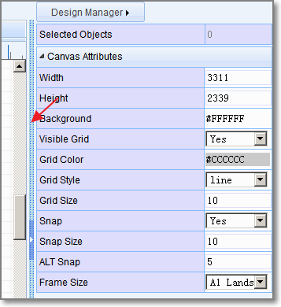 

##Zoom in and zoom out
Try to scroll your mouse, you will find out EasyEDA provide almost Stepless zoom. and the must factor is 10000%.

 
##Improved Design Manager
Old `Design Manager` is a pop up dialog, it is a bit litter annoying.Now, In the schematic and PCB file, there is toggle button [Design Manager <-> Properties] on the top right, when you switch to Design Manager, you will see bellow image
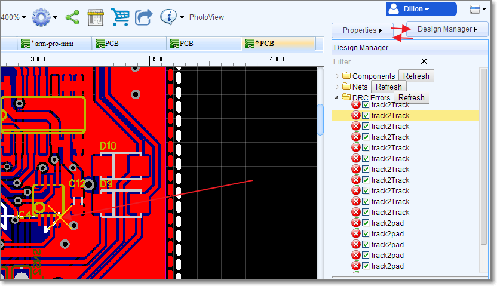

You can highlight the components and net, at the same time, you can check the ** DRC Errors**.

Schematic has design manager too, and you can filter and highlight the components, such as type a `R`, you will find all resistors.
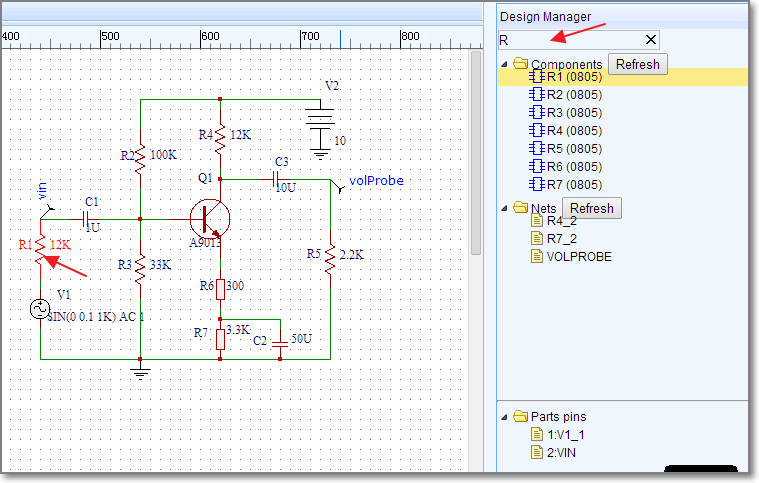

##SVG Preview
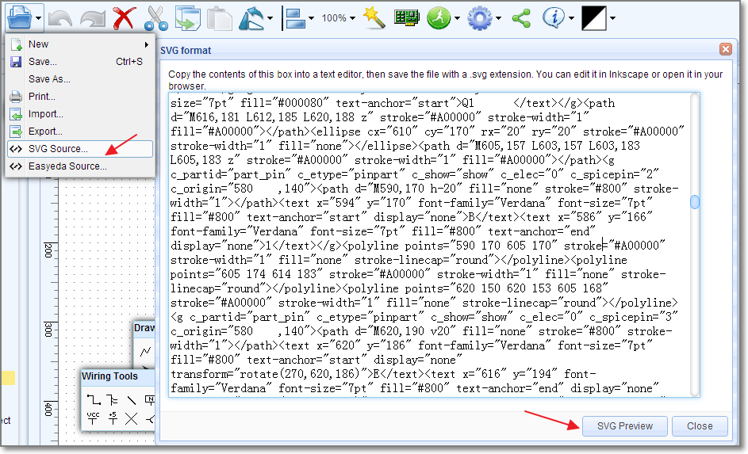
After click the `SVG Preview` button, you will see a nice SVG image and you can save the SVG file to your hard drive. This operation will be faster than export, because you don't need to send the file to EasyEDA server, and it is safe.

## Schematics 

EasyEDA can create highly professional looking schematics.

* * * * *

Because EasyEDA has some simple but powerful drawing capabilities, you can create your own symbols either by copying existing symbols into your own library then editing and saving them or by drawing them from scratch.

There is also a **Symbol Wizard** to quickly draw new symbols for `DIP`, `QFP` and `SIP`

 

A feature of EasyEDA is that as well as extensive libraries of the usual simple “2D” graphical schematic symbols, it has a library of drawn `3D` component symbols, i.e. symbols that look like the physical components that they represent.

If you have enough time and patience using the drawing features to full effect in symbol creation, your schematic can be built like this:

Another powerful feature is that it is also possible to import symbols from `Kicad`, `Eagle` and `Altium` libraries.

Finding individual **components** in a dense schematic can be very time consuming. EasyEDA has an easy way to find  - and jump to - components:

**Super Menu > Miscellaneous > Find Component…**

(or `Ctrl+F`)

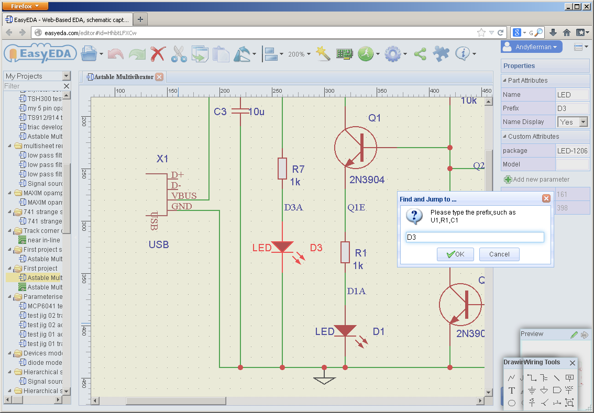

This feature will find, highlight and center in the window, parts by their Prefix (or reference designator).  However, it cannot be used to find net names or other text in a schematic.

 

This is where the Design Manager comes in.

**Super Menu > Miscellaneous > Design Manager...**

The Schematic Design Manager is a very powerful tool for finding **components**, **nets** and **pins**.

Clicking on a Component item **highlights** the component and pans it to the center of the window.

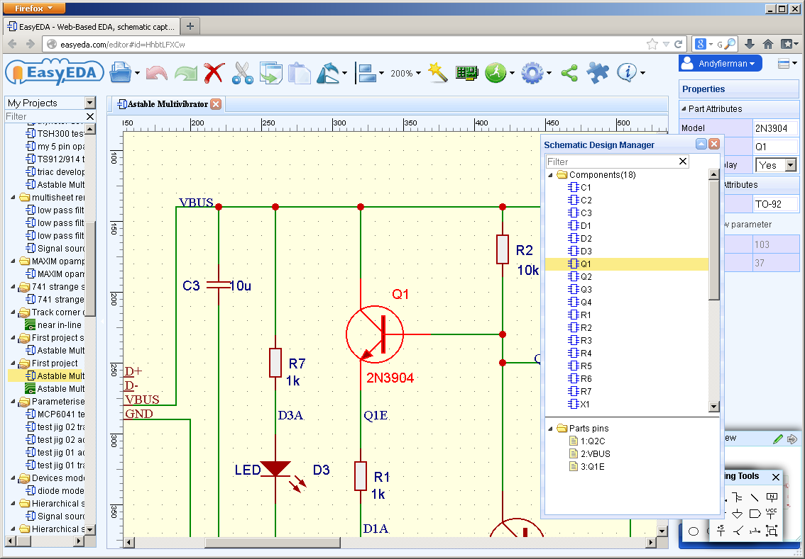

Clicking on a Part pins item brings up a temporary pointer:

 

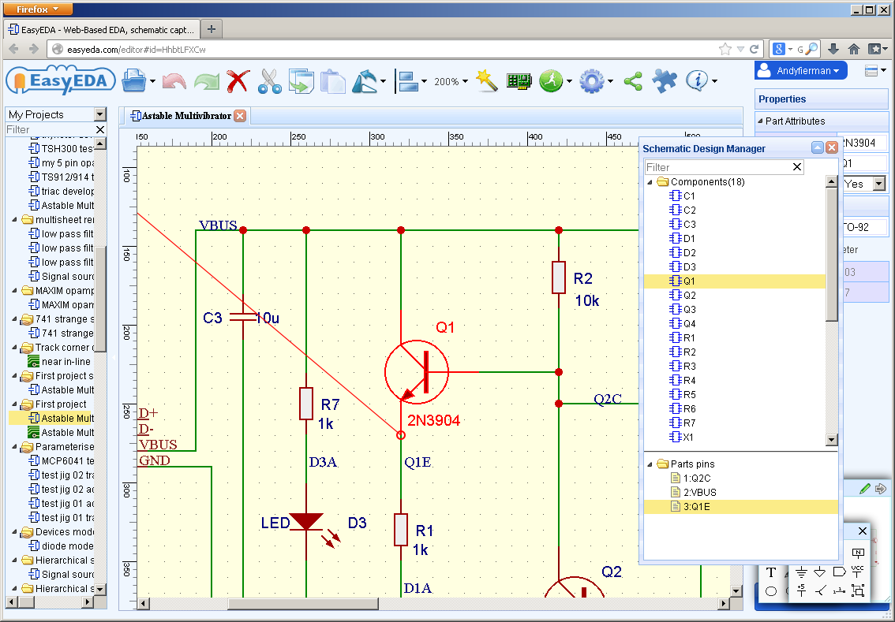

To prepare for the final assembly stage you can create a Bill of Materials (**BOM**) via:

**Super Menu > Miscellaneous > BOM Report...**

and you can produce professional quality SVG, .png or .pdf output files for your documentation.

Schematic Designs can be shared with colleagues and made public using the

**Document > New > Project... > Create a new project**

settings and the right click **Modify** and** Access Control** options and the **Share** button on the top toolbar.

* * * * *

Spice Simulation
----------------

Integrated into EasyEDA is a powerful cloud-based analogue, digital and mixed-signal circuit simulator, based on the Free and Open Source Software [Ngspice](http://ngspice.sourceforge.net/) package. 

As might be expected of an industrial strength simulation tool, EasyEDA comes pre-loaded with an extensive library of spice models, subcircuits and associated symbols. If the part you need is not in the built-in EasyEDA library then it is possible to search for it in user contributed libraries or simply import a standard vendor spice model.

As in simple schematic capture, symbols for new parts can be created from existing parts, quickly built using the Symbol Wizard or drawn from scratch.

A common cause of confusion for people new to circuit simulation is that models may not behave quite like real devices so simulation results may not match their experience of a device in a real circuit. Models often do not simulate fault behaviors such as, for example, the excessive current drains that occur when an opamp input or output is pulled above or below the supply rails or when a supply above the absolute maximum - or even a reverse - voltage is applied.

To avoid some of this confusion, many of the models available in EasyEDA are specially developed to simulate the behavior of real devices.

DC operating point and DC Transfer function analysis data is presented in simple text form in the Simulation Results window:

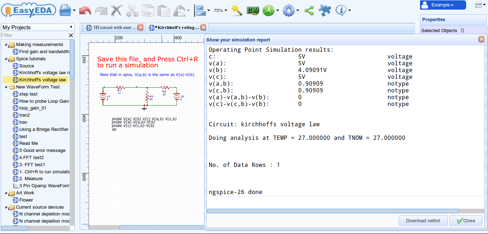

DC Sweep plots, time domain waveform from transient analyses and frequency domain plots - including **FFTs** - from **AC analyses** are presented in the WaveForm viewer window. Axis-aware absolute and difference cursor measurements are shown directly in the window with simple point or point and drag operations. Easy point and drag/redrag/double click actions access zoom/zoom-cancel/zoom-reset operations with auto-Y axis scaling synchronized across all of up to three configurable, user defined plot panes:

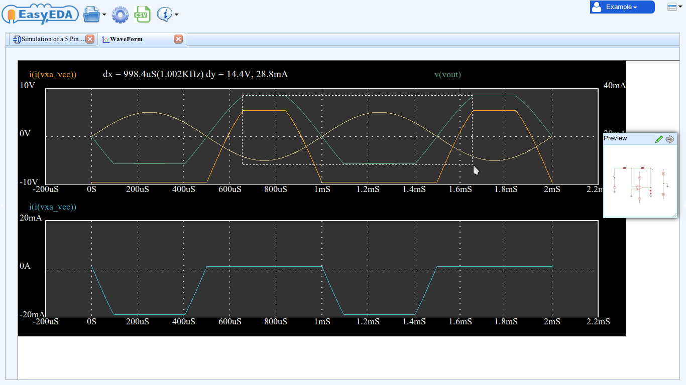

Simple scripting features of Ngspice allow measurements such as calculating the loop gain and **3dB** bandwidth of an opamp circuit directly from the simulation results:

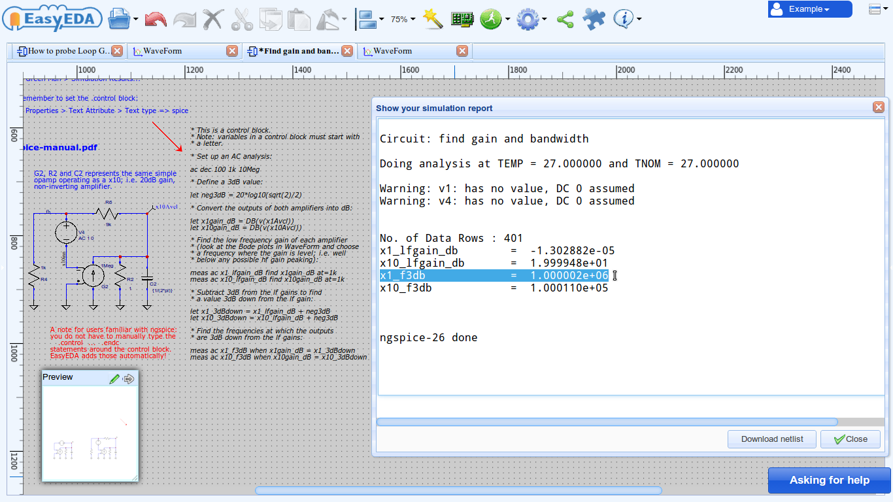

instead of having to use the cursor, noting the results down and then doing the calculations externally:

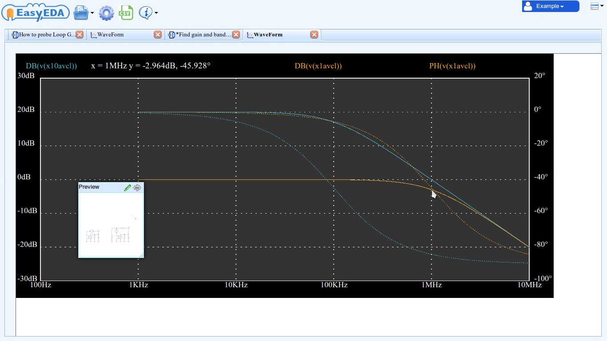

Waveform plot data can be exported in **CSV** format for further analysis and manipulation in external programs such as LibreOffice Calc and Scilab, however a particular feature of EasyEDA is that the Waveform window can not only be saved in an EasyEDA Project but that the plots in a saved Waveform window can be viewed and manipulated in exactly the same way as when they first appear as a result of a simulation. This makes it easy to compare the results from several simulations.

 

Once saved in a Project, a Waveform window can be exported as a .pdf, .png or .svg file in your browser window. This can then be saved to your device so it is easy to create professional quality documentation.

Simulation or “active” schematics can be shared in the same way as non-simulation or “passive” schematics.

You can also generate a **BOM** Report in the same way as for a passive schematic but this may be of limited use since it will contain non-physical components that are for the simulation only and do not form part of the real design.

 

## PCB Design
----------

When you are satisfied with your schematic design and simulation results, you can then quickly proceed to produce your finished and populated PCB without leaving EasyEDA.

EasyEDA’s PCB Design canvas helps you to quickly and easily lay out even complex multilayer designs from schematics you have already created in the Schematic canvas or directly as a layout with no schematic.

Passing an EasyEDA Schematic into the PCB Design editor is as easy as clicking a button: just click the Convert Project to PCB… PCB icon on the top toolbar!

EasyEDA has extensive libraries of footprints. You can also build up your own library of unusual and specialized parts by copying and modifying existing parts or  from scratch using EasyEDA’s powerful footprint creation and editing tools.

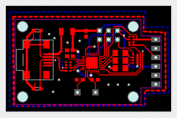

In a similar way to in the Schematic design canvas, to help you locate items and navigate your way around when working in the PCB Design canvas there is a PCB Design Manager.

**Super Menu > Miscellaneous > Design Manager...**

The PCB Design Manager is a very powerful tool for finding components, tracks (nets) and pads (Net Pads).

Clicking on any item highlights the component and pans it to the center of the window.

You can set up layers used in the PCB and their display colours and visibility using

**Super Menu > Miscellaneous > Layer Options... **

The active layer and layer visibility can be selected using the Layers Toolbar.

Default track widths, clearances and via hole dimensions can all be configured in the Design Rule Check dialog which is opened via:

**Super Menu > Miscellaneous > Design Rule Check... **

From first setting up the Design Rule Check (**DRC**) at the start of your board layout, running a DRC is almost the last step in checking your PCB design before you generate **Gerber** and **Drill** files for board manufacture ready to place your order for finished a PCB.

The last step is to check the Gerber and Drill files using an easy to install and use Free and Open Source Software Gerber Viewer, gerbv.

While you are waiting for your PCB to be delivered, you can create a Bill of Materials (BOM) via:

**Super Menu > Miscellaneous > BOM Report...**

and you can produce professional quality SVG, .png or .pdf output files for your documentation.

PCB Designs can be shared with colleagues and made public in the same way as Schematics.

The size of PCB that you can produce using EasyEDA is almost unlimited: designs of over 100cm * 100cm are possible … but you might just need a powerful computer for that.

EasyEDA supports up to 6 layer PCBs by default but it is capable of handling more, so if you need more layers then please contact us as shown in the section on [How to get Help?](#Howtogethelp).

## libraries management

This is the star feature of this version. Lots of our users complained that EasyEDA provides too few components and that these components were not well organized. Thanks to the Free and Open Source Kicad Libs and some Open Source Eagle libs, EasyEDA now has 100,000+ components, which should be enough for most projects.

Now you can enjoy using EasyEDA without having to spend so much time hunting for or building schematic symbols and PCB footprints.

## How to find all those symbols and footprints:

At the bottom of the left hand Navigation panel you will find a button with “More Libraries” ,

Click it, or press the hotkey combination; Shift+F.

   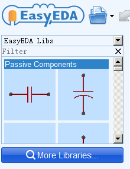

Then you will see a dialog as shown in the image below.

Simply type your part number or footprint to Search.

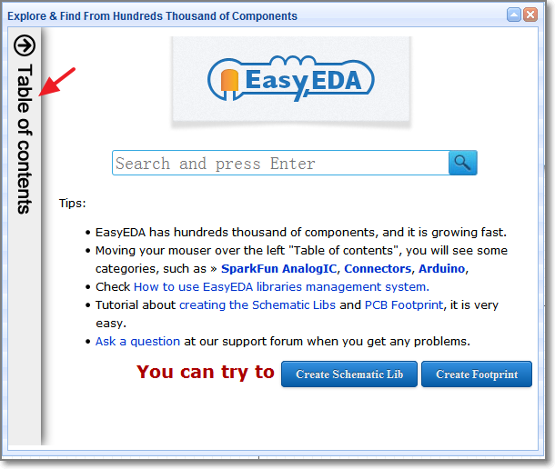

Or, click the “Table of contents” to open the categories list to choose your components. For example, when you click on:

**SparkFunLibs  > AnalogIC**

you will find a dialog opens as shown in the image below:

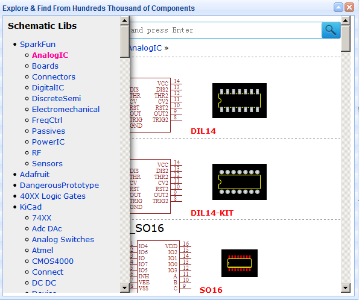

From there you can scroll up and down to browse parts in each category.

Suppose you wanted the find the **MAX232** (which converts signals from an [RS-232](http://www.google.com/url?q=http%3A%2F%2Fen.wikipedia.org%2Fwiki%2FRS-232&sa=D&sntz=1&usg=AFQjCNFt_BArd4HZuR1QqCUxvKGW3ki3UA)  serial port to signals suitable for use in [TTL](http://www.google.com/url?q=http%3A%2F%2Fen.wikipedia.org%2Fwiki%2FTransistor-transistor_logic&sa=D&sntz=1&usg=AFQjCNFoI3eJYGc8PWqUdnfqHGREfTZccw)  compatible digital logic circuits). Simply typing **Max232** into the Search and press Enter Search box:

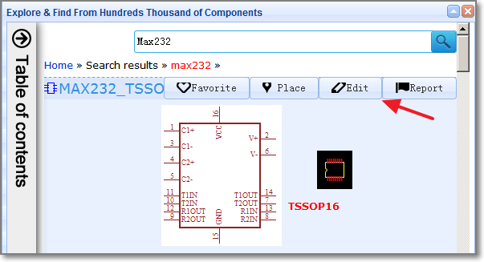

When you hover the mouse over the picture of the Schematic symbol or PCB footprint, you will find a toolbar with “ Favorite”, “Place” ,”Edit”, “Report” buttons.

**Favorite**:

When you find a component which you use frequently, you would be better to Favorite it. This adds it into your Favorite Parts (in the Navigation panel) from where you can place it straight into the editor very easily.

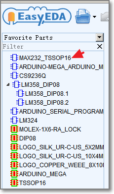

**Place**:

For parts you use infrequently, you don’t need to Favorite them; just Place it into your canvas directly.

Note:

-   EasyEDA supports multi-documents so please make sure that you are placing the part into the right (active) document. The active document is the one with the highlighted tab.
-   You can’t place a Schematic symbol into a PCB file, or a PCB Footprint into a schematic.

**Edit**:

If you want to create your own version of a symbol or footprint then you can open an existing part from the library to use as a template, edit it and then save it to your local My Parts library in the Navigation Panel.

**Report**:

We can’t promise that every component in the library is free of errors so please check all symbols and footprints carefully before you commit to a PCB order.

If you do find a mistake in a component, please let us kno w so that we can fix it.

Components with sub parts (multi-device packages).

When you find a component with sub-parts, you can’t Place or Edit it, but you can Favorite andClone it as your own part, which you can then edit.

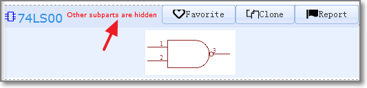

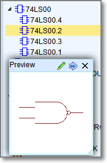

## Design Flow using EasyEDA 

------------------------

## Account Management 

EasyEDA is a web-based service and although you are free to use it in Anonymous mode which you can do without creating an account, you are much better off creating an account to manage your own designs and parts libraries. Creating an account is easy and gives you free access to the full power of EasyEDA for as long as you wish.

### Join

Click on **Join...** the **user management menu:**

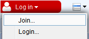

After clicking on **Join**, a very simple **Create an account** dialog opens.

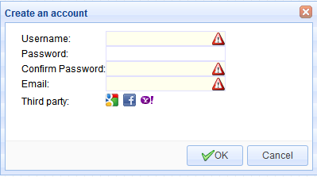

Just enter a username, invent a password, confirm it and type in an email address. A valid email address is needed so that we can send you a confirmation email before we create your account. This is also the address we will use to contact you with information or any questions about your PCB orders.

Alternatively, if you have a Google or Yahoo account, you can login in using [http://en.wikipedia.org/wiki/OpenID](http://en.wikipedia.org/wiki/OpenID); it is safe and easy.

 

### Login

You can then enter the username or email and the password that you used to create your account, to login to EasyEDA. If you use a private device, you can check **Remember Me**, so you don’t need to login again after you open EasyEDA.

At this dialog, you can also login via a Google , Facebook, or Yahoo account.

### Reset Your Password
Your password is encrypted, so EasyEDA team doesn't know it. but you can reset it via your email. Click the **Lost Password** menu and type your email. If you can't get the email after 10 minutes, please send an email to us.
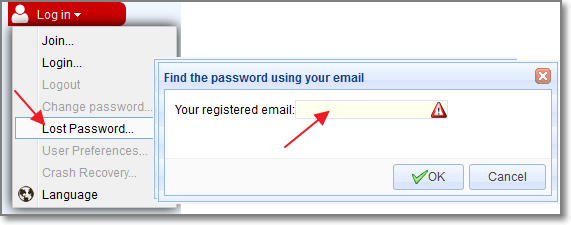

### User Preferences

When EasyEDA shows up the login success popup in the bottom right of the window, your user management menu will be look like this:

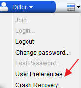

* * * * *

Click on **User Preferences**,

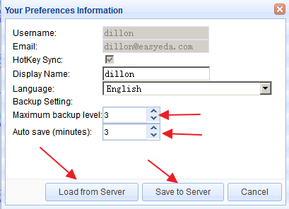

**Maximum backup level**: every open document can be saved at up to this number of different revisions.

**Auto save (minutes)**: this is the time interval between auto saves of all your open documents.

**Save to Server**: Save your preferences (Toolbar configurations, EasyEDA libs, Hotkey settings, language and so on) to the EasyEDA Server.

**Load from Server**: EasyEDA can’t load your Preferences automatically but once you have saved them, you can load them manually. Then, when you change to a different computer or browser, you can load your preferences from the EasyEDA Server.

If you have not saved any preferences then **Load from Server** will have no effect.

 

### Crash Recovery

No operating system, software or network is perfect, so sometimes things can go wrong. Having your Desktop or web browser freeze or your broadband connection drop, two hours into laying out a PCB, could spoil your day.

However, with EasyEDA, your day will be just fine.

This is because EasyEDA auto saves and makes backups of all your open files to your computer so crash recovery is built in to EasyEDA.

In **user management menu**, click on **Crash Recovery**. 

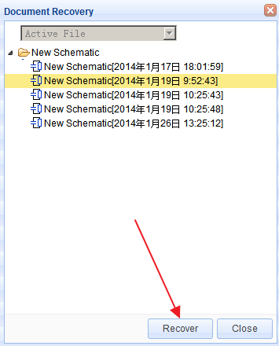

Select the file which you would like to **recover**, then click the Recover button; your file will be opened in a new tab. 

Please note: EasyEDA saves these crash recovery files in your computer and not on the EasyEDA server. Therefore you cannot recover files from a crash on one computer or browser by changing to a different computer or browser.

## Anonymous Files

In Anonymous mode anyone can access to all the features of EasyEDA available to registered users but without the need to create an account to save your designs. Everyone can create and save a schematic, spice simulation or PCB file in Anonymous mode into the Anonymous Files folder, which works like [pastebin.com](http://pastebin.com/). So, if you would rather not register, you can still enjoy the full power of EasyEDA using the unrestricted, Anonymous mode.

Please note: new project folders cannot be created in Anonymous mode.

All anonymous files are unlisted, so if you don’t share the URL of your anonymous files (accessed by clicking on the Share icon), others cannot see them. By sharing your file URL with others then they can view, modify, save and copy your files.

Please note: URL sharing in Anonymous mode is not true collaborative working because anyone with the URL of an anonymous file can edit that file at any time, without having to make a copy of it. Therefore, care must be taken to ensure that only one person is editing a file at any time because the last save by anyone editing that file overwrites all previous saves by anyone else editing it.

The URL of an Anonymous file is the only way that you can find it, so keep a record of the URL of all your Anonymous file if you would like to see them again!

Registered users can also save files as Anonymous files but EasyEDA recommends that you create a Project and save your files under your project.

## Prefix Conflict Error

Sometime, when you convert project to PCB, open the Design manager or run a simulation, you will get a Prefix Conflict error message.

In this schematic, you will find two components with R4 reference designator, so you just need to change one to Rx where x is a unique number in that schematic.

It may be tempting to backup a schematic into the same project as the original, however, if an attempt is then made to do Convert Project to PCB, you will get the Prefix Conflict error for every component.

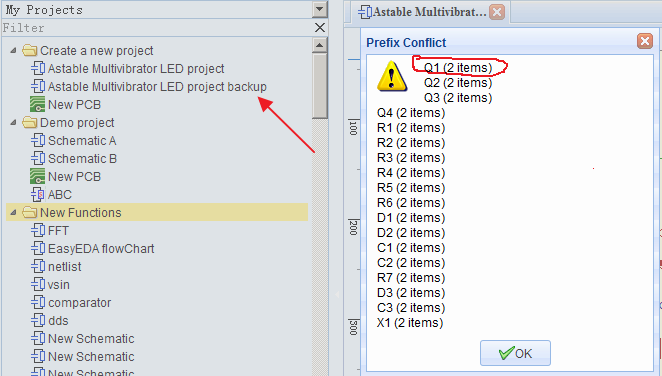

In the above image, you can find the two identical copies of the same schematic, which when you Convert Project to PCB, EasyEDA will try to merge into a single schematic, so every item will have 2 copies. To fix this, you just need to create a backup project and remove - or better still - save backup copies of your schematics to that project.

## Net Name Conflict Error

Sometime, when you convert project to PCB, open the Design manager or run a simulation, you will get a **Net Name Conflict** error message.

In this schematic, you will find four net label/net flag(EasyEDA takes volprobe, GND VCC as netlabel too) in the same wire, So you must remove the others.

If you would like to probe a GND, you can use [Probe command](./spiceSimulation.htm#Probe)

## Hotkeys

After a while using an EDA tool suite, clicking all over the place with a mouse gets very tedious and seriously reduces your productivity. Keyboard shortcuts or Hotkeys avoid much of that. EasyEDA not only provides lots of hotkeys, but also every hotkey can be reconfigured.

Under the Config toolbar:

click the Hotkeys Setting... menu which will open the Hotkey Setting dialog.

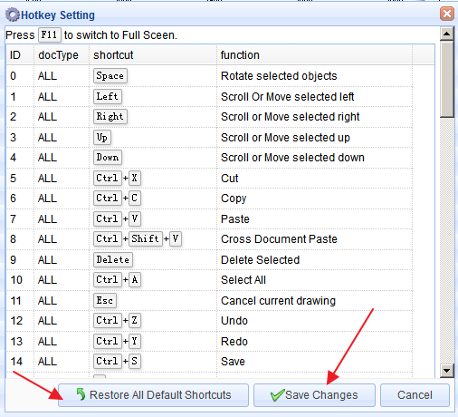

To change a Hotkey, click anywhere in the row for the hotkey you want to change and then press your new key.

For example, if you want to use R as Rotate selected objects, click on the first row, then press `R`.

After you change the hotkey, don’t forget to click Save Changes button.

The **docType** column describes which type of EasyEDA document each hotkey applies to. **docType** has three types:

- **ALL**: any document type in EasyEDA.
- **SCH**: schematic and schematic libs
- **PCB**: PCB and PCB libs.

The functions of some hotkeys may change between docTypes. For example, C, which draws an Arc in SCH, but draws a circle in PCB.

A list of all the available hotkeys is given below. 
<table>
   <tr>
      <td>ID</td>
      <td>docType</td>
      <td>shortcut</td>
      <td>function</td>
   </tr>
   <tr>
      <td>0</td>
      <td>ALL</td>
      <td>Space</td>
      <td>Rotate selected objects</td>
   </tr>
   <tr>
      <td>1</td>
      <td>ALL</td>
      <td>Left</td>
      <td>Scroll Or Move selected left</td>
   </tr>
   <tr>
      <td>2</td>
      <td>ALL</td>
      <td>Right</td>
      <td>Scroll or Move selected right</td>
   </tr>
   <tr>
      <td>3</td>
      <td>ALL</td>
      <td>Up</td>
      <td>Scroll or Move selected up</td>
   </tr>
   <tr>
      <td>4</td>
      <td>ALL</td>
      <td>Down</td>
      <td>Scroll or Move selected down</td>
   </tr>
   <tr>
      <td>5</td>
      <td>ALL</td>
      <td>Ctrl+X</td>
      <td>Cut</td>
   </tr>
   <tr>
      <td>6</td>
      <td>ALL</td>
      <td>Ctrl+C</td>
      <td>Copy</td>
   </tr>
   <tr>
      <td>7</td>
      <td>ALL</td>
      <td>Ctrl+V</td>
      <td>Paste</td>
   </tr>
   <tr>
      <td>8</td>
      <td>ALL</td>
      <td>Ctrl+Shift+V</td>
      <td>Cross Document Paste</td>
   </tr>
   <tr>
      <td>9</td>
      <td>ALL</td>
      <td>Delete</td>
      <td>Delete Selected</td>
   </tr>
   <tr>
      <td>10</td>
      <td>ALL</td>
      <td>Ctrl+A</td>
      <td>Select All</td>
   </tr>
   <tr>
      <td>11</td>
      <td>ALL</td>
      <td>Esc</td>
      <td>Cancel current drawing</td>
   </tr>
   <tr>
      <td>12</td>
      <td>ALL</td>
      <td>Ctrl+Z</td>
      <td>Undo</td>
   </tr>
   <tr>
      <td>13</td>
      <td>ALL</td>
      <td>Ctrl+Y</td>
      <td>Redo</td>
   </tr>
   <tr>
      <td>14</td>
      <td>ALL</td>
      <td>Ctrl+S</td>
      <td>Save</td>
   </tr>
   <tr>
      <td>15</td>
      <td>ALL</td>
      <td>A</td>
      <td>Zoom In</td>
   </tr>
   <tr>
      <td>16</td>
      <td>ALL</td>
      <td>Z</td>
      <td>Zoom Out</td>
   </tr>
   <tr>
      <td>17</td>
      <td>ALL</td>
      <td>X</td>
      <td>Flip Horizontal</td>
   </tr>
   <tr>
      <td>18</td>
      <td>ALL</td>
      <td>Y</td>
      <td>Flip Vertical</td>
   </tr>
   <tr>
      <td>19</td>
      <td>ALL</td>
      <td>G</td>
      <td>Snap</td>
   </tr>
   <tr>
      <td>20</td>
      <td>ALL</td>
      <td>Ctrl+F</td>
      <td>Find Component</td>
   </tr>
   <tr>
      <td>21</td>
      <td>ALL</td>
      <td>Ctrl+D</td>
      <td>Design Manager</td>
   </tr>
   <tr>
      <td>22</td>
      <td>ALL</td>
      <td>D</td>
      <td>Drag Tool</td>
   </tr>
   <tr>
      <td>23</td>
      <td>SCH</td>
      <td>W</td>
      <td>Draw Wire</td>
   </tr>
   <tr>
      <td>24</td>
      <td>SCH</td>
      <td>B</td>
      <td>Draw Bus</td>
   </tr>
   <tr>
      <td>25</td>
      <td>SCH</td>
      <td>U</td>
      <td>Bus Entry</td>
   </tr>
   <tr>
      <td>26</td>
      <td>SCH</td>
      <td>N</td>
      <td>NetLabel</td>
   </tr>
   <tr>
      <td>27</td>
      <td>SCH</td>
      <td>Ctrl+Q</td>
      <td>NetFlag VCC</td>
   </tr>
   <tr>
      <td>28</td>
      <td>SCH</td>
      <td>Ctrl+G</td>
      <td>NetFlag GND</td>
   </tr>
   <tr>
      <td>29</td>
      <td>SCH</td>
      <td>P</td>
      <td>Place Pin</td>
   </tr>
   <tr>
      <td>30</td>
      <td>SCH</td>
      <td>L</td>
      <td>Draw Polyline</td>
   </tr>
   <tr>
      <td>31</td>
      <td>SCH</td>
      <td>O</td>
      <td>Draw Polygon</td>
   </tr>
   <tr>
      <td>32</td>
      <td>SCH</td>
      <td>Q</td>
      <td>Draw Bezier</td>
   </tr>
   <tr>
      <td>33</td>
      <td>SCH</td>
      <td>C</td>
      <td>Draw Arc</td>
   </tr>
   <tr>
      <td>34</td>
      <td>SCH</td>
      <td>S</td>
      <td>Draw Rect</td>
   </tr>
   <tr>
      <td>35</td>
      <td>SCH</td>
      <td>E</td>
      <td>Draw Ellipse</td>
   </tr>
   <tr>
      <td>36</td>
      <td>SCH</td>
      <td>F</td>
      <td>Freehand Draw</td>
   </tr>
   <tr>
      <td>37</td>
      <td>SCH</td>
      <td>T</td>
      <td>Draw Text</td>
   </tr>
   <tr>
      <td>38</td>
      <td>SCH</td>
      <td>I</td>
      <td>Edit Selected Symbol</td>
   </tr>
   <tr>
      <td>39</td>
      <td>SCH</td>
      <td>Ctrl+R</td>
      <td>Run the Document</td>
   </tr>
   <tr>
      <td>40</td>
      <td>PCB</td>
      <td>W</td>
      <td>Draw Track</td>
   </tr>
   <tr>
      <td>41</td>
      <td>PCB</td>
      <td>U</td>
      <td>Draw Arc</td>
   </tr>
   <tr>
      <td>42</td>
      <td>PCB</td>
      <td>C</td>
      <td>Draw Circle</td>
   </tr>
   <tr>
      <td>43</td>
      <td>PCB</td>
      <td>N</td>
      <td>Draw Dimension</td>
   </tr>
   <tr>
      <td>44</td>
      <td>PCB</td>
      <td>S</td>
      <td>Draw Text</td>
   </tr>
   <tr>
      <td>45</td>
      <td>PCB</td>
      <td>O</td>
      <td>Draw Connect</td>
   </tr>
   <tr>
      <td>46</td>
      <td>PCB</td>
      <td>E</td>
      <td>Draw copperArea</td>
   </tr>
   <tr>
      <td>47</td>
      <td>PCB</td>
      <td>T</td>
      <td>Change To TopLayer</td>
   </tr>
   <tr>
      <td>48</td>
      <td>PCB</td>
      <td>B</td>
      <td>Change To BottomLayer</td>
   </tr>
   <tr>
      <td>49</td>
      <td>PCB</td>
      <td>1</td>
      <td>Change To Inner1</td>
   </tr>
   <tr>
      <td>50</td>
      <td>PCB</td>
      <td>2</td>
      <td>Change To Inner2</td>
   </tr>
   <tr>
      <td>51</td>
      <td>PCB</td>
      <td>3</td>
      <td>Change To Inner3</td>
   </tr>
   <tr>
      <td>52</td>
      <td>PCB</td>
      <td>4</td>
      <td>Change To Inner4</td>
   </tr>
   <tr>
      <td>53</td>
      <td>PCB</td>
      <td>P</td>
      <td>Place Pad</td>
   </tr>
   <tr>
      <td>54</td>
      <td>PCB</td>
      <td>V</td>
      <td>Place Via</td>
   </tr>
   <tr>
      <td>55</td>
      <td>PCB</td>
      <td>M</td>
      <td>Measure</td>
   </tr>
   <tr>
      <td>56</td>
      <td>PCB</td>
      <td>L</td>
      <td>Change Route Angle</td>
   </tr>
   <tr>
      <td>57</td>
      <td>PCB</td>
      <td>-</td>
      <td>Decrease Routing Width</td>
   </tr>
   <tr>
      <td>58</td>
      <td>PCB</td>
      <td>+</td>
      <td>Increase Routing Width</td>
   </tr>
   <tr>
      <td>59</td>
      <td>PCB</td>
      <td>Alt+-</td>
      <td>Decrease Snap Size</td>
   </tr>
   <tr>
      <td>60</td>
      <td>PCB</td>
      <td>Alt++</td>
      <td>Increase Snap Size</td>
   </tr>
   <tr>
      <td>61</td>
      <td>PCB</td>
      <td>H</td>
      <td>Highlight Net</td>
   </tr>
   <tr>
      <td>62</td>
      <td>PCB</td>
      <td>Shift+M</td>
      <td>Remove All Copper Area</td>
   </tr>
   <tr>
      <td>63</td>
      <td>PCB</td>
      <td>Shift+B</td>
      <td>Rebuild All Copper Area</td>
   </tr>
</table>

## Basic Driving Skills.
 

To use EasyEDA, you need to be familiar with a few basic terms and concepts. The best way to learn them is to open up EasyEDA, open a new schematic:

**Document > New > Schematic **

and play!

### 1. Left clicking

Similar to other EDA software: 

-   Click on an item to select;
-   If over a selected item, click and hold to drag a selected item
-   If not over a selected item, click and hold creates a selection box;
-   Creating a selection box, using click and drag to the right, selects everything inside the box;
-   Creating a selection box, using click and drag to the left, selects everything inside and intersected by the box;
-   Double click on a text area to edit;
-   The exact left click usage depends on what item is being selected and in what Canvas the item exists (Schematic or PCB).

### 2. Right clicking

EasyEDA does not support right click context menus in the Schematic or PCB Canvas. Instead, right clicking executes a context sensitive command:

-   when you are placing a symbol, after a right click, the active symbol will be removed;
-   when you are drawing a shape such as a polyline, after a right click, the polyline will be stopped at the place where you right click but the mouse will remain as a **cross**, so you can draw another shape;
-   to get out of the current active context sensitive command such as  placement or drawing mode and go back to **select mode**, just double right click.

**Ctrl+Right** click anywhere in the Schematic, waveForm or PCB Canvas drags the canvas around within the EasyEDA window.

### 3. ESC key

Pressing the `ESC` key ends the current drawing action but does not exit the current active context sensitive command mode (i.e. it does not return the cursor to select mode).

### 4. Select more shapes

-   Ctrl+left click items adds those items to your selection;
-   Click and hold creates a selection box;
-   Creating a selection box, using click and drag to the right, selects everything inside the box;
-   Creating a selection box, using click and drag to the left, selects everything inside and intersected by the box;

### 5. Zoom in and Zoom out

-   Using the middle mouse button:
-   Roll forward to zoom in; 
-   Roll back to zoom out;
-   Using hotkeys, the default hotkey `A` for zoom in, `Z` for zoom out.

   

Please note: do not roll your mouse at the same time as pressing the CTRL key. Some browsers will zoom the whole site, not just the canvas in the EasyEDA window. If this happens, just press `Ctrl+0` to reset the browser zoom.

 

### 6. Double clicks

Double clicking any text area opens a resizable text box to allow you edit the text inline.

Press enter to create new line. Click outside the text box to close it.

### 7. Pan

-   Right click anywhere in the Schematic, WaveForm or PCB Canvas and Hold down right button to drags the canvas around within the EasyEDA window.
-   If your canvas is bigger than the EasyEDA window and is showing scroll bars, you can use either the scroll bars or the Arrow keys to scroll the canvas to pan.
-   When drawing a wire, a graphic line or shape that you wish to extend beyond the edge of the EasyEDA window holding down the left mouse button after starting the line will pan the canvas to keep the drawn item inside the window.

### Project concept

The Project concept is important in EasyEDA because it is the foundation of how to organise your designs.

After login, you can create a new project:

**Document > New > Project**

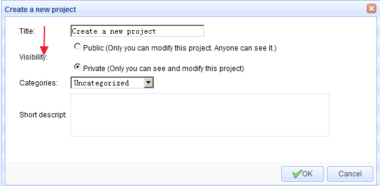

Give it a title: this will show in the project tree in the left hand panel.

You can make your project public or private by setting it’s Visibility.

If you choose to make you project Public, Categories allows you to select which category you want your project to be listed under on our website. If you keep your project private then the category is still applied but has no direct use in sorting your projects because this field is not searched in the Filter box in the left hand panel.

Adding a short description helps you and anyone you are sharing this project with, understand what the project is about.

Once created, to modify your project, right click on it in the project tree in the left hand panel,

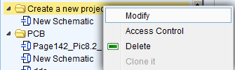

then click Modify:

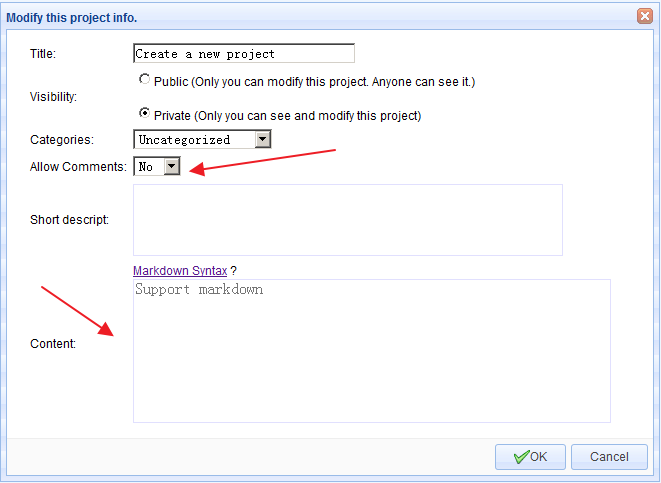

From here, your can change the Visibility, allow other people to comment on your project and type a more detailed description of the project content. To help you make your project stand out or to maybe simply to make a detailed description of your project easier to read, you can use Markdown syntax. If you need more information on Markdown syntax, click on Markdown Syntax? just above the Content box.

### Rotate

After selecting one or more items, you can rotate the selected items using:

Rotate and Flip > Rotate Left or Rotate Right

from the toolbar or by pressing the default rotate hotkey:`Space`.

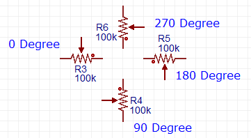

Please note that rotating a multiple selection rotates each item about its own symbol origin. It does not rotate the items about the centroid of the group of items.

### Flip

To place a Q2 as shown in the schematic below you need to Flip the item.

You can Flip one or more selected items using:

Rotate and Flip > Flip Horizontal or Flip Vertical

from the toolbar or by pressing the default flip hotkeys: `X` to Flip Horizontal, `Y` to Flip Vertical.

### Bring to Front and Send to Back

In the image below, both the rectangle and the ellipse are filled.

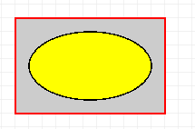

If you draw the ellipse before drawing the rectangle, the rectangle will overlap and therefore hide the ellipse. To reveal the ellipse, select the rectangle and then use:

**Align > Send to Back**

from the toolbar.

To bring the rectangle to the front again, you could select it and use:

**Align > Bring to Front**

or select the ellipse and then use:

**Align > Send to Back**

### Add Images to EasyEDA

When you select Image from the Drawing Tools palette, an image placeholder will be inserted into the canvas:

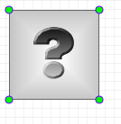

Select the placeholder, so you can see the image’s attributes in the right hand Properties panel:

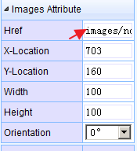

Set Href to the link to your image. For example, setting Href to:

[http://upload.wikimedia.org/wikipedia/commons/thumb/c/c7/555_Pinout.svg/220px-555_Pinout.svg.png](http://upload.wikimedia.org/wikipedia/commons/thumb/c/c7/555_Pinout.svg/220px-555_Pinout.svg.png)

will make your image look like this:

Please note: at present, EasyEDA cannot host images, so you need to upload your images to an image sharing site such as [http://www.imgur.com](http://www.imgur.com).

### Saving Your Work Locally

Although EasyEDA saves all your files on our Server, sometimes you may want to save your work locally and EasyEDA provides a hack way to do this.

**Document > EasyEDA source **

or

**Super menu > File > EasyEDA source**

You will find a dialog like this:

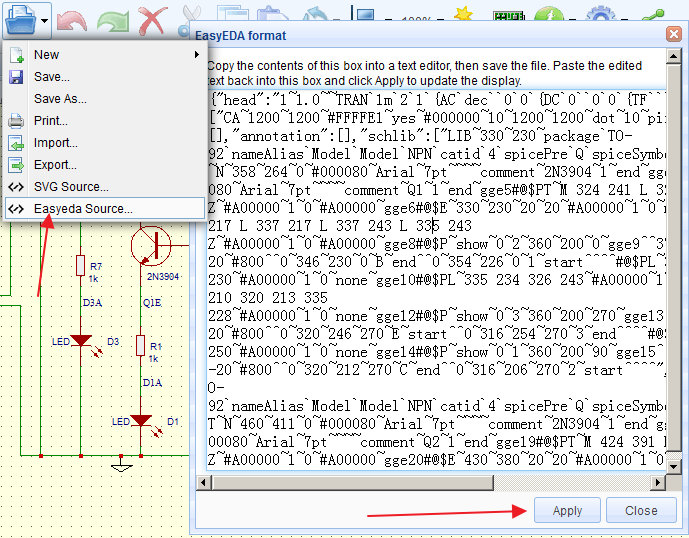

Copy the contents of this EasyEDA source into any text editor, then save the file. You can paste the text back into this box and click Apply to update the display. if you have made no changes to the text then the canvas will show your file exactly as if it was saved and reopened from the EasyEDA server.

This is a good way to share/backup your works. Your file doesn’t need to be saved to EasyEDA’s server. It can be highly compressed in any readily available format such as such as zip or 7z. It can be emailed to anyone who can then open it in EasyEDA without worrying if they have the same libraries as you.

###  EasyEDA Source

EasyEDA Source is a **JSON** file which can be read by many other programs. Please see:

[http://en.wikipedia.org/wiki/JSON](http://en.wikipedia.org/wiki/JSON)

for more information.

The open EasyEDA Source file allows you to work on files at a text level which enables some powerful ways to manipulate schematic and spice files and symbols as well as PCB files and footprints.

EasyEDA team will provide more details of the EasyEDA Source soon to show how you can edit and even create drawings, schematics, symbols, footprints and PCB layouts in EasyEDA Source. It is also possible to copy and edit symbols straight out of a Schematic and save them as new Schematic Lib or Spice Symbols and even to create a new Spice Subckt from a Schematic.

## The Clean EasyEDA UI
 

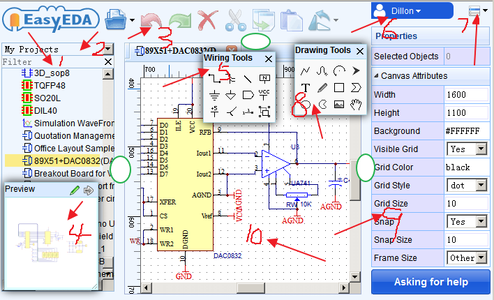

### Resizing the canvas area

Hovering the mouse cursor over the areas indicated by the three green ellipses will bring up blue toolbar toggle arcs. Clicking on them will toggle the visibility of their associated top, right and left toolbar areas to expand the canvas area. The left hand arc can also be dragged horizontally to resize the left hand panel.

### 1. Filter

Using the Filter, you can  quickly and easily find projects, files, parts and footprints from anything listed in the left hand panel, just by typing a few letters of the title. For example, if you want to find all files containing “NE555” in the title, just type “555”, it is non-case-sensitive.

Filter only searches project, file and part titles and names. It does not search the Description and Content fields.

Click the X to clear the filter.

### 2. Navigation List

The Navigation List is very important for EasyEDA: it is from here that you can find all your projects, files, parts and footprints.

In particular, in EasyEDA Libs, you will find lots of components complete with simulation models, many of which have been developed for EasyEDA to make your simulation experience easier.

The System IC libraries contain schematic symbols and PCB footprints for many readily available components and projects.

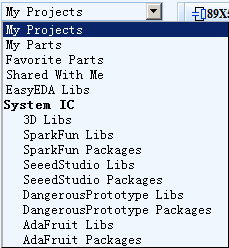

Except for System IC, these options have a content menu. For example, if you drop down to My Projects and right click an item, you will get a tree menu like :

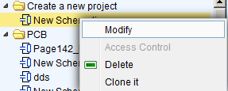

### 3. ToolBar

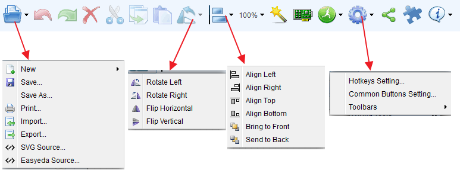

EasyEDA’s toolbar can be reconfigured via Common Buttons Setting…

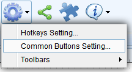

The configure dialog is also easy to use:

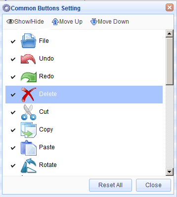

Click on a button to select it. Then you can toggle button visibility by clicking on Show/Hide or by clicking on the tick space to the the left of the button icon. You can change the button position using Move up and Move Down.

Many of the buttons have been assigned with hotkeys, so you can use those to replace the button actions.

### 4. Preview Dialog

The Preview dialog will help you choose components and packages and can help to to identify schematics and PCB layouts.

The Preview Dialog has a resizing handle in the bottom right corner.

The Preview Dialog can’t be closed but double clicking on the top banner will roll up the panel. Double clicking again toggles it back to the selected size.  

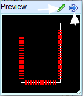

Clicking on the little green pencil edit tool opens the item in the preview for editing. Clicking on the blue arrow place tool in the top right corner of the preview dialog places the item onto the canvas. Placement is document type sensitive and will warn you if, for example, you try to place PCB footprint into a schematic.

### 5. Wiring Tools

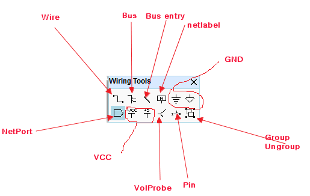

Tools are document type sensitive: different document types have different tools.

If you have hidden your tools , you can open them from here:

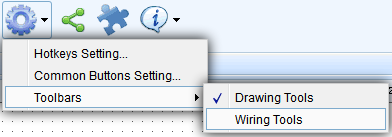

All of the commands in Wiring Tools are electronics related. Don’t use a wire when you just need to draw a line, shape or an arrow: use Drawing Tools instead.

### 6. User management menu

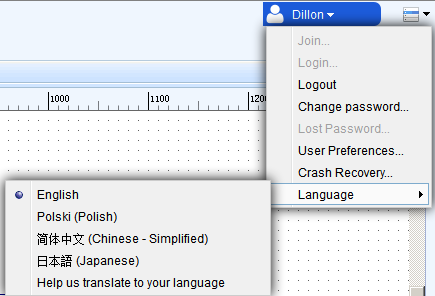

### 7. Super menu

All EasyEDA’s menus can be found at here. Most of the time, we hope you can access these options via the Hotkeys or from the top toolbar but if you find that you use some of the more specialised options from this menu frequently then may want to set them as you own hotkeys.

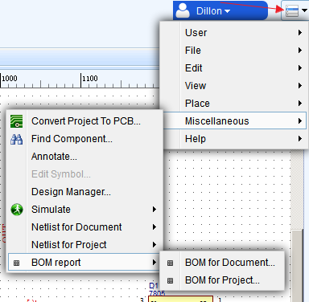

### 8. Drawing Tools

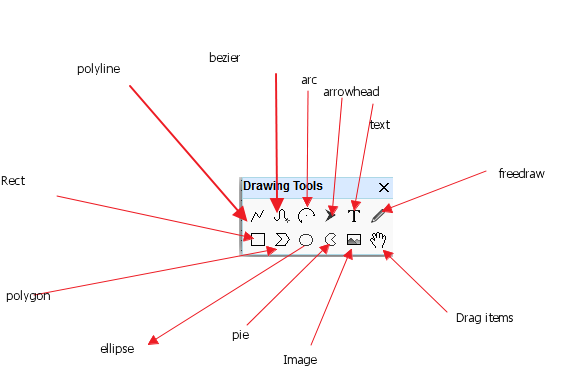

To keep EasyEDA’s UI clean and sharp, the Wiring and Drawing tools palettes can be resized horizontally, rolled up or hidden so if you want to focus on drawing, you can roll up or hide the others to make more space and reduce the clutter.

### 9. Canvas Attributes

You can find the canvas Properties setting by clicking on any the blank space in the canvas.

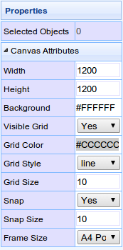

Background and grid colours and the style, size, visibility and snap attributes of the grid can all be configured.

The canvas area can be set directly by the Width and Height or preset frame sizes are available.

### 10. Canvas

This where it all happens! This the area where you create and edit your schematics, PCB layouts, symbols, footprints and other drawings, run simulations and display WaveForm traces.

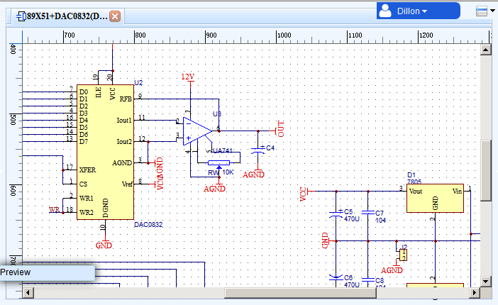

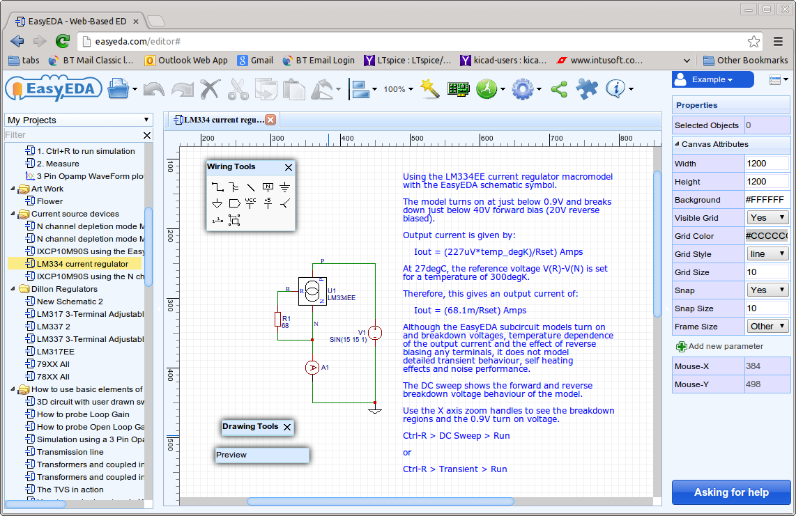

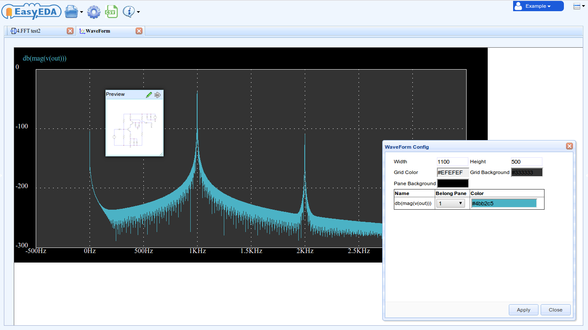

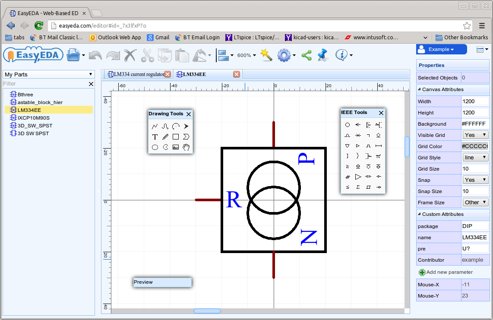

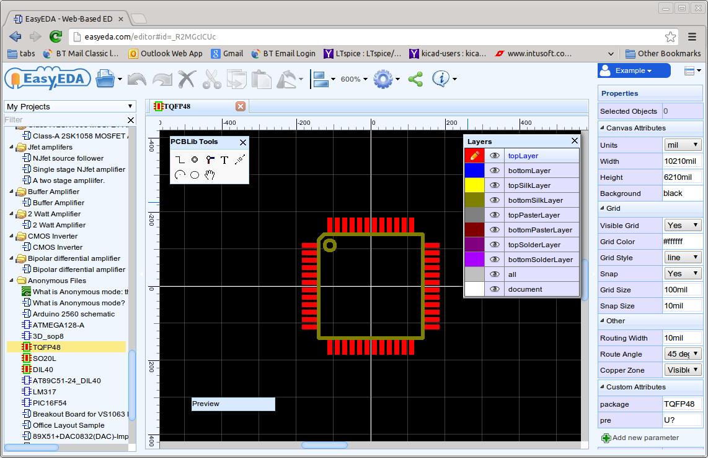

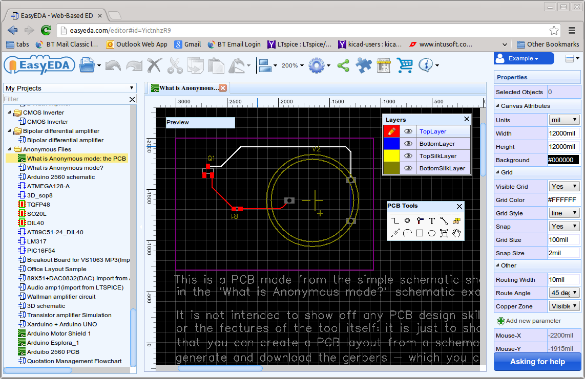

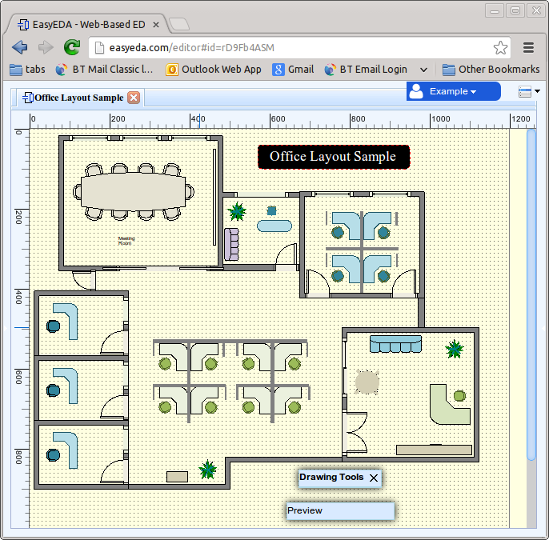

## How to upgrade to the latest version of EasyEDA 

You really don’t need to know how to upgrade EasyEDA, because EasyEDA can seamlessly upgrade itself. However,EasyEDA uses an App Cache technique to allow you to use EasyEDA offline ([W3C HTML5 Offline Web Applications](http://dev.w3.org/html5/offline-webapps/) which may delay the automatic upgrading process.  Therefore, if you want toupgrade to the latest version immediately, you can follow bellow two simply steps.
 

1. Check the About... dialog; 

2. If the Built Date is older than 03/25/2015:

Close your browser open EasyEDA again.

If the Built Date is still showing older than 03/25/2015:

Close your browser and open EasyEDA again.

If the Built Date is at or newer than 03/25/2015, you don’t need to do anything.
Note **03/25/2015** is just an example
If those two steps can't work, you may need to .

**1.Mozilla Firefox**
-  Go to “Preferences… > Advanced > Network > Offline Storage”
-  Click on “Clear now”
-  reload easyeda again.
    
  

**2.Chrome**
-   Open the following URL: chrome://appcache-internals/ 
-  Look for easyeda.com and click “Remove”
-  reload easyeda again.
    
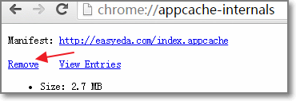  

Please email to  when you need any help.
## How to get help?

It is easy to ask for help for any aspect of EasyEDA: just click on Asking for help then complete and Submit the Support request:

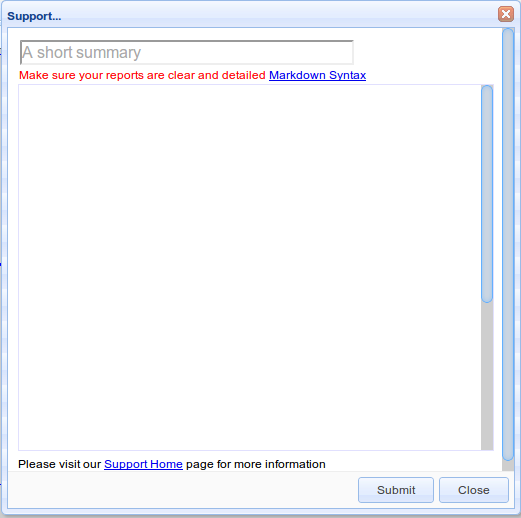

Please ask your questions in English or Chinese and don’t worry if your English is not good! (Or your Chinese!)

1.  You can also ask your questions directly in the [EasyEDA forum](https://easyeda.com/bbs_lists_2.htm). We will try to respond to every post but please be patient. Maybe EasyEDA team is in a different timezone and we are a quite bit busy, so you may need to wait for a while.
2.  If you don’t want your help requests to be public then you can drop us an email to [support@easyeda.com](mailto:support@easyeda.com)
3.  If maybe you have a design that you know worked in some other EDA package and you are having problems importing it to EasyEDA, let us know and we will take a look and try to help you to fix them.

The easiest way to do this is to open Access Control for your Project and Add User [support@easyeda.com](mailto:support@easyeda.com) as a user with Read/Write permissions: 

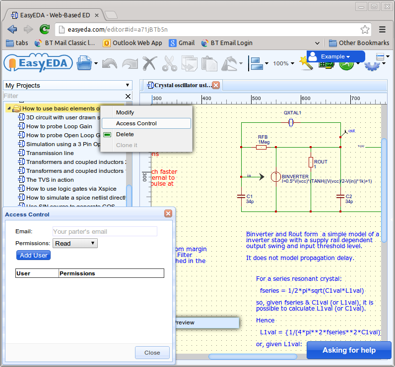

Please note that EasyEDA team may not have the time or resources to help you fix all your problems; we may just be able to help you to fix problems commonly encountered by newbies, such as using a drawing polyline in place of a wire, finding a spice model for a simulation or selecting the right PCB footprint.

[[1]](#ftnt_ref1) Please note that although some browsers or plug-ins allow you to use gestures, EasyEDA does not work with gestures, so you should disable this function.

[[2]](#ftnt_ref2) Simultaneous editing is not yet fully supported: care must be taken because the last save by any collaborator overwrites all previous saves.

[[3]](#ftnt_ref3) It can also find the value text but it cannot step through multiple components with the same value.

[[4]](#ftnt_ref4) Take a few moments to think about your username because this is the name that other users will see on your designs and posts if you choose to share them or make them public. Once you have created an account, you cannot change your username.

[[5]](#ftnt_ref5) You can use upper and lower case letters, numbers and symbols to make a strong password but don’t forget that the password entry is case sensitive.

[[6]](#ftnt_ref6) except ordering of PCBs directly from EasyEDA.

[[7]](#ftnt_ref7) If you always open EasyEDA in the same browser on the same machine, your Anonymous files will appear under the Anonymous Files folder in the left hand panel but you should not rely on this as a way of keeping track of Anonymous files.