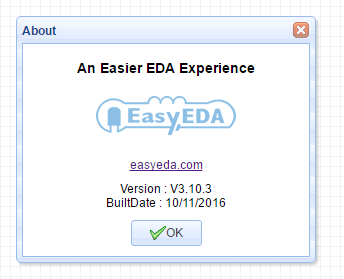
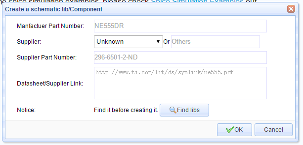
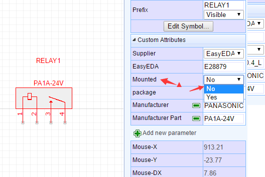
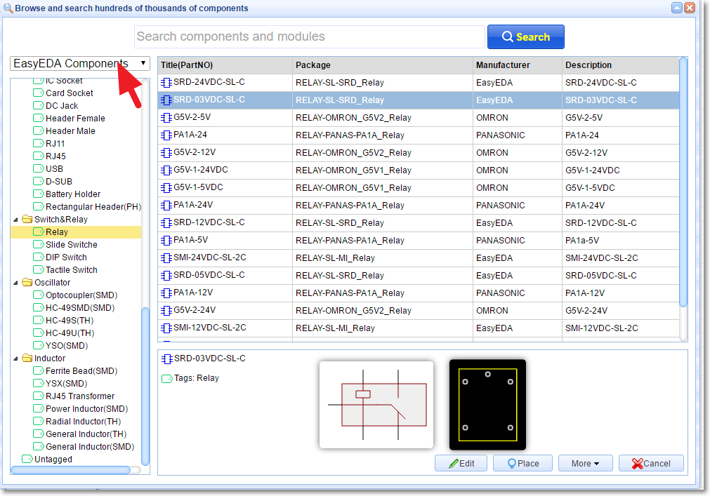
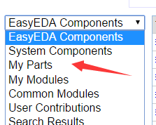
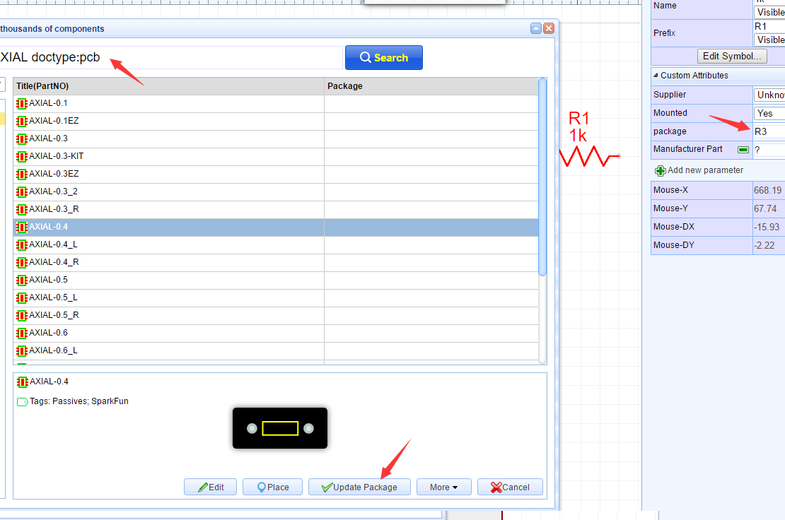
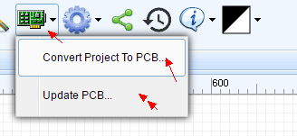
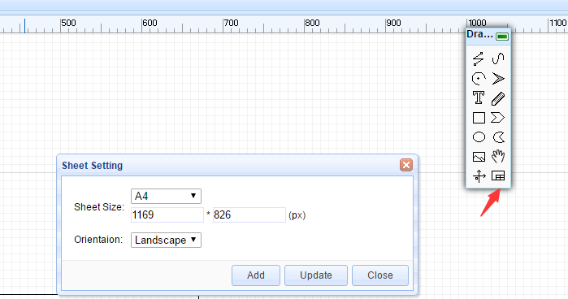
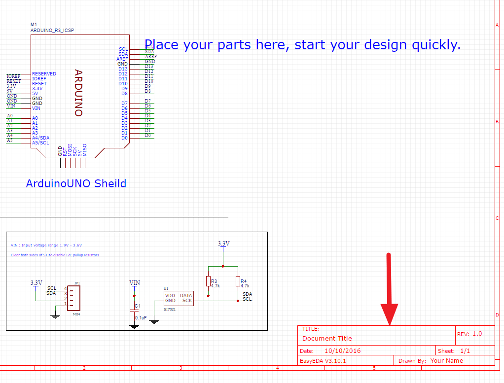

# What is new in the V3.10.X  
 

The new version EasyEDA, V3.10.x. introduces lots of new features. Try it at [https://easyeda.com/editor](https://easyeda.com/editor).

 

##Better Mac User Experience 
*Please note that when running EasyEDA on a Mac, for the best user experience, we recommend using Chrome instead of Safari.*

**1. Pan**
 
 **When Using the Mouse**
Hold down the right click and move your mouse and the canvas will pan with the cursor.

Before using the Magic Mouse, you need to enable the right click function via this video. https://www.youtube.com/watch?v=ekzIoAxXSHE,

**When Using the Touchpad **
Hold down the `SHIFT` key then move a single finger: the canvas will pan horizontally.
 
Hold down the `CONTROL` key then move a single finger: the canvas will pan vertically. 

**2. Zoom**

 **When Using the Mouse**
Scroll the middle button of the mouse (or Magic mouse).

 **When Using the Touchpad **
Sliding a single finger up zooms in and sliding down zooms out.

## New Pad attribute.
New `Slot` and `Plated` attributes have been added for the hole in a pad as illustrated in the image below

## Components 
The component search function has been significantly improved to make finding part symbols and footprints quicker and easier. Press hot key `SHIFT+F` or click it via toolbar  
In the new components dialog, it is easy to select the right components via tags and you can set tags for your own components.

### New Dialog
When creating a schematic lib, there is an input dialog for entering sourcing information, such as supplier information, supplier part number and datasheet. Information can be added at the time the schematic lib is created or these steps can be skipped at this stage and add these later.

 

### New Component attribute
  The new version of EasyEDA adds a `Mounted` attribute at the component, to simplify the identification and kitting of optional components which may be fitted in one assembly but not in another. This attribute  can be set to `YES` to list the part in the BoM. If the `Mounted` attribute is set to `NO` as illustrated in the image below then the part will not be listed in the BOM.
  
 

### Components search dialog
If the `EasyEDA Components` option is selected, then a dialog opens as illustrated in the image below.

  
 
EasyEDA team has spent a lot of time to build these `EasyEDA Components` components and packages and we recommend them as preferred components, because the packages have been carefully checked and verified, the footprints have been designed for reliable soldering by our PCB manufacturing and because these components can all be ordered directly from EasyEDA.

There are several other categories to explore but these components may need more carefully checking or may be a little harder to source.

   

## New search filter
When updating a package, using new filter terms, it is now possible to search only for a symbol or only for a package/footprint. For example in the filter entry below: 

`AXIAL doctype:pcb` 

the filter term:

`doctype:pcb` 

will just search for a PCB package with the name AXIAL.

Similarly, the filter term:

  `doctype:sch` 
  
 will just search for components (symbols) without listing packages.

  
 
 
## Synchronous schematic and PCB
Converting a schematic to PCB can be done using the `Convert Project to PCB...` button as illustrated in the toolbar below but a new `update PCB` button has been added so that modifications to the schematic can immediately be passed forward to update the a selected PCB without having the PCB editor window already open. 
   

 ## Add Frame
It is now possible to add design notes to the frame and the frame selection, for example A4, can assist in aligning and improve the look of printed schematics and PCB designs. 

click the frame button like bellow image

As illustrated in the image below:

 
 
 the bottom right zone can be selected and dragged or the frame can be dragged and deleted.

## Hide the simulation button
EasyEDA's simulation function is powerful but it is not easy to use. Many of our users run a schematic which, for example, may include symbols or blocks - such Wifi modules, MCU, DSP and ADC devices - for which no simulation models exist. This can be very discouraging and frustrating, especially for users that are new to simulation and - because it is a CPU intensive task - at the same time can also waste lots of CPU resource at the expense of other tasks such as autorouting and rendering on larger PCBs.

To reduce the casual use of simulaton we have taken the decision, not to remove it but to simply hide the simulation button from the tool bar. Simulations can still be constructed and saved exactly as before but they can now only be run using the CTRL+R to run the simulation and we strongly recommend first studying - and trying out the many examples in - the EasyEDA Simulation eBook. 

## Desktop version coming soon

EasyEDA will provide a desktop version for offline use. 

We hope you enjoy the new version! 

And as always, if you have any questions or suggestions, do let us know.

 
 

 
