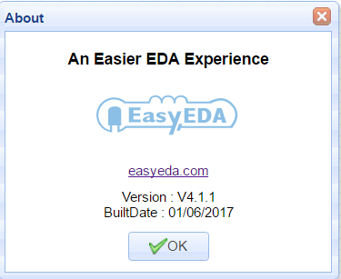
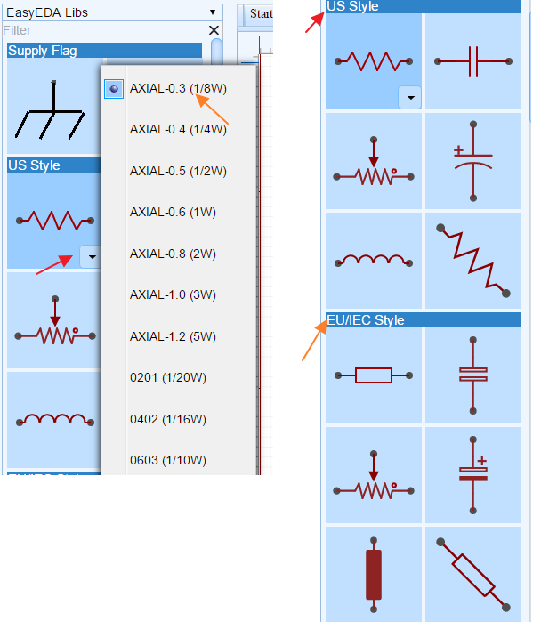
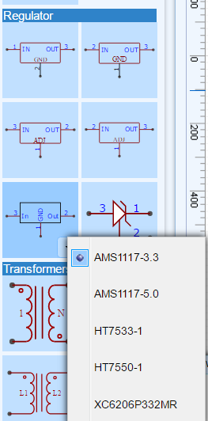
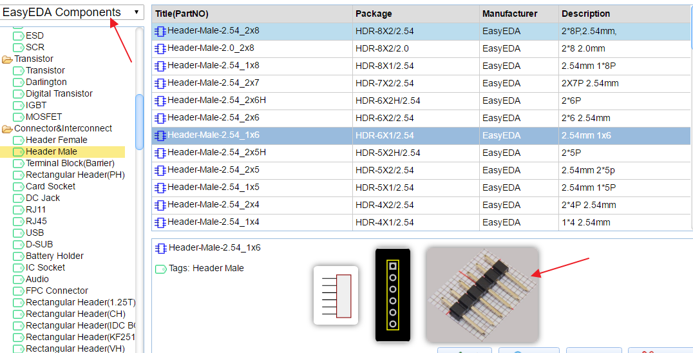
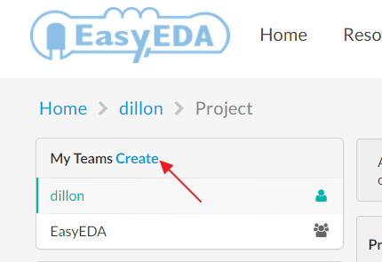
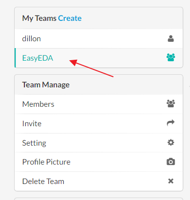
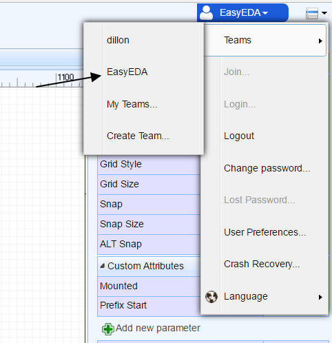

# What is new in the V4.1.1.X  
 

After 7 years of development, EasyEDA are pleased to announce the new version: V4.1.1. which introduces many new features.   Try it at [https://easyeda.com/editor](https://easyeda.com/editor).

 
 

## EasyEDA ambitions in 2017
**1. Provide components ordering with your PCB.**
   So you can not only order your PCB from us; you will also be able to order many common components directly from us. We will ship the components with your PCB so saving you lots of time and money because there's no need to hunt for components and compare pricing from big name suppliers.

**2. Provide PCB assembly service.**
  For a long time, EasyEDA has been able to provide a PCB assembly service but up to now just a few customers who chat with us via email know about this service. In 2017, we will make this service public. So after you design the PCB, we will not only help you to source the components but we will kit and assemble them onto your PCB before shipping the completed PCBs to you. That way, you can focus more of your time and effort into the design and debug tasks.

##New EasyEDA libs
 From this version, we have changed the EasyEDA Libs to try make it easier to find, place and order components and to make schematic conversion to PCB simpler. Placing any component from the EasyEDA Libs into a schematic will therefore also automatically complete the PCB package and all the required BoM information fields.
 
 For Resistor, Capacitor, Inductor symbols, EasyEDA now provides the components with package selection and provides dedicated **US styles** and **IEC styles**
 
  

For other common parts such as discretes and ICs, we now provide symbols for components with specific packages and which can be ordered from EasyEDA.

 

For the Connector section,
 EasyEDA now provides Header-Male, Header-Female, Screw Terminal, IDC box, RJ45, RJ11, USB and audio interface. All of these components can be ordered straight from EasyEDA with your PCB.
 
* Note however that this is a big change from the earlier versions of the EasyEDA Libs because from V4.1.1 most of the non-passive components in the EasyEDA Libs will no longer have spice models attached to them.

Schematic symbols with spice simulation models attached to them can now be found using the **More Libraries...** button (or SHIFT+F) under **System Components > Spice Simulation**

So, you do need to spend some time to explore these changes.

##  Images for EasyEDA components.
Sometimes, it can be hard to visualise what a component really looks like just from package or schematic symbols, so now we provide real product images, photographed against a 1mm grid for reference, 

  

## Work as a team 
Before EasyEDA version V4, if you wanted to work together with your partners, you had to use the [Access Control](https://easyeda.com/Doc/Tutorial/share.htm#Access-Control) function. 

Access Control has lots of limitations on who can create projects, schematics and PCBs and more importantly, when you try to convert your schematics to PCB, you may find that some packages create error messages which can be hard to track down.

Now EasyEDA provides a new team feature with which you can work seamlessly with your partners. You can work as if everyone is logged in under the same account, with full access to all components, Schematics, PCBs and Projects.

### How to find the team function.
 Under the [dashboard](https://beta.easyeda.com/projects/mylists) , there is a team section.
 
    

### How to create a team.
   There is a link as shown in the image above, or click[ this link](https://beta.easyeda.com/teams/create) after you login.

### How to switch to team model.

1) switch in the dashboard.
  After you have created a team, click the team name and the dashboard will switch to showing only the team projects, files and components.
  
  
 
After switching to a team, there is a team management section where you can manage your team members, invite new team members and even delete the team.

2) switch in the editor.
  Under your personal menu, there is a sub menu allowing you to switch to a team or to your personal account.
  
   

### How to Upgrade to a team
 If you want to contribute all of your designs to a team, you can use this function. First you need to create a team, then click the link, shown below, under dashboard. 
 
 * Be careful with this function because after you do that, **all** of your components, projects will be moved to your team.

  

### Tips about the team function.
  1. If you switch to a team, you can't automatically use any Packages/Footprints which you have created under your personal account. You need to **Favorite** your personal package/componments first. 
  
  2. You need to be aware that your team and your personal accounts are the different, separate accountsand that you can't use them both at the same time.  
  
  3. After making yourself the owner of a team, it is best to create any Components and Packages needed by the team under that team.
  
  4. If you add a member, nominated to be your accountant, to your team then they can deal the team billing and invoices.
  

## Warning 
 After you modify a PCB, please remember to rebuild the copper area before placing the final PCB order.
 
 In a few weeks time, we will introduce the feature that EasyEDA will force you to rebuild the copper area before placing the final PCB order but for now you need to remember: Easyeda does not rebuild the copper area automatically for you before placing your order.
 
## 2017 Spring Festival Notification
 Please check this link  [2017 Spring Festival Notification](https://easyeda.com/support/2017_Spring_Festival_Notification-fd4f25a28c864b51851ddccc69375b92)

## Desktop Version beta version 
  A download link for this will be available in 48 hours.

We hope you enjoy the new version! 

And as always, if you have any questions or suggestions, do let us know.

 
 

 
