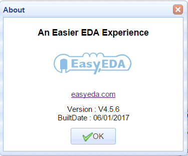
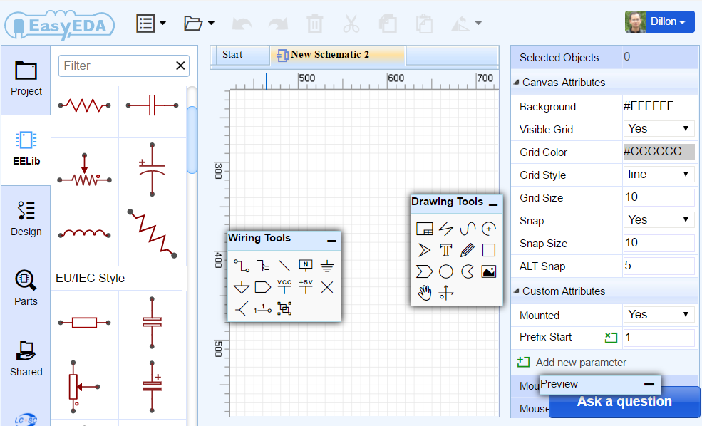
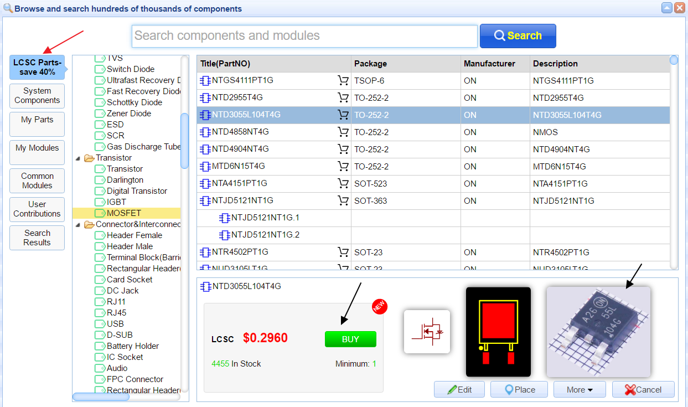
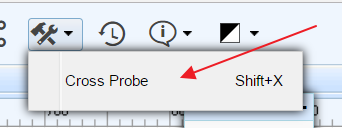
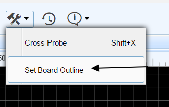
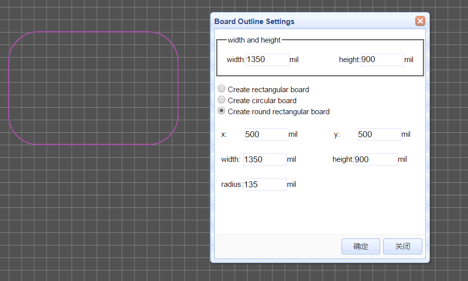
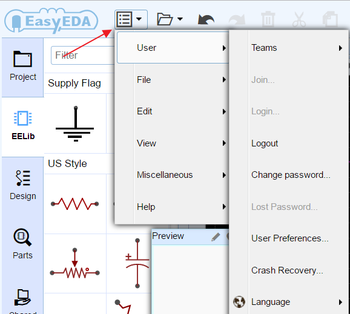
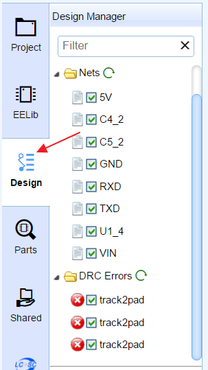

# What is new in the V4.5.6  
 

After 7 years of development, EasyEDA are pleased to announce the new version: V4.5.6. which introduces many new features.   Try it at [https://easyeda.com/editor](https://easyeda.com/editor).

 
 
 

## New UI
Before V4.5,  EasyEDA's UI is not professional, now we redesign the icons and theme.  
 

## LCSC
  EasyEDA partner with China’s largest electronic components online store by customers and ordering quantity launch https://lcsc.com.
 LCSC means **L**ove **C**omponents? **S**ave **C**ost! We suggest our users to use LCSC parts to design. Why? 
1. Small Quantity & Global Shipping.
2. More Than 25,000 Kinds of Components.
3. All components are genuine. 
4. It is easy to order co after design. 
5. You can save 40% cost at least.
6. You can use our symbols and package.
     

 

## Cross Probe in Schematic and PCB
  
This tool is used to cross probe from  chosen objects on the current schematic  to its corresponding counterparts in the PCB, or from PCB Footprints to corresponding  counterparts in the schematic. 
 
Note, you need to open the schematics and PCB.  Don't forget to use hotkey `SHIFT+X`

Thanks to this topic https://easyeda.com/forum/topic/TAB_to_toggle_between_PCB_amp_schematic-LDdaKIigs

## Board outline wizard

  Some users want to set  very precision board outlines, now we can do in this way. Open your PCB, find the menu via toolbar. 

 
Then you can see such a dialog. 
    

In this dialog, we provide 3 type board outline setting, Rectangular , Circular, Round Rect.
If you need other complex board outline, you can import a DXF file.

## Change Supper Menu position
In old version, the supper menu is a bit litter hard to find, now we set it at a good place.
  

## New Design Manger 
 
The old design manager is hard to find too, now we move it to the left panel.
  

We hope you enjoy the new version! 

And as always, if you have any questions or suggestions, do let us know.

 
 

 
