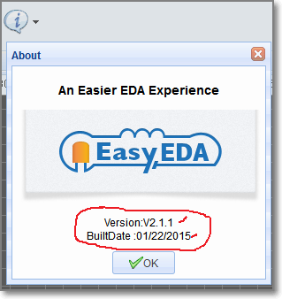

 
# New  Version V2.x.x.
 **NOTE: Please check the About dialog, the Version should be V2.3.x, and the built date should be later than 01/22/2015, if your version is V1.x.x, please close EasyEDA and open the editor again. ** 

The new version is V2.x.x. EasyEDA has lots of new features in the version. Try it via [http://easyeda.com/editor](http://easyeda.com/editor).

 ## How to upgrade to the latest version of EasyEDA 

You really don’t need to know how to upgrade EasyEDA, because EasyEDA can seamlessly upgrade itself. However,EasyEDA uses an App Cache technique to allow you to use EasyEDA offline ([W3C HTML5 Offline Web Applications](http://dev.w3.org/html5/offline-webapps/) which may delay the automatic upgrading process.  Therefore, if you want toupgrade to the latest version immediately, you can follow bellow two simply steps.
 

1. Check the About... dialog; 

2. If the Built Date is older than 03/25/2015:

Close your browser open EasyEDA again.

If the Built Date is still showing older than 03/25/2015:

Close your browser and open EasyEDA again.

If the Built Date is at or newer than 03/25/2015, you don’t need to do anything.
Note **03/25/2015** is just an example
If those two steps can't work, you may need to .

**1.Mozilla Firefox**
-  Go to “Preferences… > Advanced > Network > Offline Storage”
-  Click on “Clear now”
-  reload easyeda again.
    
  

**2.Chrome**
-   Open the following URL: chrome://appcache-internals/ 
-  Look for easyeda.com and click “Remove”
-  reload easyeda again.
    
  

Please email to  when you need any help.
## Open File Format

 If you want to hack EasyEDA's EDA files, you can check [http://easyeda.com/Doc/Open-File-Format/](http://easyeda.com/Doc/Open-File-Format/) out.  
1. You can use some codes or notepad to create an EasyEDA file. Cool!
2. You can adjust your designs with EasyEDA's API.

## API Plug 

We spent months to realize this, maybe we need a full document to elaborate this function. Check the [API document](./API.htm)
### How to find the plug entance

### Extensions Setting
You can enable or disable the default extensions, after enable, please **reload** the EasyEDA editor. We will give you a file about how to create an extensions soon. 

 
If you enable the **Theme Colors** Extension, you will find a button on the tool bar like bellow image
 
if you click the **Black On White**, you will find your schematic changes like bellow image, this is useful when you would like to print your design on a paper.
.
You can check our **github** codes of this API via [https://github.com/dillonHe/EasyEDA-Documents/tree/master/API/example/theme](https://github.com/dillonHe/EasyEDA-Documents/tree/master/API/example/theme), check the **manifest.json** and **main.js** out, you will find out how to create an extension.

### Scripts
If you just need some simple functions, you don't need to create an extension. You just need to create a single Javascipt file and keep it in this list.
.
1. You can select the `Hello World`, then click the `Run` button.
2. You can select some items, then try `Move Selected Objects`.

### Run Script code
In some case, you just need to run the function one time, such as create a user define board outline in codes, changing the Track width, change the hole size etc. You can use this way.
.
**example 1 Art **
You can open an empty schematic and copy [this example javascript codes](https://raw.githubusercontent.com/dillonHe/EasyEDA-Documents/master/API/example/schematicShapes.js) to the text box to run a test. After clicking the `Run` button, you will see bellow art image.

**example 2 Change track width and via hole size **
You can open a **PCB** and copy [this example javascript codes](https://raw.githubusercontent.com/dillonHe/EasyEDA-Documents/master/API/example/modifyTrackVia.js) to the text box to run a test. After that, All tracks will be 10mil.

##Improved Design Manager
Old `Design Manager` is a pop up dialog, it is a bit litter annoying.Now, In the schematic and PCB file, there is toggle button [Design Manager <-> Properties] on the top right, when you switch to Design Manager, you will see bellow image

You can highlight the components and net, at the same time, you can check the ** DRC Errors**.

Schematic has design manager too, and you can filter and highlight the components, such as type a `R`, you will find all resistors.

##SVG Preview

After click the `SVG Preview` button, you will see a nice SVG image and you can save the SVG file to your hard drive. This operation will be faster than export, because you don't need to send the file to EasyEDA server, and it is safe.

##User Defined BOM Parameters
After select a schematic lib, you can add a parameter, and you can mark it as `In BOM`, when you export a BOM file, you can find this in CSV file.

##Prefix Start
Every **new** schematic file has a `Prefix Start` custom paarameter, some users would like use  **multi-sheet designs**, but they hate every prefix start by 1, they hope one schematic start by 1, next start by 100, 200, 300. So you can use this solution.

##Allow to adjust the right panel width
Some Russian, German users' language is long, so they can addjust the width.

 

## New Pad shapes
EasyEDA supports two new shapes, `OVAL` and `POLYGON`, `OVAL` PAD will give your more space. `POLYGON` PAD will let you to create some strange pad, like bellow image, you can edit the PAD'S points when you select a `POLYGON` PAD
 

## Real Time DRC
This is a big feature of EasyEDA. It is hard to fix DRC errors after layout the PCB. Now EasyEDA will let you know the error in routing. You will find a `X` flag to mark the error, such as Track to Track or Track to PAD like bellow image
.
TIP: When you convert a schematic to PCB, the real time DRC is open. In the old PCB, the real time DRC is closed. you can open it via Supper menu-> Miscellaneous->Design Rule Setting, like bellow image.

. 

##Track and Net length
when select a track, you can find it's Length attribute in the right panel.

When select a track, then press `H` key, EasyEDA will highligh the whole net and pop a message box to tell you the whole net's length. like bellow image

## New `CTRL+V`
If you need to paste a part of objects from one schematic to another schematic, just need to press `CTRL+V`, not need to use `SHIFT+CTRL+V`.

##NO Connect Flag
You can find the `NO Connect Flag` via wiring tool, 
, in the bellow schematic, if you don't add a `NO Connect Flag`, there is a error flag in the nets collection.
 
After add a `NO Connect Flag`

##HOLE
There are lots of users don't know using PAD or VIA as a HOLE, they asked EasyEDA for help, so EasyEDA add a HOLE TOOL in the PCB toolbar.

##Photo View
EasyEDA has not a 3D View at present, but we provide a nice Photo View to help you to check the PCB. There is a `PhotoView` button on the PCB document toolbar, like bellow image. If you can't see this button, try to **reload** again.
.

After convert PCB to Photo View, you can see bellow image.
.

In this view, you can find some components are too closest and silk layer on the Pad, bad Footprint etc.

Bellow image is a blue and purple board.
.

##Zoom in and zoom out
Try to scroll your mouse, you will find out EasyEDA provide almost Stepless zoom. and the must factor is 10000%.

##Default Text Style
Some users like the text size keep at 9pt, now change you change the font style, we will keep it as default. 

##Place a Via On a Track
When placing a `via` on a track, the track will be cuted to two segments.  Place two vias on a tracks, you will get three segments, then you can change one segment to other layer id, or remove one of them. 
. 

##New Language Translate Tool
 With our users help, EasyEDA now provides lots of languages. Now you can help use to improve this function easier via [http://easyeda.com/language.php](http://easyeda.com/language.php). There are lots of sentences should be translated, don't forget to click **save** button which is at the end of page. BTW, you don't need to finish this job one time, you can do it when you have time after you save.  

Enjoy it, if you have any questions, do let us know.
