# What is new in the V3.2.X  
 

The new version is V3.2.x. EasyEDA has lots of new features in the version. Try it via [https://easyeda.com/editor](https://easyeda.com/editor).

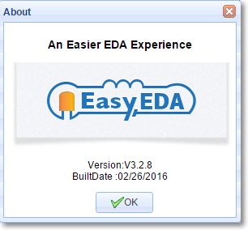

##Invite Friends to Win a Gift
If you like to help your friends to use this nice web based EDA tool, you can invite him/her to join EasyEDA. At the same time, you and your friends will get a $5 coupon to order PCB from EasyEDA. Why not to give this feature a try?

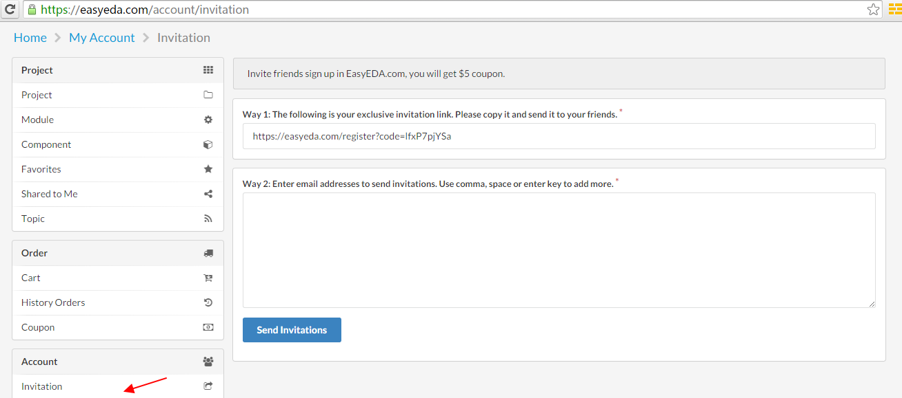  
Click this link  [invite your friends now](https://easyeda.com/account/invitation)
 
##Version History
It is easy to get this fundtion, right click the document which you need to find it's version like bellow image
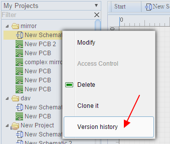

 

After clicking the history version link, you will get a list of all of the versions  like bellow image.
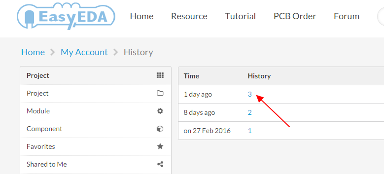,
 click the version number, you can open the saved file on the editor, if this is what you need, you can save it to your project and delete your bad file.

Note:

1. Now all of the versions are marked as number, we will allow you to add a tag soon.
2. Don't save your files too frequently, or you will get lots of versions and hardly to find the exact one.

##Auto Router

For some simply or prototype PCBs, you may want to use the auto router function to save time. Layout is a time cost and dull job. EasyEDA spends lots of time to provide such feature and loved by our users.
Steps:

**1 Click the the auto router button from the toolbar**

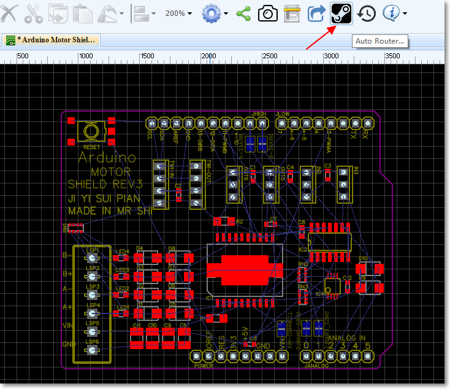

**2 Config the auto router**

 After you click that button, you will get a config dialog like bellow image.
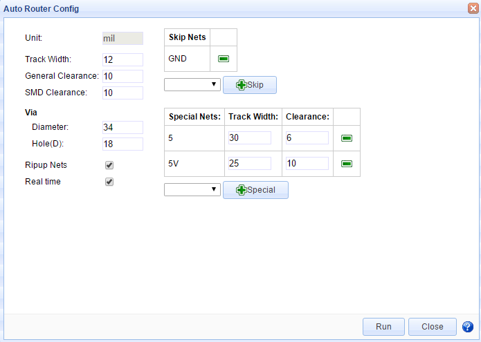
In the config dialog, you can set some rules to make the auto router profession.

If you want to keep the routed tracks, you need unchecked the `Ripup Nets`

The real time check box will let you see how it is going, but it will make the process a bit litter slow. 

If you like to keep the a net no route, you can skip it. For example, if you want to use copper area to connect `GND` net, you can skip the `GND` net. 

For the power supply track, you may want it to bigger, then you can add some specail rules. 

**3 Run it**

Click the run button, waiting for  a few seconds, after add bottom and top copper area, you will get a finished PCB board like bellow image.

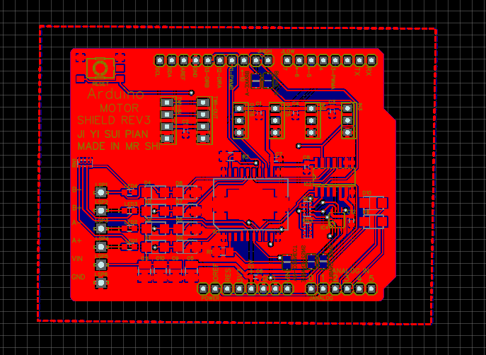 
 
Some time, if you can't get it done, try bellow tips.

1. Skip the GND nets, add copper area to GND net.
2. use small tracks and small clearance, but make sure the value is more than 6mil.
3. Routing some key tracks manual before auto router. 
4. Add more layers, 4 layers or 6 layers

Some profession guys don't like the auto router, because they think auto router is not profession, but you can the auto router to check your placement. to check the density of your PCB. 

##Insert Image/Logo to PCB
On PCB and PCB Lib editor, there is a new feature on the PCB Tool bar like the bellow image.

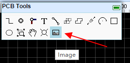

After click it and select the image, you will goto bellow image.

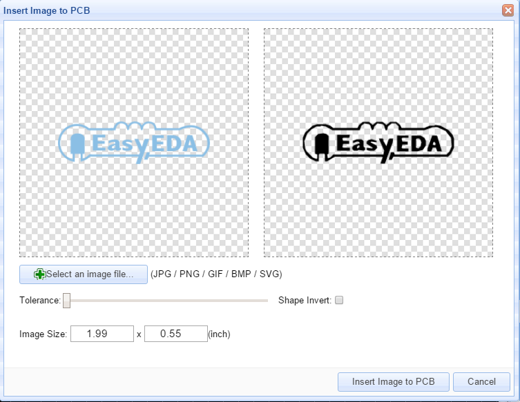
In this dialog, you can choose your favorite image, EasyEDA support `jpg`, `BMP`, 'PNG`, 'GIF`, and `SVG`.  not likes some other EDA tools, they just support a Monochrome Bitmap image, EasyEDA support full color. but Monochrome Bitmap is welcome.

You can adjust the tolerance and reset the image size at there. 

The image will be inserted to the active layer, if it is not right, you can change the attribute of it. Such as TopSilkLayer.

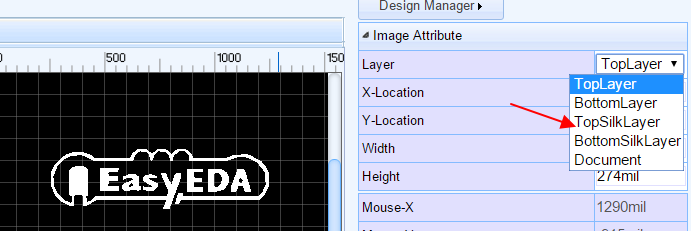

##More Fonts  for PCB
From V3.2.x, You can add more fonts from your computer or download some [free fonts](http://www.1001freefonts.com/) .

Select the text, then you can find a Font-family attribute on the right panel like bellow image.
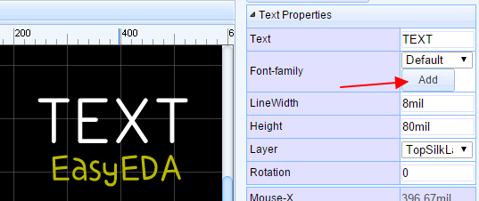
Click the add button, then choose the font, the font file must be `ttf` or `otf`.

So you can add any fonts by your self. EasyEDA desn't cache the font on our server, so if you close the editor, you need to add the font again by your self.

Note:  
If you use the other font, the 	`LineWidth` attribute is useless, because it will be auo by change the `Height`.

 

##Change Attributes in Batch on PCB Editor
Some times, we need to change some attributes in the same together, such as the track width, hole size and font size.  
Now, you can select them and do some changes. Taking the track for an example. If you select 3 tracks, now you can change their `Width`, `Layer`, `Net` together.
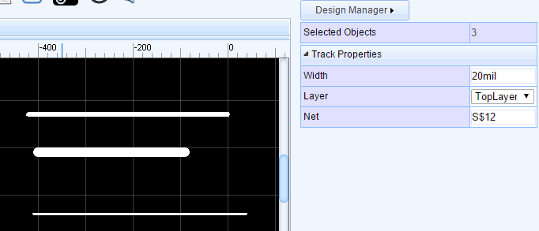

Other items such as `Pad`, `Via`, and  `TEXT`, you can try to play this feature.

##New Track Style
When routing, some time we need to add an Arc segment, or change the inflection direction. Now we can do this easily.
1. Change to Arc style, You can use Hot key `L` to toggle from 45 degree to Arc.
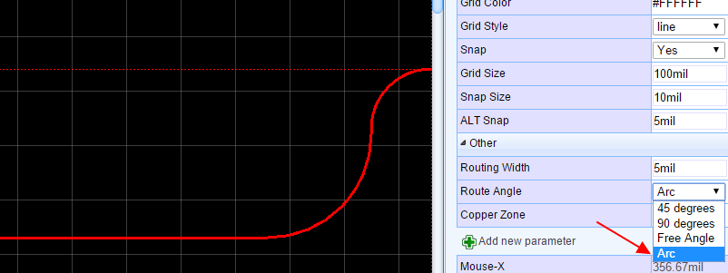

You can change  inflection direction when router, from A to B, we have two ways.
When you router from A to B, the default track is 1, but if you press `Space bar` key, the track will be changed to 2.
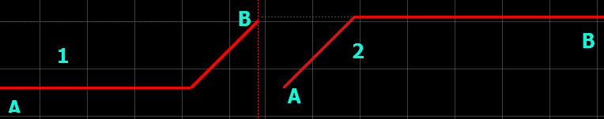
 

##Modules
Copying codes is an easy job for coders, now copy and reuse a schematic or PCB are easy now.
Take a power supply unit for example, you can save this unit as a schematic module.

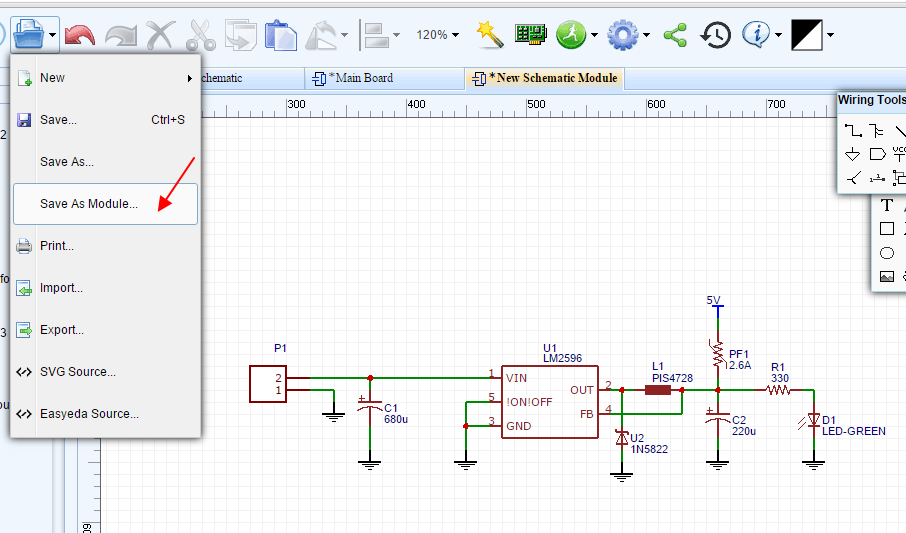 

After saving, you can find it at the module section. And you can place the whole block to your schematic.

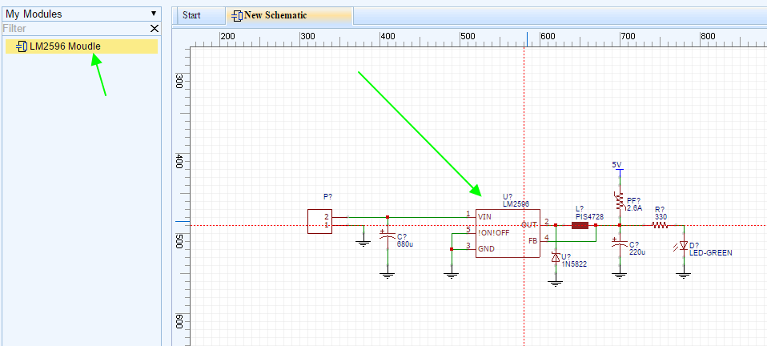  

##Get a Invoice After PCB Order
For company users, after order PCB, they may need an invoice, you can find it at .
[History orders](https://easyeda.com/my-order). There is an invoice link, you can open it and save it as pdf or html file.
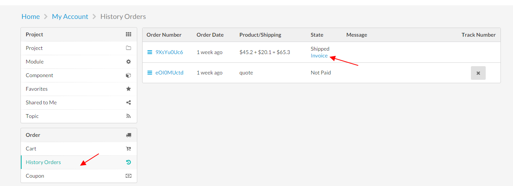   

##Contribute Your Symbols and Package to EasyEDA
Right click your parts, you can share symbols and package to EasyEDA system libs, then, every one can use them as their own parts. 
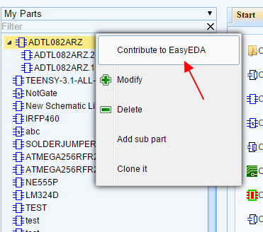   

##Delete a Segment from a Track
 In lots of other EDA tools, the track is segment line, but in EasyEDA, the track is polyline. some time, if we want to delete a segment, we must delete the whole track and router again. Now we provide a not bad way to do this. Moving your mouse to the segment which you want to delete, click it, then hold the `SHIFT` and **double click it**. the segment will be removed.

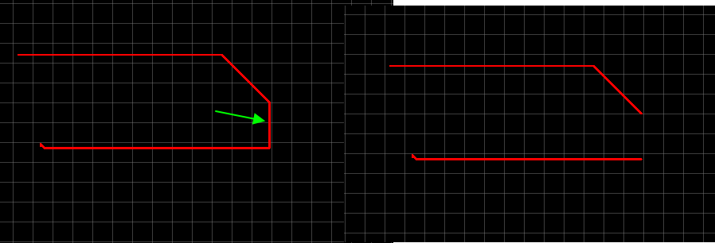

Enjoy it, if you have any questions, do let us know.

 
 

 