# Creating The Schematic 

<iframe width="920" height="540" src="//www.youtube.com/embed/0TFjMWQkO80" frameborder="0" allowfullscreen></iframe>
During this tutorial we will create the Schematic design for an Astable Multivibrator LED project to guide you in how to use EasyEDA Schematic capture.

## How To Find The Schematic Libraries 

From the Navigation List drop down list, you can find:

 1) **My Parts** which contains parts which you have created. 

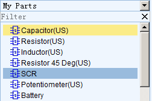

 2) ** My Favorite Parts** which contains parts that you have added from the a search using the More Libraries button which is at the bottom of left  blue jigsaw piece button:

At the bottom of the left hand Navigation panel you will find a button with “**More Libraries**” ,
Click it, or press the hotkey combination `Shift+F`.

   

Then you will see a dialog as shown in the image below.

Simply type your *part number* or *footprint* to Search.

3)  **EasyEDA Libs** which contains ready made symbols for a wide range of components and which can be simulated.

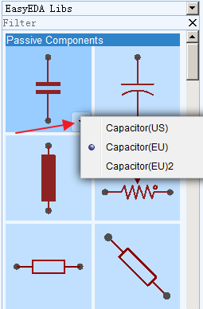

Many of these components have optional US and EU style symbols. You can click the drop down list or right click to popup the context menu. EasyEDA will remember your choices next time.

Don’t forget to use Filter to locate a component fast. For example, you just need to type `res` to find all of resistors:

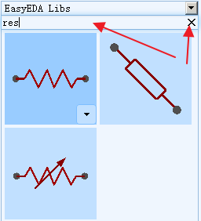

## Canvas Settings

You can find the canvas Properties setting by clicking on any the blank space in the canvas.

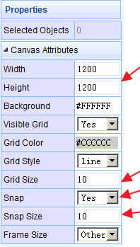

As described earlier, background and grid colours and the style, size, visibility and snap **attributes** of the grid can all be configured.

The canvas area can be set directly by the Width and Height or preset frame sizes are available.

### Grid

**Visible Grid** : Yes or No

**Grid Color**: any valid colour

**Grid Style**: Line or Dot

**Grid Size**: To ensure proper alignment of all EasyEDA parts, it is advisable to set in 10, 20, 100.

**Grid** (and background) colour can be set directly by entering the hexadecimal value of the colour you want or by clicking on a colour in the palette that opens when you click in the colour value box:

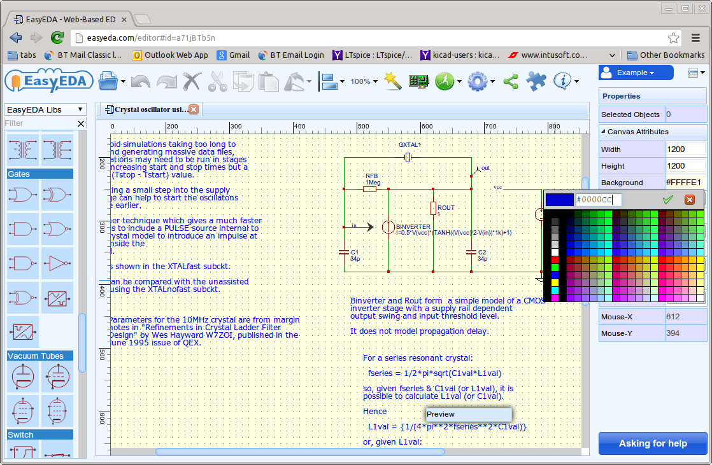

### Snap

**Snap**: Yes or No. The default hotkey is G. Press this key toggles switching snap to grid on and off.

**Snap Size**: To ensure proper alignment of all EasyEDA parts, it is advisable to set in 10, 20, 100 but any valid number can work, such as 0.1, 1, 5.

It is strongly recommended that you keep **Snap = Yes** all the time. Once items are placed off-grid it can be very difficult to reset them back onto the grid. Off-grid placement can result in wires looking as though they are joined when in fact they are not and so causing netlisting errors that can be hard to track down.

If you need to draw detailed parts of new symbols or footprints that need to go between grid points, try to reduce the grid spacing to draw these elements and then reset the grid back to your chosen default value as soon as you have completed that part of the drawing. Setting Snap=No should only really be used as a last resort.

**ALT Sanp**: Snap size when pressing the `ALT` key.

## Placing Components

Find the component which you plan to place to your schematic, then move your mouse to the canvas and left click. If you want to add more, just left click again. To end the current sequence of placements, right click once or press `ESC`.

Don't try to Drag and Drop a component to canvas: EasyEDA team thinks that Click-Click to place component will be easier to use than Click-Drag mode.

This screenshot below shows how the schematic canvas looks like after we have placed all the components for the **Astable Multivibrator** LED project:

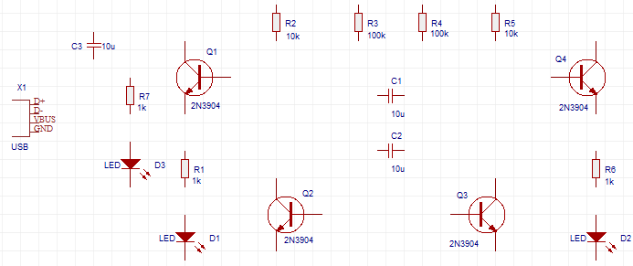

## Rotating the Prefix and Value (Name) of components

The default Prefix and Value (or name) of EasyEDA components are horizontal. To change them to vertical like this...

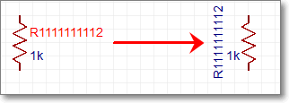

...Left click the prefix or value and when it is highlighted in **red** color, then press the **rotation** hotkey **Space** and you’re done.

## Adjusting Components
 

You can:

1.  Move components with your mouse
2.  Move components with the arrow keys.
3.  Find components with the Design Manager via the `CTRL+D` hotkey: select the component in the Design Manager to pan it to the centre of the canvas and then move it with your mouse.
4.  Align the components:

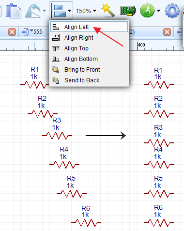

## How To Wire
 

There are three ways to enter the wire mode in EasyEDA.

1.  Click the **Wire** button from the **Wiring Tools** palette.
2.  Press the `W` hotkey.
3.  Click on the end of a component pin (where the grey pin dot appears if you select the component): 

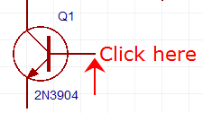 

EasyEDA automatically enters **Wire** mode.

Here is a screen shot of the **Astable Multivibrator LED project schematic** after wiring:

### About moving components and wires

Note that if you place a component, such as a resistor, on top of a wire then the wire breaks and reconnects to the ends of the component.

When moving selected components using the mouse, they will drag attached wires with them (“rubber band”) to some extent but please be aware that the rubber banding feature has some limitations. Using the arrow keys will not rubber band. Selected wires do not rubber band.

A selected wire can be moved directly by clicking on it using the mouse or by the arrow keys. If a wire is selected by clicking on it using the mouse then green grab handles will appear at the ends and vertices.

## NetLabel and Netflag

**NetLabel** can be used to give your wires names to help you find them and identify any mis-connections. You can find the **NetLabel** from the Wiring Tools palette or using the `N` hotkey. When selecting the netlabel, you will find it’s attributes in the right hand Properties panel: 

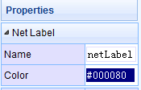

You can change it’s name and colour. If you only want to change it’s name, it may be easier to just double click the netlabel.

**NetFlag** is the same as NetLabel, you can find the NetFlag from the Wiring Tools palette or using the `Ctrl+G` hotkeys for **GND** or `Ctrl+Q`for **VCC**. You can also change it’s name, for example from **VCC** to **VDD**:

The screen shot below is after adding NetLabels - indicated by the little **egg marks** - and a **GND** NetFlag: the schematic is almost finished.

###NO Connect Flag
You can find the `NO Connect Flag` via wiring tool, 
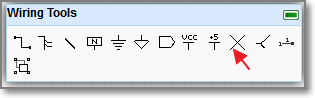, in the bellow schematic, if you don't add a `NO Connect Flag`, there is a error flag in the nets collection.
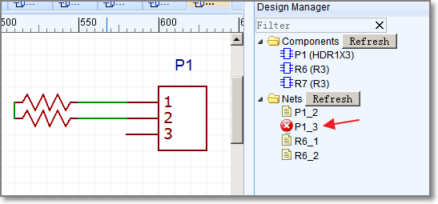 
After add a `NO Connect Flag`
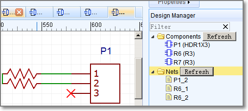

## Multi-part Components

The number of pins on some components can be quite large. That's why it's easier to divide such component into several parts or functional blocks. As a simple example, there are six gates in the 74HC04 Hex Inverter component. To avoid clutter in the schematic, GND and VCC pins of such components are usually served by a separate part of the component. This is really convenient as it doesn't interfere the working process with logical parts. The NetLabel names of VCC and GND Pin are usually hidden.

When placing the 74HC04 on a schematic, it will look like the screenshot below. Note: the component Prefix will be in form of: U?.1, U?.2 etc.

##User Defined BOM Parameters
After select a schematic lib, you can add a parameter, and you can mark it as `In BOM`, when you export a BOM file, you can find this in CSV file.
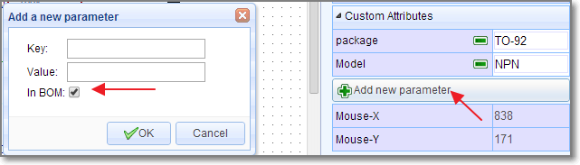

##Prefix Start
Every **new** schematic file has a `Prefix Start` custom paarameter, some users would like use  **multi-sheet designs**, but they hate every prefix start by 1, they hope one schematic start by 1, next start by 100, 200, 300. So you can use this solution.
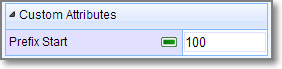

## Design Manager

With large schematics it can be hard to find the components quickly. Sometimes, you may make a mistake such as wiring to a wrong component pin.

So you need a tool to help you out.

**Design Manager **is the just tool.

 

You can find it via
**
Super menu > Miscellaneous > Design Manager **

or just press the `CTRL+D` hotkey to open the Design Manager dialog.
or click it via 
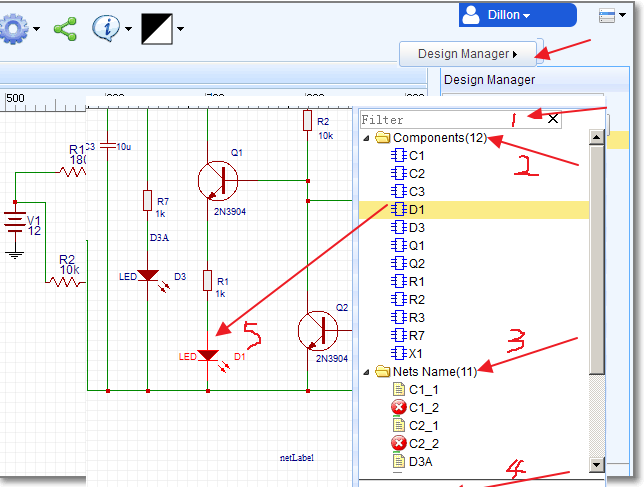
 

1.  **Filter**: You can find your components or netname easily: for example, if you want to find all capacitances, you just need to type C;
2.  **Components**: lists all the components in this schematic. Clicking on a Component item highlights that component and pans it to the centre of the window: D1 in this example.
3.  **Nets Name**: lists all the nets in this schematic. A net must connect at least two Pins, or the net name will be marked as a red error.
4.  **Parts Pins**: lists all the pins of the selected component or pins connected to the selected net name.

If you click the Pin **A:R1_1**, EasyEDA will show you where it is with a temporary marker from the top left of the canvas:

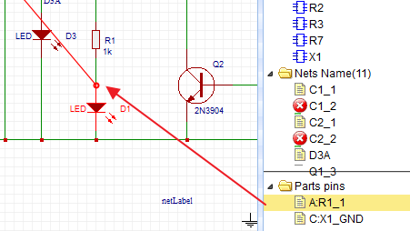 

## Find Components In a Schematic

Using **Design Manager** can find components but in large schematic, it may be too slow and and return too much information. A lighter weight alternative is to use the `CTRL+F` hotkeys to find the component in the active schematic.

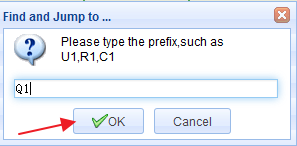

*Note that you have to click OK in this dialog: you can’t use the Enter key.*

## Component Attributes

After selecting a component, you can find the component’s attributes in the right hand Properties panel.

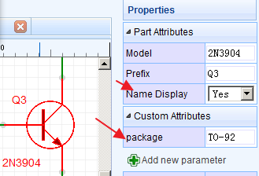

You can change the **Prefix** and **Model** here (in this component, we take the **Name** as **Model**).

If you want to hide the component name text **2N2904**, you can switch Name Display to **No**.

### Update Package

If you want to change the Package, for example, from **TO-92** TO **TO220**, you just need to click in the package input box. EasyEDA will popup the package choice dialog. You can follow the instructions. Type **TO220** into the Filter box, select the **TO220**, verify it in the preview box, then press the Update button. After that you will find you have changed the package to **TO220**.

Note that to ensure that you use a package type that is already in the EasyEDA libraries, it is recommended that you use this technique to change component packages rather than just typing a package type directly into the package text box.

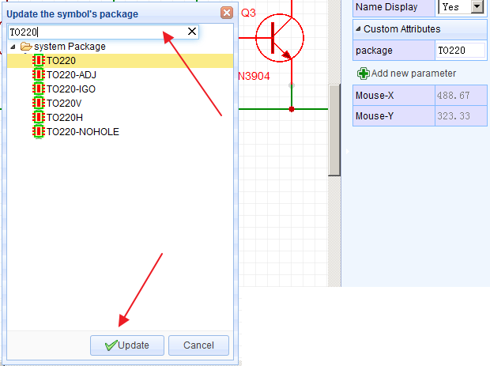

## Annotate

After creating a schematic, it is quite likely that you have component Prefixes (reference designators) that are in no particular order on the canvas. You may also have duplicates. You can automatically renumber all the components using the **Annotate** function.

**Super menu > Miscellaneous > Annotate**

Various Annotate possibilities  are available:

-   **Active Schematic only**: applies annotation actions to the current schematic only.
-   **All Opened Schematics**: applies annotation actions to all Schematics that are open in EasyEDA.

Note: this option applies even if the opened schematics are from different Projects! If the project that you want to annotate has more than one schematic, you should open all of them and close any schematics that are open from other Projects.

-   **Re-annotate all**: resets all existing annotation and then annotates all components again from scratch;
-   **Keep existing annotation**: annotates new components only (i.e. those whose reference designator finishes with ? like R? or U?).
-   **Direction**: Rows annotates across the schematic in a raster pattern from top left to bottom right; Cols annotates down the schematic in a raster pattern from top left to bottom right.
-   **Annotate**: applies the selected annotation actions. 

*Note: Annotation cannot be undone! if you do not accept the result: close all of the affected schematics without saving. If you do accept the result: make sure you save all of the affected schematics.*

-   **Reset**: if you want to reset all the reference designators to end with ?, just click the Reset button. After that, R1 will be R?, U1 will be U? etc.

*Note that Reset does not reset annotation back to where it was before pressing the Annotate button.*

 

## Symbol Wizard

How many times have you hit a schematic capture roadblock because you can’t find a component symbol?

Well, in EasyEDA that would be never because the **Symbol Wizard** provides a quick and easy way to create a general schematic library symbol. The **Symbol Wizard...** command can be found in the top toolbar.

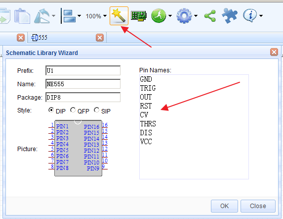 

Using the **NE555** timer as an example: this device is available in a **DIP8** package so select **DIP**. Then enter the NE555 pin names into the **Pin Names** text box separated by new line or space, Then press OK. Abracadabra! As if by magic, you will find a perfectly formed dual in line 8 pin symbol for the NE555 attached to your mouse cursor, ready to be placed! You just need a few seconds to build a NE555 symbol, quickly and easily.

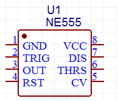

The EasyEDA Schematic Symbol Wizard allows you to create DIP, QPF or SIP styles symbols. If you are designing Arduino Shields then you will need lots of SIP symbol, so you can create a SIP symbol like the one shown below in a few seconds.

If you are not too worried that the symbols may not look quite the way people might expect and that they may not look anything like the **Package** type you enter, then of course you can use the wizard to create symbols for any component:

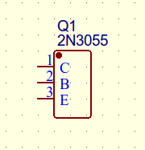

## Group/Ungroup

On the **Wiring Tools** palette there is the **Group/Ungroup Symbol…** button.

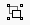

Just like the **Symbol Wizard**, this tool is also for you to quickly create schematic library symbols.

Using the** Symbol Wizard** you can just create generic symbols but how can you quickly and easily create symbols like these?

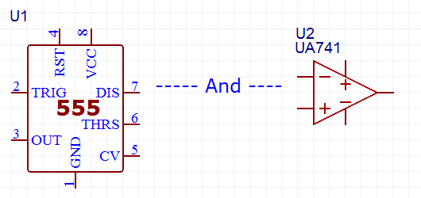

Here’s how.

EasyEDA allows you to do something that very few other EAD tools support.

Using the P Hotkey, you are allowed to add a PIN directly onto the Schematic canvas. So you can add 8 Pins, draw a rectangle from the Drawing Tools palette and add 555 as text to form a symbol for the NE555 like the one shown below:

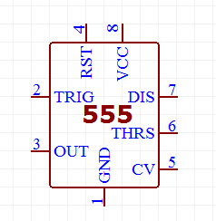

Now comes the clever bit.

Up to this point you have a collection of separate pins, a drawn rectangle and some text that are all separate items with no particular association with each other.

So now select all of the items and click the Group/Ungroup Symbol… button. A dialog will be opened:

After you click OK, all those separate elements will be grouped together to form your new symbol directly in the schematic.

Using group function, you can create any symbol in the schematic, easily and quickly.

How cool is that?

So what does Ungroup do? Try selecting a symbol and then click the Group/ungroup command to see what happens!

Note that the pin numbers and names cannot be moved independently of the pin.

## Pinmap Modify symbol information

When you select a component, you can do:

**Super menu > Miscellaneous > Edit Symbol...**

or press the `I` hotkey to open the Modify symbol your information dialog. Using this dialog you can edit the pin names and numbers, for example, to suit a different package or device variant. You can also enter a Spice Prefix and swap the spice Pin order to make your symbol usable in simulation. 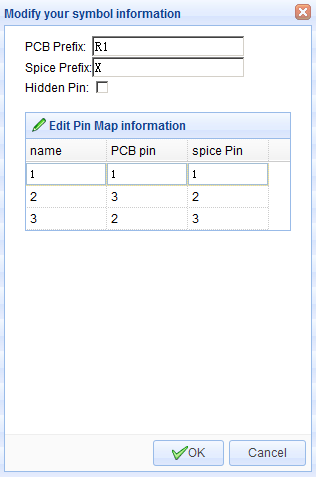

A more detailed description of PCB and Spice Prefixes and pin numbers is given in the section on [Schematic symbols: prefixes and pin numbers](./prefixesandPinNumbers.html).

## Hierarchy

EasyEDA does not support true hierarchical designs but it does support **multi-sheet designs**. You can put several schematics in one project with connections between made by netlabels. All nets in EasyEDA are global so if you create a netlabel DATA0 in schematic A and then create a netlabel DATA0 in schematic B, when Schematic A and schematic B are in the same project, they will be connected.

**Multi-sheet designs**(equivalent to a circuit spread over several pieces of
paper), all schematics under the same project will be merged into one when be converted to PCB connecting in **netlabe**, **netflag**. 

Note: please make all of the prefixs unique, if the Schematic A has a R1, and the Schematic B has a R1, then you will get a [Prefix Conflict Error](/Doc/Tutorial/introduction.htm#Prefix-Conflict-Error)
Tip: Every schematic's prefix will start from 1, such as R1, C1, U1 etc, 
1. you can use [Annotate](/Doc/Tutorial/schematic.htm#Annotate) to fix prefix
2. You can set the prefix start to 100, then your components will start from R100, C100. 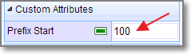 

## Export BOM

You can **export** the Bill of Materials (BOM) for the active schematic (Document) and/or for the active project (i.e. the BOM for all the sheets in the project) as shown below:

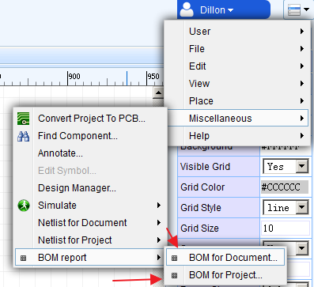

After clicking the menu option, the dialog below will open:

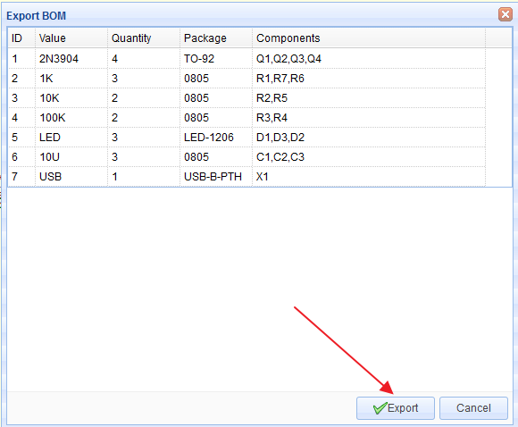

Clicking the Export button downloads a bom.csv file via your browser, which can be opened in any text editor or spreadsheet.

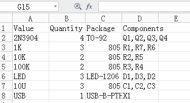

## Export Netlist

EasyEDA can export the netlist for the active schematic (Document) and/or for the whole active project:

**Super menu > Miscellaneous > Netlist for Document or Netlist for Project**

EasyEDA can export a netlist in a variety of formats: 

-   **Spice**: this is a Spice3f5 compatible netlist generated by the simulation engine of EasyEDA, [Ngspice](http://www.google.com/url?q=http%3A%2F%2Fngspice.sourceforge.net%2Fpresentation.html&sa=D&sntz=1&usg=AFQjCNEvVOggHskD819G-5EW8EB59FL5mw). It is not normally used as the basis for as a PCB layout.
-   [KiCad](http://www.kicad-pcb.org/): a PCB netlist in a format that can be imported straight into Pcbnew, the PCB layout tool part of the free, open source cross-platform EDA suite.
-   **Altium Designer**: a PCB netlist in a format that can be imported straight into Altium Designer and it’s predecessor, Protel. 
-   **Pads**: a PCB netlist in a format that can be imported straight into Pads PCB layout tools.
-   [FreePCB](http://www.freepcb.com/): a PCB netlist in a format that can be imported straight into FreePCB, a  free, open source PCB editor for Windows.

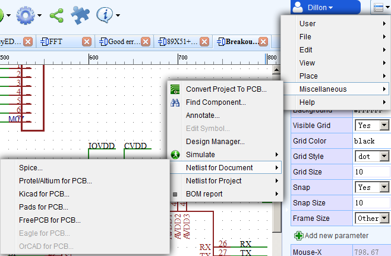
                    