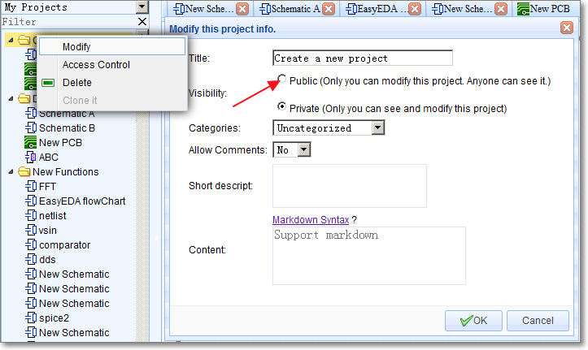
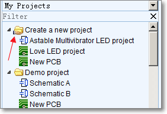
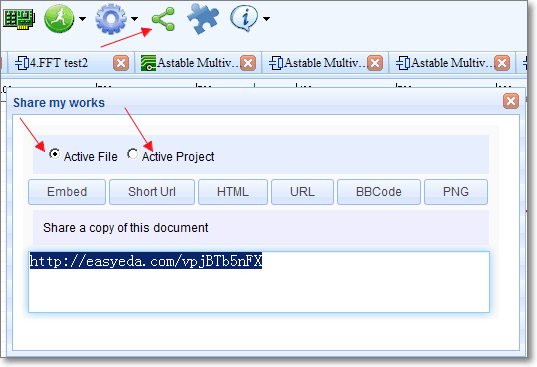
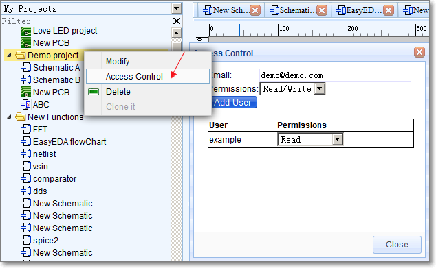
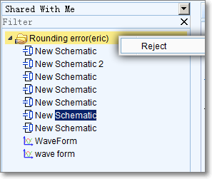

# Sharing 
<iframe width="920" height="540" src="//www.youtube.com/embed/nBbwtPmOUj4" frameborder="0" allowfullscreen></iframe>
Sharing your work with others is a big feature of web based EDA tools and EasyEDA is no exception in offering you some nice features.

## Share to Public 

All projects in EasyEDA are set to private by default, to share your project with anyone, i.e. make it public, then should create your new project or right click and modify your existing project to be a Public project:

After setting as a public project, you will see that the Project folder Icon is now shown with a hand holding the folder.

If you then open one of the documents in the folder, you can then click the Share icon on the toolbar to open the Share my works dialog.

## Access Control 

What about sharing with selected people?

Can you share a private project to your partner? Can your partner modify your designs?

Yes, you can use **Access control** to do this.

Right click the project and you will see the Access Control on the context menu; clicking on it will open the Access Control dialog.

So if you want to share a project with someone,

1.  you just need to know their email address

	and

2.  they must have created an account in EasyEDA.

You can share your project as **read** only or **read/write**.

After setting up **Access Control** and Permissions, your partner will find your project in the **Shared with Me** section from the **Navigation List** when they login.

If you partner doesn’t wish to accept the shared project, they can reject it by right clicking on the project in the Shared with Me section and then click the Reject menu;

 
                    