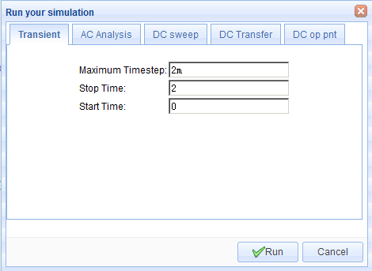
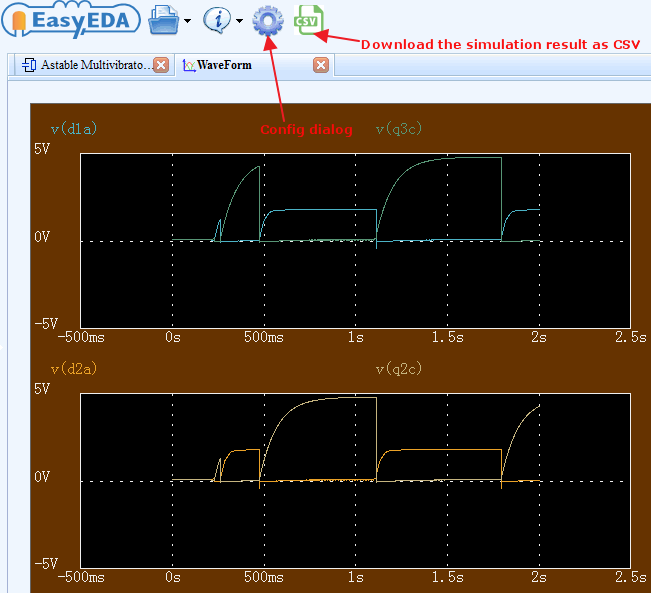
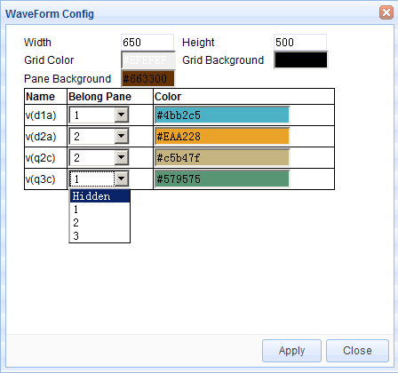
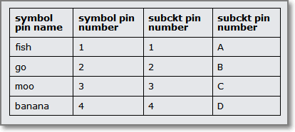
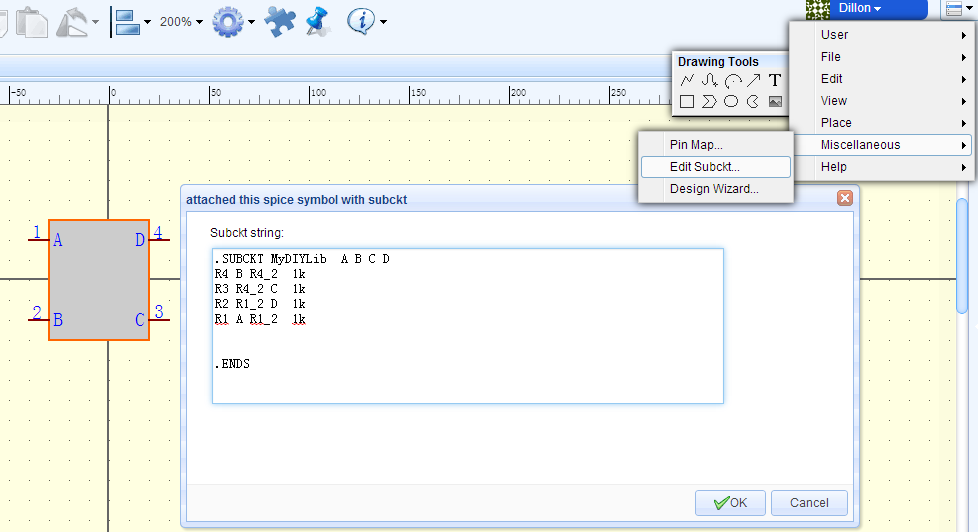
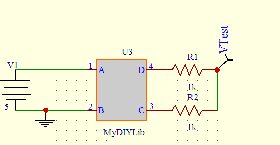
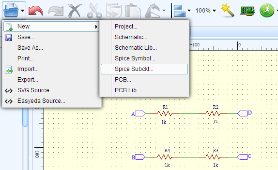
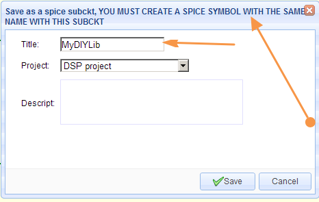
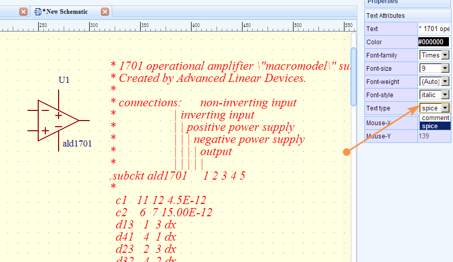
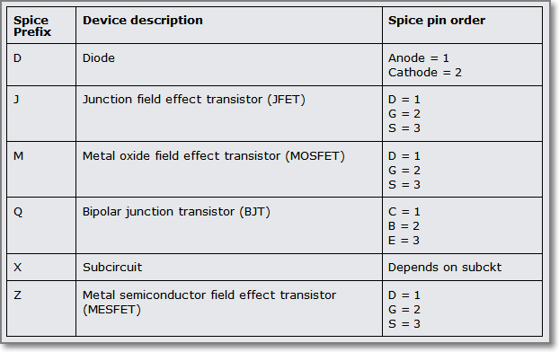

# Spice Simulation

<iframe width="920" height="540" src="//www.youtube.com/embed/wsAQO7X4diU" frameborder="0" allowfullscreen></iframe>
## Build the circuit 

To simulate your circuit, at least until you become more familiar with the idea and concepts of simulation, first you should build a circuit as described in the chapter on **Creating The Schematic.**

The circuit below is the **simulation schematic** for the **Astable Multivibrator LED project**:

Now, to make your circuit simulatable, you should note that:

1.  You do not have to draw the whole schematic again from scratch. You can `CTRL+C` copy the schematic you have already drawn for PCB layout and `CTRL+SHIFT+V` paste it into a new schematic canvas and then save it into a new Project folder (with maybe the same name but with “simulation copy” or something added to the end to avoid the Design Manager flagging up duplicates or you accidentally editing the original);

2.  You should then remove anything from the schematic that you do not want to include in the simulation. Connectors and mechanical items such as heatsinks and often manually operated switches can be removed. (Although there are situations where these items may need to be included in the simulation; that is getting off the topic and into advanced simulation territory so we will leave it there for the moment…)

3.  You may want to replace a simple battery or - to simplify the simulation, reduce the size of the simulation output file and reduce the simulation time, a complicated power supply - with a simple spice V voltage source.

You will almost certainly need to add some sort of voltage or current signal input source such as a simple SIN or PULSE source or maybe something more complex such as the  EasyEDA electret microphone model, a guitar pickup model, a photodiode or an optoisolator. If you are simulating a power supply or a power amplifier of some sort, you may also need to add a representative load of some sort.

Unless you are specifically simulating the effects of wiring impedances for Power Integrity, you can usually omit any power supply decoupling capacitors hung directly off the supply rails: they have no effect, clutter up the circuit, generate lots of useless output data and add to the simulation time;

4.  Your circuits **must** have a **GND** net. You can use a NetLabel or NetFlag to add one. You can call this net GND or 0 (the numeral zero);

5.  You should use the Schematic Design Manager to help verify that your circuits are wired correctly. It can be hard to debug wiring errors from the Simulation Results... dialog error messages;

6.  As you draw a schematic, EasyEDA assigns default net names to all the wires. Any section of wires that are joined will be assigned the same net name. This is how EasyEDA “knows” that those wires are joined together.

These default net names are usually of the form N001, N002, etc.

Adding NetLabels to name nets (wires or nodes) which you would like observe (probe) makes it much easier to identify traces when the simulator shows them in WaveForm. Remember that in any circuit, you may want to probe the voltages on nets other than the obvious Input or Output nodes that may be the nets you first think you will want to probe.

## Probing voltages and currents

To probe voltages, you can add some Voltage Probes which can be found in the Wiring Tools palette. These will appear on your schematic auto-numbered as volProbe1, volprobe2, etc.

When you place a voltage probe onto a net, the name you give the voltage probe will overwrite any name that is already assigned to that net. So if you place a voltage probe called foo on a net call bar, that net is renamed to foo.

Therefore it is strongly recommended that you change the name of the voltage probe to be identical to the name of the net onto which you then place that probe (except for the letter case which is ignored).

If this net name is used somewhere else in the simulation - for example in an expression for an arbitrary source - then it is possible that the voltage probe name overwriting the net name will break the expression and so the simulation will give unexpected results or throw errors. Giving voltage probes identical names to their target nets avoids this problem.

It is also recommended that you name all nets because if you have used an EasyEDA-assigned default net name in an expression then, if you edit the schematic, say to insert an extra resistor or a current probe, then EasyEDA will reassign the default net names to different nets. This break the expression and so the simulation will give unexpected results or throw errors.

To probe the current in a wire you can place an instance of the Ammeter component, from the EasyEDA Libs, in series with the wire.

For an alternative method of probing voltages on nets and currents through the EasyEDA Ammeter component, see [Probe](#h.tqz4ifmtwxqz).

## Checking models and subckts

You then need to check that all the devices in the simulation schematic have the necessary and the correct spice models and/or subckts.

Missing spice models and subckts will be indicated in the Simulation Results… dialog after attempting to run a simulation but it is much easier to do this before uyou try to run a simulation.

Simple components such as resistors, capacitors and inductors do not pull models into the netlist because their models are built-in to Ngspice at a very low level but almost all other components will pull in either a .model statement or a set of line enclosed in the .subckt … .ends spice keywords.

By looking at the spice netlist that is generated as a simulation schematic is being created,

**Super menu > Miscellaneous > Netlist for Document > Spice…**

or

**Super menu > Miscellaneous > Netlist for Project > Spice...**

it is easier to check that each component in the schematic has pulled into the netlist an associated .model statement or .subckt … .ends block of lines.

In the astable example spice netlist below, Q1 - Q4 are 2N3904 devices which all pull in - and share - the .model 2N3904 statement.

Similarly, D1 - D3 are the same LED device and pull in the shared .model LED statement.

Astable Multivibrator simulation copy

	.param pi = 3.141593
	V1 VBUS GND  5
	R7 D3A VBUS  1k
	R6 D2A Q4E  1k
	R5 Q3C VBUS  10k
	R4 Q3B VBUS  100k
	R3 Q2B VBUS  100k
	R2 Q2C VBUS  10k
	R1 D1A Q1E  1k
	Q4 VBUS Q3C Q4E 2N3904
	Q3 Q3C Q3B GND 2N3904
	Q2 Q2C Q2B GND 2N3904
	Q1 VBUS Q2C Q1E 2N3904
	D3 D3A GND LED
	D2 D2A GND LED
	D1 D1A GND LED
	C3 GND VBUS  10u
	C2 Q2B Q3C  10u
	C1 Q2C Q3B  10u 
	
	 
	.MODEL 2N3904 npn
	+IS=1.26532e-10 BF=206.302 NF=1.5 VAF=1000
	+IKF=0.0272221 ISE=2.30771e-09 NE=3.31052 BR=20.6302
	+NR=2.89609 VAR=9.39809 IKR=0.272221 ISC=2.30771e-09
	+NC=1.9876 RB=5.8376 IRB=50.3624 RBM=0.634251
	+RE=0.0001 RC=2.65711 XTB=0.1 XTI=1
	+EG=1.05 CJE=4.64214e-12 VJE=0.4 MJE=0.256227
	+TF=4.19578e-10 XTF=0.906167 VTF=8.75418 ITF=0.0105823
	+CJC=3.76961e-12 VJC=0.4 MJC=0.238109 XCJC=0.8
	+FC=0.512134 CJS=0 VJS=0.75 MJS=0.5
	+TR=6.82023e-08 PTF=0 KF=0 AF=1
	.MODEL LED D
	+ IS=661.43E-24
	+ N=1.6455
	+ RS=4.8592
	.control
	probe V(D1A) V(D2A) V(Q2C) V(Q3C)
	quit
	.endc
	.END

In fact the astable example circuit has no elements defined by subcircuits but the principle is the same as for .model statements.

The example below of a simple 555 timer based monostable, includes a .model statement for a type of 2N7002 MOSFET and a subcircuit for the 555 timer which in turn, calls up .model statements for the bipolar transistors, QN and QP and the diode DA that are used within the subcircuit.

It is quite possible to call one subcircuit from within another subcircuit but let’s not get too carried away just yet ...
  555 monostable

	.param pi = 3.141593
	XU1 GND XU1_2 OUT VCC XU1_5 XU1_6 XU1_6 VCC 555
	VGATE GATE GND  PULSE(0 9 0 10u 10u 10m 300m) AC 0
	VBATT VCC GND  9
	R4 XU1_2 VCC  2k
	R1 XU1_6 VCC  100k
	M1 XU1_2 GATE GND GND DI_2N7002K 
	C4 VCC GND  1u
	C2 XU1_5 GND  10n
	C1 XU1_6 GND  1u
	*****************************************
	* Bipolar 555 timer model
	**
	* Rfix added to stop V(out) exceeding V(vcc)
	* with no external load on OUTPUT pin.
	**
	* Last edited 140111
	**
	*           GND
	*           |  TRIGGER
	*           |  |  OUTPUT
	*           |  |  |  RESET  
	*           |  |  |  |  CONTROL
	*           |  |  |  |  | THRESHOLD
	*           |  |  |  |  |  |  DISCHARGE  
	*           |  |  |  |  |  |  | VCC
	*           |  |  |  |  |  |  | |
	.SUBCKT 555 34 32 30 19 23 33 1 21
	**
	Q4 25 2 3 QP
	Q5 34 6 3 QP
	Q6 6 6 8 QP
	R1 9 21 4.7K
	R2 3 21 830
	R3 8 21 4.7K
	Q7 2 33 5 QN
	Q8 2 5 17 QN
	Q9 6 4 17 QN
	Q10 6 23 4 QN
	Q11 12 20 10 QP
	R4 10 21 1K
	Q12 22 11 12 QP
	Q13 14 13 12 QP
	Q14 34 32 11 QP
	Q15 14 18 13 QP
	R5 14 34 100K
	R6 22 34 100K
	R7 17 34 10K
	Q16 1 15 34 QN
	Q17 15 19 31 QP
	R8 18 23 5K
	R9 18 34 5K
	R10 21 23 5K
	Q18 27 20 21 QP
	Q19 20 20 21 QP
	R11 20 31 5K
	D1 31 24 DA
	Q20 24 25 34 QN
	Q21 25 22 34 QN
	Q22 27 24 34 QN
	R12 25 27 4.7K
	R13 21 29 6.8K
	Q23 21 29 28 QN
	Q24 29 27 16 QN
	Q25 30 26 34 QN
	Q26 21 28 30 QN
	D2 30 29 DA
	R14 16 15 100
	R15 16 26 220
	R16 16 34 4.7K
	R17 28 30 3.9K
	Rfix 30 0 1G
	Q3 2 2 9 QP
	.MODEL DA D (RS=40 IS=1.0E-14 CJO=1PF)
	.MODEL QP PNP (level=1 BF=20 BR=0.02 RC=4 RB=25 IS=1.0E-14 VA=50 NE=2)
	+ CJE=12.4P VJE=1.1 MJE=.5 CJC=4.02P VJC=.3 MJC=.3 TF=229P TR=159N)
	.MODEL QN NPN (level=1 IS=5.07F NF=1 BF=100 VAF=161 IKF=30M ISE=3.9P NE=2
	+ BR=4 NR=1 VAR=16 IKR=45M RE=1.03 RB=4.12 RC=.412 XTB=1.5
	+ CJE=12.4P VJE=1.1 MJE=.5 CJC=4.02P VJC=.3 MJC=.3 TF=229P TR=959P)
	.ENDS
	*SRC=2N7002K;DI_2N7002K;MOSFETs N;Enh;60.0V 0.300A 2.00ohms  Diodes Inc. MOSFET
	.MODEL DI_2N7002K  NMOS( LEVEL=1 VTO=2.50 KP=32.0m  GAMMA=3.10
	+ PHI=.75  LAMBDA=104u RD=0.280 RS=0.280
	+ IS=150f  PB=0.800 MJ=0.460 CBD=98.8p
	+ CBS=119p  CGSO=60.0n CGDO=50.0n CGBO=390n  )
	*   -- Assumes default L=100U W=100U --
	.control
	tran 500u 500m
	probe V(GATE) V(OUT)
	quit
	.endc
	.END 

 Whoa! I thought this was supposed to be easy?

At this stage you might be forgiven for feeling a sense of panic at the sudden complexity of what should be a simple job of checking that all the symbols in your simulation schematic have the necessary and correct models associated with them.

Well, to quote the Hitchhikers Guide to the Galaxy:

Don’t Panic!

All you have to do is check that every different type of device - not every instance - in your simulation schematic has a corresponding .model or .subckt statement associated with it.

If it hasn’t then the first thing to check is that you have got all the device names right.

If you still haven’t pulled in a .model or a .subckt then it probably means that a simulation model for that device is not available in the EasyEDA libraries. This may be because we haven’t been able to find a copyright unrestricted model, we haven’t had time to build our own or we just haven’t caught up with entering all the thousands of possible models yet …

If you’re desperate then EasyEDA gives you several ways that you can include third party models in your simulation but more of that later.

If you’re really desperate then if you ask us nicely we just might find or even build one for you. Please see the section on [How to get help?](./introduction.html#Howtogethelp)

Once you are satisfied that you have done everything to pull in the right models then you can save and then run the simulation but don’t worry, EasyEDA will still tell you if you have made any mistakes in the Simulation Results.. dialog. It’s just that until you are familiar with using simulation it really is easier if you do the checking before your run a simulation because the error reporting from Ngspice may include warnings and error messages about other things besides just missing models and that can make it very confusing for beginners.

## Run Simulation

Your schematic is ready, so now you can run it.

**Run the Document**: Just for the active schematic, you can also open this dialog using the `CTRL+R` hotkeys.

**Run the Project**: EasyEDA will merge all the schematics in the project to one, and simulate them.

EasyEDA provides the following simulation analyses:

-   Transient: the time domain response of the circuit;
-   AC Analysis: the frequency domain response of the circuit (including an experimental FFT);
-   DC sweep: the DC response of the circuit as a voltage or current source or a component or parameter is swept between user specified limits; 
-   DC Transfer: computes the DC small-signal value of a transfer function (ratio of output variable to input source), input resistance, and output resistance of the circuit;
-   DC op simulation: computes the dc operating point of the circuit with inductors shorted and capacitors opened.

For more information about these analyses, please refer to:

[http://ngspice.sourceforge.net/docs/ngspice-manual.pdf#subsection.1.2.1](http://ngspice.sourceforge.net/docs/ngspice-manual.pdf#subsection.1.2.1)

[http://ngspice.sourceforge.net/docs/ngspice-manual.pdf#subsection.1.2.2](http://ngspice.sourceforge.net/docs/ngspice-manual.pdf#subsection.1.2.2)

[http://ngspice.sourceforge.net/docs/ngspice-manual.pdf#subsection.1.2.3](http://ngspice.sourceforge.net/docs/ngspice-manual.pdf#subsection.1.2.3)

Please note that although using Ngspice for it’s simulation engine, at present (140218) EasyEDA does not support all the possible analysis modes available in Ngspice.

Note that for transient simulations, at present (140218):

the maximum value of (Stop Time-Start Time)/(Maximum Timestep) = 1000

See also [CTRL+R to Run Simulation Immediately](#h.ew7ltgf338o)

## WaveForm

EasyEDA's WaveForm display is super easy but to make sure you don't miss any of the features it supports, we've put some detailed information into this tutorial.

Transient, AC Analysis and DC Sweep simulation results are shown in the WaveForm trace viewer.

After you run a spice simulation which should plot some traces, EasyEDA will automatically open a WaveForm tab like the image below.

The Waveform window width and height, trace, grid and background colours and the placement of traces in up to three panes can all be configured using the WaveForm Config dialog. To open the WaveForm Config dialog, click the Config button on the toolbar above the Waveform window.

WaveForm allows the display of traces in any selection of up to three vertically stacked plot panes. The Y axes automatically scale to fit the units and the range of the traces being displayed. Traces can be hidden but at least one trace must be visible.

X and Y trace data can be seen on-screen just by moving the mouse cursor around the plot area of a pane with the readout adapting to the Y axes in each pane.

Delta X and delta Y trace data can be seen on-screen using a Left-Click and Drag select box, with the readout adapting to the Y axes in each pane. Returning the cursor to within a small radius of the starting point of the select box -without releasing the Left-Click - returns the readout to X and Y trace data.

Left-Click, Drag and then releasing the Left-Click zooms all plots, synchronised across all panes, horizontally. Double clicking anywhere in the WaveForm window resets the zoom.

Vertical plot zoom is not supported but traces are dynamically autoscaled to fit the available pane height as the horizontal zoom is changed.

The window can moved around within the EasyEDA window using the horizontal and vertical scroll bars or using Right-Click and Drag.

WaveForm plot data can be exported in CSV format for further analysis and manipulation in external programs such as LibreOffice Calc, Scilab or Excel, however a particular feature of EasyEDA is that the WaveForm window can not only be saved in an EasyEDA Project but that the plots in a saved WaveForm window can be viewed and manipulated in exactly the same way as when they first appear as a result of a simulation. This makes it easy to compare the results from several simulations.

Once saved in a Project, a WaveForm window can be exported as a .pdf, .png or .svg file into your browser window. This can then be saved to your device so it is easy to create professional quality documentation.

## Build Your Own Simulation Component

There are several reasons why you may want to build your own simulation component.

-   You may have downloaded a spice model in text form for a device for which EasyEDA has no symbol;
-   Perhaps you have designed a simulation schematic of a circuit for which there is no readily available spice model and you need to create your own symbol for it;
-   You have a subckt for a device and EasyEDA already has a symbol for it but you want to use your subckt in place of the one already attached to the EasyEDA symbol.

EasyEDA gives you three ways to build your own components so that you can simulate them:

### 1.From a model in text form 

1.  If you already have a spice subcircuit in text form, for example one that you have downloaded from a component manufacturer’s website but you haven’t got a spice symbol for it, then you can create a spice symbol and attach a .subckt definition to it.

2.  First make a note of the exact name given in the .subckt line. Spice names are case insensitive but can only be made up from alphabetical, numeric and underscore characters.

	So for example: LM741EE_demo would be a valid name and would be seen as identical to lm741ee_Demo but **LM741EE-demo** and LM741EE~demo are invalid names because they contain invalid characters.
	
	In this example we shall assume that you have a .subckt with the name: MyDIYLib

3.  Next, create your symbol.

You need to do this using:

**Document > New > Spice Symbol...**

instead of:

**Document > New > Schematic Lib...**

because that option does not support attaching a spice model to a schematic symbol.

Using **Document > New > Spice Symbol… **also automatically sets the Spice Prefix of the symbol to X which is essential for a .subckt definition to attach to your symbol.

Remember that the Spice Pin names assigned to the symbol **must** be numbered in the same order that they appear in the .subckt. So, if there are four pins named A, B, C and D in the order 1, 2, 3 and 4 in the subckt, then the corresponding pins on the symbol must be in the same number order. They don’t have to have the same names: you could have symbol pins named; fish, go, moo and banana but if they correspond, in the same order, to the .subckt names A, B, C and D then they must be numbered as: 

   

4.  You are now ready to attach your subcircuit to the symbol by opening the attached this spice symbol with subckt dialog using:

**Super menu > Miscellaneous > Edit Subckt...**

and then pasting the .subckt definition that you wish to use into the Subckt string: text area.

 

5.  Click OK and save the symbol but remember: the symbol name must be identical to the name of the subckt:

**.SUBCKT MyDIYLib A B C D**

6.  Lastly, add your new spice symbol to a schematic and run a simulation.

 

7.  If you run a DC op simulation on this example, the result, shown in the Simulation Results... window, should be 2.5V

 

### 2.From a subcircuit in schematic form

1.  Create a spice symbol and subckt circuit.

1.  The same as (1) above, create a spice symbol and save it as “xxx”. We will use MyDIYLib in this example.

2.  Next create a spice subckt as a schematic:

**Document > New > Spice Subckt...**

 

Draw the schematic that you want EasyEDA to turn into a subckt and attach to your symbol.

To connect your simulation schematic to your symbol there must be a net in the circuit that is to be attached to each pin of the symbol. Each of these connecting nets in your circuit must have the same name as that of the symbol pin to which it connects. For example if your symbol has four pins called A, B, C and D then your simulation schematic must have exactly four connecting nets; one called A, one called B, one called C and one called D.

To attach these nets in the schematic to the pins in the symbol you must name them using NetPort from the Wiring Tools palette.

Do not use NetLabel or NetFlag.

NetPort is used to distinguish those subckt nets that are to connect to symbol pins from all other nets named using EasyEDA default net names and those added using NetLabel or NetFlag.

2.  Save your spice subckt with exactly the same name as your spice symbol.

 

3.  Lastly, add your new spice symbol to a schematic the same as in (1) above and run a simulation.

  

4.  If you run a DC op simulation on this example, the result, shown in the Simulation Results... window, should be 2.5V

 

### 3.From a spice directive in a schematic

1.  When you already have a spice symbol which has a subckt attached to it - for example, an opamp symbol from the EasyEDA Libs - but you want to use a subckt for a different device which is not already in the EasyEDA Libs, then you can use this method to easily attach a subckt to a symbol directly in your schematic.  

2.  Paste your .subckt text into the schematic.

3. Next, select the pasted text and, in the right hand Properties panel, change the Text type from comment to spice. This will create a spice directive which the simulator will then incorporate into the spice netlist.
4. Next, select the symbol and, either directly in the symbol or in the right hand Properties panel, edit the Model text to exactly the same name as in your pasted subckt.
5. Check that the Spice pin order of the symbol matches that of the pasted .subckt and edit it if necessary (not all subckts for a given type of device use the same Spice Pin order!).
6. Save your schematic and then you can run your simulation.

### 4.Using .models instead of .subckts

1. All three techniques can be used to attach .model statements to symbols in exactly the same way as .subckts but after placing the symbol in your schematic, you must use:

	**Super menu > Miscellaneous > Edit Symbol...**
	to set the symbol’s Spice Prefix to the appropriate letter for the device model you are using.

2. You also have to know the spice pin order for the type of .model statement you are using because, unlike .subckts, the .model statement does not show this explicitly.

	The Spice Prefixes and Spice Pin names and orders for the most commonly used devices for which you may want to use different models are listed below:

Actually there is a way to save the symbol with the required Spice Prefix so that you don’t have to edit it every time you place a new instance of the symbol into a schematic … but that needs a bit more insight into editing the EasyEDA Source for the symbol so will be left for the moment.

We did say that EasyEDA Source enables some powerful ways to manipulate schematic and spice files and symbols!

:)

## Advance Tips

EasyEDA uses [Ngspice](http://ngspice.sourceforge.net/presentation.html) as the simulation engine, so once you get more familiar with it you can use many [other commands and feature](http://ngspice.sourceforge.net/docs/ngspice-manual.pdf)[s of Ngspice](http://ngspice.sourceforge.net/docs/ngspice-manual.pdf) that are not directly available via the EasyEDA UI.

The lists below show which Ngspice commands are currently supported by EasyEDA and which are not.

### Ngspice Commands Whitelist

EasyEDA allows these commands:

let define option options unlet op tf tran pss ac dc pz sens disto noise fft fourier meas alter run while repeat dowhile foreach if else end break continue label goto linearize print probe echo

### Ngspice Commands Blacklist

EasyEDA does not currently allow these Ngspice commands:

reshape snsave snload circbyline alias deftype display destroy setplot setcirc setscale transpose xgraph gnuplot wrdata wrs2p hardcopy asciiplot write compose print eprint codemodel load cross undefine listing edit dump psd spec show showmod sysinfo altermod resume state stop trace save iplot altermod status delete step remcirc reset aspice jobs rspice bug where newhelp tutorial help oldhelp removecirc quit source shift unset unalias history shell rusage cd version diff rehash cdump mdump mrdump settype strcmp devhelp inventory source

### Probe

An alternative to using the volProbe element to probe voltages in a circuit - which avoids the possibility described in [Probing voltages and currents](#h.vl7fdqh8iyf8) of overwriting net names and consequently corrupting any expressions that use them - is to use the Probe command.

For example, to probe the voltages on two nets named in and out all you have to do is enter this text into the schematic:

Probe V(out) V(in)

and then, in the Properties panel, set the Text type to spice to set it to be included in the spice netlist as a spice directive.

You can also use the Probe command to probe a current in your circuit.

To measure the current in a wire you insert an Ammeter, from the EasyEDA Libs, in series with the wire you wish to probe. EasyEDA then inserts a small subckt comprising a 0V, zero resistance, voltage source in series with the wire and then probes the current in that voltage source. Hence although an ammeter in an EasyEDA schematic is shown with an A prefix, it is spice netlisted with an X prefix (for a subckt call) followed by V (for the voltage source).

For example, to add the current in an Ammeter, named A_load_current1, to the command probing the two voltage probes above, you would change the Probe command in your schematic to:

`Probe V(out) V(in) I(XVA_load_current1)`

It is also possible to use expressions in a Probe command. In the example above, if we assume that V(out) is connected directly to a grounded load then, to plot the power dissipation of the load, you can add this expression:

`V(out)*I(XVA_load_current1)`

the Probe command list:

`Probe V(out) V(in) I(XVA_load_current1) V(out)*I(XVA_load_current1)`

Note that your probe list can be as long as you like but all entries in a Probe command list must be entered as a single line of text with no returns.

A useful feature allowing you to easily switch between different sets of probe points is that any number of Probe commands, each with their own list of probe points, can be included in a schematic by setting the Text type of only one at a time to spice and setting all others to comment.

But this is just the tip of the iceberg ...

### Using CTRL+R to Run Simulation Immediately

As described in [Run Simulation](#h.omum7qtdqc2), using:

`CTRL+R`

will open the

Run the Document

or

Run the Project

simulation control dialog.

That approach is a great way for you to quickly and easily set up and Run any of the most commonly used simulation analyses types but EasyEDA gives you a way to harness the real power of **Ngspice**.

Simply by entering your simulation control commands as text, directly into the schematic and setting the Text type to spice, you can set up powerful spice analyses. You can run these straight away, without needing the Run your simulation dialog just using the `CTRL+R` hotkeys.

Using this method it’s quick and easy to create and run more advanced simulation analyses and to make automated measurements on your circuit.

Here’s a quick insight into how it works but you can skip this if you like and just get into how to make this amazing feature work for you!

EasyEDA automatically embeds the simulation commands set up in the Run your simulation dialogs within a control section. You can see this in the spice netlist for any circuit that has been through a simulation run at least once via:

**Simulate > Simulation Results… > Download netlist**

The control section starts with the .control command and ends with the .endc command. All commands between these delimiters are run in an Ngspice interactive simulation control mode.

Now, you don’t need to worry about these two commands because EasyEDA automatically inserts them in the netlist in the right place to enclose your commands so all you need to do is to enter a list of commands as text, anywhere in the schematic canvas and then, in the Properties panel, set the Text type to spice for it to be included in the spice netlist as a **spice directive**.

The following examples show some of the things you can do using **spice directives**.

--------------------------------------------
Run a **transient simulation** with the following parameters:

**Maximum Timestep**: 10u
**Stop time**: 11ms
**Start Time**: 1ms

just add this text anywhere on the schematic canvas:

	tran 1u 11m 1m

set Text type to **spice** 

then type:

`CTRL+R`

--------------------------------

Run an **AC Analysis** with the following parameters:

**Type of Sweep**: Decade

**Number of points**: 100 (per decade)

**Start Frequency**: 1k

**Stop Frequency**: 1Meg

just add this text anywhere on the schematic canvas:

	ac dec 100 1k 1Meg

set Text type to **spice** 

then type:

`CTRL+R`

------------------------------------
Run a **DC Sweep** with the following parameters:

(And, yes, you can sweep component values, not just sources!)

**Source to Sweep**: R1  

**Start Value**: 1k

**Stop Value**: 2k

**Increment**: 100

just add this text anywhere on the schematic canvas:

	dc R1 1k 2k 100

set Text type to **spice** 

then type:

`CTRL+R`

--------------------------------------------
A couple of more advanced examples:

Run a **Fourier** analysis:

	tran 2u 2m 0
	fourier 1K V(volOut)
	run
	probe V(volOut)  

set Text type to spice 

then type:

`CTRL+R`

---------------------------------------
For more information on Fourier Ngspice, see:

[http://ngspice.sourceforge.net/docs/ngspice-manual.pdf#subsection.17.5.24](http://cs/ngspice-manual.pdf#subsection.17.5.24)

Run an **FFT** analysis:

	tran .1m 2s 0
	run
	linearize
	fft v(out)
	probe db(mag(v(out)))

set Text type to spice 

then type:

`CTRL+R`

For more information on **FFT** in Ngspice, see:

[http://ngspice.sourceforge.net/docs/ngspice-manual.pdf#subsection.17.5.25](http://ngspice.sourceforge.net/docs/ngspice-manual.pdf#subsection.17.5.25)
----------------------------------------
Run a DC op pnt analysis and Print the power in the load into the Simulation results window:

	op
	print V(out)*I(XVA_load_current1)

set Text type to spice 

then type:

`CTRL+R`

-------------------------------
Measure the gain and 3dB bandwidth of an amplifier. 

This prints the gain and bandwidth values of this x1 and x10 amplifier example:

[https://easyeda.com/file_view_Find-gain-and-bandwidth_8GE0KRFDn.htm](https://easyeda.com/file_view_Find-gain-and-bandwidth_8GE0KRFDn.htm)

 in the Simulation Results… window:

	* This is a control block.
	* Note: variables in a control block must start with
	* a letter.
	 
	* Set up an AC analysis:
	 
	ac dec 100 1k 10Meg
	 
	* Define a 3dB value:
	 
	let neg3dB = 20*log10(sqrt(2)/2)
	 
	* Convert the outputs of both amplifiers into dB:
	 
	let x1gain_dB = DB(v(x1Avcl))
	let x10gain_dB = DB(v(x10Avcl))
	 
	* Find the low frequency gain of each amplifier
	* (look at the Bode plots in WaveForm and choose
	* a frequency where the gain is level; i.e. well
	* below any possible hf gain peaking):
	 
	meas ac x1_lfgain_dB find x1gain_dB at=1k
	meas ac x10_lfgain_dB find x10gain_dB at=1k
	 
	* Subtract 3dB from the lf gains to find
	* a value 3dB down from the lf gain:
	 
	let x1_3dBdown = x1_lfgain_dB + neg3dB
	let x10_3dBdown = x10_lfgain_dB + neg3dB
	 
	* Find the frequencies at which the outputs
	* are 3dB down from the lf gains:
	 
	meas ac x1_f3dB when x1gain_dB = x1_3dBdown
	meas ac x10_f3dB when x10gain_dB = x10_3dBdown

set Text type to spice 

then type:

`CTRL+R`

For more information on the meas statement, see:

[http://ngspice.sourceforge.net/docs/ngspice-manual.pdf#subsection.17.5.37](http://ngspice.sourceforge.net/docs/ngspice-manual.pdf#subsection.17.5.37)
 