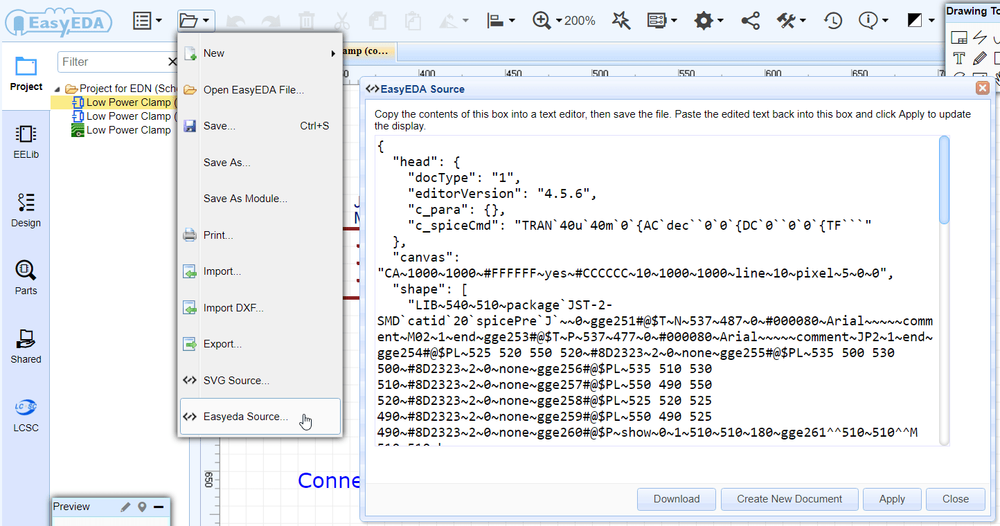

# 导出 

立创EDA支持导出多种类型的文件，以便于满足你在多方面的需求。

## 导出原理图

导出原理图可通过点击：**文档 > 导出**会打开以下对话框：

-	**导出选项：**PDF，PNG，SVG。
-	**宽：** 该选项指导出图片的宽度。默认为0，代表实际尺寸。数值越高代表导出的分辨率越高，比如你输入1024，那么导出PNG图片的宽度为1024像素，图片高则根据原理图自动调整。
-	**线宽增量：** 0代表实际尺寸。当你设置为1时，线宽会增大一倍。如下图，左边线宽为0，右边线宽为1.

### 导出BOM

立创EDA支持导出BOM表(物料清单)，以便于你购买所需的零件。
BOM导出可以点击工具栏的BOM图标：

点击后会弹出一个导出对话框，在这个对话框里，你还可以为零件指定立创商城的零件编号，可在立创商城购买元件时直接上传BOM表即可：

点击分配图标后会打开元件库搜索框，在这里找到你想要的零件后然后点击“分配”完成编号指定：

之后点击“从立创商城购买”按钮即可下载CSV格式的BOM表。未来BOM导出功能会与立创商城打通，一键加入购物车功能将实现，届时将大大方便用户采购元件。

BOM打开后如图：

### 导出网表

EasyEDA can export the netlist for the active schematic (Document) and/or for the whole active project:

**Super menu > Miscellaneous > Netlist for Document or Netlist for Project**

EasyEDA can export a netlist in a variety of formats: 

-   **Spice**: this is a Spice3f5 compatible netlist generated by the simulation engine of EasyEDA, [Ngspice](http://www.google.com/url?q=http%3A%2F%2Fngspice.sourceforge.net%2Fpresentation.html&sa=D&sntz=1&usg=AFQjCNEvVOggHskD819G-5EW8EB59FL5mw). It is not normally used as the basis for as a PCB layout.
-   [KiCad](http://www.kicad-pcb.org/): a PCB netlist in a format that can be imported straight into Pcbnew, the PCB layout tool part of the free, open source cross-platform EDA suite.
-   **Altium Designer**: a PCB netlist in a format that can be imported straight into Altium Designer and it’s predecessor, Protel. 
-   **Pads**: a PCB netlist in a format that can be imported straight into Pads PCB layout tools.
-   [FreePCB](http://www.freepcb.com/): a PCB netlist in a format that can be imported straight into FreePCB, a  free, open source PCB editor for Windows.

## 导出PCB

### 生成制造文件

When you finish your PCB, you can output the Fabrication Files(gerber file) via :  
**Super menu > Miscellaneous > Fabrication Output**，or by clicking the Fabrication Output button from the toolbar.

It will open a webpage to you, and you can download the gerber as a zipfile.

### 导出坐标信息

In PCB editor, if you want to generate Pick And Place as a CSV file, you can via:   

**Super Menu > Miscellaneous > Generates Pick And Place File**  

When you open the exported CSV file, you can see:  

### 导出的文件格式

Exporting a PCB design or footprints from EasyEDA is very similar to exporting a Schematic or a Symbol.

Using:

**Document > Export…**

you can open this dialog:

You can select to export in PDF, drawing (.PNG) or SVG format.

**Note:** *If you want to print the PCB 1:1 with the paper, you need to choose to export PDF(1:1).*

You can select to print individual layers or selected layers merged into a single file.

It is also possible to mirror selected layers for example to show bottom layers in easily readable orientation.

### 导出打印并腐蚀

If you don’t want to order your PCBs from EasyEDA then maybe - for single and double sided PCB designs -  you might like to try like using some home made PCB tech:

[http://hackaday.com/2012/12/10/10-ways-to-etch-pcbs-at-home/](http://hackaday.com/2012/12/10/10-ways-to-etch-pcbs-at-home/)

So here’s how you can print your PCB layer by layer and then etch it onto a PCB.

Step 1) Export it to PDF, Using: **Document > Export…**, or **Document > Print…**

   

**Note:** *Make sure the Colour is Black on White Background.*

Step 2) Open the pdf file in a viewer

Step 3) Print it to paper

Step 4) Copy it to the copper

Step 5) Etch it.

Step 6) Drill it ...

Step 7) Get your soldering iron out!

 

## 导出SVG源文件 

You can create an SVG sourcefile via: 

**Document > SVG source...**

then copy the contents of this box into a text editor and save the file with a .svg extension. You can edit it in [Inkscape](http://www.inkscape.org/) or open it in your browser.

This solution doesn’t need an internet connect so if you open EasyEDA offline, you can use it.

  

## 导出EasyEDA源码文件

You can create an EasyEDA source file via: 

**Document > EasyEDA Source...**

  

EasyEDA Source is a **JSON** file which can be read by many other programs. Please see:

[http://en.wikipedia.org/wiki/JSON](http://en.wikipedia.org/wiki/JSON)

for more information.

The open EasyEDA Source file allows you to work on files at a text level which enables some powerful ways to manipulate schematic and spice files and symbols as well as PCB files and footprints.

Click on the **Download** button or copy the contents of this EasyEDA source into any text editor, then save the file. You can paste the text back into this box and click Apply to update the display. If you have made no changes to the text then the canvas will show your file exactly as if it was saved and reopened from the EasyEDA server.

This is a good way to share/backup your works. Your file doesn’t need to be saved to EasyEDA’s server. It can be highly compressed in any readily available format such as such as zip or 7z. It can be emailed to anyone who can then open it in EasyEDA without worrying if they have the same libraries as you.

EasyEDA team will provide more details of the EasyEDA Source soon to show how you can edit and even create drawings, schematics, symbols, footprints and PCB layouts in EasyEDA Source. It is also possible to copy and edit symbols straight out of a Schematic and save them as new Schematic Lib or Spice Symbols and even to create a new Spice Subckt from a Schematic.