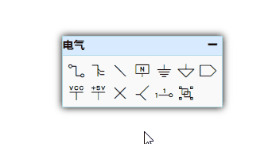
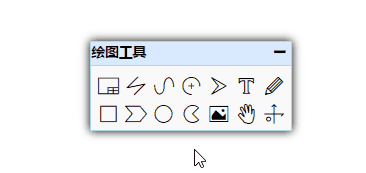
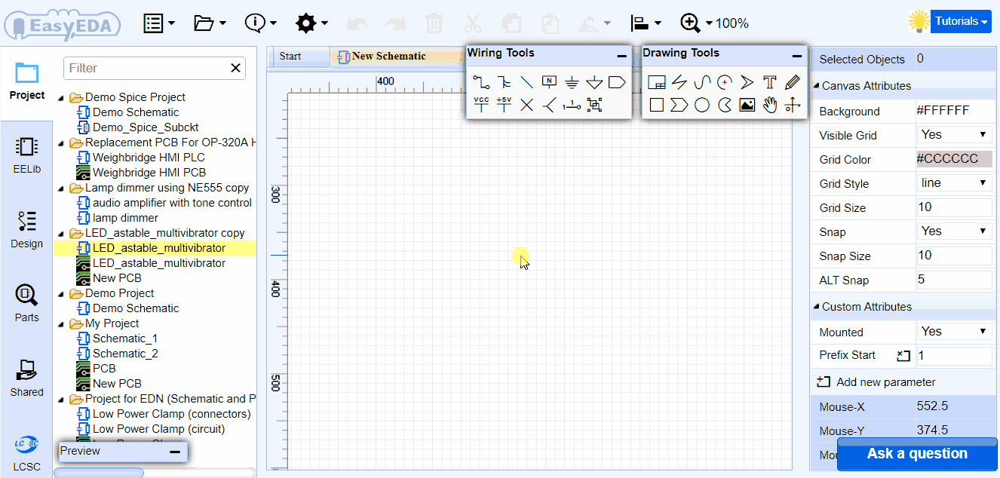

# 立创EDA介绍

## 什么是立创EDA

**欢迎使用立创EDA/LCEDA**

- 立创EDA是一款基于浏览器的，友好易用的，强大的EDA工具, 服务于广大电子工程师,教育者,学生,制造商和爱好者。致力于中小原理图PCB工程的设计，仿真与实现。  
 
- 立创EAD可以不需要安装任何软件或插件。只需在任何支持HTML5,标准兼容的web浏览器打开立创EDA即可。请优先使用最新版Chrome和FireFox浏览器，其他浏览器立创EDA暂时不做适配。

- 国内个人用户永久免费，提供友好的社区支持。社区请访问：[http://club.szlcsc.com/forum/97_0_1.html/](http://club.szlcsc.com/forum/97_0_1.html)
 
- 立创EDA是知名在线EDA软件EasyEDA的国内版本，立创EDA专注国内用户，EasyEDA专注国外用户；立创EDA和EasyEDA功能上一致，编辑器和客户端同步更新；国内版与国外版账号数据系统相对独立，不互通，已经注册EasyEDA的用户请及时将账号数据迁移至国内版，迁移地址：[https://easyeda.com/applyForLceda](https://easyeda.com/applyForLceda)；因为立创EDA数据服务器建立在国内，所以国内用户访问立创EDA速度更快，基本无EasyEDA的卡顿现象。在今后国内用户访问EasyEDA都会导向LCEDA。

- 无论你使用的是Linux, Mac , Windows，立创EDA均可以为你提供专业的优质服务。访问地址：[https://lceda.cn/editor](https://lceda.cn/editor) 

- 现已提供桌面客户端下载，画图更流畅：[https://lceda.cn/page/download](https://lceda.cn/page/download)

**注意：***在首次使用立创EDA进行项目设计前，请花两小时阅读本帮助文档以及[LCEDA国内用户使用注意事项](https://lceda.cn/page/FAQ)，可极大提高你的设计效率，减少出错！*
  
**不收费立创EDA怎么生存？**  

- 立创EDA目前提供立创商城元器件销售，PCB打样与批量订单，PCB贴片服务。未来还会为企业用户提供付费服务。    

- 如果你想支持立创EDA更好的发展请在立创商城([www.szlcsc.com](www.szlcsc.com))购买元件，或者在立创EDA这里进行PCB打样与贴片([www.sz-jlc.com](www.sz-jlc.com))。  

当然，你也可以将导出的Gerber文件发给任意一个厂家进行生产，立创EDA并没有做任何使用限制！！

**立创EDA可提供：**

-   原理图绘制
-   基于[NgSpice](http://ngspice.sourceforge.net/)的仿真功能
-   PCB设计
-   PCB设计规则检查
-   PCB网表导出支持(Altium Designer, [Kicad](http://www.kicad-pcb.org/), PADS, Spice网表)  
-   仿真波形图导出(SVG格式)
-   原理图导出支持(SVG, PNG, PDF)
-   生成BOM表
-   生成Gerber文件
-   生成坐标文件
-   工程文件下载
-   PCB预览(2D)
-   文件导入功能
  -   	Altium/ProtelDXP Ascii 原理图/PCB(导入的AD文件必须是以ASCII格式保存的文件)
  -   	Eagle 原理图/PCB/库文件
  -   	LTspice原理图/符号 (需要被Ngspice兼容)
  -   	[Kicad](http://www.kicad-pcb.org/)的封装库和模块
  -   	Spice模块和子电路
-   原理图库的创建和编辑
-   支持多表格原理图和多页原理图
-   Spice子电路创建
-   波形图浏览
-   仿真数据量测
-   PCB封装库创建和编辑
-   简单又强大的绘制能力
-   原理图库，PCB库和仿真符库的管理
-   在线分享和多人协助

## 使用界面

立创EDA拥有一个友好的，简洁的，美观的使用界面。

### 全局界面

**原理图界面**

**PCB界面**
 

### 简洁的操作界面

立创EDA有两个区域非常重要，分别是左边标识为2的导航面板，右边标识为9的属性面板。工程，元件库等均可以在导航面板找到；通过选择你需要的项目，在属性面板可以查看和修改你想要的属性。

#### 1. 筛选器

使用筛选器，只需要输入部分字符就可以很方便地搜索出想要的东西。 在工程按钮下，可以很方便搜索工程，工程里面的文件。在基础库可以很方便搜索想要的零件符号。比如直接在基础库搜索 “555” 即可将 555定时器搜索出来。

  

筛选器只能搜索标题，文件或工程的描述无法搜索。

点击 `X` 清除筛选内容。

#### 2. 导航面板

导航面板是立创EDA非常重要的一个组成模块，你可以在这里找到你的工程，系统基础库，设计管理器，元件库，他人共享给你的文件等。

  

**工程**  

在这里，你可以找到你的所有工程及文件，包括你私人的，已共享的，直接拷贝被人的工程文件。

除了元件库，它们均可以使用邮件菜单。如工程文件下的右键菜单：

**基础库**

这里包含了很多常用的库文件，可以很方便的使用，只需鼠标单击后移动至原理图画布即可。该处不允许自定义。 

**设计管理器**

设计管理器，在原理图下你可以很方便地检查每个零件和每条网络；在PCB下这里还可以查看设计规则错误(DRC)。

**元件库** 

包含了原理图库和封装库，其中包括系统库和用户共享库。你的个人库文件也在这里。  

 

**共享**

如果你的伙伴使用 **访问控制** 功能将他的工程共享给你，那么共享的工程会出现在这里。如果对方使用的是公众共享功能，共享给你的工程不会出现在这里。

更多信息请访问[“访问控制”](./Share.htm#访问控制)。

**立创商城**

你若需要购买元器件进行PCB制作，建议通过这里购买。立创商城提供了6W+的元器件对外销售，是目前国内领先的元器件自营商城，经营的元器件均是正品，可放心购买。立创EDA和立创商城共同属于深圳市立创电子商务有限公司。

访问地址：[www.szlcsc.com](www.szlcsc.com)。 

 

#### 3. 工具栏

编辑器提供简单美观的功能图标。

工具栏图标可通过“常用按钮设置”进行配置。

配置方式简单明了。

选中后可以点击隐藏/显示，上移下移来调整在工具栏的位置。

#### 4. 预览窗口

当你选择一个原理图或PCB时，可以在这里进行预览。因为需要从服务器进行加载，所以预览图需要

你可以通过 

 **超级菜单 > 查看 > 工具栏 > 预览** 或者在工具栏 **配置 > 工具栏 > 预览** 处进行打开这个功能.

-  在右下角处，拖动可以进行放大缩小。
-  无法关闭，你可以点击右上角的 - 进行收缩窗口。
-  点击铅笔图标可以打开当前预览文件。

  

#### 5. 电气工具

编辑器会根据不同的类型显示不同工具栏。以下是原理图的电气工具。  

#### 6. 用户管理菜单

在这里你可以切换至团队，切换语言，修改系统设置等。

#### 7. 超级菜单

编辑器全部的菜单功能均可以在这里找到。这里面很多功能均可以通过设置快捷键的方式使用，也建议你使用快捷键，可提高设计效率。

#### 8. 绘图工具

绘图工具和电气工具，和PCB绘制工具均可以通过拉伸窗口进行调节大小，也可以随意拖动位置。

#### 9. 画布属性

点击画布空白处后就可以在右边面板查看与修改画布属性。

背景颜色，网格，网格样式，大小，栅格等属性均可以修改。

#### 10. 画布

画布区域是主要工作区，在这里可完成原理图的创建和绘制编辑，库文件符号的绘制和编辑，PCB的创建，布局和编辑，仿真与波形查看等。

**原理图**  
  

**PCB**  
  

**库符号**  
  

**封装**  

**其他绘图**  

**仿真波形**  

## 如何创建一个工程或文件

在登录后，通过点击
 **文件 > 新建 > 工程...** 或 **文件 > 新建 > 原理图..等**
   

“工程”概念在编辑器中非常重要，在新建原理图，PCB等一些文件前必须存在一个工程文件夹才可进行新建，否则需要新建一个工程，以便于管理新建的文件。

 

设置名称并点击确认后，新建的工程将在左边的“工程”处显示。

在新建时，你还可以选择这个工程是私人的还是共享的。

选择共享后，该工程与其下的文件将显示在你的个人主页上，任何人都可以查看复制你的设计。添加的描述可以帮忙别人了解你的设计内容。

若创建后你想修改你的工程信息，你可在工程文件夹右键，选择编辑工程。

将打开一个网页，你可以修改工程的相关信息。

### 历史版本 

如果你想找回你原来的一些文件版本，你可以在单击文件右键后选择历史版本。  

点击后会打开一个页面，里面会列出最近的历史版本。  
 
,  

点击历史版本号，可以在编辑器打开查看，找到你想要的后，保存即可。

**注意:***请不要频繁对你的文件进行保存操作，否则这里会产生大量的历史版本，要找到你想要的版本将会非常困难。立创EDA会在你每保存一次时生成一个历史版本编号，为减少服务器负担，请尽量不要频繁进行保存操作。*

​

## 功能介绍

### 原理图绘制

立创EDA可以创建很专业的原理图。

  

立创EDA有一些简单而强大的绘图功能，你可以通过复制现有的符号复制到自己的库中，然后编辑和保存，来创建自己的库文件，或者从头开始绘制新的原理图库文件。

编辑器提供了 **原理图库向导**，以便于迅速创建 `DIP`, `QFP` 和 `SIP`类的原理图符号。

立创EDA除了普通的简单的“2D”图形库之外，还有一个“3D”零件符号库，连接后看起来与实物相似。

如果你有足够的耐心，你可以创建很漂亮的3D形状的原理图。

还有一个强大的功能是可以从AD，Kicad，Eagle等导入原理图PCB库符号。

### 元件库管理

**系统库文件**

感谢于免费和开源的Kicad库和一些开源的Eagle库，加上立创商城自身创建的库文档，立创EDA已经有超过50w个元件库，基本上已经可以满足大部分设计需要。

你基本可以不用花太多时间去寻找和创建新的原理图库和封装库就可以进行设计。

**用户贡献库文件**

用户建立的库文件会自动共享至用户贡献库中，立创EDA认为，库文件的共享可以使更多人使用到你的库文件，减少重复的创建库文件的工作。并且库文件共享并不会产生数据安全性问题，需要关注的是用户私人的工程以及文档。
用户贡献的库文件在使用时，点击后在右边属性面板可以看到一个“Contributor(贡献者)”参数，显示共享者的用户名。

**查找库文件**

在左边导航面板的“基础库”和“元件库”，点击后输入你想要的库名称后搜索即可。

**创建个人库文件**

立创EDA支持创建个人库文件，创建的库文件可以在 **元件库 > 我的库文件** 中找到，并且很容易进行管理。
​

### PCB设计

1.立创EDA可以快速地通过原理图创建PCB，甚至是复杂的多层原理图。

在原理图下点击工具栏图标 **原理图转PCB** 即可快速转为PCB。  

立创EDA也支持没有原理图的PCB设计。

2.立创EDA具有大量的封装库文件，但你也可以通过创建新的封装文件，创建可以重新创建、通过修改编辑原有的封装、复制封装等方式创建。

3.为了方便查找和定位封装位置，立创EDA在左边面板提供了一个设计管理器。

设计管理器可以很方便的查找元件(封装)，走线(网络)，焊盘(网络焊盘)，还有DRC错误列表。

当点击任一项目后，画布中会将当前的项目（封装或者网络）进行居中高亮，以方便识别。

4.使用层工具可以显示你所需要的层，和编辑所在的层。你也可以修改PCB的层数和显示颜色，通过：**超级菜单 > 杂项 > 层配置...**

5.在设计规则检查对话框中，默认的走线宽度、间隙和通过孔尺寸都可以进行配置：**超级菜单 > 杂项 > 设计规则设置...**

在你完成PCB设计并发送Gerber和钻孔文件给PCB厂生产前，设计规则检查几乎是最后的一步工作，所以在你开始PCB布线之前，最好先进行规则设置。

在发送Gerber给PCB厂商之前，你需要使用Gerber查看器检查生成的gerber是否符合要求，这里推荐开源免费的Gerber查看软件[Gerbv: http://gerbv.geda-project.org/](http://gerbv.geda-project.org/) 

6.完成PCB后，你还可以把物料清单“BOM”表导出，以便于购买元器件：工具栏BOM图标。

7.PCB你也可以导出高质量的文件 `SVG`, `.PNG` or `.PDF`。

8.PCB也可以和原理图一样对外进行分享。

9.PCB设计的尺寸在立创EDA是没有限制的，一般超过100cm x 100cm也是允许的，但是这需要你有一个很强大的电脑，因为在浏览器下，绘制大面积的PCB会产生卡顿现象。

立创EDA默认支持6层板，但它可以支持更多， 所以若你需要更多层请联系立创EDA技术支持，联系方式请查看下方[寻求帮助](#寻求帮助)章节。

10.封装查找 

PCB的封装查找与原理图的库文件查找一致，在“元件库”中，查找后，选择所需的封装点击“放置”即可放置在画布中。

### 工程设计流程图 

设计流程如下：  

### 账号管理

立创EDA是一种基于网络的服务，账号与数据均加密保存在服务器上，你最好创建一个帐户来管理自己的设计和元件库。创建一个帐号很简单，只要你愿意，你可以免费访问立创EDA的全部功能。  

#### 注册登录

在用户管理菜单，点击注册：

点击后会打开一个新页面，该页面可以进行注册和登录：

输入相关信息后注册/登录即可。

**注意：***因国家相关政策规定，所有注册账户必须登记手机号码；一旦你创建了帐户，你只有一次修改你的用户名的机会，请谨慎命名。*

#### 重置密码

你的密码是经过加密处理的，立创EDA也不知道密码是什么，如果你忘记密码可以通过使用登录界面/用户菜单的“忘记密码”链接进行找回，系统会发短信给你进行确认，请确保你仍然使用原注册的手机号。在你要更换手机号码之前请及时在个人中心更换新手机号码。  

#### 团队协作

立创EDA提供了团队功能，该功能可以使你和伙伴共同进行项目协作设计，当你和伙伴共同登录在团队账号下时，可访问团队的全部库文件，原理图，PCB和其他工程文件。

**团队功能在哪**

在个人中心[https://lceda.cn/account](https://lceda.cn/account)，存在一个团队选项。可创建团队，若已存在团队，点击后可直接切换至团队下。

    

**如何创建团队**

1.如上面图所示，在登录后点击[https://lceda.cn/teams/create](https://lceda.cn/teams/create)进行创建新团队。

2.在**用户菜单 > 团队 > 新建团队**  进行创建团队。  

    

创建完成后，点击团队进行切换至团队状态下，然后你邀请你的伙伴加入团队即可。  

  

**如何切换至团队下**

1) 进入个人中心切换。  
   点击你创建的团队名称，然后网页会进行重定向，之后就会切换至团队下。

     

   切换后你可以对你的队员/团队项目进行管理。

2) 在编辑器切换。  
   在 用户菜单 > 团队 选项，选择然后点击你的团队名称即可切换在团队下的编辑器。当前编辑器用户名也会切换至团队名。

     

**如何更新至团队**

如果你想把你的设计贡献到团队中，可在个人中心中使用下图的更新至团队功能。

  **注意：***若你进行了更新至团队操作，你的个人库文件，工程等均会移动至团队下，且不可逆！！！*

  

**团队功能使用技巧**  

1.如果你切换至团队下，你将不能在元件库中使用你原先个人账户下创建的库文件，如果要使用你必须先收藏你个人账号下的库文件，或者直接搜索库文件名称。

2.你必须了解到你的个人账户和团队账户是相对独立的账号，你无法在同一个浏览器的标签下同时使用。若要使用个人账户必须在其他浏览器打开。

3.在你成为团队所有者之后，最好为团队创建所需的库文件。

4.如果你加入一个成员，并将他提名为会计师，他就可以处理团队的账单和发票。

#### 个人偏好

在用户菜单下，点击个人偏好：

  

其中，  

- **热键同步：**指同步你设置的快捷键指服务器，默认勾选，不可取消。  
	    
- **语言：**设置默认语言，会同步至服务器。

- **最大备份级数：** 每个打开的文档自动创建备份的数目。该备份是指备份至本地的数目，详细请查看下面的“恢复备份数据”。

- **自动备份(分钟)：** 这是自动保存所有打开文档的时间间隔。

- **保存到服务器：** 将你的个人偏好保存至服务器中(工具栏配置，个人库，快捷键设置， 语言设置等)。

- **从服务器加载：** 立创EDA不会主动将你的个人偏好加载到本地，所以你必须进行手动加载。当你更换浏览器和电脑的时候也可以进行手动加载个人偏好。

如果你没有保存个人偏好至服务器，点击从服务器加载将不会产生任何影响。

#### 恢复备份数据

没有什么数据是绝对安全，但是立创EDA会尽最大努力保障你的数据安全。

立创EDA会为你已经打开的文件进行自动保存和创建备份，当你误删文件或需要之前的版本时，你可以使用恢复数据备份进行数据恢复。

在 **用户菜单**，点击 **恢复备份数据** ，或者点击工具栏的 **恢复备份数据** 图标打开：

选择你想要的文件版本后，点击“恢复”按钮即可在新标签打开，然后进行编辑保存即可。

**注意：**  

- *立创EDA编辑器保存这些备份文件在你的本地电脑，而不是服务器，当你更换电脑后将无法使用自动备份的数据。*  
- *自动备份是以浏览器缓存的方式进行保存，如果你清除了立创EDA网站的缓存，那么这些备份数据也会被清除。*
- *若你已经清除了浏览器缓存，你还可以使用前面所说的“历史版本”功能找回想要的版本。已删除的文件可以在文件回收站找回：[https://lceda.cn/document/recycle](https://lceda.cn/document/recycle)*

#### 账号注销

若你想注销你注册的立创EDA账号，你可以点击：[https://lceda.cn/account/close](https://lceda.cn/account/close)。
注销前请告知原因，立创EDA将往更好的方面改善。

### 快捷键

立创EDA提供了很多快捷键供用户使用，每一个快捷键均可以进行配置。

进入快捷键配置选项：

或在“**超级菜单 > 杂项 > 热键配置**”处打开。

点击你需要修改的选项，出现输入框后按下你的按键，再保存即可完成快捷键设置。

**文档类型** 该列表示快捷键在对应的文档类型内是有效的。

- **所有：** 在编辑器内所有的文件类型。
- **原理图：** 原理图和原理图库文件。
- **PCB：** PCB和PCB库文件。

相同的快捷键可以使用在不同的文档中，比如在原理图使用“C”键画圆弧，在PCB中是画一个圆形。

默认的快捷键列表如下。
<table>
   <tr>
      <td>序号</td>
      <td>文档类型</td>
      <td>快捷键</td>
      <td>功能</td>
   </tr>
   <tr>
      <td>0</td>
      <td>所有</td>
      <td>Space</td>
      <td>选择所选图形</td>
   </tr>
   <tr>
      <td>1</td>
      <td>所有</td>
      <td>Left</td>
      <td>向左滚动或左移所选图形</td>
   </tr>
   <tr>
      <td>2</td>
      <td>所有</td>
      <td>Right</td>
      <td>向右滚动或右移所选图形</td>
   </tr>
   <tr>
      <td>3</td>
      <td>所有</td>
      <td>Up</td>
      <td>向上滚动或上移所选图形</td>
   </tr>
   <tr>
      <td>4</td>
      <td>所有</td>
      <td>Down</td>
      <td>向下滚动或下移所选图形</td>
   </tr>
   <tr>
      <td>5</td>
      <td>所有</td>
      <td>Ctrl+X</td>
      <td>剪切</td>
   </tr>
   <tr>
      <td>6</td>
      <td>所有</td>
      <td>Ctrl+C</td>
      <td>复制</td>
   </tr>
   <tr>
      <td>7</td>
      <td>所有</td>
      <td>Ctrl+V</td>
      <td>粘贴</td>
   </tr>
   <tr>
      <td>8</td>
      <td>所有</td>
      <td>Ctrl+Shift+V</td>
      <td>跨文档粘贴</td>
   </tr>
   <tr>
      <td>9</td>
      <td>所有</td>
      <td>Delete</td>
      <td>删除所选</td>
   </tr>
   <tr>
      <td>10</td>
      <td>所有</td>
      <td>Ctrl+A</td>
      <td>全选</td>
   </tr>
   <tr>
      <td>11</td>
      <td>所有</td>
      <td>Esc</td>
      <td>取消绘制</td>
   </tr>
   <tr>
      <td>12</td>
      <td>所有</td>
      <td>Ctrl+Z</td>
      <td>撤销</td>
   </tr>
   <tr>
      <td>13</td>
      <td>所有</td>
      <td>Ctrl+Y</td>
      <td>重做</td>
   </tr>
   <tr>
      <td>14</td>
      <td>所有</td>
      <td>Ctrl+S</td>
      <td>保存</td>
   </tr>
   <tr>
      <td>15</td>
      <td>所有</td>
      <td>A</td>
      <td>放大</td>
   </tr>
   <tr>
      <td>16</td>
      <td>所有</td>
      <td>Z</td>
      <td>缩小</td>
   </tr>
   <tr>
      <td>17</td>
      <td>所有</td>
      <td>X</td>
      <td>水平翻转</td>
   </tr>
   <tr>
      <td>18</td>
      <td>所有</td>
      <td>Y</td>
      <td>垂直翻转</td>
   </tr>
   <tr>
      <td>19</td>
      <td>所有</td>
      <td>G</td>
      <td>吸附</td>
   </tr>
   <tr>
      <td>20</td>
      <td>所有</td>
      <td>Ctrl+F</td>
      <td>查找元件</td>
   </tr>
   <tr>
      <td>21</td>
      <td>所有</td>
      <td>Ctrl+D</td>
      <td>设计管理器</td>
   </tr>
   <tr>
      <td>22</td>
      <td>所有</td>
      <td>D</td>
      <td>拖动</td>
   </tr>
   <tr>
      <td>23</td>
      <td>原理图</td>
      <td>W</td>
      <td>绘制导线</td>
   </tr>
   <tr>
      <td>24</td>
      <td>原理图</td>
      <td>B</td>
      <td>绘制总线</td>
   </tr>
   <tr>
      <td>25</td>
      <td>原理图</td>
      <td>U</td>
      <td>总线分支</td>
   </tr>
   <tr>
      <td>26</td>
      <td>原理图</td>
      <td>N</td>
      <td>网络标签</td>
   </tr>
   <tr>
      <td>27</td>
      <td>原理图</td>
      <td>Ctrl+Q</td>
      <td>标识符 VCC</td>
   </tr>
   <tr>
      <td>28</td>
      <td>原理图</td>
      <td>Ctrl+G</td>
      <td>标识符 GND</td>
   </tr>
   <tr>
      <td>29</td>
      <td>原理图</td>
      <td>P</td>
      <td>放置管脚</td>
   </tr>
   <tr>
      <td>30</td>
      <td>原理图</td>
      <td>L</td>
      <td>绘制折线</td>
   </tr>
   <tr>
      <td>31</td>
      <td>原理图</td>
      <td>O</td>
      <td>绘制多边形</td>
   </tr>
   <tr>
      <td>32</td>
      <td>原理图</td>
      <td>Q</td>
      <td>绘制贝塞尔曲线</td>
   </tr>
   <tr>
      <td>33</td>
      <td>原理图</td>
      <td>C</td>
      <td>绘制圆弧</td>
   </tr>
   <tr>
      <td>34</td>
      <td>原理图</td>
      <td>S</td>
      <td>绘制矩形</td>
   </tr>
   <tr>
      <td>35</td>
      <td>原理图</td>
      <td>E</td>
      <td>绘制椭圆</td>
   </tr>
   <tr>
      <td>36</td>
      <td>原理图</td>
      <td>F</td>
      <td>自由绘制</td>
   </tr>
   <tr>
      <td>37</td>
      <td>原理图</td>
      <td>T</td>
      <td>放置文本</td>
   </tr>
   <tr>
      <td>38</td>
      <td>原理图</td>
      <td>I</td>
      <td>修改选中器件</td>
   </tr>
   <tr>
      <td>39</td>
      <td>原理图</td>
      <td>Ctrl+R</td>
      <td>运行当前文档</td>
   </tr>
   <tr>
      <td>40</td>
      <td>PCB</td>
      <td>W</td>
      <td>绘制走线</td>
   </tr>
   <tr>
      <td>41</td>
      <td>PCB</td>
      <td>U</td>
      <td>绘制圆弧</td>
   </tr>
   <tr>
      <td>42</td>
      <td>PCB</td>
      <td>C</td>
      <td>绘制圆形</td>
   </tr>
   <tr>
      <td>43</td>
      <td>PCB</td>
      <td>N</td>
      <td>放置尺寸</td>
   </tr>
   <tr>
      <td>44</td>
      <td>PCB</td>
      <td>S</td>
      <td>放置文本</td>
   </tr>
   <tr>
      <td>45</td>
      <td>PCB</td>
      <td>O</td>
      <td>放置连接线</td>
   </tr>
   <tr>
      <td>46</td>
      <td>PCB</td>
      <td>E</td>
      <td>绘制铺铜</td>
   </tr>
   <tr>
      <td>47</td>
      <td>PCB</td>
      <td>T</td>
      <td>切换至顶层</td>
   </tr>
   <tr>
      <td>48</td>
      <td>PCB</td>
      <td>B</td>
      <td>切换至底层</td>
   </tr>
   <tr>
      <td>49</td>
      <td>PCB</td>
      <td>1</td>
      <td>切换至内层1</td>
   </tr>
   <tr>
      <td>50</td>
      <td>PCB</td>
      <td>2</td>
      <td>切换至内层2</td>
   </tr>
   <tr>
      <td>51</td>
      <td>PCB</td>
      <td>3</td>
      <td>切换至内层3</td>
   </tr>
   <tr>
      <td>52</td>
      <td>PCB</td>
      <td>4</td>
      <td>切换至内层4</td>
   </tr>
   <tr>
      <td>53</td>
      <td>PCB</td>
      <td>P</td>
      <td>放置焊盘</td>
   </tr>
   <tr>
      <td>54</td>
      <td>PCB</td>
      <td>V</td>
      <td>放置过孔</td>
   </tr>
   <tr>
      <td>55</td>
      <td>PCB</td>
      <td>M</td>
      <td>量测距离</td>
   </tr>
   <tr>
      <td>56</td>
      <td>PCB</td>
      <td>L</td>
      <td>改变布线角度</td>
   </tr>
   <tr>
      <td>57</td>
      <td>PCB</td>
      <td>-</td>
      <td>减少线宽</td>
   </tr>
   <tr>
      <td>58</td>
      <td>PCB</td>
      <td>+</td>
      <td>增加线宽</td>
   </tr>
   <tr>
      <td>59</td>
      <td>PCB</td>
      <td>Alt+-</td>
      <td>减少栅格尺寸</td>
   </tr>
   <tr>
      <td>60</td>
      <td>PCB</td>
      <td>Alt++</td>
      <td>增加栅格尺寸</td>
   </tr>
   <tr>
      <td>61</td>
      <td>PCB</td>
      <td>H</td>
      <td>高亮网络</td>
   </tr>
   <tr>
      <td>62</td>
      <td>PCB</td>
      <td>Shift+M</td>
      <td>删除所有铺铜</td>
   </tr>
   <tr>
      <td>63</td>
      <td>PCB</td>
      <td>Shift+B</td>
      <td>重建所有铺铜</td>
   </tr>
   <tr>
      <td>64</td>
      <td>所有</td>
      <td>K</td>
      <td>适合窗口</td>
   </tr>
   <tr>
      <td>65</td>
      <td>所有</td>
      <td>Shift+X</td>
      <td>交叉选择模式</td>
   </tr>
   <tr>
      <td>67</td>
      <td>所有</td>
      <td>Shif+F</td>
      <td>浏览和查找元件库</td>
   </tr>

</table>

### 基础技巧.

为了方便使用立创EDA进行设计，你需要了解一些基础的使用技巧，请打开编辑器并新建一个原理图文件进行体验。

#### 改变画布大小

当你鼠标移动经过画布边沿时（上方，左右），会出现一条高亮的线段，点击上方的那条可以打开/关闭工具栏，点击左右两边的线段的中间按钮可以关闭/打开导航面板和属性面板，以增大画布面积。左右两边的线段还可以用鼠标拖动改变面板大小，以符合使用的习惯。  

#### 光标样式

如果你不喜欢十字光标样式，你可以选择关闭它。**超级菜单 > 查看 > 十字光标**

这两种光标如下，左边是无十字光标，右边是十字光标样式。 

#### 批量清除

如果你觉得你的原理图和PCB太乱，需要批量删除时，你可以：

- **超级菜单 > 编辑 > 清除**，或者CTRL + A全选后，按Delete键删除。
- 删除文件并创建一个新的。  
- 使用工具栏的 **全局删除** 功能。  
  

#### 鼠标左击

与其他EDA软件相似： 

-   点击一个对象并已经选中它，可以在右边属性面板查看它的属性；
-   选中后长按可以保持它，和拖动它；
-   在空白区长按并拖动鼠标可以创建一个选择区域；
-   在选择区域内的对象可以通过鼠标进行整体移动；
-   双击文本可以对它进行编辑；

#### 鼠标右击

立创EDA暂时不支持画布内右键菜单。

-   当你进行放置元器件或者封装时，单击右键可以停止放置动作；
-   当你进行画线时，单击右键可以停止当前画线，以便进行第二处画线操作；
-   当你画多边形等形状时，画线位置会停止在你右击的位置，然后你还可以改变画线形状继续画线。
-   当你双击右键时会退出当前操作。

#### ESC键

-  按单次“ESC”键结束当前的绘图操作，但不会退出当前的命令模式。
-  按两次“ESC”键推出当前的绘图操作，将光标返回到选择模式

#### 选择多项目

-   CTRL + 左键一个个点击选择你所需要的对象。
-   也可以直接按住左键拖动鼠标，批量选择对象。
-   CTRL + A全选对象。

#### 放大缩小

-   使用鼠标滚轮进行放大缩小
-   向前滚动放大，等同快捷键Z
-   向后滚动缩小，等同快捷键A

**注意：***有些浏览器在按住 CTRL + 滚轮 会导致整个浏览器浏览页面变大，而不是滚动画布，这时你可以按CTRL + 0 恢复界面。*  

#### 鼠标双击

鼠标左键双击目前仅对文本有效，双击任意文本可以打开可调节大小的文本编辑框，你可以输入你想要的文本。

在编辑器框内按Enter键回车换行，鼠标点击框外部区域关闭编辑框。

#### 平移

-   在画布内，可以通过长按右键/鼠标中键任意拖动画布位置。
-   你还可以使用滚动条和方向键平移画布。
-   当你绘制走线时，鼠标移动在最边沿后会停止。

**注意：***若你的浏览器右键拖动失效，请关闭浏览器手势。*

**提示：***如果你使用的是Chrome浏览器，鼠标在画布内时，按CTRL或ALT键，并滚动滚轮，画布可以垂直平移；若按住SHIFT键，并滚动滚轮，画布可以水平平移。*

#### 旋转

当选择一个或多个对象时，你可以将他们旋转：**超级菜单 > 编辑 > 旋转** 或者点击工具栏的旋转图标。

或者按下默认的快捷键“空格键”。图中Q零件就是翻转后的形态。

**注意：***旋转多个对象时，是以他们各自的原点进行旋转，而不是以整体中心旋转。*

#### 翻转

翻转是以中心轴进行翻转，如下方的三极管Q2，就可以由Q1翻转而来。

翻转与旋转放在一起，**超级菜单 > 编辑 > 翻转** 或者点击工具栏的旋转图标。

使用默认快捷键`X`进行水平翻转，`Y` 进行垂直翻转。

#### 对齐

立创EDA提供大量的对齐工具，可以很方便的对齐原理图符号以及PCB封装：

- 左对齐
- 右对齐
- 顶对齐
- 底对齐
- 水平居中对齐
- 垂直居中对齐
- 水平等距分布
- 垂直等距分布
- 左边沿等距分布
- 右边沿等距分布
- 对齐网格

#### 移到顶层或低层

该功能可以很方便将你想要的物件移动在最前面或者后面，以避免物件被最前面的遮挡。
如图的长方形和椭圆形均已经填充有颜色，分别是椭圆移到顶层和底层时的不同区别。

#### 文档标签切换

编辑器可以很方便地切换文档标签，只要鼠标左键按住标签，往左右拖动即可。
  

#### 保存文件在本地

尽管立创EDA已经将你的文件保存在服务器，如果你想保存在本地，立创EDA也有提供该功能。
你可以直接在工程“ 右键 > 下载工程 ”，或者直接在 “文档” 按钮使用 “EasyEDA格式源码” 保存文件。

具体可以浏览[导出EasyEDA源码文件](./Export.htm#导出EasyEDA源码文件)章节。

## 关于升级 

如果你使用的是网页版立创EDA，编辑器可以很容易的自动升级。立创EDA的升级方式是自动升级，不提供手动升级和暂停升级功能，也不提供降级选择。  

由于立创EDA使用的是一种网页APP缓存技术，可以让你在离线时继续使用([W3C HTML5 Offline Web Applications](http://dev.w3.org/html5/offline-webapps/))，但该技术有可能使在线升级失效。所以当立创EDA发布了新版本，你的编辑器一直没有自动更新至最新版本时，可以尝试以下操作：
 
- 关闭浏览器，并重新打开。
- 打开编辑器等待一段时间，若没有更新再进行刷新网页操作。
- 刷新后查看关于是否已经更新成功。

如果更新不成功，那么你需要清除浏览器缓存再次打开编辑器：   

**注意：***清除缓存会把原来的本地备份数据也清除！具体可看前面的 “恢复备份数据” 章节。*

**1.Firefox**  

-  点击 **菜单 > 选项 > 隐私 > 历史记录 > 清空近期历史记录**；
-  选择 **缓存** 后，点击立即清除。
-  重新打开立创EDA编辑器即可。

  

**2.Chrome**  

-  在地址栏输入 **chrome://appcache-internals/**   
-  找到**lceda.cn**并且点击 “**Remove Item**”。
-  然后打开编辑器即可。  

    

-  或者使用快捷键 **Ctrl+shift+Delete**或者打开 **设置 > 隐私设置和安全性 > 清除浏览数据**  来删除所有缓存。

   

## 寻求帮助

立创EDA为广大用户提供了友好的社区支持。社区请访问：[http://club.szlcsc.com/forum/97_0_1.html/](http://club.szlcsc.com/forum/97_0_1.html)  
目前立创EDA和立创社区的账号体系还没有打通，所以需要分别注册，在未来会打通两个账号系统。

1.  你可以在社区直接提问需求帮助，技术支持或资深用户会及时查看并回复。
2.  如果你不想别人看到你的问题，你可以联系技术支持。建议使用社区提问，以便作问题记录，方便其他用户查看和搜索，加速学习进度。
3.  如果你发现了编辑器的BUG，包括使用上的操作BUG，系统库文件的错误，请及时联系支持人员进行修复。

技术支持联系方式：QQ3001956291，或者邮件：3001956291@qq.com，立创EDA技术交流群：229233498

**注意：**  
- *如果是使用技巧上面的问题，请先查看本帮助文档后尝试自行解决，本文档已经阐述立创EDA几乎所有功能。若仍然不能解决，可通过以上方法联系技术支持人员。*  
-  *由于立创EDA没有太多的人力资源去专门处理这些问题，所以解决你的问题可能会有一定的滞后，技术支持人员会尽快回复解决。*  
-  *当前技术支持人员更多的是协助新用户对编辑器的熟悉和使用。*

