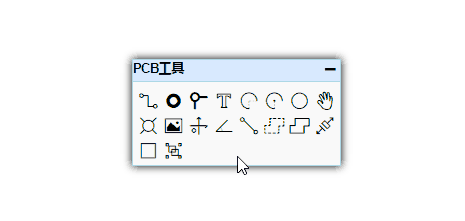
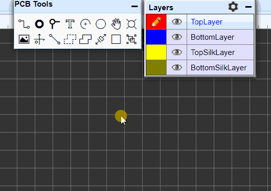
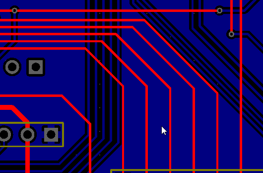
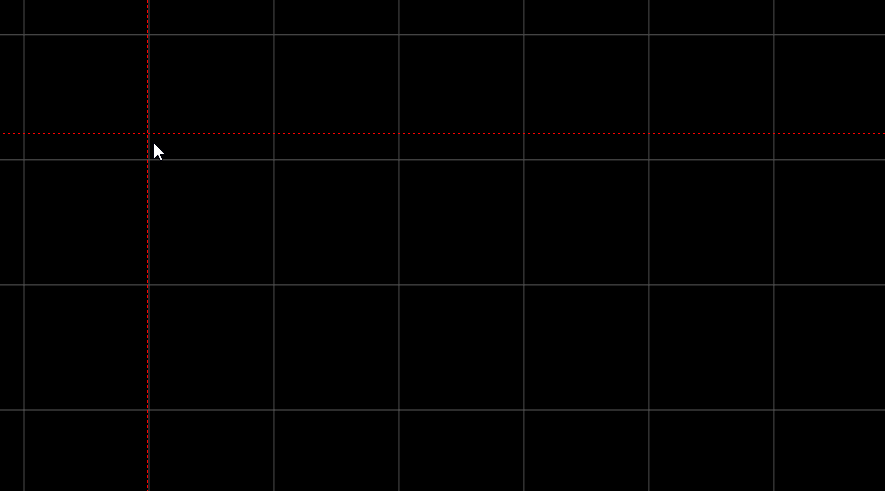
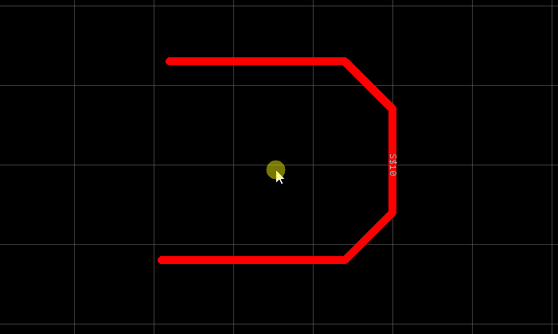
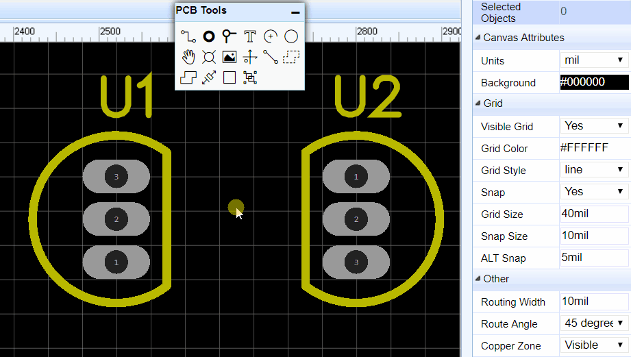

# PCB编辑器 

新建PCB编辑器有两种方式。  

-	前面章节中通过原理图转为PCB。
-	在“文档”>“新建”> “PCB”新建打开。

正常来说，在绘制PCB前，需要先设置PCB板子边框和设计规则。边框和设计规则请查阅后面章节。

## 画布 

**画布属性**

PCB画布属性和原理图画布属性大部分一致。点击PCB空白处在右边面板可以修改画布的尺寸单位，网格等。目前支持mm，inch，mil三种单位，精度至小数点后两位。

PCB中大部分对象，在选中它后，基本都可以在右边属性面板查看和修改它的属性。

**其他**

-	**线宽：**这里设置默认布线线宽。
-	**拐角：**设置默认布线的拐角方向。有：45°，90°，圆弧，任意角度。
-	**覆铜区：**这里可设置铺铜区域是否可见。选择否之后铺铜将消失，仅保留铺铜的边框。
-	**增加参数：**该参数仅对PCB画布用，可以做信息标记，不会应用到BOM和Netlist中。

## PCB工具
PCB工具提供很多功能以满足你绘制PCB的需求。  
有导线，焊盘，过孔，文本，圆弧，圆，拖动，通孔，图片，画布原点，量角器，连接焊盘，覆铜，实心填充，尺寸，矩形，组合/解散。

### 导线 

在原理图中使用快捷键“W”绘制导线，在PCB绘制导线的快捷键也是“W”。

**导线属性**

当你选中一条导线时，可以在右边属性面板修改它对应的属性。
  

**使用技巧**

1.  单击左键开始绘制导线；再次单击左键确认布线；单击右键取消布线；再次点击右键提出绘制导线模式。

2.  在顶层绘制导线的同时，使用切换至底层的快捷键“B”，可自动添加设置的过孔，走线并自动切换至底层继续布线。
   

3.  在布线过程中使用快捷键“+”，“ - ”可以很方便地调节当前的走线的大小。

4.  双击导线线段会增加一个节点，选择节点拖动可以调节走线角度。也可以通过拖动导线的末端端点将导线拉长或缩短。
  

5.  点击选择一个线段，可以拖动调整其位置。  
  

6.  在布线过程中可以使用快捷键“L”进行布线角度切换。
  

7.  使用空格键改变当前布线的方向。
  

8. 在走线过程中，想撤销上一段走线可以通过删除键“Delete”撤销。

9. 当按住“Shift”键并双击左键可以删除导线的线段。

### 焊盘 

放置焊盘的快捷键是“P”。
当你选中一个焊盘时，可以在右边属性面板修改它对应的属性。  

**编号：**若不是单独放置的焊盘，该编号会与原理图库文件的引脚编号相对应。  

**形状：** Round(圆形) , Rectangular(矩形) ,  Oval(椭圆形)和Polygon(多边形)。 如下图所示，选择多边形可以通过“编辑坐标点”创建复杂的形状。  
 

**层：**如果放置的焊盘是SMD类型或想它出现在单层，那么层请选择顶层或底层；若需要放置通孔类型焊盘，那么层请选择全部，焊盘将在顶层和底层出现。  

**网络：**如果PCB由原理图转来，此处会默认生成网络；若是单独放置的焊盘，此处为空。你可以无需为它设置网络，当走线连接到它时，将自动为它添加网络。  

**宽和高：** 当图形设置为圆时，宽和高会等值；当图形设置为多边形时，宽和高将不允许编辑。

**旋转角度：**你可以设置你想要的任意角度。

**Hole Shape：**内孔形状。有Round(圆形)，Slot(槽形)。普通的DIP封装以及电容等都是圆形钻孔，但某些特殊元件的安装脚需要长方形、椭圆形或其他类型的通孔。这些长方形、椭圆形或者其他类型通孔都算作槽孔。

**孔直径：**这是通孔焊盘的钻孔直径， 若是SMD类型焊盘请设置为0。

**中心X和中心Y：**修改这两处数值可以修改焊盘在画布中的位置。

**Plated：** 该焊盘是否有铜。当使用焊盘制作一个螺丝无铜通孔时，需选择否。

**注意：**

-	*编辑坐标点仅在图形为Polygon(多边形)时有效；第一个坐标点在左下角，数值为X Y，单位跟随画布。*

### 过孔

当你绘制一个双层板或多层板时你可以放置过孔，使顶层和底层导通。

**使用技巧**  
在走线上放置两个过孔，然后就可以将两个过孔间的走线切换至其他层，或者移除。

**注意：**

-	*立创EDA不支持内层填埋孔，所有的过孔均可以在顶层和底层看见。。*

### 文本

因涉及字体版权，立创EDA暂时不支持自带其他的字体。
如果你需要输入汉字，或者需要不同的字体，你需要自行添加你电脑上的字体。免费字体可以在 [Free Fonts: www.1001freefonts.com](http://www.1001freefonts.com/) 上查找。

**添加方法**

放置一个文本，并点击它，然后在右边属性面板字体处添加字体。  
  

点击“Add”按钮，并在打开窗口选择你电脑本地的字体文件后确认即可添加完成。字体文件必须是 `ttf` 或者 `otf`格式。
  

**注意：** 

-	*立创EDA不会保存你的字体在服务器，所以每当你关闭编辑器后再打开，你必须重新添加字体。*
-	*如果你使用的是自添加的字体，字体属性中的宽度设置将无效，你只能修改字体的高度。*

### 圆弧

你可以使用圆弧工具画出不同大小的圆弧，创建布局酷炫的走线图案。可通过两个圆弧合并成一个圆。

  

立创EDA提供了两种画圆弧的工具：

-	先确定起始点，然后确定末点及半径。  
  

-	先确定圆心，然后确定半径及起点，再确定末点。   
  

**圆弧属性**

点击圆弧后可在右边面板进行属性修改。  
**层**：使用圆弧工具画的圆弧可更换多个层。有：顶层，底层，顶层丝印层，底层丝印层，边框层，文档层。
  

### 圆

在PCB工具里面提供的圆工具所画的圆，只能支持在丝印层和文档层绘制，如果你想在顶层或底层绘制一个圆，你必须使用圆弧工具绘制。   
   

### 移动

该功能与原理图工具的移动几乎一致。  
   

当使用该工具移动封装时，连接的走线会与其他封装分离并跟随移动，表现与直接鼠标批量选择后移动一致。

其他关于封装移动的提示：

-	当单选一个封装时，用鼠标移动，走线会拉伸跟随，不会分离；
-	当单选一个封装时，用方向键移动，走线会与封装分离，仅移动封装。

### 通孔

由于很多用户不知道如何通过焊盘，过孔来创建通孔，故立创EDA特意提供了一个通孔功能。可在属性设置其直径大小。

### 图片  

在PCB和PCB库画布下，立创EDA支持添加图片。

点击插入图片功能，会打开一个窗口，你可以添加你需要的图片，立创EDA支持 `JPG`, `BMP`, `PNG`, `GIF`, 和`SVG`格式的图片。  
  

添加图片后，可以：

-	预览图片：左边为原图预览，右边为调整后的图片效果预览。
-	颜色容差：数值越大，图像会损失越大。
-	简化级别：数值越大，图像边沿会更圆润。
-	图像反转：选择后，原本高亮区域会被挖图。
-	图片尺寸：设置你要插入的大小。

图片会插入在当前编辑的层，如果需要换层或修改其他属性，可以点击它后在属性处修改。
  

### 画布原点

你可以设置画布原点以满足定位要求。该功能与原理图的画布原点功能一致。

### 量角器

立创EDA提供一个量角器方便位置确定。
点击后先确定圆点，再确认长度，最后确认角度。  
选中它后，可修改其属性。其中层支持顶层丝印，底层丝印和文档层；精度最高支持小数点后两位。

### 连接焊盘

当创建一个无原理图的PCB时，焊盘之间由于没有网络，所以不会出现飞线。使用“连接焊盘”功能可以使它们连接起来，帮助你减少出错。 

点击后，你点击两个无网络的焊盘，即可自动为它们设置相同网络名，并产生飞线：

  

或者你也可以直接为两个焊盘分别设置相同的网络，飞线会自动产生：

  

更多关于飞线的信息，请查阅 [**飞线**](./PCB.htm#飞线) 章节

### 覆铜 

如果你想保留整块铜箔区域使其接地或者接电源，你可以使用“覆铜”功能。  
点击后可以围绕你想铺铜的区域绘制铺铜区，一般沿着板子边框或在板子边框外部绘制，顶层和底层需要分别绘制。一块板子可以绘制多个铺铜区，并分别设置。

选中铺铜线框，可以在右边修改其属性。

**层：** 可以修改铺铜区的层：顶层、底层、内层1、内层2、内层3、内层4。

**网络：** 设置铜箔所连接的网络。

**间距：** 铺铜区距离走线和焊盘的间隙。

**焊盘连接：**焊盘与铺铜的连接样式，直接连接还是十字连接。

**保留孤岛：**是或否。即是否去除死铜。若铺铜没有设置网络，那么整块铺铜都将被视为死铜而去除，若想保留铺铜，可选择保留孤岛或为铺铜设置网络。

**填充样式：** Solid(实心填充)和None(无)。选择None可以使PCB更清晰，并且PCB成品将无铜箔，只有走线和焊盘。

**重建覆铜区：**若你对PCB做了修改，或者铺铜属性做了修改，那么你可以不用重新绘制铺铜区，对其重建即可。

绘制铺铜后，建议不要将铺铜网络留空，否则很容易产生电磁干扰(EMC)和信号完整性(SI)问题。

**使用技巧**

-	使用快捷键 `Shift+B` 重建所有铺铜区。
-	使用快捷键 `Shift+M`  清除所有铺铜区。

### 实心填充

立创EDA提供了一个名叫实心填充的功能。  

绘制后点击实心填充的区域可以在右边修改其属性。  

-	**层：**支持将实心填充切换至其他层：顶层，底层，顶层丝印，底层丝印，文档，NPTH。
-	**网络：**在顶层和底层时，可以对其设置网络使其具有电气特性。
-	**类型：**Solid(实心填充)，NPTH(Non Plated Through Hole：非镀铜通孔)，Cutout(挖空)。
	-	**Solid**：通过设置网络且类型为Solid，可以很容易将多个焊盘连接起来，效果与前面的铺铜类似。

	-	**NPTH**：当设置实心填充类型为NPTH时，其所属的层也会自动切换至NPTH。实际PCB生产时会将此区域挖穿(非镀铜通孔)。铺铜后效果与照片预览效果如下图所示。
	-	**Cutout**：该类型仅将铺铜区的铜箔挖空，铺铜不再对该区域铺铜。铺铜后效果与照片预览效果如下图所示。

### 尺寸与量测 

尺寸标识与距离测量对于PCB和封装库来说非常重要，立创EDA提供了两种方法。

1. **尺寸工具：**该工具有三种单位，跟随画布单位设置。
   当你选中尺寸的末端端点，你可以对其进行拉伸和缩小。并可以对其属性进行设置。   
  

2.  **量测工具：**使用快捷键“M”或者通过 **超级菜单 > 杂项 > 量测距离**，然后点击你想量测的两个点。单位跟随画布单位设置。
  

### 矩形

矩形工具与实心填充很相似，但是矩形不能设置网络，不能设置为NPTH层，也不能设置类型。

### 组合与解散

与原理图的组合/解散功能类似，原理图的是对原理图库符号作用，PCB的是对封装起作用。
使用方法原理图的组合/解散功能一致。

## 层工具 

PCB设计会经常使用层工具，它可以随意拖动位置，用来展示当前活动层。在这里对不同层进行切换编辑。  
点击层对应的眼睛图标可以使其是否显示该层；点击层的颜色标识区，使铅笔图标切换至对应层，表示该层已进入编辑状态，可进行布线等操作。

切换层的快捷键如下：

-	**T：** 切换至顶层 
-	**B：** 切换至底层
-	**1：** 切换至内层1  
-	**2：** 切换至内层2
-	**3：** 切换至内层3
-	**4：** 切换至内层4

**层配置**

点击层工具右上角的齿轮图标，或者通过 **超级菜单 > 杂项 > 层配置** 打开设置界面。

在配置界面，你可以修改层的显示颜色，可以勾选你需要使用的层，如果你需要画多层板，可以将最多4个内层勾选。如果你需要更多层，请联系立创EDA。

## 边框

在放置封装前，需要先绘制板子边框。边框需在“边框层”绘制。先切换至“边框层”，再使用导线或圆弧进行绘制。

当使用原理图转PCB时，立创EDA会自动生成一个边框，该边框内面积大小是总封装面积的1.5倍。
若你不喜欢该边框，你可以将它删除后自己重新绘制。  工具栏上的“全局删除”功能可以进行快速删边框。

立创EDA提供了一个边框设置向导，通过它可以很方便的设置边框。
可通过：**超级菜单 > 杂项 > 边框设置** 或者在工具栏的“工具”图标下“边框设置”。

在对话框里你可以选择3中类型的边框：矩形，圆形，圆角矩形。并设置对应参数。

如果你需要创建一个复杂的边框，你可以通过导入一个DXF文件生成。DXF可以由CAD等软件进行绘制生成。

## 飞线

当两个封装的焊盘网络相同时，会出现飞线，表示这两个焊盘可以通过导线连接。

如果你想关闭某条网络的飞线，你可以在设计管理器中将该网络的勾去掉；如果你把勾去掉后仍然对它进行布线，那么走线将不会显示出来，仅会显示网络名称在走线的路径上。

基于该技巧，你可以在布线前将GND网络去掉，在后面铺铜时再打开，可以减少飞线的干扰。

如果你想高亮飞线的颜色，你可以切换至飞线层；如果你想改变飞线的颜色，你可以在层配置里面进行修改。

## PCB网络

**显示网络名称**

编辑器支持在走线和焊盘上显示当前的网络名称，如果想关闭，可以通过：**超级菜单 > 查看 > PCB网络可见**，或者在工具栏上“配置”功能里“PCB网络可见”，也可以使用快捷键“Q”。

**网络长度**

当你选中一条走线，再使用快捷键“H”， 编辑器会高亮整条网络并弹窗提醒走线的总长度。

## 封装属性 

当你鼠标经过封装时，封装整体高亮后点击即可选中整个封装，可在右边属性面板对其属性进行查看与修改。

-	**编号：**与原理图的编号相对应。  
-	**层：**含顶层和底层，切换后封装将切换至对应层。当切换至底层，封装会镜像显示，因为在立创EDA下绘制底层是以顶视图绘制。  
-	**X左坐标和Y坐标：**可修改封装坐标。  
-	**旋转角度：** 旋转角度以封装自身原点旋转。
-	**序号：**立创EDA会自动为每一个对象分配一个序号，做文件保存时的标识，你无法对其修改。  

**自定义属性**

这个与原理图符号的自定义属性基本一致，无原理图PCB封装添加参数后，选择In BOM可在BOM中体现。

**批量修改封装属性**

立创EDA目前允许部分对象批量选择后修改属性。使用“CTRL”+ 鼠标点选进行批量选择。
如选择了3条不同的走线后，可在右边修改它们的宽度，层，网络。

其他可修改的对象有：焊盘，过孔和文本等。

## 绘制无原理图PCB 

在一些小PCB制作，你可能并不需要绘制原理图。 立创EDA允许你直接进行PCB绘制。

新建一个PCB文档后，在坐边导航面板的**“元件库”**中搜索和放置你所需要的封装。可对每个封装添加自定义属性，以便于导出BOM表。

之后你可以根据前面叙述的连接焊盘功能将网络连接起来，再进行导线和其他绘制。

## 设计管理器 

PCB的设计管理器与原理图的设计管理器一样，在左边导航面板找到；也可以通过快捷键“CTRL + D”切换至设计管理器。

在PCB设计管理器下，你可以：

-	选中一个封装并使它在画布中高亮。

-	勾选或不勾选可以使封装显示或隐藏。

-	在筛选器搜索你想要的器件或网络。

-	选中一个网络后，可以高亮全部与它连接的走线，过孔和焊盘。

-	勾选或不勾选一个网络可以使整个网络(包含导线)显示或隐藏。

-	双击一个网络名可以将它的所有导线连接删除，以便重新绘制走线。

-	查看PCB的DRC错误信息列表。

## 导入变更 

当你修改了原理图，你可以很方便地导入变更。

-	1、可使用原理图的“[更新PCB](./Schematic.htm#更新PCB)”功能。

-	2、直接在打开PCB导入更新。**超级菜单 > 杂项 > 导入修改信息**，或者点击工具栏的导入变更图标。

如果原理图存在错误，会直接弹窗提醒，如标注重复，封装缺失等。  

若无问题将弹出确认对话框：  

若确认无问题点击“应用修改”即可更新PCB。

**注意：**

-	*网络名是自动生成，当你修改了原理图后部分网络可能会出现变更，那么更新至PCB后会导致原网络走线丢失！*
-	*导入变更后你将无法撤销！*

## 无效封装

有时候当你转原理图至PCB时可能会提示无效封装。这是因为封装的焊盘编号与原理图库文件的PCB引脚编号不一致导致的。

如上图的R5，在原理图中R5的PCB引脚编号是A，B：

在PCB中，R5的焊盘编号分别是1，2。故无法与A，B对应，导致无网络生成。

为了解决这个问题，你可以：

-	修改原理图符号。如上图原理图R5，直接编辑R5的PCB引脚编号分别为1、2，并更新PCB即可。

-	修改封装焊盘的编号。如上图封装R5，直接修改R5的焊盘编号分别为A，B即可。

## 设计规则检查

立创EDA提供一个可实时运行的设计规则检查(DRC: Design Rule Check)功能。

可在 **超级菜单 > 杂项 > 设计规则设置** 打开设置对话框。  设置里面的单位跟随当前画布的单位。
   

当打开实时设计规则检测功能，在你设计出现超出规则的错误时会直接出现高亮的X标识提示错误位置。如下图的走线间，和走线到焊盘间太近导致出现错误标识。   

你可以在设计管理器中查看DRC错误信息。  点击错误选项会在画布中央高亮显示其位置。

**注意：**

-	*当你直接通过原理图转为PCB时，实时DRC检查是开启的，但是之前的旧PCB文档是关闭的，你需要自行打开。*
-	*设计规则检查只能帮你发现部分很明显的错误。*

## 自动布线

当你设计一个简单的PCB板子时，或者设计要求不高希望自动布线时，那么你可以使用自动布线功能。在进行自动布线前，你需要设置PCB边框，并将封装放置在边框内。

在**超级菜单 > 杂项 > 自动布线**或者点击工具栏的自动布线图标，打开自动布线设置界面。  设置里面的单位跟随当前画布的单位。

-	**线宽**：自动布线的默认线宽。  
-	**通用间隙**：指走线之间，走线与焊盘之间的间隙。  
-	**SMD间隙**：SMD焊盘之间的间隙。  
-	**过孔直径和孔直径**：过孔直径。  
-	**清除已有布线**：若你要保留你之前的布线，你不能勾选该项。  
-	**实时显示**：是否实时显示布线状态。  
-	**布线层**：选择你要布线的层数。你的PCB开启了内层后此处的内层才可以勾选。  
-	**布线服务器**：
	-	**云端**：使用立创EDA的服务器进行自动布线。
	-	**本地**：使用本地布自动线服务器，当你打开配置对话框时，编辑器会自动检测本地布线服务器是否可用，使用方法请看下面的说明。
-	**忽略网络**：选择无须自动布线的网络。若你的铺铜连接到GND，你可以选择忽略GND网络。  
-	**特殊网络**：允许设置特殊网络的线宽与线距。如加粗电源走线。  

**注意：**

-	*设置的参数不能少于DRC设定值，否则将报错。*  

设置完毕后，点击**运行**即可进行自动布线。完成后如下图所示。
 

### 本地自动布线

立创EDA建议用户使用本地布线服务器，当使用云端服务器时，如果使用人数较多，自动布线将会产生排队、布线失败等现象。

该版本需在windows7及以上的64位操作系统。下载地址：[EasyEDA Router.zip](https://lceda.cn/EasyEDA-Router.zip)

在点击“自动布线”图标前，前请先配置浏览器和运行AutoRouter.bat。

**注意：***请务必使用最新版的谷歌浏览器或火狐浏览器！！！*

**1)Chrome谷歌浏览器**

如果你的本地自动布线无法使用，请检查是否已经使用了最新版的谷歌浏览器，需v60.0.3112.78及以上。

**2)Firefox火狐浏览器**

在地址栏输入"`about:config`"并按回车，搜索"`allowInsecure`"，找到 `network.websocket.allowInsecureFromHTTPS`，

然后双击它，使它的值变为"True"，然后重新打开火狐浏览器进行本地自动布线。

本地布线服务器可用时，对话框内有提示。点击“运行”后可以看到**AutoRouter.bat**的运行窗口提示如下：

**提示：**

如果自动布线失败，你可以尝试以下操作：

-	忽略GND网络，并铺铜和设置铺铜网络为GND。
-	使用小的线宽和间隙，但要确保线宽大于6mil。
-	先将重要的网络进行手动布线。
-	添加更多的层。
-	云端自动布线耗费服务器CPU资源，使用人数多时会容易失败，请耐心等待或者使用本地布线服务器。
-	其他的将详细故障信息告知我们。

建议使用手动布线，自动布线没有手动布线的工整和美观；手动布线可以锻炼布线能力提升经验；减轻立创EDA服务器负担。

## 照片预览

立创EDA暂未提供3D照片预览，但提供了2D照片预览。在PCB下，在工具栏点击打开。若该图标未出现，请重置工具栏图标：**齿轮图标  > 常用按钮设置 > 重置**。

在切换至照片预览后，可在标签上方切换层，选择颜色等。

画布背景默认黑色含网格且属性面板隐藏，你可以在右边点击搜索按钮展开属性面板并设置属性。

## 生成制造文件

当你完成PCB设计之后，你可以生成Gerber文件，通过：**超级菜单 > 杂项 > 生成制造文件**，或者点击工具栏上的生成制造文件图标：

点击后会打开一个下载页面，点击下载即可。

如果你需要PCB打样，建议通过立创EDA的兄弟公司嘉立创：[www.sz-jlc.com](www.sz-jlc.com)

当然，你也可以将导出的Gerber文件发给任意一个厂家进行生产，立创EDA并没有做任何使用限制！！

