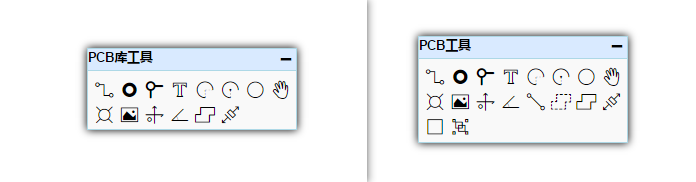

# 创建PCB库

如果你需要一个PCB封装，但是立创EDA的元件库中不存在，那么你可以自行进行创建。

创建PCB库与创建原理图库几乎一致，你可以通过：**文档** > **新建** > **PCB库** 建立。

## PCB库工具

PCB库工具的使用方法与PCB下的PCB工具一致，只是工具栏内少一些不需要的功能。

## 其他事项

1.  设置准确的网格和栅格尺寸很重要，一些精密的封装需要准确的尺寸，否则可能导致无法贴片。

2.  请保持所有封装的边框线框，和文字在顶层丝印层绘制。放置封装在PCB时，立创EDA会自动为封装的丝印切换至PCB对应的丝印层。

3.  按“CTRL+S”保存你的封装，然后你可以在左边导航栏的**“元件库”>“我的库文件”>“PCB库”**中找到它。

4.  焊盘和过孔不能太小，需保持圆圈 >= 4mil。  
  