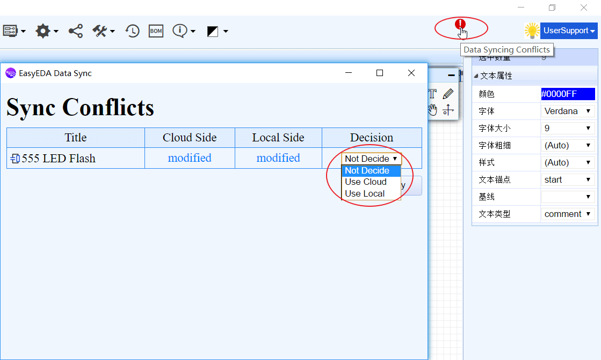
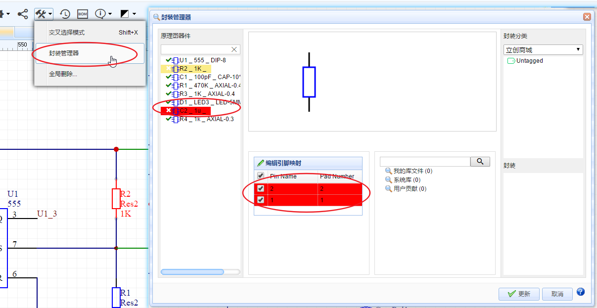
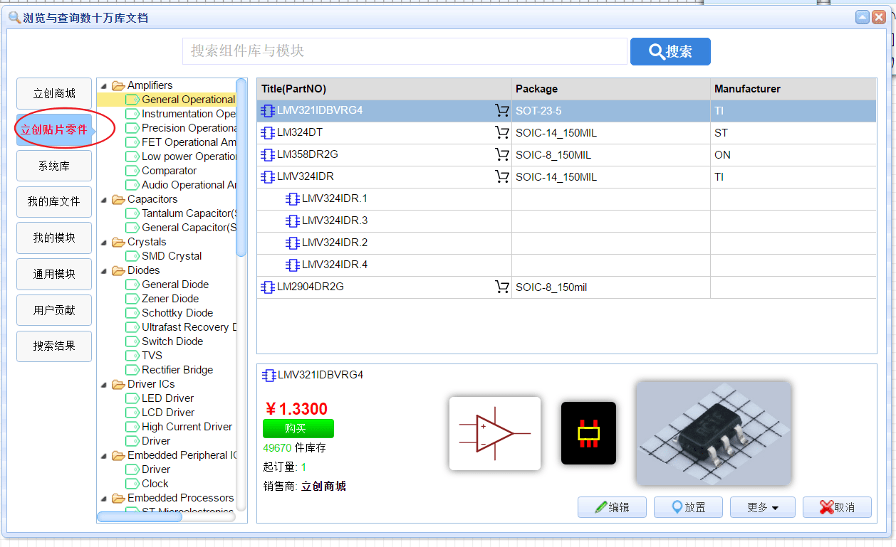
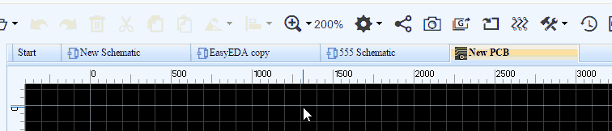
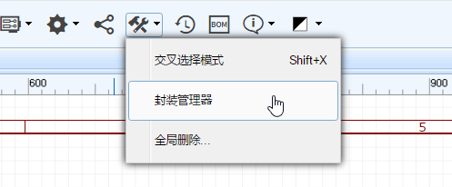
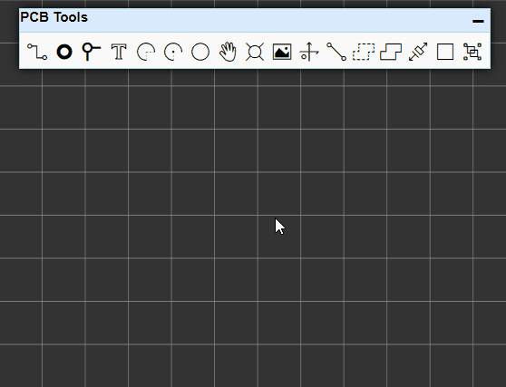
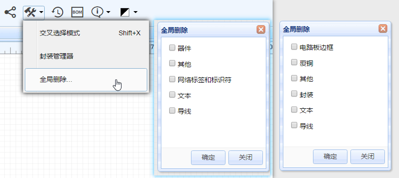
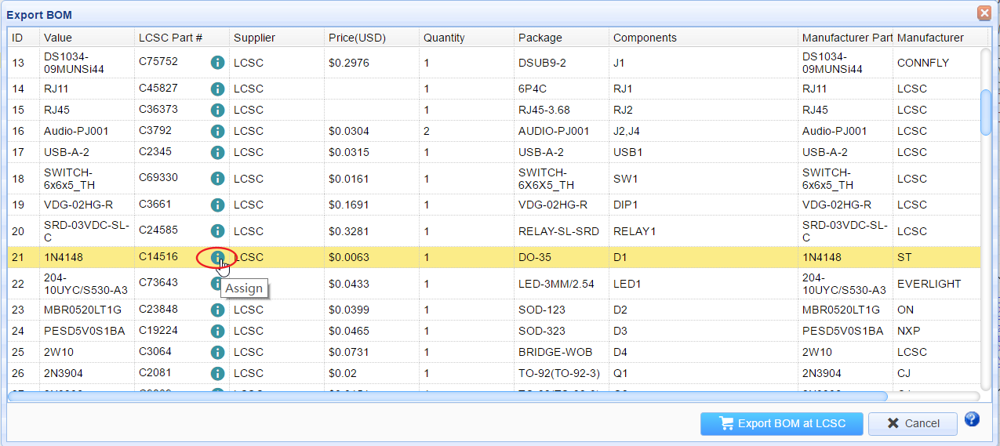
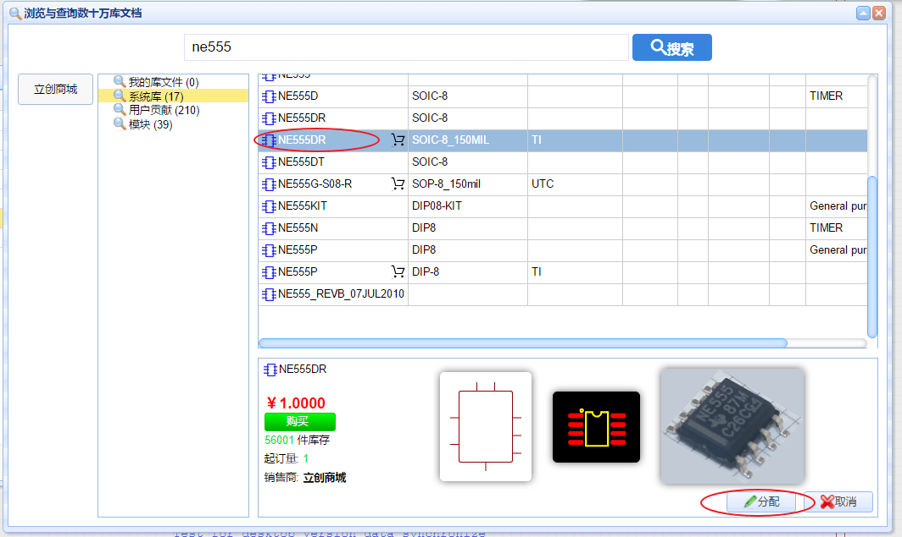
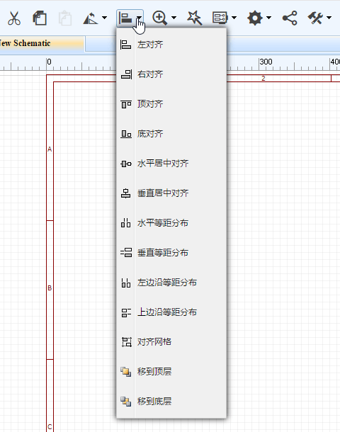

# 演示视频

<iframe frameborder="0" width="906" height="610" src="https://v.qq.com/iframe/player.html?vid=r05228zg4fw&tiny=0&auto=0" allowfullscreen></iframe>

# 文件下载

**帮助文档下载**

最新版帮助文档PDF支持书签导航，下载地址：[立创EDA帮助文档_20170907.pdf](./Doc/立创EDA帮助文档_20170907.pdf)

**客户端下载：**

立创EDA已经提供桌面客户端下载，下载地址： [https://lceda.cn/page/download](https://lceda.cn/page/download)  

-	**请注意：**

	-	*若网页版和客户端的文档内容存在冲突时，客户端会出现感叹号提示同步冲突。*
	-	*此时你可以通过点击冲突图标打开冲突对话框(按F10打开同步记录)，按需选择所需的版本（Use Cloud，使用云端版本；Use Local，使用本地版本），否则在客户端的修改将不会被同步至服务器，且gerber导出也不会应用客户端最新的PCB。*
	-	*若你选择了应用云端版本，请关闭当前已打开的文件后再次打开，以使变更生效，否则本地继续编辑和保存将覆盖掉云端版本！*  

# 更新说明
 
**v4.8.5更新说明**

LCEDA/立创EDA在**v4.8.5版**添加了很多新特性。
请前往编辑器体验：[https://lceda.cn/editor](https://lceda.cn/editor).

-	**封装管理器功能增强**

	-	1、打开封装管理器后，它会自动检查你零件的封装是否存在，是否正确。如果零件没有指定封装，或封装不在个人库和系统库中，或零件引脚编号与封装焊盘编号无法正常对应时， 封装管理器会在零件名前出现错误图标，并使零件名标红。例如：你的零件U1有两个引脚，编号分别是1、2，名称分别是VCC和GND；但是你用的封装的焊盘编号是A、B，所以左边列表会报错标红，要修正错误要么你将1、2改成A、B，要么将封装的焊盘编号A、B改成1、2；要么更换封装。  
	**注意：** *如果你的原理图使用了数量较多的不同名称的封装，封装管理器在检测封装焊盘编号与元件引脚编号的对应关系时，会与服务器进行封装数据查找和对比，这将花费一定时间，请耐心等待。*   

	-	2、在零件和封装的预览窗口，你可以用鼠标拖动，放大缩小预览图。 

-	**新增立创贴片零件库**

	-	我们新增了一个立创可贴片零件库，这个库属于立创商城库的子集，可方便使用立创贴片服务的用户选料，里面包含了690种零件，数量在不断增加中。预计今年年底就可以提供更多的种类元件的贴片服务，敬请期待。

-	**文件标签切换**

	-	已经可以进行标签切换。   

-	**量角器**

	-	加了一个新功能，量角器。  

**v4.6.4更新说明**

-	**新封装管理器**

	-	在这个版本我们提供了一个新功能，封装管理器。它支持批量修改封装。更多介绍请参考：[封装管理器](./Schematic.htm#封装管理器)

-	**新的画圆工具**

	-	该工具先确定圆心再确定半径进行画圆。

-	**全局删除**

	-	你可以很容易进行不同种类元素的全部删除。

-	**零件移动走线跟随**

	-	当移动零件时，连接的走线可垂直或平行跟随移动。

-	**BOM表导出图标**  

	-	在BOM表导出窗口，你可以给相应零件分配一个立创商城的产品编号，以利于在立创商城购买零件。

	-	点击分配图标后会弹出元器件库搜索界面，选择你所需要的零件，点击右下角的分配按钮即可。

-	**更多对齐功能**

	-	我们提供了更多对齐功能，具体可以自己体验一下。

-	**导入功能增强**

	-     新的AD文件导入  
AD文件导入更快了，效果更好，同时支持30M以内的大文件。需要注意的是，AD文件必须另存为ASCII格式才可以被导入。
	-     更好的DXF导入     
 对DXF导入的功能改善，比以前优化了导入速度和生成质量。

