<h1 align = "center">立创EDA帮助文档</h1>

2017.09.20

立创EDA编辑器正式版：<a href=https://lceda.cn/editor>https://lceda.cn/editor</a>

立创EDA编辑器Beta版：<a href=https://beta.lceda.cn/editor>https://beta.lceda.cn/editor</a>

**文档说明：**

-	本文档会跟随编辑器的新功能更新而持续更新。
-	最新版本请前往 [https://lceda.cn/Doc/Tutorial/](https://lceda.cn/Doc/Tutorial/WhatsNew.htm#) 下载。
-	编辑器Beta版会先行推出新的功能与改善，但可能会有bug，请谨慎体验。

 

**更新记录：**

<table width="100%"  style="font-family:'微软雅黑'; font-size:14px;">
   <tr>
      <td width="10%" style = font-weight:bold; >更新日期</td>
      <td width="12%" style = font-weight:bold; >编辑器版本</td>
      <td width="78%" style = font-weight:bold; >更新简述</td>
   </tr>
   <tr>
      <td>2017.09.20</td>
      <td>v4.9.3 Beta</td>
      <td>新增导出为Altium文件格式章节</td>
   </tr>
   <tr>
      <td>2017.09.18</td>
      <td>v4.9.3 Beta</td>
      <td>新增“本地自动布线”章节</td>
   </tr>
   <tr>
      <td>2017.09.08</td>
      <td>v4.8.5</td>
      <td>修正错误，添加“浏览器设置”章节</td>
   </tr>
   <tr>
      <td>2017.08.30</td>
      <td>v4.8.5</td>
      <td>第一版更新，未包含仿真章节</td>
   </tr>
   <tr>
      <td>NA</td>
      <td></td>
      <td></td>
   </tr>
   <tr>
      <td>NA</td>
      <td></td>
      <td></td>
   </tr>
   <tr>
      <td>NA</td>
      <td></td>
      <td></td>
   </tr>
<table>

                 
                 
        

# 立创EDA介绍

## 什么是立创EDA

**欢迎使用立创EDA/LCEDA**

-      立创EDA是一款基于浏览器的，友好易用的，强大的EDA(Electronics Design Automation: 电子设计自动化)工具, 服务于广大电子工程师,教育者,学生,制造商和爱好者。致力于中小原理图PCB工程的设计，仿真与实现。  
 
-	立创EAD可以不需要安装任何软件或插件。只需在任何支持HTML5,标准兼容的web浏览器打开立创EDA即可。请优先使用最新版Chrome和FireFox浏览器，其他浏览器立创EDA暂时不做适配。
 
-	立创EDA是知名在线EDA软件EasyEDA的国内版本，立创EDA专注国内用户，EasyEDA专注国外用户；立创EDA和EasyEDA功能上一致，编辑器和客户端同步更新；国内版与国外版账号数据系统相对独立，不互通，已经注册EasyEDA的用户请及时将账号数据迁移至国内版，迁移地址：[https://easyeda.com/applyForLceda](https://easyeda.com/applyForLceda)；因为立创EDA数据服务器建立在国内，所以国内用户访问立创EDA速度更快，基本无EasyEDA的卡顿现象。在今后国内用户访问EasyEDA都会导向LCEDA。

-	无论你使用的是Linux, Mac , Windows，立创EDA均可以为你提供专业的优质服务。访问地址：[https://lceda.cn/editor](https://lceda.cn/editor) 

-	国内个人用户**永久免费**，提供友好的社区支持。社区请访问：[http://club.szlcsc.com/forum/97_0_1.html/](http://club.szlcsc.com/forum/97_0_1.html)

-	现已提供桌面客户端下载，画图更流畅：[https://lceda.cn/page/download](https://lceda.cn/page/download)

**注意：***在首次使用立创EDA进行项目设计前，请花两小时阅读本帮助文档以及[LCEDA国内用户使用注意事项](https://lceda.cn/page/FAQ)，可极大提高你的设计效率，减少出错！*
  
**不收费立创EDA怎么生存？**  

-	立创EDA目前提供立创商城元器件销售；PCB打样与批量订单，PCB贴片服务；未来还会为企业用户提供付费服务。    
-	如果你想支持立创EDA更好的发展，你可以：
	-	在立创商城([www.szlcsc.com](www.szlcsc.com))购买元件；
	-	在立创EDA的兄弟公司嘉立创进行PCB打样与贴片([www.sz-jlc.com](www.sz-jlc.com))；
	-	使用立创EDA创建个人的库文件和公开的工程；
	-	向朋友推荐立创EDA。

**立创EDA可提供：**

-	简单，易用，友好，强大的绘图体验与能力
-	可在任意地点，时间，设备上工作
-	实时团队协作
-	在线共享
-	大量的开源项目
-	整合PCB制造和元器件购买供应链
-	提供API
-	支持脚本
-	原理图绘制
	-	基于[NgSpice](http://ngspice.sourceforge.net/)的仿真功能
	-	仿真模型和子电路的创建
	-	波形图的查看和导出(CSV)
	-	网表导出(Spice, Protel/Altium Designer, Pads, FreePCB)
	-	多文件格式导出(PDF, PNG, SVG)
	-	EasyEDA源码格式导出(json)
	-	Altium Designer格式导出
	-	BOM导出
	-	多页原理图
	-	原理图模块
	-	主题设置
	-	文档恢复
-	PCB设计
	-	设计规则检查
	-	多层设计
	-	多文件格式导出(PDF, PNG, SVG)
	-	EasyEDA源码格式导出(json)
	-	Altium Designer格式导出
	-	BOM导出
	-	照片预览
	-	Gerber文件导出
	-	SMT坐标文件导出
	-	自动布线
	-	PCB模块
	-	文档恢复
-	文件导入
	-	Altium/ProtelDXP ASCII 原理图/PCB
	-	Eagle 原理图/PCB/库文件
	-	LTspice 原理图/原理图库文件
	-	DXF文件
-	库文档
	-	超过50万库文档(原理图库和封装库)
	-	库文档管理
	-	符号/子库的创建与编辑
	-	仿真符号的创建与编辑
	-	封装库的创建与编辑

## 浏览器设置

在使用立创EDA之前，请先对浏览器进行设置。推荐使用原生的Chrome谷歌浏览器和Firefox火狐浏览器，立创EDA优先支持这两款浏览器，不建议使用IE和Edge。若你使用的是国内厂商基于Chromium浏览器二次开发的浏览器，如QQ浏览器，360浏览器，百度浏览器等，你需要切换至极速内核，设置浏览器最小字号和关闭鼠标手势，否则可能会无法正常使用。

**切换至极速内核**：使用双核浏览器时，必须切换至极速内核，若使用兼容内核(IE内核)，部分功能可能无法正常使用。如文件导入失败，布线样式错误，铺铜区域错误。

**关闭手势功能**：如果不关闭浏览器手势，将无法在编辑器使用长按右键平移功能。

**设置浏览器最小字体**：使用谷歌浏览器内核的浏览器通常设置最小字体字号为12号，在原理图进行缩小时会出现文字太大的现象(如下图左边)，此时你需要将最小字号设为更小。  

以下是浏览器的设置方法：

-	谷歌浏览器：
	-	切换极速内核：无需设置。
	-	关闭手势功能：不支持，无需设置。
	-	设置最小字号：**设置 > 外观  > 自定义字体 > 最小字号**。
-	火狐浏览器：
	-	切换极速内核：无需设置。
	-	关闭手势功能：不支持，无需设置。
	-	设置最小字号：**选项 > 内容 > 字体和颜色 > 高级 > 最小字体大小**，将最小字号设为最小。
-	360安全浏览器：
	-	切换极速内核：点击地址栏最右边的内核模式切换按钮。
	-	关闭手势功能：**设置 > 鼠标手势  > 启用鼠标手势**，去掉勾选。
	-	设置最小字号：**设置 > 界面设置  > 字体大小 > 自定义字体大小** ，将最小字号设为最小。
-	360极速浏览器：
	-	切换极速内核：**选项 > 高级设置 > 内核模式 > 默认使用Blink内核**。
	-	关闭手势功能：**选项 > 鼠标手势  > 启用鼠标手势**，去掉勾选。
	-	设置最小字号：**选项 > 高级设置 > 网络内容 > 自定义字体 > 最小字体号**，将最小字号设为最小。
-	猎豹浏览器：
	-	切换极速内核：**选项/设置 > 基本设置 > 浏览模式 > 优先使用极速模式**。
	-	关闭手势功能：**选项/设置 > 鼠标手势  > 启用鼠标手势**，去掉勾选。
	-	设置最小字号：**选项/设置 > 更多设置 > 网页内容 > 自定义字体 > 最小字号** ，将最小字号设为最小。
-	QQ浏览器：
	-	切换极速内核：**设置 > 高级  > 内核模式 >  总是使用极速内核**。
	-	关闭手势功能：**设置 > 手势与快捷键 > 开启鼠标手势**，去掉勾选。
	-	设置最小字号：**设置 > 常规设置  > 网络内容 >  自定义字体 > 最小字号** ，将最小字号设为最小。
-	傲游5浏览器：
	-	切换极速内核：**工具 > 内核切换：兼容 -> 极速**。
	-	关闭手势功能：**设置 > 鼠标手势和快捷键 > 鼠标手势  > 启用鼠标手势**，去掉勾选。
	-	设置最小字号：无需设置，默认最小字号。
-	搜狗浏览器：
	-	切换极速内核：**工具 > 切换到极速模式**。
	-	关闭手势功能：**工具 > 选项 > 鼠标手势  > 启用鼠标手势**，去掉勾选。
	-	设置最小字号：无法设置。
-	百度浏览器：
	-	切换极速内核：点击地址栏最右边的内核模式切换按钮。
	-	关闭手势功能：**浏览器设置 > 高级设置 > 鼠标手势  > 启用鼠标手势**，去掉勾选。
	-	设置最小字号：无法设置。
-	UC浏览器：
	-	切换极速内核：点击地址栏最右边的内核模式切换按钮。
	-	关闭手势功能：**设置 > 鼠标手势 > 基本 > 启用鼠标手势**，去掉勾选。
	-	设置最小字号：**设置 > 其他 > 网络内容 >  自定义字体 > 最小字号** ，将最小字号设为最小。
-	2345加速浏览器：
	-	切换极速内核：点击地址栏最右边的内核模式切换按钮。
	-	关闭手势功能：**选项 > 鼠标手势 > 启用鼠标手势**，去掉勾选。
	-	设置最小字号：**选项 > 高级设置 > 网络内容 > 自定义字体 > 最小字体号**，将最小字号设为最小。
-	Opera浏览器：
	-	切换极速内核：无需设置。
	-	关闭手势功能：**菜单 > 设置 > 浏览器 > 快捷键 > 启用鼠标手势**，去掉勾选。
	-	设置最小字号：**菜单 > 设置 > 网站 > 显示 > 自定义字体 > 最小字体大小**，将最小字号设为最小。
-	世界之窗浏览器：
	-	切换极速内核：无需设置。
	-	关闭手势功能：**设置 > 显示高级设置 > 鼠标手势 > 启用鼠标手势**，去掉勾选。
	-	设置最小字号：**设置 > 显示高级设置 > 网络内容 > 自定义字体 > 最小字体大小**，将最小字号设为最小。

## 工程设计流程

使用立创EDA进行设计的流程如下：  

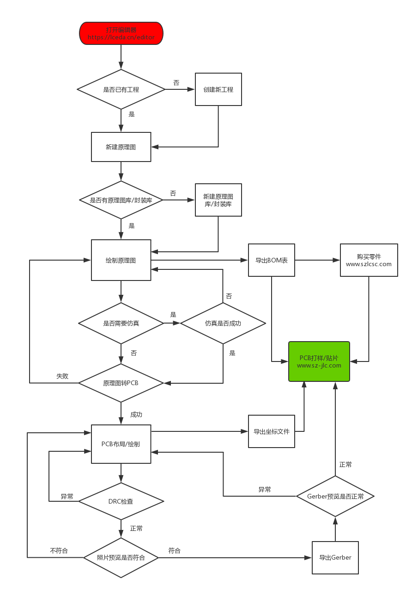

     

## 使用界面

立创EDA拥有一个友好的，简洁的，美观的使用界面。

### 全局界面

**原理图界面**
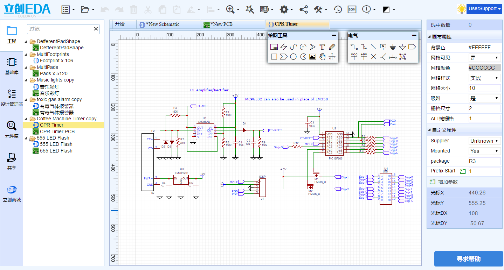

**PCB界面**
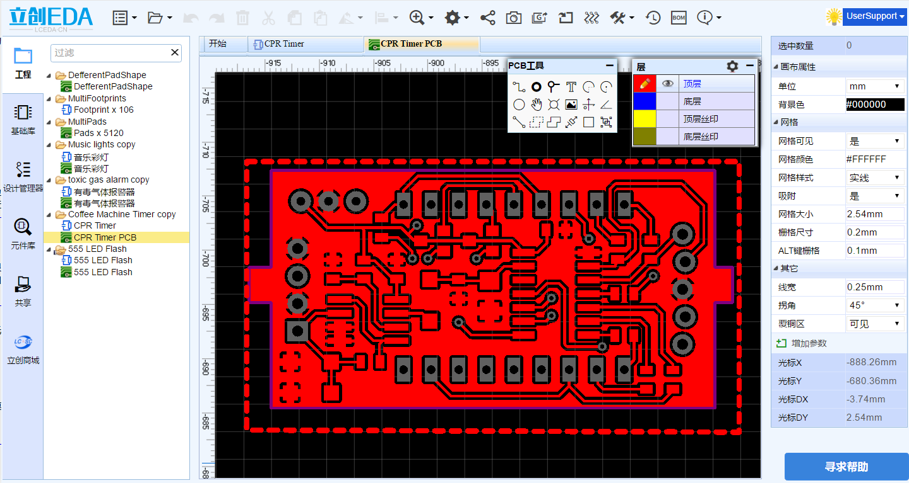 

### 简洁的操作界面

立创EDA有两个区域非常重要，分别是左边标识为2的导航面板，右边标识为9的属性面板。工程，元件库等均可以在导航面板找到；通过选择你需要的项目，在属性面板可以查看和修改你想要的属性。
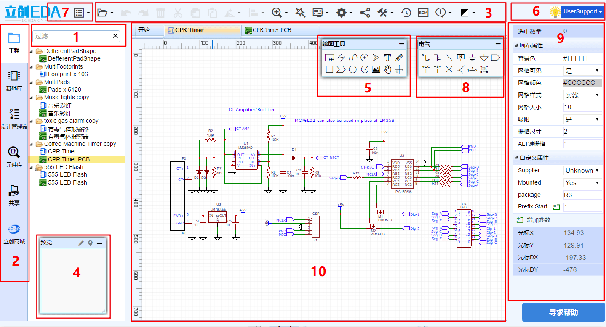

#### 1. 筛选器

使用筛选器，只需要输入部分字符就可以很方便地搜索出想要的东西。 在工程按钮下，可以很方便搜索工程，工程里面的文件。在基础库可以很方便搜索想要的零件符号。比如直接在基础库搜索 “555” 即可将 555定时器搜索出来。

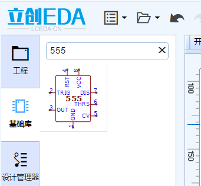  

筛选器只能搜索标题，文件或工程的描述无法搜索。

点击 `X` 清除筛选内容。

#### 2. 导航面板

导航面板是立创EDA非常重要的一个组成模块，你可以在这里找到你的工程，系统基础库，设计管理器，元件库，他人共享给你的文件等。

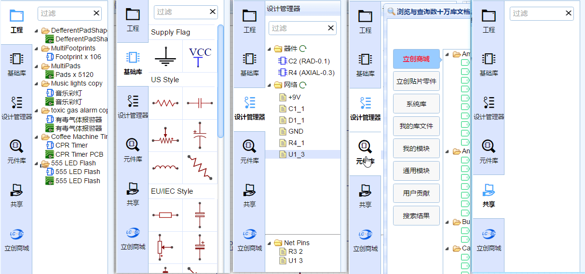  

**工程**  

在这里，你可以找到你的所有工程及文件，包括你私人的，已共享的，直接拷贝别人的工程文件。

除了元件库，它们均可以使用右键菜单。如工程文件下的右键菜单：

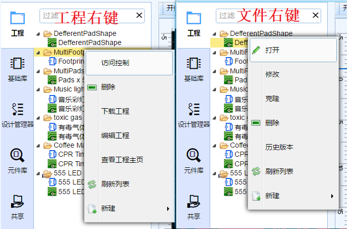

**基础库**

这里包含了很多常用的库文件，可以很方便的使用，只需鼠标单击后移动至原理图画布即可。该处不允许自定义。 

**设计管理器**

设计管理器，在原理图下你可以很方便地检查每个零件和每条网络；在PCB下这里还可以查看设计规则错误(DRC)。

**元件库** 

包含了原理图库和封装库，其中包括系统库和用户共享库。你的个人库文件也在这里。  

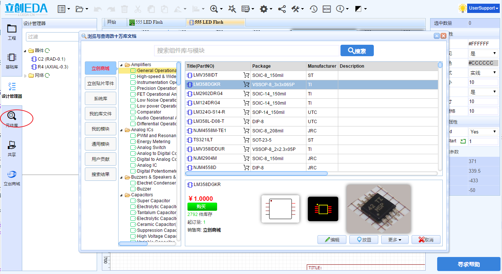 

**共享**

如果你的伙伴使用 **访问控制** 功能将他的工程共享给你，那么共享的工程会出现在这里。如果对方使用的是公众共享功能，共享给你的工程不会出现在这里。

更多信息请访问[“访问控制”](./Share.htm#访问控制)。

**立创商城**

你若需要购买元器件进行PCB制作，建议通过这里购买。立创商城提供了6W+的元器件对外销售，是目前国内领先的元器件自营商城，经营的元器件均是正品，可放心购买。立创EDA和立创商城共同属于深圳市立创电子商务有限公司。

访问地址：[www.szlcsc.com](www.szlcsc.com)。 

 

#### 3. 工具栏

编辑器提供简单美观的功能图标。

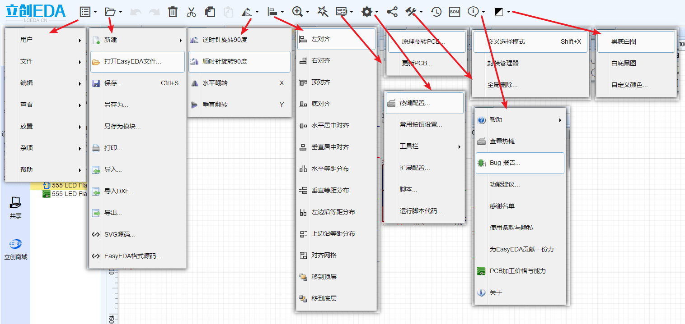

工具栏图标可通过“常用按钮设置”进行配置。

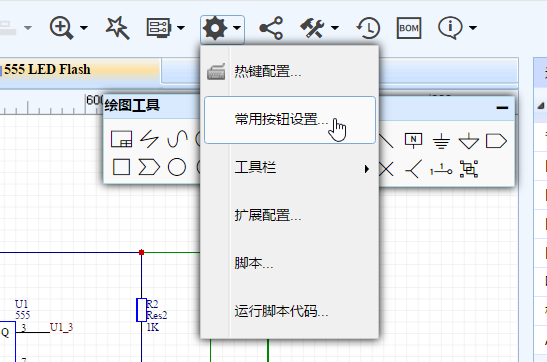

配置方式简单明了。

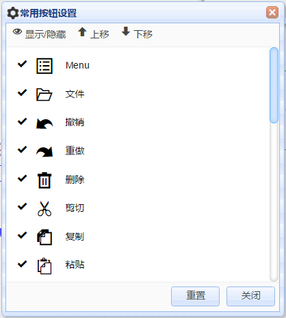

选中后可以点击隐藏/显示，上移下移来调整在工具栏的位置。

#### 4. 预览窗口

当你选择一个原理图或PCB时，可以在这里进行预览。因为需要从服务器进行加载，所以预览图需要

你可以通过 

 **超级菜单 > 查看 > 工具栏 > 预览** 或者在工具栏 **配置 > 工具栏 > 预览** 处进行打开这个功能.

-  在右下角处，拖动可以进行放大缩小。
-  无法关闭，你可以点击右上角的 - 进行收缩窗口。
-  点击铅笔图标可以打开当前预览文件。

  

#### 5. 电气工具

编辑器会根据不同的类型显示不同工具栏。以下是原理图的电气工具。  

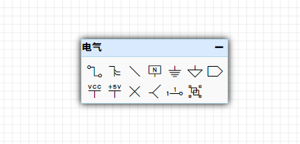

#### 6. 用户管理菜单

在这里你可以切换至团队，切换语言，修改系统设置等。

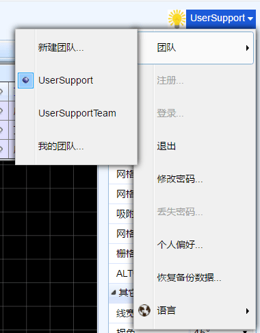

#### 7. 超级菜单

编辑器全部的菜单功能均可以在这里找到。这里面很多功能均可以通过设置快捷键的方式使用，也建议你使用快捷键，可提高设计效率。

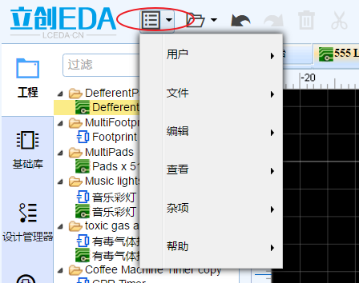

#### 8. 绘图工具

绘图工具和电气工具，和PCB绘制工具均可以通过拉伸窗口进行调节大小，也可以随意拖动位置。

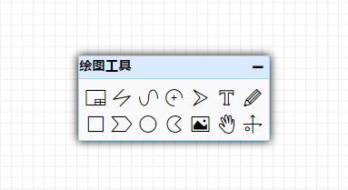

#### 9. 画布属性

点击画布空白处后就可以在右边面板查看与修改画布属性。

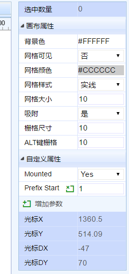

背景颜色，网格，网格样式，大小，栅格等属性均可以修改。

#### 10. 画布

画布区域是主要工作区，在这里可完成原理图的创建和绘制编辑，库文件符号的绘制和编辑，PCB的创建，布局和编辑，仿真与波形查看等。

**原理图**  
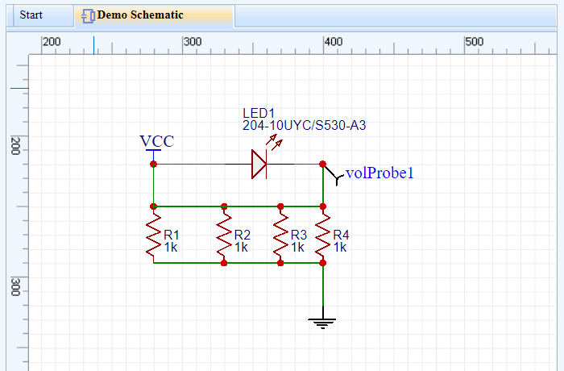  

**PCB**  
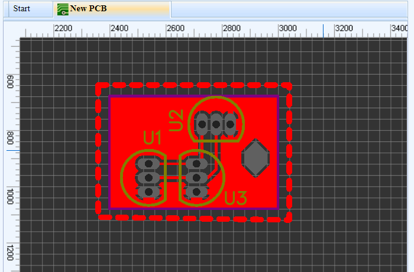  

**库符号**  
  

**封装**  
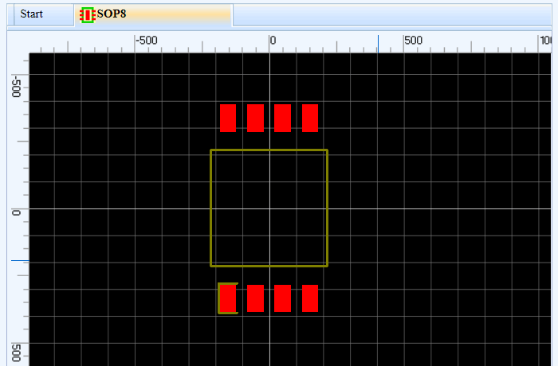

**其他绘图**  

**仿真波形**  
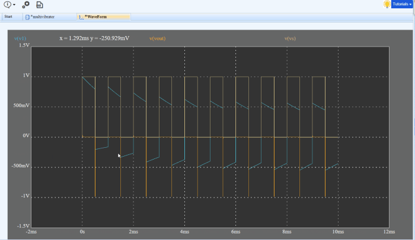

## 如何创建一个工程或文件

在登录后，通过点击
 **文件 > 新建 > 工程...** 或 **文件 > 新建 > 原理图..等**
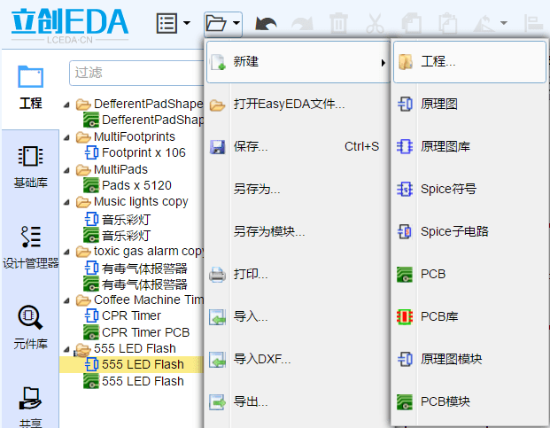   

“工程”概念在编辑器中非常重要，在新建原理图，PCB等一些文件前必须存在一个工程文件夹才可进行新建，否则需要新建一个工程，以便于管理新建的文件。

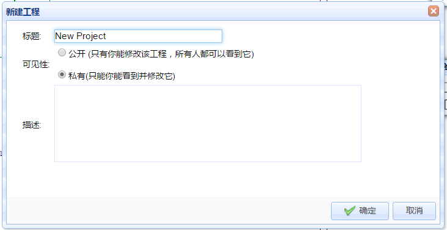 

设置名称并点击确认后，新建的工程将在左边的“工程”处显示。

在新建时，你还可以选择这个工程是私人的还是共享的。

选择共享后，该工程与其下的文件将显示在你的个人主页上，任何人都可以查看复制你的设计。添加的描述可以帮忙别人了解你的设计内容。

若创建后你想修改你的工程信息，你可在工程文件夹右键，选择编辑工程。

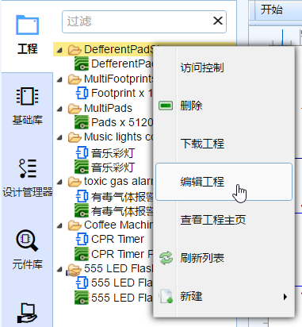

将打开一个网页，你可以修改工程的相关信息。

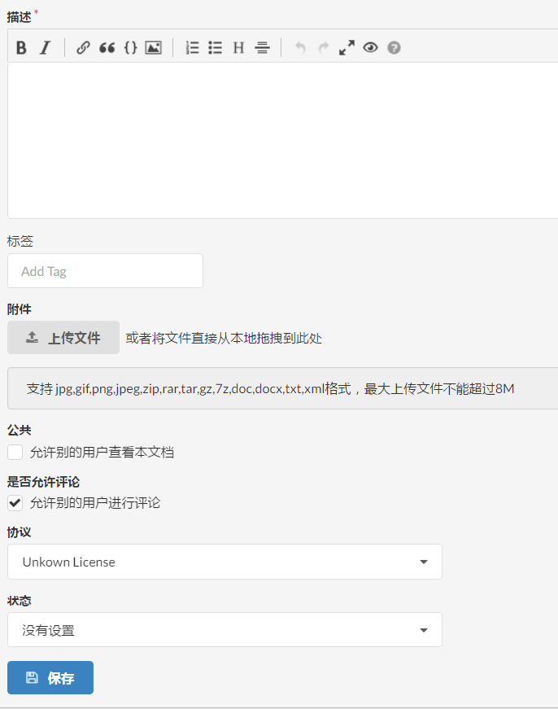

​

## 功能介绍

### 原理图绘制

立创EDA可以创建很专业的原理图。

  

立创EDA有一些简单而强大的绘图功能，你可以通过复制现有的符号复制到自己的库中，然后编辑和保存，来创建自己的库文件，或者从头开始绘制新的原理图库文件。

编辑器提供了 **原理图库向导**，以便于迅速创建 `DIP`, `QFP` 和 `SIP`类的原理图符号。

立创EDA除了普通的简单的“2D”图形库之外，还有一个“3D”零件符号库，连接后看起来与实物相似。

如果你有足够的耐心，你可以创建很漂亮的3D形状的原理图。

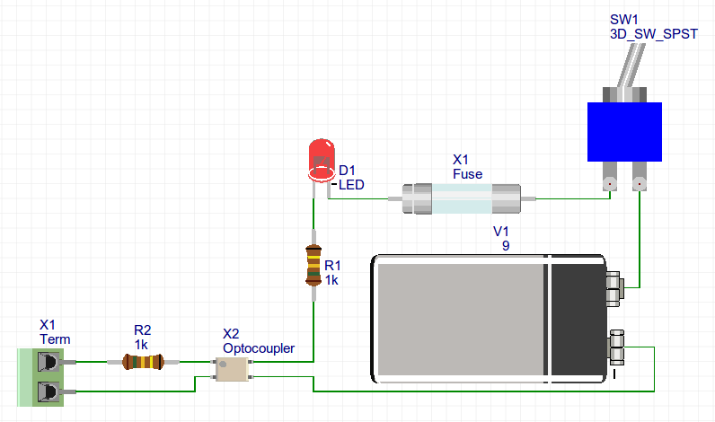

还有一个强大的功能是可以从AD，Kicad，Eagle等导入原理图PCB库符号。

### 元件库管理

**系统库文件**

感谢于免费和开源的Kicad库和一些开源的Eagle库，加上立创商城自身创建的库文档，立创EDA已经有超过50w个元件库，基本上已经可以满足大部分设计需要。

你基本可以不用花太多时间去寻找和创建新的原理图库和封装库就可以进行设计。

**用户贡献库文件**

用户建立的库文件会自动共享至用户贡献库中，立创EDA认为，库文件的共享可以使更多人使用到你的库文件，减少重复的创建库文件的工作。并且库文件共享并不会产生数据安全性问题，需要关注的是用户私人的工程以及文档。
用户贡献的库文件在使用时，点击后在右边属性面板可以看到一个“Contributor(贡献者)”参数，显示共享者的用户名。贡献政策参见：[https://lceda.cn/page/contribute](https://lceda.cn/page/contribute)

**查找库文件**

在左边导航面板的“基础库”和“元件库”，点击后输入你想要的库名称后搜索即可。

**创建个人库文件**

立创EDA支持创建个人库文件，创建的库文件可以在 **元件库 > 我的库文件** 中找到，并且很容易进行管理。
​

### PCB设计

1、立创EDA可以快速地通过原理图创建PCB，甚至是复杂的多层原理图。

在原理图下点击工具栏图标 **原理图转PCB** 即可快速转为PCB。  
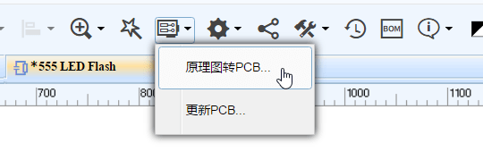

立创EDA也支持没有原理图的PCB设计。

2、立创EDA具有大量的封装库文件，但你也可以通过创建新的封装文件，创建可以重新创建、通过修改编辑原有的封装、复制封装等方式创建。

3、为了方便查找和定位封装位置，立创EDA在左边面板提供了一个设计管理器。

设计管理器可以很方便的查找元件(封装)，走线(网络)，焊盘(网络焊盘)，还有DRC错误列表。

当点击任一项目后，画布中会将当前的项目（封装或者网络）进行居中高亮，以方便识别。

4、使用层工具可以显示你所需要的层，和编辑所在的层。你也可以修改PCB的层数和显示颜色，通过：**超级菜单 > 杂项 > 层配置...**

5、在设计规则检查对话框中，默认的走线宽度、间隙和通过孔尺寸都可以进行配置：**超级菜单 > 杂项 > 设计规则设置...**

在你完成PCB设计并发送Gerber和钻孔文件给PCB厂生产前，设计规则检查几乎是最后的一步工作，所以在你开始PCB布线之前，最好先进行规则设置。

在发送Gerber给PCB厂商之前，你需要使用Gerber查看器检查生成的gerber是否符合要求，这里推荐开源免费的Gerber查看软件[Gerbv: http://gerbv.geda-project.org/](http://gerbv.geda-project.org/) 

6、完成PCB后，你还可以把物料清单“BOM”表导出，以便于购买元器件：工具栏BOM图标。

7、PCB你也可以导出高质量的文件 `SVG`, `.PNG` or `.PDF`。

8、PCB也可以和原理图一样对外进行分享。

9、PCB设计的尺寸在立创EDA是没有限制的，一般超过100cm x 100cm也是允许的，但是这需要你有一个很强大的电脑，因为在浏览器下，绘制大面积的PCB会产生卡顿现象。

立创EDA默认支持6层板，但它可以支持更多， 所以若你需要更多层请联系立创EDA技术支持，联系方式请查看下方[寻求帮助](#寻求帮助)章节。

10、封装查找 

PCB的封装查找与原理图的库文件查找一致，在“元件库”中，查找后，选择所需的封装点击“放置”即可放置在画布中。

### 账号管理

立创EDA是一种基于网络的服务，账号与数据均加密保存在服务器上，你最好创建一个帐户来管理自己的设计和元件库。创建一个帐号很简单，只要你愿意，你可以免费访问立创EDA的全部功能。  

#### 注册登录

在用户管理菜单，点击注册：

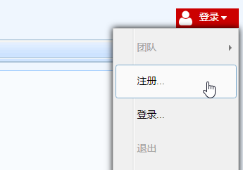

点击后会打开一个新页面，该页面可以进行注册和登录：

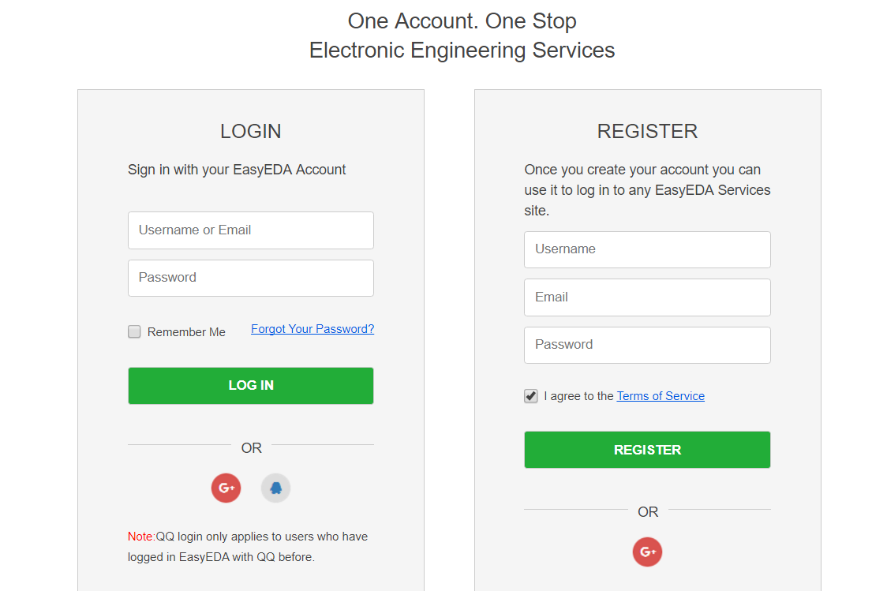

输入相关信息后注册/登录即可。

**注意：***因国家相关政策规定，所有注册账户必须登记手机号码；一旦你创建了帐户，你只有一次修改你的用户名的机会，请谨慎命名。*

#### 重置密码

你的密码是经过加密处理的，立创EDA也不知道密码是什么，如果你忘记密码可以通过使用登录界面/用户菜单的“忘记密码”链接进行找回，系统会发短信给你进行确认，请确保你仍然使用原注册的手机号。在你要更换手机号码之前请及时在个人中心更换新手机号码。  

#### 团队协作

立创EDA提供了团队功能，该功能可以使你和伙伴共同进行项目协作设计，当你和伙伴共同登录在团队账号下时，可访问团队的全部库文件，原理图，PCB和其他工程文件。

**团队功能在哪**

在个人中心[https://lceda.cn/account](https://lceda.cn/account)，存在一个团队选项。可创建团队，若已存在团队，点击后可直接切换至团队下。

 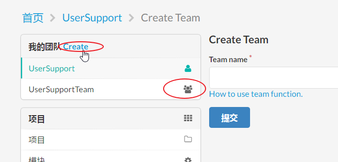   

**如何创建团队**

1.如上面图所示，在登录后点击[https://lceda.cn/teams/create](https://lceda.cn/teams/create)进行创建新团队。

2.在**用户菜单 > 团队 > 新建团队**  进行创建团队。  

 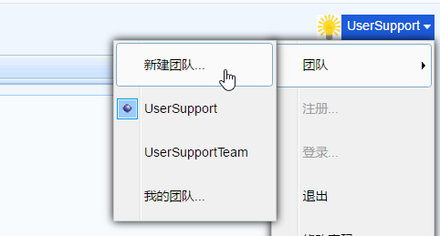   

创建完成后，点击团队进行切换至团队状态下，然后你邀请你的伙伴加入团队即可。  

 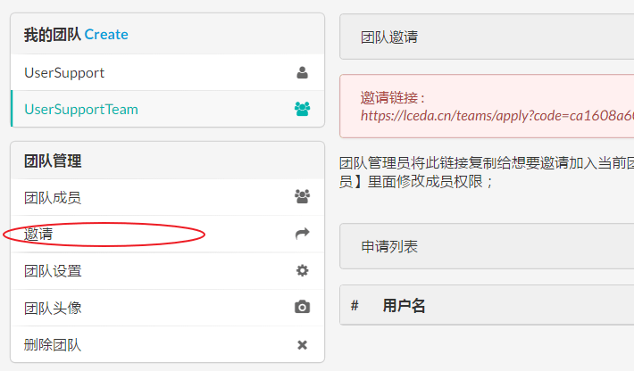 

**如何切换至团队下**

1) 进入个人中心切换。  
   点击你创建的团队名称，然后网页会进行重定向，之后就会切换至团队下。

   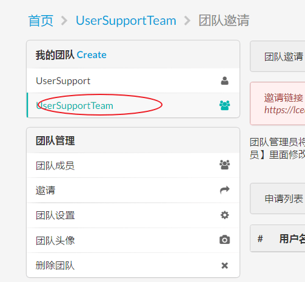  

   切换后你可以对你的队员/团队项目进行管理。

2) 在编辑器切换。  
   在 用户菜单 > 团队 选项，选择然后点击你的团队名称即可切换在团队下的编辑器。当前编辑器用户名也会切换至团队名。

   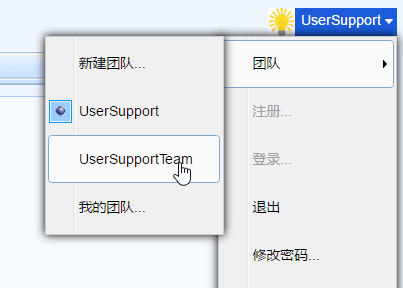  

**如何更新至团队**

如果你想把你的设计贡献到团队中，可在个人中心中使用下图的更新至团队功能。

  **注意：***若你进行了更新至团队操作，你的个人库文件，工程等均会移动至团队下，且不可逆！！！*

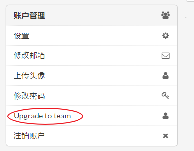  

**团队功能使用技巧**  

1.如果你切换至团队下，你将不能在元件库中使用你原先个人账户下创建的库文件，如果要使用你必须先收藏你个人账号下的库文件，或者直接搜索库文件名称。

2.你必须了解到你的个人账户和团队账户是相对独立的账号，你无法在同一个浏览器的标签下同时使用。若要使用个人账户必须在其他浏览器打开。

3.在你成为团队所有者之后，最好为团队创建所需的库文件。

4.如果你加入一个成员，并将他提名为会计师，他就可以处理团队的账单和发票。

#### 个人偏好

在用户菜单下，点击个人偏好：

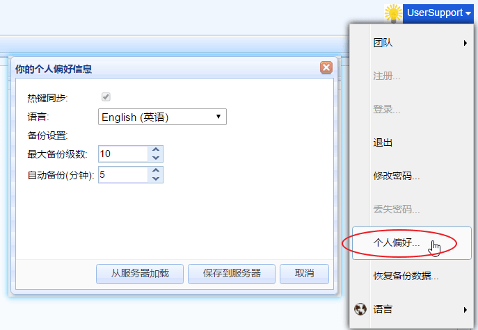  

其中，  

- **热键同步：**指同步你设置的快捷键指服务器，默认勾选，不可取消。  
	    
- **语言：**设置默认语言，会同步至服务器。

- **最大备份级数：** 每个打开的文档自动创建备份的数目。该备份是指备份至本地的数目，详细请查看下面的“恢复备份数据”。

- **自动备份(分钟)：** 这是自动保存所有打开文档的时间间隔。

- **保存到服务器：** 将你的个人偏好保存至服务器中(工具栏配置，个人库，快捷键设置， 语言设置等)。

- **从服务器加载：** 立创EDA不会主动将你的个人偏好加载到本地，所以你必须进行手动加载。当你更换浏览器和电脑的时候也可以进行手动加载个人偏好。

如果你没有保存个人偏好至服务器，点击从服务器加载将不会产生任何影响。

#### 恢复备份数据

没有什么数据是绝对安全，但是立创EDA会尽最大努力保障你的数据安全。

立创EDA会为你已经打开的文件进行自动保存和创建备份，当你误删文件或需要之前的版本时，你可以使用恢复数据备份进行数据恢复。

在 **用户菜单**，点击 **恢复备份数据** ，或者点击工具栏的 **恢复备份数据** 图标打开：

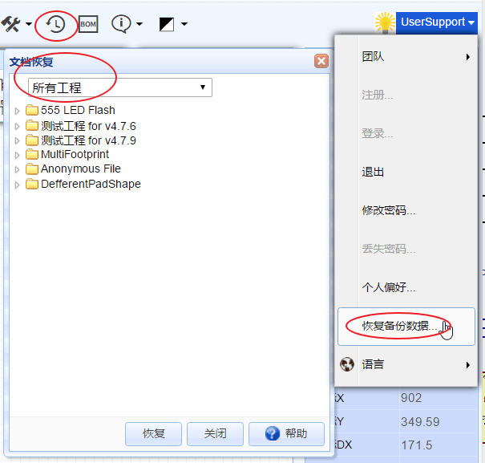

选择你想要的文件版本后，点击“恢复”按钮即可在新标签打开，然后进行编辑保存即可。

**注意：**  

- *立创EDA编辑器保存这些备份文件在你的本地电脑，而不是服务器，当你更换电脑后将无法使用自动备份的数据。*  
- *自动备份是以浏览器缓存的方式进行保存，如果你清除了立创EDA网站的缓存，那么这些备份数据也会被清除。*
- *若你已经清除了浏览器缓存，你还可以使用前面所说的“历史版本”功能找回想要的版本。已删除的文件可以在文件回收站找回：[https://lceda.cn/document/recycle](https://lceda.cn/document/recycle)*

#### 账号注销

若你想注销你注册的立创EDA账号，你可以点击：[https://lceda.cn/account/close](https://lceda.cn/account/close)。
注销前请告知原因，立创EDA将往更好的方面改善。

### 快捷键

立创EDA提供了很多快捷键供用户使用，每一个快捷键均可以进行配置。

进入快捷键配置选项：

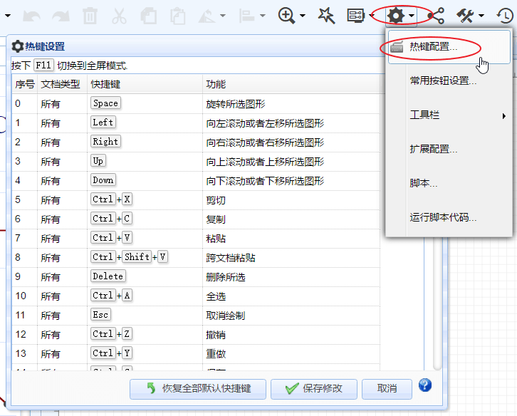

或在“**超级菜单 > 杂项 > 热键配置**”处打开。

点击你需要修改的选项，出现输入框后按下你的按键，再保存即可完成快捷键设置。

**文档类型** 该列表示快捷键在对应的文档类型内是有效的。

- **所有：** 在编辑器内所有的文件类型。
- **原理图：** 原理图和原理图库文件。
- **PCB：** PCB和PCB库文件。

相同的快捷键可以使用在不同的文档中，比如在原理图使用“C”键画圆弧，在PCB中是画一个圆形。

默认的快捷键列表如下。
<table>
   <tr>
      <td>序号</td>
      <td>文档类型</td>
      <td>快捷键</td>
      <td>功能</td>
   </tr>
   <tr>
      <td>0</td>
      <td>所有</td>
      <td>Space</td>
      <td>选择所选图形</td>
   </tr>
   <tr>
      <td>1</td>
      <td>所有</td>
      <td>Left</td>
      <td>向左滚动或左移所选图形</td>
   </tr>
   <tr>
      <td>2</td>
      <td>所有</td>
      <td>Right</td>
      <td>向右滚动或右移所选图形</td>
   </tr>
   <tr>
      <td>3</td>
      <td>所有</td>
      <td>Up</td>
      <td>向上滚动或上移所选图形</td>
   </tr>
   <tr>
      <td>4</td>
      <td>所有</td>
      <td>Down</td>
      <td>向下滚动或下移所选图形</td>
   </tr>
   <tr>
      <td>5</td>
      <td>所有</td>
      <td>Ctrl+X</td>
      <td>剪切</td>
   </tr>
   <tr>
      <td>6</td>
      <td>所有</td>
      <td>Ctrl+C</td>
      <td>复制</td>
   </tr>
   <tr>
      <td>7</td>
      <td>所有</td>
      <td>Ctrl+V</td>
      <td>粘贴</td>
   </tr>
   <tr>
      <td>8</td>
      <td>所有</td>
      <td>Ctrl+Shift+V</td>
      <td>跨文档粘贴</td>
   </tr>
   <tr>
      <td>9</td>
      <td>所有</td>
      <td>Delete</td>
      <td>删除所选</td>
   </tr>
   <tr>
      <td>10</td>
      <td>所有</td>
      <td>Ctrl+A</td>
      <td>全选</td>
   </tr>
   <tr>
      <td>11</td>
      <td>所有</td>
      <td>Esc</td>
      <td>取消绘制</td>
   </tr>
   <tr>
      <td>12</td>
      <td>所有</td>
      <td>Ctrl+Z</td>
      <td>撤销</td>
   </tr>
   <tr>
      <td>13</td>
      <td>所有</td>
      <td>Ctrl+Y</td>
      <td>重做</td>
   </tr>
   <tr>
      <td>14</td>
      <td>所有</td>
      <td>Ctrl+S</td>
      <td>保存</td>
   </tr>
   <tr>
      <td>15</td>
      <td>所有</td>
      <td>A</td>
      <td>放大</td>
   </tr>
   <tr>
      <td>16</td>
      <td>所有</td>
      <td>Z</td>
      <td>缩小</td>
   </tr>
   <tr>
      <td>17</td>
      <td>所有</td>
      <td>X</td>
      <td>水平翻转</td>
   </tr>
   <tr>
      <td>18</td>
      <td>所有</td>
      <td>Y</td>
      <td>垂直翻转</td>
   </tr>
   <tr>
      <td>19</td>
      <td>所有</td>
      <td>G</td>
      <td>吸附</td>
   </tr>
   <tr>
      <td>20</td>
      <td>所有</td>
      <td>Ctrl+F</td>
      <td>查找元件</td>
   </tr>
   <tr>
      <td>21</td>
      <td>所有</td>
      <td>Ctrl+D</td>
      <td>设计管理器</td>
   </tr>
   <tr>
      <td>22</td>
      <td>所有</td>
      <td>D</td>
      <td>拖动</td>
   </tr>
   <tr>
      <td>23</td>
      <td>原理图</td>
      <td>W</td>
      <td>绘制导线</td>
   </tr>
   <tr>
      <td>24</td>
      <td>原理图</td>
      <td>B</td>
      <td>绘制总线</td>
   </tr>
   <tr>
      <td>25</td>
      <td>原理图</td>
      <td>U</td>
      <td>总线分支</td>
   </tr>
   <tr>
      <td>26</td>
      <td>原理图</td>
      <td>N</td>
      <td>网络标签</td>
   </tr>
   <tr>
      <td>27</td>
      <td>原理图</td>
      <td>Ctrl+Q</td>
      <td>标识符 VCC</td>
   </tr>
   <tr>
      <td>28</td>
      <td>原理图</td>
      <td>Ctrl+G</td>
      <td>标识符 GND</td>
   </tr>
   <tr>
      <td>29</td>
      <td>原理图</td>
      <td>P</td>
      <td>放置管脚</td>
   </tr>
   <tr>
      <td>30</td>
      <td>原理图</td>
      <td>L</td>
      <td>绘制折线</td>
   </tr>
   <tr>
      <td>31</td>
      <td>原理图</td>
      <td>O</td>
      <td>绘制多边形</td>
   </tr>
   <tr>
      <td>32</td>
      <td>原理图</td>
      <td>Q</td>
      <td>绘制贝塞尔曲线</td>
   </tr>
   <tr>
      <td>33</td>
      <td>原理图</td>
      <td>C</td>
      <td>绘制圆弧</td>
   </tr>
   <tr>
      <td>34</td>
      <td>原理图</td>
      <td>S</td>
      <td>绘制矩形</td>
   </tr>
   <tr>
      <td>35</td>
      <td>原理图</td>
      <td>E</td>
      <td>绘制椭圆</td>
   </tr>
   <tr>
      <td>36</td>
      <td>原理图</td>
      <td>F</td>
      <td>自由绘制</td>
   </tr>
   <tr>
      <td>37</td>
      <td>原理图</td>
      <td>T</td>
      <td>放置文本</td>
   </tr>
   <tr>
      <td>38</td>
      <td>原理图</td>
      <td>I</td>
      <td>修改选中器件</td>
   </tr>
   <tr>
      <td>39</td>
      <td>原理图</td>
      <td>Ctrl+R</td>
      <td>运行当前文档</td>
   </tr>
   <tr>
      <td>40</td>
      <td>PCB</td>
      <td>W</td>
      <td>绘制走线</td>
   </tr>
   <tr>
      <td>41</td>
      <td>PCB</td>
      <td>U</td>
      <td>绘制圆弧</td>
   </tr>
   <tr>
      <td>42</td>
      <td>PCB</td>
      <td>C</td>
      <td>绘制圆形</td>
   </tr>
   <tr>
      <td>43</td>
      <td>PCB</td>
      <td>N</td>
      <td>放置尺寸</td>
   </tr>
   <tr>
      <td>44</td>
      <td>PCB</td>
      <td>S</td>
      <td>放置文本</td>
   </tr>
   <tr>
      <td>45</td>
      <td>PCB</td>
      <td>O</td>
      <td>放置连接线</td>
   </tr>
   <tr>
      <td>46</td>
      <td>PCB</td>
      <td>E</td>
      <td>绘制铺铜</td>
   </tr>
   <tr>
      <td>47</td>
      <td>PCB</td>
      <td>T</td>
      <td>切换至顶层</td>
   </tr>
   <tr>
      <td>48</td>
      <td>PCB</td>
      <td>B</td>
      <td>切换至底层</td>
   </tr>
   <tr>
      <td>49</td>
      <td>PCB</td>
      <td>1</td>
      <td>切换至内层1</td>
   </tr>
   <tr>
      <td>50</td>
      <td>PCB</td>
      <td>2</td>
      <td>切换至内层2</td>
   </tr>
   <tr>
      <td>51</td>
      <td>PCB</td>
      <td>3</td>
      <td>切换至内层3</td>
   </tr>
   <tr>
      <td>52</td>
      <td>PCB</td>
      <td>4</td>
      <td>切换至内层4</td>
   </tr>
   <tr>
      <td>53</td>
      <td>PCB</td>
      <td>P</td>
      <td>放置焊盘</td>
   </tr>
   <tr>
      <td>54</td>
      <td>PCB</td>
      <td>V</td>
      <td>放置过孔</td>
   </tr>
   <tr>
      <td>55</td>
      <td>PCB</td>
      <td>M</td>
      <td>量测距离</td>
   </tr>
   <tr>
      <td>56</td>
      <td>PCB</td>
      <td>L</td>
      <td>改变布线角度</td>
   </tr>
   <tr>
      <td>57</td>
      <td>PCB</td>
      <td>-</td>
      <td>减少线宽</td>
   </tr>
   <tr>
      <td>58</td>
      <td>PCB</td>
      <td>+</td>
      <td>增加线宽</td>
   </tr>
   <tr>
      <td>59</td>
      <td>PCB</td>
      <td>Alt+-</td>
      <td>减少栅格尺寸</td>
   </tr>
   <tr>
      <td>60</td>
      <td>PCB</td>
      <td>Alt++</td>
      <td>增加栅格尺寸</td>
   </tr>
   <tr>
      <td>61</td>
      <td>PCB</td>
      <td>H</td>
      <td>高亮网络</td>
   </tr>
   <tr>
      <td>62</td>
      <td>PCB</td>
      <td>Shift+M</td>
      <td>删除所有铺铜</td>
   </tr>
   <tr>
      <td>63</td>
      <td>PCB</td>
      <td>Shift+B</td>
      <td>重建所有铺铜</td>
   </tr>
   <tr>
      <td>64</td>
      <td>所有</td>
      <td>K</td>
      <td>适合窗口</td>
   </tr>
   <tr>
      <td>65</td>
      <td>所有</td>
      <td>Shift+X</td>
      <td>交叉选择模式</td>
   </tr>
   <tr>
      <td>67</td>
      <td>所有</td>
      <td>Shif+F</td>
      <td>浏览和查找元件库</td>
   </tr>

</table>

### 基础技巧.

为了方便使用立创EDA进行设计，你需要了解一些基础的使用技巧，请打开编辑器并新建一个原理图文件进行体验。

### 历史版本 

如果你想找回你原来的一些文件版本，你可以在单击文件右键后选择历史版本。  

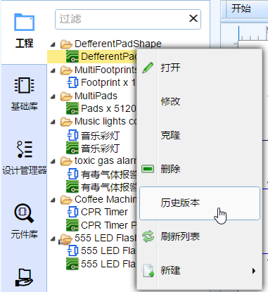

点击后会打开一个页面，里面会列出最近的历史版本。  
 
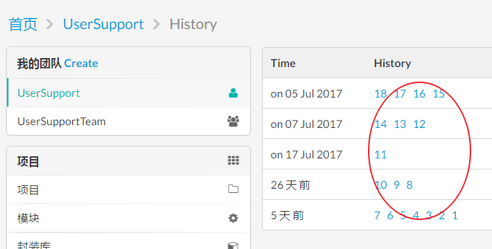,  

点击历史版本号，可以在编辑器打开查看，找到你想要的后，保存即可。

**注意:***请不要频繁对你的文件进行保存操作，否则这里会产生大量的历史版本，要找到你想要的版本将会非常困难。立创EDA会在你每保存一次时生成一个历史版本编号，为减少服务器负担，请尽量不要频繁进行保存操作。*

#### 改变画布大小

当你鼠标移动经过画布边沿时（上方，左右），会出现一条高亮的线段，点击上方的那条可以打开/关闭工具栏，点击左右两边的线段的中间按钮可以关闭/打开导航面板和属性面板，以增大画布面积。左右两边的线段还可以用鼠标拖动改变面板大小，以符合使用的习惯。  

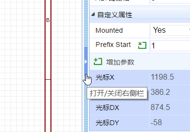

#### 光标样式

如果你不喜欢十字光标样式，你可以选择关闭它。**超级菜单 > 查看 > 十字光标**

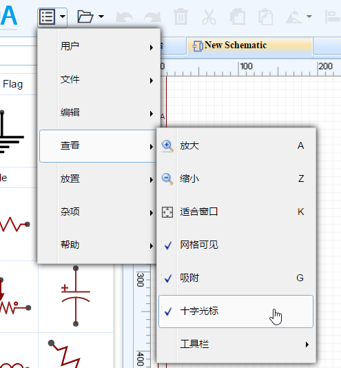

这两种光标如下，左边是无十字光标，右边是十字光标样式。 

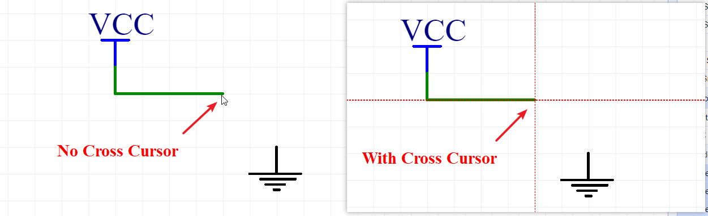

#### 批量清除

如果你觉得你的原理图和PCB太乱，需要批量删除时，你可以：

- **超级菜单 > 编辑 > 清除**，或者CTRL + A全选后，按Delete键删除。
- 删除文件并创建一个新的。  
- 使用工具栏的 **全局删除** 功能。  
  

#### 鼠标左击

与其他EDA软件相似： 

-   点击一个对象并已经选中它，可以在右边属性面板查看它的属性；
-   选中后长按可以保持它，和拖动它；
-   在空白区长按并拖动鼠标可以创建一个选择区域；
-   在选择区域内的对象可以通过鼠标进行整体移动；
-   双击文本可以对它进行编辑；

#### 鼠标右击

立创EDA暂时不支持画布内右键菜单。

-   当你进行放置元器件或者封装时，单击右键可以停止放置动作；
-   当你进行画线时，单击右键可以停止当前画线，以便进行第二处画线操作；
-   当你画多边形等形状时，画线位置会停止在你右击的位置，然后你还可以改变画线形状继续画线。
-   当你双击右键时会退出当前操作。

#### ESC键

-  按单次“ESC”键结束当前的绘图操作，但不会退出当前的命令模式。
-  按两次“ESC”键推出当前的绘图操作，将光标返回到选择模式

#### 选择多项目

-   CTRL + 左键一个个点击选择你所需要的对象。
-   也可以直接按住左键拖动鼠标，批量选择对象。
-   CTRL + A全选对象。

#### 放大缩小

-   使用鼠标滚轮进行放大缩小
-   向前滚动放大，等同快捷键Z
-   向后滚动缩小，等同快捷键A

**注意：***有些浏览器在按住 CTRL + 滚轮 会导致整个浏览器浏览页面变大，而不是滚动画布，这时你可以按CTRL + 0 恢复界面。*  

#### 鼠标双击

鼠标左键双击目前仅对文本有效，双击任意文本可以打开可调节大小的文本编辑框，你可以输入你想要的文本。

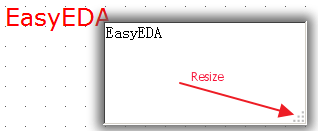

在编辑器框内按Enter键回车换行，鼠标点击框外部区域关闭编辑框。

#### 平移

-   在画布内，可以通过长按右键/鼠标中键任意拖动画布位置。
-   你还可以使用滚动条和方向键平移画布。
-   当你绘制走线时，鼠标移动在最边沿后会停止。

**注意：***若你的浏览器右键拖动失效，请关闭浏览器手势。*

**提示：***如果你使用的是Chrome浏览器，鼠标在画布内时，按CTRL或ALT键，并滚动滚轮，画布可以垂直平移；若按住SHIFT键，并滚动滚轮，画布可以水平平移。*

#### 旋转

当选择一个或多个对象时，你可以将他们旋转：**超级菜单 > 编辑 > 旋转** 或者点击工具栏的旋转图标。

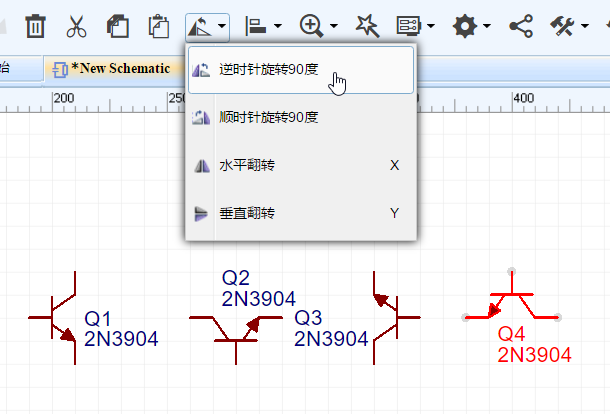

或者按下默认的快捷键“空格键”。图中Q零件就是翻转后的形态。

**注意：***旋转多个对象时，是以他们各自的原点进行旋转，而不是以整体中心旋转。*

#### 翻转

翻转是以中心轴进行翻转，如下方的三极管Q2，就可以由Q1翻转而来。

翻转与旋转放在一起，**超级菜单 > 编辑 > 翻转** 或者点击工具栏的旋转图标。

使用默认快捷键`X`进行水平翻转，`Y` 进行垂直翻转。

#### 对齐

立创EDA提供大量的对齐工具，可以很方便的对齐原理图符号以及PCB封装：

- 左对齐
- 右对齐
- 顶对齐
- 底对齐
- 水平居中对齐
- 垂直居中对齐
- 水平等距分布
- 垂直等距分布
- 左边沿等距分布
- 右边沿等距分布
- 对齐网格

#### 移到顶层或低层

该功能可以很方便将你想要的物件移动在最前面或者后面，以避免物件被最前面的遮挡。
如图的长方形和椭圆形均已经填充有颜色，分别是椭圆移到顶层和底层时的不同区别。

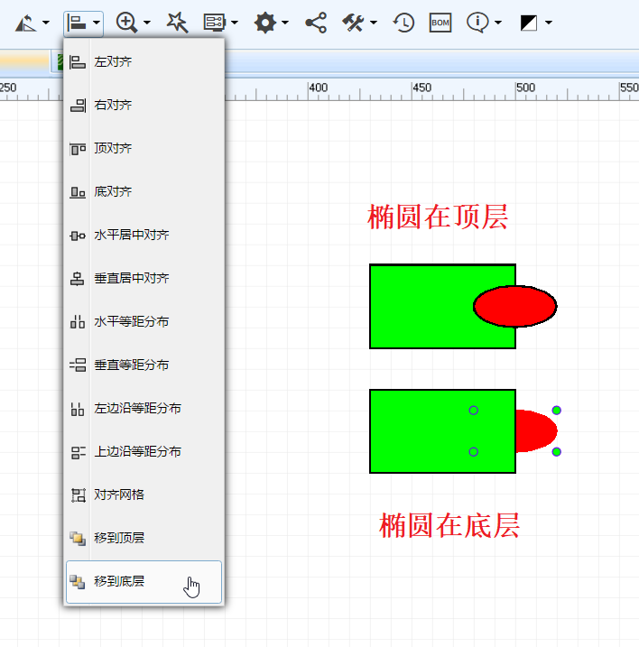

#### 文档标签切换

编辑器可以很方便地切换文档标签，只要鼠标左键按住标签，往左右拖动即可。
  
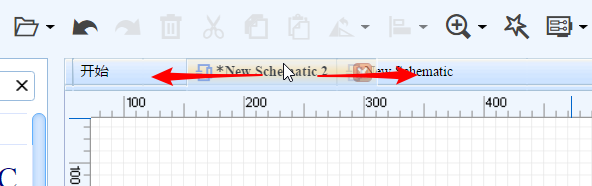

#### 保存文件在本地

尽管立创EDA已经将你的文件保存在服务器，如果你想保存在本地，立创EDA也有提供该功能。
你可以直接在工程“ 右键 > 下载工程 ”，或者直接在 “文档” 按钮使用 “EasyEDA格式源码” 保存文件。

具体可以浏览[导出EasyEDA源码文件](./Export.htm#导出EasyEDA源码文件)章节。

## 关于升级 

如果你使用的是网页版立创EDA，编辑器可以很容易的自动升级。立创EDA的升级方式是自动升级，不提供手动升级和暂停升级功能，也不提供降级选择。  

由于立创EDA使用的是一种网页APP缓存技术([W3C HTML5 Offline Web Applications](http://dev.w3.org/html5/offline-webapps/))，可以让你在离线时继续使用，但该技术有可能使在线升级失效。所以当立创EDA发布了新版本，你的编辑器一直没有自动更新至最新版本时，可以尝试以下操作：
 
- 关闭浏览器，并重新打开。
- 打开编辑器等待一段时间，若没有更新再进行刷新网页操作。
- 刷新后查看关于是否已经更新成功。

如果更新不成功，那么你需要清除浏览器缓存再次打开编辑器：   

**注意：***清除缓存会把原来的本地备份数据也清除！具体可看前面的 “恢复备份数据” 章节。*

**1.Firefox**  

-  点击 **菜单 > 选项 > 隐私 > 历史记录 > 清空近期历史记录**；
-  选择 **缓存** 后，点击立即清除。
-  重新打开立创EDA编辑器即可。

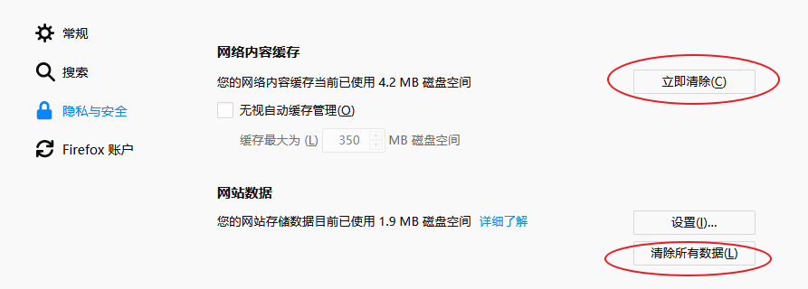  

**2.Chrome**  

-  在地址栏输入 **chrome://appcache-internals/**   
-  找到**lceda.cn**并且点击 “**Remove Item**”。
-  然后打开编辑器即可。  

  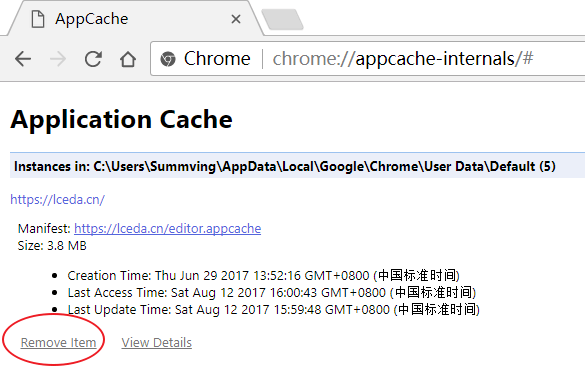  

-  或者使用快捷键 **Ctrl+shift+Delete**或者打开 **设置 > 隐私设置和安全性 > 清除浏览数据**  来删除所有缓存。

  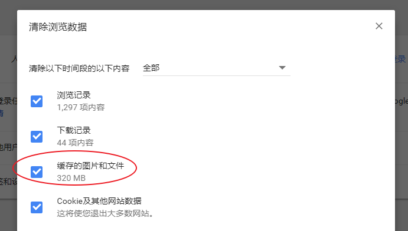 

## 寻求帮助

立创EDA为广大用户提供了友好的社区支持。社区请访问：[http://club.szlcsc.com/forum/97_0_1.html/](http://club.szlcsc.com/forum/97_0_1.html)  
目前立创EDA和立创社区的账号体系还没有打通，所以需要分别注册，在未来会打通两个账号系统。

1.  你可以在社区直接提问需求帮助，技术支持或资深用户会及时查看并回复。
2.  如果你不想别人看到你的问题，你可以联系技术支持。建议使用社区提问，以便作问题记录，方便其他用户查看和搜索，加速学习进度。
3.  如果你发现了编辑器的BUG，包括使用上的操作BUG，系统库文件的错误，请及时联系支持人员进行修复。

技术支持联系方式：QQ 3001956291，或者邮件：3001956291@qq.com，立创EDA技术交流群：229233498 (申请加入需提交注册邮箱，以便管理员验证)

**注意：**  

-	*如果是使用技巧上面的问题，请先查看本帮助文档后尝试自行解决，本文档已经阐述立创EDA几乎所有功能。若仍然不能解决，可通过以上方法联系技术支持人员。*  
-	*由于立创EDA没有太多的人力资源去专门处理这些问题，所以解决你的问题可能会有一定的滞后，技术支持人员会尽快回复解决。*  
-	*当前技术支持人员更多的是协助新用户对编辑器的熟悉和使用。*

    

# 原理图绘制
 
阅读以下章节，可以引导你快速熟悉如何设计一个原理图。 

 
## 画布设置

点击空白区可在右边属性面板查看和修改画布属性。画布属性内的参数均可以被自行配置。网格和栅格尺寸单位为像素(pixel)。

原理图中大部分对象，在选中它后，基本都可以在右边属性面板查看和修改它的属性。

### 网格

网格是用来标识间距和校准元器件符号的线段。单位像素(pixel)。

**网格可见**：  是 或 否

**网格颜色**：任意有效颜色

**网格样式**：实线 或 点

**网格大小**: 为了确保元器件位置准确，默认为 10, 20, 100。

网格的线条和画布背景颜色可以通过输入你想要的颜色的十六进制值直接设置，或者通过点击颜色值框中打开的调色板上的颜色来设置颜色。

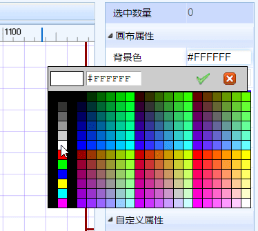

### 栅格

栅格是元器件符号和走线移动的格点距离，以确保对齐。

**吸附**：是 或 否。默认快捷键是 `G`， 按下后吸附功能循环开启关闭。关闭吸附后，元器件和走线可以任意移动不受栅格限制。

**栅格尺寸**： 为了确保元器件和走线对齐，默认设置栅格大小为 10、20、 100，但允许设置为其他数值如 0.1、 1、 5等。数值越小，元器件和走线移动的进度越小，越精准。

**ALT键栅格**：当按下ALT键时启用该栅格大小。

建议一直保持吸附开启状态。若之前的元器件摆放和走线是在关闭吸附状态下的，再次打开吸附功能后，原有的项目将很难对齐栅格，强行对齐后将可能会使原理图变得很不美观，如走线倾斜等。

## 电气工具

若你关闭了电气工具或者没有正常打开，你可以在工具栏处打开。

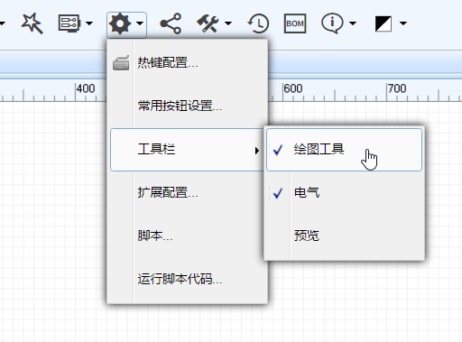

**注意：** *电气工具内的功能均具有电气特性，如果你想画一些圆弧和线框等请使用“绘图工具”。*  

### 导线

有三种模式进入绘制导线模式。

1.  在“电气工具”点击“导线”图标；
2.  按快捷键“W”；
3.  直接点击元器件的引脚端点然后移动鼠标 。编辑器会自动进入绘制导线模式。

下图是一个已经连线完成的原理图。

**移动元件时导线跟随**

当你用鼠标移动一个元器件时，它所连接的导线会相应的垂直/水平跟随移动。

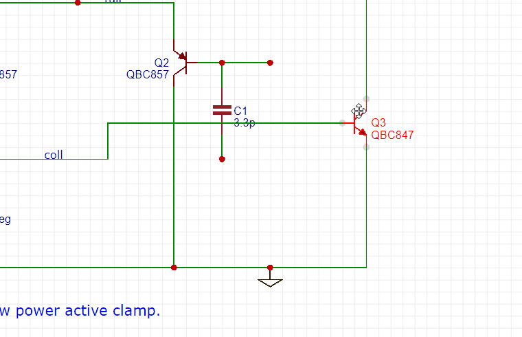

**自动断线**

当你放置一个电阻或者电容在导线上时，导线会自动连接引脚两端，并去除中间的线段。

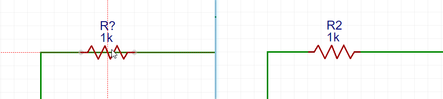

当你需要连接并排的电阻或电容时，可以直接从左往右走线，线段会自动连接并移除多余走线。

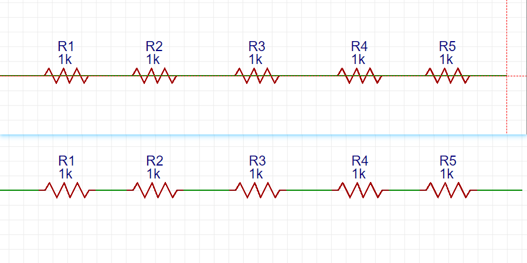

### 总线

当你绘制的原理图需要很多网络的时候，对每个网络都进行画线将非常困难和耗费时间，此时你可以使用“总线”功能。总线必须和总线分支共同使用。

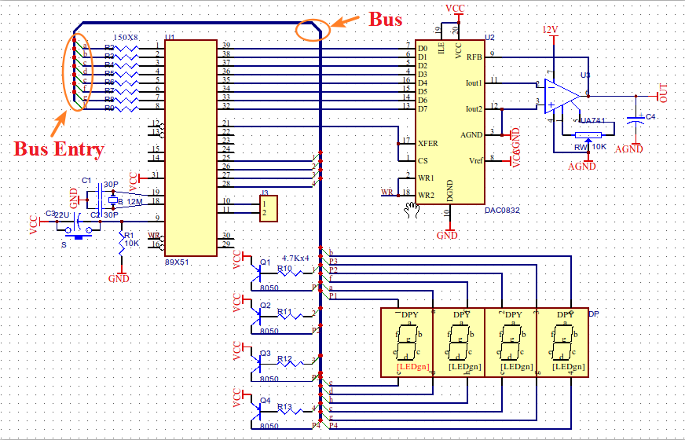  

### 总线分支

绘制了总线之后，需要在总线放置总线分支，并连接所需的网络连线或者放置网络标签。如上图所示。

### 网络标签

**网络标签** 可以用来标识导线网络名， 或者标识两个导线间的连接关系。 使用快捷键“N”可以快速放置网络标签。  
当你点击它，可以在右边的属性面板修改它的属性。

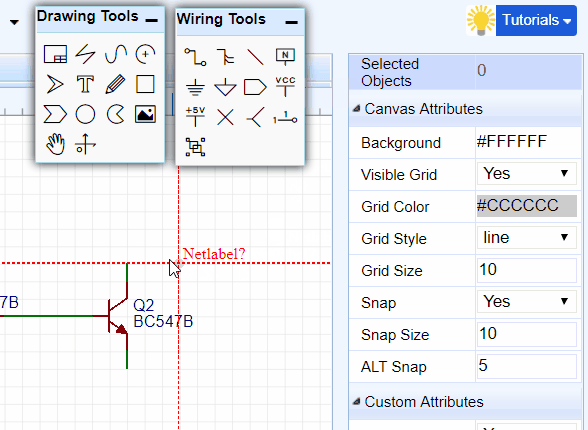

如果只想更改它的名字，直接双击即可修改。编辑器会记住你上次使用的网络标签名称，并在下一次继续使用该名称，若你修改的网络名称以数字结尾，那么下次放置时网络标签的名称将自动加1。如你放置了VCC1，那么下一个为VCC2。

### 标识符

**标识符** 的作用与“网络标签”相似，使用快捷键 `Ctrl+G` 放置 **GND** ，使用`Ctrl+Q` 放置 **VCC**，并且你可以修改它们的名字。

下图使用网络标签(Q3B等)和GND标识符。

电气工具栏为你提供了：数字地GND标识符、模拟地GND标识符、 电源标识符VCC和+5V以方便使用。

### 网络端口

当你需要绘制很多网络导线，或者分页原理图图时，可以使用 “网络端口”功能；在同一原理图下时，使用网络端口与网络标签功能一致。

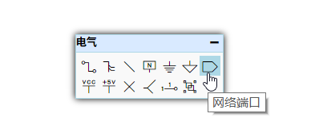

使用网络端口可以使原理图变得清晰简洁，没有过多的导线，只需给每个端口设置一个网络名称。

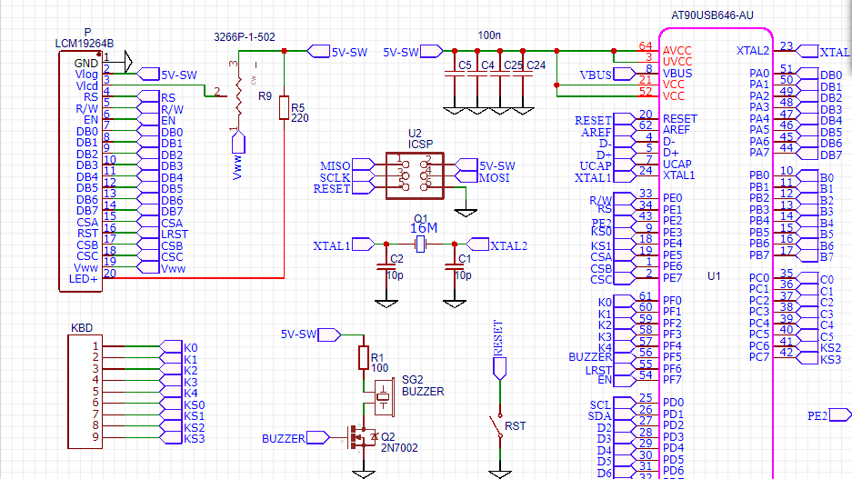

### 非连接标志

非连接标志用于原理图上元器件不使用或需要悬空的引脚，避免出现引脚没有进行网络连接而在设计管理器内报错。   

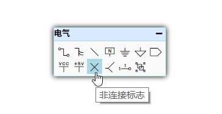,   

如下图，如 Q2_1 脚不添加非连接标志，在设计管理器中会出现错误标志。

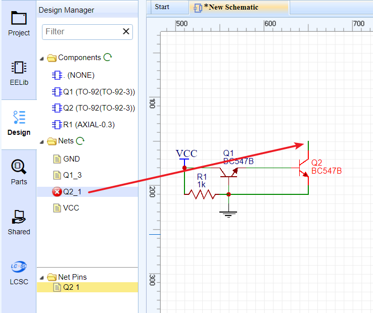   

在添加非连接标志后，错误消失。

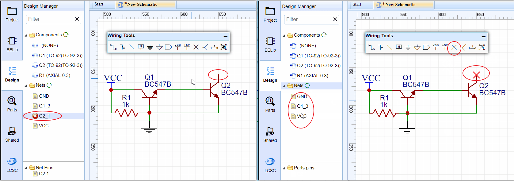  

**注意：** *非连接标志只能直接在元器件的引脚端点上使用，不能在导线上使用。*

### 电压探针

电压探针是在电路图仿真时使用，用于侦测电路电压参数，与实物万用表量测电压时功能一致。

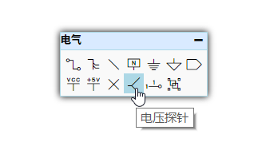 

仿真运行后，产生的波形就是根据放置的电压探针进行采样生成。

更多关于仿真的内容请查阅 [Spice仿真](./SpiceSimulation.htm#Spice仿真) 章节。

### 管脚

当你在原理图或原理图库文档新建一个带电气特性的原理图符号时，你必须为它放置管脚(引脚)，否则它将无法通过导线连接。使用默认快捷键 “P”可以快速放置管脚。

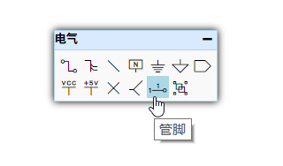

更多信息请查阅 [原理图库文件：管脚](./SchematicLibs.htm#管脚) 章节。

### 组合与解散

在电气工具栏的组合/解散标识符。

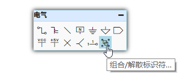

它与“原理图库向导”相似，可以帮助你快速的创建原理图库符号；也可以解散原理图库符号，以便进行修改。

**组合**

在原理图下，使用它可以很容易地画出如下图U2的样式符号。 

如下图的555定时器元件，当你画完长方形，放置了管脚，并对管脚全部重新命名，此时全选全部组件，再点击组合/解散按钮会弹出一个符号命名窗口。

此时你可以输入你所组合的元件的编号，名称，封装信息。

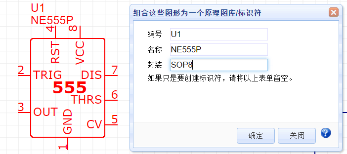

当你点击“确认”后该元件符号已经创建完成。你可以继续进行原理图设计，其与在元件库放置的元器件功能一致。

**解散**

与组合刚好相反，它可以打散元件符号，以便就地按需修改，无需通过修改元件库文件。

**注意：** *你在这里创建的元件符号不会保存在你个人的库文件中。若你想保存在个人库中，请新建原理图库文件。*

## 绘图工具

### 图纸设置

立创EDA默认给新建的原理图设置了A4大小的表格图纸。你可以很方便地修改图纸大小。

可以通过绘图工具的“图纸设置”或者 **超级菜单 > 杂项 > 图纸设置**进行修改。

在图纸右下角还可以通过双击修改作者，日期，名称等信息。

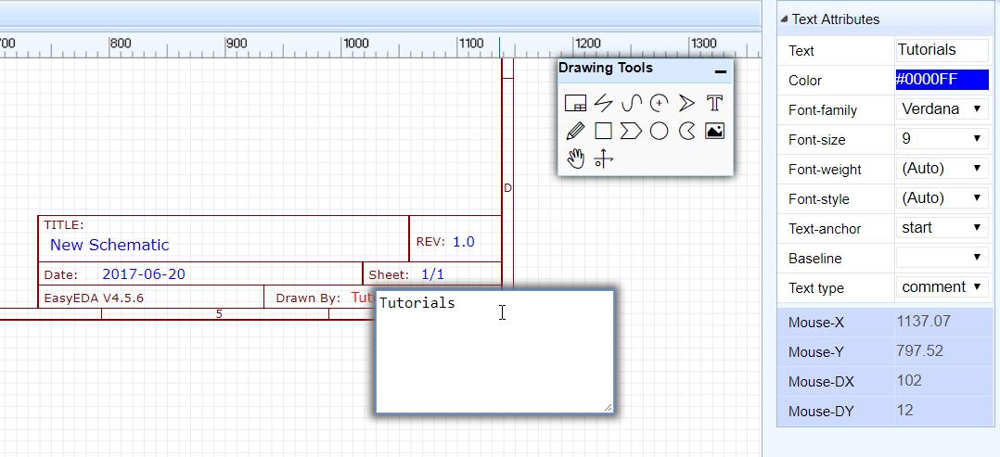  

当点击图纸本体时，可以在右边属性面板进行修改大小、颜色等相关信息。  

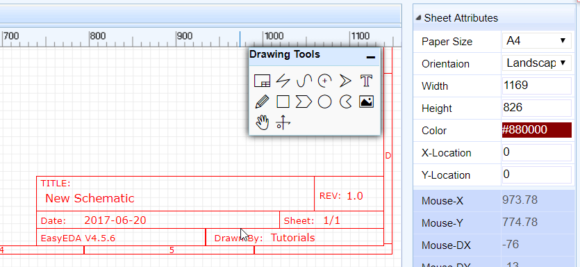  

### 线条

在原理图中，你可以绘制任意方向的线条。修改线条样式，颜色，填充颜色等。

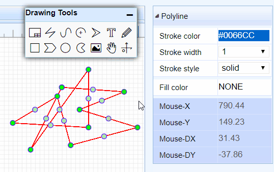  

### 贝塞尔曲线

使用贝塞尔曲线，你可以画出很酷的图案。

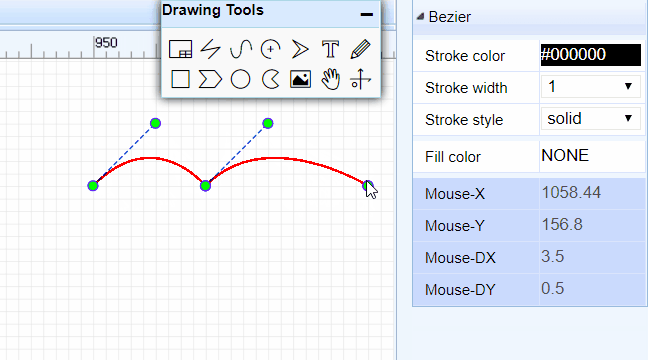  

### 圆弧

支持绘制不同形状的圆弧。

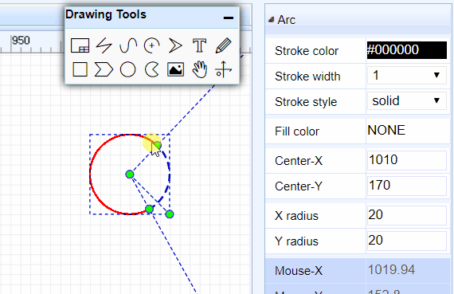 

### 箭头

箭头一般在文本前做标识用。

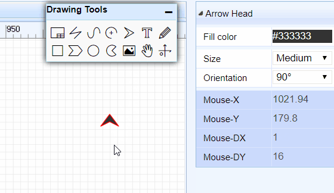 

### 文本

文本属性提供多种参数供你设置。

-	**文本**：你可以修改为你想要的文本。新建时默认为Text。  
-	**颜色**：可自定义字体颜色。  
-	**字体**：提供12字体选择。  
-	**字体大小**：最大支持72号字体大小。    
-	**字体粗细**：提供13种粗细选择。  
-	**样式**：包含自动、正常、斜体。  
-	**文本锚点**: 包含类型有 (auto)、start、middle、end、inherit.  
-	**基线**：文本放置位置的基线类型。  
-	**文本类型**：是属于备注文本还是Spice仿真描述。

在同一原理图内，编辑器会记住上一个文本的属性参数，在放置时自动套用上次的属性。

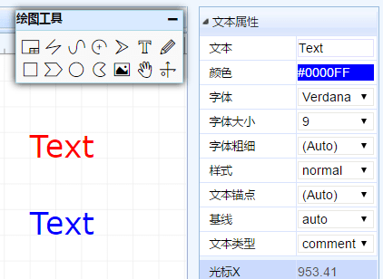 

### 图片

点击图片功能会生成一个默认图片。

点击这个图片在右边属性面板可以编辑它的属性，修改图片。

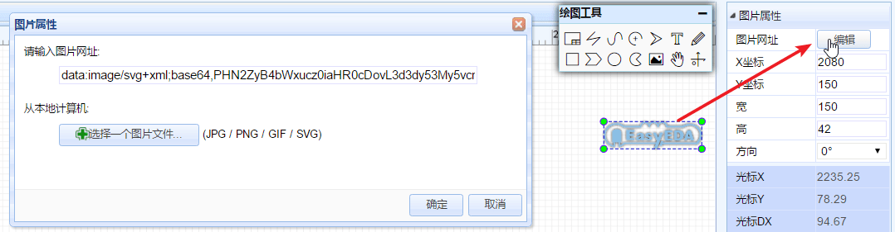

可以通过超链接插入图片，也可以从本地上传。插入的超链接必须是以图片格式后缀名(.PNG，.JPG，.SVG)结尾，如：[http://upload.wikimedia.org/wikipedia/commons/thumb/c/c7/555_Pinout.svg/220px-555_Pinout.svg.png](http://upload.wikimedia.org/wikipedia/commons/thumb/c/c7/555_Pinout.svg/220px-555_Pinout.svg.png)

之后你可以看到图片如下：

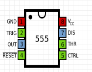

**注意：***目前立创EDA不能为你上传的图片创建图库，若使用超链接上传图片请使用有效图床。*

### 拖移

拖移是整体移动，并且断开连接。

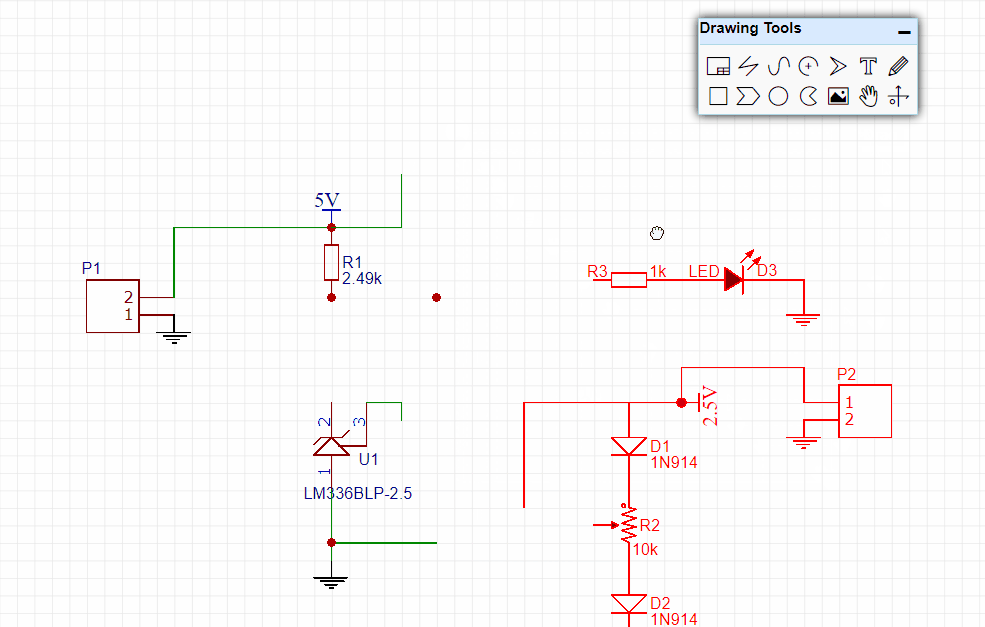

### 画布原点

立创EDA画布的默认原点是在左上角，你可以随意定义画布原点。 

其它方式设置可通过 **超级菜单 > 杂项 > 画布原点**。

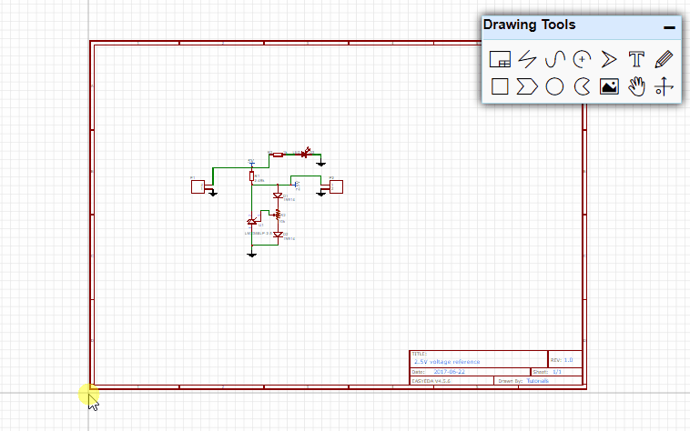

## 元件库搜索与放置

在左边导航面板有 "**基础库**" 和 "**元件库**" ，

1) **基础库** 包含了一些常用的基础元件，并且支持仿真。基础库不支持自定义。

基础库有一些零件样式包含美式和欧式，你可以随意选择你喜欢的样式。点击零件右下角可以选择它相应的封装和参数，编辑器会记住你选择的参数以便下次应用。

使用筛选器可快速找到想要的零件，比如输入“res”或者“电阻”可快速显示出电阻。

单击零件后移动鼠标至画布即可放置，无需拖动。立创EDA不支持拖动放置。

2) **元件库**，或者使用快捷键“SHIFT + F”调出。
会打开元件库搜索框，输入零件名称后搜索即可。

 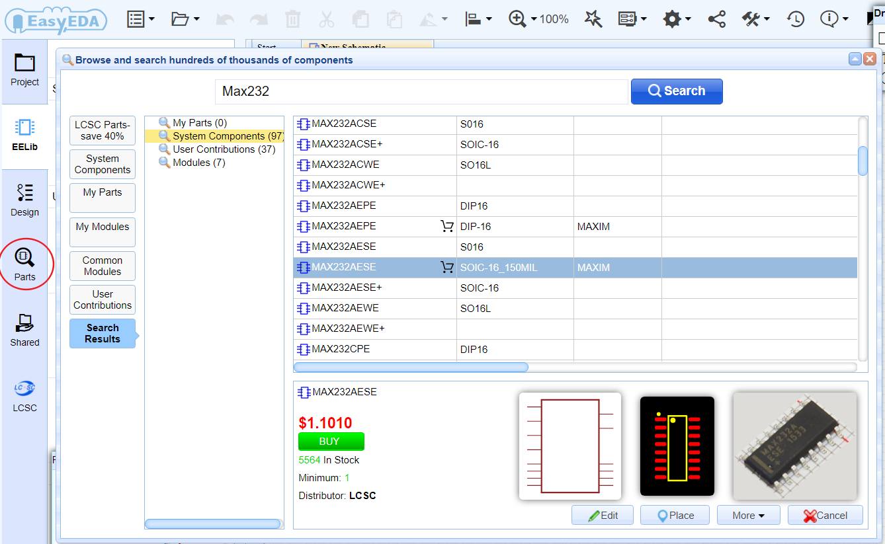

在搜索结果里可以选择你想要的类别，然后单击选择你所需的零件，再点击搜索框下方的“放置”即可放在画布中。你也可以直接移动鼠标至画布也可以进行放置。

**立创可贴片零件**  

为了方便用户选择立创EDA可帮忙贴片的零件，立创EDA单独建立了一个“立创可贴片零件”库，该库是“立创商城”库的子集。  

**放置**：一些经常使用的零件，无需收藏，直接点击放置即可放在画布中。

**编辑**：这里可以编辑你自己的库文件；或者修改其它用户贡献的，系统库的库文件以适应你的需求，保存后会成你个人的库文件。

**更多**：你可以对一些非个人库文件进行收藏和克隆，可以对自己的库文件进行修改(标题，描述，标签)，删除，添加子库等操作。  

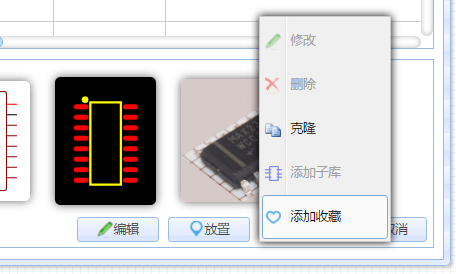

**注意：**    

-	*系统库的库文件立创EDA会努力确保100%正确，但仍可能存在错误，如果你发现系统库和立创商城的元件或封装存在错误，还请联系我们进行修复。QQ3001956291，或者邮件：3001956291@qq.com。*
-   *立创EDA支持多页原理图，选中的零件只能放置在当前打开的文档中。*  
-   *你无法放置原理图库符号到PCB，同样，你也无法放置PCB封装到原理图中。*

### 原理图中查找元件

在原理图中查找元件，可以通过：**超级菜单 > 杂项 > 查找元件** 或者使用默认快捷键：“CTRL + F”。

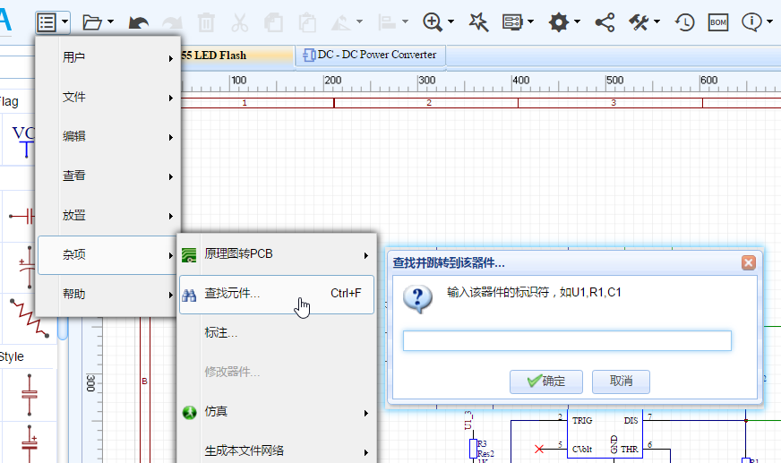  

**注意：** *你需要点击“确认”或者按回车键才会进行搜索。*

该功能只能查找元件编号，无法查找文本，网络名称等。点击确认后会将零件高亮至画布中央。

如果需要搜索网络，可以使用设计管理器进行搜索，快捷键 “CTRL + D”。

## 调整元件

你可以通过以下方式调整元件位置：

-	长按元件后用鼠标移动元件位置；  
-	选中元件后用键盘的方向键移动；
-	选中元件后按空格键翻转元件
-	选中元件后使用对齐工具调整位置。

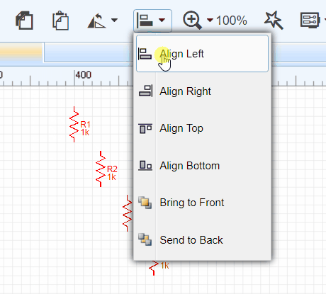

## 交互选择模式

这个功能是用来跳转原理图符号和PCB封装之间的对应位置。在原理图选中一个零件后，点击“交互选择模式”或者使用快捷键 “SHIFT + X”，即可切换至PCB并高亮选中的零件的封装。
 
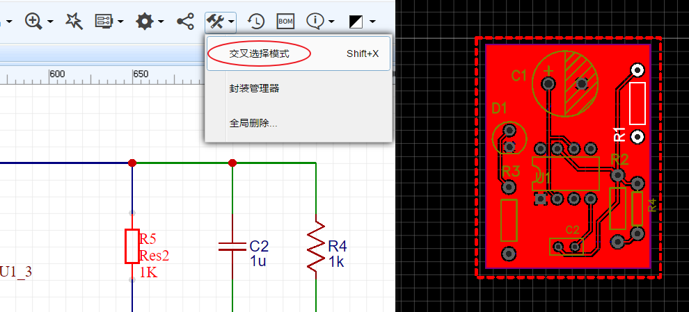  

**注意：** *在使用该功能前，你若尚未打开PCB，编辑器会自动为你打开。*  

## 放置元件子库

当一个元件存在太多引脚时，把它全部画在一个库文件中将会非常耗费空间，所以可以通过创建子库来进行多模块组合该元件。  

如搜索74HC04DB，一个二进制转换零件。如下图所示，该零件存在7个子库。

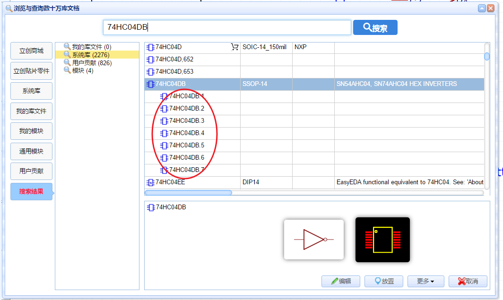

当依次放置它的子库在原理图时，如下图所示。

**注意：** *如果你只放置第一个子库，并放置多次，编号会从U1.1，U2.1，U3.1开始，所以一般放置第一个子库后需要依次放置其余子库。*

更多关于元件子库的信息清查看[原理图库文件：元件子库](./SchematicLibs.htm#元件子库)

## 设计管理器

当原理图太大，和比较复杂时，很容易出现连接错误，这时可以使用设计管理器来进行查找错误。

使用快捷键“CTRL + D”或者在左边导航面板直接点击“设计管理器”打开。

-	**筛选器**: 方便地查找元件编号，封装名称，网络名，管脚名。
-	**器件**：选中一个零件后会在画布中高亮该零件，选中下方的Part Pins的管脚时，画布会出现提示线注明是哪个管脚。
-	**网络**：这里列出所有网络，每个网络至少连接两个引脚，否则这里会提示错误标志。
-	**Net Pins/Parts Pins**：这里列出网络连接到的引脚或元器件的所有引脚。

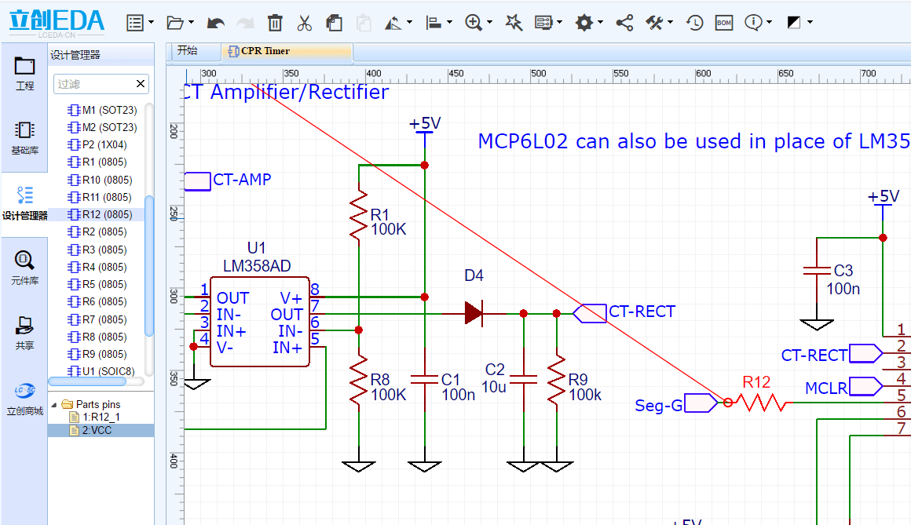

**注意：***若工程下存在多个原理图时，设计管理器内只会显示当前打开文档的元件与网络信息。故跨原理图的单个网络端口和网络标签可能会出现错误标志，请忽略即可。*

## 封装管理器

如果你想批量修改封装，想知道零件引脚对应封装哪个焊盘，你可以使用封装管理器。

有两种方式打开封装管理器：

-	在工具栏点击齿轮图标 > 封装管理器。

   

-	选中你想要的零件后，在右边属性面板处点击封装输入框，即可弹出封装管理器。
  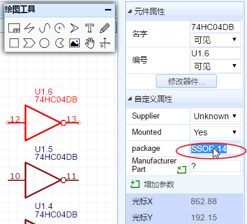

1、打开封装管理器后，它会自动检查你零件的封装是否存在，是否正确。如果零件没有指定封装，或封装不在个人库和系统库中，或零件引脚编号与封装焊盘编号无法正常对应时， 封装管理器会在零件名前出现错误图标，并使零件名标红。    

-	例如：你的零件U1有两个引脚，编号分别是1、2，名称分别是VCC和GND；但是你用的封装的焊盘编号是A、B，所以左边列表会报错标红，要修正错误要么你将1、2改成A、B，要么将封装的焊盘编号A、B改成1、2；要么更换封装。

2、在零件和封装的预览窗口，你可以用鼠标点击拖动，滚轮放大缩小预览图。 

**注意：**   

-	*如果你的原理图使用了数量较多的不同名称的封装，封装管理器在检测封装焊盘编号与元件引脚编号的对应关系时，会与服务器进行封装数据查找和对比，这将花费一定时间，请耐心等待。*   
-	*如果你的工程下存在多个原理图文件，打开封装管理器时会将全部原理图打开，并加载所有元件。*

### 更新封装

如果你想更新封装，比如下图的Q1，从 **TO-92** 更新至 **TO220**。

-	在封装管理器搜索框输入**TO220**，然后搜索；
-	选择搜索结果中的**TO220**封装；
-	在预览窗口中检查是否正确；  
-	然后点击“更新”按钮。   

然后所选的零件封装已经更新为 **TO220**。

**注意：**   

-	*为了确保你使用的封装已存在于立创EDA的封装库中，请使用封装管理器更新而不是直接在封装输入框填入封装名称。*   
-	*更新封装后，若该封装不在你的封装库中，立创EDA会自动将该封装加入你的收藏中。*

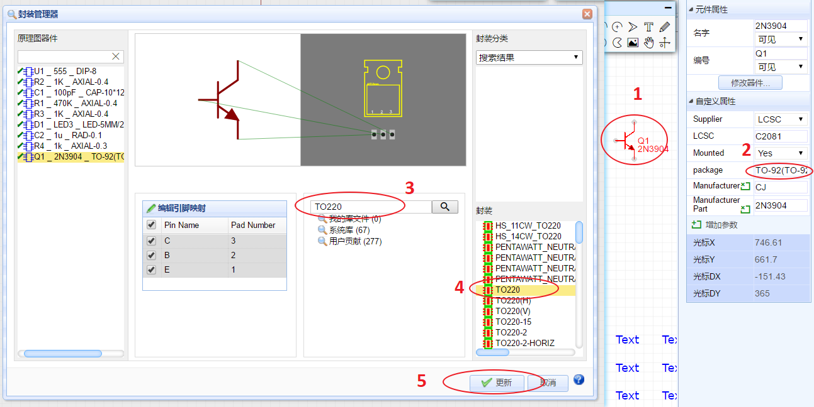

**批量更新封装**

如果你想批量修改封装，可以按住“CTRL”键之后，通过鼠标逐一选择所有需要修改的零件，为防止选错，不支持按“SHIFT”批量选择。如果零件太多，可以在筛选框输入封装名称进行筛选需要修改的零件，如筛选`AXIAL-0.4`。  
如果你想选择自己的封装，可以在右上角“封装分类”下拉菜单选择“我的库文件”进行选择。

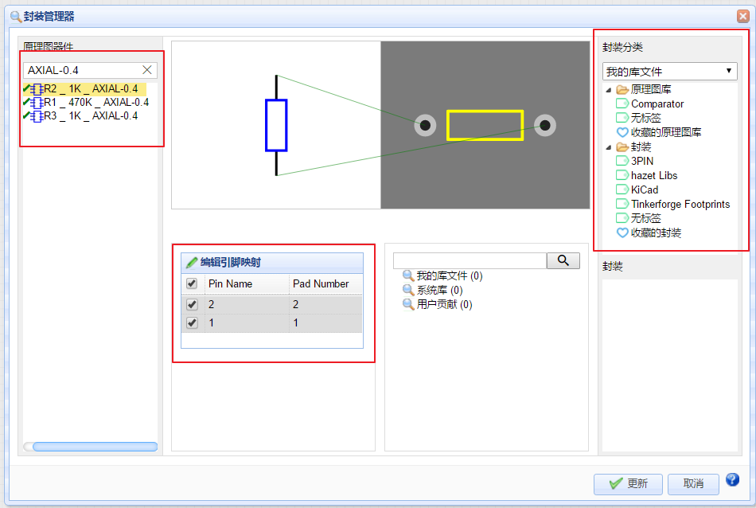

**编辑引脚映射**

你还可以在封装管理器里修改零件的引脚信息，包括编号和名称。其中Pin Name是指该元件的引脚名称；Pad Number是指元件的引脚号，此处并非指预览窗口封装的焊盘号。

## 元件属性

选中一个零件之后，可以在右边属性面板查看或修改它的属性参数。

1、**元件属性：** 你可以修改元件的名字和编号，并设置它们是否可见。还可以修改器件信息。

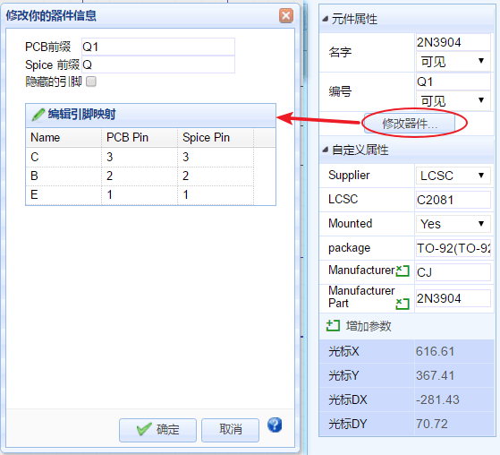    

2、**自定义属性：** 在这里你可以修改元件的供应商，供应商编号，制造商，制造商编号，封装等。Mounted是指该零件是否在PCB板上贴片或者插件，该处在BOM体现。

3、**添加自定义参数：** 当你选中一个零件，可以它新增参数，若你勾选了“In BOM”，那么该项参数会在BOM表中体现。

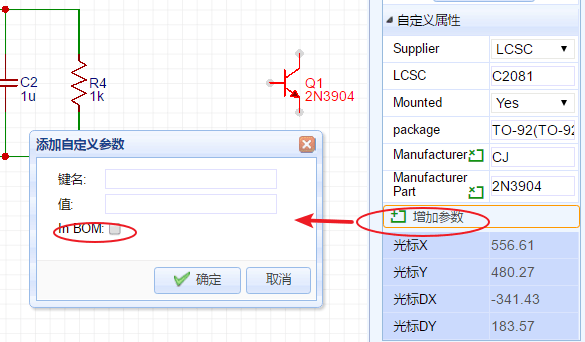

## 元件引脚信息修改

当你需要修改一个元件引脚信息，你需要选中它，

-	可以在右边属性面板的“修改器件”对元件的引脚信息进行修改。
-	或者在 **超级菜单 > 杂项 > 修改器件** 打开。
-	或者使用快捷键“I”（字母 i）。

你可以修改元件的引脚名称，PCB前缀，Spice前缀，显示元件隐藏的引脚，元件引脚编号，Spice引脚编号等。
比如，你可以通过修改引脚编号来指定一个你想让它对应的封装；你也可以通过修改Spice前缀和Spice引脚编号来使它可以进行仿真。

**注意：***显示了元件隐藏的引脚后无法再通过此选项将该引脚再次隐藏，你需使用工具栏的撤销功能。*

### PCB前缀与Spice前缀

原理图中的元件，除了元件编号和用在PCB上的PCB前缀之外，还有一个用于Spice仿真的**Spice前缀**。

**PCB前缀**是在生成PCB时元件对应封装的编号。基本上原理图编号与封装编号是一致的。比如你将原理图的U1的PCB前缀改为K1，那么它转为PCB时的封装编号就是K1.

**Spice前缀** 用于告诉仿真器，该个符号表示哪个电路元件，用于什么样的仿真模型，它的分配规则比较严格。

大多数Spice电路元件的仿真模块采用单行的 .model 语句形式，但其中一些可能采用多行形式 .subckt 子电路进行定义。 例如，一些MOSFET可以用一个.model语句描述，在这种情况下，它们的Spice前缀是**M**，但许多MOSFET由.subckt描述，所以它们的Spice前缀是**X**。

因此，无论为原理图符号选择的PCB前缀如何，给定电路元件的原理图符号的Spice前缀必须与仿真原理图中该电路元件的实例所需的模块类型相匹配。

大部分Spice前缀与元件的关联列表如下：

更多关于Spice仿真模块的内容请访问NgSpice：[http://ngspice.sourceforge.net/docs/ngspice-manual.pdf#subsection.2.1.2](http://ngspice.sourceforge.net/docs/ngspice-manual.pdf#subsection.2.1.2)

### 元件引脚编号与Spice引脚编号 

-   元件引脚编号： 这些编号是元件所需对应封装中真实的引脚数字。 它们是必需存在的，可使原理图中的器件符号的引脚可以映射到PCB中的占用空间的物理引脚上。 换句话说，原理图中显示的连接最终通过PCB上的铜线连接来体现。

-   Spice引脚编号：  这些编号是将原理图符号上的引脚映射到Spice仿真或子电路中对应功能的编号。

## 元件编号起始

每个新建的原理图，在右边的自定义属性下有一个 `Prefix Start` 选项，该选项的作用是给放置的元件设置开始的编号，默认开始的编号是从1开始。若你使用多页原理图时，不希望第二页原理图的元件编号从1开始，那么你可以给它设置为200,300等，那么你放置元件的编号就会变成U200，U201，U202等。

## 元件编号冲突

若你的原理图和工程下存在两个相同元件编号，当你进行电路仿真、打开设计管理器、转换到PCB过程中，会提示编号冲突，因为在正常情况下原理图和工程中不允许存在两个相同编号的零件。

如下图，因为存在两个 R4 所以在仿真的时候出现报错，这时你需要将其中一个编号修改为原理图中不存在的编号。

如果你在同一工程下复制一个原理图做备份，在转换为PCB时会提示编号冲突，那是因为立创EDA在工程下的原理图均视为属于同一个工程，在转换PCB时是将工程下的所有原理图合并后转在同一个PCB。所以你需要将备份文档放置在另外一个工程下。

## 网络冲突

立创EDA原理图中暂时不允许多个不同网络名称同时存在同一条导线上。否则当你进行电路仿真、打开设计管理器、转换到PCB过程中，会提示网络名称冲突。

在上图你可以发现VCC，GND，NetLabel1在同一条导线上，此时，你必须仅保留其中一个网络。

## 标注

当你创建了一个拥有较多数量元件的原理图时，很可能会出现编号重复，缺失等问题。如果你不想一个个去检查修改，你可以使用“标注”功能进行全局修改。

可以在 **超级菜单 > 杂项 > 标注** 打开。

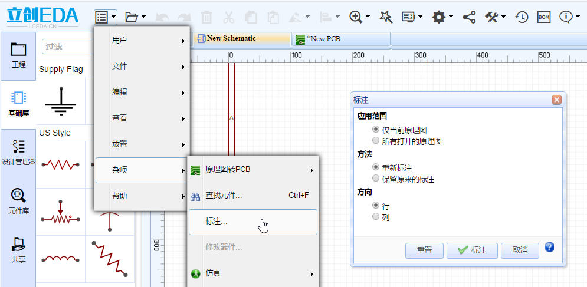

**应用范围：**

-   **仅当前原理图**： 标注功能只对当前的原理图有效。
-   **所有打开的原理图**：  标注功能只对所有打开的原理图有效。

**注意：** *使用所有打开的原理图选项时，即使是不同工程下的原理图也会被进行标注处理。如果你只想标注一个工程下的原理图，你需要将它下面的原理图全部打开，并且关闭其它工程的原理图。*

**方法：**

-   **重新标注**：对全部零件编号进行重新标注，包括已经存在的编号。
-   **保留原来的标注**：只对新增的还没有分配编号的零件进行标注，原来存在编号的零件不做变更。

**方向：**

-	**行**：从顶部第一行开始，从左到右开始编号。
-	**列**：从左边第一列开始，从上到下开始编号。

**标注：**点击后进行标注操作。

**重置：**如果你想将全部零件编号的数字都改成 “？”，你可以点击它，效果如 R1 变成 R?，U1 变成 U? 等。

**注意：** 

-	*当你点了标注按钮后，重置按钮并不能恢复你原来的标注。*
-	*如果你标注后不满意可以使用工具栏的撤销按钮(快捷键CTRL+Z)恢复。但如果你标注保存并关闭文件后，再打开文件将不能恢复原来的标注状态。*
 

## 原理图库向导

立创EDA提供一个可快速创建原理图库符号的向导工具。

在工具栏点击打开，如果是在原理图库文档中可以在**“超级菜单” > “杂项” > “原理图库向导”**打开。

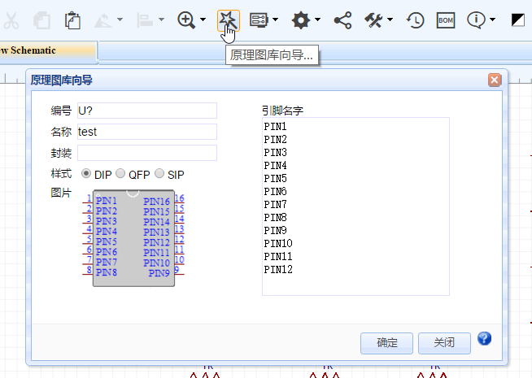 

使用555定时器为例，当输入编号，名称，封装，选择样式，输入引脚名称后，点击确定即可自动生成一个元件符号。

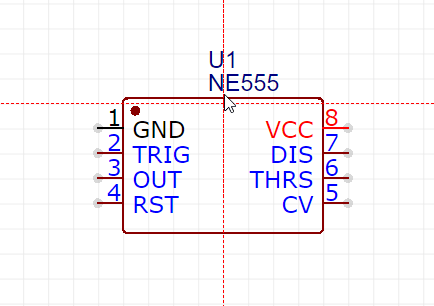

原理图库向导目前暂时提供了三种图形样式： DIP, QPF 和 SIP 。

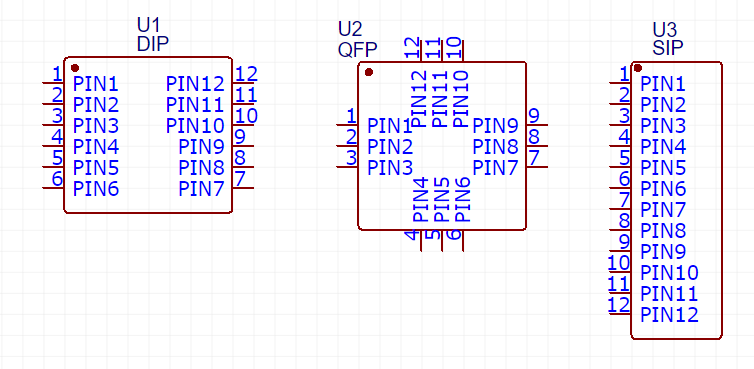

通过自定义引脚名字和封装，可以绘制方便识别的原理图库，比如下方自定义的含EBC说明的3极管2N3055符号。

## 原理图转PCB

当你完成了原理图绘制，想要转换为PCB，你可以点击工具栏上面的图标**原理图转PCB**，或者点击 “**超级菜单 > 杂项 > 原理图转PCB**“

**注意：** *在你进行转换PCB之前，请先在设计管理器和封装管理器检查是否存在错误。*

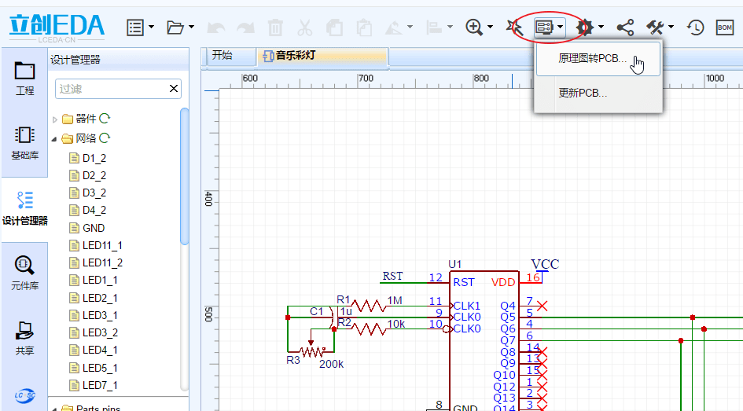

**PCB库搜索顺序**

在转换为PCB时，编辑器会优先匹配你个人的封装库，收藏库，如果没有匹配，则会在系统库中查找。

比如你放置了一个三极管Q1，默认封装是**TO220**，且你没有重新为它指定封装，若在你的“我的库文件”中存在一个同名的**TO220**封装，那么在转换为PCB时，Q1的封装编辑器会优先匹配你个人的封装，并忽略系统的同名封装。

**校验封装和生成PCB**

点击“原理图转PCB”后，如果编辑器检测到你的元件封装不存系统库中在或者元件无封装，会弹出错误对话框，并且转换动作不会继续进行。  
点击下图的表格会打开封装管理器，你逐一修改/更新封装后，再重新转PCB即可。  

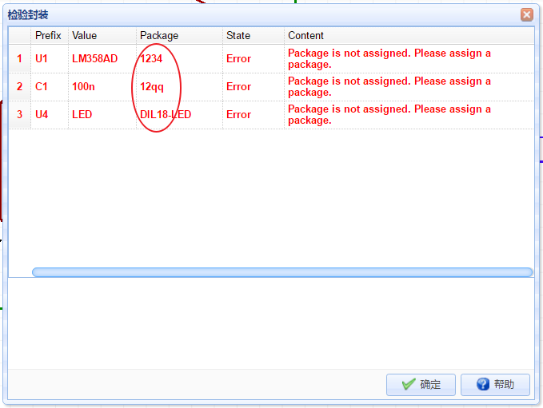

转换成功后会如下图所示，自动生成一个PCB边框，并将PCB封装按照顺序排列成一排，蓝色的飞线表示两个焊盘之间需要进行布线连接，属于同一网络。

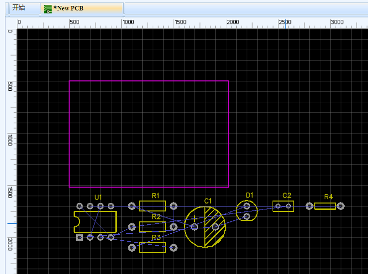

### 更新PCB

当你已经完成转PCB动作，但是又再次修改了原理图，这时你无需转一个新的PCB，只需点击“更新PCB”即可将变更更新至现有的PCB文件。

  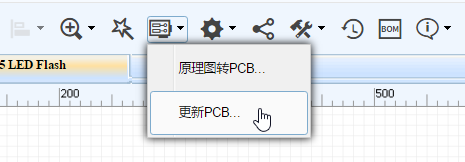    

你也可以在PCB中直接导入变更。

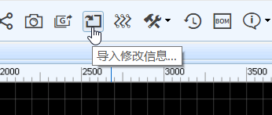

**注意：**

-	*网络名是自动生成，当你修改了原理图后部分网络可能会出现变更，那么更新至PCB后会导致原网络走线丢失！*
-	*PCB导入变更后你将无法撤销！*

## 原理图层级

立创EDA不支持真正意义上的分级设计，但是支持多页原理图并支持全局网络，你可以在一个工程下放置多个原理图图文件，并将它们通过相同名称的网络标签和网络端口连接起来。

比如你在原理图A和原理图B均放置了网络标签A、B、C，那么在转PCB时编辑器会自动将原理图合并，使网络连接起来。

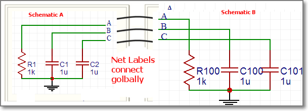

**注意：** *请让工程内的元件编号保持唯一，否则会出现上文所说的编号冲突。*

**提示：**   
*每个原理图的元件编号默认从1开始。如 R1, C1, U1 等。*   
*1. 你可以使用上文的标注功能进行重新标注编号。*  
*2. 你可以把起始编号改为100等，那么元件编号就可以 R100, C100等开始编号。*   

## 原理图模块

立创EDA支持原理图模块功能，以利于电路模块的复用，避免进行原理图的复制粘贴时出错。

创建方式：**“另存为模块”**和**“文档” > “新建”> "原理图模块"**。

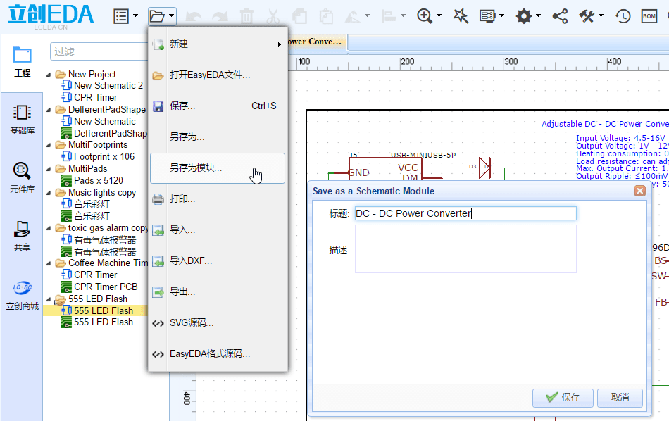 

原理图模块保存在“元件库”> “我的模块”中，下次使用在这里直接放置即可。

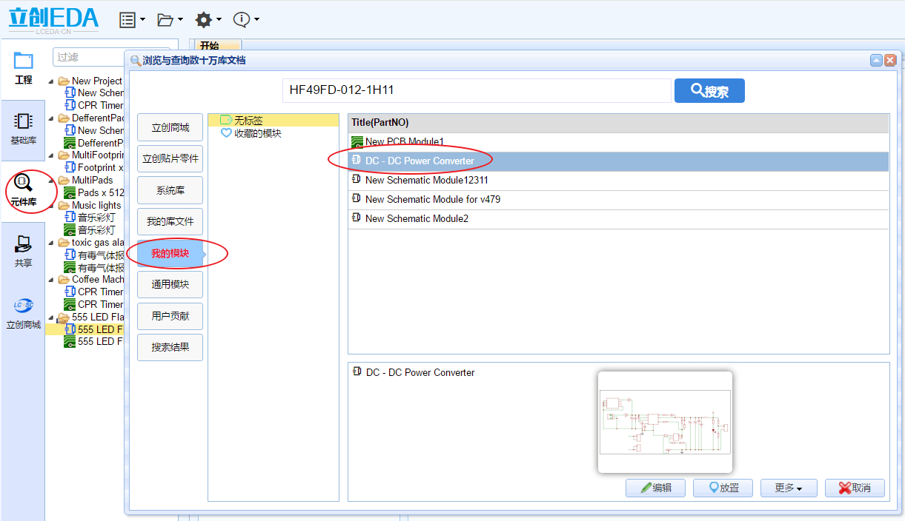  

## BOM与网表

立创EDA支持导出BOM表和网表，更多信息请查看 [导出](./Export.htm#导出)章节。

# 原理图库文件

如前面章节所说，可以使用“原理图库向导”和“组合/解散”功能创建一个原理图库符号，创建后如果要在其他的原理图文档中使用该符号，可对它进行复制(快捷键CTRL + C)，切换文档后粘贴(快捷键CTRL + SHIFT + V)。但这两种方法创建的库文件不会保存在“我的库文件”中，所以需要保存在“我的库文件”中时，可创建一个原理图库文件。

新建方法：**文档 > 新建 > 原理图库**。

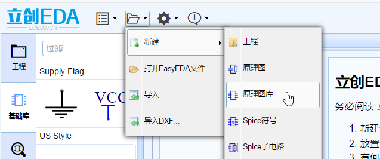

填写相关信息后，会打开一个空白库文件。此时你可以使用前面的“原理图库向导”或者使用“绘图工具”进行绘制图形，在工具栏上点击引脚图标进行放置引脚(快捷键 P )。在原理图库文档中已无需“组合/解散”功能，故立创EDA没有提供在绘图工具上。

若需要修改原理图符号的引脚映射，你可以在：**超级菜单 > 杂项 > 引脚映射** 中打开。

**注意：**

-	*建议在新建一个原理图库之前，先在“元件库”中搜索，可避免重复工作，或者可以在相近元件的库文件上直接编辑另存为一个新的库文件，以减少工作量。*
-	*符号图形请在原点上创建，尽量保持原点在元件中央，以便于元件翻转和旋转操作，元件放置在原理图画布时鼠标光标的位置就是原点的位置。若你偏离原点创建，在放置的时候，编辑器会自动将鼠标光标移动在元件中心处。*

## 管脚属性

原理图符号的引脚是元件最重要的组成部分之一，它允许进行导线连接以构成整个电路。

在工具栏点击使用或者使用默认快捷键“P”。

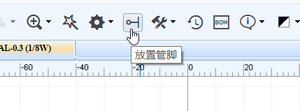

**管脚方向**

在放置在画布上之前，可以按空格键进行选择到想要的方向。

管脚的带圆圈端点是可进行导线连接的地方，所以该点正常需朝外放置。

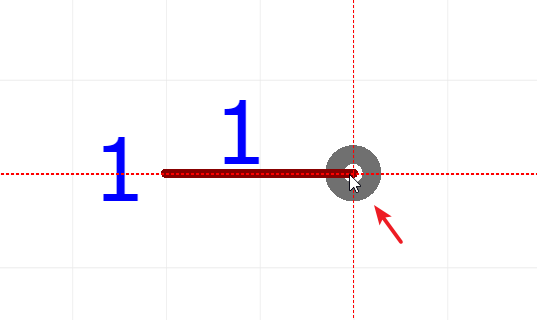

如下图，左边图片是元件管脚的正确放置方式。

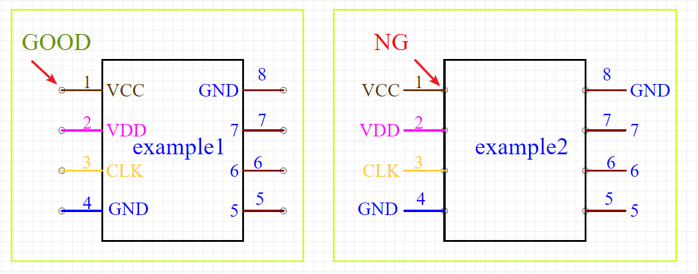

**管脚属性**

当你选中一个管脚时，可以在右边的属性面板查看和修改它的属性。

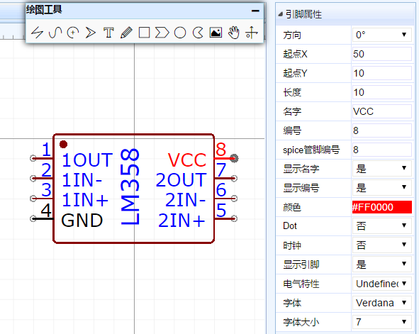

-	**方向**：只支持 0°、90°、180° 和 270°。若你需要放置45°的引脚，你需要将引脚长度改为0，然后用画图工具画出45°线段。

-	**起始X，起始Y**：引脚端点的坐标。你可编辑它的坐标到达你想要的位置。

-	**长度**：引脚长度。

-	**名字**：引脚的名字，如上图选中的引脚名字为“VCC”。

-	**编号**：如上图选中的引脚编号为“8”。该编号与元件对应的封装的引脚编号相对应，并且两者的编号需要一致。你还可以使用带字母的编号，如 A1, B1, C1, A2, B2等。

-	**Spice管脚编号**： 这些序号是将原理图符号上的引脚映射到Spice仿真或子电路中对应功能的编号。

-	**显示名字**：可选择是否隐藏管脚名称。

-	**显示编号**：可选择是否隐藏管脚编号。

-	**颜色**：你可以单独为管脚设置颜色，该颜色会共同应用在管脚名字和编号上。你不能单独为它们进行设置颜色。

-	**Dot**：是否将一个圆添加到管脚的内端，以表示逻辑(或模拟)反相。

-	**时种**： 是否将一个“>”添加到管脚的内端，以表示逻辑时钟输入。

-	**显示引脚**：可设置改引脚是否隐藏。当隐藏了该引脚后，放置该元件在原理图中将看不见该引脚。该隐藏功能只在原理图中体现，在原理图库编辑界面下一直保持显示状态。  
若在原理图想将它显示，只需在元件属性中“修改器件”将“隐藏的引脚”选项取消勾选即可。  
若你设置一个引脚的电气特性为Power，名称设置为VCC，且已将它隐藏，那么在原理图中它会自动与VCC电源(网络标签)连接，该功能可以让使用了多模块元件的原理图变得更加整洁清晰。

-	**电气特性**：包含Undefined(未定义)、 Input(信号输入)、Output(信号输出)、 I/O(信号输入/输出)、 Power(电源)。该功能在仿真时用。默认是Undefined。

-	**字体及大小**：你也可以很方便的每个管脚名字和编号设置字体与大小，便于识别。

**注意：**

-	*你可以很方便地使用鼠标对管脚编号和名字进行位置调整，但是当你需要翻转或旋转它们时，管脚整体都会被翻转或旋转，立创EDA不允许单独翻转其中一个。*
-	*立创EDA已经提供电气规则检查 (ERC)，但是你仍然需要为你的元件库文件设置电气特性。*

##自定义属性

在原理图库画布中，点击空白处可在右边属性面板查看元件属性，此处的元件属性与在原理图中单击元件时的元件自定义属性基本一致。在原理图中对元件修改的自定义属性仅对所在文档有效，在原理图库画布中设置的自定义属性对该元件的每次放置有效。

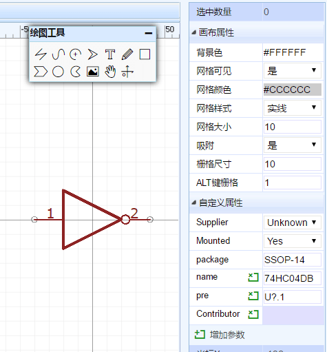

-	**Supplier**：供应商名称，新建默认为Unknown。修改为其他供应商后，会自动出现供应商编号输入框。

-	**Mounted**：是指该零件是否在PCB板上贴片或者插件，该处在BOM体现。

-	**Package**：击输入框，即可弹出封装管理器。并为元件库文件指定封装。

-	**Prefix**：默认的原理图库符号前缀是 **U?** ，子库符号前缀是 **U?.1**。如果你创建了一个电阻你可以设置为 **R?**。

-	**Name**：元件库文件的名称。

-	**Contributor**：显示你用户名，立创EDA使用了你的库文件时会看到你的名字。

-	**增加参数**：可新增你想要的参数，如你自己的物料编号。是否包含在BOM。

## 我的库文件

编辑完成后保存 `CTRL+S` 会打开一个对话框，以输入元件名称和描述：

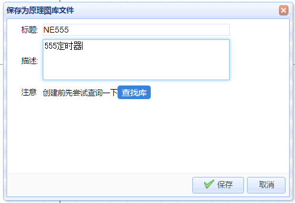

点击确认后，你可以在左边导航面板“元件库”> "我的库文件" > “无标签”中找到它。
  

**标签**

你可以选中它，点击右键“修改”或者右下角“更多”> "修改" 为它添加一个标签。添加后可以在原理图库列表下出现，该元件将出现在该标签下，你可以给一个元件添加多个标签，但建议只添加一个即可。

若你需要再次修改符号，你需要点击下面的“编辑”按钮。

关于元件库的功能更多请查阅前面的[原理图绘制：元件库搜索与放置](./Schematic.htm#元件库搜索与放置)章节。

## 元件子库

当一个元件存在太多引脚时，把它全部画在一个库文件中将会非常耗费空间，所以可以通过创建子库来进行多模块组合该元件。所有子库合在一起时是一个完整的元件。每个子库均对应同一个封装，仅对应的焊盘编号不一样。  

在前面“原理图绘制：元件库搜索与放置”章节已经提到元件子库的放置。

当你创建了一个库文件，在“元件库” > “我的库文件”中选中新建的库文件，点击右键“添加子库”即可依次添加子库

如下图，每次添加子库均会产生一个名称带 .1 ，.2，.3 等的子库文件。

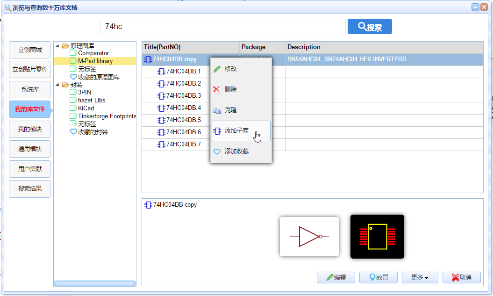

添加后并对每个子库进行双击或者点击下方的“编辑”按钮进行编辑图形，引脚及编号等属性，保存后即可完成一个含子库的原理图库文件的创建。

**注意**：*含子库的元件仅在父库指定一个封装即可，若你为每一个子库均指定不同的封装，那么立创EDA将保留最后一个指定的封装做为元件的封装。*

# PCB编辑器 

新建PCB编辑器有两种方式。  

-	前面章节中通过原理图转为PCB。
-	在“文档”>“新建”> “PCB”新建打开。

正常来说，在绘制PCB前，需要先设置PCB板子边框和设计规则。边框和设计规则请查阅后面章节。

## 画布 

**画布属性**

PCB画布属性和原理图画布属性大部分一致。点击PCB空白处在右边面板可以修改画布的尺寸单位，网格等。目前支持mm，inch，mil三种单位，精度至小数点后两位。

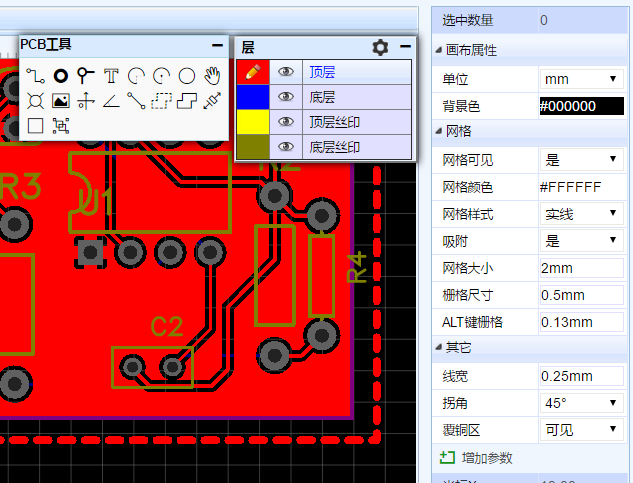

PCB中大部分对象，在选中它后，基本都可以在右边属性面板查看和修改它的属性。

**其他**

-	**线宽：**这里设置默认布线线宽。
-	**拐角：**设置默认布线的拐角方向。有：45°，90°，圆弧，任意角度。
-	**覆铜区：**这里可设置铺铜区域是否可见。选择否之后铺铜将消失，仅保留铺铜的边框。
-	**增加参数：**该参数仅对PCB画布用，可以做信息标记，不会应用到BOM和Netlist中。

## PCB工具

PCB工具提供很多功能以满足你绘制PCB的需求。  
有导线，焊盘，过孔，文本，圆弧，圆，拖动，通孔，图片，画布原点，量角器，连接焊盘，覆铜，实心填充，尺寸，矩形，组合/解散。

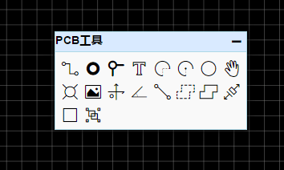

### 导线 

在原理图中使用快捷键“W”绘制导线，在PCB绘制导线的快捷键也是“W”。

**导线属性**

当你选中一条导线时，可以在右边属性面板修改它对应的属性。  
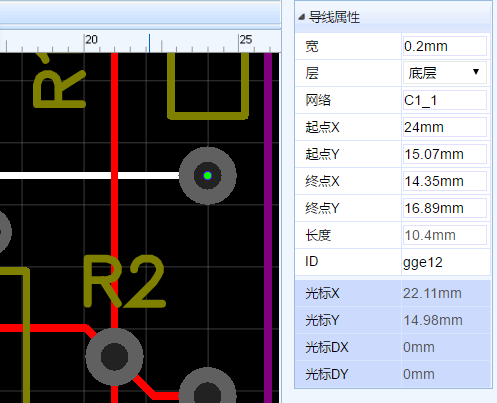  

**使用技巧**

1.  单击左键开始绘制导线；再次单击左键确认布线；单击右键取消布线；再次点击右键提出绘制导线模式。

2.  在顶层绘制导线的同时，使用切换至底层的快捷键“B”，可自动添加设置的过孔，走线并自动切换至底层继续布线。
   

3.  在布线过程中使用快捷键“+”，“ - ”可以很方便地调节当前的走线的大小。

4.  双击导线线段会增加一个节点，选择节点拖动可以调节走线角度。也可以通过拖动导线的末端端点将导线拉长或缩短。
  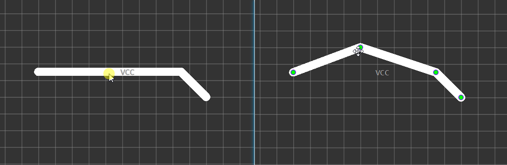

5.  点击选择一个线段，可以拖动调整其位置。  
  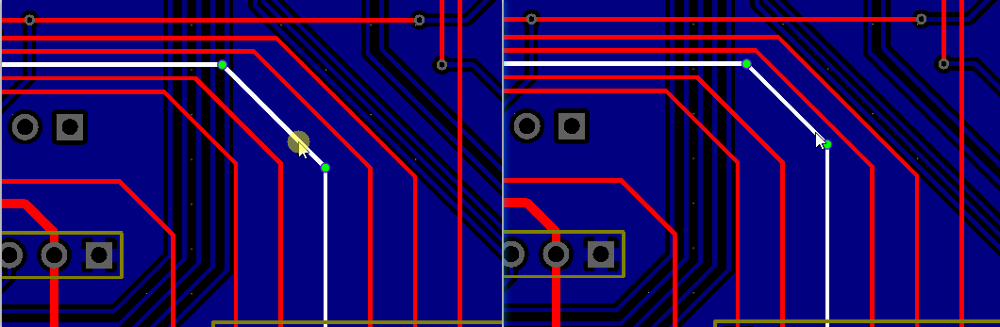

6.  在布线过程中可以使用快捷键“L”进行布线角度切换。
  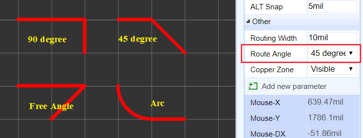

7.  使用空格键改变当前布线的方向。
  

8. 在走线过程中，想撤销上一段走线可以通过删除键“Delete”撤销。

9. 当按住“Shift”键并双击左键可以删除导线的线段。
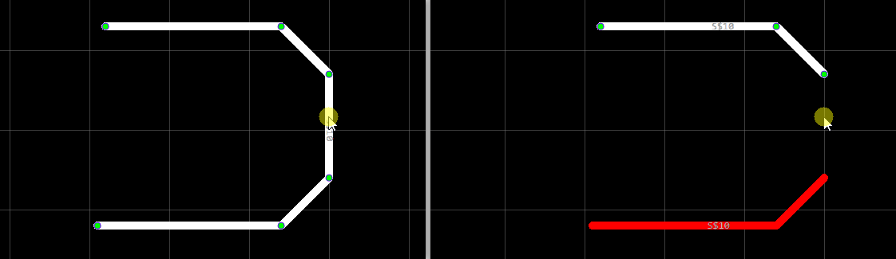

### 焊盘 

放置焊盘的快捷键是“P”。
当你选中一个焊盘时，可以在右边属性面板修改它对应的属性。  

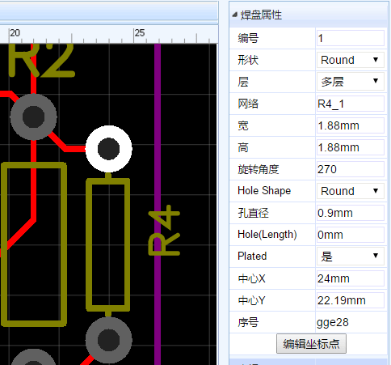

**编号：**若不是单独放置的焊盘，该编号会与原理图库文件的引脚编号相对应。  

**形状：** Round(圆形) , Rectangular(矩形) ,  Oval(椭圆形)和Polygon(多边形)。 如下图所示，选择多边形可以通过“编辑坐标点”创建复杂的形状。  
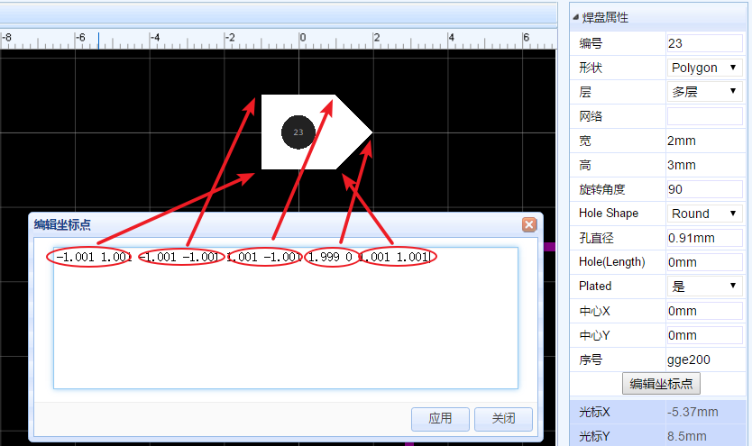 

**层：**如果放置的焊盘是SMD类型或想它出现在单层，那么层请选择顶层或底层；若需要放置通孔类型焊盘，那么层请选择全部，焊盘将在顶层和底层出现。  

**网络：**如果PCB由原理图转来，此处会默认生成网络；若是单独放置的焊盘，此处为空。你可以无需为它设置网络，当走线连接到它时，将自动为它添加网络。  

**宽和高：** 当图形设置为圆时，宽和高会等值；当图形设置为多边形时，宽和高将不允许编辑。

**旋转角度：**你可以设置你想要的任意角度。

**Hole Shape：**内孔形状。有Round(圆形)，Slot(槽形)。普通的DIP封装以及电容等都是圆形钻孔，但某些特殊元件的安装脚需要长方形、椭圆形或其他类型的通孔。这些长方形、椭圆形或者其他类型通孔都算作槽孔。

**孔直径：**这是通孔焊盘的钻孔直径， 若是SMD类型焊盘请设置为0。

**中心X和中心Y：**修改这两处数值可以修改焊盘在画布中的位置。

**Plated：** 该焊盘是否有铜。当使用焊盘制作一个螺丝无铜通孔时，需选择否。

**注意：***编辑坐标点仅在图形为Polygon(多边形)时有效；第一个坐标点在左下角，数值为X Y，单位跟随画布。*

### 过孔

当你绘制一个双层板或多层板时你可以放置过孔，使顶层和底层导通。

**使用技巧**  

在走线上放置两个过孔，然后就可以将两个过孔间的走线切换至其他层，或者移除。

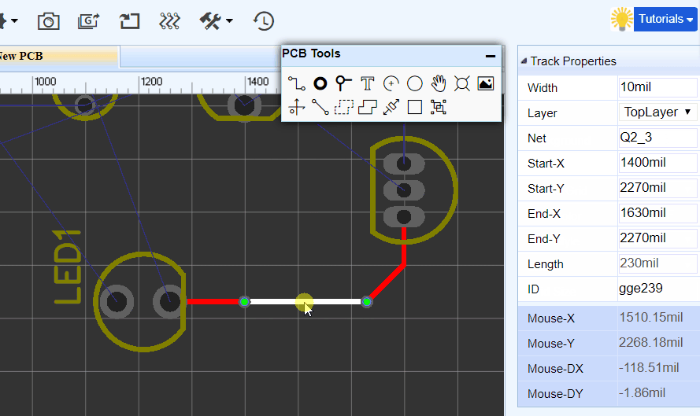

**注意：***立创EDA不支持内层填埋孔，所有的过孔均可以在顶层和底层看见。*

### 文本

因涉及字体版权，立创EDA暂时不支持自带其他的字体。
如果你需要输入汉字，或者需要不同的字体，你需要自行添加你电脑上的字体。免费字体可以在 [Free Fonts: www.1001freefonts.com](http://www.1001freefonts.com/) 上查找。

**添加方法**

放置一个文本，并点击它，然后在右边属性面板字体处添加字体。  
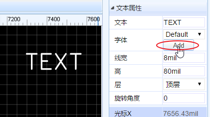  

点击“Add”按钮，并在打开窗口选择你电脑本地的字体文件后确认即可添加完成。字体文件必须是 `ttf` 或者 `otf`格式。
  

**注意：** 

-	*立创EDA不会保存你的字体在服务器，所以每当你关闭编辑器后再打开，你必须重新添加字体。*
-	*如果你使用的是自添加的字体，字体属性中的宽度设置将无效，你只能修改字体的高度。*

### 圆弧

你可以使用圆弧工具画出不同大小的圆弧，创建布局酷炫的走线图案。可通过两个圆弧合并成一个圆。

  

立创EDA提供了两种画圆弧的工具：

-	先确定起始点，然后确定末点及半径。  
  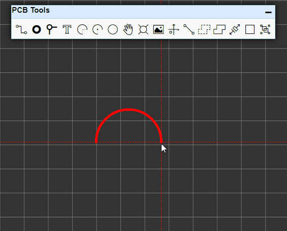

-	先确定圆心，然后确定半径及起点，再确定末点。   
  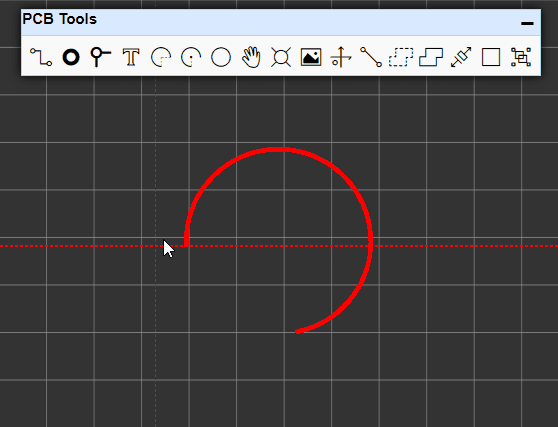

**圆弧属性**

点击圆弧后可在右边面板进行属性修改。  
**层**：使用圆弧工具画的圆弧可更换多个层。有：顶层，底层，顶层丝印层，底层丝印层，边框层，文档层。
  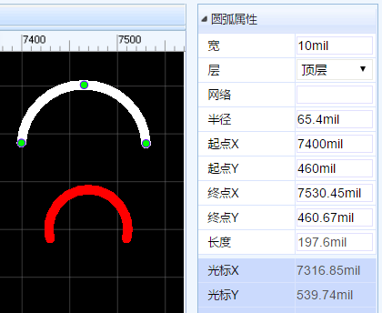

### 圆

在PCB工具里面提供的圆工具所画的圆，只能支持在丝印层和文档层绘制，如果你想在顶层或底层绘制一个圆，你必须使用圆弧工具绘制。   
   

### 移动

该功能与原理图工具的移动几乎一致。  
   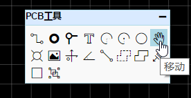

当使用该工具移动封装时，连接的走线会与其他封装分离并跟随移动，表现与直接鼠标批量选择后移动一致。

其他关于封装移动的提示：

-	当单选一个封装时，用鼠标移动，走线会拉伸跟随，不会分离；
-	当单选一个封装时，用方向键移动，走线会与封装分离，仅移动封装。

### 通孔

由于很多用户不知道如何通过焊盘，过孔来创建通孔，故立创EDA特意提供了一个通孔功能。可在属性设置其直径大小。
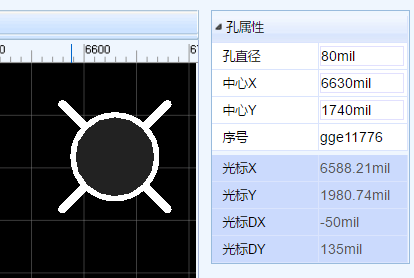

### 图片  

在PCB和PCB库画布下，立创EDA支持添加图片。

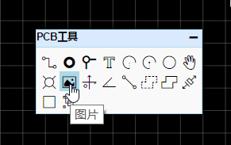

点击插入图片功能，会打开一个窗口，你可以添加你需要的图片，立创EDA支持 `JPG`, `BMP`, `PNG`, `GIF`, 和`SVG`格式的图片。  
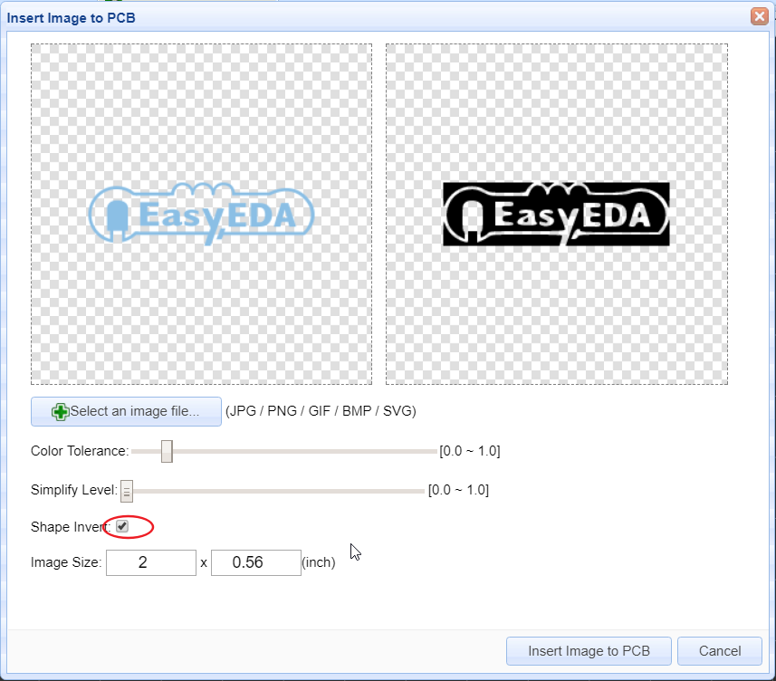  

添加图片后，可以：

-	预览图片：左边为原图预览，右边为调整后的图片效果预览。
-	颜色容差：数值越大，图像会损失越大。
-	简化级别：数值越大，图像边沿会更圆润。
-	图像反转：选择后，原本高亮区域会被挖图。
-	图片尺寸：设置你要插入的大小。

图片会插入在当前编辑的层，如果需要换层或修改其他属性，可以点击它后在属性处修改。
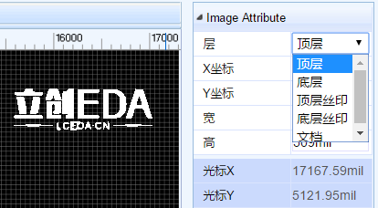  

### 画布原点

你可以设置画布原点以满足定位要求。该功能与原理图的画布原点功能一致。

### 量角器

立创EDA提供一个量角器方便位置确定。
点击后先确定圆点，再确认长度，最后确认角度。  
选中它后，可修改其属性。其中层支持顶层丝印，底层丝印和文档层；精度最高支持小数点后两位。
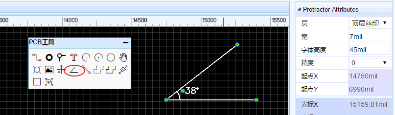

### 连接焊盘

当创建一个无原理图的PCB时，焊盘之间由于没有网络，所以不会出现飞线。使用“连接焊盘”功能可以使它们连接起来，帮助你减少出错。 

点击后，你点击两个无网络的焊盘，即可自动为它们设置相同网络名，并产生飞线：

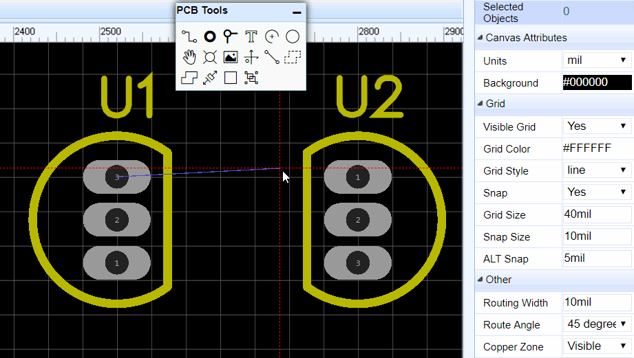  

或者你也可以直接为两个焊盘分别设置相同的网络，飞线会自动产生：

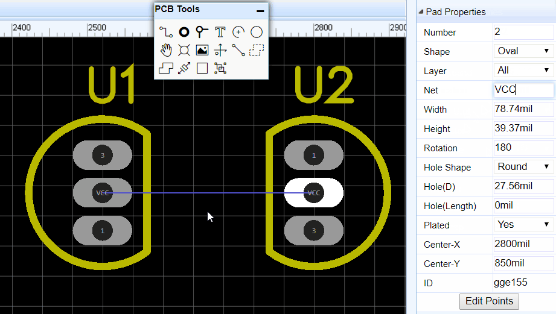  

更多关于飞线的信息，请查阅 [**飞线**](./PCB.htm#飞线) 章节

### 覆铜 

如果你想保留整块铜箔区域使其接地或者接电源，你可以使用“覆铜”功能。  
点击后可以围绕你想铺铜的区域绘制铺铜区，一般沿着板子边框或在板子边框外部绘制，顶层和底层需要分别绘制。一块板子可以绘制多个铺铜区，并分别设置。

选中铺铜线框，可以在右边修改其属性。

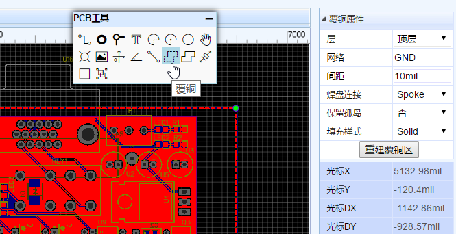

**层：** 可以修改铺铜区的层：顶层、底层、内层1、内层2、内层3、内层4。

**网络：** 设置铜箔所连接的网络。

**间距：** 铺铜区距离走线和焊盘的间隙。

**焊盘连接：**焊盘与铺铜的连接样式，直接连接还是十字连接。

**保留孤岛：**是或否。即是否去除死铜。若铺铜没有设置网络，那么整块铺铜都将被视为死铜而去除，若想保留铺铜，可选择保留孤岛或为铺铜设置网络。

**填充样式：** Solid(实心填充)和None(无)。选择None可以使PCB更清晰，并且PCB成品将无铜箔，只有走线和焊盘。

**重建覆铜区：**若你对PCB做了修改，或者铺铜属性做了修改，那么你可以不用重新绘制铺铜区，对其重建即可。

绘制铺铜后，建议不要将铺铜网络留空，否则很容易产生电磁干扰(EMC)和信号完整性(SI)问题。

**使用技巧**

-	使用快捷键 `Shift+B` 重建所有铺铜区。
-	使用快捷键 `Shift+M`  清除所有铺铜区。

### 实心填充

立创EDA提供了一个名叫实心填充的功能。  
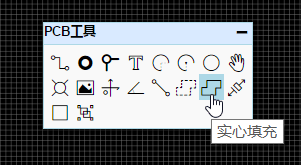

绘制后点击实心填充的区域可以在右边修改其属性。  
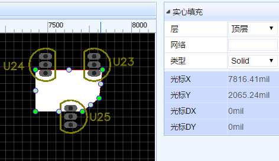

-	**层：**支持将实心填充切换至其他层：顶层，底层，顶层丝印，底层丝印，文档，NPTH。
-	**网络：**在顶层和底层时，可以对其设置网络使其具有电气特性。
-	**类型：**Solid(实心填充)，NPTH(Non Plated Through Hole：非镀铜通孔)，Cutout(挖空)。
	-	**Solid**：通过设置网络且类型为Solid，可以很容易将多个焊盘连接起来，效果与前面的铺铜类似。

	-	**NPTH**：当设置实心填充类型为NPTH时，其所属的层也会自动切换至NPTH。实际PCB生产时会将此区域挖穿(非镀铜通孔)。铺铜后效果与照片预览效果如下图所示。
	-	**Cutout**：该类型仅将铺铜区的铜箔挖空，铺铜不再对该区域铺铜。铺铜后效果与照片预览效果如下图所示。
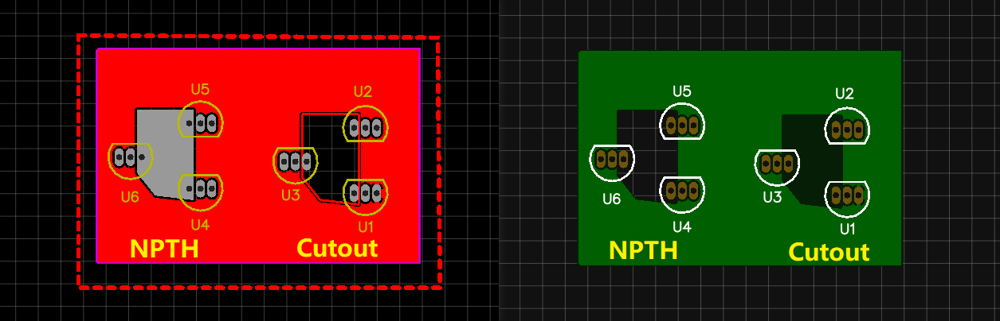

### 尺寸与量测 

尺寸标识与距离测量对于PCB和封装库来说非常重要，立创EDA提供了两种方法。

1. **尺寸工具：**该工具有三种单位，跟随画布单位设置。
   当你选中尺寸的末端端点，你可以对其进行拉伸和缩小。并可以对其属性进行设置。   
  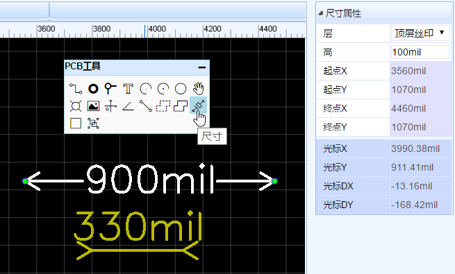

2.  **量测工具：**使用快捷键“M”或者通过 **超级菜单 > 杂项 > 量测距离**，然后点击你想量测的两个点。单位跟随画布单位设置。
  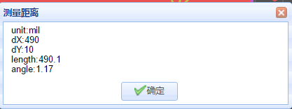

### 矩形

矩形工具与实心填充很相似，但是矩形不能设置网络，不能设置为NPTH层，也不能设置类型。
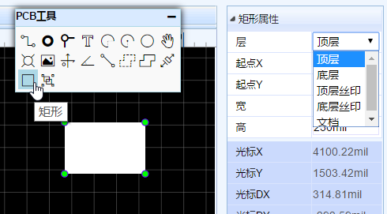

### 组合与解散

与原理图的组合/解散功能类似，原理图的是对原理图库符号作用，PCB的是对封装起作用。
使用方法原理图的组合/解散功能一致。

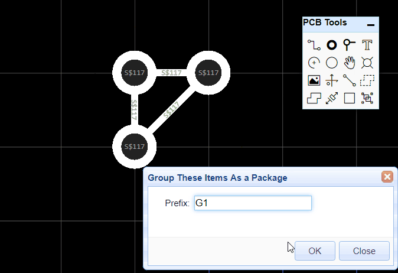

## 层工具 

PCB设计会经常使用层工具，它可以随意拖动位置，用来展示当前活动层。在这里对不同层进行切换编辑。  
点击层对应的眼睛图标可以使其是否显示该层；点击层的颜色标识区，使铅笔图标切换至对应层，表示该层已进入编辑状态，可进行布线等操作。

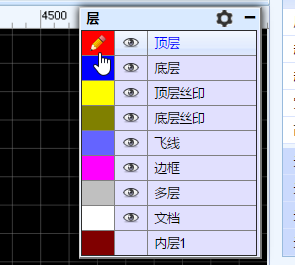

切换层的快捷键如下：

-	**T：** 切换至顶层 
-	**B：** 切换至底层
-	**1：** 切换至内层1  
-	**2：** 切换至内层2
-	**3：** 切换至内层3
-	**4：** 切换至内层4

**层配置**

点击层工具右上角的齿轮图标，或者通过 **超级菜单 > 杂项 > 层配置** 打开设置界面。

在配置界面，你可以修改层的显示颜色，可以勾选你需要使用的层，如果你需要画多层板，可以将最多4个内层勾选。如果你需要更多层，请联系立创EDA。

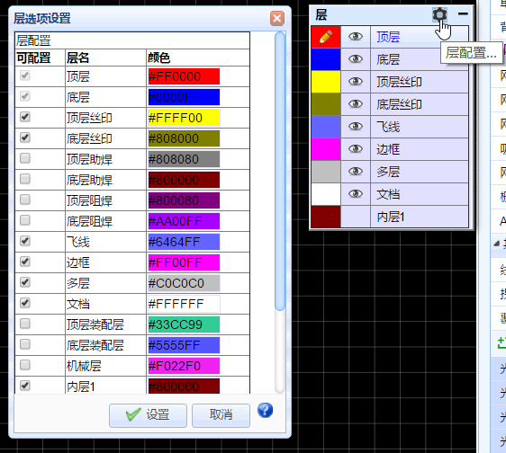

## 边框

在放置封装前，需要先绘制板子边框。边框需在“边框层”绘制。先切换至“边框层”，再使用导线或圆弧进行绘制。
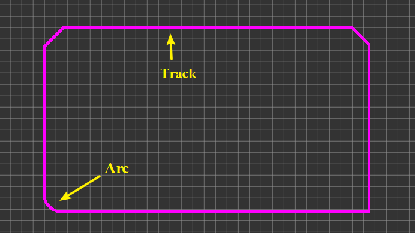

当使用原理图转PCB时，立创EDA会自动生成一个边框，该边框内面积大小是总封装面积的1.5倍。
若你不喜欢该边框，你可以将它删除后自己重新绘制。  工具栏上的“全局删除”功能可以进行快速删边框。  
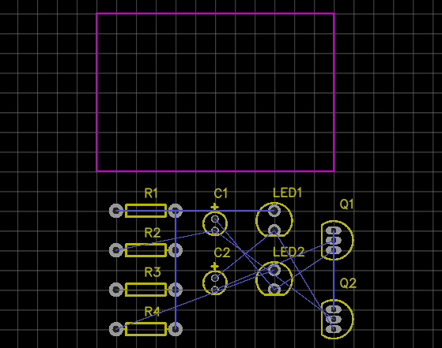

立创EDA提供了一个边框设置向导，通过它可以很方便的设置边框。
可通过：**超级菜单 > 杂项 > 边框设置** 或者在工具栏的“工具”图标下“边框设置”。

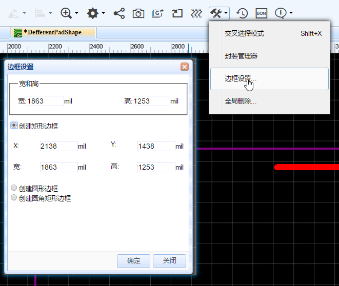

在对话框里你可以选择3中类型的边框：矩形，圆形，圆角矩形。并设置对应参数。

如果你需要创建一个复杂的边框，你可以通过导入一个DXF文件生成。DXF可以由CAD等软件进行绘制生成。

## 飞线

当两个封装的焊盘网络相同时，会出现飞线，表示这两个焊盘可以通过导线连接。

如果你想关闭某条网络的飞线，你可以在设计管理器中将该网络的勾去掉；如果你把勾去掉后仍然对它进行布线，那么走线将不会显示出来，仅会显示网络名称在走线的路径上。

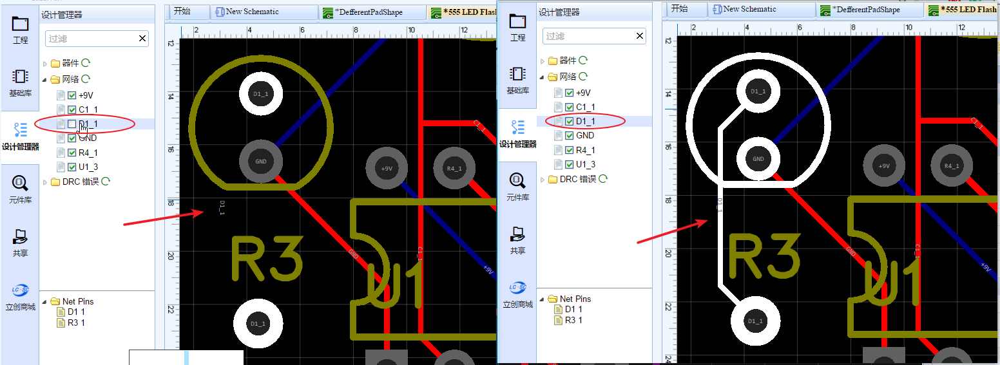

基于该技巧，你可以在布线前将GND网络去掉，在后面铺铜时再打开，可以减少飞线的干扰。

如果你想高亮飞线的颜色，你可以切换至飞线层；如果你想改变飞线的颜色，你可以在层配置里面进行修改。

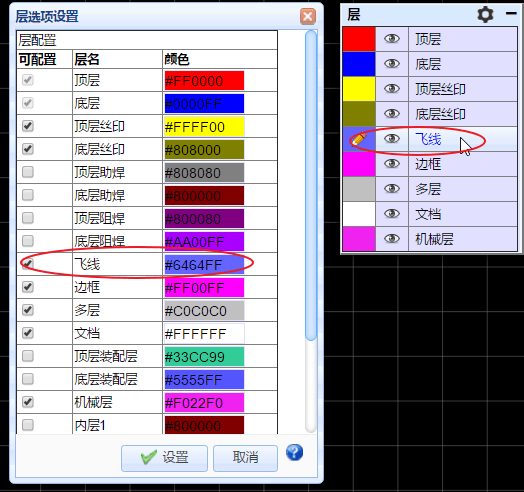

## PCB网络

**显示网络名称**

编辑器支持在走线和焊盘上显示当前的网络名称，如果想关闭，可以通过：**超级菜单 > 查看 > PCB网络可见**，或者在工具栏上“配置”功能里“PCB网络可见”，也可以使用快捷键“Q”。

**网络长度**

当你选中一条走线，再使用快捷键“H”， 编辑器会高亮整条网络并弹窗提醒走线的总长度。
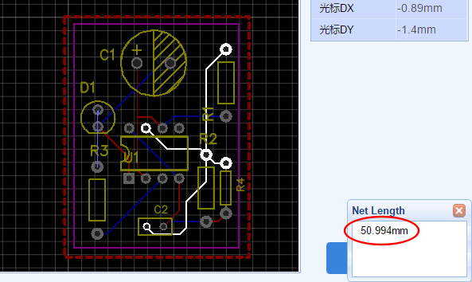

## 封装属性 

当你鼠标经过封装时，封装整体高亮后点击即可选中整个封装，可在右边属性面板对其属性进行查看与修改。

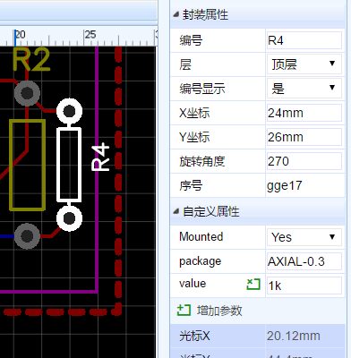

-	**编号：**与原理图的编号相对应。  
-	**层：**含顶层和底层，切换后封装将切换至对应层。当切换至底层，封装会镜像显示，因为在立创EDA下绘制底层是以顶视图绘制。  
-	**X左坐标和Y坐标：**可修改封装坐标。  
-	**旋转角度：** 旋转角度以封装自身原点旋转。
-	**序号：**立创EDA会自动为每一个对象分配一个序号，做文件保存时的标识，你无法对其修改。  

**自定义属性**

这个与原理图符号的自定义属性基本一致，无原理图PCB封装添加参数后，选择In BOM可在BOM中体现。

**批量修改封装属性**

立创EDA目前允许部分对象批量选择后修改属性。使用“CTRL”+ 鼠标点选进行批量选择。
如选择了3条不同的走线后，可在右边修改它们的宽度，层，网络。

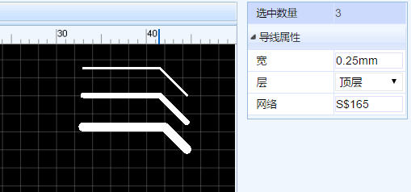

其他可修改的对象有：焊盘，过孔和文本等。

## 绘制无原理图PCB 

在一些小PCB制作，你可能并不需要绘制原理图。 立创EDA允许你直接进行PCB绘制。

新建一个PCB文档后，在坐边导航面板的**“元件库”**中搜索和放置你所需要的封装。可对每个封装添加自定义属性，以便于导出BOM表。

之后你可以根据前面叙述的连接焊盘功能将网络连接起来，再进行导线和其他绘制。

## 设计管理器 

PCB的设计管理器与原理图的设计管理器一样，在左边导航面板找到；也可以通过快捷键“CTRL + D”切换至设计管理器。

在PCB设计管理器下，你可以：

-	选中一个封装并使它在画布中高亮。

-	勾选或不勾选可以使封装显示或隐藏。

-	在筛选器搜索你想要的器件或网络。

-	选中一个网络后，可以高亮全部与它连接的走线，过孔和焊盘。

-	勾选或不勾选一个网络可以使整个网络(包含导线)显示或隐藏。

-	双击一个网络名可以将它的所有导线连接删除，以便重新绘制走线。

-	查看PCB的DRC错误信息列表。

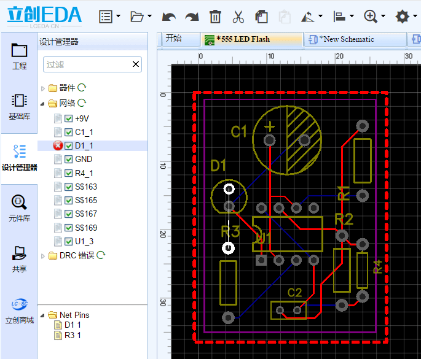

## 导入变更 

当你修改了原理图，你可以很方便地导入变更。

-	1、可使用原理图的“[更新PCB](./Schematic.htm#更新PCB)”功能。

-	2、直接在打开PCB导入更新。**超级菜单 > 杂项 > 导入修改信息**，或者点击工具栏的导入变更图标。

如果原理图存在错误，会直接弹窗提醒，如标注重复，封装缺失等。  
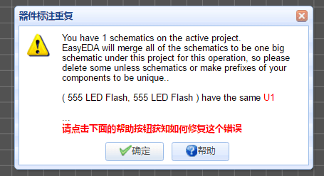

若无问题将弹出确认对话框：  
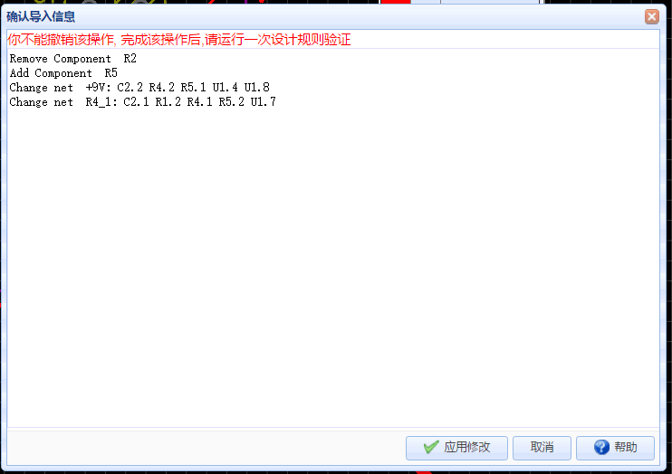

若确认无问题点击“应用修改”即可更新PCB。

**注意：**

-	*网络名是自动生成，当你修改了原理图后部分网络可能会出现变更，那么更新至PCB后会导致原网络走线丢失！*
-	*导入变更后你将无法撤销！*

## 无效封装

有时候当你转原理图至PCB时可能会提示无效封装。这是因为封装的焊盘编号与原理图库文件的PCB引脚编号不一致导致的。

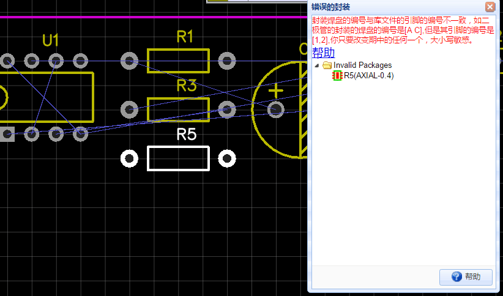

如上图的R5，在原理图中R5的PCB引脚编号是A，B：
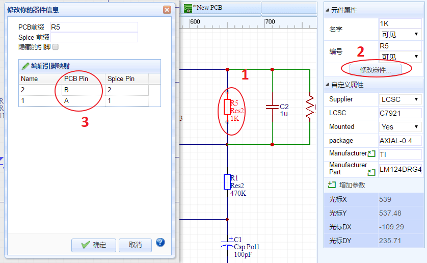

在PCB中，R5的焊盘编号分别是1，2。故无法与A，B对应，导致无网络生成。
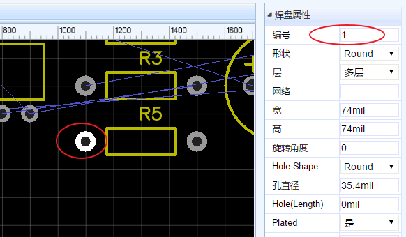

为了解决这个问题，你可以：

-	修改原理图符号。如上图原理图R5，直接编辑R5的PCB引脚编号分别为1、2，并更新PCB即可。

-	修改封装焊盘的编号。如上图封装R5，直接修改R5的焊盘编号分别为A，B即可。

## 设计规则检查

立创EDA提供一个可实时运行的设计规则检查(DRC: Design Rule Check)功能。

可在 **超级菜单 > 杂项 > 设计规则设置** 打开设置对话框。  设置里面的单位跟随当前画布的单位。
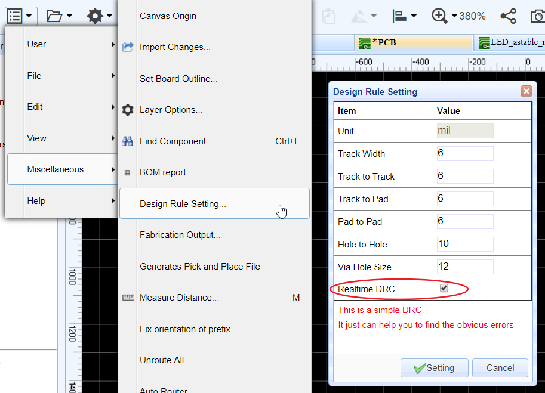   

当打开实时设计规则检测功能，在你设计出现超出规则的错误时会直接出现高亮的X标识提示错误位置。如下图的走线间，和走线到焊盘间太近导致出现错误标识。   
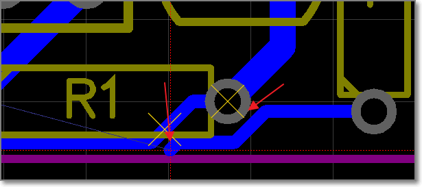

你可以在设计管理器中查看DRC错误信息。  点击错误选项会在画布中央高亮显示其位置。
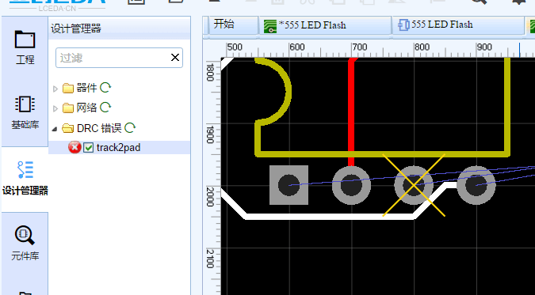

**注意：**

-	*当你直接通过原理图转为PCB时，实时DRC检查是开启的，但是之前的旧PCB文档是关闭的，你需要自行打开。*
-	*设计规则检查只能帮你发现部分很明显的错误。*

## 自动布线

当你设计一个简单的PCB板子时，或者设计要求不高希望自动布线时，那么你可以使用自动布线功能。在进行自动布线前，你需要设置PCB边框，并将封装放置在边框内。

在**超级菜单 > 杂项 > 自动布线**或者点击工具栏的自动布线图标，打开自动布线设置界面。  设置里面的单位跟随当前画布的单位。

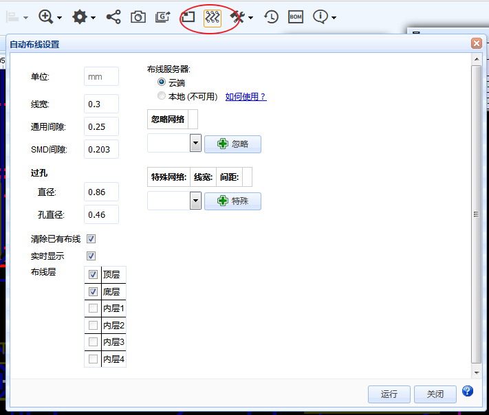

-	**线宽**：自动布线的默认线宽。  
-	**通用间隙**：指走线之间，走线与焊盘之间的间隙。  
-	**SMD间隙**：SMD焊盘之间的间隙。  
-	**过孔直径和孔直径**：过孔直径。  
-	**清除已有布线**：若你要保留你之前的布线，你不能勾选该项。  
-	**实时显示**：是否实时显示布线状态。  
-	**布线层**：选择你要布线的层数。你的PCB开启了内层后此处的内层才可以勾选。  
-	**布线服务器**：
	-	**云端**：使用立创EDA的服务器进行自动布线。
	-	**本地**：使用本地布自动线服务器，当你打开配置对话框时，编辑器会自动检测本地布线服务器是否可用，使用方法请看下面的说明。
-	**忽略网络**：选择无须自动布线的网络。若你的铺铜连接到GND，你可以选择忽略GND网络。  
-	**特殊网络**：允许设置特殊网络的线宽与线距。如加粗电源走线。  

**注意**：*设置的参数不能少于DRC设定值，否则将报错。*  
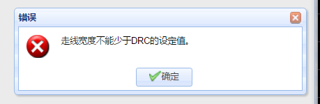

设置完毕后，点击运行即可进行自动布线。完成后如下图所示。
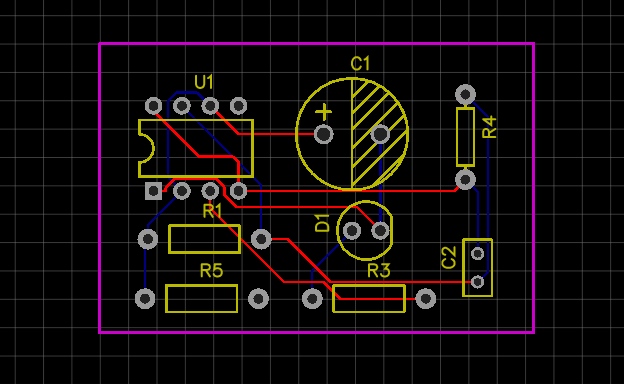 

### 本地自动布线

立创EDA建议用户使用本地布线服务器，当使用云端服务器时，如果使用人数较多，自动布线将会产生排队、布线失败等现象。

该版本需在windows7及以上的64位操作系统。下载地址：[EasyEDA Router.zip](https://lceda.cn/EasyEDA-Router.zip)。下载后解压至非系统文件夹。

在点击“自动布线”图标前，前请先配置浏览器和运行AutoRouter.bat。

**注意：***请务必使用最新版的谷歌浏览器或火狐浏览器！！！*

**1)Chrome谷歌浏览器**

如果你的本地自动布线无法使用，请检查是否已经使用了最新版的谷歌浏览器，需v60.0.3112.78及以上。

**2)Firefox火狐浏览器**

在地址栏输入"`about:config`"并按回车，搜索"`allowInsecure`"，找到 `network.websocket.allowInsecureFromHTTPS`，

然后双击它，使它的值变为"True"，然后重新打开火狐浏览器进行本地自动布线。

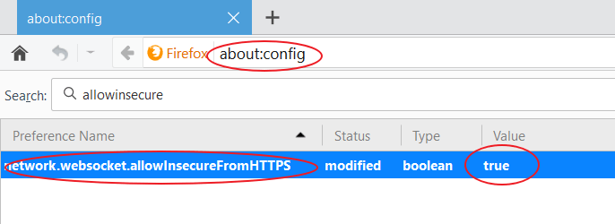

本地布线服务器可用时，对话框内有提示。点击“运行”后可以看到**AutoRouter.bat**的运行窗口提示如下：

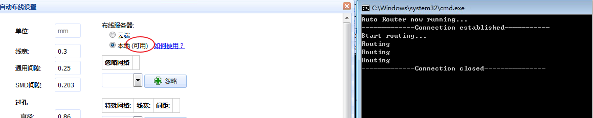

**提示：**

如果自动布线失败，你可以尝试以下操作：

-	忽略GND网络，并铺铜和设置铺铜网络为GND。
-	使用小的线宽和间隙，但要确保线宽大于6mil。
-	先将重要的网络进行手动布线。
-	添加更多的层。
-	自动布线耗费服务器CPU资源，使用人数多时会容易失败，请耐心等待。

建议使用手动布线，自动布线没有手动布线的工整和美观；手动布线可以锻炼布线能力提升经验；减轻立创EDA服务器负担。

## 照片预览

立创EDA暂未提供3D照片预览，但提供了2D照片预览。在PCB下，在工具栏点击打开。若该图标未出现，请重置工具栏图标：**齿轮图标  > 常用按钮设置 > 重置**。

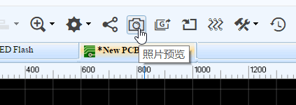

在切换至照片预览后，可在标签上方切换层，选择颜色等。

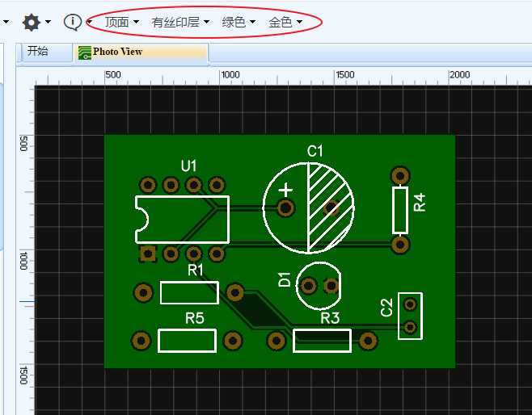

画布背景默认黑色含网格且属性面板隐藏，你可以在右边点击收缩按钮展开属性面板并设置属性。

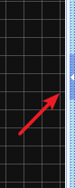

## 生成制造文件

当你完成PCB设计之后，你可以生成Gerber文件，通过：**超级菜单 > 杂项 > 生成制造文件**，或者点击工具栏上的生成制造文件图标：

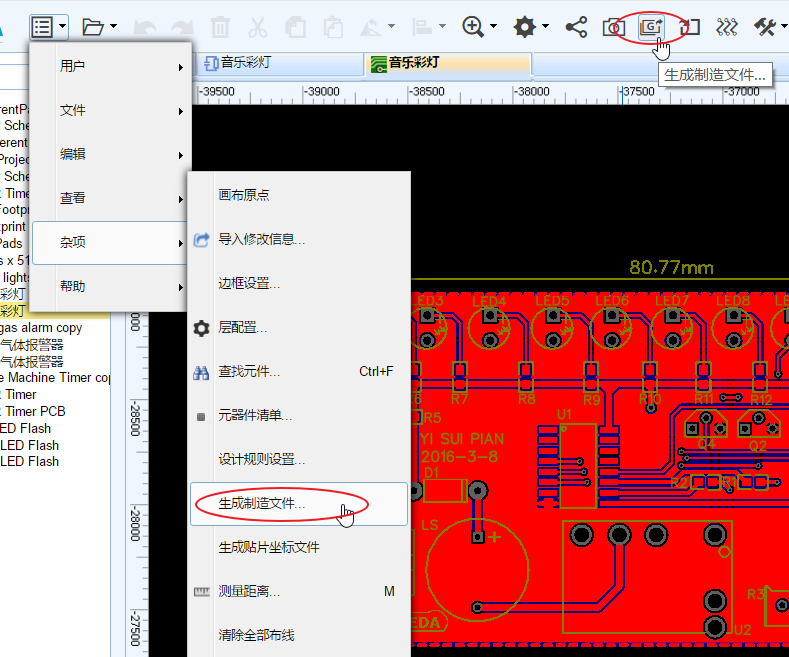

点击后会打开一个下载页面，点击下载即可。

如果你需要PCB打样，建议通过立创EDA的兄弟公司嘉立创：[www.sz-jlc.com](www.sz-jlc.com)

当然，你也可以将导出的Gerber文件发给任意一个厂家进行生产，立创EDA并没有做任何使用限制！！

# 创建PCB库

如果你需要一个PCB封装，但是立创EDA的元件库中不存在，那么你可以自行进行创建。

创建PCB库与创建原理图库几乎一致，你可以通过：**文档** > **新建** > **PCB库** 建立。

## PCB库工具

PCB库工具的使用方法与PCB下的PCB工具一致，只是工具栏内少一些不需要的功能。

放置焊盘及其编辑，请查阅[PCB：焊盘](./PCB.htm#焊盘)章节。

## 其他事项

1.  设置准确的网格和栅格尺寸很重要，一些精密的封装需要准确的尺寸，否则可能导致无法贴片。

2.  请保持所有封装的边框线框，和文字在顶层丝印层绘制。放置封装在PCB时，立创EDA会自动为封装的丝印切换至PCB对应的丝印层。

3.  按“CTRL+S”保存你的封装，然后你可以在左边导航栏的**“元件库”>“我的库文件”>“PCB库”**中找到它。

4.  焊盘和过孔不能太小，需保持圆圈 >= 4mil。  
  
  
 

# 导入 

立创EDA目前支持导入的电路设计文件有：

-   Altium Designer/Protel DXP ASCII格式的原理图/PCB
-   Eagle 原理图/PCB/库文件

你可以在 **文件 > 导入** 打开导入对话框。

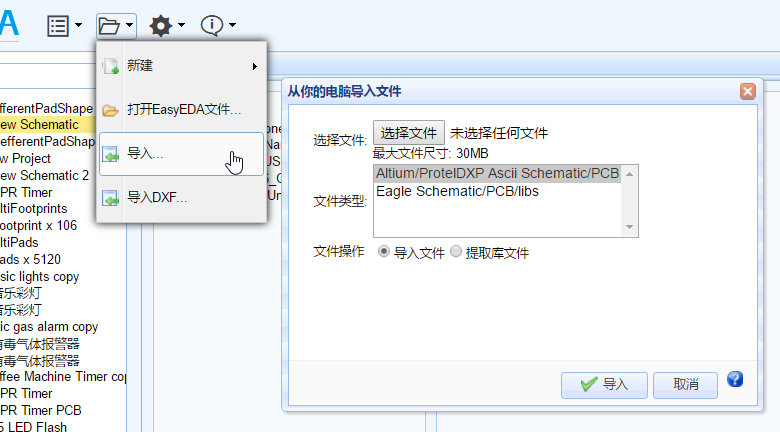

提取库文件功能只对Altium Designer原理图文件，PCB文件和Eagle库文件有效。

## 导入Altium Designer文件 

立创EDA仅支持以**ASCII格式**保存的原理图文件和PCB文件。所以你要导入的文件必须先保存为ASCII格式：

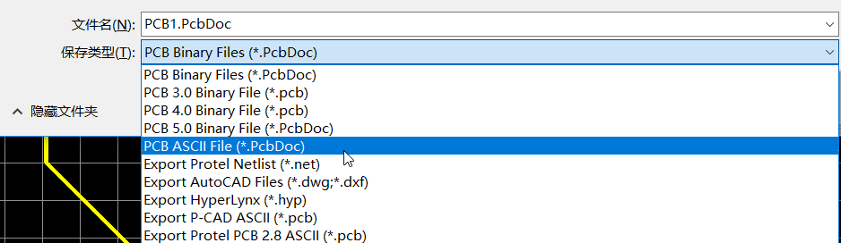

导入Altium Designer原理图文件，PCB文件效果已经非常出色，如下图：

如果是Protel 99se的文件，请先在AD打开再根据上面的方式保存，再导入。

Altium Designer原理图库文件，PCB库文件并不支持保存为 **ASCII**格式，所以立创EDA不支持直接导入Altium Designer的库文件。

你可以将需要的导入的库文件全部放在原理图或PCB中，再将原理图和PCB另存为ASCII格式，再导入时选择“提取库文件”即可将库文件全部提取。提取后可以直接放置在相应的画布上，也可以直接添加到个人库中。

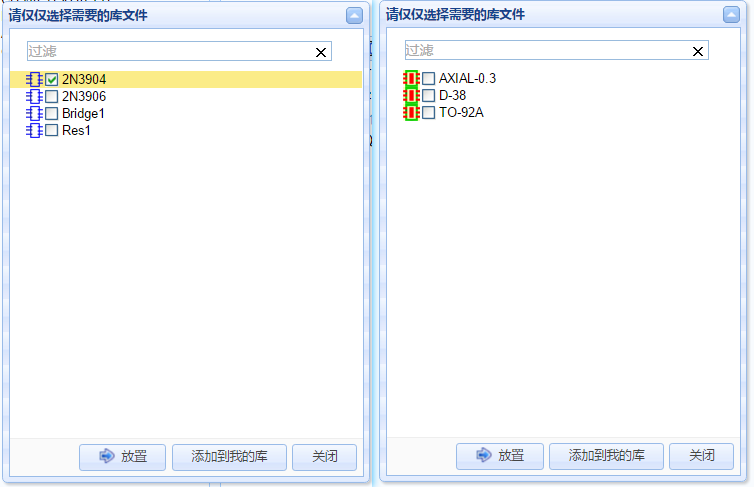

## 导入Eagle文件 

立创EDA支持Eagle文件导入，但是仅支持Eagle v6.0及以上版本的文件，因为Eagle从这些版本才开始采用**ASCII XML**结构的数据来保存本地文件。
除了原理图和PCB，还可以直接导入库文件。选择导入库文件时，编辑器会自动切换至提取库文件选项。

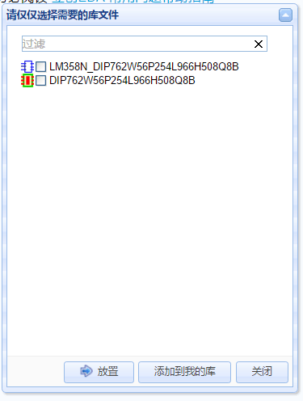
                    

## 导入DXF文件 

如果你需要设计及其复杂的边框，设计美观的图案，并且你有现有的素材并保存为DXF格式。那么你可以尝试使用导入DXF功能。

在**文档** > **导入DXF** 打开导入对话框：

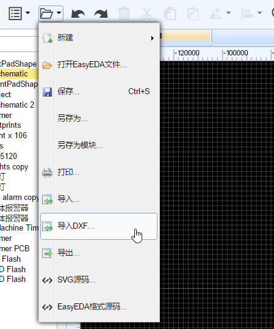 

选择了DXF文件后，会显现DXF文件预览：

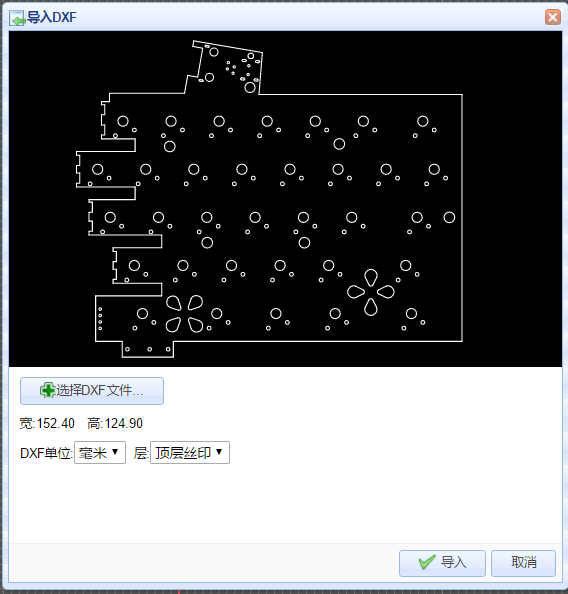

立创EDA提供四种单位：英寸inch、厘米cm、毫米mm、密耳mil。 并可选择需导入的层：顶层、底层、顶层丝印、底层丝印、边框、文档。

点击“导入”按钮后，即可在画布中出现。

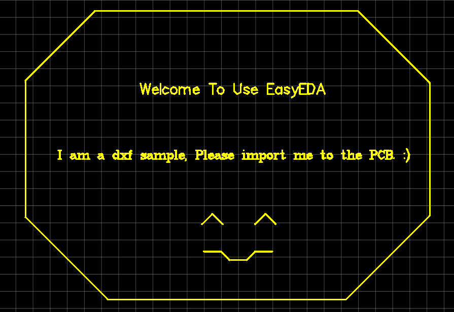

上图提供的DXF文件可以自行下载体验： [DXF边框范例](/Doc/Tutorial/Doc/test.dxf)  
 
**注意：**

-	*只支持在PCB文件导入DXF。*
-	*导入的DXF文件必须以 .dxf 为扩展名。*
-	*当你选择导入的层是边框时，圆圈会被转换为过孔。*
-	*会有一些细节项目无法完美支持。* 

# 导出 

立创EDA支持导出多种类型的文件，以便于满足你在多方面的需求。

## 导出原理图

### 用多文件格式导出原理图

导出原理图可通过点击：**文档 > 导出** 会打开以下对话框：

-	**导出选项：**可选择PDF，PNG，SVG文件。
-	**宽：** 该选项是指所导出图片的宽度，仅对导出PNG有效。默认为0，代表实际尺寸。数值越高代表导出的分辨率越高，比如你输入1024，那么导出PNG图片的宽度为1024像素，图片高则根据原理图自动调整。
-	**线宽增量：** 0代表实际尺寸。当你设置为1时，线宽会增大一倍。如下图，左边线宽为0，右边线宽为1.

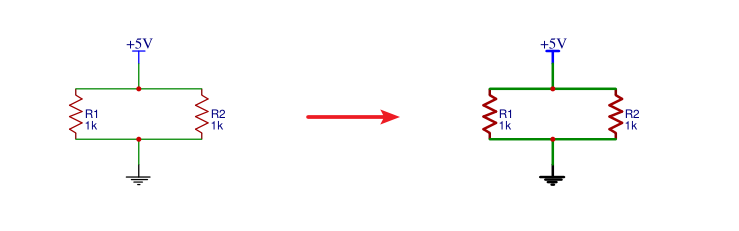

### 用Altium Designer格式导出原理图

导出Altium Designer格式原理图可通过点击：**文档 > 导出Altium...** 会打开以下对话框：

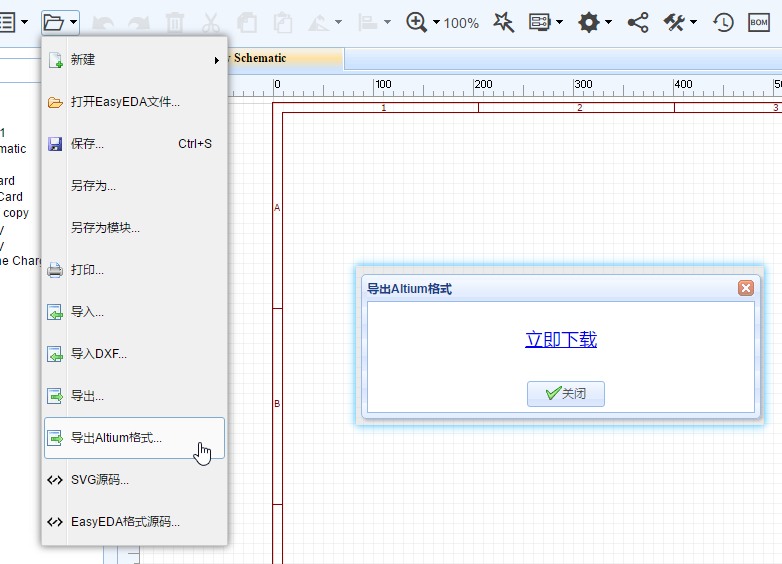

点击“立即下载”即可下载Altium Designer格式的原理图。

### 下载原理图文档

立创EDA支持你下载自己的原理图文件，以EasyEDA格式源码方式下载，.json为后缀名。

你可以在**文档** > **EasyEDA格式源码**下载：

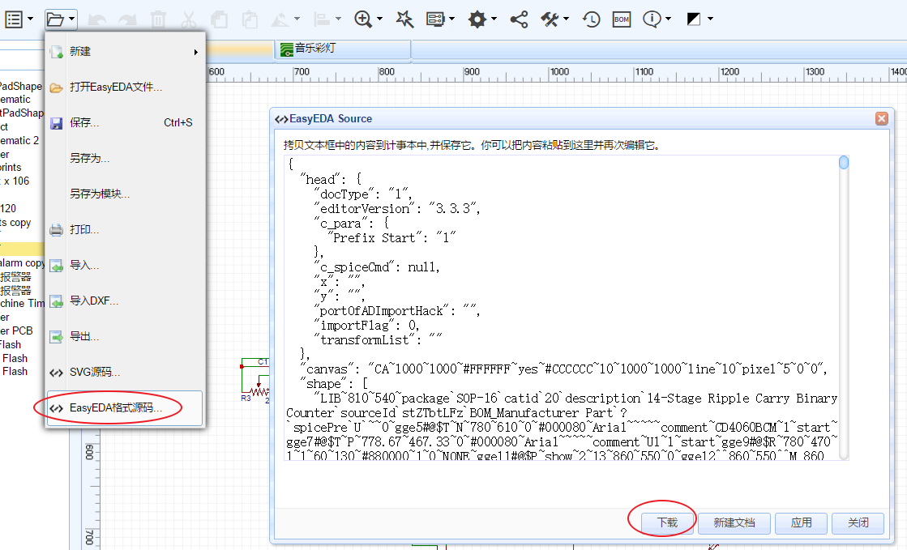

也可以使用**下载工程**功能下载：**选择原理图所在的工程  > 点击右键 > 下载工程**。

更多关于EasyEDA格式源码的信息，请查看下面[导出EasyEDA源码文件](./Export.htm#导出EasyEDA源码文件)章节。

### 打印原理图

在点击 **文件** > **打印** 后，会打开一个网页，并调出浏览器打印对话框，设置参数后直接打印即可。请留意打印边界的设置，否则打印出来的画面可能会超出单页界面。

也可以使用导出的PDF，PNG，SVG进行打印。建议优先选择PDF打印。

### 导出BOM

立创EDA支持导出BOM表(物料清单)，以便于你购买所需的零件。
BOM导出可以点击工具栏的BOM图标：

点击后会弹出一个导出对话框，在这个对话框里，直接点击“从立创商城购买”按钮即可下载CSV格式的BOM表。   

导出前，你还可以为零件指定立创商城的零件编号，以利于在立创商城上方便购买元件，下单时直接上传BOM表即可：

点击分配图标后会打开元件库搜索框，在这里找到你想要的零件后然后点击“分配”完成编号指定，分配的编号将出现在BOM中。

未来BOM导出功能会与立创商城打通，将实现一键加入购物车功能，届时将大大方便用户采购元件。

BOM打开后如图：

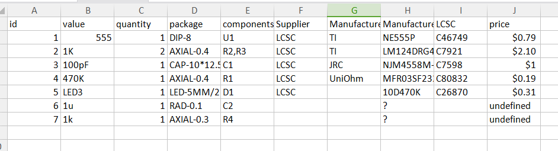

### 导出网表

立创EDA支持导出多种EDA使用的网表文件格式。可导出单一文档网表也可导出整个工程的网表。

支持的格式有：Spice仿真格式，Protel/Altium格式，Pads格式，FreePCB格式，Kicad格式，Eagle格式，OrCAD格式。

打开通过：**超级菜单 > 杂项 > 生成本文件网络/生成本工程网络**

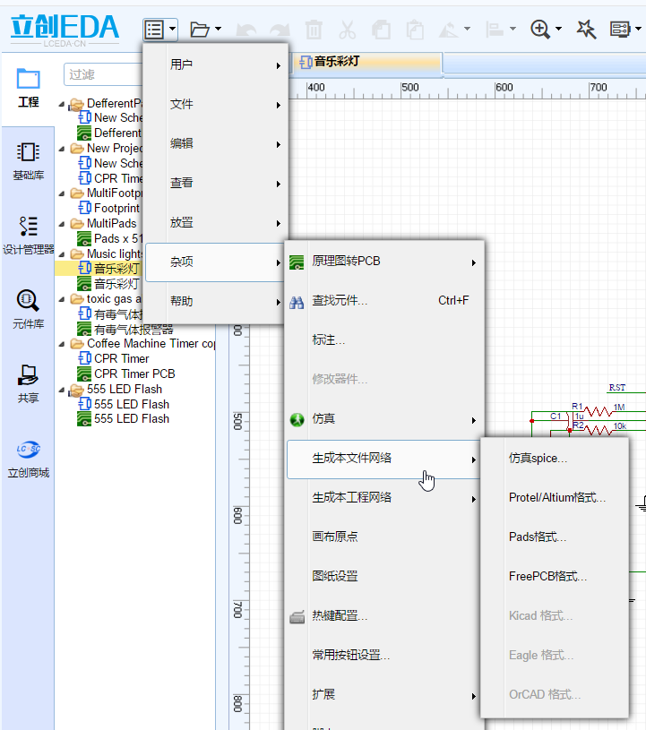

## 导出PCB

### 用多文件格式导出PCB

导出PCB设计与导出原理图设计的一样。在 **文档 > 导出** 或 **文档 > 打印**，点击后会打开如下对话框：

-	**导出选项：**可选择PDF，PNG，SVG格式文件。
-	**宽：** 该选项是指所导出图片的宽度，仅对导出PNG有效。默认为0，代表实际尺寸。数值越高代表导出的分辨率越高，比如你输入1024，那么导出PNG图片的宽度为1024像素，图片高则根据原理图自动调整。
-	**合并层：**选择的层将全部打印在一个PDF/PNG/SVG里面。
-	**分离层：**选择的层会分别在一个单独文件里，以压缩包的形式导出。只有选择分离层时，层的镜像选项才可以使用。
-	**色彩：**有全彩和白底黑图。若自己制作PCB建议选择白底黑图。
-	**装配图**：选择该选项后只打印顶层和底层的装配位置。如插件孔，焊盘等。

**注意：** 

-	*如果你要打印1:1大小的PCB，请选择导出 PDF(1:1)。*

### 用Altium Designer格式导出PCB

导出Altium Designer格式PCB可通过点击：**文档 > 导出Altium...** 会打开以下对话框：

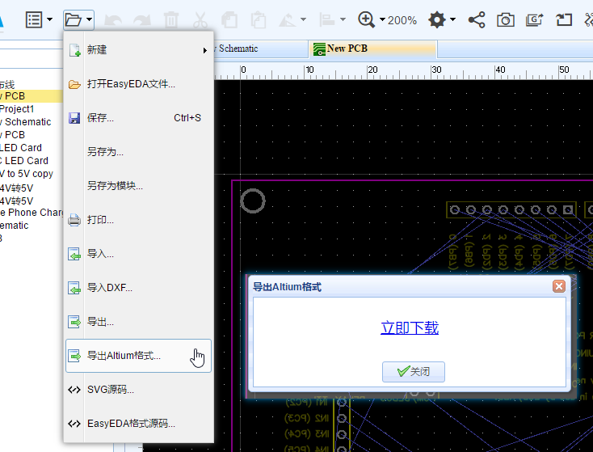

点击“立即下载”即可下载Altium Designer格式的PCB。

当用Altium Designer打开导出的PCB时， 会打开一个“DXP Import Wizard”的窗口，点击取消继续即可。

打开后的PCB会如下图，似乎没有铺铜一般：

此时你需要对PCB进行重新铺铜，通过: **Tools > Polygon Pours > Repour All**：

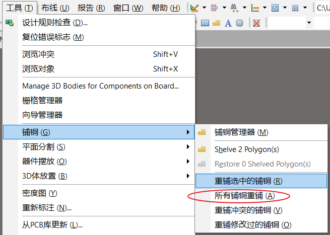

之后保存即可。

如果你要导出的PCB没有进行布线，那么你需要在Altium Designer里面进行相应的设置，使飞线显示出来：

通过：**“设计 > 网络表 > 清除所有网络”**，快捷键：**D > N > A**

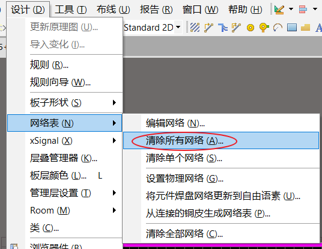

或者通过快捷键：**N > H > A** 再 **N > S > A**。

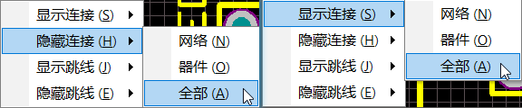

### 下载PCB文档

下载方法与前面的**下载原理图文档**一致。

### 生成制造文件

当你完成PCB设计之后，你可以生成Gerber文件，通过：**超级菜单 > 杂项 > 生成制造文件**，或者点击工具栏上的生成制造文件图标：

点击后会打开一个下载页面，点击下载即可。

如果你需要PCB打样，建议通过立创EDA的兄弟公司嘉立创：[www.sz-jlc.com](www.sz-jlc.com)

当然，你也可以将导出的Gerber文件发给任意一个厂家进行生产，立创EDA并没有做任何使用限制！！

### 导出贴片坐标信息

立创EDA支持导出SMT坐标信息，以便于工厂进行SMT贴片。

导出可点击：**超级菜单 > 杂项 >  生成贴片坐标文件**  

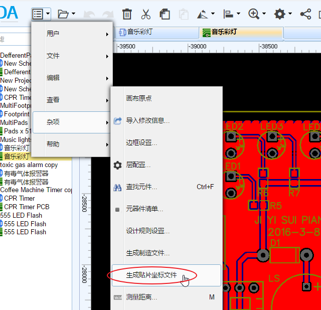

导出的文件格式为CSV，打开后如下：

目前导出的文件暂时仅支持mil单位，以后会增加对其他单位的支持。

### 导出打印并自制PCB板

如果你不想花钱打样PCB，想自己打印并腐蚀。比如：[百度经验：教你轻松自制PCB电路板](https://jingyan.baidu.com/article/414eccf64c14a36b431f0ae1.html)；[百度经验：自制电路板制作PCB的过程](https://jingyan.baidu.com/article/8cdccae979e128315413cd1c.html)  
你可以参考以下步骤。

1、导出PCB为PDF： **文件 > 导出**，或者 **文件 > 打印**。一般选底层。请按需选择是否需要镜像导出。

**注意：** 

-	*请确保选择的颜色是白底黑图。*

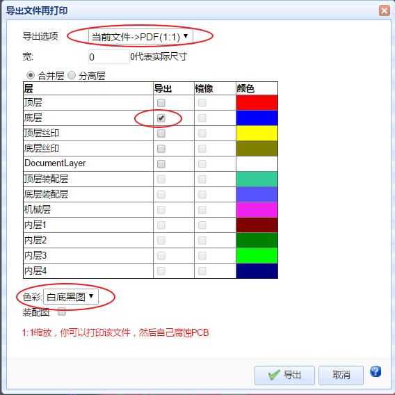   

2、在PDF阅读器打开PDF，确认是否符合要求。

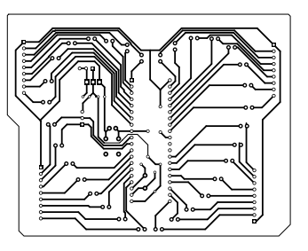

3、使用碳粉打印机打印在转印纸上。

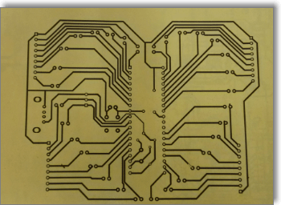

4、使用熨斗印在PCB基板上。

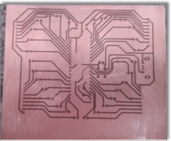

5、腐蚀PCB板并清洗碳粉。

6、钻孔。

7、零件焊接，并完成PCB制作。

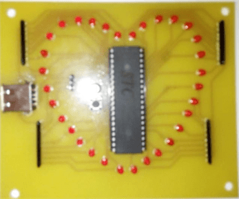 

## 导出SVG源文件 

立创EDA支持导出原理图，PCB，库文件的SVG源文件。

在**文档 > SVG源码**打开。

点击下载后直接得到一个SVG后缀的文件，然后可以通过文本编辑器或浏览器打开该文件。你也可以复制对话框内的代码在编辑器中进行编辑，SVG编辑器推荐 [Inkscape：https://inkscape.org/zh/](https://inkscape.org/zh/) 

该导出SVG功能可直接在本地完成，无需联网。

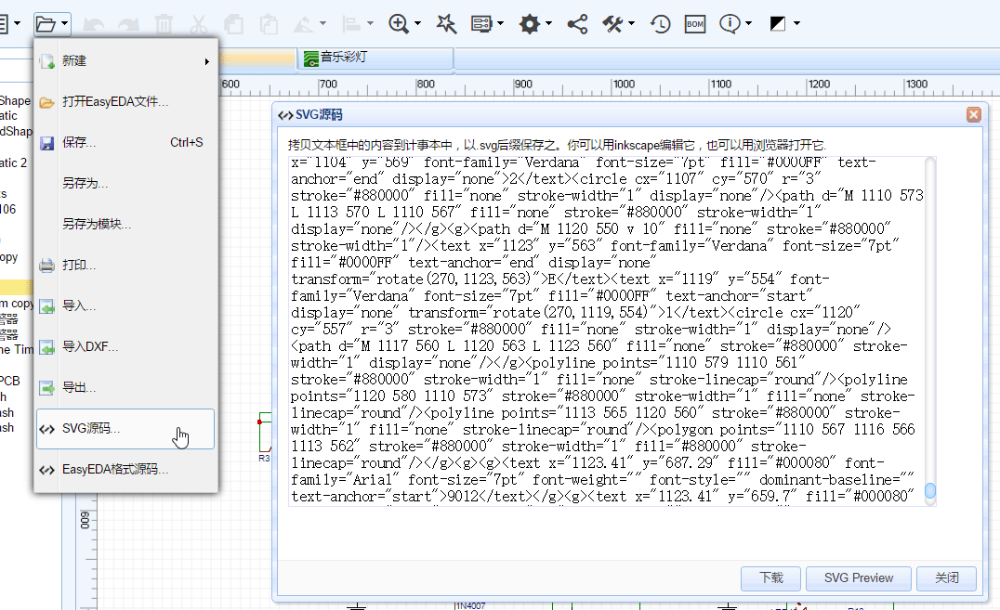  

## 导出EasyEDA源码文件

立创EDA支持导出原理图，PCB，库文件的EasyEDA源码文件。

通过 **文档 > EasyEDA格式源码** 打开。

EasyEDA格式源码文件是一个**JSON**文件，该文件类型可以被很多程序打开和编辑。 关于Json的介绍请查看：[Json.cn: 什么是Json](http://www.json.cn/wiki.html)；[Json官网: Json介绍](http://www.json.org/json-zh.html)

开放的EasyEDA源码文件允许你在文本编辑器上进行编辑，这可以很方便地修改原理图、Spice文件、原理图库文件，以及PCB文件和封装。

点击“下载”即可将文档以json的格式下载。导出EasyEDA源码文件是一个很好分享/备份你的作品的方法。使用该方法你的文件可以不需要保存文件到立创EDA的服务器。Json文件可以被高度压缩为zip或7z。它可以通过电子邮件发送给任何人，而且他们在立创EDA编辑器中可以正常打开，完全不用担心他们是否拥有和你一样的库文件。

为此，立创EDA还提供了读写EasyEDA文件的接口，可自行编写在立创EDA编辑器上运行的脚本。详情可查看[立创EDA API接口](./API.htm#立创EDA-API接口)章节。

# 分享 

立创EDA为你提供了两种方式的分享功能，你可以很容易地将文件分享给其他人。

-	公开分享：将工程公开给大众，所有人可以查阅。
-	访问控制：将工程分享给指定的人，适合保密性分享。

## 公开分享 

所有新建的工程立创EDA都默认为私有工程，你不能直接公开分享私人工程下的文件。当你想要进行分享时，你必须先将工程设为公开的。  

公开工程有两种方法：

1、**创建新工程** 时选择公开。

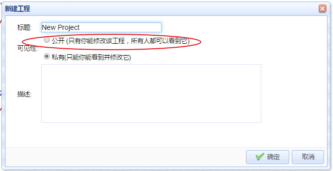  

2、**编辑工程** 进行公开。

直接在工程文件夹下，右键点击“编辑工程”，然后在打开的网页设置公开。

  

工程设置为公开后，工程文件夹图标会出现一个手掌分享标志，表示该工程已经公开。

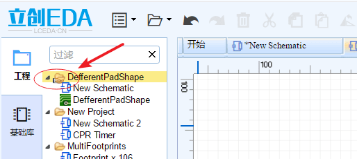

打开文档后，此时再点击工具栏的分享按钮即可弹出分享窗口，可复制链接进行分享。

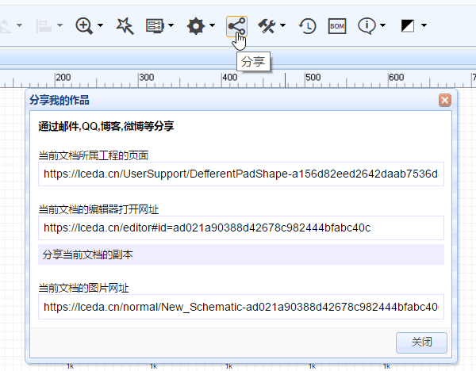

**注意：***如果你选择了公开工程，那么该工程将出现在你的个人主页下(个人首页：https://lceda.cn/你的用户名)，任何人都可以查阅。*

**公开工程的好处**

-	可以让更多人知道你开发的作品，为自己增加名气，大家共同学习共同提高；
-	面试时可直接投递个人主页，让面试官知道你的设计实力；
-	可以帮助有需要的人复用你的作品，设计开源共享，为开源事业做贡献，同时也为立创EDA的发展做贡献。

## 访问控制

如果你只想分享给指定的人，并且允许他/她对你的工程文件进行编辑，那么你可以使用“访问控制”。

选择工程，右键选择“访问控制”，输入对方的邮箱，设置权限点后击“添加用户”即可分享。
分享成功后，工程文件夹旁边会出现一个红色的用户图标，标识该工程正通过访问控制共享。

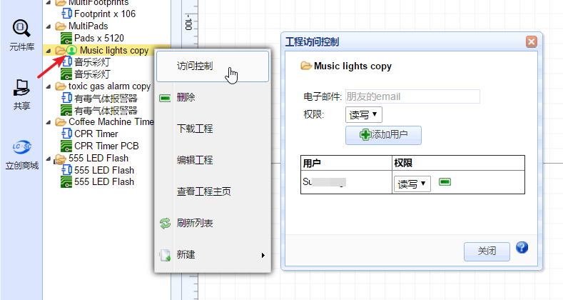

**注意：**

-	*你分享的人员的邮箱必须是已经在立创EDA注册的账号。*
-	*你可以设置的分享权限有“只读”和“读写”。*

对方可在编辑器的左边导航面板的“共享”模块查看你共享给他的工程。如果他不再接受你共享的工程，他可以在“共享”下，对工程右键选择“拒绝分享”，即可取消共享动作。
下图第一个箭头处指的是分享人的用户名，第二个箭头指的是该工程的分享权限，RW指读写(Read 和 Write)。

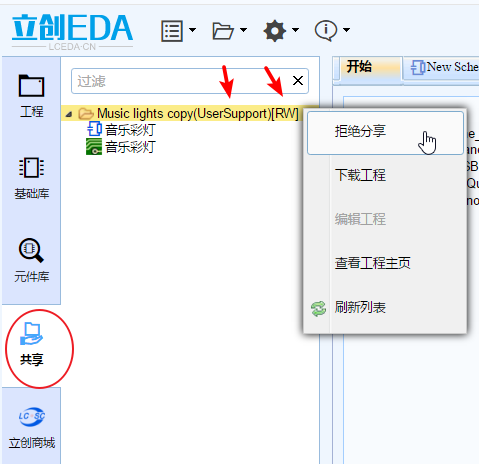 

同样，你的伙伴使用访问控制共享给你的工程也是在“共享”模块查看。另外还可以在 “个人中心 > 项目 > 分享给我 ”中查看。

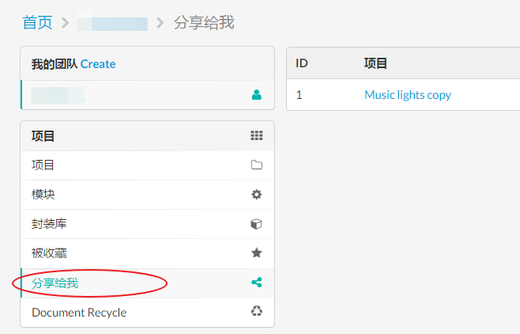 

                    

​                    
​                    
