<h1 align = "center">立创EDA帮助文档</h1>

<p align = "center">2017.10.12</p>
<p align = "center" >立创EDA编辑器正式版：<a href=https://lceda.cn/editor>https://lceda.cn/editor</a></p>
<p align = "center" >立创EDA编辑器Beta版：<a href=https://beta.lceda.cn/editor>https://beta.lceda.cn/editor</a></p>
<p align = "center" ></p>

**文档说明：**

-	本文档会跟随编辑器的新功能更新而持续更新。
-	最新版本请前往 [https://lceda.cn/Doc/Tutorial/](https://lceda.cn/Doc/Tutorial/WhatsNew.htm#) 下载。
-	编辑器Beta版(公测版)会先行推出新的功能与改善，但可能会有bug，请谨慎体验。

<br>

**更新记录：**

<table width="100%"  style="font-family:'微软雅黑'; font-size:14px;">
   <tr>
      <td width="10%" style = font-weight:bold; >更新日期</td>
      <td width="13%" style = font-weight:bold; >编辑器版本</td>
      <td width="78%" style = font-weight:bold; >更新简述</td>
   </tr>
   <tr>
	  <td>2017.10.12</td>
      <td>v4.10.1 Beta</td>
      <td>新增“布局传递”章节；修改“网络冲突”章节为“多网络标签”</td>
   </tr>
   <tr>
      <td>2017.10.10</td>
      <td>v4.9.3</td>
      <td>本地自动布线支持Linux(64)</td>
   </tr>   
   <tr>
      <td>2017.10.09</td>
      <td>v4.9.3</td>
      <td>添加仿真章节(英文版)，API章节(英文版)和开放文件格式章节(英文版)</td>
   </tr>
   <tr>
      <td>2017.09.20</td>
      <td>v4.9.3 Beta</td>
      <td>新增导出为Altium文件格式章节</td>
   </tr>
   <tr>
      <td>2017.09.18</td>
      <td>v4.9.3 Beta</td>
      <td>新增“本地自动布线”章节</td>
   </tr>
   <tr>
      <td>2017.09.08</td>
      <td>v4.8.5</td>
      <td>修正错误，添加“浏览器设置”章节</td>
   </tr>
   <tr>
      <td>2017.08.30</td>
      <td>v4.8.5</td>
      <td>第一版更新，未包含仿真章节</td>
   </tr>

<table>

<br><br><br><br><br><br><br><br><br><br><br><br><br><br><br><br><br>
<br><br><br><br><br><br><br><br><br><br><br><br><br><br><br><br><br>
<br><br><br><br><br><br><br><br>


# 立创EDA介绍

## 什么是立创EDA

**欢迎使用立创EDA/LCEDA**

-	立创EDA是一款基于浏览器的，友好易用的，强大的EDA(Electronics Design Automation: 电子设计自动化)工具, 服务于广大电子工程师,教育者,学生,制造商和爱好者。致力于中小原理图PCB工程的设计，仿真与实现。  
 
-	立创EAD可以不需要安装任何软件或插件。只需在任何支持HTML5,标准兼容的web浏览器打开立创EDA即可。请优先使用最新版Chrome和FireFox浏览器，其他浏览器立创EDA暂时不做适配。
 
-	立创EDA是知名在线EDA软件EasyEDA的国内版本，立创EDA专注国内用户，EasyEDA专注国外用户；立创EDA和EasyEDA功能上一致，编辑器和客户端同步更新；国内版与国外版账号数据系统相对独立，不互通，已经注册EasyEDA的用户请及时将账号数据迁移至国内版，迁移地址：[https://easyeda.com/applyForLceda](https://easyeda.com/applyForLceda)；因为立创EDA数据服务器建立在国内，所以国内用户访问立创EDA速度更快，基本无EasyEDA的卡顿现象。在今后国内用户访问EasyEDA都会导向LCEDA。

-	无论你使用的是Linux, Mac , Windows，立创EDA均可以为你提供专业的优质服务。访问地址：[https://lceda.cn/editor](https://lceda.cn/editor) 

-	国内个人用户**永久免费**，提供友好的社区支持。社区请访问：[http://club.szlcsc.com/forum/97_0_1.html/](http://club.szlcsc.com/forum/97_0_1.html)


**注意：***在首次使用立创EDA进行项目设计前，请花两小时阅读本帮助文档以及[LCEDA国内用户使用注意事项](https://lceda.cn/page/FAQ)，可极大提高你的设计效率，减少出错！*
  
**不收费立创EDA怎么生存？**  

-	立创EDA目前提供立创商城元器件销售；PCB打样与批量订单，PCB贴片服务；未来还会为企业用户提供付费服务。    
-	如果你想支持立创EDA更好的发展，你可以：
	-	在立创商城([www.szlcsc.com](www.szlcsc.com))购买元件；
	-	在立创EDA的兄弟公司嘉立创进行PCB打样与贴片([www.sz-jlc.com](www.sz-jlc.com))；
	-	使用立创EDA创建个人的库文件和公开的工程；
	-	向朋友推荐立创EDA。

**立创EDA可提供：**

-	简单，易用，友好，强大的绘图体验与能力
-	可在任意地点，时间，设备上工作
-	实时团队协作
-	在线共享
-	大量的开源项目
-	整合[PCB制造](www.sz-jlc.com)和[元器件购买](www.szlcsc.com)供应链
-	提供API
-	支持脚本
-	原理图绘制
	-	基于[NgSpice](http://ngspice.sourceforge.net/)的仿真功能
	-	仿真模型和子电路的创建
	-	波形图的查看和导出(CSV)
	-	网表导出(Spice, Protel/Altium Designer, Pads, FreePCB)
	-	多文件格式导出(PDF, PNG, SVG)
	-	EasyEDA源码格式导出(json)
	-	Altium Designer格式导出
	-	BOM导出
	-	多页原理图
	-	原理图模块
	-	主题设置
	-	文档恢复
-	PCB设计
	-	设计规则检查
	-	多层设计
	-	多文件格式导出(PDF, PNG, SVG)
	-	EasyEDA源码格式导出(json)
	-	Altium Designer格式导出
	-	BOM导出
	-	照片预览
	-	Gerber文件导出
	-	SMT坐标文件导出
	-	自动布线
	-	PCB模块
	-	文档恢复
-	文件导入
	-	Altium/ProtelDXP ASCII 原理图/PCB
	-	Eagle 原理图/PCB/库文件
	-	LTspice 原理图/原理图库文件
	-	DXF文件
-	库文档
	-	超过50万库文档(原理图库和封装库)
	-	库文档管理
	-	符号/子库的创建与编辑
	-	仿真符号的创建与编辑
	-	封装库的创建与编辑


## 浏览器设置

在使用立创EDA之前，请先对浏览器进行设置。推荐使用原生的Chrome谷歌浏览器和Firefox火狐浏览器，立创EDA优先支持这两款浏览器，不建议使用IE和Edge。若你使用的是国内厂商基于Chromium浏览器二次开发的浏览器，如QQ浏览器，360浏览器，百度浏览器等，你需要切换至极速内核，设置浏览器最小字号和关闭鼠标手势，并对lceda.cn取消广告拦截，否则可能会无法正常使用。

**切换至极速内核**：使用双核浏览器时，必须切换至极速内核，若使用兼容内核(IE内核)，部分功能可能无法正常使用。如文件导入失败，布线样式错误，铺铜区域错误。

**关闭手势功能**：如果不关闭浏览器手势，将无法在编辑器使用长按右键平移功能。

**设置浏览器最小字体**：使用谷歌浏览器内核的浏览器通常设置最小字体字号为12号，在原理图进行缩小时会出现文字太大的现象(如下图左边)，此时你需要将最小字号设为更小。  


以下是浏览器的设置方法：

-	谷歌浏览器：
	-	切换极速内核：无需设置。
	-	关闭手势功能：不支持，无需设置。
	-	设置最小字号：**设置 > 外观  > 自定义字体 > 最小字号**。
-	火狐浏览器：
	-	切换极速内核：无需设置。
	-	关闭手势功能：不支持，无需设置。
	-	设置最小字号：**选项 > 内容 > 字体和颜色 > 高级 > 最小字体大小**，将最小字号设为最小。
-	360安全浏览器：
	-	切换极速内核：点击地址栏最右边的内核模式切换按钮。
	-	关闭手势功能：**设置 > 鼠标手势  > 启用鼠标手势**，去掉勾选。
	-	设置最小字号：**设置 > 界面设置  > 字体大小 > 自定义字体大小** ，将最小字号设为最小。
-	360极速浏览器：
	-	切换极速内核：**选项 > 高级设置 > 内核模式 > 默认使用Blink内核**。
	-	关闭手势功能：**选项 > 鼠标手势  > 启用鼠标手势**，去掉勾选。
	-	设置最小字号：**选项 > 高级设置 > 网络内容 > 自定义字体 > 最小字体号**，将最小字号设为最小。
-	猎豹浏览器：
	-	切换极速内核：**选项/设置 > 基本设置 > 浏览模式 > 优先使用极速模式**。
	-	关闭手势功能：**选项/设置 > 鼠标手势  > 启用鼠标手势**，去掉勾选。
	-	设置最小字号：**选项/设置 > 更多设置 > 网页内容 > 自定义字体 > 最小字号** ，将最小字号设为最小。
-	QQ浏览器：
	-	切换极速内核：**设置 > 高级  > 内核模式 >  总是使用极速内核**。
	-	关闭手势功能：**设置 > 手势与快捷键 > 开启鼠标手势**，去掉勾选。
	-	设置最小字号：**设置 > 常规设置  > 网络内容 >  自定义字体 > 最小字号** ，将最小字号设为最小。
-	傲游5浏览器：
	-	切换极速内核：**工具 > 内核切换：兼容 -> 极速**。
	-	关闭手势功能：**设置 > 鼠标手势和快捷键 > 鼠标手势  > 启用鼠标手势**，去掉勾选。
	-	设置最小字号：无需设置，默认最小字号。
-	搜狗浏览器：
	-	切换极速内核：**工具 > 切换到极速模式**。
	-	关闭手势功能：**工具 > 选项 > 鼠标手势  > 启用鼠标手势**，去掉勾选。
	-	设置最小字号：无法设置。
-	百度浏览器：
	-	切换极速内核：点击地址栏最右边的内核模式切换按钮。
	-	关闭手势功能：**浏览器设置 > 高级设置 > 鼠标手势  > 启用鼠标手势**，去掉勾选。
	-	设置最小字号：无法设置。
-	UC浏览器：
	-	切换极速内核：点击地址栏最右边的内核模式切换按钮。
	-	关闭手势功能：**设置 > 鼠标手势 > 基本 > 启用鼠标手势**，去掉勾选。
	-	设置最小字号：**设置 > 其他 > 网络内容 >  自定义字体 > 最小字号** ，将最小字号设为最小。
-	2345加速浏览器：
	-	切换极速内核：点击地址栏最右边的内核模式切换按钮。
	-	关闭手势功能：**选项 > 鼠标手势 > 启用鼠标手势**，去掉勾选。
	-	设置最小字号：**选项 > 高级设置 > 网络内容 > 自定义字体 > 最小字体号**，将最小字号设为最小。
-	Opera浏览器：
	-	切换极速内核：无需设置。
	-	关闭手势功能：**菜单 > 设置 > 浏览器 > 快捷键 > 启用鼠标手势**，去掉勾选。
	-	设置最小字号：**菜单 > 设置 > 网站 > 显示 > 自定义字体 > 最小字体大小**，将最小字号设为最小。
-	世界之窗浏览器：
	-	切换极速内核：无需设置。
	-	关闭手势功能：**设置 > 显示高级设置 > 鼠标手势 > 启用鼠标手势**，去掉勾选。
	-	设置最小字号：**设置 > 显示高级设置 > 网络内容 > 自定义字体 > 最小字体大小**，将最小字号设为最小。


## 工程设计流程

使用立创EDA进行设计的流程如下：  


<br><br><br><br><br>


## 使用界面

立创EDA拥有一个友好的，简洁的，美观的使用界面。

### 全局界面

**原理图界面**


**PCB界面**
 

### 简洁的操作界面

立创EDA有两个区域非常重要，分别是左边标识为2的导航面板，右边标识为9的属性面板。工程，元件库等均可以在导航面板找到；通过选择你需要的项目，在属性面板可以查看和修改你想要的属性。


#### 1. 筛选器

使用筛选器，只需要输入部分字符就可以很方便地搜索出想要的东西。 在工程按钮下，可以很方便搜索工程，工程里面的文件。在基础库可以很方便搜索想要的零件符号。比如直接在基础库搜索 “555” 即可将 555定时器搜索出来。

  

筛选器只能搜索标题，文件或工程的描述无法搜索。

点击 `X` 清除筛选内容。

#### 2. 导航面板

导航面板是立创EDA非常重要的一个组成模块，你可以在这里找到你的工程，系统基础库，设计管理器，元件库，他人共享给你的文件等。

  

**工程**  

在这里，你可以找到你的所有工程及文件，包括你私人的，已共享的，直接拷贝别人的工程文件。

除了元件库，它们均可以使用右键菜单。如工程文件下的右键菜单：


**基础库**

这里包含了很多常用的库文件，可以很方便的使用，只需鼠标单击后移动至原理图画布即可。该处不允许自定义。 

**设计管理器**

设计管理器，在原理图下你可以很方便地检查每个零件和每条网络；在PCB下这里还可以查看设计规则错误(DRC)。

**元件库** 

包含了原理图库和封装库，其中包括系统库和用户共享库。你的个人库文件也在这里。  

 

**共享**

如果你的伙伴使用 **访问控制** 功能将他的工程共享给你，那么共享的工程会出现在这里。如果对方使用的是公众共享功能，共享给你的工程不会出现在这里。

更多信息请访问[“访问控制”](./Share.htm#访问控制)。

**立创商城**

你若需要购买元器件进行PCB制作，建议通过这里购买。立创商城提供了6W+的元器件对外销售，是目前国内领先的元器件自营商城，经营的元器件均是正品，可放心购买。立创EDA和立创商城共同属于深圳市立创电子商务有限公司。

访问地址：[www.szlcsc.com](www.szlcsc.com)。 

 


#### 3. 工具栏

编辑器提供简单美观的功能图标。


工具栏图标可通过“常用按钮设置”进行配置。


配置方式简单明了。


选中后可以点击隐藏/显示，上移下移来调整在工具栏的位置。


#### 4. 预览窗口

当你选择一个原理图或PCB时，可以在这里进行预览。因为需要从服务器进行加载，所以预览图需要

你可以通过 

 **超级菜单 > 查看 > 工具栏 > 预览** 或者在工具栏 **配置 > 工具栏 > 预览** 处进行打开这个功能.

-  在右下角处，拖动可以进行放大缩小。
-  无法关闭，你可以点击右上角的 - 进行收缩窗口。
-  点击铅笔图标可以打开当前预览文件。

  


#### 5. 电气工具

编辑器会根据不同的类型显示不同工具栏。以下是原理图的电气工具。  


#### 6. 用户管理菜单

在这里你可以切换至团队，切换语言，修改系统设置等。


#### 7. 超级菜单

编辑器全部的菜单功能均可以在这里找到。这里面很多功能均可以通过设置快捷键的方式使用，也建议你使用快捷键，可提高设计效率。


#### 8. 绘图工具

绘图工具和电气工具，和PCB绘制工具均可以通过拉伸窗口进行调节大小，也可以随意拖动位置。


#### 9. 画布属性

点击画布空白处后就可以在右边面板查看与修改画布属性。


背景颜色，网格，网格样式，大小，栅格等属性均可以修改。


#### 10. 画布

画布区域是主要工作区，在这里可完成原理图的创建和绘制编辑，库文件符号的绘制和编辑，PCB的创建，布局和编辑，仿真与波形查看等。

**原理图**  
  

**PCB**  
  

**库符号**  
  

**封装**  


**其他绘图**  


**仿真波形**  


## 如何创建一个工程或文件

在登录后，通过点击
 **文件 > 新建 > 工程...** 或 **文件 > 新建 > 原理图..等**
   

“工程”概念在编辑器中非常重要，在新建原理图，PCB等一些文件前必须存在一个工程文件夹才可进行新建，否则需要新建一个工程，以便于管理新建的文件。

 

设置名称并点击确认后，新建的工程将在左边的“工程”处显示。

在新建时，你还可以选择这个工程是私人的还是共享的。

选择共享后，该工程与其下的文件将显示在你的个人主页上，任何人都可以查看复制你的设计。添加的描述可以帮忙别人了解你的设计内容。

若创建后你想修改你的工程信息，你可在工程文件夹右键，选择编辑工程。


将打开一个网页，你可以修改工程的相关信息。


​

## 功能介绍

### 原理图绘制

立创EDA可以创建很专业的原理图。

  

立创EDA有一些简单而强大的绘图功能，你可以通过复制现有的符号复制到自己的库中，然后编辑和保存，来创建自己的库文件，或者从头开始绘制新的原理图库文件。

编辑器提供了 **原理图库向导**，以便于迅速创建 `DIP`, `QFP` 和 `SIP`类的原理图符号。

立创EDA除了普通的简单的“2D”图形库之外，还有一个“3D”零件符号库，连接后看起来与实物相似。

如果你有足够的耐心，你可以创建很漂亮的3D形状的原理图。


还有一个强大的功能是可以从AD，Kicad，Eagle等导入原理图PCB库符号。

### 元件库管理

**系统库文件**

感谢于免费和开源的Kicad库和一些开源的Eagle库，加上立创商城自身创建的库文档，立创EDA已经有超过50w个元件库，基本上已经可以满足大部分设计需要。

你基本可以不用花太多时间去寻找和创建新的原理图库和封装库就可以进行设计。

**用户贡献库文件**

用户建立的库文件会自动共享至用户贡献库中，立创EDA认为，库文件的共享可以使更多人使用到你的库文件，减少重复的创建库文件的工作。并且库文件共享并不会产生数据安全性问题，需要关注的是用户私人的工程以及文档。
用户贡献的库文件在使用时，点击后在右边属性面板可以看到一个“Contributor(贡献者)”参数，显示共享者的用户名。贡献政策参见：[https://lceda.cn/page/contribute](https://lceda.cn/page/contribute)

**查找库文件**

在左边导航面板的“基础库”和“元件库”，点击后输入你想要的库名称后搜索即可。

**创建个人库文件**

立创EDA支持创建个人库文件，创建的库文件可以在 **元件库 > 我的库文件** 中找到，并且很容易进行管理。
​

### PCB设计

1、立创EDA可以快速地通过原理图创建PCB，甚至是复杂的多层原理图。

在原理图下点击工具栏图标 **原理图转PCB** 即可快速转为PCB。  


立创EDA也支持没有原理图的PCB设计。

2、立创EDA具有大量的封装库文件，但你也可以通过创建新的封装文件，创建可以重新创建、通过修改编辑原有的封装、复制封装等方式创建。


3、为了方便查找和定位封装位置，立创EDA在左边面板提供了一个设计管理器。

设计管理器可以很方便的查找元件(封装)，走线(网络)，焊盘(网络焊盘)，还有DRC错误列表。

当点击任一项目后，画布中会将当前的项目（封装或者网络）进行居中高亮，以方便识别。

4、使用层工具可以显示你所需要的层，和编辑所在的层。你也可以修改PCB的层数和显示颜色，通过：**超级菜单 > 杂项 > 层配置...**

5、在设计规则检查对话框中，默认的走线宽度、间隙和通过孔尺寸都可以进行配置：**超级菜单 > 杂项 > 设计规则设置...**

在你完成PCB设计并发送Gerber和钻孔文件给PCB厂生产前，设计规则检查几乎是最后的一步工作，所以在你开始PCB布线之前，最好先进行规则设置。

在发送Gerber给PCB厂商之前，你需要使用Gerber查看器检查生成的gerber是否符合要求，这里推荐开源免费的Gerber查看软件[Gerbv: http://gerbv.geda-project.org/](http://gerbv.geda-project.org/) 

6、完成PCB后，你还可以把物料清单“BOM”表导出，以便于购买元器件：工具栏BOM图标。

7、PCB你也可以导出高质量的文件 `SVG`, `.PNG` or `.PDF`。

8、PCB也可以和原理图一样对外进行分享。

9、PCB设计的尺寸在立创EDA是没有限制的，一般超过100cm x 100cm也是允许的，但是这需要你有一个很强大的电脑，因为在浏览器下，绘制大面积的PCB会产生卡顿现象。

立创EDA默认支持6层板，但它可以支持更多， 所以若你需要更多层请联系立创EDA技术支持，联系方式请查看下方[寻求帮助](#寻求帮助)章节。

10、封装查找 

PCB的封装查找与原理图的库文件查找一致，在“元件库”中，查找后，选择所需的封装点击“放置”即可放置在画布中。


### 账号管理

立创EDA是一种基于网络的服务，账号与数据均加密保存在服务器上，你最好创建一个帐户来管理自己的设计和元件库。创建一个帐号很简单，只要你愿意，你可以免费访问立创EDA的全部功能。  

#### 注册登录

在用户管理菜单，点击注册：


点击后会打开一个新页面，该页面可以进行注册和登录：


输入相关信息后注册/登录即可。

**注意：***因国家相关政策规定，所有注册账户必须登记手机号码；一旦你创建了帐户，你只有一次修改你的用户名的机会，请谨慎命名。*


#### 重置密码

你的密码是经过加密处理的，立创EDA也不知道密码是什么，如果你忘记密码可以通过使用登录界面/用户菜单的“忘记密码”链接进行找回，系统会发短信给你进行确认，请确保你仍然使用原注册的手机号。在你要更换手机号码之前请及时在个人中心更换新手机号码。  


#### 团队协作

立创EDA提供了团队功能，该功能可以使你和伙伴共同进行项目协作设计，当你和伙伴共同登录在团队账号下时，可访问团队的全部库文件，原理图，PCB和其他工程文件。

**团队功能在哪**

在个人中心[https://lceda.cn/account](https://lceda.cn/account)，存在一个团队选项。可创建团队，若已存在团队，点击后可直接切换至团队下。

    


**如何创建团队**

1.如上面图所示，在登录后点击[https://lceda.cn/teams/create](https://lceda.cn/teams/create)进行创建新团队。

2.在**用户菜单 > 团队 > 新建团队**  进行创建团队。  

    

创建完成后，点击团队进行切换至团队状态下，然后你邀请你的伙伴加入团队即可。  

  

**如何切换至团队下**

1) 进入个人中心切换。  
   点击你创建的团队名称，然后网页会进行重定向，之后就会切换至团队下。

     

   切换后你可以对你的队员/团队项目进行管理。

2) 在编辑器切换。  
   在 用户菜单 > 团队 选项，选择然后点击你的团队名称即可切换在团队下的编辑器。当前编辑器用户名也会切换至团队名。

     

**如何更新至团队**

如果你想把你的设计贡献到团队中，可在个人中心中使用下图的更新至团队功能。

  **注意：**

-	*若你进行了更新至团队操作，你的个人库文件，工程等均会移动至团队下，且不可逆！！！*

  

**团队功能使用技巧**  

1.如果你切换至团队下，你将不能在元件库中使用你原先个人账户下创建的库文件，如果要使用你必须先收藏你个人账号下的库文件，或者直接搜索库文件名称。

2.你必须了解到你的个人账户和团队账户是相对独立的账号，你无法在同一个浏览器的标签下同时使用。若要使用个人账户必须在其他浏览器打开。

3.在你成为团队所有者之后，最好为团队创建所需的库文件。

4.如果你加入一个成员，并将他提名为会计师，他就可以处理团队的账单和发票。


#### 个人偏好

在用户菜单下，点击个人偏好：

  

其中，  

- **热键同步：**指同步你设置的快捷键指服务器，默认勾选，不可取消。  
	    
- **语言：**设置默认语言，会同步至服务器。

- **最大备份级数：** 每个打开的文档自动创建备份的数目。该备份是指备份至本地的数目，详细请查看下面的“恢复备份数据”。

- **自动备份(分钟)：** 这是自动保存所有打开文档的时间间隔。

- **保存到服务器：** 将你的个人偏好保存至服务器中(工具栏配置，个人库，快捷键设置， 语言设置等)。

- **从服务器加载：** 立创EDA不会主动将你的个人偏好加载到本地，所以你必须进行手动加载。当你更换浏览器和电脑的时候也可以进行手动加载个人偏好。

如果你没有保存个人偏好至服务器，点击从服务器加载将不会产生任何影响。


#### 账号注销

若你想注销你注册的立创EDA账号，你可以点击：[https://lceda.cn/account/close](https://lceda.cn/account/close)。
注销前请告知原因，立创EDA将往更好的方面改善。

### 快捷键

立创EDA提供了很多快捷键供用户使用，每一个快捷键均可以进行配置。

进入快捷键配置选项：


或在“**超级菜单 > 杂项 > 热键配置**”处打开。

点击你需要修改的选项，出现输入框后按下你的按键，再保存即可完成快捷键设置。

**文档类型** 该列表示快捷键在对应的文档类型内是有效的。

- **所有：** 在编辑器内所有的文件类型。
- **原理图：** 原理图和原理图库文件。
- **PCB：** PCB和PCB库文件。

相同的快捷键可以使用在不同的文档中，比如在原理图使用“C”键画圆弧，在PCB中是画一个圆形。

默认的快捷键列表如下。
<table>
   <tr>
      <td>序号</td>
      <td>文档类型</td>
      <td>快捷键</td>
      <td>功能</td>
   </tr>
   <tr>
      <td>0</td>
      <td>所有</td>
      <td>Space</td>
      <td>选择所选图形</td>
   </tr>
   <tr>
      <td>1</td>
      <td>所有</td>
      <td>Left</td>
      <td>向左滚动或左移所选图形</td>
   </tr>
   <tr>
      <td>2</td>
      <td>所有</td>
      <td>Right</td>
      <td>向右滚动或右移所选图形</td>
   </tr>
   <tr>
      <td>3</td>
      <td>所有</td>
      <td>Up</td>
      <td>向上滚动或上移所选图形</td>
   </tr>
   <tr>
      <td>4</td>
      <td>所有</td>
      <td>Down</td>
      <td>向下滚动或下移所选图形</td>
   </tr>
   <tr>
      <td>5</td>
      <td>所有</td>
      <td>Ctrl+X</td>
      <td>剪切</td>
   </tr>
   <tr>
      <td>6</td>
      <td>所有</td>
      <td>Ctrl+C</td>
      <td>复制</td>
   </tr>
   <tr>
      <td>7</td>
      <td>所有</td>
      <td>Ctrl+V</td>
      <td>粘贴</td>
   </tr>
   <tr>
      <td>8</td>
      <td>所有</td>
      <td>Ctrl+Shift+V</td>
      <td>跨文档粘贴</td>
   </tr>
   <tr>
      <td>9</td>
      <td>所有</td>
      <td>Delete</td>
      <td>删除所选</td>
   </tr>
   <tr>
      <td>10</td>
      <td>所有</td>
      <td>Ctrl+A</td>
      <td>全选</td>
   </tr>
   <tr>
      <td>11</td>
      <td>所有</td>
      <td>Esc</td>
      <td>取消绘制</td>
   </tr>
   <tr>
      <td>12</td>
      <td>所有</td>
      <td>Ctrl+Z</td>
      <td>撤销</td>
   </tr>
   <tr>
      <td>13</td>
      <td>所有</td>
      <td>Ctrl+Y</td>
      <td>重做</td>
   </tr>
   <tr>
      <td>14</td>
      <td>所有</td>
      <td>Ctrl+S</td>
      <td>保存</td>
   </tr>
   <tr>
      <td>15</td>
      <td>所有</td>
      <td>A</td>
      <td>放大</td>
   </tr>
   <tr>
      <td>16</td>
      <td>所有</td>
      <td>Z</td>
      <td>缩小</td>
   </tr>
   <tr>
      <td>17</td>
      <td>所有</td>
      <td>X</td>
      <td>水平翻转</td>
   </tr>
   <tr>
      <td>18</td>
      <td>所有</td>
      <td>Y</td>
      <td>垂直翻转</td>
   </tr>
   <tr>
      <td>19</td>
      <td>所有</td>
      <td>G</td>
      <td>吸附</td>
   </tr>
   <tr>
      <td>20</td>
      <td>所有</td>
      <td>Ctrl+F</td>
      <td>查找元件</td>
   </tr>
   <tr>
      <td>21</td>
      <td>所有</td>
      <td>Ctrl+D</td>
      <td>设计管理器</td>
   </tr>
   <tr>
      <td>22</td>
      <td>所有</td>
      <td>D</td>
      <td>拖动</td>
   </tr>
   <tr>
      <td>23</td>
      <td>原理图</td>
      <td>W</td>
      <td>绘制导线</td>
   </tr>
   <tr>
      <td>24</td>
      <td>原理图</td>
      <td>B</td>
      <td>绘制总线</td>
   </tr>
   <tr>
      <td>25</td>
      <td>原理图</td>
      <td>U</td>
      <td>总线分支</td>
   </tr>
   <tr>
      <td>26</td>
      <td>原理图</td>
      <td>N</td>
      <td>网络标签</td>
   </tr>
   <tr>
      <td>27</td>
      <td>原理图</td>
      <td>Ctrl+Q</td>
      <td>标识符 VCC</td>
   </tr>
   <tr>
      <td>28</td>
      <td>原理图</td>
      <td>Ctrl+G</td>
      <td>标识符 GND</td>
   </tr>
   <tr>
      <td>29</td>
      <td>原理图</td>
      <td>P</td>
      <td>放置管脚</td>
   </tr>
   <tr>
      <td>30</td>
      <td>原理图</td>
      <td>L</td>
      <td>绘制折线</td>
   </tr>
   <tr>
      <td>31</td>
      <td>原理图</td>
      <td>O</td>
      <td>绘制多边形</td>
   </tr>
   <tr>
      <td>32</td>
      <td>原理图</td>
      <td>Q</td>
      <td>绘制贝塞尔曲线</td>
   </tr>
   <tr>
      <td>33</td>
      <td>原理图</td>
      <td>C</td>
      <td>绘制圆弧</td>
   </tr>
   <tr>
      <td>34</td>
      <td>原理图</td>
      <td>S</td>
      <td>绘制矩形</td>
   </tr>
   <tr>
      <td>35</td>
      <td>原理图</td>
      <td>E</td>
      <td>绘制椭圆</td>
   </tr>
   <tr>
      <td>36</td>
      <td>原理图</td>
      <td>F</td>
      <td>自由绘制</td>
   </tr>
   <tr>
      <td>37</td>
      <td>原理图</td>
      <td>T</td>
      <td>放置文本</td>
   </tr>
   <tr>
      <td>38</td>
      <td>原理图</td>
      <td>I</td>
      <td>修改选中器件</td>
   </tr>
   <tr>
      <td>39</td>
      <td>原理图</td>
      <td>Ctrl+R</td>
      <td>运行当前文档</td>
   </tr>
   <tr>
      <td>40</td>
      <td>PCB</td>
      <td>W</td>
      <td>绘制走线</td>
   </tr>
   <tr>
      <td>41</td>
      <td>PCB</td>
      <td>U</td>
      <td>绘制圆弧</td>
   </tr>
   <tr>
      <td>42</td>
      <td>PCB</td>
      <td>C</td>
      <td>绘制圆形</td>
   </tr>
   <tr>
      <td>43</td>
      <td>PCB</td>
      <td>N</td>
      <td>放置尺寸</td>
   </tr>
   <tr>
      <td>44</td>
      <td>PCB</td>
      <td>S</td>
      <td>放置文本</td>
   </tr>
   <tr>
      <td>45</td>
      <td>PCB</td>
      <td>O</td>
      <td>放置连接线</td>
   </tr>
   <tr>
      <td>46</td>
      <td>PCB</td>
      <td>E</td>
      <td>绘制铺铜</td>
   </tr>
   <tr>
      <td>47</td>
      <td>PCB</td>
      <td>T</td>
      <td>切换至顶层</td>
   </tr>
   <tr>
      <td>48</td>
      <td>PCB</td>
      <td>B</td>
      <td>切换至底层</td>
   </tr>
   <tr>
      <td>49</td>
      <td>PCB</td>
      <td>1</td>
      <td>切换至内层1</td>
   </tr>
   <tr>
      <td>50</td>
      <td>PCB</td>
      <td>2</td>
      <td>切换至内层2</td>
   </tr>
   <tr>
      <td>51</td>
      <td>PCB</td>
      <td>3</td>
      <td>切换至内层3</td>
   </tr>
   <tr>
      <td>52</td>
      <td>PCB</td>
      <td>4</td>
      <td>切换至内层4</td>
   </tr>
   <tr>
      <td>53</td>
      <td>PCB</td>
      <td>P</td>
      <td>放置焊盘</td>
   </tr>
   <tr>
      <td>54</td>
      <td>PCB</td>
      <td>V</td>
      <td>放置过孔</td>
   </tr>
   <tr>
      <td>55</td>
      <td>PCB</td>
      <td>M</td>
      <td>量测距离</td>
   </tr>
   <tr>
      <td>56</td>
      <td>PCB</td>
      <td>L</td>
      <td>改变布线角度</td>
   </tr>
   <tr>
      <td>57</td>
      <td>PCB</td>
      <td>-</td>
      <td>减少线宽</td>
   </tr>
   <tr>
      <td>58</td>
      <td>PCB</td>
      <td>+</td>
      <td>增加线宽</td>
   </tr>
   <tr>
      <td>59</td>
      <td>PCB</td>
      <td>Alt+-</td>
      <td>减少栅格尺寸</td>
   </tr>
   <tr>
      <td>60</td>
      <td>PCB</td>
      <td>Alt++</td>
      <td>增加栅格尺寸</td>
   </tr>
   <tr>
      <td>61</td>
      <td>PCB</td>
      <td>H</td>
      <td>高亮网络</td>
   </tr>
   <tr>
      <td>62</td>
      <td>PCB</td>
      <td>Shift+M</td>
      <td>删除所有铺铜</td>
   </tr>
   <tr>
      <td>63</td>
      <td>PCB</td>
      <td>Shift+B</td>
      <td>重建所有铺铜</td>
   </tr>
   <tr>
      <td>64</td>
      <td>所有</td>
      <td>K</td>
      <td>适合窗口</td>
   </tr>
   <tr>
      <td>65</td>
      <td>所有</td>
      <td>Shift+X</td>
      <td>交叉选择模式</td>
   </tr>
   <tr>
      <td>67</td>
      <td>所有</td>
      <td>Shif+F</td>
      <td>浏览和查找元件库</td>
   </tr>

</table>

### 基础技巧.

为了方便使用立创EDA进行设计，你需要了解一些基础的使用技巧，请打开编辑器并新建一个原理图文件进行体验。


#### 历史版本 

如果你想找回你原来的一些文件版本，你可以在单击文件右键后选择历史版本。  


点击后会打开一个页面，里面会列出最近的历史版本。  
 
,  

点击历史版本号，可以在编辑器打开查看，找到你想要的后，保存即可。

**注意:** 

-	*请不要频繁对你的文件进行保存操作，否则这里会产生大量的历史版本，要找到你想要的版本将会非常困难。立创EDA会在你每保存一次时生成一个历史版本编号，所以请尽量不要频繁进行保存操作。*


#### 恢复备份数据

没有什么数据是绝对安全，但是立创EDA会尽最大努力保障你的数据安全。

立创EDA会为你已经打开的文件进行自动保存和创建备份，当你误删文件或需要之前的版本时，你可以使用恢复数据备份进行数据恢复。

在 **用户菜单**，点击 **恢复备份数据** ，或者点击工具栏的 **恢复备份数据** 图标打开：


选择你想要的文件版本后，点击“恢复”按钮即可在新标签打开，然后进行编辑保存即可。

**注意：**  

- *立创EDA编辑器保存这些备份文件在你的本地电脑，而不是服务器，当你更换电脑后将无法使用自动备份的数据。*  
- *自动备份是以浏览器缓存的方式进行保存，如果你清除了立创EDA网站的缓存，那么这些备份数据也会被清除。*
- *若你已经清除了浏览器缓存，你还可以使用前面所说的“历史版本”功能找回想要的版本。已删除的文件可以在文件回收站找回：[https://lceda.cn/document/recycle](https://lceda.cn/document/recycle)*

#### 改变画布大小

当你鼠标移动经过画布边沿时（上方，左右），会出现一条高亮的线段，点击上方的那条可以打开/关闭工具栏，点击左右两边的线段的中间按钮可以关闭/打开导航面板和属性面板，以增大画布面积。左右两边的线段还可以用鼠标拖动改变面板大小，以符合使用的习惯。  


#### 光标样式

如果你不喜欢十字光标样式，你可以选择关闭它。**超级菜单 > 查看 > 十字光标**


这两种光标如下，左边是无十字光标，右边是十字光标样式。 


#### 批量清除

如果你觉得你的原理图和PCB太乱，需要批量删除时，你可以：

- **超级菜单 > 编辑 > 清除**，或者CTRL + A全选后，按Delete键删除。
- 删除文件并创建一个新的。  
- 使用工具栏的 **全局删除** 功能。  
  


#### 鼠标左击

与其他EDA软件相似： 

-   点击一个对象并已经选中它，可以在右边属性面板查看它的属性；
-   选中后长按可以保持它，和拖动它；
-   在空白区长按并拖动鼠标可以创建一个选择区域；
-   在选择区域内的对象可以通过鼠标进行整体移动；
-   双击文本可以对它进行编辑；


#### 鼠标右击

立创EDA暂时不支持画布内右键菜单。

-   当你进行放置元器件或者封装时，单击右键可以停止放置动作；
-   当你进行画线时，单击右键可以停止当前画线，以便进行第二处画线操作；
-   当你画多边形等形状时，画线位置会停止在你右击的位置，然后你还可以改变画线形状继续画线。
-   当你双击右键时会退出当前操作。


#### ESC键

-  按单次“ESC”键结束当前的绘图操作，但不会退出当前的命令模式。
-  按两次“ESC”键推出当前的绘图操作，将光标返回到选择模式


#### 选择多项目

-   CTRL + 左键一个个点击选择你所需要的对象。
-   也可以直接按住左键拖动鼠标，批量选择对象。
-   CTRL + A全选对象。


#### 放大缩小

-   使用鼠标滚轮进行放大缩小
-   向前滚动放大，等同快捷键Z
-   向后滚动缩小，等同快捷键A

**注意：**

-	*有些浏览器在按住 CTRL + 滚轮 会导致整个浏览器浏览页面变大，而不是滚动画布，这时你可以按CTRL + 0 恢复界面。*  


#### 鼠标双击

鼠标左键双击目前仅对文本有效，双击任意文本可以打开可调节大小的文本编辑框，你可以输入你想要的文本。


在编辑器框内按Enter键回车换行，鼠标点击框外部区域关闭编辑框。


#### 平移

-   在画布内，可以通过长按右键/鼠标中键任意拖动画布位置。
-   你还可以使用滚动条和方向键平移画布。
-   当你绘制走线时，鼠标移动在最边沿后会停止。

**注意：**

-	*若你的浏览器右键拖动失效，请关闭浏览器手势。*

**提示：**

-	*如果你使用的是Chrome浏览器，鼠标在画布内时，按CTRL或ALT键，并滚动滚轮，画布可以垂直平移；若按住SHIFT键，并滚动滚轮，画布可以水平平移。*


#### 旋转

当选择一个或多个对象时，你可以将他们旋转：**超级菜单 > 编辑 > 旋转** 或者点击工具栏的旋转图标。


或者按下默认的快捷键“空格键”。图中Q零件就是翻转后的形态。

**注意：**

-	*旋转多个对象时，是以他们各自的原点进行旋转，而不是以整体中心旋转。*


#### 翻转

翻转是以中心轴进行翻转，如下方的三极管Q2，就可以由Q1翻转而来。


翻转与旋转放在一起，**超级菜单 > 编辑 > 翻转** 或者点击工具栏的旋转图标。

使用默认快捷键`X`进行水平翻转，`Y` 进行垂直翻转。


#### 对齐

立创EDA提供大量的对齐工具，可以很方便的对齐原理图符号以及PCB封装：

- 左对齐
- 右对齐
- 顶对齐
- 底对齐
- 水平居中对齐
- 垂直居中对齐
- 水平等距分布
- 垂直等距分布
- 左边沿等距分布
- 右边沿等距分布
- 对齐网格


#### 移到顶层或低层

该功能可以很方便将你想要的物件移动在最前面或者后面，以避免物件被最前面的遮挡。
如图的长方形和椭圆形均已经填充有颜色，分别是椭圆移到顶层和底层时的不同区别。


#### 文档标签切换

编辑器可以很方便地切换文档标签，只要鼠标左键按住标签，往左右拖动即可。
  


#### 保存文件在本地

尽管立创EDA已经将你的文件保存在服务器，如果你想保存在本地，立创EDA也有提供该功能。
你可以直接在工程“ 右键 > 下载工程 ”，或者直接在 “文档” 按钮使用 “EasyEDA格式源码” 保存文件。

具体可以浏览[导出EasyEDA源码文件](./Export.htm#导出EasyEDA源码文件)章节。


## 关于升级 

如果你使用的是网页版立创EDA，编辑器可以很容易的自动升级。立创EDA的升级方式是自动升级，不提供手动升级和暂停升级功能，也不提供降级选择。  

**版本号规则**

立创EDA的版本号命名规则为：发布年数.发布月份.发行的第几版。如v4.9.3，则是立创EDA编辑器的正式向外推出的第4年，在当年的9月份推出的第3个版本。

**升级方法**

由于立创EDA使用的是一种网页APP缓存技术([W3C HTML5 Offline Web Applications](http://dev.w3.org/html5/offline-webapps/))，可以让你在离线时继续使用，但该技术有可能使在线升级失效。所以当立创EDA发布了新版本，你的编辑器一直没有自动更新至最新版本时，可以尝试以下操作：
 
- 关闭浏览器，并重新打开。
- 打开编辑器等待一段时间，若没有更新再进行刷新网页操作。
- 刷新后查看关于是否已经更新成功。

如果更新不成功，那么你需要清除浏览器缓存再次打开编辑器：   

**注意：**

-	*清除缓存会把原来的本地备份数据也清除！具体可看前面的 “恢复备份数据” 章节。*

**1.Firefox**  

-  点击 **菜单 > 选项 > 隐私 > 历史记录 > 清空近期历史记录**；
-  选择 **缓存** 后，点击立即清除。
-  重新打开立创EDA编辑器即可。

  


**2.Chrome**  

-  在地址栏输入 **chrome://appcache-internals/**   
-  找到**lceda.cn**并且点击 “**Remove Item**”。
-  然后打开编辑器即可。  

    

-  或者使用快捷键 **Ctrl+shift+Delete**或者打开 **设置 > 隐私设置和安全性 > 清除浏览数据**  来删除所有缓存。

   


## 寻求帮助

立创EDA为广大用户提供了友好的社区支持。社区请访问：[http://club.szlcsc.com/forum/97_0_1.html/](http://club.szlcsc.com/forum/97_0_1.html)  
目前立创EDA和立创社区的账号体系还没有打通，所以需要分别注册，在未来会打通两个账号系统。

1.  你可以在社区直接提问需求帮助，技术支持或资深用户会及时查看并回复。
2.  如果你不想别人看到你的问题，你可以联系技术支持。建议使用社区提问，以便作问题记录，方便其他用户查看和搜索，加速学习进度。
3.  如果你发现了编辑器的BUG，包括使用上的操作BUG，系统库文件的错误，请及时联系支持人员进行修复。

邮件：3001956291@qq.com   

QQ：3001956291<a target="_blank" href="http://wpa.qq.com/msgrd?v=3&uin=3001956291&site=qq&menu=yes"></a>  

立创EDA技术交流群：229233498 <a target="_blank" href="//shang.qq.com/wpa/qunwpa?idkey=1d01843167614c68d008c02046f1a37f603f1351e27f724998a7e78845599483"></a>（为防止广告需要验证注册邮箱）

**注意：**  

-	*如果是使用技巧上面的问题，请先查看本帮助文档后尝试自行解决，本文档已经阐述立创EDA几乎所有功能。若仍然不能解决，可通过以上方法联系技术支持人员。*  
-	*由于立创EDA没有太多的人力资源去专门处理这些问题，所以解决你的问题可能会有一定的滞后，技术支持人员会尽快回复解决。*  
-	*当前技术支持人员更多的是协助新用户对编辑器的熟悉和使用。*

<br><br><br><br>

# 原理图绘制
 
阅读以下章节，可以引导你快速熟悉如何设计一个原理图。 

 
## 画布设置

点击空白区可在右边属性面板查看和修改画布属性。画布属性内的参数均可以被自行配置。网格和栅格尺寸单位为像素(pixel)。


原理图中大部分对象，在选中它后，基本都可以在右边属性面板查看和修改它的属性。

### 网格

网格是用来标识间距和校准元器件符号的线段。单位像素(pixel)。

**网格可见**：  是 或 否

**网格颜色**：任意有效颜色

**网格样式**：实线 或 点

**网格大小**: 为了确保元器件位置准确，默认为 10, 20, 100。

网格的线条和画布背景颜色可以通过输入你想要的颜色的十六进制值直接设置，或者通过点击颜色值框中打开的调色板上的颜色来设置颜色。


### 栅格

栅格是元器件符号和走线移动的格点距离，以确保对齐。

**吸附**：是 或 否。默认快捷键是 `G`， 按下后吸附功能循环开启关闭。关闭吸附后，元器件和走线可以任意移动不受栅格限制。

**栅格尺寸**： 为了确保元器件和走线对齐，默认设置栅格大小为 10、20、 100，但允许设置为其他数值如 0.1、 1、 5等。数值越小，元器件和走线移动的进度越小，越精准。

**ALT键栅格**：当按下ALT键时启用该栅格大小。

建议一直保持吸附开启状态。若之前的元器件摆放和走线是在关闭吸附状态下的，再次打开吸附功能后，原有的项目将很难对齐栅格，强行对齐后将可能会使原理图变得很不美观，如走线倾斜等。

## 电气工具

若你关闭了电气工具或者没有正常打开，你可以在工具栏处打开。


**注意：** 

-	*电气工具内的功能均具有电气特性，如果你想画一些圆弧和线框等请使用“绘图工具”。*  


### 导线

有三种模式进入绘制导线模式。

1.  在“电气工具”点击“导线”图标；
2.  按快捷键“W”；
3.  直接点击元器件的引脚端点然后移动鼠标 。编辑器会自动进入绘制导线模式。

下图是一个已经连线完成的原理图。


**移动元件时导线跟随**

当你用鼠标移动一个元器件时，它所连接的导线会相应的垂直/水平跟随移动。


**自动断线**

当你放置一个电阻或者电容在导线上时，导线会自动连接引脚两端，并去除中间的线段。


当你需要连接并排的电阻或电容时，可以直接从左往右走线，线段会自动连接并移除多余走线。


### 总线

当你绘制的原理图需要很多网络的时候，对每个网络都进行画线将非常困难和耗费时间，此时你可以使用“总线”功能。总线必须和总线分支共同使用。

  

### 总线分支

绘制了总线之后，需要在总线放置总线分支，并连接所需的网络连线或者放置网络标签。如上图所示。

### 网络标签

**网络标签** 可以用来标识导线网络名， 或者标识两个导线间的连接关系。 使用快捷键“N”可以快速放置网络标签。  
当你点击它，可以在右边的属性面板修改它的属性。


如果只想更改它的名字，直接双击即可修改。编辑器会记住你上次使用的网络标签名称，并在下一次继续使用该名称，若你修改的网络名称以数字结尾，那么下次放置时网络标签的名称将自动加1。如你放置了VCC1，那么下一个为VCC2。

### 标识符

**标识符** 的作用与“网络标签”相似，使用快捷键 `Ctrl+G` 放置 **GND** ，使用`Ctrl+Q` 放置 **VCC**，并且你可以修改它们的名字。


下图使用网络标签(Q3B等)和GND标识符。


电气工具栏为你提供了：数字地GND标识符、模拟地GND标识符、 电源标识符VCC和+5V以方便使用。


### 网络端口

当你需要绘制很多网络导线，或者分页原理图图时，可以使用 “网络端口”功能；在同一原理图下时，使用网络端口与网络标签功能一致。


使用网络端口可以使原理图变得清晰简洁，没有过多的导线，只需给每个端口设置一个网络名称。


### 非连接标志

非连接标志用于原理图上元器件不使用或需要悬空的引脚，避免出现引脚没有进行网络连接而在设计管理器内报错。   

,   

如下图，如 Q2_1 脚不添加非连接标志，在设计管理器中会出现错误标志。

   

在添加非连接标志后，错误消失。

  

**注意：** 

-	*非连接标志只能直接在元器件的引脚端点上使用，不能在导线上使用。*

### 电压探针

电压探针是在电路图仿真时使用，用于侦测电路电压参数，与实物万用表量测电压时功能一致。

 

仿真运行后，产生的波形就是根据放置的电压探针进行采样生成。


更多关于仿真的内容请查阅 [Spice仿真](./SpiceSimulation.htm#Spice仿真) 章节。

### 管脚

当你在原理图或原理图库文档新建一个带电气特性的原理图符号时，你必须为它放置管脚(引脚)，否则它将无法通过导线连接。使用默认快捷键 “P”可以快速放置管脚。


更多信息请查阅 [原理图库文件：管脚](./SchematicLibs.htm#管脚) 章节。

### 组合与解散

在电气工具栏的组合/解散标识符。


它与“原理图库向导”相似，可以帮助你快速的创建原理图库符号；也可以解散原理图库符号，以便进行修改。

**组合**

在原理图下，使用它可以很容易地画出如下图U2的样式符号。 


如下图的555定时器元件，当你画完长方形，放置了管脚，并对管脚全部重新命名，此时全选全部组件，再点击组合/解散按钮会弹出一个符号命名窗口。


此时你可以输入你所组合的元件的编号，名称，封装信息。


当你点击“确认”后该元件符号已经创建完成。你可以继续进行原理图设计，其与在元件库放置的元器件功能一致。


**解散**

与组合刚好相反，它可以打散元件符号，以便就地按需修改，无需通过修改元件库文件。

**注意：** 

-	*你在这里创建的元件符号不会保存在你个人的库文件中。若你想保存在个人库中，请新建原理图库文件。*


## 绘图工具

### 图纸设置

立创EDA默认给新建的原理图设置了A4大小的表格图纸。你可以很方便地修改图纸大小。

可以通过绘图工具的“图纸设置”或者 **超级菜单 > 杂项 > 图纸设置**进行修改。


在图纸右下角还可以通过双击修改作者，日期，名称等信息。

  

当点击图纸本体时，可以在右边属性面板进行修改大小、颜色等相关信息。  

  

### 线条

在原理图中，你可以绘制任意方向的线条。修改线条样式，颜色，填充颜色等。

  

### 贝塞尔曲线

使用贝塞尔曲线，你可以画出很酷的图案。

  

### 圆弧

支持绘制不同形状的圆弧。

 

### 箭头

箭头一般在文本前做标识用。

 

### 文本

文本属性提供多种参数供你设置。

-	**文本**：你可以修改为你想要的文本。新建时默认为Text。  
-	**颜色**：可自定义字体颜色。  
-	**字体**：提供12字体选择。  
-	**字体大小**：最大支持72号字体大小。    
-	**字体粗细**：提供13种粗细选择。  
-	**样式**：包含自动、正常、斜体。  
-	**文本锚点**: 包含类型有 (auto)、start、middle、end、inherit.  
-	**基线**：文本放置位置的基线类型。  
-	**文本类型**：是属于备注文本还是Spice仿真描述。

在同一原理图内，编辑器会记住上一个文本的属性参数，在放置时自动套用上次的属性。

 


### 图片

点击图片功能会生成一个默认图片。


点击这个图片在右边属性面板可以编辑它的属性，修改图片。


可以通过超链接插入图片，也可以从本地上传。插入的超链接必须是以图片格式后缀名(.PNG，.JPG，.SVG)结尾，如：[http://upload.wikimedia.org/wikipedia/commons/thumb/c/c7/555_Pinout.svg/220px-555_Pinout.svg.png](http://upload.wikimedia.org/wikipedia/commons/thumb/c/c7/555_Pinout.svg/220px-555_Pinout.svg.png)

之后你可以看到图片如下：


**注意：**

-	*目前立创EDA不能为你上传的图片创建图库，若使用超链接上传图片请使用有效图床。*

### 拖移

拖移是整体移动，并且断开连接。


### 画布原点

立创EDA画布的默认原点是在左上角，你可以随意定义画布原点。 

其它方式设置可通过 **超级菜单 > 杂项 > 画布原点**。


## 元件库搜索与放置

在左边导航面板有 "**基础库**" 和 "**元件库**" ，

1) **基础库** 包含了一些常用的基础元件，并且支持仿真。基础库不支持自定义。


基础库有一些零件样式包含美式和欧式，你可以随意选择你喜欢的样式。点击零件右下角可以选择它相应的封装和参数，编辑器会记住你选择的参数以便下次应用。

使用筛选器可快速找到想要的零件，比如输入“res”或者“电阻”可快速显示出电阻。


单击零件后移动鼠标至画布即可放置，无需拖动。立创EDA不支持拖动放置。

2) **元件库**，或者使用快捷键“SHIFT + F”调出。
会打开元件库搜索框，输入零件名称后搜索即可。

 

在搜索结果里可以选择你想要的类别，然后单击选择你所需的零件，再点击搜索框下方的“放置”即可放在画布中。你也可以直接移动鼠标至画布也可以进行放置。

**立创可贴片零件**  

为了方便用户选择立创EDA可帮忙贴片的零件，立创EDA单独建立了一个“立创可贴片零件”库，该库是“立创商城”库的子集。  


**放置**：一些经常使用的零件，无需收藏，直接点击放置即可放在画布中。

**编辑**：这里可以编辑你自己的库文件；或者修改其它用户贡献的，系统库的库文件以适应你的需求，保存后会成你个人的库文件。

**更多**：你可以对一些非个人库文件进行收藏和克隆，可以对自己的库文件进行修改(标题，描述，标签)，删除，添加子库等操作。  


**注意：**    

-	*系统库的库文件立创EDA会努力确保100%正确，但仍可能存在错误，如果你发现系统库和立创商城的元件或封装存在错误，还请联系我们进行修复。QQ3001956291，或者邮件：3001956291@qq.com。故建议你进行PCB打样或批量生产前，请仔细检查你使用的封装，特别是使用了用户贡献库的封装！*
-	*立创EDA支持多页原理图，选中的零件只能放置在当前打开的文档中。*  
-	*你无法放置原理图库符号到PCB，同样，你也无法放置PCB封装到原理图中。*

### 原理图中查找元件

在原理图中查找元件，可以通过：**超级菜单 > 杂项 > 查找元件** 或者使用默认快捷键：“CTRL + F”。

  

**注意：** 

-	*你需要点击“确认”或者按回车键才会进行搜索。*

该功能只能查找元件编号，无法查找文本，网络名称等。点击确认后会将零件高亮至画布中央。

如果需要搜索网络，可以使用设计管理器进行搜索，快捷键 “CTRL + D”。


## 调整元件

你可以通过以下方式调整元件位置：

-	长按元件后用鼠标移动元件位置；  
-	选中元件后用键盘的方向键移动；
-	选中元件后按空格键翻转元件
-	选中元件后使用对齐工具调整位置。


## 交叉选择

这个功能是用来跳转原理图符号和PCB封装之间的对应位置。在原理图选中一个零件后，点击“交互选择模式”或者使用快捷键 “SHIFT + X”，即可切换至PCB并高亮选中的零件的封装。
 
  

**注意：** 

-	*在使用该功能前，你若尚未打开PCB，编辑器会自动为你打开。*  
-	*如果你工程内含有多个PCB，且尚未打开PCB，则编辑器会自动打开第一个。*


## 布局传递

当你的原理图使用了大量零件的时候，转为PCB后会有很多相同的封装均放置在同一列，非常不方便选取需要的封装信息。为此，立创EDA提供了“布局传递”功能。  
布局传递是将原理图中的零件位置布局相对应地传递至PCB的封装位置布局。

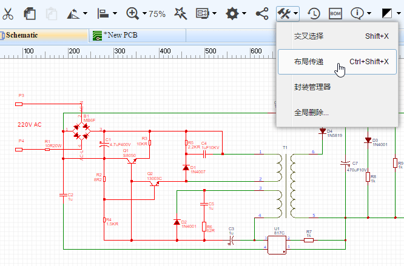

**使用方法**：

-	先将[原理图转为PCB](https://lceda.cn/Doc/Tutorial/Schematic.htm#原理图转PCB)并保存PCB至当前工程下。
-	用鼠标区域选择原理图的零件，点击“布局传递”，快捷键“CTRL + SHIFT + X”。
-	编辑器会切换至PCB，并将封装悬浮等待鼠标左击放置在画布上。
-	放置后鼠标仍为手掌拖动状态，点击封装即可进行细节调整。


**注意：** 

-	*在使用该功能前，你若尚未打开PCB，编辑器会自动为你打开。*  
-	*如果你工程内含有多个PCB，且尚未打开PCB，则编辑器会自动打开第一个PCB；若已经打开一个PCB，则对当前打开的PCB生效。*


## 全局删除

如果你觉得你的原理图和PCB太乱，需要批量删除时，你可以：

- **超级菜单 > 编辑 > 清除**，或者CTRL + A全选后，按Delete键删除。
- 删除文件并创建一个新的。  
- 使用工具栏的 **全局删除** 功能。  
  

  
## 封装管理器

如果你想批量修改封装，想知道零件引脚对应封装哪个焊盘，你可以使用封装管理器。

有两种方式打开封装管理器：

-	在工具栏点击齿轮图标 > 封装管理器。

   

-	选中你想要的零件后，在右边属性面板处点击封装输入框，即可弹出封装管理器。

  

1、打开封装管理器后，它会自动检查你零件的封装是否存在，是否正确。如果零件没有指定封装，或封装不在个人库和系统库中，或零件引脚编号与封装焊盘编号无法正常对应时， 封装管理器会在零件名前出现错误图标，并使零件名标红。    

-	例如：你的零件U1有两个引脚，编号分别是1、2，名称分别是VCC和GND；但是你用的封装的焊盘编号是A、B，所以左边列表会报错标红，要修正错误要么你将1、2改成A、B，要么将封装的焊盘编号A、B改成1、2；要么更换封装。

2、在零件和封装的预览窗口，你可以用鼠标点击拖动，滚轮放大缩小预览图。 


**注意：**   

-	*如果你的原理图使用了数量较多的不同名称的封装，封装管理器在检测封装焊盘编号与元件引脚编号的对应关系时，会与服务器进行封装数据查找和对比，这将花费一定时间，请耐心等待。*   
-	*如果你的工程下存在多个原理图文件，打开封装管理器时会将全部原理图打开，并加载所有元件。*


### 更新封装

如果你想更新封装，比如下图的Q1，从 **TO-92** 更新至 **TO220**。

-	在封装管理器搜索框输入**TO220**，然后搜索；
-	选择搜索结果中的**TO220**封装；
-	在预览窗口中检查是否正确；  
-	然后点击“更新”按钮。   

然后所选的零件封装已经更新为 **TO220**。

**注意：**   

-	*为了确保你使用的封装已存在于立创EDA的封装库中，请使用封装管理器更新而不是直接在封装输入框填入封装名称。*   
-	*更新封装后，若该封装不在你的封装库中，立创EDA会自动将该封装加入你的收藏中。*


**批量更新封装**

如果你想批量修改封装，可以按住“CTRL”键之后，通过鼠标逐一选择所有需要修改的零件，为防止选错，不支持按“SHIFT”批量选择。如果零件太多，可以在筛选框输入封装名称进行筛选需要修改的零件，如筛选`AXIAL-0.4`。  
如果你想选择自己的封装，可以在右上角“封装分类”下拉菜单选择“我的库文件”进行选择。


**编辑引脚映射**

你还可以在封装管理器里修改零件的引脚信息，包括编号和名称。其中Pin Name是指该元件的引脚名称；Pad Number是指元件的引脚对应的焊盘号，此处并非指预览窗口封装的焊盘号。


## 设计管理器

当原理图太大，和比较复杂时，很容易出现连接错误，这时可以使用设计管理器来进行查找错误。

使用快捷键“CTRL + D”或者在左边导航面板直接点击“设计管理器”打开。

-	**筛选器**: 方便地查找元件编号，封装名称，网络名，管脚名。
-	**器件**：选中一个零件后会在画布中高亮该零件，选中下方的Part Pins的管脚时，画布会出现提示线注明是哪个管脚。
-	**网络**：这里列出所有网络，每个网络至少连接两个引脚，否则这里会提示错误标志。
-	**Net Pins/Parts Pins**：这里列出网络连接到的引脚或元器件的所有引脚。


**注意：**

-	*若工程下存在多个原理图时，设计管理器内只会显示当前打开文档的元件与网络信息。故跨原理图的单个网络端口和网络标签可能会出现错误标志，请忽略即可。*


## 原理图库向导

立创EDA提供一个可快速创建原理图库符号的向导工具。

在工具栏点击打开，如果是在原理图库文档中可以在**“超级菜单” > “杂项” > “原理图库向导”**打开。

 

使用555定时器为例，当输入编号，名称，封装，选择样式，输入引脚名称后，点击确定即可自动生成一个元件符号。


原理图库向导目前暂时提供了三种图形样式： DIP, QPF 和 SIP 。


通过自定义引脚名字和封装，可以绘制方便识别的原理图库，比如下方自定义的含EBC说明的3极管2N3055符号。


## 放置元件子库

当一个元件存在太多引脚时，把它全部画在一个库文件中将会非常耗费空间，所以可以通过创建子库来进行多模块组合该元件。  

如搜索74HC04DB，一个二进制转换零件。如下图所示，该零件存在7个子库。


当依次放置它的子库在原理图时，如下图所示。


**注意：** 

-	*如果你只放置第一个子库，并放置多次，编号会从U1.1，U2.1，U3.1开始，所以一般放置第一个子库后需要依次放置其余子库。*

更多关于元件子库的信息清查看[原理图库文件：元件子库](./SchematicLibs.htm#元件子库)


## 元件属性

选中一个零件之后，可以在右边属性面板查看或修改它的属性参数。

1、**元件属性：** 你可以修改元件的名字和编号，并设置它们是否可见。还可以修改器件信息。

    

2、**自定义属性：** 在这里你可以修改元件的供应商，供应商编号，制造商，制造商编号，封装等。Mounted是指该零件是否在PCB板上贴片或者插件，该处在BOM体现。

3、**添加自定义参数：** 当你选中一个零件，可以它新增参数，若你勾选了“In BOM”，那么该项参数会在BOM表中体现。


## 元件引脚信息修改

当你需要修改一个元件引脚信息，你需要选中它，

-	可以在右边属性面板的“修改器件”对元件的引脚信息进行修改。
-	或者在 **超级菜单 > 杂项 > 修改器件** 打开。
-	或者使用快捷键“I”（字母 i）。

你可以修改元件的引脚名称，PCB前缀，Spice前缀，显示元件隐藏的引脚，元件引脚编号，Spice引脚编号等。
比如，你可以通过修改引脚编号来指定一个你想让它对应的封装；你也可以通过修改Spice前缀和Spice引脚编号来使它可以进行仿真。


**注意：**

-	*显示了元件隐藏的引脚后无法再通过此选项将该引脚再次隐藏，你需使用工具栏的撤销功能。*

### PCB前缀与Spice前缀

原理图中的元件，除了元件编号和用在PCB上的PCB前缀之外，还有一个用于Spice仿真的**Spice前缀**。

**PCB前缀**是在生成PCB时元件对应封装的编号。基本上原理图编号与封装编号是一致的。比如你将原理图的U1的PCB前缀改为K1，那么它转为PCB时的封装编号就是K1.

**Spice前缀** 用于告诉仿真器，该个符号表示哪个电路元件，用于什么样的仿真模型，它的分配规则比较严格。

大多数Spice电路元件的仿真模块采用单行的 .model 语句形式，但其中一些可能采用多行形式 .subckt 子电路进行定义。 例如，一些MOSFET可以用一个.model语句描述，在这种情况下，它们的Spice前缀是**M**，但许多MOSFET由.subckt描述，所以它们的Spice前缀是**X**。

因此，无论为原理图符号选择的PCB前缀如何，给定电路元件的原理图符号的Spice前缀必须与仿真原理图中该电路元件的实例所需的模块类型相匹配。

大部分Spice前缀与元件的关联列表如下：


更多关于Spice仿真模块的内容请访问NgSpice：[http://ngspice.sourceforge.net/docs/ngspice-manual.pdf#subsection.2.1.2](http://ngspice.sourceforge.net/docs/ngspice-manual.pdf#subsection.2.1.2)


### 元件引脚编号与Spice引脚编号 

-   元件引脚编号： 这些编号是元件所需对应封装中真实的引脚数字。 它们是必需存在的，可使原理图中的器件符号的引脚可以映射到PCB中的占用空间的物理引脚上。 换句话说，原理图中显示的连接最终通过PCB上的铜线连接来体现。

-   Spice引脚编号： 这些编号是将原理图符号上的引脚映射到Spice仿真或子电路中对应功能的编号。


## 元件编号起始

每个新建的原理图，在右边的自定义属性下有一个 `Prefix Start` 选项，该选项的作用是给放置的元件设置开始的编号，默认开始的编号是从1开始。若你使用多页原理图时，不希望第二页原理图的元件编号从1开始，那么你可以给它设置为200,300等，那么你放置元件的编号就会变成U200，U201，U202等。


## 元件编号冲突

若你的原理图和工程下存在两个相同元件编号，当你进行电路仿真、打开设计管理器、转换到PCB过程中，会提示编号冲突，因为在正常情况下原理图和工程中不允许存在两个相同编号的零件。

如下图，因为存在两个 R4 所以在仿真的时候出现报错，这时你需要将其中一个编号修改为原理图中不存在的编号。


如果你在同一工程下复制一个原理图做备份，在转换为PCB时会提示编号冲突，那是因为立创EDA在工程下的原理图均视为属于同一个工程，在转换PCB时是将工程下的所有原理图合并后转在同一个PCB。所以你需要将备份文档放置在另外一个工程下。


## 多网络标签

立创EDA原理图中已经允许多个不同网络名称同时存在同一条导线上。

当你进行电路仿真、转换为PCB时，仅选择第一放置的网络标签作为网络名，如下图的NETLABEL1。


在原理图设计管理器点击其中一个网络标签时，均会高亮其所在的网络导线。

**注意**：

-	*如果你在导线1放置了网络标签A、B、C，在导线2放置了名称为A的网络标签，那么导线1和导线2会是属于同一个网络。*


## 标注

当你创建了一个拥有较多数量元件的原理图时，很可能会出现编号重复，缺失等问题。如果你不想一个个去检查修改，你可以使用“标注”功能进行全局修改。

可以在 **超级菜单 > 杂项 > 标注** 打开。


**应用范围：**

-   **仅当前原理图**： 标注功能只对当前的原理图有效。
-   **所有打开的原理图**：  标注功能只对所有打开的原理图有效。

**注意：** 

-	*使用所有打开的原理图选项时，即使是不同工程下的原理图也会被进行标注处理。如果你只想标注一个工程下的原理图，你需要将它下面的原理图全部打开，并且关闭其它工程的原理图。*

**方法：**

-   **重新标注**：对全部零件编号进行重新标注，包括已经存在的编号。
-   **保留原来的标注**：只对新增的还没有分配编号的零件进行标注，原来存在编号的零件不做变更。

**方向：**

-	**行**：从顶部第一行开始，从左到右开始编号。
-	**列**：从左边第一列开始，从上到下开始编号。

**标注：**点击后进行标注操作。

**重置：**如果你想将全部零件编号的数字都改成 “？”，你可以点击它，效果如 R1 变成 R?，U1 变成 U? 等。

**注意：** 

-	*当你点了标注按钮后，重置按钮并不能恢复你原来的标注。*
-	*如果你标注后不满意可以使用工具栏的撤销按钮(快捷键CTRL+Z)恢复。但如果你标注保存并关闭文件后，再打开文件将不能恢复原来的标注状态。*
 


## 原理图转PCB

当你完成了原理图绘制，想要转换为PCB，你可以点击工具栏上面的图标**原理图转PCB**，或者点击 “**超级菜单 > 杂项 > 原理图转PCB**“

**注意：** 

-	*在你进行转换PCB之前，请先在设计管理器和封装管理器检查是否存在错误。*


**PCB库搜索顺序**

在转换为PCB时，编辑器会优先匹配你个人的封装库，收藏库，如果没有匹配，则会在系统库中查找。

比如你放置了一个三极管Q1，默认封装是**TO220**，且你没有重新为它指定封装，若在你的“我的库文件”中存在一个同名的**TO220**封装，那么在转换为PCB时，Q1的封装编辑器会优先匹配你个人的封装，并忽略系统的同名封装。

**校验封装和生成PCB**

点击“原理图转PCB”后，如果编辑器检测到你的元件封装不存系统库中在或者元件无封装，会弹出错误对话框，并且转换动作不会继续进行。  
点击下图的表格会打开封装管理器，你逐一修改/更新封装后，再重新转PCB即可。  


转换成功后会如下图所示，自动生成一个PCB边框，并将PCB封装按照顺序排列成一排，蓝色的飞线表示两个焊盘之间需要进行布线连接，属于同一网络。


### 更新PCB

当你已经完成转PCB动作，但是又再次修改了原理图，这时你无需转一个新的PCB，只需点击“更新PCB”即可将变更更新至现有的PCB文件。

      

你也可以在PCB中直接导入变更。


**注意：**

-	*网络名是自动生成，当你修改了原理图后部分网络可能会出现变更，那么更新至PCB后会导致原网络走线丢失！*
-	*PCB导入变更后你将无法撤销！*


## 原理图层级

立创EDA不支持真正意义上的分级设计，但是支持多页原理图并支持全局网络，你可以在一个工程下放置多个原理图图文件，并将它们通过相同名称的网络标签和网络端口连接起来。


比如你在原理图A和原理图B均放置了网络标签A、B、C，那么在转PCB时编辑器会自动将原理图合并，使网络连接起来。


**注意：** 

-	*请让工程内的元件编号保持唯一，否则会出现上文所说的编号冲突。*

**提示：**   

*每个原理图的元件编号默认从1开始。如 R1, C1, U1 等。*   
*1. 你可以使用上文的标注功能进行重新标注编号。*  
*2. 你可以把起始编号改为100等，那么元件编号就可以 R100, C100等开始编号。*   


## 原理图模块

立创EDA支持原理图模块功能，以利于电路模块的复用，避免进行原理图的复制粘贴时出错。

创建方式：**“另存为模块”**和**“文档” > “新建”> "原理图模块"**。

 

原理图模块保存在“元件库”> “我的模块”中，下次使用在这里直接放置即可。

  


## BOM与网表

立创EDA支持导出BOM表和网表，更多信息请查看 [导出](./Export.htm#导出)章节。


# 原理图库文件

如前面章节所说，可以使用“原理图库向导”和“组合/解散”功能创建一个原理图库符号，创建后如果要在其他的原理图文档中使用该符号，可对它进行复制(快捷键CTRL + C)，切换文档后粘贴(快捷键CTRL + SHIFT + V)。但这两种方法创建的库文件不会保存在“我的库文件”中，所以需要保存在“我的库文件”中时，可创建一个原理图库文件。

新建方法：**文档 > 新建 > 原理图库**。


填写相关信息后，会打开一个空白库文件。此时你可以使用前面的“原理图库向导”或者使用“绘图工具”进行绘制图形，在工具栏上点击引脚图标进行放置引脚(快捷键 P )。在原理图库文档中已无需“组合/解散”功能，故立创EDA没有提供在绘图工具上。

若需要修改原理图符号的引脚映射，你可以在：**超级菜单 > 杂项 > 引脚映射** 中打开。

**注意：**

-	*建议在新建一个原理图库之前，先在“元件库”中搜索，可避免重复工作，或者可以在相近元件的库文件上直接编辑另存为一个新的库文件，以减少工作量。*
-	*符号图形请在原点上创建，尽量保持原点在元件中央，以便于元件翻转和旋转操作，元件放置在原理图画布时鼠标光标的位置就是原点的位置。若你偏离原点创建，在放置的时候，编辑器会自动将鼠标光标移动在元件中心处。*


## 管脚属性

原理图符号的引脚是元件最重要的组成部分之一，它允许进行导线连接以构成整个电路。

在工具栏点击使用或者使用默认快捷键“P”。


**管脚方向**

在放置在画布上之前，可以按空格键进行选择到想要的方向。

管脚的带圆圈端点是可进行导线连接的地方，所以该点正常需朝外放置。


如下图，左边图片是元件管脚的正确放置方式。


**管脚属性**

当你选中一个管脚时，可以在右边的属性面板查看和修改它的属性。


-	**方向**：只支持 0°、90°、180° 和 270°。若你需要放置45°的引脚，你需要将引脚长度改为0，然后用画图工具画出45°线段。

-	**起始X，起始Y**：引脚端点的坐标。你可编辑它的坐标到达你想要的位置。

-	**长度**：引脚长度。

-	**名字**：引脚的名字，如上图选中的引脚名字为“VCC”。

-	**编号**：如上图选中的引脚编号为“8”。该编号与元件对应的封装的引脚编号相对应，并且两者的编号需要一致。你还可以使用带字母的编号，如 A1, B1, C1, A2, B2等。

-	**Spice管脚编号**： 这些序号是将原理图符号上的引脚映射到Spice仿真或子电路中对应功能的编号。

-	**显示名字**：可选择是否隐藏管脚名称。

-	**显示编号**：可选择是否隐藏管脚编号。

-	**颜色**：你可以单独为管脚设置颜色，该颜色会共同应用在管脚名字和编号上。你不能单独为它们进行设置颜色。

-	**Dot**：是否将一个圆添加到管脚的内端，以表示逻辑(或模拟)反相。

-	**时种**： 是否将一个“>”添加到管脚的内端，以表示逻辑时钟输入。

-	**显示引脚**：可设置改引脚是否隐藏。当隐藏了该引脚后，放置该元件在原理图中将看不见该引脚。该隐藏功能只在原理图中体现，在原理图库编辑界面下一直保持显示状态。  
若在原理图想将它显示，只需在元件属性中“修改器件”将“隐藏的引脚”选项取消勾选即可。  
若你设置一个引脚的电气特性为Power，名称设置为VCC，且已将它隐藏，那么在原理图中它会自动与VCC电源(网络标签)连接，该功能可以让使用了多模块元件的原理图变得更加整洁清晰。

-	**电气特性**：包含Undefined(未定义)、 Input(信号输入)、Output(信号输出)、 I/O(信号输入/输出)、 Power(电源)。该功能在仿真时用。默认是Undefined。

-	**字体及大小**：你也可以很方便的每个管脚名字和编号设置字体与大小，便于识别。

**注意：**

-	*你可以很方便地使用鼠标对管脚编号和名字进行位置调整，但是当你需要翻转或旋转它们时，管脚整体都会被翻转或旋转，立创EDA不允许单独翻转其中一个。*
-	*立创EDA已经提供电气规则检查 (ERC)，但是你仍然需要为你的元件库文件设置电气特性。*

##自定义属性

在原理图库画布中，点击空白处可在右边属性面板查看元件属性，此处的元件属性与在原理图中单击元件时的元件自定义属性基本一致。在原理图中对元件修改的自定义属性仅对所在文档有效，在原理图库画布中设置的自定义属性对该元件的每次放置有效。


-	**Supplier**：供应商名称，新建默认为Unknown。修改为其他供应商后，会自动出现供应商编号输入框。

-	**Mounted**：是指该零件是否在PCB板上贴片或者插件，该处在BOM体现。

-	**Package**：击输入框，即可弹出封装管理器。并为元件库文件指定封装。

-	**Prefix**：默认的原理图库符号前缀是 **U?** ，子库符号前缀是 **U?.1**。如果你创建了一个电阻你可以设置为 **R?**。

-	**Name**：元件库文件的名称。

-	**Contributor**：显示你用户名，立创EDA使用了你的库文件时会看到你的名字。

-	**增加参数**：可新增你想要的参数，如你自己的物料编号。是否包含在BOM。


## 我的库文件

编辑完成后保存 `CTRL+S` 会打开一个对话框，以输入元件名称和描述：


点击确认后，你可以在左边导航面板“元件库”> "我的库文件" > “无标签”中找到它。
  


**标签**

你可以选中它，点击右键“修改”或者右下角“更多”> "修改" 为它添加一个标签。添加后可以在原理图库列表下出现，该元件将出现在该标签下，你可以给一个元件添加多个标签，但建议只添加一个即可。

若你需要再次修改符号，你需要点击下面的“编辑”按钮。

关于元件库的功能更多请查阅前面的[原理图绘制：元件库搜索与放置](./Schematic.htm#元件库搜索与放置)章节。

## 元件子库

当一个元件存在太多引脚时，把它全部画在一个库文件中将会非常耗费空间，所以可以通过创建子库来进行多模块组合该元件。所有子库合在一起时是一个完整的元件。每个子库均对应同一个封装，仅对应的焊盘编号不一样。  

在前面“原理图绘制：元件库搜索与放置”章节已经提到元件子库的放置。

当你创建了一个库文件，在“元件库” > “我的库文件”中选中新建的库文件，点击右键“添加子库”即可依次添加子库

如下图，每次添加子库均会产生一个名称带 .1 ，.2，.3 等的子库文件。


添加后并对每个子库进行双击或者点击下方的“编辑”按钮进行编辑图形，引脚及编号等属性，保存后即可完成一个含子库的原理图库文件的创建。

**注意：**

-	*含子库的元件仅在父库指定一个封装即可，若你为每一个子库均指定不同的封装，那么立创EDA将保留最后一个指定的封装做为元件的封装。*


# PCB编辑器 

新建PCB编辑器有两种方式。  

-	前面章节中通过原理图转为PCB。
-	在“文档”>“新建”> “PCB”新建打开。

正常来说，在绘制PCB前，需要先设置PCB板子边框和设计规则。边框和设计规则请查阅后面章节。

## 画布 

**画布属性**

PCB画布属性和原理图画布属性大部分一致。点击PCB空白处在右边面板可以修改画布的尺寸单位，网格等。目前支持mm，inch，mil三种单位，精度至小数点后两位。


PCB中大部分对象，在选中它后，基本都可以在右边属性面板查看和修改它的属性。

**其他**

-	**线宽：**这里设置默认布线线宽。
-	**拐角：**设置默认布线的拐角方向。有：45°，90°，圆弧，任意角度。
-	**覆铜区：**这里可设置铺铜区域是否可见。选择否之后铺铜将消失，仅保留铺铜的边框。
-	**增加参数：**该参数仅对PCB画布用，可以做信息标记，不会应用到BOM和Netlist中。


## PCB工具

PCB工具提供很多功能以满足你绘制PCB的需求。  
有导线，焊盘，过孔，文本，圆弧，圆，拖动，通孔，图片，画布原点，量角器，连接焊盘，覆铜，实心填充，尺寸，矩形，组合/解散。


### 导线 

在原理图中使用快捷键“W”绘制导线，在PCB绘制导线的快捷键也是“W”。

**导线属性**

当你选中一条导线时，可以在右边属性面板修改它对应的属性。  
  


**使用技巧**

1.  单击左键开始绘制导线；再次单击左键确认布线；单击右键取消布线；再次点击右键提出绘制导线模式。

2.  在顶层绘制导线的同时，使用切换至底层的快捷键“B”，可自动添加设置的过孔，走线并自动切换至底层继续布线。
   

3.  在布线过程中使用快捷键“+”，“ - ”可以很方便地调节当前的走线的大小。

4.  双击导线线段会增加一个节点，选择节点拖动可以调节走线角度。也可以通过拖动导线的末端端点将导线拉长或缩短。
  

5.  点击选择一个线段，可以拖动调整其位置。  
  

6.  在布线过程中可以使用快捷键“L”进行布线角度切换。
  

7.  使用空格键改变当前布线的方向。
  

8. 在走线过程中，想撤销上一段走线可以通过删除键“Delete”撤销。

9. 当按住“Shift”键并双击左键可以删除导线的线段。


### 焊盘 

放置焊盘的快捷键是“P”。
当你选中一个焊盘时，可以在右边属性面板修改它对应的属性。  


**编号：**若不是单独放置的焊盘，该编号会与原理图库文件的引脚编号相对应。  

**形状：** Round(圆形) , Rectangular(矩形) ,  Oval(椭圆形)和Polygon(多边形)。 如下图所示，选择多边形可以通过“编辑坐标点”创建复杂的形状。  
 

**层：**如果放置的焊盘是SMD类型或想它出现在单层，那么层请选择顶层或底层；若需要放置通孔类型焊盘，那么层请选择全部，焊盘将在顶层和底层出现。  

**网络：**如果PCB由原理图转来，此处会默认生成网络；若是单独放置的焊盘，此处为空。你可以无需为它设置网络，当走线连接到它时，将自动为它添加网络。  

**宽和高：** 当图形设置为圆时，宽和高会等值；当图形设置为多边形时，宽和高将不允许编辑。

**旋转角度：**你可以设置你想要的任意角度。

**Hole Shape：**内孔形状。有Round(圆形)，Slot(槽形)。普通的DIP封装以及电容等都是圆形钻孔，但某些特殊元件的安装脚需要长方形、椭圆形或其他类型的通孔。这些长方形、椭圆形或者其他类型通孔都算作槽孔。

**孔直径：**这是通孔焊盘的钻孔直径， 若是SMD类型焊盘请设置为0。

**中心X和中心Y：**修改这两处数值可以修改焊盘在画布中的位置。

**Plated：** 该焊盘是否有铜。当使用焊盘制作一个螺丝无铜通孔时，需选择否。

**注意：**

-	*编辑坐标点仅在图形为Polygon(多边形)时有效；第一个坐标点在左下角，数值为X Y，单位跟随画布。*

### 过孔

当你绘制一个双层板或多层板时你可以放置过孔，使顶层和底层导通。

**使用技巧**  

在走线上放置两个过孔，然后就可以将两个过孔间的走线切换至其他层，或者移除。


**注意：**

-	*立创EDA不支持内层填埋孔，所有的过孔均可以在顶层和底层看见。。*


### 文本

因涉及字体版权，立创EDA暂时不支持自带其他的字体。
如果你需要输入汉字，或者需要不同的字体，你需要自行添加你电脑上的字体。免费字体可以在 [Free Fonts: www.1001freefonts.com](http://www.1001freefonts.com/) 上查找。

**添加方法**

放置一个文本，并点击它，然后在右边属性面板字体处添加字体。  
  

点击“Add”按钮，并在打开窗口选择你电脑本地的字体文件后确认即可添加完成。字体文件必须是 `ttf` 或者 `otf`格式。
  


**注意：** 

-	*立创EDA不会保存你的字体在服务器，所以每当你关闭编辑器后再打开，你必须重新添加字体。*
-	*如果你使用的是自添加的字体，字体属性中的宽度设置将无效，你只能修改字体的高度。*


### 圆弧

你可以使用圆弧工具画出不同大小的圆弧，创建布局酷炫的走线图案。可通过两个圆弧合并成一个圆。

  

立创EDA提供了两种画圆弧的工具：

-	先确定起始点，然后确定末点及半径。  
  

-	先确定圆心，然后确定半径及起点，再确定末点。   
  

**圆弧属性**

点击圆弧后可在右边面板进行属性修改。  
**层**：使用圆弧工具画的圆弧可更换多个层。有：顶层，底层，顶层丝印层，底层丝印层，边框层，文档层。
  


### 圆

在PCB工具里面提供的圆工具所画的圆，只能支持在丝印层和文档层绘制，如果你想在顶层或底层绘制一个圆，你必须使用圆弧工具绘制。   
   

### 移动

该功能与原理图工具的移动几乎一致。  
   

当使用该工具移动封装时，连接的走线会与其他封装分离并跟随移动，表现与直接鼠标批量选择后移动一致。

其他关于封装移动的提示：

-	当单选一个封装时，用鼠标移动，走线会拉伸跟随，不会分离；
-	当单选一个封装时，用方向键移动，走线会与封装分离，仅移动封装。


### 通孔

由于很多用户不知道如何通过焊盘，过孔来创建通孔，故立创EDA特意提供了一个通孔功能。可在属性设置其直径大小。


### 图片  

在PCB和PCB库画布下，立创EDA支持添加图片。


点击插入图片功能，会打开一个窗口，你可以添加你需要的图片，立创EDA支持 `JPG`, `BMP`, `PNG`, `GIF`, 和`SVG`格式的图片。  
  

添加图片后，可以：

-	预览图片：左边为原图预览，右边为调整后的图片效果预览。
-	颜色容差：数值越大，图像会损失越大。
-	简化级别：数值越大，图像边沿会更圆润。
-	图像反转：选择后，原本高亮区域会被挖图。
-	图片尺寸：设置你要插入的大小。

图片会插入在当前编辑的层，如果需要换层或修改其他属性，可以点击它后在属性处修改。
  


### 画布原点

你可以设置画布原点以满足定位要求。该功能与原理图的画布原点功能一致。

### 量角器

立创EDA提供一个量角器方便位置确定。
点击后先确定圆点，再确认长度，最后确认角度。  
选中它后，可修改其属性。其中层支持顶层丝印，底层丝印和文档层；精度最高支持小数点后两位。


### 连接焊盘

当创建一个无原理图的PCB时，焊盘之间由于没有网络，所以不会出现飞线。使用“连接焊盘”功能可以使它们连接起来，帮助你减少出错。 

点击后，你点击两个无网络的焊盘，即可自动为它们设置相同网络名，并产生飞线：

  

或者你也可以直接为两个焊盘分别设置相同的网络，飞线会自动产生：

  

更多关于飞线的信息，请查阅 [**飞线**](./PCB.htm#飞线) 章节


### 覆铜 

如果你想保留整块铜箔区域使其接地或者接电源，你可以使用“覆铜”功能。  
点击后可以围绕你想铺铜的区域绘制铺铜区，一般沿着板子边框或在板子边框外部绘制，顶层和底层需要分别绘制。一块板子可以绘制多个铺铜区，并分别设置。

选中铺铜线框，可以在右边修改其属性。


**层：** 可以修改铺铜区的层：顶层、底层、内层1、内层2、内层3、内层4。

**网络：** 设置铜箔所连接的网络。

**间距：** 铺铜区距离走线和焊盘的间隙。

**焊盘连接：**焊盘与铺铜的连接样式，直接连接还是十字连接。

**保留孤岛：**是或否。即是否去除死铜。若铺铜没有设置网络，那么整块铺铜都将被视为死铜而去除，若想保留铺铜，可选择保留孤岛或为铺铜设置网络。

**填充样式：** Solid(实心填充)和None(无)。选择None可以使PCB更清晰，并且PCB成品将无铜箔，只有走线和焊盘。

**重建覆铜区：**若你对PCB做了修改，或者铺铜属性做了修改，那么你可以不用重新绘制铺铜区，对其重建即可。


绘制铺铜后，建议不要将铺铜网络留空，否则很容易产生电磁干扰(EMC)和信号完整性(SI)问题。

**使用技巧**

-	使用快捷键 `Shift+B` 重建所有铺铜区。
-	使用快捷键 `Shift+M`  清除所有铺铜区。

### 实心填充

立创EDA提供了一个名叫实心填充的功能。  


绘制后点击实心填充的区域可以在右边修改其属性。  


-	**层：**支持将实心填充切换至其他层：顶层，底层，顶层丝印，底层丝印，文档，NPTH。
-	**网络：**在顶层和底层时，可以对其设置网络使其具有电气特性。
-	**类型：**Solid(实心填充)，NPTH(Non Plated Through Hole：非镀铜通孔)，Cutout(挖空)。
	-	**Solid**：通过设置网络且类型为Solid，可以很容易将多个焊盘连接起来，效果与前面的铺铜类似。

	-	**NPTH**：当设置实心填充类型为NPTH时，其所属的层也会自动切换至NPTH。实际PCB生产时会将此区域挖穿(非镀铜通孔)。铺铜后效果与照片预览效果如下图所示。
	-	**Cutout**：该类型仅将铺铜区的铜箔挖空，铺铜不再对该区域铺铜。铺铜后效果与照片预览效果如下图所示。


### 尺寸与量测 

尺寸标识与距离测量对于PCB和封装库来说非常重要，立创EDA提供了两种方法。

1. **尺寸工具：**该工具有三种单位，跟随画布单位设置。
   当你选中尺寸的末端端点，你可以对其进行拉伸和缩小。并可以对其属性进行设置。   
  

2.  **量测工具：**使用快捷键“M”或者通过 **超级菜单 > 杂项 > 量测距离**，然后点击你想量测的两个点。单位跟随画布单位设置。
  


### 矩形

矩形工具与实心填充很相似，但是矩形不能设置网络，不能设置为NPTH层，也不能设置类型。


### 组合与解散

与原理图的组合/解散功能类似，原理图的是对原理图库符号作用，PCB的是对封装起作用。
使用方法原理图的组合/解散功能一致。


## 层工具 

PCB设计会经常使用层工具，它可以随意拖动位置，用来展示当前活动层。在这里对不同层进行切换编辑。  
点击层对应的眼睛图标可以使其是否显示该层；点击层的颜色标识区，使铅笔图标切换至对应层，表示该层已进入编辑状态，可进行布线等操作。


切换层的快捷键如下：

-	**T：** 切换至顶层 
-	**B：** 切换至底层
-	**1：** 切换至内层1  
-	**2：** 切换至内层2
-	**3：** 切换至内层3
-	**4：** 切换至内层4

**层配置**

点击层工具右上角的齿轮图标，或者通过 **超级菜单 > 杂项 > 层配置** 打开设置界面。

在配置界面，你可以修改层的显示颜色，可以勾选你需要使用的层，如果你需要画多层板，可以将最多4个内层勾选。如果你需要更多层，请联系立创EDA。


## 边框

在放置封装前，需要先绘制板子边框。边框需在“边框层”绘制。先切换至“边框层”，再使用导线或圆弧进行绘制。


当使用原理图转PCB时，立创EDA会自动生成一个边框，该边框内面积大小是总封装面积的1.5倍。
若你不喜欢该边框，你可以将它删除后自己重新绘制。  工具栏上的“全局删除”功能可以进行快速删边框。  


立创EDA提供了一个边框设置向导，通过它可以很方便的设置边框。
可通过：**超级菜单 > 杂项 > 边框设置** 或者在工具栏的“工具”图标下“边框设置”。


在对话框里你可以选择3中类型的边框：矩形，圆形，圆角矩形。并设置对应参数。

如果你需要创建一个复杂的边框，你可以通过导入一个DXF文件生成。DXF可以由CAD等软件进行绘制生成。

## 飞线

当两个封装的焊盘网络相同时，会出现飞线，表示这两个焊盘可以通过导线连接。


如果你想关闭某条网络的飞线，你可以在设计管理器中将该网络的勾去掉；如果你把勾去掉后仍然对它进行布线，那么走线将不会显示出来，仅会显示网络名称在走线的路径上。


基于该技巧，你可以在布线前将GND网络去掉，在后面铺铜时再打开，可以减少飞线的干扰。

如果你想高亮飞线的颜色，你可以切换至飞线层；如果你想改变飞线的颜色，你可以在层配置里面进行修改。


## PCB网络

**显示网络名称**

编辑器支持在走线和焊盘上显示当前的网络名称，如果想关闭，可以通过：**超级菜单 > 查看 > PCB网络可见**，或者在工具栏上“配置”功能里“PCB网络可见”，也可以使用快捷键“Q”。


**网络长度**

当你选中一条走线，再使用快捷键“H”， 编辑器会高亮整条网络并弹窗提醒走线的总长度。


## 封装属性 

当你鼠标经过封装时，封装整体高亮后点击即可选中整个封装，可在右边属性面板对其属性进行查看与修改。


-	**编号：**与原理图的编号相对应。  
-	**层：**含顶层和底层，切换后封装将切换至对应层。当切换至底层，封装会镜像显示，因为在立创EDA下绘制底层是以顶视图绘制。  
-	**X左坐标和Y坐标：**可修改封装坐标。  
-	**旋转角度：** 旋转角度以封装自身原点旋转。
-	**序号：**立创EDA会自动为每一个对象分配一个序号，做文件保存时的标识，你无法对其修改。  

**自定义属性**

这个与原理图符号的自定义属性基本一致，无原理图PCB封装添加参数后，选择In BOM可在BOM中体现。

**批量修改封装属性**

立创EDA目前允许部分对象批量选择后修改属性。使用“CTRL”+ 鼠标点选进行批量选择。
如选择了3条不同的走线后，可在右边修改它们的宽度，层，网络。


其他可修改的对象有：焊盘，过孔和文本等。


## 绘制无原理图PCB 

在一些小PCB制作，你可能并不需要绘制原理图。 立创EDA允许你直接进行PCB绘制。

新建一个PCB文档后，在坐边导航面板的**“元件库”**中搜索和放置你所需要的封装。可对每个封装添加自定义属性，以便于导出BOM表。

之后你可以根据前面叙述的连接焊盘功能将网络连接起来，再进行导线和其他绘制。


## 设计管理器 

PCB的设计管理器与原理图的设计管理器一样，在左边导航面板找到；也可以通过快捷键“CTRL + D”切换至设计管理器。

在PCB设计管理器下，你可以：

-	选中一个封装并使它在画布中高亮。

-	勾选或不勾选可以使封装显示或隐藏。

-	在筛选器搜索你想要的器件或网络。

-	选中一个网络后，可以高亮全部与它连接的走线，过孔和焊盘。

-	勾选或不勾选一个网络可以使整个网络(包含导线)显示或隐藏。

-	双击一个网络名可以将它的所有导线连接删除，以便重新绘制走线。

-	查看PCB的DRC错误信息列表。


## 导入变更 

当你修改了原理图，你可以很方便地导入变更。

-	1、可使用原理图的“[更新PCB](./Schematic.htm#更新PCB)”功能。

-	2、直接在打开PCB导入更新。**超级菜单 > 杂项 > 导入修改信息**，或者点击工具栏的导入变更图标。


如果原理图存在错误，会直接弹窗提醒，如标注重复，封装缺失等。  


若无问题将弹出确认对话框：  


若确认无问题点击“应用修改”即可更新PCB。

**注意：**

-	*网络名是自动生成，当你修改了原理图后部分网络可能会出现变更，那么更新至PCB后会导致原网络走线丢失！*
-	*导入变更后你将无法撤销！*

## 无效封装

有时候当你转原理图至PCB时可能会提示无效封装。这是因为封装的焊盘编号与原理图库文件的PCB引脚编号不一致导致的。


如上图的R5，在原理图中R5的PCB引脚编号是A，B：


在PCB中，R5的焊盘编号分别是1，2。故无法与A，B对应，导致无网络生成。


为了解决这个问题，你可以：

-	修改原理图符号。如上图原理图R5，直接编辑R5的PCB引脚编号分别为1、2，并更新PCB即可。

-	修改封装焊盘的编号。如上图封装R5，直接修改R5的焊盘编号分别为A，B即可。


## 设计规则检查

立创EDA提供一个可实时运行的设计规则检查(DRC: Design Rule Check)功能。

可在 **超级菜单 > 杂项 > 设计规则设置** 打开设置对话框。  设置里面的单位跟随当前画布的单位。
   

当打开实时设计规则检测功能，在你设计出现超出规则的错误时会直接出现高亮的X标识提示错误位置。如下图的走线间，和走线到焊盘间太近导致出现错误标识。   


你可以在设计管理器中查看DRC错误信息。  点击错误选项会在画布中央高亮显示其位置。


**注意：**

-	*当你直接通过原理图转为PCB时，实时DRC检查是开启的，但是之前的旧PCB文档是关闭的，你需要自行打开。*
-	*设计规则检查只能帮你发现部分很明显的错误。*

## 自动布线

当你设计一个简单的PCB板子时，或者设计要求不高希望自动布线时，那么你可以使用自动布线功能。在进行自动布线前，你需要设置PCB边框，并将封装放置在边框内。

在**超级菜单 > 杂项 > 自动布线**或者点击工具栏的自动布线图标，打开自动布线设置界面。  设置里面的单位跟随当前画布的单位。


-	**线宽**：自动布线的默认线宽。  
-	**通用间隙**：指走线之间，走线与焊盘之间的间隙。  
-	**SMD间隙**：SMD焊盘之间的间隙。  
-	**过孔直径和孔直径**：过孔直径。  
-	**清除已有布线**：若你要保留你之前的布线，你不能勾选该项。  
-	**实时显示**：是否实时显示布线状态。  
-	**布线层**：选择你要布线的层数。你的PCB开启了内层后此处的内层才可以勾选。  
-	**布线服务器**：
	-	**云端**：使用立创EDA的服务器进行自动布线。
	-	**本地**：使用本地布自动线服务器，当你打开配置对话框时，编辑器会自动检测本地布线服务器是否可用，使用方法请看下面的说明。
-	**忽略网络**：选择无须自动布线的网络。若你的铺铜连接到GND，你可以选择忽略GND网络。  
-	**特殊网络**：允许设置特殊网络的线宽与线距。如加粗电源走线。  

**注意：**

-	*设置的参数不能少于DRC设定值，否则将报错。*  


设置完毕后，点击运行即可进行自动布线。完成后如下图所示。
 


### 本地自动布线

立创EDA建议用户使用本地布线服务器，当使用云端服务器时，如果使用人数较多，自动布线将会产生排队、布线失败等现象。

下载地址1(百度网盘)：[EasyEDA Router.7z](https://pan.baidu.com/s/1eRT18kE#list/path=%2F)  
下载地址2(Google Drive)：[EasyEDA Router.7z](https://drive.google.com/drive/folders/0BwqCaNlgtS3UZkM3UFZqVkRqNHM)  
下载地址3(GitHub)：[EasyEDA Router.7z](https://github.com/dillonHe/EasyEDA-Documents/tree/master/Tutorial/Doc)  
 
下载后解压至非系统文件夹。

支持的操作系统：

-	Win7 64位及以上
-	Ubuntu 17.04 64位及其它64位Linux系统
	
在点击“自动布线”图标前，前请先配置浏览器和运行对应的脚本。	

运行本地布线：
	
-	在Windows下双击win64.bat
-	在Linux下控制台执行"sh lin64.sh"

先配置浏览器：

**注意：**  *请务必使用最新版的谷歌浏览器或火狐浏览器！！！*

**1)Chrome谷歌浏览器**

Chrome谷歌浏览器无需配置，如果你的本地自动布线无法使用，请检查是否已经使用了最新版的谷歌浏览器，需v60.0.3112.78及以上。

**2) Firefox火狐浏览器**
	
1. 在地址栏输入"about:config"并按回车
2. 搜索并双击如下参数（置为"true"）：  
		`network.websocket.allowInsecureFromHTTPS`  
		`security.mixed_content.block_active_content`
3. 重新打开火狐浏览器进行本地自动布线。


本地布线服务器可用时，对话框内有提示。点击“运行”后可以运行窗口提示如下：


**提示：**


如果自动布线失败，你可以尝试以下操作：

-	忽略GND网络，并铺铜和设置铺铜网络为GND。
-	使用小的线宽和间隙，但要确保线宽大于6mil。
-	先将重要的网络进行手动布线。
-	添加更多的层。
-	云端自动布线耗费服务器CPU资源，使用人数多时会容易失败，请耐心等待或者使用本地布线服务器。
-	不要在网络名使用特殊字符，如 # $ & <> @ 等。
-	其他的将详细故障信息告知我们，并将你的PCB文件以EasyEDA源码文件的格式发送至3001956291@qq.com。

建议使用手动布线，自动布线没有手动布线的工整和美观；手动布线可以锻炼布线能力提升经验；减轻立创EDA服务器负担。


## 照片预览

立创EDA暂未提供3D照片预览，但提供了2D照片预览。在PCB下，在工具栏点击打开。若该图标未出现，请重置工具栏图标：**齿轮图标  > 常用按钮设置 > 重置**。


在切换至照片预览后，可在标签上方切换层，选择颜色等。


画布背景默认黑色含网格且属性面板隐藏，你可以在右边点击收缩按钮展开属性面板并设置属性。


## 生成制造文件

当你完成PCB设计之后，你可以生成Gerber文件，通过：**超级菜单 > 杂项 > 生成制造文件**，或者点击工具栏上的生成制造文件图标：


点击后会打开一个下载页面，点击下载即可。


如果你需要PCB打样，建议通过立创EDA的兄弟公司嘉立创：[www.sz-jlc.com](www.sz-jlc.com)

当然，你也可以将导出的Gerber文件发给任意一个厂家进行生产，立创EDA并没有做任何使用限制！！


# 创建PCB库

如果你需要一个PCB封装，但是立创EDA的元件库中不存在，那么你可以自行进行创建。

创建PCB库与创建原理图库几乎一致，你可以通过：**文档** > **新建** > **PCB库** 建立。


## PCB库工具

PCB库工具的使用方法与PCB下的PCB工具一致，只是工具栏内少一些不需要的功能。


放置焊盘及其编辑，请查阅[PCB：焊盘](./PCB.htm#焊盘)章节。


## 其他事项

1.  设置准确的网格和栅格尺寸很重要，一些精密的封装需要准确的尺寸，否则可能导致无法贴片。

2.  请保持所有封装的边框线框，和文字在顶层丝印层绘制。放置封装在PCB时，立创EDA会自动为封装的丝印切换至PCB对应的丝印层。

3.  按“CTRL+S”保存你的封装，然后你可以在左边导航栏的**“元件库”>“我的库文件”>“PCB库”**中找到它。

4.  焊盘和过孔不能太小，需保持圆圈 >= 4mil。  
  
  
 

# 导入 

立创EDA目前支持导入的电路设计文件有：

-   Altium Designer/Protel DXP ASCII格式的原理图/PCB
-   Eagle 原理图/PCB/库文件


你可以在 **文件 > 导入** 打开导入对话框。


提取库文件功能只对Altium Designer原理图文件，PCB文件和Eagle库文件有效。


## 导入Altium Designer文件 

立创EDA仅支持以**ASCII格式**保存的原理图文件和PCB文件。所以你要导入的文件必须先保存为ASCII格式：


导入Altium Designer原理图文件，PCB文件效果已经非常出色，如下图：


如果是Protel 99se的文件，请先在AD打开再根据上面的方式保存，再导入。

Altium Designer原理图库文件，PCB库文件并不支持保存为 **ASCII**格式，所以立创EDA不支持直接导入Altium Designer的库文件。

你可以将需要的导入的库文件全部放在原理图或PCB中，再将原理图和PCB另存为ASCII格式，再导入时选择“提取库文件”即可将库文件全部提取。提取后可以直接放置在相应的画布上，也可以直接添加到个人库中。


## 导入Eagle文件 

立创EDA支持Eagle文件导入，但是仅支持Eagle v6.0及以上版本的文件，因为Eagle从这些版本才开始采用**ASCII XML**结构的数据来保存本地文件。
除了原理图和PCB，还可以直接导入库文件。选择导入库文件时，编辑器会自动切换至提取库文件选项。


                    

## 导入DXF文件 

如果你需要设计及其复杂的边框，设计美观的图案，并且你有现有的素材并保存为DXF格式。那么你可以尝试使用导入DXF功能。

在**文档** > **导入DXF** 打开导入对话框：

 

选择了DXF文件后，会显现DXF文件预览：


立创EDA提供四种单位：英寸inch、厘米cm、毫米mm、密耳mil。 并可选择需导入的层：顶层、底层、顶层丝印、底层丝印、边框、文档。

点击“导入”按钮后，即可在画布中出现。


上图提供的DXF文件可以自行下载体验： [DXF边框范例](/Doc/Tutorial/Doc/test.dxf)  
 
**注意：**

-	*只支持在PCB文件导入DXF。*
-	*导入的DXF文件必须以 .dxf 为扩展名。*
-	*当你选择导入的层是边框时，圆圈会被转换为过孔。*
-	*会有一些细节项目无法完美支持。* 


# 导出 

立创EDA支持导出多种类型的文件，以便于满足你在多方面的需求。


## 导出原理图

### 用多文件格式导出原理图

导出原理图可通过点击：**文档 > 导出** 会打开以下对话框：


-	**导出选项：**可选择PDF，PNG，SVG文件。
-	**宽：** 该选项是指所导出图片的宽度，仅对导出PNG有效。默认为0，代表实际尺寸。数值越高代表导出的分辨率越高，比如你输入1024，那么导出PNG图片的宽度为1024像素，图片高则根据原理图自动调整。
-	**线宽增量：** 0代表实际尺寸。当你设置为1时，线宽会增大一倍。如下图，左边线宽为0，右边线宽为1.


### 用Altium Designer格式导出原理图

导出Altium Designer格式原理图可通过点击：**文档 > 导出Altium...** 会打开以下对话框：


点击“立即下载”即可下载Altium Designer格式的原理图。


### 下载原理图文档

立创EDA支持你下载自己的原理图文件，以EasyEDA格式源码方式下载，.json为后缀名。

你可以在**文档** > **EasyEDA格式源码**下载：


也可以使用**下载工程**功能下载：**选择原理图所在的工程  > 点击右键 > 下载工程**。

更多关于EasyEDA格式源码的信息，请查看下面[导出EasyEDA源码文件](./Export.htm#导出EasyEDA源码文件)章节。


### 打印原理图

在点击 **文件** > **打印** 后，会打开一个网页，并调出浏览器打印对话框，设置参数后直接打印即可。请留意打印边界的设置，否则打印出来的画面可能会超出单页界面。

也可以使用导出的PDF，PNG，SVG进行打印。建议优先选择PDF打印。


### 导出BOM

立创EDA支持导出BOM表(物料清单)，以便于你购买所需的零件。
BOM导出可以点击工具栏的BOM图标：


点击后会弹出一个导出对话框，在这个对话框里，直接点击“从立创商城购买”按钮即可下载CSV格式的BOM表。   

导出前，你还可以为零件指定立创商城的零件编号，以利于在立创商城上方便购买元件，下单时直接上传BOM表即可：


点击分配图标后会打开元件库搜索框，在这里找到你想要的零件后然后点击“分配”完成编号指定，分配的编号将出现在BOM中。


未来BOM导出功能会与立创商城打通，将实现一键加入购物车功能，届时将大大方便用户采购元件。

BOM打开后如图：


### 导出网表

立创EDA支持导出多种EDA使用的网表文件格式。可导出单一文档网表也可导出整个工程的网表。

支持的格式有：Spice仿真格式，Protel/Altium格式，Pads格式，FreePCB格式，Kicad格式，Eagle格式，OrCAD格式。

打开通过：**超级菜单 > 杂项 > 生成本文件网络/生成本工程网络**


## 导出PCB

### 用多文件格式导出PCB

导出PCB设计与导出原理图设计的一样。在 **文档 > 导出** 或 **文档 > 打印**，点击后会打开如下对话框：


-	**导出选项：**可选择PDF，PNG，SVG格式文件。
-	**宽：** 该选项是指所导出图片的宽度，仅对导出PNG有效。默认为0，代表实际尺寸。数值越高代表导出的分辨率越高，比如你输入1024，那么导出PNG图片的宽度为1024像素，图片高则根据原理图自动调整。
-	**合并层：**选择的层将全部打印在一个PDF/PNG/SVG里面。
-	**分离层：**选择的层会分别在一个单独文件里，以压缩包的形式导出。只有选择分离层时，层的镜像选项才可以使用。
-	**色彩：**有全彩和白底黑图。若自己制作PCB建议选择白底黑图。
-	**装配图**：选择该选项后只打印顶层和底层的装配位置。如插件孔，焊盘等。

**注意：** 

-	*如果你要打印1:1大小的PCB，请选择导出 PDF(1:1)。*


### 用Altium Designer格式导出PCB

立创EDA支持PCB导出为Altium Designer格式PCB，由于是初版，导出没有很完善，会有部分元素丢失，如设计规则等，在发给制造商前请谨慎检查。

可通过点击：**文档 > 导出Altium...** 会打开以下对话框：


点击“立即下载”即可下载Altium Designer格式的PCB。

当用Altium Designer打开导出的PCB时， 会打开一个“DXP导入向导”的窗口，点击取消继续即可。


打开后的PCB会如下图，似乎没有铺铜一般：


此时你需要对PCB进行重新铺铜，通过: **工具 > 铺铜 > 所有铺铜重铺**：


之后保存即可。


如果你要导出的PCB没有进行布线，那么你需要在Altium Designer里面进行相应的设置，使飞线显示出来：

通过：**“设计 > 网络表 > 清除所有网络”**，快捷键：**D > N > A**


或者通过快捷键：**N > H > A** 再 **N > S > A**。


### 下载PCB文档

下载方法与前面的**下载原理图文档**一致。


### 生成制造文件

当你完成PCB设计之后，你可以生成Gerber文件，通过：**超级菜单 > 杂项 > 生成制造文件**，或者点击工具栏上的生成制造文件图标：


点击后会打开一个下载页面，点击下载即可。


如果你需要PCB打样，建议通过立创EDA的兄弟公司嘉立创：[www.sz-jlc.com](www.sz-jlc.com)

当然，你也可以将导出的Gerber文件发给任意一个厂家进行生产，立创EDA并没有做任何使用限制！！


### 导出贴片坐标信息

立创EDA支持导出SMT坐标信息，以便于工厂进行SMT贴片。

导出可点击：**超级菜单 > 杂项 >  生成贴片坐标文件**  


导出的文件格式为CSV，打开后如下：


目前导出的文件暂时仅支持mil单位，以后会增加对其他单位的支持。


### 导出打印并自制PCB板

如果你不想花钱打样PCB，想自己打印并腐蚀。比如：[百度经验：教你轻松自制PCB电路板](https://jingyan.baidu.com/article/414eccf64c14a36b431f0ae1.html)；[百度经验：自制电路板制作PCB的过程](https://jingyan.baidu.com/article/8cdccae979e128315413cd1c.html)  
你可以参考以下步骤。

1、导出PCB为PDF： **文件 > 导出**，或者 **文件 > 打印**。一般选底层。请按需选择是否需要镜像导出。

**注意：** 

-	*请确保选择的颜色是白底黑图。*

   

2、在PDF阅读器打开PDF，确认是否符合要求。


3、使用碳粉打印机打印在转印纸上。


4、使用熨斗印在PCB基板上。


5、腐蚀PCB板并清洗碳粉。

6、钻孔。


7、零件焊接，并完成PCB制作。

 


## 导出SVG源文件 

立创EDA支持导出原理图，PCB，库文件的SVG源文件。

在**文档 > SVG源码**打开。

点击下载后直接得到一个SVG后缀的文件，然后可以通过文本编辑器或浏览器打开该文件。你也可以复制对话框内的代码在编辑器中进行编辑，SVG编辑器推荐 [Inkscape：https://inkscape.org/zh/](https://inkscape.org/zh/) 

该导出SVG功能可直接在本地完成，无需联网。

  


## 导出EasyEDA源码文件

立创EDA支持导出原理图，PCB，库文件的EasyEDA源码文件。

通过 **文档 > EasyEDA格式源码** 打开。


EasyEDA格式源码文件是一个**JSON**文件，该文件类型可以被很多程序打开和编辑。 关于Json的介绍请查看：[Json.cn: 什么是Json](http://www.json.cn/wiki.html)；[Json官网: Json介绍](http://www.json.org/json-zh.html)

开放的EasyEDA源码文件允许你在文本编辑器上进行编辑，这可以很方便地修改原理图、Spice文件、原理图库文件，以及PCB文件和封装。

点击“下载”即可将文档以json的格式下载。导出EasyEDA源码文件是一个很好分享/备份你的作品的方法。使用该方法你的文件可以不需要保存文件到立创EDA的服务器。Json文件可以被高度压缩为zip或7z。它可以通过电子邮件发送给任何人，而且他们在立创EDA编辑器中可以正常打开，完全不用担心他们是否拥有和你一样的库文件。

为此，立创EDA还提供了读写EasyEDA文件的接口，可自行编写在立创EDA编辑器上运行的脚本。详情可查看[立创EDA API接口](./API.htm#立创EDA-API接口)章节。


# 分享 

立创EDA为你提供了两种方式的分享功能，你可以很容易地将文件分享给其他人。

-	公开分享：将工程公开给大众，所有人可以查阅。
-	访问控制：将工程分享给指定的人，适合保密性分享。

## 公开分享 

所有新建的工程立创EDA都默认为私有工程，你不能直接公开分享私人工程下的文件。当你想要进行分享时，你必须先将工程设为公开的。  

公开工程有两种方法：

1、**创建新工程** 时选择公开。

  

2、**编辑工程** 进行公开。

直接在工程文件夹下，右键点击“编辑工程”，然后在打开的网页设置公开。

  

工程设置为公开后，工程文件夹图标会出现一个手掌分享标志，表示该工程已经公开。


打开文档后，此时再点击工具栏的分享按钮即可弹出分享窗口，可复制链接进行分享。


**注意：**

-	*如果你选择了公开工程，那么该工程将出现在你的个人主页下(个人首页：https://lceda.cn/你的用户名)，任何人都可以查阅。*


**公开工程的好处**

-	可以让更多人知道你开发的作品，为自己增加名气，大家共同学习共同提高；
-	面试时可直接投递个人主页，让面试官知道你的设计实力；
-	可以帮助有需要的人复用你的作品，设计开源共享，为开源事业做贡献，同时也为立创EDA的发展做贡献。

## 访问控制

如果你只想分享给指定的人，并且允许他/她对你的工程文件进行编辑，那么你可以使用“访问控制”。

选择工程，右键选择“访问控制”，输入对方的邮箱，设置权限点后击“添加用户”即可分享。
分享成功后，工程文件夹旁边会出现一个红色的用户图标，标识该工程正通过访问控制共享。


**注意：**

-	*你分享的人员的邮箱必须是已经在立创EDA注册的账号。*
-	*你可以设置的分享权限有“只读”和“读写”。*

对方可在编辑器的左边导航面板的“共享”模块查看你共享给他的工程。如果他不再接受你共享的工程，他可以在“共享”下，对工程右键选择“拒绝分享”，即可取消共享动作。
下图第一个箭头处指的是分享人的用户名，第二个箭头指的是该工程的分享权限，RW指读写(Read 和 Write)。

 


同样，你的伙伴使用访问控制共享给你的工程也是在“共享”模块查看。另外还可以在 “个人中心 > 项目 > 分享给我 ”中查看。

 


# 电路仿真

## Spice仿真

### Build the circuit 

To simulate your circuit, at least until you become more familiar with the idea and concepts of simulation, first you should build a circuit as described in the chapter on **Creating The Schematic.**

The circuit below is the **simulation schematic** for the **Astable Multivibrator LED project**:


Now, to make your circuit simulatable, you should note that:

1.  You do not have to draw the whole schematic again from scratch. You can `CTRL+C` copy the schematic you have already drawn for the PCB layout and `CTRL+SHIFT+V` paste it into a new schematic canvas and then save it into a new Project folder (with maybe the same name but with “simulation copy” or something added to the end to avoid the Design Manager flagging up duplicates or you accidentally editing the original);

2.  You should then remove anything from the schematic that you do not want to include in the simulation. Connectors and mechanical items such as heatsinks and often manually operated switches can be removed. (Although there are situations where these items may need to be included in the simulation; that is getting off the topic and into advanced simulation territory so we will leave it there for the moment…)

3.  You may want to replace a simple battery or - to simplify the simulation, reduce the size of the simulation output file and reduce the simulation time, a complicated power supply - with a simple spice V voltage source. You will almost certainly need to add some sort of voltage or current signal input source such as a simple SIN or PULSE source or maybe something more complex such as the EasyEDA electret microphone model, a guitar pickup model, a photodiode or an optoisolator. If you are simulating a power supply or a power amplifier of some sort, you may also need to add a representative load of some sort. Unless you are specifically simulating the effects of wiring impedances for Power Integrity, you can usually omit any power supply decoupling capacitors hung directly off the supply rails: they have no effect, clutter up the circuit, generate lots of useless output data and add to the simulation time;

4.  Your circuits **must** have a **GND** net. You can use a NetLabel or NetFlag to add one. You can call this net GND or 0 (the numeral zero);

5.  You should use the Schematic Design Manager to help verify that your circuits are wired correctly. It can be hard to debug wiring errors from the Simulation Results... dialog error messages;

6.  As you draw a schematic, EasyEDA assigns default net names to all the wires. Any section of wires that are joined will be assigned the same net name. This is how EasyEDA “knows” that those wires are joined together.

These default net names are usually of the form N001, N002, etc.

Adding NetLabels to name nets (wires or nodes) which you would like to observe (probe) makes it much easier to identify traces when the simulator shows them in WaveForm. Remember that in any circuit, you may want to probe the voltages on nets other than the obvious Input or Output nodes that may be the nets you first think you will want to probe.

### Probing voltages and currents

To probe voltages, you can add some Voltage Probes which can be found in the Wiring Tools palette. These will appear on your schematic auto-numbered as volProbe1, volprobe2, etc.

When you place a voltage probe onto a net, the name you give the voltage probe will overwrite any name that is already assigned to that net. So if you place a voltage probe called foo on a net call bar, that net is renamed to foo.

Therefore it is strongly recommended that you change the name of the voltage probe to be identical to the name of the net onto which you then place that probe (except for the letter case which is ignored).

If this net name is used somewhere else in the simulation - for example in an expression for an arbitrary source - then it is possible that the voltage probe name overwriting the net name will break the expression and so the simulation will give unexpected results or throw errors. Giving voltage probes identical names to their target nets avoids this problem.

It is also recommended that you name all nets because if you have used an EasyEDA-assigned default net name in an expression then, if you edit the schematic, say to insert an extra resistor or a current probe, then EasyEDA will reassign the default net names to different nets. This breaks the expression and so the simulation will give unexpected results or throw errors.

To probe the current in a wire you can place an instance of the Ammeter component, from the EasyEDA Libs, in series with the wire.

For an alternative method of probing voltages on nets and currents through the EasyEDA Ammeter component, see [Probe](#h.tqz4ifmtwxqz).


### Checking models and subckts

You then need to check that all the devices in the simulation schematic have the necessary and the correct spice models and/or subckts.

Missing spice models and subckts will be indicated in the Simulation Results… dialog after attempting to run a simulation but it is much easier to do this before you try to run a simulation.

Simple components such as resistors, capacitors and inductors do not pull models into the netlist because their models are built-in to Ngspice at a very low level but almost all other components will pull in either a .model statement or a set of line enclosed in the .subckt … .ends spice keywords.

By looking at the spice netlist that is generated as a simulation schematic is being created,

**Super menu > Miscellaneous > Netlist for Document > Spice…**

or

**Super menu > Miscellaneous > Netlist for Project > Spice...**

it is easier to check that each component in the schematic has pulled into the netlist an associated .model statement or .subckt … .ends block of lines.

In the astable example spice netlist below, Q1 - Q4 are 2N3904 devices which all pull in - and share - the .model 2N3904 statement.

Similarly, D1 - D3 are the same LED device and pull in the shared .model LED statement.

Astable Multivibrator simulation copy

	.param pi = 3.141593
	V1 VBUS GND  5
	R7 D3A VBUS  1k
	R6 D2A Q4E  1k
	R5 Q3C VBUS  10k
	R4 Q3B VBUS  100k
	R3 Q2B VBUS  100k
	R2 Q2C VBUS  10k
	R1 D1A Q1E  1k
	Q4 VBUS Q3C Q4E 2N3904
	Q3 Q3C Q3B GND 2N3904
	Q2 Q2C Q2B GND 2N3904
	Q1 VBUS Q2C Q1E 2N3904
	D3 D3A GND LED
	D2 D2A GND LED
	D1 D1A GND LED
	C3 GND VBUS  10u
	C2 Q2B Q3C  10u
	C1 Q2C Q3B  10u 
	
	 
	.MODEL 2N3904 npn
	+IS=1.26532e-10 BF=206.302 NF=1.5 VAF=1000
	+IKF=0.0272221 ISE=2.30771e-09 NE=3.31052 BR=20.6302
	+NR=2.89609 VAR=9.39809 IKR=0.272221 ISC=2.30771e-09
	+NC=1.9876 RB=5.8376 IRB=50.3624 RBM=0.634251
	+RE=0.0001 RC=2.65711 XTB=0.1 XTI=1
	+EG=1.05 CJE=4.64214e-12 VJE=0.4 MJE=0.256227
	+TF=4.19578e-10 XTF=0.906167 VTF=8.75418 ITF=0.0105823
	+CJC=3.76961e-12 VJC=0.4 MJC=0.238109 XCJC=0.8
	+FC=0.512134 CJS=0 VJS=0.75 MJS=0.5
	+TR=6.82023e-08 PTF=0 KF=0 AF=1
	.MODEL LED D
	+ IS=661.43E-24
	+ N=1.6455
	+ RS=4.8592
	.control
	probe V(D1A) V(D2A) V(Q2C) V(Q3C)
	quit
	.endc
	.END

In fact the astable example circuit has no elements defined by subcircuits but the principle is the same as for .model statements.

The example below of a simple 555 timer based monostable, includes a .model statement for a type of 2N7002 MOSFET and a subcircuit for the 555 timer which in turn, calls up .model statements for the bipolar transistors, QN and QP and the diode DA that are used within the subcircuit.

It is quite possible to call one subcircuit from within another subcircuit but let's not get too carried away just yet ...
  555 monostable

	.param pi = 3.141593
	XU1 GND XU1_2 OUT VCC XU1_5 XU1_6 XU1_6 VCC 555
	VGATE GATE GND  PULSE(0 9 0 10u 10u 10m 300m) AC 0
	VBATT VCC GND  9
	R4 XU1_2 VCC  2k
	R1 XU1_6 VCC  100k
	M1 XU1_2 GATE GND GND DI_2N7002K 
	C4 VCC GND  1u
	C2 XU1_5 GND  10n
	C1 XU1_6 GND  1u
	*****************************************
	* Bipolar 555 timer model
	**
	* Rfix added to stop V(out) exceeding V(vcc)
	* with no external load on OUTPUT pin.
	**
	* Last edited 140111
	**
	*           GND
	*           |  TRIGGER
	*           |  |  OUTPUT
	*           |  |  |  RESET  
	*           |  |  |  |  CONTROL
	*           |  |  |  |  | THRESHOLD
	*           |  |  |  |  |  |  DISCHARGE  
	*           |  |  |  |  |  |  | VCC
	*           |  |  |  |  |  |  | |
	.SUBCKT 555 34 32 30 19 23 33 1 21
	**
	Q4 25 2 3 QP
	Q5 34 6 3 QP
	Q6 6 6 8 QP
	R1 9 21 4.7K
	R2 3 21 830
	R3 8 21 4.7K
	Q7 2 33 5 QN
	Q8 2 5 17 QN
	Q9 6 4 17 QN
	Q10 6 23 4 QN
	Q11 12 20 10 QP
	R4 10 21 1K
	Q12 22 11 12 QP
	Q13 14 13 12 QP
	Q14 34 32 11 QP
	Q15 14 18 13 QP
	R5 14 34 100K
	R6 22 34 100K
	R7 17 34 10K
	Q16 1 15 34 QN
	Q17 15 19 31 QP
	R8 18 23 5K
	R9 18 34 5K
	R10 21 23 5K
	Q18 27 20 21 QP
	Q19 20 20 21 QP
	R11 20 31 5K
	D1 31 24 DA
	Q20 24 25 34 QN
	Q21 25 22 34 QN
	Q22 27 24 34 QN
	R12 25 27 4.7K
	R13 21 29 6.8K
	Q23 21 29 28 QN
	Q24 29 27 16 QN
	Q25 30 26 34 QN
	Q26 21 28 30 QN
	D2 30 29 DA
	R14 16 15 100
	R15 16 26 220
	R16 16 34 4.7K
	R17 28 30 3.9K
	Rfix 30 0 1G
	Q3 2 2 9 QP
	.MODEL DA D (RS=40 IS=1.0E-14 CJO=1PF)
	.MODEL QP PNP (level=1 BF=20 BR=0.02 RC=4 RB=25 IS=1.0E-14 VA=50 NE=2)
	+ CJE=12.4P VJE=1.1 MJE=.5 CJC=4.02P VJC=.3 MJC=.3 TF=229P TR=159N)
	.MODEL QN NPN (level=1 IS=5.07F NF=1 BF=100 VAF=161 IKF=30M ISE=3.9P NE=2
	+ BR=4 NR=1 VAR=16 IKR=45M RE=1.03 RB=4.12 RC=.412 XTB=1.5
	+ CJE=12.4P VJE=1.1 MJE=.5 CJC=4.02P VJC=.3 MJC=.3 TF=229P TR=959P)
	.ENDS
	*SRC=2N7002K;DI_2N7002K;MOSFETs N;Enh;60.0V 0.300A 2.00ohms  Diodes Inc. MOSFET
	.MODEL DI_2N7002K  NMOS( LEVEL=1 VTO=2.50 KP=32.0m  GAMMA=3.10
	+ PHI=.75  LAMBDA=104u RD=0.280 RS=0.280
	+ IS=150f  PB=0.800 MJ=0.460 CBD=98.8p
	+ CBS=119p  CGSO=60.0n CGDO=50.0n CGBO=390n  )
	*   -- Assumes default L=100U W=100U --
	.control
	tran 500u 500m
	probe V(GATE) V(OUT)
	quit
	.endc
	.END 

 Whoa! I thought this was supposed to be easy?

At this stage you might be forgiven for feeling a sense of panic at the sudden complexity of what should be a simple job of checking that all the symbols in your simulation schematic have the necessary and correct models associated with them.

Well, to quote the Hitchhikers Guide to the Galaxy:

Don't Panic!

All you have to do is check that every different type of device - not every instance - in your simulation schematic has a corresponding .model or .subckt statement associated with it.

If it hasn't then the first thing to check is that you have got all the device names right.

If you still haven't pulled in a .model or a .subckt then it probably means that a simulation model for that device is not available in the EasyEDA libraries. This may be because we haven't been able to find a copyright unrestricted model, we haven't had time to build our own or we just haven't caught up with entering all the thousands of possible models yet …

If you're desperate then EasyEDA gives you several ways that you can include third party models in your simulation but more of that later.

If you're really desperate then if you ask us nicely we just might find or even build one for you. Please see the section on [How to get help?](./Introduction.htm#How-to-get-help)

Once you are satisfied that you have done everything to pull in the right models then you can save and then run the simulation, but don't worry, EasyEDA will still tell you if you have made any mistakes in the Simulation Results.. dialog. It's just that until you are familiar with using simulation it really is easier if you do the checking before your run a simulation because the error reporting from Ngspice may include warnings and error messages about other things besides just missing models and that can make it very confusing for beginners.

### Run Simulation

Your schematic is ready, so now you can run it. **SuperMenu > Miscellaneous > Simulation > Run The...**


**Run the Document**: Just for the active schematic, you can also open this dialog using the `CTRL+R` hotkeys.

**Run the Project**: EasyEDA will merge all the schematics in the project to one, and simulate them.

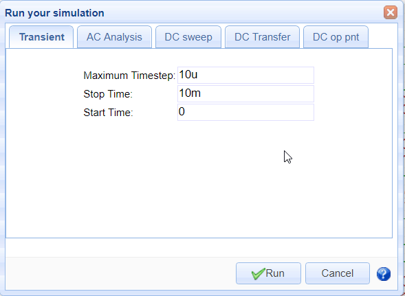

EasyEDA provides the following simulation analyses:

-   Transient: the time domain response of the circuit;
-   AC Analysis: the frequency domain response of the circuit (including an experimental FFT);
-   DC sweep: the DC response of the circuit as a voltage or current source or a component or parameter is swept between user specified limits; 
-   DC Transfer: computes the DC small-signal value of a transfer function (ratio of output variable to input source), input resistance, and output resistance of the circuit;
-   DC op simulation: computes the dc operating point of the circuit with inductors shorted and capacitors opened.

For more information about these analyses, please refer to:

[http://ngspice.sourceforge.net/docs/ngspice-manual.pdf#subsection.1.2.1](http://ngspice.sourceforge.net/docs/ngspice-manual.pdf#subsection.1.2.1)

[http://ngspice.sourceforge.net/docs/ngspice-manual.pdf#subsection.1.2.2](http://ngspice.sourceforge.net/docs/ngspice-manual.pdf#subsection.1.2.2)

[http://ngspice.sourceforge.net/docs/ngspice-manual.pdf#subsection.1.2.3](http://ngspice.sourceforge.net/docs/ngspice-manual.pdf#subsection.1.2.3)

Please note that although using Ngspice for it's simulation engine, at present (140218) EasyEDA does not support all the possible analysis modes available in Ngspice.

Note that for transient simulations, at present (140218):

the maximum value of (Stop Time-Start Time)/(Maximum Timestep) = 1000

See also [CTRL+R to Run Simulation Immediately](#h.ew7ltgf338o)

### WaveForm

EasyEDA's WaveForm display is super easy but to make sure you don't miss any of the features it supports, we've put some detailed information into this tutorial.

Transient, AC Analysis and DC Sweep simulation results are shown in the WaveForm trace viewer.

After you run a spice simulation which should plot some traces, EasyEDA will automatically open a WaveForm tab like the image below.

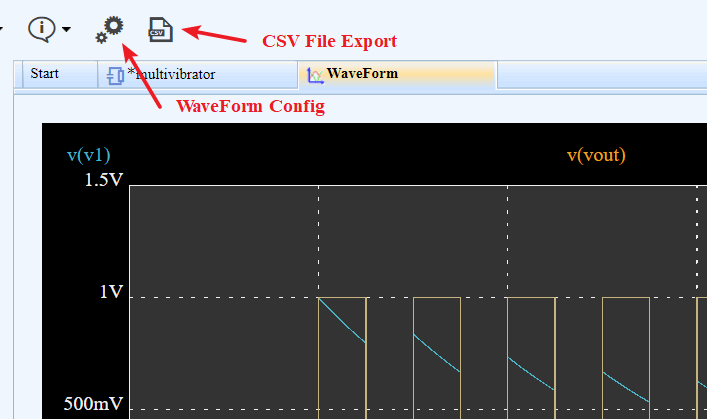

The Waveform window width and height, trace, grid and background colours and the placement of traces in up to three panes can all be configured using the WaveForm Config dialog. To open the WaveForm Config dialog, click the Config button on the toolbar above the Waveform window.


WaveForm allows the display of traces in any selection of up to three vertically stacked plot panes. The Y axes automatically scale to fit the units and the range of the traces being displayed. Traces can be hidden but at least one trace must be visible.

X and Y trace data can be seen on-screen just by moving the mouse cursor around the plot area of a pane with the readout adapting to the Y axes in each pane.

Delta X and delta Y trace data can be seen on-screen using a Left-Click and Drag select box, with the readout adapting to the Y axes in each pane. Returning the cursor to within a small radius of the starting point of the select box -without releasing the Left-Click - returns the readout to X and Y trace data.


Left-Click, Drag and then releasing the Left-Click zooms all plots, synchronised across all panes, horizontally. Double clicking anywhere in the WaveForm window resets the zoom.

Vertical plot zoom is not supported but traces are dynamically autoscaled to fit the available pane height as the horizontal zoom is changed.

The window can moved around within the EasyEDA window using the horizontal and vertical scroll bars or using Right-Click and Drag.

WaveForm plot data can be exported in CSV format for further analysis and manipulation in external programs such as LibreOffice Calc, Scilab or Excel, however a particular feature of EasyEDA is that the WaveForm window can not only be saved in an EasyEDA Project but that the plots in a saved WaveForm window can be viewed and manipulated in exactly the same way as when they first appear as a result of a simulation. This makes it easy to compare the results from several simulations.  

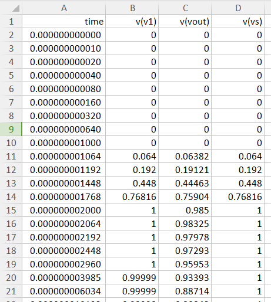

Once saved in a Project, a WaveForm window can be exported as a .pdf, .png or .svg file into your browser window. This can then be saved to your device so it is easy to create professional quality documentation.

### Build Your Own Simulation Component

There are several reasons why you may want to build your own simulation component.

-   You may have downloaded a spice model in text form for a device for which EasyEDA has no symbol;
-   Perhaps you have designed a simulation schematic of a circuit for which there is no readily available spice model and you need to create your own symbol for it;
-   You have a subckt for a device and EasyEDA already has a symbol for it but you want to use your subckt in place of the one already attached to the EasyEDA symbol.

EasyEDA gives you three ways to build your own components so that you can simulate them:

#### 1.From a model in text form 

1.  If you already have a spice subcircuit in text form, for example one that you have downloaded from a component manufacturer's website but you haven't got a spice symbol for it, then you can create a spice symbol and attach a .subckt definition to it.

2.  First make a note of the exact name given in the .subckt line. Spice names are case insensitive but can only be made up from alphabetical, numeric and underscore characters.

	For example: LM741EE_demo would be a valid name and would be seen as identical to lm741ee\_Demo but **LM741EE-demo** and **LM741EE~demo** are **invalid** names because they contain invalid characters.
	
	In this example we shall assume that you have a .subckt with the name: *Demo\_Spice\_Symbol*

3.  Next, create your symbol.

	You need to do this using:

	**Document > New > Spice Symbol...** instead of: **Document > New > Schematic Lib...**

	because that option does not support attaching a spice model to a schematic symbol.

	Using **Document > New > Spice Symbol…** also automatically sets the Spice Prefix of the symbol to X which is essential for a .subckt definition to attach to your symbol.

	Remember that the Spice Pin names assigned to the symbol **must** be numbered in the same order that they appear in the .subckt. So, if there are four pins named A, B, C and D in the order 1, 2, 3 and 4 in the subckt, then the corresponding pins on the symbol must be in the same number order. They don't have to have the same names: you could have symbol pins named; fish, go, moo and banana but if they correspond, in the same order, to the .subckt names A, B, C and D then they must be numbered as: 

	  

4.	You are now ready to attach your subcircuit to the symbol by opening the attached this spice symbol with subckt dialog using:

	**Super menu > Miscellaneous > Edit Subckt...**

	and then pasting the .subckt definition that you wish to use into the Subckt string: text area.

	 

5.  Click OK and save the symbol but remember: the symbol name must be identical to the name of the subckt:

	**.SUBCKT Demo\_Spice\_Symbol A B C D**

6.  Lastly, add your new spice symbol to a schematic and run a simulation.

	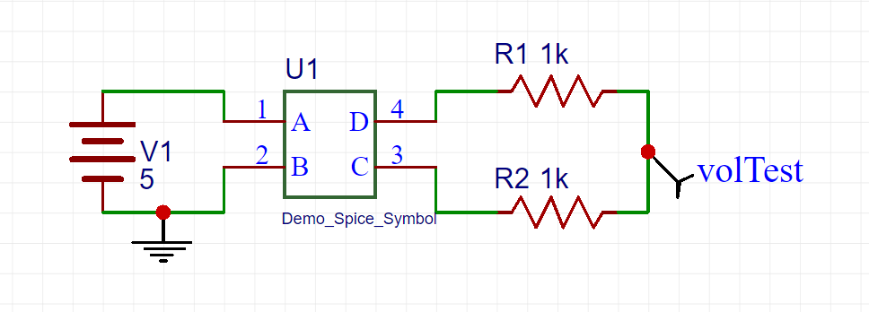 

7.  If you run a DC op simulation on this example, the result, shown in the Simulation Results... window, should be 2.5V

#### 2.From a subcircuit in schematic form


1. Create a spice symbol and subckt circuit.


2. The same as (1) above, create a spice symbol.


3. Next create a spice subckt as a schematic:

	**Document > New > Spice Subckt...**

	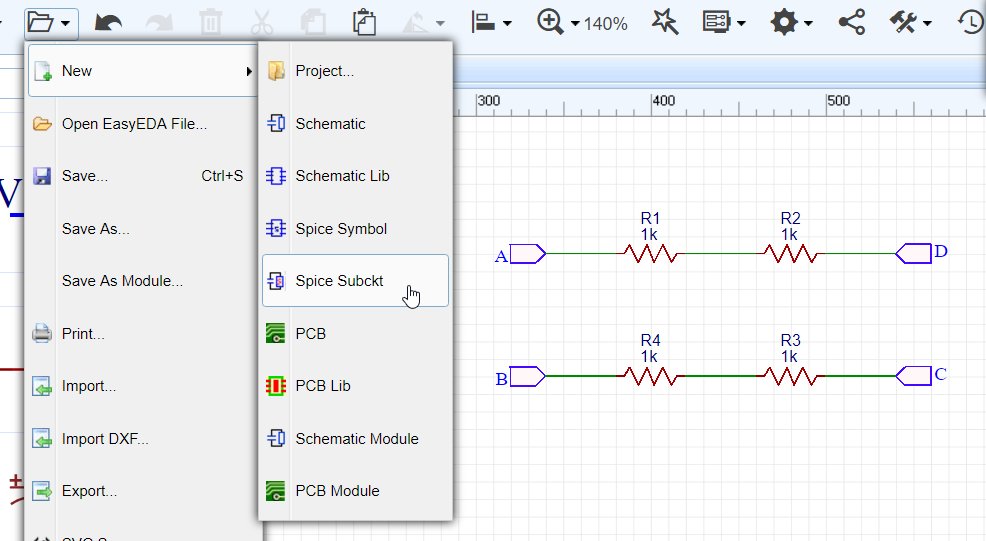 

	Draw the schematic that you want EasyEDA to turn into a subckt and attach to your symbol.

	To connect your simulation schematic to your symbol there must be a net in the circuit that is to be attached to each pin of the symbol. Each of these connecting nets in your circuit must have the same name as that of the symbol pin to which it connects. For example if your symbol has four pins called A, B, C and D then your simulation schematic must have exactly four connecting nets; one called A, one called B, one called C and one called D.

	To attach these nets in the schematic to the pins in the symbol you must name them using NetPort from the Wiring Tools palette.

	**Do not use NetLabel or NetFlag.**

	NetPort is used to distinguish those subckt nets that are to connect to symbol pins from all other nets named using EasyEDA default net names and those added using NetLabel or NetFlag.  

4. Save your spice subckt with exactly the same name as your spice symbol.

	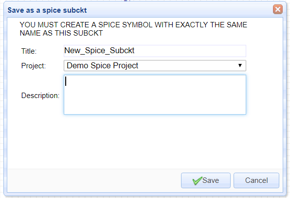   

5. Lastly, add your new spice symbol to a schematic the same as in (1) above and run a simulation.  


6. If you run a DC op simulation on this example, the result, shown in the Simulation Results... window, should be 2.5V.  

 

#### 3.From a spice directive in a schematic

1.  When you already have a spice symbol which has a subckt attached to it - for example, an opamp symbol from the EasyEDA Libs - but you want to use a subckt for a different device which is not already in the EasyEDA Libs, then you can use this method to easily attach a subckt to a symbol directly in your schematic.  

2.  Paste your .subckt text into the schematic.

3.  Next, select the pasted text and, in the right hand Properties panel, change the Text type from comment to spice. This will create a spice directive which the simulator will then incorporate into the spice netlist.
4.  Next, select the symbol and, either directly in the symbol or in the right hand Properties panel, edit the Model text to exactly the same name as in your pasted subckt.
5.  Check that the Spice pin order of the symbol matches that of the pasted .subckt and edit it if necessary (not all subckts for a given type of device use the same Spice Pin order!).
6.  Save your schematic and then you can run your simulation.

	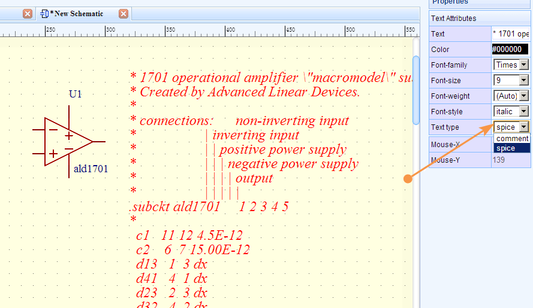

#### 4.Using .models instead of .subckts

1. All three techniques can be used to attach .model statements to symbols in exactly the same way as .subckts but after placing the symbol in your schematic, you must use:

	**Super menu > Miscellaneous > Edit Symbol...**
	to set the symbol's Spice Prefix to the appropriate letter for the device model you are using.

2. You also have to know the spice pin order for the type of .model statement you are using because, unlike .subckts, the .model statement does not show this explicitly.

	The Spice Prefixes and Spice Pin names and orders for the most commonly used devices for which you may want to use different models are listed below:

	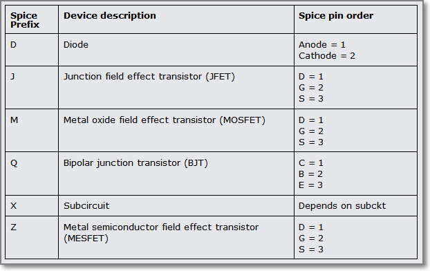

Actually there is a way to save the symbol with the required Spice Prefix so that you don't have to edit it every time you place a new instance of the symbol into a schematic … but that needs a bit more insight into editing the EasyEDA Source for the symbol so will be left for the moment.

We did say that EasyEDA Source enables some powerful ways to manipulate schematic and spice files and symbols! :)

### Advance Tips

EasyEDA uses [Ngspice](http://ngspice.sourceforge.net/presentation.html) as the simulation engine, so once you get more familiar with it you can use many [other commands and feature](http://ngspice.sourceforge.net/docs/ngspice-manual.pdf)[s of Ngspice](http://ngspice.sourceforge.net/docs/ngspice-manual.pdf) that are not directly available via the EasyEDA UI.

The lists below show which Ngspice commands are currently supported by EasyEDA and which are not.

#### Ngspice Commands Whitelist

EasyEDA allows these commands:

let define option options unlet op tf tran pss ac dc pz sens disto noise fft fourier meas alter run while repeat dowhile foreach if else end break continue label goto linearize print probe echo

#### Ngspice Commands Blacklist

EasyEDA does not currently allow these Ngspice commands:

reshape snsave snload circbyline alias deftype display destroy setplot setcirc setscale transpose xgraph gnuplot wrdata wrs2p hardcopy asciiplot write compose print eprint codemodel load cross undefine listing edit dump psd spec show showmod sysinfo altermod resume state stop trace save iplot altermod status delete step remcirc reset aspice jobs rspice bug where newhelp tutorial help oldhelp removecirc quit source shift unset unalias history shell rusage cd version diff rehash cdump mdump mrdump settype strcmp devhelp inventory source

#### Probe

An alternative to using the volProbe element to probe voltages in a circuit - which avoids the possibility described in [Probing voltages and currents](#h.vl7fdqh8iyf8) of overwriting net names and consequently corrupting any expressions that use them - is to use the Probe command.

For example, to probe the voltages on two nets named in and out all you have to do is enter this text into the schematic:

Probe V(out) V(in)

and then, in the Properties panel, set the Text type to spice to set it to be included in the spice netlist as a spice directive.

You can also use the Probe command to probe a current in your circuit.

To measure the current in a wire you insert an Ammeter, from the EasyEDA Libs, in series with the wire you wish to probe. EasyEDA then inserts a small subckt comprising a 0V, zero resistance, voltage source in series with the wire and then probes the current in that voltage source. Hence although an ammeter in an EasyEDA schematic is shown with an A prefix, it is spice netlisted with an X prefix (for a subckt call) followed by V (for the voltage source).

For example, to add the current in an Ammeter, named A_load_current1, to the command probing the two voltage probes above, you would change the Probe command in your schematic to:

`Probe V(out) V(in) I(XVA_load_current1)`

It is also possible to use expressions in a Probe command. In the example above, if we assume that V(out) is connected directly to a grounded load then, to plot the power dissipation of the load, you can add this expression:

`V(out)*I(XVA_load_current1)`

the Probe command list:

`Probe V(out) V(in) I(XVA_load_current1) V(out)*I(XVA_load_current1)`

Note that your probe list can be as long as you like but all entries in a Probe command list must be entered as a single line of text with no returns.

A useful feature allowing you to easily switch between different sets of probe points is that any number of Probe commands, each with their own list of probe points, can be included in a schematic by setting the Text type of only one at a time to spice and setting all others to comment.

But this is just the tip of the iceberg ...

#### Using CTRL+R to Run Simulation Immediately

As described in [Run Simulation](#h.omum7qtdqc2), using:

`CTRL+R`

will open the

Run the Document

or

Run the Project

simulation control dialog.

That approach is a great way for you to quickly and easily set up and Run any of the most commonly used simulation analyses types but EasyEDA gives you a way to harness the real power of **Ngspice**.

Simply by entering your simulation control commands as text, directly into the schematic and setting the Text type to spice, you can set up powerful spice analyses. You can run these straight away, without needing the Run your simulation dialog just using the `CTRL+R` hotkeys.

Using this method it's quick and easy to create and run more advanced simulation analyses and to make automated measurements on your circuit.

Here's a quick insight into how it works but you can skip this if you like and just get into how to make this amazing feature work for you!

EasyEDA automatically embeds the simulation commands set up in the Run your simulation dialogs within a control section. You can see this in the spice netlist for any circuit that has been through a simulation run at least once via:

**Simulate > Simulation Results… > Download netlist**

The control section starts with the .control command and ends with the .endc command. All commands between these delimiters are run in an Ngspice interactive simulation control mode.

Now, you don't need to worry about these two commands because EasyEDA automatically inserts them in the netlist in the right place to enclose your commands so all you need to do is to enter a list of commands as text, anywhere in the schematic canvas and then, in the Properties panel, set the Text type to spice for it to be included in the spice netlist as a **spice directive**.

The following examples show some of the things you can do using **spice directives**.

--------------------------------------------
Run a **transient simulation** with the following parameters:

**Maximum Timestep**: 10u
**Stop time**: 11ms
**Start Time**: 1ms

just add this text anywhere on the schematic canvas:

	tran 1u 11m 1m

set Text type to **spice** 

then type:

`CTRL+R`

--------------------------------

Run an **AC Analysis** with the following parameters:

**Type of Sweep**: Decade

**Number of points**: 100 (per decade)

**Start Frequency**: 1k

**Stop Frequency**: 1Meg

just add this text anywhere on the schematic canvas:

	ac dec 100 1k 1Meg

set Text type to **spice** 

then type:

`CTRL+R`

------------------------------------
Run a **DC Sweep** with the following parameters:

(And, yes, you can sweep component values, not just sources!)

**Source to Sweep**: R1  

**Start Value**: 1k

**Stop Value**: 2k

**Increment**: 100

just add this text anywhere on the schematic canvas:

	dc R1 1k 2k 100

set Text type to **spice** 

then type:

`CTRL+R`

--------------------------------------------
A couple of more advanced examples:

Run a **Fourier** analysis:

	tran 2u 2m 0
	fourier 1K V(volOut)
	run
	probe V(volOut)  

set Text type to spice 

then type:

`CTRL+R`

---------------------------------------
For more information on Fourier Ngspice, see:

[http://ngspice.sourceforge.net/docs/ngspice-manual.pdf#subsection.17.5.24](http://cs/ngspice-manual.pdf#subsection.17.5.24)

Run an **FFT** analysis:

	tran .1m 2s 0
	run
	linearize
	fft v(out)
	probe db(mag(v(out)))


set Text type to spice 

then type:

`CTRL+R`

For more information on **FFT** in Ngspice, see:

[http://ngspice.sourceforge.net/docs/ngspice-manual.pdf#subsection.17.5.25](http://ngspice.sourceforge.net/docs/ngspice-manual.pdf#subsection.17.5.25)

----------------------------------------
Run a DC op pnt analysis and Print the power in the load into the Simulation results window:

	op
	print V(out)*I(XVA_load_current1)

set Text type to spice 

then type:

`CTRL+R`

-------------------------------
Measure the gain and 3dB bandwidth of an amplifier. 

This prints the gain and bandwidth values of this x1 and x10 amplifier example:

[https://easyeda.com/file_view_Find-gain-and-bandwidth_8GE0KRFDn.htm](https://easyeda.com/file_view_Find-gain-and-bandwidth_8GE0KRFDn.htm)

 in the Simulation Results… window:

	* This is a control block.
	* Note: variables in a control block must start with
	* a letter.
	 
	* Set up an AC analysis:
	 
	ac dec 100 1k 10Meg
	 
	* Define a 3dB value:
	 
	let neg3dB = 20*log10(sqrt(2)/2)
	 
	* Convert the outputs of both amplifiers into dB:
	 
	let x1gain_dB = DB(v(x1Avcl))
	let x10gain_dB = DB(v(x10Avcl))
	 
	* Find the low frequency gain of each amplifier
	* (look at the Bode plots in WaveForm and choose
	* a frequency where the gain is level; i.e. well
	* below any possible hf gain peaking):
	 
	meas ac x1_lfgain_dB find x1gain_dB at=1k
	meas ac x10_lfgain_dB find x10gain_dB at=1k
	 
	* Subtract 3dB from the lf gains to find
	* a value 3dB down from the lf gain:
	 
	let x1_3dBdown = x1_lfgain_dB + neg3dB
	let x10_3dBdown = x10_lfgain_dB + neg3dB
	 
	* Find the frequencies at which the outputs
	* are 3dB down from the lf gains:
	 
	meas ac x1_f3dB when x1gain_dB = x1_3dBdown
	meas ac x10_f3dB when x10gain_dB = x10_3dBdown

set Text type to spice 

then type:

`CTRL+R`

For more information on the meas statement, see:

[http://ngspice.sourceforge.net/docs/ngspice-manual.pdf#subsection.17.5.37](http://ngspice.sourceforge.net/docs/ngspice-manual.pdf#subsection.17.5.37)


## 仿真手册

### Introduction

EasyEDA is not just a way to draw circuit diagrams and design PCBs. It is also a circuit simulator.

A circuit simulator is basically a specialised mathematical program, optimised to construct and then solve the equations that define the behaviour of the circuit that has been described to it in the circuit diagram.

The circuit simulation program that EasyEDA uses is called ngspice. Ngspice is Free and Open Source Software (FOSS) that is in turn based on a simulator called SPICE that was originally written by Larry Nagel.

#### What this book is for

This book is an introduction to circuit simulation in EasyEDA using ngspice.

It starts with the basics of how to avoid some of the most common mistakes that cause simulations to fail and then goes on to illustrate how to set up a circuit so that it will simulate successfully and produce meaningful results. It also discusses some aspects of understanding how, what might at first appear to be unexpected or even nonsensical results, can arise.

The book then introduces and illustrates more advanced techniques such as:

*   probing signals such as voltages, currents, powers and resistances;

*   configuring signal sources;

*   setting up different types of analyses;

*   making measurements such as rise times, RMS values and bandwidths;

*   defining component values using parameters;

*   using expressions to calculate component values such as for a resistor to draw a given load current or capacitances for a specified filter cutoff frequency;

*   using manufacturer's device models;

*   setting up complex simulations including arbitrary voltage and current sources.

#### What this book is not for

*   This is not a book about learning to use EasyEDA to draw schematics. For general information about using EasyEDA please refer to the [EasyEDA Tutorial](https://easyeda.com/Doc/Tutorial/);

*   This book does not teach electronics. Whilst there may be examples of circuits and explanatory text that are helpful in understanding electronics, it is assumed that the user already has sufficient knowledge of electronics to understand the content of this book.* Although ngspice is similar to other variants of spice and a lot of the information and techniques in this book may be applicable to some of those variants, this book is written specifically about circuit simulation in EasyEDA using ngspice.

*   Except where necessary to help explain some aspect of the behaviour of simulation, this book does <span style="font-style:italic">not</span> go into any detail of how circuit simulation in general and ngspice in particular actually works. For more information about those areas, please see the links below:

More information about Larry Nagel and SPICE is available from here:

<span style="font-style:italic">[http://www.omega-enterprises.net/The%20Origins%20of%20SPICE.html](http://www.omega-enterprises.net/The%20Origins%20of%20SPICE.html)</span>

Larry Nagel's PhD Dissertation:

<span style="font-style:italic">Laurence W. Nagel., &#8220;SPICE2: A Computer Program to Simulate Semiconductor Circuits,&#8221;</span>

Memorandum No. ERL-M520, University of California, Berkeley, May 1975.

[<span style="font-style:italic">http://www.eecs.berkeley.edu/Pubs/TechRpts/1975/ERL-520.pdf</span>](http://www.eecs.berkeley.edu/Pubs/TechRpts/1975/ERL-520.pdf)

is actually very readable and instructive.

For more information about electronic circuit simulation and spice in particular, see:

<span style="font-style:italic">[http://en.wikipedia.org/wiki/Electronic_circuit_simulation](http://en.wikipedia.org/wiki/Electronic_circuit_simulation)</span>

and:

<span style="font-style:italic">[http://en.wikipedia.org/wiki/SPICE](http://en.wikipedia.org/wiki/SPICE)</span>

More information about ngpsice is available from here:

<span style="font-style:italic">[http://ngspice.sourceforge.net/presentation.html](http://ngspice.sourceforge.net/presentation.html)</span>

#### Who this book is for

All simulation tools and how they interact with schematic capture tools are different so even for people with experience of using simulation tools, it is worth at least skimming through the sections of this book to get an idea of where to find information if things don't seem to go quite as planned.

However, for people with limited or no previous experience of using simulation tools, this book is <span style="font-style:italic">essential</span> reading.

Why?

Because, as a newcomer to the world of circuit simulation, it is very tempting just to launch straight into trying to build and run lots of interesting and exciting simulations.

Sadly, however, this will almost certainly be a very frustrating and discouraging experience because many of those simulations will either not run, will not function correctly as circuits or will appear to give nonsensical results! This can happen for all sorts of very simple reasons but to newcomers with no experience of simulation, those reasons can seem utterly incomprehensible.

So, to avoid a lot of discouragement and wasted time, it is worth taking a few minutes to understand some of the most common things that can cause a simulation to fail or to run but give unexpected answers.

#### How the book is structured

This book is not some dry tome with lots of words, diagrams and snippets of code. It is written as a live, interactive document. Rather than having to read lots of text and then having to go into EasyEDA to create circuits to try things out, live simulation examples are embedded directly into the text to illustrate the points being discussed.

Just go to a topic or a section heading; read a couple of paragraphs and then open and run the embedded simulation to see exactly what the text is about.

Every embedded simulation must be saved before it can be run. Users who have joined EasyEDA can save the files to their own project folder. Non-registered users can save the files to Anonymous Files. In either case, examples can be copied and edited so that users can try out different things in whatever way helps their understanding of what the example is trying to explain, building up their own personal library of teaching examples as they progress through the book.

Newcomers are encouraged to work through the book in a linear manner because each section builds on the knowledge and insights gained from all the previous ones. Skipping sections leaves gaps that can catch out the novice and hinder understanding ideas presented in later sections.

*   The book begins by introducing some of the concepts and terms that are essential for a basic understanding of what a simulator is and how to use it effectively.
*   Then, using simple interactive simulation examples it describes and illustrates how to avoid the most common pitfalls in building, running and interpreting the results from simulations.

*   The book goes on to illustrate ways to create and show connectivity using wires and netlabels in schematics. It then discusses techniques for probing voltages and currents and how they relate to and can affect or be affected by the netnames that are assigned to nets either automatically by EasyEDA or manually by the user placing netlabels.

*   More advanced techniques for probing voltages and currents using the 'probe' command are described, moving on to using this command to measure power dissipations, resistances and conductances.

This section describes the use of 0V sources to measure currents also introduces and E,F, G and H dependent sources and the very powerful arbitrary or B Dependent Sources.

In this section, the concept of the 'Spice Directive' is also introduced, describing how to turn inactive 'comment' text into active 'spice' text that the simulator then recognises as an instruction to do something.

*   The 'probe' concept is then extended by describing how several different 'probe' commands can be typed into a schematic and - simply by selecting which one is switched from being 'comment' text into 'spice' text - they can be used to swap between different selections of values and nodes to be probed.

*   The use of the 'let' command to further extend and simplify the probing of signals is introduced with a simple example. This command will feature heavily in later sections about making measurements based on the results of simulations.

*   Early interactive simulation examples introduce the basic way of setting up and running a simulation using the green running man 'Simulate...' icon (the Green Man) via the 'Run the Document...' option to open the 'Run your simulation' dialogue and then select the type of analysis to run.

*   Later examples show how to use the CTRL+R Hotkey as a shortcut to the 'Run your simulation' dialogue.

This idea is then extended with the concept of using 'spice directives' to run simulations straight from the CTRL+R Hotkey so that, with a few simple key strokes, it is easy to switch between several different simulations from a single simulation schematic.

*   DC operating point, DC Transfer function, DC Sweep, AC (frequency domain) and Transient (time domain) Analyses are described in some detail.

Using the DC Sweep to sweep the value of a resistance in a circuit and to sweep the ambient temperature for circuit is covered in this section.

There are detailed sections on setting up each of the various time

domain signal sources that are available, such as SINE, PULSE and more.

Configuring and using the frequency domain AC source that is built into to every independent signal source is covered.

*   The need for and different ways of defining initial conditions such as voltages on nets and across capacitors and currents in inductors are demonstrated.

Using PULSE, EXP, PWL and B Sources to 'kick start' circuits is also illustrated in this section.

*   The concept of using parameters (i.e. variables that are used in the simulation) to define things like multiple component values and signal source settings is described.

*   The use of parameters in expressions (i.e. formulas or equations) to calculate values such as the capacitance for a given RC time constant with a given resistance is covered and then extended into using them in B Sources.

*   The concept of predefined functions and their use in expressions is described in detail extending into the creation of user defined functions using the .func statement.

*   The concept and scope of device models in simulation is discussed in detail.

*   Ways to add 3rd party models and subcircuits into schematics and to use them with the predefined schematic symbols from the EasyEDA Libs is covered in detail.

*   The use of 3rd party models is extended into attaching them to custom schematic symbols.

*   The use of expressions and functions in the creation of custom behavioural models is covered with reference to some of the in-house EasyEDA (EE suffix) models.

### Introductory concepts of Spice simulation

For every circuit being simulated, EasyEDA converts the schematic into a textual description of the circuit that is then passed to the simulator.

This textual description of the circuit is called a **spice netlist.**

*   Note that the spice netlist is not the same as the netlist that is generated from a schematic and which is then passed though to PCB layout.

The netlist is a list of all the components used, how they are connected together and descriptions of them, called **models**, so that the simulator knows the behaviour of each component is to be simulated. The netlist also includes instructions to the simulator, called **spice directives**, to tell it what type of **analysis** is to be run. It may also include lists of values, called **parameters**, that are to be used to directly define component values or as part of more extensive calculations, called **expressions**.

Just like real ones, circuits to simulated require power sources and often signal sources. Therefore the netlist will include any **voltage sources** and **current sources**. These can be **Independent Sources** or **Dependent Sources**. Independent Sources just generate DC voltages or currents or can generate time domain signals such as sinusoids and pulses or they can generate a signal of a given amplitude and phase for frequency domain simulations (in fact they can be configured to generate all three but that will be covered later). Dependent Sources can also be used to generate DC voltages or currents but their main use is to generate outputs that are **functions** of that other signals in the circuit, for example by using an expression to describe the output of a source as a current that is equal to the sum of the squares of two input voltages.

The netlists of more advanced simulations can include instructions, called **measure statements**, to the simulator to perform calculations on the results of the simulation itself, for example to measure the rise time of a pulse, the RMS value of a signal or the 3dB bandwidth of a filter circuit.

### About naming conventions

Before going any further it is important to understand the naming conventions used throughout this book and throughout all the simulations

Fields on a line are separated by one or more blanks, a comma, an equal (=) sign, or a left or right parenthesis; extra spaces are ignored. A line may be continued by entering a "+" (plus) in column 1 of the following line; ngspice continues reading beginning with column 2. A name field must begin with a letter (A through Z) and cannot contain any delimiters. A number field may be an integer field (12, -44), a floating point field (3.14159), either an integer or floating point number followed by an integer exponent (1e-14, 2.65e3), or either an integer or a floating point number followed by one of the following scale factors:
<table border="1" cellspacing="0"><colgroup span="3" width="85"></colgroup><tbody><tr><td align="left">Suffix</td><td align="left">Name</td><td align="left">Factor</td></tr><tr><td align="left">T</td><td align="left">Tera</td><td align="left">1e12</td></tr><tr><td align="left">G</td><td align="left">Giga</td><td align="left">1e9</td></tr><tr><td align="left">Meg</td><td align="left">Mega</td><td align="left">1e6</td></tr><tr><td align="left">K</td><td align="left">Kilo</td><td align="left">1e3</td></tr><tr><td align="left">mil</td><td align="left">Mil</td><td align="left">25.4×1e-6</td></tr><tr><td align="left">m</td><td align="left">milli</td><td align="left">1e-3</td></tr><tr><td align="left">u</td><td align="left">micro</td><td align="left">1e-6</td></tr><tr><td align="left">n</td><td align="left">nano</td><td align="left">1e-9</td></tr><tr><td align="left">p</td><td align="left">pico</td><td align="left">1e-12</td></tr><tr><td align="left">f</td><td align="left">femto</td><td align="left">1e-15</td></tr></tbody></table>

Letters immediately following a number that are not scale factors are ignored, and letters immediately following a scale factor are ignored. Hence, 10, 10V, 10Volts, and 10Hz all represent the same number, and M, MA, MSec, and MMhos all represent the same scale factor. Note that 1000, 1000.0, 1000Hz, 1e3, 1.0e3, 1kHz, and 1k all represent the same number. Note that M or m denote 'milli', i.e. 1e?3

*   The suffix <span style="">Meg</span> MUST to be used for 1e6

Node names are case insensitive.

Node names may either be plain numbers or arbitrary character strings, not starting with a number.

The ground node must be named "0" (zero). For compatibility reasons "gnd" is accepted as the ground node and will internally be treated as a global node and be converted to "0".

Note the difference in ngspice where the nodes are treated as character strings and not evaluated as numbers, thus "0" and "00" are distinct nodes in ngspice (whereas they are not in SPICE2).

Ngspice and therefore, EasyEDA, requires that the following topological constraints are satisfied:

*   Each circuit has to have a ground node (gnd or 0)!
*   The circuit cannot contain a loop of voltage sources and/or inductors and cannot contain a cut-set (series connected set) of current sources and/or capacitors.
*   Each node in the circuit must have a dc path to ground.
*   Every node must have at least two connections except for transmission line nodes (to permit unterminated transmission lines) and MOSFET substrate nodes (which have two internal connections anyway).

These constraints will be covered in more detail later,


### Introduction to using a simulator

Using a simulator is not quite the same as building a real circuit. There are many things that can catch out the newcomer to simulation because neither real world nor most simulator components are ideal. The departures from ideal are often different between the two and if these differences between real and simulated components in a circuit are not clearly understood, they can lead to confusion when the results of a even a simple simulation are different from those expected.

Part of the problem is that a user's expectations are informed by experience of real world measurements. Therefore, it is important to understand exactly what measurements are being made and how the simulation circuit will affect the results. In cases where there are differences between real and simulated results this may also require a deeper understanding ofwhat is going on in those circuits and what assumptions are being made - often unconsciously - about them.

Learning to use a simulator means thinking more about what the real world really looks like, how it differs from the theoretical world of textbook problems and simple diagrammatic circuit representations and therefore what the results of measurements are likely to be.

#### Avoiding common mistakes

The following section describes and illustrates some of the most common mistakes, misunderstandings and causes for confusion.

##### Prefix conflict error

This error message will appear:

If:

There are two copies of the same schematic in the same project folder: CctA and Copy\_of\_CctA.

In this case, the component prefixes (reference designators) will be the same in both CctA and Copy\_of\_CctA.

Or:

There are two different schematics in the same project folder, CctA and CctB but there are some components in CctB that have the same prefixes as in CctA.

Then:

If a simulation run is attempted using:

**Green Man > Run the Project**

then EasyEDA will try to merge all the schematics in the Project into a single schematic and then run a simulation on that big schematic.

This will fail because EasyEDA will find repeated instances of components with the same prefix.

Else:

if you try to run a simulation using:

**Green Man > Run the Document**

or:

**CTRL+R**

then EasyEDA will run a simulation only on the schematic in the current active tab in the editor window (if you have only one schematic open then it will run that one but if you have more than one schematic open then it will run only the one in the selected tab).

If you have given a unique prefix to every component in that selected sheet then this simulation will run because EasyEDA will find only single instances of every component in the schematic.

##### All simulation circuits MUST have a ground node


A feature of the way simulators work is that they MUST have a ground node (also referred to as the 0 net) somewhere in the circuit. All voltages probed in the circuit, unless <span style="font-style:italic">explicitly</span> probed as voltage differences are then measured with respect to that ground node. The ground node can be placed anywhere in the circuit that is convenient for the purposes of the simulation but it must exist somewhere in that circuit.

SIMULATION SCHEMATICS THAT DO NOT HAVE A GROUND NODE WILL NOT RUN.

This is illustrated in the following two examples:

With no ground symbol, the simulation will not run:

[All simulation schematics MUST have a ground 01](https://easyeda.com/editor#id=y20YWvRPp)

Once any of the available ground symbols is added, the simulation will run:

[All simulation schematics MUST have a ground 02](https://easyeda.com/editor#id=4WUSQNLJ5)

##### All simulation circuits MUST have a power and/or signal source

In exactly the same way that a real circuit must have some sort of power supply - even if that power supply is actually the signal source itself (for example, a crystal set or a volume control potentiometer) or comes from a capacitor pre-charged to some voltage or an inductor pre-charged to some current prior switching the circuit on - a simulation schematic must have a power and/or a signal source or an initial condition such as a capacitor pre-charged to some voltage or an inductor pre-charged to some current prior to the start of the simulation.

Power supplies can be built from ideal zero series resistance voltage sources. Simple but more realstic models of battery and voltage regulator supplies can be built using voltage sources with some series resistance or current sources with a parallel resistance (i.e. Thevenin or Norton equivalent sources).

EasyEDA provides a wide range of signal sources. These will be covered in detail in their own section on Sources but the basic use of some of these sources to provide power to a circuit is illustrated below:

[All simulation schematics MUST have a power supply too](https://easyeda.com/editor#id=4ke8qIZTb)

##### Every point in a simulation schematic MUST have a DC path to ground

Unlike real circuits, every point in a simulation schematic MUST have a DC path to ground (or 0 net). Attempting to run a simulation with a node that has no DC path to ground will fail with errors.

Before discussing the significance of the DC path to ground, however, it is essential to look at some of the basic components and sources that are used in almost all simulations and to understand how they affect these DC paths.

##### Values and DC paths of RLC components

This section is about the values of - and DC paths through - resistors, inductors and capacitors.

*   Inductors in ngspice have zero series resistance (i.e. ESR = 0).

 * Therefore, inductors have a DC path through them.
    
 * Inductors in ngspice have no parasitic parallel capacitance or resistance.

*   Capacitors in ngspice have no parasitic parallel conductance (i.e. they have an infinite DC resistance).
 *   Therefore capacitors in ngspice do not have a DC path.
 
 * Capacitors in ngspice have zero series resistance (i.e. ESR = 0).
 *  Capacitors in ngspice have no parasitic series inductance (i.e. ESL = 0).


*   Inductors and capacitors in ngspice can be set to positive and to negative values and to zero. Beware that setting a component to a negative value may cause the circuit connected to them to exhibit instability or oscillation. This in turn may cause the simulation to fail.

*   Resistors obviously have a DC path through them.
*   Resistors in ngspice can be set to positive and to negative values but cannot be set to exactly zero: they MUST have a non-zero value. Setting a resistance to zero will cause the simulation run to fail with an error. This is basically because any voltage difference across a zero resistance (such as may occur normally in a circuit or even just as a consequence of numerical "noise" in the simulation calculations) will generate an infinite current, which will obviously crash out of the top end of the simulators calculation dynamic range. This applies to all resistors in ngspice, including the Ron and Roff values in switches and resistances given in device models.
    Beware that setting a resistor to a negative value may cause the circuit connected to it to exhibit instability or oscillation. This in turn may cause the simulation to fail.
*   A common cause of confusion in simulation is the apparently unexpected behaviour of circuits using open circuit switches.
    Just like switches in the real world, switches in EasyEDA have non-zero ON resistances (Ron). They also have finite OFF resistances (Roff). If an EasyEDA switch is connected in series with a voltage source into an open circuit load (such as presented by a VolProbe) then the voltage at the output of the switch will be equal to the open circuit voltage of the voltage source <span style="font-style:italic">whether the switch is open or closed</span>. This is different from the real world experience because in a real circuit, the voltage would be measured with a voltmeter or an oscilloscope probe having a much lower resistance than the open circuit resistance of the switch.  
    To illustrate this, let’s take a simple example of a switch connected in series with an ideal voltage source set to 1V and then measure the V(Output) of the switch when open and closed.  
    With the switch closed the expected output is V(Output) = 1V.  
    And that’s what the simulation shows.  
    OK. With the switch open the expected output is V(Output) = 0V.  
    What the simulation actually shows is V(Output) = 1V.  
    What’s that all about? Surely the switch must not be simulating properly and is stuck closed?  
    Well, no actually; the switch and voltage are doing exactly what they should. It’s just that these results are unexpected  because there's a misunderstandingabout how the simulated circuit differs from a real circuit.  
    No real switch has an infinite OFF state resistance but similarly, there is no such thing as a real open circuit that presents an infinite load impedance.  
    The Voltage and Current Controlled Switches and the Static Switches in EasyEDA are not ideal: they all have a finite OFF resistance. For the voltage and current controlled switches, the OFF resistances are specified by the user editable R(off)(Ω) parameter in the right hand Properties panel with a default value of 1GΩ. The Static Switches have a fixed 10GΩ OFF resistance. In either case these resistances are large but certainly not infinite.  
    However, the effective resistance to ground at the Output node using a Volprobe or plot expression, really is infinite. Therefore when operating into an infinite resistance load there would be no difference between the ON and OFF state voltages at the Output node.  
    Note that if a load resistance of 1GΩ were to be connected from the Output node to ground, then there would be a clear ON/OFF state difference.  
    This is illustrated in the following simulation:    
    [EasyEDA switches are not ideal](https://easyeda.com/editor#id=0MEe2PNZp)  
    Some further examples of the effects of finite switch resistances are illustrated in this next simulation:  
    [Effects of finite switch resistances](https://easyeda.com/editor#id=Ba4mEWewq)  
    Note that, in ngspice, the Ron and Roff values used in switches can be set such that Ron > Roff. This is a useful way to invert the logic sense of a switch.  
    At this point it is worth noting that if it is important that the simulation results are as close as possible to those expected to be observed when probing a real circuit using real test equipment, it is sometimes useful to place a realistic load on wires (nets) in the simulation schematic where voltage measurements are to be made in the real circuit. Similarly for current measurements, realistic ammeter insertion impedances should be connected in series with the wire. To avoid unnecessary loading of the simulated circuit however, only place such loads in the locations where external measurement devices are to be connected to the real circuit and only in the same numbers as there are measurement instruments being used at the same time. For example, if there are two oscilloscope probes connected to a circuit but one of them is moved around, only connect loads representing simulated oscilloscope probes to two places in the simulated circuit. If different places need to be probed then move the simulated probes and rerun the simulation.  

##### DC paths through Voltage and Current Sources

This section is about the DC paths through Voltage and Current Sources.

*   Voltage sources in ngspice (including independent V and dependent B and E voltage sources) have zero source resistance and have no current limit. The output voltage will be constant for any load current. This is true when sourcing or sinking current. sinking. This is not the same behaviour as regulated and current limited bench power supplies set to give a constant voltage output. Except for specialised supplies such as Source Measure Units, bench supplies can usually only source currents for positive outputs or sink currents for negative output voltages, up to some current limit set by the user.
    *   Voltage Sources in ngspice therefore have a DC path through them.  
    As a consequence of their zero source resistance, in the same way that damagingly high currents will flow if real batteries are connected in parallel without some resistance between them, voltage sources in simulation schematics cannot be connected in parallel without some resistance in series between them. This is true even if they are set to exactly the same voltage. Attempting to do so will cause the simulation run to fail with an error.  
    Similarly, in the same way that damagingly high currents will flow if an inductor is connected directly across a real power supply without some resistance between them, inductors in simulation schematics cannot be connected directly in parallel with voltage sources without some resistance in series between them.  Attempting to do so will cause the simulation run to fail with an error.

*   Current sources in ngspice (including independent I and dependent B and F sources) have an infinite source resistance and have no voltage limit. The output current will be constant for any load impedance and voltage across the current source. This is not the same behaviour as regulated and current limited bench power supplies when they are set to give a constant current output. Except for specialised supplies such as Source Measure Units, bench supplies can usually only source currents up to some maximum positive voltage at the output or sink currents down to some minimum negative voltage at the output, as set by the user.
*  Current Sources in ngspice therefore do not have a DC path through them.    

As a consequence of their generating a constant current through an infinite source resistance, in the same way that damagingly high voltages can be generated if two real current sources are connected in series without some finite resistance across each source, current sources in simulation cannot be connected in series without some finite resistance connected in parallel with each source. Attempting to do so will cause the simulation run to fail with an error.

*   In simulation, connecting a capacitor in parallel with a current source generating a current, I, without also connecting a resistor, R, in parallel, will cause the voltage on the capacitor to ramp towards infinity. Even with the resistor in parallel, the voltage will ramp to I*R which may still be a large voltage. If such a circuit exists in a simulation schematic then, unless it is shorted out by a switch with some suitably low value resistance or set to some initial voltage, the voltage across the capacitor will already have ramped towards infinity at time t=0, i.e. as the simulation starts. This can lead to unexpectedly high voltages right from the start of a simulation.

##### The effects of adding DC paths

This section is about creating DC paths and some of the effects they can have.

*   A favourite of elementary electrical engineering classes and an example of a very tricky problem to solve using a simulator is a circuit that has two capacitors in series. This must have a DC path to ground from the common point between the two caps but the path to ground does not have to be direct. It can be via other elements in a circuit. For example if one end of one of the capacitors is connected to ground with the other end of the other capacitor connected directly to a grounded voltage source or to a Thevenin Source (a voltage source in series with a resistance) or to a Norton Source (a current source in parallel with a resistance) then placing a single high value resistor in parallel with either of the capacitors or simply from the junction of the two capacitors to ground would be sufficient.

The following simple example will not run because there is no DC path to ground from the common node B, between the two capacitors:

[Capacitors in series 01](https://easyeda.com/editor#id=b3btnFXQ8)

*   Resistors placed across capacitors to provide a DC path can be scaled so that the R_C time constant that they will create with the capacitors is very large compared to the time interval over which a Transient simulation is to be run. Another way to look at this for an AC Analysis is that the 1/(2_pi_R_C) frequency that they form is far outside the frequency range of interest.

The value of these resistances can be anywhere between milli&#937; (1e-3 &#937;) up to 1G &#937; (1e9 &#937;). In many cases the values can be smaller or larger than this range but in some circuits that can lead to simulations failing with errors. This is usually because the ratio of the largest to the smallest voltages or currents in the circuit is too high for the simulator to handle. As a general rule, keeping the ratio between the smallest and the largest component value for any given type of passive component to no more than 1e12 should help avoid this sort of simulation failure.

*   It must be noted however that whilst a purely theoretical analysis of the voltages across capacitors in series due to a current flowing through them based on Q=I_t=C_V, may yield sensible values, setting up both real and simulated circuits to demonstrate this can be quite challenging. Voltage measurements in real circuits can be difficult whilst the need for a DC path in simulations can present different but no less tricky problems.

*   Similarly, a transformer coupled circuit where the primary side is driven from mains live and neutral and one side of the secondary circuit is connected to earth (which is probably where the ground symbol would be placed in the circuit diagram), must have a DC path back to this ground from one or both ends of the transformer primary (or from a centre tap if one is available).

Similarly to placing resistors across capacitors, DC path resistors used with inductors can be scaled so that the R/L time constant that they will create is very large compared to the time interval over which a Transient simulation is to be run. Another way to look at this for an AC Analysis is that the 1/(2_pi_R*C) frequency that they form is far outside the frequency range of interest. capacitors

Another example of where very high value resistors would be added is in transformer coupled datacommunications networks such a 100BaseTx or 1000BaseT Ethernet. Here, the connections between the two transceivers are floating and so have to have DC paths to ground added to keep the simulator happy. Using resistances that are high in comparison to the network cable characteristic impedance and hence termination resistance is important in order not to introduce an impedance mismatch and so disrupt the signal integrity. In practice it is simplest therefore to add two resistors: one from each of the two signal wires to ground. This preserves the symmetry of the signalling on the wires and doubles the effective resistance between them.

In many transformer coupled circuits, the simplest solution is to ground one side of both the primary and the secondary sides of the circuit. This may look strange because the circuits are no longer galvanically isolated by the transformer but - as long as the reason for connecting the circuits this way is clearly indicated in the schematic (and removed or otherwise modified before passing into PCB layout!) - then it is a simple and very useful solution. Not only does it remove any problems with how large or small the DC path resistor has to be, it also refers the voltages on both the primary and the secondary sides to ground and so simplifies probing of many of the voltages on both sides of the transformer which might otherwise have to be probed differentially.

Some examples of this use of the ground return path resistor can be seen in the following collection of examples of transformers and coupled inductors, including a simpleexample of an open loop flyback converter:

[Transformers and coupled inductors](https://easyeda.com/editor#id=QHBTb5nFX|Uf3DByUS4|cQKEWe7pH|BEeOM8tPb)

[Transformers and coupled inductors 1](https://easyeda.com/editor#id=QHBTb5nFX)

[Transformers and coupled inductors 2](https://easyeda.com/editor#id=Uf3DByUS4)

[Transformers and coupled inductors 3](https://easyeda.com/editor#id=cQKEWe7pH)

[Open loop flyback converter](https://easyeda.com/editor#id=BEeOM8tPb)

*   To avoid confusion between passive schematics intended to be passed to PCB layout and simulation schematics that may have had DC path resistors added, it is a good idea to clearly identify any resistors added to a schematic soley to provide a DC path to ground. This can be done using resistor names such as <span style="font-style:italic">RDCPATH1</span> or by labelling them for example as <span style="font-style:italic">For simulation only</span>.

*   It must be remembered that all voltages probed in a schematic are with respect to ground. This is particularly important to remember when probing signals that are floating, such as the transformer coupled examples discussed above. This is when B or E Sources can be used to probe two floating voltages and subtract them to simply generate the difference between them.

##### Common problems with DC paths

A DC path to ground is often provided by the rest of the circuit but here are some cases that are often overlooked:

*   All current sources (independent I and dependent B and F sources) are ideal: they have an infinite DC resistance (and AC impedance) and so do not have a DC path through them. Connecting a current source across a capacitor with one side grounded will throw an error even if the current source is set to zero (the capacitor voltage would ramp to infinity if a non-zero current were set and that would throw a different error!). So a resistor must be connected across the current source, to provide the DC path to ground to the other side of the current source / capacitor. A similar problem arises if two current sources are connected in series even if the two currents are identical (if they're not then the common node flies off to infinity again);
*   Switches have their own internal DC path between the switch terminals because they have finite OFF resistances. However, <span style="font-weight:bold">voltage controlled switches</span> do not have a DC path between their control inputs.

*   <span style="font-weight:bold">Current controlled switches</span>, <span style="font-weight:bold">Current Controlled Current Sources (CCCS)</span>and <span style="font-weight:bold">Current Controlled Voltage Sources (CCVS)</span>all have a zero resistance short circuit between their control inputs.Atfirst sight it might appear that connecting the output of a current source to the input of a current controlled switch would not cause a problem because the switch control input places a short circuit across the current source output. There is, however, no DC path to ground from the these connections so a resistor must be placed from one of the current controlled switch input pins to ground. If the current source output/switch control input part of the circuit is not connected to anything else then the resistor can be replaced by a connection to ground.

This is illustrated by the placement of the RDC_PATH_TO_GROUND 1kresistor connected to output side of the CCCS, F1, and input side of thecurrent controlled switch W1 in the example below:

[Controlling EasyEDA switches](https://easyeda.com/editor#id=hRL3WewOI)

*   Capacitors (unless using the more advanced options in ngspice) are ideal: they have no parasitic (leakage) DC resistance in parallel with them. This is why both ends of a capacitor must have a DC path to ground either through the external circuit or explicitly by adding a resistor;

*   Although the primary and the secondary or secondaries of transformers have DC paths, there is of course no DC path from primary to secondary. This must be added either by connecting one side of the primary and of the secondary to ground directly or through a resistor.

*   Voltage sources (including independent V and dependent B and E voltage sources) have the opposite problem. They are ideal so they have zero resistance. The same is true for simple inductors. If you connect voltage sources directly in parallel then ngspice will throw an error even if the voltage sources are set to the same value (if they're not then an infinite current would flow and that would then throw a different error). The same problem arises if you connect a voltage source directly in parallel with a simple, ideal, inductor because the voltage source tries to drive an infinite current through the inductor.

This problem often occurs when driving a transformer from a voltage source. Adding a small series resistance fixes this little gotcha (in practice there will always be a finite winding resistance anyway!).

##### Components are connected by netnames

It is important to understand that although components in a schematic can be shown joined by wires or by netlabels, in a spice netlist they are joined by purely by the net names given to them either automatically by EasyEDA or manually by the user placing netlabels. This includes nets joined by any of the three NetFlag GND ground symbols. It also includes nets joined by the Net Port, NetFlag VCC and NetFlag +5 symbols as illustrated below:

[Nets can be joined by netnames 01](https://easyeda.com/editor#id=hnXVTQOMK)

It is equally important to understand that when a wire between two components in a schematic is broken then - unless the wire on both sides of the break is explicitly given the same netname by manually placing netlabels with the same name - then <span style="font-style:italic">the wires on each side of the break will have different netnames</span> because even though one side may already have a manually assigned netname, the other side will automatically have a new and arbitrary netname assigned to it by EasyEDA.

The significance of manually assigning net names will become apparent a little later when looking at how to probe voltages and using the voltage on nets in expressions for B sources.

[Nets can be joined by netnames 02](https://easyeda.com/editor#id=9XR92kewO)

As just illustrated, breaking a wire creates two segments of wire that are no longer connected to each other. This is because EasyEDA automatically assigns different netlabels to each end of a broken wire.

To rejoin the connection, add netlabels with the same name to each segment of the broken wire. NetPorts and NetFlags can be placed anywhere on a net but take care that the little grey connection dot is placed onto the wire.

To avoid accidentally connecting nets together that are not intended to be connected when manually assigning netlabels, take care to ensure the netnames assigned are unique to each net. For instance, in the following example, using the name 'mid' instead of 'ammeterneg' would connect the negative side of A1 to the 'mid' net and would short out R1.

[Nets can be joined by netnames 03](https://easyeda.com/editor#id=sqkBTN5nF)

##### Probing signals

After spending ages building a schematic the time has finally arrived: the first simulation is run. The <span style="font-weight:bold">Simulation Results...</span> window pop opens and there it is ...

Nothing.

No warnings.

No error messages.

No dire messages about <span style="font-style:italic">Timestep too short</span> or <span style="font-style:italic">Trouble with node X</span>

What's gone wrong?

The most likely cause is one of the most overlooked beginners' mistakes: there are no signal probes in the schematic. The simulation has run fine. It just didn't produce any results simply because it had not been asked to!

In order to view any useful output from a simulation, the circuit must have at least one voltage probe or one ammeter in the circuit. In basic simulations these will be the VolProbe and Ammeter symbols from the EasyEDA Libs. In more advanced simulations, these can be implemented using a <span style="font-weight:bold">probe</span> command. In either case, at least one type of probe must exist in the simulation schematic. If no probe is present, the simulation will run but the <span style="font-weight:bold">Simulation Results...</span> window will be empty and no WaveForm window will open.

##### Probing voltages

All voltage measurements in real circuits are actually measurements of voltage differences. In many cases such as when probing a voltage using an oscilloscope probe, it is easy to forget that the voltage being measured is, in reality, the difference between the voltage at the probe tip and wherever the probe ground lead is connected. In the same way it is easy to forget that probing a single ended voltage in a simulation schematic is with respect to wherever the ground node has been placed.

In a real circuit, probing a voltage between any two points places a resistive load between them. With a good quality voltmeter that resistance may be very high, in the order of hundreds of Meg&#937;. With an x10 oscilloscope probe it will be 10Meg&#937;. There will be some stray capacitance across that resistance. There will also be stray lead inductances. If the voltage being measured is an AC signal then impedances due to these stray and parasitic components will also load the circuit.

Note that in simulations, voltage probes present an infinite resistance and have no stray capacitance or inductance. In effect, voltage probes have an infinite bandwidth.

The following example illustrates some of the probing techniques decribed above:

[Probing voltages 01](https://easyeda.com/editor#id=Il5nTDx3z)

The following example shows a number of ways to measure voltages with respect to ground or differentially using;

*   The EasyEDA Voltmeter;

*   An `E` source (a.k.a. Voltage Controlled Voltage Source or VCVS) with a Voltage probe to probe the output;

*   A `B`, source (a.k.a. behavioural or dependent source) configured as a VCVS using a Voltage probe to probe the output.

The schematic also demonstrates the importance of:

1.  Giving voltage probes names that are identical to the nets to which they are attached;

2.  Naming all nets in a schematic;

[Probing voltages 02](https://easyeda.com/editor#id=PYWwIiSPN)

##### Probing currents

In a real circuit, probing the current in a wire places a resistive load between them. This will cause some voltage drop across the ammeter. With a good quality ammeter that voltage drop may be very low, in the order of milivolts. There will be some stray capacitance across the insertion resistance and from the ammeter connections to ground. There will also be stray lead inductances. If the current being measured is an AC signal then impedances due to these stray and parasitic components will also load the circuit.

Note that in simulations, current probes present zero insertion resistance and have no stray capacitance or inductance. In effect, current probes have an infinite bandwidth.

The following example shows a number of ways to measure currents with respect to ground or differentially using;

*   As a current using the Ammeter symbol;&nbsp;

*   As a linearly scaled voltage using an H Current Controlled Voltage Source (CCVS) (or an F Current Controlled Current Source (CCCS) with a resistor);&nbsp;

*   As a linearly scaled current using an F Current Controlled Current Source (CCCS) driving an Ammeter;&nbsp;

*   As a voltage that can be an arbitrary function of the current flowing through a 0V Voltage Source using a BV source (or a BI source with a resistor);&nbsp;

*   As a current that can be an arbitrary function of the current flowing through a 0V Voltage Source using a BI source driving an Ammeter.

Note however, that although a 0V source can be used to <span style="font-style:italic">monitor</span> a current, it cannot be used to <span style="font-style:italic">measure</span> a current so that it can be directly displayed in the Simulation Results... window or plotted in Waveform.

[Probing currents 01](https://easyeda.com/editor#id=ZzsK2Wewq)


### Configuring Voltage and Current Sources

EasyEDA Libs provides a range of what are referred to in ngspice as **Dependent Sources**.

These are Voltage and Current Sources whose outputs are defined by a list of values or parameters. The outputs do not depend on anything else.

These sources have already been discussed in terms of their DC source resistances and DC paths.

In most of the examples so far, they have been used to provide DC supply voltages either as ideal voltage sources or as Thevenin or Norton Sources.

Their use to provide time domain (time varying) signals has been introduced in the examples about transformers but has not so far been explained.
Find them from below   
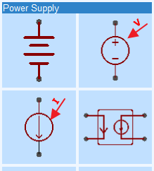

This section describes in detail how any dependent source can be set up to provide the following types of signal sources:

*   SINE or SIN: a sinusoidal signal;
*   PULSE: a general pulse waveform;
*   EXP: a single pulse with exponential rising and falling edges;
*   SFFM: (Single Frequency Frequency Modulated) a single sinsusoidal carrier, frequency modulated by single sinusoidal frequency;
*   AM: (Amplitude Modulated) a single sinusoidal carrier, amplitude modulated by a single frequency;
*   PWL: (PieceWise Linear sources} an arbitrary waveform source with signals created as a list of times and levels with the signal linearly interpolated between each time point.

Although the examples in this section only illustrate how to configure Dependent Voltage Sources, Dependent Current Sources are configured in exactly the same way.

#### Configuring the SIN or SINE option

Configuring the SINE option to create an unmodulated, single frequency sinusoidal signal source.

[Spice Sinusoidal Source example](https://easyeda.com/editor#id=cw641ZlxT)


#### More ways to use the SIN (or SINE) option

[Spice Sinusoidal Source: more examples](https://easyeda.com/editor#id=vLFyQ82kC)

#### Configuring the PULSE option

Configuring the PULSE option to create a pulse signal source.

[Spice PULSE Source](https://easyeda.com/editor#id=XPJDUcuoG)

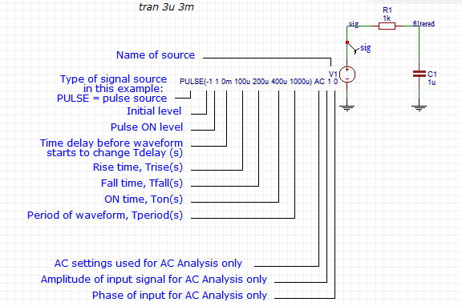

#### More ways to use the PULSE option

[Spice PULSE Source: more examples](https://easyeda.com/editor#id=oOICUcun3)

#### Configuring the EXP option

Configuring the EXP option to create a single pulse source with exponential rising and falling edges.

[Spice EXP Source](https://easyeda.com/editor#id=cewqI0hzR)

#### Configuring the SFFM option

Configuring the SFFM option to create a simple, single frequency, frequency modulated sinusoidal signal source.

[Spice SFFM Source](https://easyeda.com/editor#id=SwqI0izRL)

#### Configuring the AM option

Configuring the AM option to create a simple, single frequency, amplitude modulated sinusoidal signal source.

[Spice AM Source](https://easyeda.com/editor#id=KGZNnJtdX)

#### Configuring the PWL option

Configuring the PWL option to create an arbitrary piecewise linear waveform signal source.

[Spice PWL Source](https://easyeda.com/editor#id=wxhbHBvN5)

#### Configuring the AC source option

It can be quite hard to visualise what the Amplitude and the Phase settings in the AC Source options of the Independent Voltage and Current Sources really mean when the signals in an AC Analysis cannot be viewed in the time domain in a Transient Analysis. To try to help visualise these settings and what they represent, the following couple of examples demonstrate the settings in ways that can be related back to their equivalents in the time domain.

The first example shows how more than one AC Source can be configured in a circuit to represent different signal sources at the same frequency but with different phases. The example also shows how the phase settings relate to the same signals in the time domain.

In this example both AC Sources are set to the same amplitude of 1. They could be set to different amplitudes: try it and compare the results with the same amplitude changes in the time domain part of the signal sources.

[Configuring AC Sources 01](https://easyeda.com/editor#id=JPlfL2kew)

Note, however, that the AC Analysis assumes that the circuit is perfectly linear so even if an AC Source amplitude 100 were to be specified, the output would still look as if it came from a perfectly linear circuit. Compare that with what happens if the time domain parts of the sources are set to 100!

The DC offset of the inphase AC Source in this example is important because it biases Q1 into a range where both the emitter and collector swings are operating in the linear region.

This can clearly be seen by probing V(Q1E) and V(Q1C) in a Transient Analysis. If the DC Offset is increased, eventually the V(Q1C) as V(Q1E) rises will until they meet as Q1 saturates and V(Q1E) starts to pull V(Q1C) back up again. At the point where this happens the small signal gain of the collector output passes though zero and then becomes a noninverting gain of somewhat less than unity.

If the DC offset is reduced to near ground or even below it, Q1 is cut off so both the collector and the emitter output small signal gains fall effectively to zero. Again this can clearly be seen in a Transient Analysis.

What is not so obvious is that although these effects still occur in the AC Analysis, because they are represented in the frequency domain, they can sometimes be hard to interpret.

So, the information to take away from this is that if an AC Analysis seems to be showing a lower than expected gain then it is worth checking that the DC operating point of the circuit is not forcing some part of it into saturation or cutoff. One example of this is incorrectly biasing an opamp input so that the output has hit one or the other of the supply rails. Forgetting to connect up a power supply rail is another common mistake.

It must also be understood that although any number of AC Sources can be placed in a circuit, each with their own amplitude and phase, all the sources will operate at exactly the same frequency as this is determined by the AC Analysis settings and not by the sources themselves.

In a circuit with several Independent Sources in it, AC sources can simply be added to, removed from or moved around it simply by adding the AC amplitude and phase values to the required source. So in the example above, the response of the inphase and outofphase side of the all pass network can be observed simply by setting one AC Source or the other to have zero amplitude or just by deleting the AC parts of the Source configuration.

Another example of this might be that the frequency response of an amplifier from signal input to output can be plotted using an AC Source at the input source whilst the frequency response of the amplifer from power supply ripple to output can be plotted by swapping the AC Source settings to the voltage source being used for the power supply.

The second simulation also shows how more than one AC Source can be configured in a circuit to represent different signal sources at the same frequency but this time with different amplitudes and phases. This example also shows how the amplitude and phase settings relate to the same signals in the time domain.

[Configuring AC Sources 02](https://easyeda.com/editor#id=PDxrJDjAu)

### Setting up Analyses

#### What are Analyses?

An analysis is simply the instruction to the simulator telling itwhat type of simulation to carry out on the spice netlist.

There are several different types of analysis that can be carriedout when a simulation is run.

EasyEDA supports a subset of the spice analyses that are availablein ngspice. The supported analyses supported by the Simulate...dialogue box (accessed via the green running man &gt; Run the Documentor Run the Project options or directly via CTRL+R) are described below.

##### SPICE Analyses available from the Green Man / Simulate... button

Clicking on the Green Man (Simulate...) icon opens the Simulation options menu.

*   Run the Document...<p>This is to run a simulation on a single schematic sheet.<p>

*   Run the Project...<p>This is to run a simulation on all the schematic sheets in a project.

Note that the component prefixes (reference designators) must be unique across all schematic sheets: i.e. there must be no duplicate reference designators.

   Attempting to run a simulation on any sheet or collection of sheets containing duplicate reference designators will generate the 'Prefix conflict error'.

  By doing:

Simulate... &gt; Run the Document... / Runthe Project...

the following SPICE analyses can be run from a simple dialogue box.For more information about what they do, please scroll down to therelevant sections.

1) DC op pnt

2) DC Transfer

3) DC Sweep

4) AC Analysis

5) Transient

##### SPICE Analyses and Control Statement Syntax

The following SPICE analyses can also be entered directly into atext box in a schematic.

Several analysis statements can be entered in a single schematic butone and only one can be made active for any one simulation run. To makean analysis statement active, do:

**Properties &gt; Text Attributes &gt; Texttype &gt; spice**

To make an analysis statement inactive, do:

**Properties &gt; Text Attributes &gt; Texttype &gt; comment**

They can then be run simply by doing:

**CTRL+R**

Several analysis statements can be entered in a single schematic butone and only one can be made active for any one simulation run.

##### 1) OP: Perform an Operating Point Analysis

General form:

op

Example:

op

Causes SPICE to perform an operating-point analysis to determine thethe quiescent state of the circuit with inductors shorted andcapacitors opened. The results of this analysis are used to calculatevalues for the the linearised, small-signal models of nonlinear devices.

##### 2) TF: Perform a DC Transfer Function Analysis

The dc transfer function analysis portion of SPICE computes thefollowing small signal characteristics:

the ratio of output variable to inputvariable (gain or tranfer gain)

the resistance with respect to the inputsource

the resistance with respect to the outputterminals

The TF statement can be used to find the Thevenin small signalequivalent resistance. (The Thevenin voltage is given by the nodevoltage at the open circuit terminal, as a result of the OP statement).

General form:

	tf OUTvar inSRC

Examples:

	tf V(5, 3) VIN

	tf I(VLOAD) VIN

The TF command defines the small-signal output and input for the DCsmall-signal analysis. OUTvar is the small-signal output variable andinSRC is the small-signal input source. If this line is included, SPICEcomputes the DC small-signal value of the transfer function(output/input), input resistance and the output resistance.

##### 3) DC: Perform a DC-Sweep Analysis

During a DC-sweep analysis SPICE steps the value of a specifiedindependent voltage or current source over the user-specified range andperforms an operating point analysis at each value. This permits theevaluation of the DC transfer function, and also provides a mechanismfor plotting the characteristic curves of devices and models.

General form:

dc Source-Name Vstart Vstop Vincr [Source2 Vstart2 Vstop2 Vincr2 ]

Examples:

	dc vin 0.25 5.0 0.25
	
	dc vin 0 10 .5 vgs 0 5 1
	
	dc vce 0 10 .25 ib 0 10u 1u
	
	dc R1 0 1k 100
	
	dc TEMP 0 100 1

The parameters define the dc transfer-curve source and sweep limits.Source-Name is the name of an independent voltage or current source, aresistor or the circuit temperature. Vstart, Vstop, and Vincr are thestarting, final, and incrementing values respectively. The firstexample causes the value of the voltage source vin to be swept from0.25 volts to 5.0 volts in increments of 0.25 volts. A second source(Source2) may optionally be specified with associated sweep parameters.In this case, the first source is swept over it's range for each valueof the second source.

It is worth highlighting that the DC Sweep Spice Analysis allows notjust voltage and current sources to be swept but also temperature andresistances because Source-Name can also refer to a resistor in thecircuit or to the keyword TEMP meaning temperature in degrees Celcius.

The following simulations illustrate sweeping:

*   a voltage source;

[Plot and compare diode forward currents vs. voltage](https://easyeda.com/editor#id=HFzR8qkCU)

*   a resistor value;

[Sweep a resistor value](https://easyeda.com/editor#id=ikGqM8RdX)

*   the ambient temperature applied to every component in the simulation:

[Sweep the ambient temperature](https://easyeda.com/editor#id=P0UO6oGAS)

##### 4) AC: Perform a Small-Signal AC (frequency domain) Analysis

The ac small-signal portion of SPICE computes the ac outputvariables as a function of frequency. The program first computes the dcoperating point of the circuit and determines linearized, small-signalmodels for all of the nonlinear devices in the circuit. The resultantlinear circuit is then analyzed over a user-specified range offrequencies. The desired output of an ac small-signal analysis isusually a transfer function (voltage gain, transimpedance, etc). If thecircuit has only one ac input, it is convenient to set that input tounity and zero phase, so that output variables have the same value asthe transfer function of the output variable with respect to the input.

General form:

	ac ( DEC | OCT | LIN ) N Fstart Fstop

Examples:

	ac dec 10 1 10K
	
	ac dec 10 1k 100Meg
	
	ac lin 100 1 100HZ

Use:

'**dec**' for decade variation, in which caseN is the number of points per decade;

'**oct**' for octave variation, in which caseN is the number of points per octave;

'**lin**' for linear variation, when N is thetotal number of points.

Fstart is the starting frequency, and Fstop is the final frequency.

##### 5) TRAN: Perform a Transient (time domain) Analysis

The transient analysis portion of SPICE computes the transientoutput variables as a function of time over a user-specified timeinterval. The initial conditions are automatically determined by a dcanalysis. All sources which are not time dependent (for example, powersupplies) are set to their dc value.

General form:

	tran Tstep Tstop [ Tstart [ Tmax ] ] [uic ]

Examples:

	tran 1ns 100ns 0ns 2ns
	
	tran 1ns 1000ns 500ns 10ns
	
	tran 10ns 1us 0us 20ns uic
	
	Tstep is the suggested computing increment.
	
	Tstop is the final time.
	
	Tstart is the initial time.

If Tstart is omitted, it is assumed to be zero. The transientanalysis always begins at time zero.

In the interval<zero, tstart="">, the circuit is analyzed (toreach a steady state), but no outputs are stored. In the interval<tstart, tstop="">, the circuit is analyzed and outputs are stored. Tmax is themaximum step-size that SPICE uses; try Tmax=(Tstop-Tstart)/50.0 tostart with.</tstart,></zero,>

The optional keyword 'uic' (use initial conditions) indicates thatthe user does not want ngspice to solve for the quiescent operatingpoint before beginning the transient analysis. If this keyword isspecified, ngspice uses the values specified using IC=... on thevarious elements as the initial transient condition and proceeds withthe analysis. If the .ic control line has been specified, then thenode voltages on the .ic line are used to compute the initialconditions for the devices. IC=... will take precedence over the valuesgiven in the .ic control line. If neither IC=... nor the .ic controlline is given for a specific node, node voltage zero is assumed.

Please see the description below of the .ic control line for itsinterpretation when uic is not specified.

##### IC: Set Initial Conditions

General form:

	.IC V(n1)=VAL &lt;V(n2)=VAL&gt;&lt;...&gt;

Example:

	.IC V(11)=5 V(4)=-5 V(2)=2.2

The IC line is for setting initial transient conditions. It has twodifferent interpretations depending on whether the UIC parameter isspecified on the .TRAN control line. One should not confuse this linewith the .NODESET line. The .NODESET line is only to help DCconvergence, and does not affect final bias solution (except formulti-stable circuits). The two interpretationsof this line are as follows:

*     When the uic parameter is specified on the .tran line, thenthe node voltages specified on the .iccontrol line are used to compute the capacitor, diode, BJT, JFET, andMOSFET initial conditions. This is equivalent to specifying the ic=...parameter on each device line, but is much more convenient. Theic=... parameter can still be specified and takes precedence over the.ic values. Since no dc bias (initial transient) solution is computedbefore the transient analysis, one should take care to specify all dcsource voltages on the .ic control line if they are to be used tocompute device initial conditions.
*     When the uic parameter is not specified on the .tran controlline, the dc bias (initial transient) solution is computed before thetransient analysis. In this case, the node voltages specified on the.ic control line is forced to the desired initial values during thebias solution. During transient analysis, the constraint on these nodevoltages is removed. This is the preferred method since it allowsngspice to compute a consistent dc solution.
*   Note that the 'uic' option must be used with caution.

Normally, a DC operating point analysis is performed before starting the transient analysis. Theresults of this DC operating point analysis provide the initial conditions for the circuit at time t=0.

The 'uic' spice directive suppresses this initialization.

The initial conditions of some circuit elements can be specified on an instance-per-instance basis. Forexample: transistors can be specified to be in an OFF initial state; switches can be specified to be inan ON or an OFF initial state; the .IC spice directive allows the voltages on nets at t=0 to bespecified.

If the 'uic' option is added to a tran spice directive then all specified initial conditions are used.

It is important to realise however that if the 'uic' directive is used without explicitly stating theinitial conditions then, because the DC operating point analysis is omitted, default values are assumed.This can cause problems in some simulations because the default values can lead to nonphysical initialconditions around a circuit. For example, consider an ideal voltage source connected in parallel to anideal capacitor. Unless it is specified otherwise, the default initial value of the voltage source istaken as zero. Therefore, the voltage across the capacitor is also zero at t=0. Then, in the first timestep, the voltage source is set to the operating output voltage so an infinite current is drawn from itto charge the capacitor up to this operating voltage. The simulator cannot find a short enough timestep to make this current finite, and a "time step too small convergence fail" message is issued.

Note that if the 'uic' option is not used then any .IC directives included in the simulation are used anyway.


### Initial conditions and starting up circuits

#### Some background and basic start-up techniques

All time domain simulations start at time t=0.

Even though it is possible to start plotting the results of a simulation at some time after t=0, the simulation itself always starts at t=0.

The initial DC conditions of a circuit are completely defined by the initial levels or DC offsets of any sources present in the circuit. So for example a DC power rail that is set to 9V is treated by the simulator as having been at 9V for all time prior to t=0.

Similalrly a SINE source with a -1V DC offset or a PULSE source with an initial level of 1V are treated by the simulator as having been at -1V DC for all time prior to t=0.

Therefore the voltages in a circuit, such as bjt base bias potential dividers and so on, will have been set to DC steady state values for all t&lt;0. Consequently, the voltages across all capacitors and the currents through all inductors in the circuit will have reached their DC steady state values prior to the simulation starting at t=0.

Even if the circuit is an oscillator, prior to t=0 it will have been assumed to be in a stable non-oscillating steady state. At t=0 the circuit will then start from those initial DC conditions. It will then either continue in that steady non-osillating state or will slowly drift away from the steady DC state and oscillations will build up.

The initial state of oscillators based on a tuned circuit such as phase shift, Wien Bridge and Crystal Oscillators will be defined by their DC bias conditions. If there are no noise sources in the circuit (the default state for all components unless otherwise specified such as resistors defined to have noise contributions) then there is nothing to nudge the circuit away from equilibrium and so it may never start oscillating.

Although in most cases such oscillators will eventually start up due to the 'hidden' noise source which is simply due to the mathematical noise generated by the finite resoluton and rounding errors of the calculations carried out in running a simulaton, this can take a very long time compared to the time taken to run the oscillator in a stable oscillatory state for a few cycles. Crystal oscillators in particular can take many hunderds of thousands of times the oscillator period to start up and reach a stable state.

To minimise the simulation time spent waiting for an oscillator to start, it is useful to introduce some initial start-up condition to 'kick-start' the circuit into oscillation.

The simplest way to kick-start a circuit into oscillation is to replace a simple DC supply source with a PULSE source set to an initial level of the desired power supply voltage but configured to generate a short pulse of the supply voltage plus or minus some small voltage. So for example a circuit with a 9V supply that is to run for 1ms with a time step of 1us could have a PULSE source set to an initial level of 9V pulsed down to 8.5V for 1us with 100ns rise and fall times. Or an initial level of 8.5V with a delay of 1us before a 100ns risetime step up to a pulse level of 9V.

The same trick can be carried out using a voltage source inserted into the circuit almost anywhere in the circuit simply to inject a small step or pulse into a bias voltage but it must be remembered that if the voltage step or pulse does not return to 0 after the kick then it will represent an offset voltage in that part of the circuit.

An example of this is in forcing crystal oscillators to start.

Crystal oscillators take a very long time to start up because of the extremely high Q of the crystal.

The same thing is true of their simulations so, to avoid simulations taking too long to run and generating massive data files, they may need to be run in stages with increasing start and stop times but a small (Tstop - Tstart) value.

As discussed earlier, injecting a small step into the supply voltage or an internal node of the circuit can help to start the oscillations a little earlier but the idea of injecting a small step or pulse into a circuit to kick it into life is taken to an extreme in the EasyEDA crystal model.

The technique used in the XTALfast subckt is to include a PULSE source internal to the crystal model to introduce a very high amplitude impulse at t=0 inside the model. This starts the oscillator almost instantly and because an impulse with a very wideband spectrum is used rather than a step (or a sinusoidal burst at the crystals natural resonant frequency), the oscillations start at the actual resonant frequency of the crystal in the application circuit.

The start up time of the example below using the XTALfast subckt can be compared with the same crystal model but with an unassisted start simply by editing the name of the crystal model from XTALfast to XTALnofast.

[Crystal oscillator using the EasyEDA quick starting crystal model](https://easyeda.com/editor#id=a71jBTb5n)

The EXP and PWL sources can also be used as kick-starter supply sources.

Most relaxation oscillators such as the classic two transistor astable multivibrator or the 555 timer have two stable states. Oscillation is normally maintained by the circuit switching between these two states however, under DC bias prior to t=0, these circuits often settle into one or the other of these stable states and so are stuck there at t=0. This means that they never start oscillating.

This is an example of a simple RC relaxation oscillator that does not start up by itself:

[Relaxation oscillator startup 01](https://easyeda.com/editor#id=FeKga4mgy)

This type of circuit may need a rather more vigorous kick to get it started. This can be done using a PULSE source but instead of introducing a small step, the supply is ramped up to the desired supply voltage from 0. So, for example, by setting an initial level of 0 and a pulse level of 9 with zero delay time, with a risetime of 200us the circuit starts up cleanly up from all internal nodes being at zero:

[Relaxation oscillator startup 03](https://easyeda.com/editor#id=53XfxrI0i)

Another possibility - which will be explained in more detail later - is to use an expression that is a function of time in a B source.

For example, this expression in a B source:

	V=9_(1-exp(-1_time/100u))

generates a voltage that starts at zero and rises exponentially to a final value of 9V with a time constant of 100us:

[Relaxation oscillator startup 04](https://easyeda.com/editor#id=SKEyQ8qkB)

With symmetrical circuits such as the two transistor astable multivibrator, even this may not be enough to disturb the equilibrium enough to get them oscillating. It may be necessary to introduce some delibrate asymmetry or imbalance into the circuit, for example by making a one base pullup resistor or a timing capacitor a fraction different from the other. Even changes of less than the expected real component tolerance can be enough to tip the circuit into self sustained oscillation with a zero to rated voltage ramped supply start-up.

Sometimes complex circuits - or simple circuits with complex models - may fail to simulate because the simulator cannot find the DC operating point prior to t=0. Such circuits will very often simulate fine if the supply (or supplies) are ramped up from 0. In the same way as slightly imbalancing symmetrical components can help start-up, slightly imbalancing the voltages, delay or rise times of the supply voltage ramps may help start-up more 'difficult' simulations.

There is, however, a down side of using the start-up from zero supply ramp. As already stated, at the start of a transient simulation, the voltages across all capacitors and the currents through all inductors in the circuit will have reached their DC steady state values prior to the simulation starting at t=0. If the simulation starts with the supply voltages set to zero at t=0 then obviously all the internal voltages and currents must also be zero (except for some small offsets due to the initial levels of any signal sources and sometimes, badly designed sources internal to models that do not collapse to zero with zero supply voltages).

If all the internal voltages and currents are zero at t=0 then it may take much longer than the desired simulation stop time for all the internal nodes to reach their DC steady states.

A simple solution to this is to run the simulation for long enough for everything to have settled but to only plot the results for just long enough before the stop time to show the signals of interest. So, for example a circuit that is driven by a 1kHz source but which takes 95ms to settle could be observed from say, t=98ms to t=100ms by setting the transient anaylsis to have a maximum timestep of 1us, a stop time of 100ms and a Start time of 98ms, like this:

	tran 1u 100m 98m

This solution works very well but, in this example, over 95% of the simulation time is used just to get the circuit to a steady state before any useful results are generated. This is very wasteful of simulation time and for complex simulations such as switch mode power supply (SMPS) simulations - where exactly this situation is likely to arise - can take many minutes of real time.

This is where another technique for setting initial conditions in a circuit can sometimes be useful.

#### Setting initial voltages on nets and currents through components

There are occasions where it is required to start a simulation in some predetermined state. For example, a capacitor may be required to start a transient simulation at time t=0, precharged to some given voltage. Similarly the current in an inductor may need to be specified at time t=0. In a larger simulation it may be helpful to precharge the output smoothing capacitor of a power supply to approximately the right voltage to save the time taken for it to be charged up from zero. If the capacitor is at the output of an SMPS then it may be useful to charge the inductor(s) in the SMPS to their average operating current(s) too.

##### Using the ic spice directive

Using the `.ic` spice directive to set an initial voltage condition on a net

For more information about the .ic spice directive see:

[About-spice-analyses-in-EasyEDA](https://easyeda.com/file_view_About-spice-analyses-in-EasyEDA_CNHZFztL3.htm)

Use of the '.ic' spice directive is illustrated in these two examples:

[Setting initial circuit conditions 01](https://easyeda.com/editor#id=hZXjgCYWU)

[Relaxation oscillator startup 02](https://easyeda.com/editor#id=yUOHZhztL)

These next examples show two ways to use append the 'uic' option to a Transient Analysis but for the reasons already given in the description of the 'uic' option in the section on 'IC: Set Initial Conditions' in 'Setting up Analyses', care should be taken in using this option.

[Relaxation oscillator startup 05](https://easyeda.com/editor#id=6smEWP7pH)

[Relaxation oscillator startup 06](https://easyeda.com/editor#id=IOMK531Zl)

##### Using a current source to set an initial current through an inductor

The `.ic` spice directive can only be used to set initial voltage conditions on one or more nets. It cannot be used to set an initial current through a component. This example illustrates a simple way to use a current source to set an initial current through a component.

[Setting initial circuit conditions 02](https://easyeda.com/editor#id=Emy7tPbxv)

##### Setting a capacitor voltage using an XSPICE capacitor model

An alternative to using the '.ic': setting the initial voltage across a capacitor using an XSPICE capacitor model in place of the default EasyEDA capacitor.

[Setting initial circuit conditions 03](https://easyeda.com/editor#id=bBJe82kCw)

##### Setting an inductor current using an XSPICE inductor model

An alternative to using a current source in parallel with an inductor: setting the initial current through an inductor using an XSPICE inductor model in place of the default EasyEDA inductor.

[Setting initial circuit conditions 04](https://easyeda.com/editor#id=SKSMic60h)

Some circuits may start up on their own but simply changing a component model may cause it to fail to start-up. Don't be afraid to try these techniques before spending ages trying to find some other obscure cause.

#### Using a 1V source to help start-up

This is an advanced technique which has limited application but which in the right circumstances can be very useful.

By placing a 1V voltage source in a schematic, naming it's output as, say, 'unity' and then multiplying using expressions in B Sources by V(unity), it is possible to force all the B sources in the simulation to start from zero during the early DC operating point parts of a transient simulation.

This can sometimes help produce a clean startup from zero internal initial states.

It must be borne in mind however, that as with other techniques that bring a simulation up from zero, any attemtp to run an OP, TF or an AC simulation will usually return zero results because all the internal states and in many cases the gains of B sources will have been forced to a zero initial value.

#### Replacing ideal and Thevenin voltage sources with band-limited Norton Sources to help start-up

This is technique is very widely applicable since it helps improve the overall convergence of simulations and not just their startup behaviour.

Ideal voltage sources in simulations are capable of producing infinite currents so a load which looks capacitive at any point during the simulation has the potential to cause an instantaneous infinite current flow. This can cause a simulation to go into overflow or to fail to find a valid next step from which to proceed. In either case, the simulation will fail to converge. To prevent this it is good practice to always include some resistance in series with every voltage source, whether that is an independent V, dependent E or H source or a dependent B source configured as a voltage source.

This turns all ideal voltage sources into Thevenin Sources, i.e. voltage sources with a finite source resistance.

Internally, however, the simulator is actually more efficient at calculating the currents and voltages around a Norton Source than a Thevenin source. So, the next step of the process is to convert all the Thevenin sources in a simulation into Norton Sources.

A Norton Source is the exact equivalent circuit of a Thevenin Source. To convert a Thevenin source to the Norton Equivalent source, the voltage source of the Thevenin source is replaced with a current source equal to the short circuit current of the Thevenin source and the series resistance of the Thevenin source is reconnected in parallel with this current source. Both sources than have identical source resistances, open circuit voltages and short circuit currents.

So far these steps of converting ideal voltage sources to Thevein sources and then to Norton equivalent sources generally increases the simulation speed of most simulations but the final step of limiting the bandwidth of the Norton sources can significantly improve the start-up and convergence of many simulations.

Limiting the bandwidth (or band-limiting) a Norton Source is easy: all that is required is to connect a capacitor in parallel with the source resistance that has already been connected in parallel with the current source. This creates a lowpass filter across the output of the Norton source which reduces the output at high frequencies. This means that even if the source is passing or generating highly non-linear signals that can produce exactly the kind of very fast and even discontinuous signals that spice struggles to deal with in its internal calculations, as the frequency content of these signals and transitions exceeds the lowpass filter cutoff frequency, they are reduced to relatively slower edged (i.e. reduced high-frequency content) signals. Such signals then have finite rise and fall times and so spice no longer struggles to deal with them. They become much more spice friendly continuous signals.

Even better is that if there are several such band-limited sources sprinkled around the circuit (such as the input signal sources) then very often the derivatives of these signals also become continuous. This is also a big help to spice because much of the internal calculation in spice is in estimating not just where a signal is but also making estimates about where it is going and how fast it is getting there.

Some words of warning are needed here though. Replacing voltage and Thevein sources with band-limited Norton sources is a great technique but it requires a high degree of understanding of what is really going on in a simulation circuit.

The statement above about:

"...all that is required is to connect a capacitor in parallel with the source resistance that has already been connected in parallel with the current source. This creates a lowpass filter across the output of the Norton source which reduces the output at high frequencies."

is all very well but it skirts around the question of what should the value of this capacitance actually be? There is no signal answer that question because the cutoff frequency required to avoid convergence or start-up problems will vary from one circuit to another and even from one location to another in a circuit. The single biggest factor affecting the value of simply that the cutoff frequency must be much higher than the working frequencies of not the circuit itslef but of the devices in it. So for example, an audio amplifier circuit designed for a bandwidth of 20kHz may use an opamp that is operated with a closed loop bandwidth that is 200kHz but which internally may have a gain bandwidth of 2MHz or even 20MHz.

In practice, setting the cutoff frequency with an RC time constant of 1ps (1e-12s) i.e. approximately 160GHz should be safe for most 'ordinary' simulations of amplifiers, linear and switch mode power supply circuits but for high frequency and RF circuits the band-limiting must be increased accordingly.

The value of the resistor in this parallel RC circuit can be also be very tricky to decide. For many lightly loaded voltage sources, a value of 1 &#937; is OK and simplifies the calculation of the parallel capacitance to 1pF. In some sources, however, it may be necessary to use a higher (or lower value) of parallel resistance. This in turn will require the use of a proportionately smaller (or larger) capacitance for the same cutoff frequency.

This band-limiting technique should generally not be applied around any existing current sources in a simulation circuit. Placing an RC circuit in parallel with a pure current source may do more damage to the operation of the circuit by reducing the in-band source impedance of the current source than the band-limiting avoids!

Although not an example of start-up or initialisation problem, the Ideal and Thevein to Norton Source conversion is demonstrated in steps (i), (ii) and (iii) of this simulation:

[Parameters, expressions, functions and B Sources](https://easyeda.com/editor#id=8MhztnFXf)

#### Using the 'OFF' option to help start-up

Some components, such as switches, bjts, jfets, MOSFETs and MESFETs have an 'OFF' option to specify the device to be in an intial OFF state.

Switches also have an 'ON' option to specify the device to be in an intial ON state.

This option can be very useful to ensure that for example, one side of a two transistor bistable or monostable circuit or an astable mutlivibrator is off, so avoiding the situation described above where both transistors are on in the intitial state. Whilst this does not in itself guarantee that the circuit will start up from t=0 but it may simplify any other measures that have to be taken to ensure it does.

These states are simply invoked by appending the keyword OFF (or, for switches only, ON) after the device name. This can be done either by directly editing the name in place in the schematic or via the right hand panel Properties dialogue. For example, to set a switch with the name MYSWITCH to be initially ON the name should be edited to:

MYSWITCH ON

Similarly, to set a bjt with the name 2N2222 to be initially OFF the name should be edited to:

2N2222 OFF

### Expressions

Expressions can be used to define component values and to help configure Voltage and Current Sources.

#### Operators

In expressions, parentheses are evaluated before the other operators. The operators are evaluated following a list of precedence as shwn in the table below. For equal precedence binary ops, evaluation goes left to right. Functions operate on real values only!
<table border="1" cellspacing="0">
<colgroup span="4" width="100"></colgroup>
<tbody>
<tr>
	<td align="left">
		Operator
	</td>
	<td align="left">
		Alias
	</td>
	<td align="left">
		Precedence
	</td>
	<td align="left">
		Description
	</td>
</tr>
<tr>
	<td align="left">
		-
	</td>
	<td align="left">
	</td>
	<td align="left">
		1
	</td>
	<td align="left">
		unary negate (see Note 1 below)
	</td>
</tr>
<tr>
	<td align="left">
		!
	</td>
	<td align="left">
	</td>
	<td align="left">
		1
	</td>
	<td align="left">
		unary not
	</td>
</tr>
<tr>
	<td align="left">
		**
	</td>
	<td align="left">
		^
	</td>
	<td align="left">
		2
	</td>
	<td align="left">
		power (but see also the pow(x,a), pwr(x,a) and pwrs(x,a) functions)
	</td>
</tr>
<tr>
	<td align="left">
		*
	</td>
	<td align="left">
	</td>
	<td align="left">
		3
	</td>
	<td align="left">
		multiply
	</td>
</tr>
<tr>
	<td align="left">
		/
	</td>
	<td align="left">
	</td>
	<td align="left">
		3
	</td>
	<td align="left">
		divide
	</td>
</tr>
<tr>
	<td align="left">
		%
	</td>
	<td align="left">
	</td>
	<td align="left">
		3
	</td>
	<td align="left">
		modulo (does not work in B Source expressions)
	</td>
</tr>
<tr>
	<td align="left">
		\
	</td>
	<td align="left">
	</td>
	<td align="left">
		3
	</td>
	<td align="left">
		integer divide (does not work in B Source expressions)
	</td>
</tr>
<tr>
	<td align="left">
		+
	</td>
	<td align="left">
	</td>
	<td align="left">
		4
	</td>
	<td align="left">
		add
	</td>
</tr>
<tr>
	<td align="left">
		-
	</td>
	<td align="left">
	</td>
	<td align="left">
		4
	</td>
	<td align="left">
		subtract
	</td>
</tr>
<tr>
	<td align="left">
		==
	</td>
	<td align="left">
	</td>
	<td align="left">
		5
	</td>
	<td align="left">
		equality
	</td>
</tr>
<tr>
	<td align="left">
		!=
	</td>
	<td align="left">
		&lt;&gt;
	</td>
	<td align="left">
		5
	</td>
	<td align="left">
		non-equal
	</td>
</tr>
<tr>
	<td align="left">
		&lt;=
	</td>
	<td align="left">
	</td>
	<td align="left">
		5
	</td>
	<td align="left">
		less or equal
	</td>
</tr>
<tr>
	<td align="left">
		&gt;=
	</td>
	<td align="left">
	</td>
	<td align="left">
		5
	</td>
	<td align="left">
		greater or equal
	</td>
</tr>
<tr>
	<td align="left">
		&lt;
	</td>
	<td align="left">
	</td>
	<td align="left">
		5
	</td>
	<td align="left">
		less than
	</td>
</tr>
<tr>
	<td align="left">
		&gt;
	</td>
	<td align="left">
	</td>
	<td align="left">
		5
	</td>
	<td align="left">
		greater than
	</td>
</tr>
<tr>
	<td align="left">
		&amp;&amp;
	</td>
	<td align="left">
	</td>
	<td align="left">
		6
	</td>
	<td align="left">
		boolean and
	</td>
</tr>
<tr>
	<td align="left">
		||
	</td>
	<td align="left">
	</td>
	<td align="left">
		7
	</td>
	<td align="left">
		boolean or
	</td>
</tr>
<tr>
	<td align="left">
		c?x:y
	</td>
	<td align="left">
	</td>
	<td align="left">
		8
	</td>
	<td align="left">
		ternary operator (See also the if(x,y,z) and ifx(x,y,z) functions)
	</td>
</tr>
</tbody>
</table>

**Note 1**

At the time of writing (141021), the ngspice implementation of the unary negate or subtract symbol works as expected when used in this type of expression:

	.param myparameter={A-B}

but may produce unexpected results when used in an expression for a B Source (or in a .func statement) like this:

	V=5*(1-exp(-time/1m))

This expression must be written instead as:

	V=5_(1-exp(-1_time/1m))

This is a feature of ngspice. It is hoped that this anomaly will be corrected at some point in the future and that this will feed into later revisions of EasyEDA.

The number zero is used to represent boolean False. Any other number represents boolean True. The result of logical operators is 1 or 0.

Some examples of logical operators used to defined value of voltage sources:

	V1or 1 0 {1 | | 0}
	
	V2and 2 0 {1 &amp;&amp; 0}
	
	V3not 3 0 { ! 1}
	
	V4mod 4 0 {5 % 3}
	
	V5div 5 0 {5 \ 3}
	
	V6not 6 0 { ! 0}

Note that when used directly in component and source value fields, expressions MUST be on a single line. When used like this, expressions cannot be wrapped over more than one line.

#### Using Expressions to define component values

The -3dB frequency, fc, of a first order RC lowpass filter is given by:

	fc = 1/(2_pi_R*C)

Exactly the same expression applies to a first order RC highpass filter.

If fc is specified as 10kHz and R is chosen as 1k then:

	C = 1/(2_pi_1k*10k)

Suppose the high pass filter output is required to be attenuated by a factor, A.

The total value of R for the highpass filter is still 1k but it must be split into a lower resistor with a value given by:

	Rlower = (Rupper+Rlower)*1/A

whilst the upper value is given by:

	Rupper = (Rupper+Rlower)*(1-1/A)

If we choose A=3 then for the chosen value of R=1k

	Rlower = 1k*1/3

and:

	Rupper = 1k*2/3

Simply by entering the right hand side of these expressions into the component values fields, enclosed in curly brackets like this:

	{expression}

the value of those components will be defined directly by those expressions, as illustrated in Rupper and Rlower in this example.

#### Using Expressions to configure voltage and current sources

In this example, PULSE source V1 is configured to generate a signal with a 20us rise and fall time, a frequency of 5kHz and exactly equal high and low times: in other words, a slow edged squarewave of 200us period and a 50% duty cycle.

Because a PULSE source is defined in terms of Trise and Ton, it can be helpful to think of the time interval from the start of the rising (leading) edge to the start of the falling (trailing) edge as the 'pulse width', Twidth:

	Twidth = Trise+Ton

It is then a simple matter to define the PULSE source in terms of Trise and Twidth without having to manually calculate a value for Ton because:

	Ton = Twidth-Trise

From this we can also see that if the 'duty cycle' is defined as:

	D = Twidth/Tperiod

then for a given D:

	Ton = D*Tperiod - Trise

Lastly, it is sometimes convenient to define the period of a PULSE source in terms of a frequency:

	Frequency = 1/Tperiod

To use an expression in a source, simply enter it in place of the value you wish to calculate and enclose it in curly brackets like this:

	{expression}

The use of expressions is illustrated in the following example:

[Using expressions 01](https://easyeda.com/editor#id=MAIB71VP7)


### Parameters

Usually, the values of components are specified directly in the component's value field. There are, however, occasions where it is desirable to be able to set or change the value of several components at once without having to edit each individual component value.

The simple resistor attenuator circuit used to illustrate several of the early examples has one resistor of 1k and two of 2k. Instead of entering the value 1k into one resistor resistor 2k into each of the others, it is possible to set up two variables to represent these values.

To create two variables, R1val=1k and R2val=2k, a  `.param`  statement is placed into the schematic and turned into a spice directive (by doing: <span style="font-weight:bold">Properties &gt; Text type = spice)</span>:

<span style="font-weight:bold">.param R1val=1k R2val=2k</span>

The parameters are then used to define the values of the components in their value fields.

By placing more than one .param statement in a schematic and doing:

**Properties &gt; Text type = comment**

and

**Properties &gt; Text type = spice**

It is possible to switch sets of values without having to edit individual components evey time.

Using .param statements therefore makes it possible to:

*   change the value of several components a single edit;
*   define parameters in terms of other parameters;
*   define parameters in terms of functions of other parameters.

Note that it is also possible to have several .param statements active in a simulation at the same time but to avoid the conflict caused by duplicate definitions, the parameter identifier names in each set must be unique.

The syntax of .param statements is:

	.param
	 <param_name1>=<value1> <param_name2>=<value2> ... <param_nameN>=<valueN>

'.param' statements can wrap over more than one line by using the '+' continuation character:
	.param 
	+ <param_name>=<value1> 
	+ <param_name2>=<value2> 
	+ ... + 
	+ ... +
	+  ... 
	+ <param_nameN>=<valueN>
 
Parameters can be numbers, other defined parameters or expressions made up from any combination of numbers and defined parameters.

Parameter identifier names must begin with an alphabetic character. The other characters must be either alphabetic, a number, or ! # $ % [ ] _ as special characters.

**Note that when used in .param statements, expressions can wrap over more than one line by using the '+' continuation character:**

	.param 
	+ <param_name>=<value1> 
	+ <param_name2>=<value2>
	+ <param_name3>=<{expression1}>
	+ <param_name4>=<{part of expression2 
	+ continuation of expression2}> 
	+ ... 
	+ <param_nameN>=<valueN>

Care must be taken in choosing the line break points to clearly distinguish the use of the '+' character as a continuation character from any mathematical use of the '+' character as an addition operator in an expression.

For example:

	.param x=3 y=4 
	+ hypotenuse={sqrt(x^2+ 
	+ y^2)}</xmp>

and:

	.param x=3 y=4 
	+ hypotenuse={sqrt(x^2 + 
	+y^2)}

are valid wrappings of expression in a .param statement which will give the expected results, whereas:

	.param x=3 y=4 
	+ hypotenuse={sqrt(x^2 
	+ y^2)}

or:

	.param x=3 y=4 
	+ hypotenuse={sqrt(x^2+ 
	y^2)}

or:

	.param x=3 y=4 
	+ hypotenuse={sqrt(x^2 
	+y^2)}

may give unexpected results or may fail with errors.

*   **Note that the variables TIME, TEMPER or TEMP and HERTZ are NOT valid identifier names.**

Note that to use a parameter in a component value field, it must be enclosed in curly brackets:

**{...}**

A parameter should also be enclosed in curly brackets if it is being used to define the value of another parameter, as in the example here of:

	R3val={R2val}

Although not shown here, the use of curly brackets to enclose expressions containing parameters which are then used to define other parameters is mandatory so, even though the use of curly brackets in the example shown above is not mandatory, it is good practice to always enclose in curly brackets any parameter or expression used in a parameter definition.

Note, however, that parameters in expressions used in B Sources must should not be enclosed in curly brackets.

The basic use of parameters is illustrated below:

[Using parameters 01](https://easyeda.com/editor#id=OKVvtr1Ay)

#### Using parameters in expressions

Expressions and parameters can be combined to simplify and automate the calculation of component and source configuration values, as illustrated in the following example:

[Using parameters in expressions 01](https://easyeda.com/editor#id=GQ5F1BzVu)


### Functions

The sections on expressions and parameters shows how component and source values can be defined using arithmetic equations. The examples used to illustrate this used only simple linear expressions. This section introduces the concept of functions.

Functions hugely expand the power of parameters and expressions by allowing the creation of expressions including non-linear functions of other parameters

#### Predefined functions

EasyEDA has a number of pre-defined functions. Many of them are immediately available to be used in expressions because they are built-in to ngspice or they are automatically added in to the spice netlist by EasyEDA at the time of first saving a schematic.

Some are not yet automatically added in to the netlist so their definitions must be pasted in manually before they can be used. These function definitions are clearly indicated in the examples illustrating each function.

These functions will be appended to the list of those automatically added to the netlist soon.

All the currently available pre-defined functions are listed, together with illustrative examples, in the table below.

Note that all the functions in this list can be used in any context in EasyEDA: in the value fields and in expressions for component values, Independent Sources and for B Sources.

##### Table of functions
<table border="1" cellspacing="0">

  <colgroup width="130"></colgroup> <colgroup span="3" width="120"></colgroup>
  <tbody>
    <tr>
      <td align="left">Function</td>
      <td align="left">Description</td>
      <td align="left">ngspice native or EasyEDA special</td>
      <td align="left">Where useable</td>
    </tr>
    <tr>
      <td align="left"><a href="https://easyeda.com/file_view_abs-x_xMic6oGYg.htm" target="blank">abs(x)</a></td>
      <td align="left">Absolute value of x </td>
      <td align="left">ngspice</td>
      <td align="left">E, I, B</td>
    </tr>
    <tr>
      <td align="left"><a href="https://easyeda.com/file_view_acos-x_HEWQ8qI0U.htm" target="blank">acos(x)</a></td>
      <td align="left">Arc cosine of x. Fails to converge for x &lt; -1
and x &gt; +1. Use invcos(x) instead.</td>
      <td align="left">ngspice</td>
      <td align="left">E, I, B</td>
    </tr>
    <tr>
      <td align="left"><a href="https://easyeda.com/file_view_acosh-x_IGztLFXfV.htm" target="blank">acosh(x)</a></td>
      <td align="left">Real part of the arc hyperbolic cosine of x,
e.g., acosh(.5) returns 0, not 1.0472i</td>
      <td align="left">EasyEDA</td>
      <td align="left">E, I, B</td>
    </tr>
    <tr>
      <td align="left"><a href="https://easyeda.com/file_view_atan-x-arctan-x_oOICUcunF.htm" target="blank">arctan(x)</a></td>
      <td align="left">Alternate syntax to atan(x)</td>
      <td align="left">ngspice</td>
      <td align="left">E, I, B</td>
    </tr>
    <tr>
      <td align="left"><a href="https://easyeda.com/file_view_asin-x_hDxP71jAS.htm" target="blank">asin(x)</a></td>
      <td align="left">Arc sine of x. Fails to converge for x &lt; -1
and x &gt; +1. Use invsin(x) instead.</td>
      <td align="left">ngspice</td>
      <td align="left">E, I, B</td>
    </tr>
    <tr>
      <td align="left"><a href="https://easyeda.com/file_view_asinh-x_dNHZhbRL3.htm" target="blank">asinh(x)</a></td>
      <td align="left">Arc hyperbolic sine</td>
      <td align="left">EasyEDA</td>
      <td align="left">E, I, B</td>
    </tr>
    <tr>
      <td align="left"><a href="https://easyeda.com/file_view_atan-x-arctan-x_oOICUcunF.htm" target="blank">atan(x)</a></td>
      <td align="left">Arc tangent of x</td>
      <td align="left">ngspice</td>
      <td align="left">E, I, B</td>
    </tr>
    <tr>
      <td align="left"><a href="https://easyeda.com/file_view_atan2-y-x_r1VdvpHZT.htm" target="blank">atan2(y,x)</a></td>
      <td align="left">4 quadrant arc tangent of x/y (tan^-1(x/y))</td>
      <td align="left">EasyEDA</td>
      <td align="left">E, I, B</td>
    </tr>
    <tr>
      <td align="left"><a href="https://easyeda.com/file_view_atanh-x_OZTN5ZhzR.htm" target="blank">atanh(x)</a></td>
      <td align="left">Arc hyperbolic tangent. (Limited output swing to
avoid numerical under/overflow failure.)</td>
      <td align="left">EasyEDA</td>
      <td align="left">E, I, B</td>
    </tr>
    <tr>
      <td align="left"><a href="https://easyeda.com/file_view_buf-x_YxrJDVdvN.htm" target="blank">buf(x)</a></td>
      <td align="left">Returns 1 if x &gt; 0.5, else 0</td>
      <td align="left">EasyEDA</td>
      <td align="left">E, I, B</td>
    </tr>
    <tr>
      <td align="left"><a href="https://easyeda.com/file_view_ceil-x_dQmEWe8qI.htm" target="blank">ceil(x)</a></td>
      <td align="left">Integer equal or greater than x</td>
      <td align="left">ngspice</td>
      <td align="left">E, I, B</td>
    </tr>
    <tr>
      <td align="left"><a href="https://easyeda.com/file_view_cos-x_Xx3lfxOI0.htm" target="blank">cos(x)</a></td>
      <td align="left">Cosine of x</td>
      <td align="left">ngspice</td>
      <td align="left">E, I, B</td>
    </tr>
    <tr>
      <td align="left"><a href="https://easyeda.com/file_view_cosh-x_y82kewO5n.htm" target="blank">cosh(x)</a></td>
      <td align="left">Hyperbolic cosine of x</td>
      <td align="left">ngspice</td>
      <td align="left">E, I, B</td>
    </tr>
    <tr>
      <td align="left"><a href="https://easyeda.com/file_view_exp-x_co4YgaQJ1.htm" target="blank">exp(x)</a></td>
      <td align="left">e to the x</td>
      <td align="left">ngspice</td>
      <td align="left">E, I, B</td>
    </tr>
    <tr>
      <td align="left"><a href="https://easyeda.com/file_view_floor-x_E82ke86oF.htm" target="blank">floor(x)</a></td>
      <td align="left">Integer equal to or less than x</td>
      <td align="left">ngspice</td>
      <td align="left">E, I, B</td>
    </tr>
    <tr>
      <td align="left"><a href="https://easyeda.com/file_view_if-x-y-z_aAICTN5nh.htm" target="blank">if(x,y,z)</a></td>
      <td align="left">IF x &gt; 0.5, THEN y ELSE z</td>
      <td align="left">EasyEDA</td>
      <td align="left">E, I, B</td>
    </tr>
    <tr>
      <td align="left"><a href="https://easyeda.com/file_view_ifx-x-y-z_9lR8qICUc.htm" target="blank">ifx(x,y,z)</a></td>
      <td align="left">IF x, THEN y ELSE z</td>
      <td align="left">EasyEDA</td>
      <td align="left">E, I, B</td>
    </tr>
    <tr>
      <td align="left"><a href="https://easyeda.com/file_view_int-x_M82kCwO6o.htm" target="blank">int(x)</a></td>
      <td align="left">Convert x to integer</td>
      <td align="left">EasyEDA</td>
      <td align="left">E, I, B</td>
    </tr>
    <tr>
      <td align="left"><a href="https://easyeda.com/file_view_inv-x_JHBTb5nFX.htm" target="blank">inv(x)</a></td>
      <td align="left">Returns 0 if x &gt; 0.5, else 1</td>
      <td align="left">EasyEDA</td>
      <td align="left">E, I, B</td>
    </tr>
    <tr>
      <td align="left"><a href="https://easyeda.com/file_view_invcos-x_WUN5nFXf9.htm" target="blank">invcos(x)</a></td>
      <td align="left">Real part of the arc cosine of x, e.g., acos(-5)
returns 3.14159, not 3.14159+2.29243i</td>
      <td align="left">EasyEDA</td>
      <td align="left">E, I, B</td>
    </tr>
    <tr>
      <td align="left"><a href="https://easyeda.com/file_view_invsin-x_6GASM4KEV.htm" target="blank">invsin(x)</a></td>
      <td align="left">Real part of the arc sine of x, asin(-5) returns
-1.57080, not -1.57080+2.29243i</td>
      <td align="left">EasyEDA</td>
      <td align="left">E, I, B</td>
    </tr>
    <tr>
      <td align="left"><a href="https://easyeda.com/file_view_invtan-x_x71jBTasm.htm" target="blank">invtan(x)</a></td>
      <td align="left">Alternate syntax to atan(x)</td>
      <td align="left">EasyEDA</td>
      <td align="left">E, I, B</td>
    </tr>
    <tr>
      <td align="left"><a href="https://easyeda.com/file_view_limit-x-L-U_tX9JjgeOC.htm" target="blank">limit(x, L, U)</a></td>
      <td align="left">Value of x, bounded by L and U</td>
      <td align="left">EasyEDA</td>
      <td align="left">E, I, B</td>
    </tr>
    <tr>
      <td align="left"><a href="https://easyeda.com/file_view_ln-x_tJDVd7pGY.htm" target="blank">ln(x)</a></td>
      <td align="left">Natural logarithm of x. Fails with errors for
negative x. Use log(x) instead.</td>
      <td align="left">ngspice</td>
      <td align="left">E, I, B</td>
    </tr>
    <tr>
      <td align="left"><a href="https://easyeda.com/file_view_log-x_CzRL3lDVd.htm" target="blank">log(x)</a></td>
      <td align="left">Natural logarithm of x. Generates a real valued
output for all x, limited to a minimum of approximately -230.5 for x
&lt;= 1e-100.</td>
      <td align="left">EasyEDA</td>
      <td align="left">E, I, B</td>
    </tr>
    <tr>
      <td align="left"><a href="https://easyeda.com/file_view_log-x_CzRL3lDVd.htm" target="blank">log(x)</a></td>
      <td align="left">Base 10 logarithm. Generates a real valued
output for all x, limited to a minimum of -100 for x &lt;= 1e-100.</td>
      <td align="left">EasyEDA</td>
      <td align="left">E, I, B</td>
    </tr>
    <tr>
      <td align="left"><a href="https://easyeda.com/file_view_max-x-y_dHhsqoYWw.htm" target="blank">max(x,y)</a></td>
      <td align="left">The greater of x or y</td>
      <td align="left">ngspice</td>
      <td align="left">E, I, B</td>
    </tr>
    <tr>
      <td align="left"><a href="https://easyeda.com/file_view_min-x-y_Hzxusq0mk.htm" target="blank">min(x,y)</a></td>
      <td align="left">The smaller of x or y</td>
      <td align="left">ngspice</td>
      <td align="left">E, I, B</td>
    </tr>
    <tr>
      <td align="left"><a href="https://easyeda.com/file_view_pow-x-a-pwr-x-a-pwrs-x-a-power-functions_LNHBvN5nF.htm" target="blank">pow(x,a)</a></td>
      <td align="left">Real part of x raised to the power of a. Zero
for negative x and fractional a</td>
      <td align="left">EasyEDA</td>
      <td align="left">E, I, B</td>
    </tr>
    <tr>
      <td align="left"><a href="https://easyeda.com/file_view_pow-x-a-pwr-x-a-pwrs-x-a-power-functions_LNHBvN5nF.htm" target="blank">pwr(x,a)</a></td>
      <td align="left">The absolute value of x raised to the power of a</td>
      <td align="left">EasyEDA</td>
      <td align="left">E, I, B</td>
    </tr>
    <tr>
      <td align="left"><a href="https://easyeda.com/file_view_pow-x-a-pwr-x-a-pwrs-x-a-power-functions_LNHBvN5nF.htm" target="blank">pwrs(x,a)</a></td>
      <td align="left">pwr(x) multiplied by the sign of x </td>
      <td align="left">EasyEDA</td>
      <td align="left">E, I, B</td>
    </tr>
    <tr>
      <td align="left"><a href="https://easyeda.com/file_view_sgn-x_iEyrJ1jBT.htm" target="blank">sgn(x)</a></td>
      <td align="left">Sign of x. Returns -1 for x &lt; 0, 0 for x == 0
(where == means 'exactly equal to') and 1 for x &gt; 0</td>
      <td align="left">ngspice</td>
      <td align="left">E, I, B</td>
    </tr>
    <tr>
      <td align="left"><a href="https://easyeda.com/file_view_sin-x_FnhasmEWQ.htm" target="blank">sin(x)</a></td>
      <td align="left">Sine of x</td>
      <td align="left">ngspice</td>
      <td align="left">E, I, B</td>
    </tr>
    <tr>
      <td align="left"><a href="https://easyeda.com/file_view_sinh-x_USa4KEVdv.htm" target="blank">sinh(x)</a></td>
      <td align="left">Hyperbolic sine of x</td>
      <td align="left">ngspice</td>
      <td align="left">E, I, B</td>
    </tr>
<tr>
      <td align="left"><a href="https://easyeda.com/file_view_softlim-ip-lo-hi-sharp_t3lfxO60i.htm" target="blank">softlim(ip, lo, hi, sharp)</a></td>
      <td align="left">Value of ip, bounded by lo and hi with the sharpness of the transition between linear and limited regions defined by 'sharp'.</td>
      <td align="left">EasyEDA</td>
      <td align="left">E, I, B</td>
    </tr>
    <tr>
      <td align="left"><a href="https://easyeda.com/file_view_sqr-x_AyQ82kCUc.htm" target="blank">sqr(x)</a></td>
      <td align="left">Square of x</td>
      <td align="left">EasyEDA</td>
      <td align="left">E, I, B</td>
    </tr>
    <tr>
      <td align="left"><a href="https://easyeda.com/file_view_sqrt-x_Aa4m2We8O.htm" target="blank">sqrt(x)</a></td>
      <td align="left">Real part of the square root of x. Zero for
negative x</td>
      <td align="left">EasyEDA</td>
      <td align="left">E, I, B</td>
    </tr>
    <tr>
      <td align="left"><a href="https://easyeda.com/file_view_u-x-stp-x_dM4mgyQ8q.htm" target="blank">stp(x)</a></td>
      <td align="left">Alternate syntax for u(x)</td>
      <td align="left">EasyEDA</td>
      <td align="left">E, I, B</td>
    </tr>
    <tr>
      <td align="left"><a href="https://easyeda.com/file_view_tan-x_cZJDVPJeY.htm" target="blank">tan(x)</a></td>
      <td align="left">Tangent of x</td>
      <td align="left">ngspice</td>
      <td align="left">E, I, B</td>
    </tr>
    <tr>
      <td align="left"><a href="https://easyeda.com/file_view_tanh-x_db4YgyQ8q.htm" target="blank">tanh(x)</a></td>
      <td align="left">Hyperbolic tangent of x</td>
      <td align="left">ngspice</td>
      <td align="left">E, I, B</td>
    </tr>
    <tr>
      <td align="left"><a href="https://easyeda.com/file_view_u-x-stp-x_dM4mgyQ8q.htm" target="blank">u(x)</a></td>
      <td align="left">Unit step, i.e., 1 if x &gt; 0., else 0</td>
      <td align="left">EasyEDA</td>
      <td align="left">E, I, B</td>
    </tr>
    <tr>
      <td align="left"><a href="https://easyeda.com/file_view_u2-x_ec6ohzR9r.htm" target="blank">u2(x)</a></td>
      <td align="left">Returns 1 for x &gt;= to 1, x for x between 0
and 1, 0 for x &lt;= 0.</td>
      <td align="left">EasyEDA</td>
      <td align="left">E, I, B</td>
    </tr>
    <tr>
      <td align="left"><a href="https://easyeda.com/file_view_uramp-x_B5hRPpYy8.htm" target="blank">uramp(x)</a></td>
      <td align="left">x if x &gt; 0, else 0</td>
      <td align="left">EasyEDA</td>
      <td align="left">E, I, B</td>
    </tr>
  </tbody>
</table>

#### User defined functions

There may be occasions where a function is required that maybe has to be used in several places in a schematic or it is useful in several different schematics. To save having to copy and paste a complicated expression as a block of text each time it is needed, the <span style="font-weight:bold">.func</span> statement makes it is possible to create a user defined function.

The syntax of the .func statement is very simple:

	.func myfunctionname(a,b,c, ...n) {expression of functions of a, b, c ... n}

For example:

	.func hypotenuse(x,y) {sqrt(x^2+y^2)}

defines a function that calculates the length of the hypotenuse of a right angle triangle with sides length x and y.

Once a function has been defined in a schematic in a project in this way it can be used anywhere in any schematic in that project, i.e. it does not have to be defined separately in every sheet in which it is used in a project. It does, however, have to be defined in a sheet in every project in which it is to be used but, if it's a really useful function, let us know and maybe we'll add it to the growing list of pre-defined functions!

To use the function all that is then required is to paste <span style="font-weight:bold">hypotenuse(x,y)</span> into wherever it is needed and to substitute the 'x' and 'y' with the required variables. So, for example to use the function in a parametric expression:

	.param a=3 b=4 hypot=hypotenuse(a,b)

or in a current output B Source driven by two voltages, V(oneside) and V(otherside):

	I=hypotenuse(V(oneside), V(otherside))

There are many examples of functions defined by the .func statement in the simulations linked to in the table above and in all EasyEDA spice netlists for the automatically appended predefined functions.

Note that when used in .func statements, expressions can wrap over more than one line by using the '+' continuation character.

There are several examples of this in the simulations linked to in the table above and in all EasyEDA spice netlists for the automatically appended predefined functions. For example:

	.func POW(x,a) 
	+ {(((a-(int(a)))==0)||(sgn(x)>=0))_( max(exp(ln(uramp(x))_a),0) +
	+ (2_(0.5-ABS((int(a))-2_int(a/2))))_max(exp(ln(uramp(-1_x))*a),0) )}

can be found appended to every EasyEDA spice netlist.

### B sources spice simulation
B sources are one of the most powerful components in EasyEDA. They are available as a BV voltage 
source and as BI current source (although in fact at the spice netlist level they are the same device 
just defined to have a voltage or a current output). 

The function of every B source is defined by an equation. 

The left hand side of the equation defines whether the output of the source is a voltage or a current. 

The right hand side is an expression made up from numbers, the basic arithmetic operators and functions 
not only of parameters but, crucially, of dynamic voltages and currents from within the circuit being simulated. 
In other words, B sources can perform a range of functions in simulations that is limited only by the imagination 
of the simulation designer.

**How to add BV source in EasyEDA **


The syntax of the equations to define a BV source in EasyEDA is very simple:

V=expression

For example:

	V=3*V(a,b)

defines a BV source that generates an output voltage equal to 3 times the difference between the voltage on the 
'a' net (V(a)) and the voltage on the 'b' net (V(b)).

	V=scale*uramp(V(a,b))/ABS(I(Vimon))

defines a BV source that generates an output voltage equal to the parameter, scale, multiplied by the positive 
difference between the voltage on the 'a' net (V(a)) and the voltage on the 'b' net (V(b)), divided by the absolute 
value of the current through the 0V source Vimon (I(Vimon)).

	V=Vswing_tanh(V(a,b)_Avol)

defines a differential gain block with an small signal gain of Avol and an output voltage swing 
which is limited with a tanh function to +/-Vswing.

The syntax of the equations to define a BI source in EasyEDA is equally simple:
**How to add BV source in EasyEDA **


I=expression

	I=V(a)*I(Vimon)

defines a BI source that generates an output current equal to the voltage on the 
'a' net (V(a)) multiplied by the current through the 0V source Vimon (I(Vimon)).

	I=LIMIT(V(a), 3, minval^2)

defines a BI source that generates an output current equal to the voltage on the 'a' net (V(a)) but clamped to 
the value of 3 and the square of the value of the minval parameter for all values of V(a) outside the range defined by 
3 and minval^2.

	I=V(a,b)/Rval

when the  '-' and '+' terminals of the B source are named 'a' and 'b' respectively then this expression defines a resistor of value Rval.

Note that curly brackets are not used in expressions for B Sources.

There are several examples of the uses of B Sources in the following simulations.

1. [B Sources 01 example->](https://easyeda.com/editor#id=gQKEWevpH)

 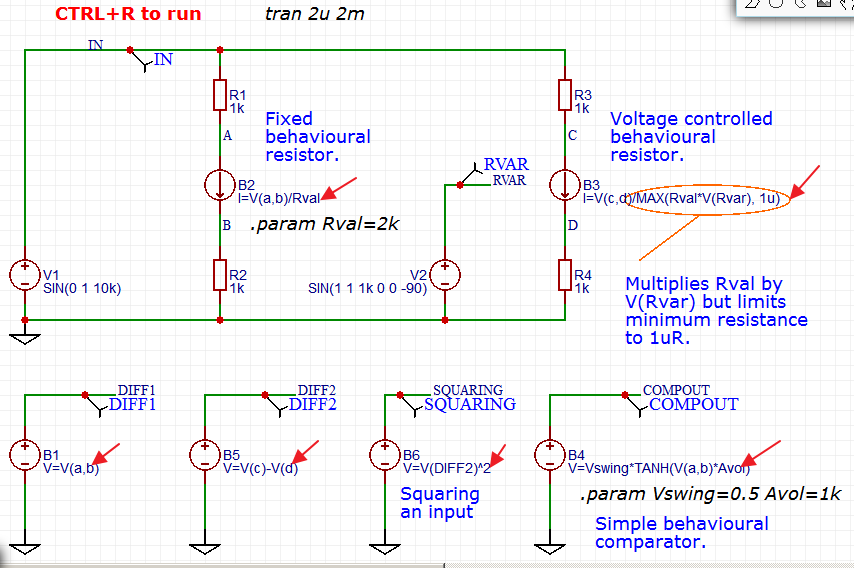

2. [limit-x-L-U](https://easyeda.com/editor#id=tX9JjgeOC)

3. [Parameters, expressions, functions and B Sources](https://easyeda.com/editor#id=8MhztnFXf)

Note that when entered directly in a B Source value 
field in a schematic, expressions MUST be on a single line. When used like this, 
they cannot be wrapped over more than one line.

Expressions entered into a netlist, however, such as inside a 
.subckt model definition, can wrap over more than one line by using the '+' continuation 
character. Several examples of this can be found by inspecting the netlists of circuits 
using some of the EasyEDA .subckt models. For example in the netlist of the opamp5pEE 
Parameterised 5 pin opamp model there are these B sources:

	Bipbias1 inp isum I=(ibias+ios)*V(supply_ok)
	+ ( uramp(V(inn)-(V(vp)+inmax)) - uramp(-V(inn)+(V(vn)-inmin)) )/Rser

and

	Bstg1 0 stage1 I=Islew_tanh(V(indiff)_Kg)
	+ - ( uramp(V(stage1)-(V(vp)-outhi)) - uramp(-V(stage1)+(V(vn)+outlo)) )/Rser
	+ - sel*( uramp(V(stage1)-(V(out)+oooclmphi)) - uramp(-V(stage1)+(V(out)-oooclmplo)) )/Rser

and in the opamp_ANF01 .subckt example found elsewhere in this document, there is another example:

	B1 out 0
	+ V=(TANH((V(inp)-V(inn))_{Avol}_2/(V(vcc)-V(vee)))*(V(vcc)-V(vee))
	+ +(V(vcc)+V(vee)))/2

	

### Device models

In order to simulate the behaviour of the individual components, they have to be described mathematically. The underlying equations that describe the behaviour of a component are written into the simulator program (sometimes they can be added by the user).

The equations that describe basic components such as resistors (I = V/R), capacitors (I = C_dV/dt) and inductors (V = L_di/dt) may be reasonably straightforward. The equations that describe diodes, bipolar (bjt) and a variety of field effect (jfet) and MOS transistors become increasingly complex, sometimes with several equations describing the behaviour of different aspects of device performance in different regions of operation.

Because these sets of equations are very much based on the semiconductor physics of devices and the manufacturing processes used to fabricate them, for some families of devices, such as MOSFETs, different sets of equations may be used to describe devices in the same family. The different sets of equations may be used because the manufacturer wishes to describe the operation of their devices to a greater or lesser degree of accuracy.

Although the equations themselves are hidden deep in the source code for a simulator, in general the coefficients of the sets of equations are collected together in the form of a list. Individual devices of any particular device family can then be described by a list of coefficients.

This list of coefficients is called a  **model** .

The individual coefficients in a model are called the **model parameters**.

A device model written in this way is called a **.model** statement.

Some devices such as Thyristors, opamps, linear regulators and switch mode supply chips are made up from a number of other devices connected together to form subcircuits.

A spice netlist of a device defined by a subcircuit is also referred to as a **model**.

A device model written in this way is called a **.subckt**.

Subcircuit models may themselves contain .model statements.

Subcircuits can also contain parameters and can also have parameters passed to them to change their characteristics for example to tailor them to a particular device variant.

#### Why are there different models for the same device?

Because each family of devices (resistors, diodes, bjts, jfets, MOSFETs etc.) is described by one or more sets of equations, each family has one or more models available for it.

One reason there are different models available for devices in the same family is because manufacturers give device models away for free. Therefore they do not want to spend any more time on developing device models than they need to. Basically, the more complex a model is, the more time the manufacturer has to spend on making measurements in order to derive the model parameters. Therefore if they feel that a device can be adequately described by a simple model then they will use that rather than a more accurate but more complex and so more expensive one.

Another reason there may be differences between models of the same device is that there may be slight differences in the semiconductor fabrication processes of different manufacturers.

In the same way that there may be more than one .model available for a device. there may be different .subckt defined models available.

There may be differences between .subckt models because there are implementation differences in the device models and/or the physical devices from different manufacturers. For example there are slight differences in internal timings and even a subtle difference in the internal circuitry of the oscillator section of the UC384x family of SMPS controllers between the various different manufacturers.

Sometimes, there are differences in the models just to get around the copyright protection. Some differences are to optimise the model for a particular simulator and some differences are simply down to the preferences of the model writer.

#### .model statements

In the spice netlist of a circuit, the user can see the models listed in .model statements. When a schematic is saved, these .model statements are pulled in to the netlist by EasyEDA recognising the symbols and their associated device names given in the schematic. Each model may either be pulled in from a library or - for devices that are not in the EasyEDA libraries - by downloading a model from a manufacturer's website and then manually pasting it directly into the schematic (the process of doing this will be described later).

##### Ngspice model types

To help identify model types and in particular if they are for N or P type devices, the following table of model types may be helpful.
<table border="1" cellspacing="0">
<colgroup span="2" width="50%"></colgroup>
<tbody>
<tr>
	<td align="left">
		Code
	</td>
	<td align="left">
		Model Type
	</td>
</tr>
<tr>
	<td align="left">
		R
	</td>
	<td align="left">
		Semiconductor resistor model
	</td>
</tr>
<tr>
	<td align="left">
		C
	</td>
	<td align="left">
		Semiconductor capacitor model
	</td>
</tr>
<tr>
	<td align="left">
		L
	</td>
	<td align="left">
		Inductor model
	</td>
</tr>
<tr>
	<td align="left">
		SW
	</td>
	<td align="left">
		Voltage controlled switch
	</td>
</tr>
<tr>
	<td align="left">
		CSW
	</td>
	<td align="left">
		Current controlled switch
	</td>
</tr>
<tr>
	<td align="left">
		URC
	</td>
	<td align="left">
		Uniform distributed RC model
	</td>
</tr>
<tr>
	<td align="left">
		LTRA
	</td>
	<td align="left">
		Lossy transmission line model
	</td>
</tr>
<tr>
	<td align="left">
		D
	</td>
	<td align="left">
		Diode model
	</td>
</tr>
<tr>
	<td align="left">
		NPN
	</td>
	<td align="left">
		NPN BJT model
	</td>
</tr>
<tr>
	<td align="left">
		PNP
	</td>
	<td align="left">
		PNP BJT model
	</td>
</tr>
<tr>
	<td align="left">
		NJF
	</td>
	<td align="left">
		N-channel JFET model
	</td>
</tr>
<tr>
	<td align="left">
		PJF
	</td>
	<td align="left">
		P-channel JFET model
	</td>
</tr>
<tr>
	<td align="left">
		NMOS
	</td>
	<td align="left">
		N-channel MOSFET model
	</td>
</tr>
<tr>
	<td align="left">
		PMOS
	</td>
	<td align="left">
		P-channel MOSFET model
	</td>
</tr>
<tr>
	<td align="left">
		NMF
	</td>
	<td align="left">
		N-channel MESFET model
	</td>
</tr>
<tr>
	<td align="left">
		PMF
	</td>
	<td align="left">
		P-channel MESFET model
	</td>
</tr>
</tbody>
</table>

Although it is beyond the scope of this document to go into detail there are some other points about models that are worth mentioning.

*   Models for the basic resistors, capacitors and inductors used in a schematic are usually not shown in the netlist;
*   Some device models have a full list of parameters, some may only have a partially completed list. Missing parameters in models are simply replaced by default values.

*   Different simulators support different sets of models so in some cases the simulator may warn the user that some parameters are unrecognised and so are ignored. This generally has little effect on the simulation results but if the user is particularly concerned about their effects than the only option is to change to using a simulator that supports all the relevant parameters.

#### .subckt definitions

Not all devices are described by .model statements.

Models of more complex devices such as Thyristors (SCRs, Triacs and also Diacs), Insulated Gate Bipolar Transistors (IGBTs), operational amplifiers (opamps) and even many MOSFETs are often made up by connecting lower level devices to make a circuit that behaves like the desired device. This is called a **subcircuit**. The spice netlist of this subcircuit is then used to create a type of device model defined by what is called a **.subckt**. The low level components in subcircuits are described by the same sort of models (those lists of parameters or coefficients) as for the basic diodes etc., already referred to so a .subckt will often contain a list of .model statements describing the devices that are used to build the .subckt itself. Complex .subckts may even call other .subckts.

#### Behavioural models

Using Behavioural Voltage and Current Sources and expressions it is possible to create what are called **behavioural models** of components. These are models that behave like a device but which have little of the actual underlying realistic circuit defined and are mostly - or perhaps completely - described by explicitly defined expressions (equations). The models for most devices internally comprising more than one active component, i.e. ICs, are largely behavioural. This is a way of hiding the detailed information about the manufacturer's process technology that low level spice modelling reveals.

The use of expressions and behavioural sources in EasyEDA is explained later in the book.

#### What if there is no model available for a device?

Not all devices have spice models that can be run in ngspice. There are a number of possible reasons for this.

1.  Some models are encrypted and can only be run in certain proprietary simulation tools;

2.  Some proprietary simulators support models that are not available in ngspice;

3.  Some devices have models that only run in specific non-spice based simulation tools and which, for whatever reason, cannot be translated into spice models;

4.  Some devices do not have publically available models;

5.  Many devices predating the creation of the original spice program do not have models;

6.  Models for some devices simply do not exist because the manufacturers have never created them;

7.  Some models may be unavailable in EasyEDA because they are restricted by copyright or end user licenses so they can only be run in certain proprietary simulation tools or cannot be shared publically.

In cases (1) to (3), there is no way they can be run in ngspice. They must be run in the simulation tools for which they were written.

In cases (4) to (7), it is sometimes possible to find an equivalent, alternative or similar device for which a spice model is available. The user must exercise caution and use their judgement in deciding if such an approach offers satisfactory simulation results.

It must be noted that spice was not originally written with support for thermionic devices (valves or tubes) so models for such devices exist only in .subckt form. They are usually created by enthusiasts rather than manufacturers and so they (a) can be hard to find and (b) should be used with caution. EasyEDA does have a library of valve models gathered from sources that we believe have written reasonably accurate models.

Note that models obtained from manufacturers are often subject to copyright restrictions. Please respect any copyright notices contained either in end user license agreements that may have to be accepted prior to the granting of access to a downloadable copy of a model or in the models themselves.

Similarly, models contained in the libraries of commercial simulation tools are subject to copyright restrictions.

It is often possible to find device models offered in forums, discussion groups and various online collections of models. Again, the user must exercise caution and use their judgement in deciding if such models really are suitable. Often it is not possible to establish where they originate from so their validity is very hard to verify.It is also possible that such models have been copied in breach of the originators copyright.

#### The relationship between spice models and device datasheets

Although some of the device models in EasyEDA have been specially written so that the user can easily tailor them to simulate a range of devices by editing parameters that can be found directly in - or inferred from - device datasheets (see: About the relationship between spice models and real world behaviour below), most of them are off-the-shelf models from the device manufacturers.

It is important to understand that, for many of these off-the-shelf models, the underlying equations and therefore the .model parameters and .subckt definitions bear little relationship to the sort of information that is given in typical component datasheets. Therefore it is usually not possible to take a device datasheet and simply write down a device models from the information given in it.

Whilst it is possible to extract spice parameters for a variety of devices from device datasheets and from actual device measurements, it is beyond the scope of this document to describe how this can be done.

More information about what the model parameters mean in diodes, bipolar transistors and MOSFETs, is available from:

[http://www3.imperial.ac.uk/pls/portallive/docs/1/56133736.PDF](http://www3.imperial.ac.uk/pls/portallive/docs/1/56133736.PDF)

with individual slide sets:

[http://www3.imperial.ac.uk/pls/portallive/docs/1/7292571.PDF](http://www3.imperial.ac.uk/pls/portallive/docs/1/7292571.PDF)

[http://www3.imperial.ac.uk/pls/portallive/docs/1/7292572.PDF](http://www3.imperial.ac.uk/pls/portallive/docs/1/7292572.PDF)

[http://www3.imperial.ac.uk/pls/portallive/docs/1/7292573.PDF](http://www3.imperial.ac.uk/pls/portallive/docs/1/7292573.PDF)

For more detailed information about bjt's in particular, this book:

[Modelling the Bipolar Transistor by Ian Getreu](http://ieeexplore.ieee.org/stamp/stamp.jsp?arnumber=01480193)

is available from:

[http://www.lulu.com/spotlight/iangetreu](http://www.lulu.com/spotlight/iangetreu)

and

[http://www.amazon.com/Modeling-Bipolar-Transistor-Ian-Getreu/dp/B000EYPQLU](http://www.amazon.com/Modeling-Bipolar-Transistor-Ian-Getreu/dp/B000EYPQLU)

Another excellent (and free) book about transistor modelling, is available by going to:

[http://www.aeng.com/spice_modeling.htm](http://www.aeng.com/spice_modeling.htm)

and registering to get a copy of:

[*Definitive Handbook of Transistor Modeling*](http://www.aeng.com/pdf/RGVmaW5pdGl2ZSBIYW5kYm9vayBvZiBUcmFuc2lzdG9yIE1vZGVsaW5n.pdf)

*More information about ngpsice is available from here:*

[*http://ngspice.sourceforge.net/presentation.html*](http://ngspice.sourceforge.net/presentation.html)

*More information about Larry Nagel and SPICE is available from here:*

[*http://www.omega-enterprises.net/The%20Origins%20of%20SPICE.html*](http://www.omega-enterprises.net/The%20Origins%20of%20SPICE.html)

*Larry&#8217;s PhD dissertation Dissertation:*

*Laurence W. Nagel., &#8220;SPICE2: A Computer Program to Simulate Semiconductor Circuits,&#8221;*

*Memorandum No. ERL-M520, University of California, Berkeley, May 1975.

[*http://www.eecs.berkeley.edu/Pubs/TechRpts/1975/ERL-520.pdf*](http://www.eecs.berkeley.edu/Pubs/TechRpts/1975/ERL-520.pdf)

*is actually very readable and instructive.*

*For more information about electronic circuit simulation and spice in particular, see:*

[*http://en.wikipedia.org/wiki/Electronic_circuit_simulation*](http://en.wikipedia.org/wiki/Electronic_circuit_simulation)

*and:*

[*http://en.wikipedia.org/wiki/SPICE*](http://en.wikipedia.org/wiki/SPICE)

#### The relationship between spice models and real world behaviour

Not all spice models are created equal. Here are just some of the things to be aware of.

Models of the same device from different manufacturers may offer differing degrees of accuracy. Sometimes models are kept simple in the interests of speeding up the simulations at the expense of accuracy. Sometimes they are complex because accuracy is considered to be more important than simulation speed. Models may contain some text at the beginnings of them to describe some of their limitations or their special features. It is often useful to read this information as it can help improve the convergence of simulations using them.

Not all diode models simulate reverse breakdown voltage.

Zener diode models can be of varying accuracy and are best put into test jigs to run a curve trace on them to compare them with the datasheet. Zener diodes are sometimes used as white noise sources. Zener models do not accurately generate the levels and spectrum of noise seen in real devices.

None of the bjt models simulate the reverse bias base-emitter breakdown voltage. Very few model collector-emitter or collector-base junction breakdown voltages.

Some models, particularly of high speed and high frequency devices may include package parasitics such as lead inductances and pin capacitances. Such models are almost always .subckt definitions of devices defined by .model statements but which have the parasitics connected to form a subckt. If the high frequency behaviour is not important, simulation speed can be improved by using only the .model statement without the parasitics. This .model can be cut and pasted out of the .subckt definition but often the .model statement will be for a transistor that is defined as a .model in it's own right somewhere else on the manufacturers site or as an equivalent from another vendor.

Thyristor and Triac models can be of varying accuracy or simulate only a limited selection of all the device parameters.

EasyEDA has an in-house behavioural Thyristor macromodel and a behavioural Triac macromodel.

As far as possible, the EasyEDA in-house Thyristor and Triac models model almost all the datasheet parameters of the target device with the exception of di/dt behaviour with inductive loads. These devices can be tailored to model almost any device simply using the values taken from the datasheet for the target device.

Metal Oxide Varistors (MOVs) are a nightmare to model and are best avoided! Even the commercially available models sometimes do not run reliably in all conditions.

Some opamp models are hugely detailed and can be very accurate but care must be taken to check that they are written using a syntax that is compatible with ngspice. Devices tailored for some of the commercial simulators will not run in ngspice without some syntax changes. Some may require special **.option**s to be invoked for the simulator.

Beware that even some quite complex opamp models do not simulate supply current drains even as simple DC quiescent currents let alone the dynamic behaviour with load currents added in. This can be an advantage since it reduces the signal currents that have to be simulated. It also means that there is absolutely no point in including any supply rail decoupling for those device that are known to not model supply current drains since they do not draw any current: they only use the supply voltage to define things like common mode range or output swing.

Here is an example of a third party opamp model that does not model supply or output currents:

[LM108 test jig](https://easyeda.com/editor#id=htnFzR9OI)

Some opamp models may make no attempt to accurately simulate the output stage behaviour versus load current. Similarly, many device models do not simulate the behaviour of inputs and outputs when they are taken above or below the supply rails.

Few device models simulate the excessive supply current drain of a supply reversed misconnection or a correctly connected device that is subject to a supply voltage above the stated absolute maximum supply differential.

There are a several device models in EasyEDA that have been specially written to reproduce the real world behaviour of the devices that they model.

For example, the EasyEDA in-house opamp behavioural macromodel can be set up to give an output voltage swing anywhere from a rail-to-rail to the more restricted swings of non-rail-to-rail output opamps. The output swing can be asymmetric.

Input resistance, bias and offset current and input offset voltage are modelled.

The input differential and common mode voltage ranges are modelled.

The current drain behaviour of the device if input or output pins are taken above or below the supply rails or if the supply polarities are reversed are modelled. Output polarity reversal due to inputs exceeding the common mode range is modelled for devices that exhibit such behaviour.

Frequency dependent common mode and power supply rejection are modelled.

Noise and temperature dependent effects are not modelled at present.

EasyEDA has an in-house behavioural macromodel which can be tailored to model a wide range of 3 terminal fixed and adjustable positive and negative linear voltage regulators which feature similar real-world behaviour to the opamp models.

For all of the in-house EasyEDA models, more information about them can be found in the .subckt definition itself simply by viewing the spice netlist of any saved circuit thay have been put into.

#### How to change the model attached to a symbol

**Please note that before attempting to edit device models, it is *essential* that the user is familiar with and understands the relationship between spice pin names and numbering, described in the section on 'Schematic symbols: prefixes and pin numbers'.**

**We are working to provide a search function for the device simulation models available in EasyEDA.**

Right now there are a couple of ways to change the model for a device.

1) Place a device from the EasyEDA Libs and then edit the device model name either in place in the schematic or in the right hand properties panel.

For instance, when an NPN bjt is placed in a schematic, it comes in with a default name of editing the model name of 2DC2412R. This name pulls the associated default 2DC2412R model into the spice netlist. Editing the device name from 2DC2412R to 2N2222 will pull the 2N2222 model from EasyEDA's spice model library into the netlist.

The problem here is that until a model search function is up and running this approach is obviously too hit and miss for an arbitrary choice because there no way to see which models are available to choose from.

2) The second option is a bit more fiddly but it allows almost any unencrypted device model to be run in a simulation. The process is similar for both .model and .subckt defined models.

**These processes are described in detail in 'Associating spice models with schematic symbols' as part of the following section on 'Schematic symbols: prefixes and pin numbers' but it is strongly recommended that the whole of that section is read in order, to make sense of the detailed descriptions.** 


### Schematic symbols: prefixes and pin numbers 

**Please note that before attempting to edit device models, it is *essential* that the user is familiar with and understands the relationship between spice pin names and numbering, described in this section.**

Device and subcircuit (or hierarchical block) symbols created for use in schematics that are intended to be run as spice simulations, in addition to having a PCB Prefix that is used for the reference designator in the schematic, also have a Spice Prefix. They also have two sets of pin numbers: PCB pins and Spice pins.

#### PCB and Spice Prefix

The rules on the assignment of the PCB Prefix or reference designator of a schematic symbol are somewhat dependent on the EDA tool and on the user's preferences. Depending on how a device is graphically represented by it's schematic symbol it may have a different PCB Prefix or reference designator. For example, a single discrete MOSFET device may have a PCB Prefix of Q, M or perhaps TR, whereas if it is part of a monolithic multiple transistor array it may have a PCB Prefix of U or IC.

The rules on the assignment of the Spice Prefix of a schematic symbol are strict. This is because the Spice Prefix is used to tell the simulator which circuit element the symbol represents and therefore which simulation model it is to use.

Simulation models for most of the spice circuit elements are in the form of a single-line .model statement however some of them may be in the form of a multi-line .subckt subcircuit definition. For example, some MOSFETs may be described by a .model statement in which case their Spice Prefix is M but many MOSFETs are described by a .subckt and so their Spice Prefix is X.

Therefore, irrespective of the PCB Prefix chosen for a schematic symbol, the Spice Prefix for a schematic symbol representing a given circuit element must match the type of model required to simulate that instance of that circuit element in your schematic.

For example, if there are two different n-channel MOSFETs in a schematic; Q1, a BSS123 which is modelled by a .model statement:
~~~~
*SRC=BSS123;DI_BSS123;MOSFETs N;Enh;100V 0.170A 1.00ohms Diodes Inc. MOSFET 
.MODEL DI_BSS123 NMOS( LEVEL=1 VTO=1.00 KP=6.37m GAMMA=1.24 
+ PHI=.75 LAMBDA=625u RD=0.140 RS=0.140 
+ IS=85.0f PB=0.800 MJ=0.460 CBD=19.8p 
+ CBS=23.7p CGSO=36.0n CGDO=30.0n CGBO=124n 
* -- Assumes default L=100U W=100U --
~~~~
and Q2, a BSS127S which is modelled by a .subckt:
~~~~
*---------- BSS127S Spice Model ---------- 
.SUBCKT BSS127S 10 20 30 
* TERMINALS: D G S M1 1 2 3 3 NMOS L = 1E-006 W = 1E-006 
RD 10 1 84.22 
RS 30 3 0.001 
RG 20 2 29 
CGS 2 3 1.958E-011 
EGD 12 0 2 1 1 
VFB 14 0 0 
FFB 2 1 VFB 1 
CGD 13 14 2E-011 
R1 13 0 1 
D1 12 13 
DLIM DDG 15 14 
DCGD R2 12 15 1 
D2 15 0 DLIM 
DSD 3 10 DSUB 
.MODEL NMOS NMOS LEVEL = 3 VMAX = 8E+005 ETA = 1E-012 VTO = 3.419 
+ TOX = 6E-008 NSUB = 1E+016 KP = 0.127 U0 = 400 KAPPA = 1.044E-015 
.MODEL DCGD D CJO = 1.135E-011 VJ = 0.9232 M = 0.9816 
.MODEL DSUB D IS = 2.294E-010 N = 1.601 RS = 0.1079 BV = 65 
+ CJO = 1.956E-011 VJ = 1.514 M = 0.8171 
.MODEL DLIM D IS = 0.0001 
.ENDS 
*Diodes BSS127S Spice Model v1.0 Last Revised 2012/6/6
~~~~
then even though both have the same PCB Prefix of Q: Q1 must have a Spice Prefix of M and Q2 must have a Spice Prefix of X.

A list of Spice Prefixes and their associated circuit elements is given in the table below.

<table style="text-align: left; width: 600px;" cellpadding="2" cellspacing="2" border="1">

<tbody>

<tr>

<td style="vertical-align: top;font-weight: bold;">Element description</td>

<td style="vertical-align: top;font-weight: bold;">Spice Prefix</td>

<td style="vertical-align: top;font-weight: bold;">Comment</td>

</tr>

<tr>

<td style="vertical-align: top;">A</td>

<td style="vertical-align: top;">XSPICE code model</td>

<td style="vertical-align: top;">analogue, digital, mixed signal</td>

</tr>

<tr>

<td style="vertical-align: top;">B</td>

<td style="vertical-align: top;">Behavioural (arbitrary) source</td>

<td style="vertical-align: top;"></td>

</tr>

<tr>

<td style="vertical-align: top;">C</td>

<td style="vertical-align: top;">Capacitor</td>

<td style="vertical-align: top;"></td>

</tr>

<tr>

<td style="vertical-align: top;">D</td>

<td style="vertical-align: top;">Diode</td>

<td style="vertical-align: top;"></td>

</tr>

<tr>

<td style="vertical-align: top;">E</td>

<td style="vertical-align: top;">Voltage-controlled voltage source (VCVS)</td>

<td style="vertical-align: top;">linear, non-linear</td>

</tr>

<tr>

<td style="vertical-align: top;">F</td>

<td style="vertical-align: top;">Current-controlled current source (CCCS)</td>

<td style="vertical-align: top;">linear</td>

</tr>

<tr>

<td style="vertical-align: top;">G</td>

<td style="vertical-align: top;">Voltage-controlled current source (VCCS)</td>

<td style="vertical-align: top;">linear, non-linear</td>

</tr>

<tr>

<td style="vertical-align: top;">H</td>

<td style="vertical-align: top;">Current-controlled voltage source (CCVS)</td>

<td style="vertical-align: top;">linear</td>

</tr>

<tr>

<td style="vertical-align: top;">I</td>

<td style="vertical-align: top;">Current source</td>

<td style="vertical-align: top;"></td>

</tr>

<tr>

<td style="vertical-align: top;">J</td>

<td style="vertical-align: top;">Junction field effect transistor (JFET)</td>

<td style="vertical-align: top;">spice pin order: D G S</td>

</tr>

<tr>

<td style="vertical-align: top;">K</td>

<td style="vertical-align: top;">Coupled (Mutual) Inductors</td>

<td style="vertical-align: top;"></td>

</tr>

<tr>

<td style="vertical-align: top;">L</td>

<td style="vertical-align: top;">Inductor</td>

<td style="vertical-align: top;"></td>

</tr>

<tr>

<td style="vertical-align: top;">M</td>

<td style="vertical-align: top;">Metal oxide field effect transistor (MOSFET)</td>

<td style="vertical-align: top;">spice pin order: D G S</td>

</tr>

<tr>

<td style="vertical-align: top;">N</td>

<td style="vertical-align: top;">Numerical device for GSS</td>

<td style="vertical-align: top;"></td>

</tr>

<tr>

<td style="vertical-align: top;">O</td>

<td style="vertical-align: top;">Lossy transmission line</td>

<td style="vertical-align: top;"></td>

</tr>

<tr>

<td style="vertical-align: top;">P</td>

<td style="vertical-align: top;">Coupled multiconductor line (CPL)</td>

<td style="vertical-align: top;"></td>

</tr>

<tr>

<td style="vertical-align: top;">Q</td>

<td style="vertical-align: top;">Bipolar junction transistor (BJT)</td>

<td style="vertical-align: top;">spice pin order: C B E</td>

</tr>

<tr>

<td style="vertical-align: top;">R</td>

<td style="vertical-align: top;">Resistor</td>

<td style="vertical-align: top;"></td>

</tr>

<tr>

<td style="vertical-align: top;">S</td>

<td style="vertical-align: top;">Switch (voltage-controlled)</td>

<td style="vertical-align: top;"></td>

</tr>

<tr>

<td style="vertical-align: top;">T</td>

<td style="vertical-align: top;">Lossless transmission line</td>

<td style="vertical-align: top;"></td>

</tr>

<tr>

<td style="vertical-align: top;">U</td>

<td style="vertical-align: top;">Uniformly distributed RC line</td>

<td style="vertical-align: top;"></td>

</tr>

<tr>

<td style="vertical-align: top;">V</td>

<td style="vertical-align: top;">Voltage source</td>

<td style="vertical-align: top;"></td>

</tr>

<tr>

<td style="vertical-align: top;">W</td>

<td style="vertical-align: top;">Switch (current-controlled)</td>

<td style="vertical-align: top;"></td>

</tr>

<tr>

<td style="vertical-align: top;">X</td>

<td style="vertical-align: top;">Subcircuit</td>

<td style="vertical-align: top;">spice pin order: depends on subckt</td>

</tr>

<tr>

<td style="vertical-align: top;">Y</td>

<td style="vertical-align: top;">Single lossy transmission line (TXL)</td>

<td style="vertical-align: top;"></td>

</tr>

<tr>

<td style="vertical-align: top;">Z</td>

<td style="vertical-align: top;">Metal semiconductor field effect transistor (MESFET)</td>

<td style="vertical-align: top;">spice pin order: D G S</td>

</tr>

</tbody>

</table>

For more information on circuit elements in Ngspice, please refer to:

[http://ngspice.sourceforge.net/docs/ngspice-manual.pdf#subsection.2.1.2](http://ngspice.sourceforge.net/docs/ngspice-manual.pdf#subsection.2.1.2)  

#### PCB and Spice pin numbers

The two sets of pin numbers are:

1. PCB pin number: these are the numbers for the real, physical device pins in its package. They are required so that the pins of a device symbol in a schematic can be mapped onto the physical pins of a PCB footprint. In other words, so that the connections shown in the schematic, end up connected properly by copper on the PCB.

2. Spice pin number or pin order: these are the numbers that map the pins on the symbol to their respective functions in the spice model or subcircuit.

Actually the spice pin ordering has a slightly deeper meaning.

Spice has no concept of component symbols: they are a construct of the schematic editor.

When a spice netlist is generated, the symbol in the schematic editor is either - in the case of model defined devices such as resistors, capacitors, inductors, diodes, transistors and sources - mapped directly to the relevant models (defined by the device prefix such as R, C, L, D, Q and so on), or in the case of a subcircuit, converted into a subcircuit call statement.

The spice pin ordering for the majority of built-in models such as resistors, capacitors, inductors, diodes, transistors and sources are defined and generally taken care of by the schematic editor, more care has to be taken with the spice pin ordering of subcircuits.

This can be illustrated by a simple opamp with 5 pins: inverting and non-inverting inputs; output and positive and negative supply pins but the principle applies to all spice subcircuits.

The subcircuit call for this opamp might look like this in the spice netlist:

~~~~
X1 input feedback vpos vneg output opamp_ANF01
~~~~

where:

`X1` is the name of the subcircuit in the top level (i.e. the calling) circuit;

`input feedback vpos vneg output` are the netnames in the circuit calling (i.e. containing) the subcircuit and

`opamp_ANF01` is the name of the subcircuit being called.

* Pay special attention to the order of the netnames in the subcircuit call.

The spice pin ordering for the majority of opamp subcircuits is like that shown in the example below:
~~~~
*******************************
* opamp_ANF01 * 
* Simplified behavioural opamp
* Node assignments 
*                    noninverting input 
*                    | inverting input 
*                    | | positive supply 
*                    | | | negative supply 
*                    | | | | output 
*                    | | | | | 
* spice pin order:   1   2   3   4   5 
*                    |   |   |   |   | 
.subckt opamp_ANF01 inp inn vcc vee out ; these are the netnames 
* used internally to the subcircuit. 
*
B1 out 0 + V=(TANH((V(inp)-V(inn))*{Avol}*2/(V(vcc)-V(vee)))*(V(vcc)-V(vee)) + +(V(vcc)+V(vee)))/2 
.ends opamp_ANF01
*******************************
~~~~

Note that the spice pin order of the subcircuit call is in exactly the same order as that of the subcircuit.

Although the physical pin numbering of any device is critical for successfully mapping the pins of a schematic symbol onto a physical package footprint when laying out the PCB, because spice only knows about single devices and does not care about how they are physically packaged, each instance of any device in a spice schematic has to be mapped onto the same pins of the spice model or subcircuit, irrespective of where it is in any physical package.

Therefore, for the physical, package pin numbering of the four opamps in a quad opamp in say, a SOIC14 or a DIP14 package as shown below, to work with the example subcircuit above, the spice pin ordering would be:

<table style="text-align: left; width: 600px;" cellpadding="2" cellspacing="2" border="1">

<tbody>

<tr>

<td style="vertical-align: top; font-weight: bold;">Opamp A</td>

<td style="vertical-align: top; font-weight: bold;">PCB Pin Number</td>

<td style="vertical-align: top; font-weight: bold;">Spice Pin Order</td>

</tr>

<tr>

<td style="vertical-align: top;">OUT</td>

<td style="vertical-align: top;">1</td>

<td style="vertical-align: top;">5</td>

</tr>

<tr>

<td style="vertical-align: top;">IN-</td>

<td style="vertical-align: top;">2</td>

<td style="vertical-align: top;">2</td>

</tr>

<tr>

<td style="vertical-align: top;">IN+</td>

<td style="vertical-align: top;">3</td>

<td style="vertical-align: top;">1</td>

</tr>

<tr>

<td style="vertical-align: top;">V+</td>

<td style="vertical-align: top;">4</td>

<td style="vertical-align: top;">3</td>

</tr>

<tr>

<td style="vertical-align: top;">V-</td>

<td style="vertical-align: top;">11</td>

<td style="vertical-align: top;">4</td>

</tr>

<tr>

<td style="vertical-align: top; font-weight: bold;">Opamp B</td>

<td style="vertical-align: top; font-weight: bold;">PCB Pin Number</td>

<td style="vertical-align: top; font-weight: bold;">Spice Pin Order</td>

</tr>

<tr>

<td style="vertical-align: top;">OUT</td>

<td style="vertical-align: top;">7</td>

<td style="vertical-align: top;">5</td>

</tr>

<tr>

<td style="vertical-align: top;">IN-</td>

<td style="vertical-align: top;">6</td>

<td style="vertical-align: top;">2</td>

</tr>

<tr>

<td style="vertical-align: top;">IN+</td>

<td style="vertical-align: top;">5</td>

<td style="vertical-align: top;">1</td>

</tr>

<tr>

<td style="vertical-align: top;">V+</td>

<td style="vertical-align: top;">4</td>

<td style="vertical-align: top;">3</td>

</tr>

<tr>

<td style="vertical-align: top;">V-</td>

<td style="vertical-align: top;">11</td>

<td style="vertical-align: top;">4</td>

</tr>

<tr>

<td style="vertical-align: top; font-weight: bold;">Opamp C</td>

<td style="vertical-align: top; font-weight: bold;">PCB Pin Number</td>

<td style="vertical-align: top; font-weight: bold;">Spice Pin Order</td>

</tr>

<tr>

<td style="vertical-align: top;">OUT</td>

<td style="vertical-align: top;">8</td>

<td style="vertical-align: top;">5</td>

</tr>

<tr>

<td style="vertical-align: top;">IN-</td>

<td style="vertical-align: top;">9</td>

<td style="vertical-align: top;">2</td>

</tr>

<tr>

<td style="vertical-align: top;">IN+</td>

<td style="vertical-align: top;">10</td>

<td style="vertical-align: top;">1</td>

</tr>

<tr>

<td style="vertical-align: top;">V+</td>

<td style="vertical-align: top;">4</td>

<td style="vertical-align: top;">3</td>

</tr>

<tr>

<td style="vertical-align: top;">V-</td>

<td style="vertical-align: top;">11</td>

<td style="vertical-align: top;">4</td>

</tr>

<tr>

<td style="vertical-align: top; font-weight: bold;">Opamp D</td>

<td style="vertical-align: top; font-weight: bold;">PCB Pin Number</td>

<td style="vertical-align: top; font-weight: bold;">Spice Pin Order</td>

</tr>

<tr>

<td style="vertical-align: top;">OUT</td>

<td style="vertical-align: top;">14</td>

<td style="vertical-align: top;">5</td>

</tr>

<tr>

<td style="vertical-align: top;">IN-</td>

<td style="vertical-align: top;">13</td>

<td style="vertical-align: top;">2</td>

</tr>

<tr>

<td style="vertical-align: top;">IN+</td>

<td style="vertical-align: top;">12</td>

<td style="vertical-align: top;">1</td>

</tr>

<tr>

<td style="vertical-align: top;">V+</td>

<td style="vertical-align: top;">4</td>

<td style="vertical-align: top;">3</td>

</tr>

<tr>

<td style="vertical-align: top;">V-</td>

<td style="vertical-align: top;">11</td>

<td style="vertical-align: top;">4</td>

</tr>

</tbody>

</table>

The physical package pin numbering reflects that of each opamp in the package.

The spice pin ordering is the same for each instance of the individual opamps.

Of course there is only one physical instance of each supply pin on the schematic symbol for the quad opamp in this example but each spice subcircuit must have the supply pins explicitly defined.

Exactly how this is handled at the schematic symbol level depends on how the schematic capture package deals with symbols for multiple devices with shared supply pins but the generation of a spice netlist from the schematic will always generate the complete set of pins required in the subcircuit calls.

In cases where the subcircuit is built by the user as opposed to where it is supplied by a vendor for a particular device, exactly the same rules apply except that it is up to the user to specify the subcircuit pin order and to construct the symbol appropriately.

Although as described earlier, built-in spice models usually have defined spice pin orders, not all subcircuits have the same spice pin numbering. Therefore if your spice circuit throws errors - especially if there are warnings about pin numbers or pin names - it is worth remembering to check that the pin order of the symbol that is netlisted to form the calling statement matches that of the subcircuit that is being called!

#### Associating spice models to schematic symbols

##### For .MODEL defined models

1.  Find a spice .model for your target device;
2.  Copy and paste it into a text placeholder (the `T` hotkey) in your schematic (but please respect the EULA and copyright of commercial files);
3.  In the right hand properties panel, change the text type from comment to spice;

    **Properties > Text type > spice**

4.  Place a symbol for the device from the EasyEDA Libs palette onto the schematic;
5.  Edit the model name to the exact name of the model in the pasted file;
6.  Done!

There's an example of this here:

[Playing with model parameters](https://easyeda.com/editor#id=Ev5rpnJG2)

This is another example showing using a generic depletion mode MOSFET.

It also shows a way to hack a MOSFET defined by a LEVEL 3 .model statement but which has a problem with some of the parameters not being recognised as being part of the model by ngspice, so that it can still be used directly with the MOSFET symbol.

In this example the L and W parameters of the original model are recognised as part of the .model statement. Note also that some of the other parameters are also simply not recognised by ngspice.

Here's how:

1.  Find a spice .model for your target device;
2.  Copy and paste the .model statement into the schematic canvas;
3.  Turn it into a spice directive:

    **Properties > Text Attributes > Text type > spice**

4.  Place an N channel depletion mode MOSFET symbol onto the schematic;
5.  Edit the 'model' attribute for M1 to include the unrecognised or modified L and W parameters so they look like this:

    `IXTT20N50D L=2E-6 W=5.5`

    This can be done either in place or via:

    **Part Attributes > Model >** `IXTT20N50D L=2E-6 W=5.5`

Note that adding an asterisk at the start of the two lines in the .model statement that define the L and W parameters (and any other unrecognised parameters as deemed necessary) will comment them out. This stops these parameters being reported as model issues in the simulation report but it is not required to do so.

This process is illustrated in the following example:

[N channel depletion mode MOSFET using a .model statement](https://easyeda.com/editor#id=NnhztL2kC)

##### For .SUBCKT defined models

The process described above works fine for simple .model defined models but for .subckt defined models it is a little more complicated because you need to tell EasyEDA that the model is a .subckt and not a simple .model.

Note that even some humble diode models are in fact .subckt defined to include things like package parasitics. For example, compare the 1N4148 and the 1N4148W-V models in the netlist.

There are three stages in attaching a .subckt to a symbol that already has a spice prefix of 'X' and so is expecting to call a .subckt statement.

*   Place the .subckt text into the schematic and activate it;
*   Place the symbol in the schematic;
*   Change the name of the symbol to exactly the same as the name of the .subckt;

The detailed steps to associate a new .subckt model to the symbol are:

1.  Find a spice .SUBCKT for your target device;
2.  Copy and paste it into a text box (the `T` hotkey) in your schematic (but please respect the EULA and copyright of commercial files);
3.  In the right hand properties panel, change the text type from comment to spice;

    **Properties > Text type > spice**

4.  Place a symbol for the device from the EasyEDA Libs palette onto the schematic;
5.  Edit the model name to the exact name of the model in the pasted file;
6.  Press the `I` Hotkey or:

    Click the blue **Edit Symbol...** button in the Properties panel:

    **Properties > Edit Symbol...**

    or do:

    **Super Menu > Miscellaneous > Edit Symbol**

7.  In the **Modify your symbol information** dialogue box, check that the **Spice Prefix** is `X`;
8.  Check that the NUMBER of pins in 'Edit Pin Map information' is exactly the same as in the .SUBCKT pasted into the schematic: if it is not then the wrong symbol has been placed for the chosen .SUBCKT (or vice versa) so a different symbol (or .SUBCKT) must be chosen.

    Note that 'number of pins' here means how many pins, not the pin numbers or names used to describe the nets they connect to in the .subckt netlist;
9.  Check that the ORDER of the pins in **Edit Pin Map information** is exactly the same as in the .SUBCKT pasted into the schematic. This can be very confusing because the pin NAMES may be different between the symbol and the .SUBCKT so it is first necessary to reconcile the two sets of names before attempting to confirm their order.
10.  Click **OK** in the **Modify your symbol information** dialogue box;
11.  Done!

    This process is illustrated in the following example:

    [Attaching a .subckt to a symbol 01](https://easyeda.com/editor#id=808qkCTN5)

Some of the EasyEDA symbols from the EasyEDA Libs have a Spice Prefix that is expecting to call a .model statement (i.e. any symbol with a Spice Prefix other than 'X'!). For example, the bjts symbols have a Spice Prefix of 'Q' whilst the MOSFET symbols have a Spice Prefix of 'M'. There are some diodes, for example some zener diodes, which some are defined by .models and others by .subckts. Even the humble 1N4148 may have a .model from one manufacturer and a .subckt from another. Some bjt models are defined by .subckts such as most Darlington transistors and some Avalanche transistors. Apart from some low power MOSFETs and those used in IC design, most MOSFET models are defined by .subckts. Therefore it is quite common to have to associate a .subckt to a symbol with a Spice Prefix that is expecting to call a .model statement. 

This can be done in four stages as illustrated in the following example, the NMOS_E symbol placed into the schematic from the EasyEDA Libs palette must be edited to change the 'Spice Prefix' of the symbol from 'M' (for a .model defined part) to 'X' (for a .subckt defined part).

*   Place the .subckt text into the schematic and activate it;
*   Place the symbol in the schematic;
*   Change the name of the symbol to exactly the same as the name of the .subckt;
*   Change the 'Spice Prefix' of the symbol from 'M' (for a .model defined part) to 'X' (for a .subckt defined part).

The detailed steps to associate a new model to a symbol and to tell EasyEDA that a device model is a .subckt and not a simple .model are:

1.  Find a spice .SUBCKT for your target device;
2.  Copy and paste it into a text box (the `T` hotkey) in your schematic (but please respect the EULA and copyright of commercial files);
3.  In the right hand properties panel, change the text type from comment to spice;

    **Properties > Text type > spice**

4.  Place a symbol for the device from the EasyEDA Libs palette onto the schematic;
5.  Edit the model name to the exact name of the model in the pasted file;
6.  Press the `I` Hotkey or:

    Click the blue **Edit Symbol...** button in the Properties panel:

    **Properties > Edit Symbol...**

    or do:

    **Super Menu > Miscellaneous > Edit Symbol**

7.  In the 'Modify your symbol information' dialogue box, change the **Spice Prefix** from `M` (for a .model defined part) to `X` (for a .subckt defined part);

8.  Check that the NUMBER of pins in **Edit Pin Map information** is exactly the same as in the .SUBCKT pasted into the schematic: if it is not then the wrong symbol has been placed for the chosen .SUBCKT (or vice versa) so a different symbol (or .SUBCKT) must be chosen.

    Note that 'number of pins' here means how many pins, not the pin numbers or names used to describe the nets they connect to in the .subckt netlist;

9.  Check that the ORDER of the pins in **Edit Pin Map information** is exactly the same as in the .SUBCKT pasted into the schematic. This can be very confusing because the pin NAMES may be different between the symbol and the .SUBCKT so it is first necessary to reconcile the two sets of names before attempting to confirm their order.
10.  Click OK in the **Modify your symbol information** dialogue box;
11.  Done!

    This process is illustrated in the following example:

    [Attaching a .subckt to a symbol 02](https://easyeda.com/editor#id=6OkCwO5nF)

Another example of the process described above to change the Spice Prefix of a symbol is illustrated with the same EasyEDA N channel depletion mode MOSFET symbol from the EasyEDA Libs that was used earlier with the IXTT20N50D .model statement. In this example the MOSFET symbol is attached to a .subckt that has been created from the orignal IXTT20N50D .model statement in order to wrap up the L=2E-6 W=5.5 parameters and so make using the original model easier.

[An N-channel depletion mode MOSFET using an EasyEDA .subckt](https://easyeda.com/editor#id=sHBTNtZhz)

##### Attaching models to custom symbols

This is basically the same as attaching a model to any of the predefined symbols from the EasyEDA Libs except that the symbol is one that has been created from scratch or by editing an existing symbol. The rules for assigning and checking that the spice prefix matches the type of model to be attached (i.e. 'X' for .subckt or any Spice Prefix other than 'X' for .model) and checking that the spice pin numbering matches that of the type of device defined by the .model statement or by the pin sequence of a .subckt defined model.
  

### Custom modelling

This is an advanced topic and this section will be filled out when time permits.

However, browsing through some of the EasyEDA in-house models can be informative because, although they do not come with a 'How it works' written into them, there is some documentation in their .subckt definitions that may give some insights into the wild and wonderful world of custom modelling.

Some examples to look through the netlists of are:

[LDR test](https://easyeda.com/editor#id=aXt93XfVP)

[Electret microphone model](https://easyeda.com/editor#id=ZxlGcuoGY)

[Electret microphone model .subckt](https://easyeda.com/editor#id=7LhztK2ke)

[Electret microphone model test jig](https://easyeda.com/editor#id=7nhbtL3le)

[LM56EE demo jig](https://easyeda.com/editor#id=lvHhROomk)

[How to include a 5 Pin Comparator in a schematic](https://easyeda.com/editor#id=JrXRL3Xfw)

and this project:

[An EasyEDA logic family](https://easyeda.com/editor#id=7qCcaKIhf|80AyvtrNn|F9lUus2Cc|6AMKVTt31|HNnkG2oYW|3w6GgQNnl|uXLlVvs20|E75rpL742|YsEBbnlVh|17HhRq0YW|Wq0UgepVP|2vtrpZXUS|860iAuL3l|amf93lDVd|ZRromkige)


#### Making measurements of simulation results

In the same way that digital storage oscilloscopes (DSO) allow measurements to be made of signals displayed on the screen using cursors and directly reading values from their positions and from mathematical analysis of the waveform data stored in the DSO memory, EasyEDA allows measurements to be made of simulation results directly using cursors and by analysis of the data used to create the WaveForm trace display using the <span style="font-weight:bold">meas</span> command.

##### Using the WaveForm display cursors

The WaveForm X and Y cursor functions are a simple and quick way to make measurements of points in waveforms and to make measurements of differences between points.

WaveForm allows the display of traces in any selection of up to three vertically stacked plot panes. The Y axes automatically scale to fit the units and the range of the traces being displayed. Traces can be hidden but at least one trace must be visible. X and Y trace data can be seen on-screen just by moving the mouse cursor around the plot area of a pane with the readout adapting to the Y axes in each pane.

Delta X and delta Y trace data can be seen on-screen using a Left-Click and Drag select box, with the readout adapting to the Y axes in each pane. Returning the cursor to within a small radius of the starting point of the select box - without releasing the Left-Click - returns the readout to X and Y trace data.

The cursor placement and results produced are volatile, meaning that they cannot be copied and pasted. They are not saved as part of a saved WaveForm file. However, using a screenshot utility, it is possible to save an image of the WaveForm display showing the cursor positions and their associated readout.

Note that the screenshot utility must have a user definable time delay to allow cursor placement to be carried out between initiating the screenshot and the screenshot actually being taken.

For more information on displaying simulation results in Waveform, please refer to [WaveForm](/Doc/Tutorial/spiceSimulation.htm#WaveForm) in the EasyEDA Tutorial.

##### Using the meas command

The meas command is used to analyse the output data of a dc, ac, tran or fft (or spec) simulation. The command is executed immediately after the simulation has finished.

#### The meaning of terms in MEAS commands

The meas type <span style="font-weight:bold">{DC|AC|TRAN|SP}</span> depends on the data which are to be evaluated, either originating from a DC, AC analysis, TRANsient or SPectrum analysis (using the fft (or spec) analysis) simulation.

<span style="font-weight:bold">result</span> will be a vector containing the result of the measurement.

<span style="font-weight:bold">trig_variable_</span>, <span style="font-weight:bold">targvariable</span>, and <span style="font-weight:bold">out_variable</span> are vectors stemming from the simulation, e.g. a voltage vector v(out).

<span style="font-weight:bold">VAL=val</span> expects a real number val. val may also be a real parameter or an expression enclosed by in â&#8364;&#157; or {} that expands to a real number.

<span style="font-weight:bold">TD=td</span> and <span style="font-weight:bold">AT=time</span> expect a time value if the meas type is <span style="font-weight:bold">tran</span>. For <span style="font-weight:bold">ac</span> and <span style="font-weight:bold">sp</span>, <span style="font-weight:bold">AT</span> will be a frequency value and <span style="font-weight:bold">TD</span> is ignored.

For <span style="font-weight:bold">dc</span> analysis <span style="font-weight:bold">AT</span> is a voltage (or current), and <span style="font-weight:bold">TD</span> is ignored.

<span style="font-weight:bold">CROSS=#</span> requires an integer number #. <span style="font-weight:bold">CROSS=LAST</span> is possible as well. The same is expected by <span style="font-weight:bold">RISE</span> and <span style="font-weight:bold">FALL</span>.

Frequency and time values may start at 0 and extend to positive real numbers. Voltage (or current) inputs for the independent (scale) axis in a dc analysis may start or end at arbitrary real valued numbers.

#### Examples of the forms and syntaxes of MEAS commands

##### Trig Targ

A meas command using the Trig Targ syntax of <span style="font-weight:bold">General Form 1</span> measures the difference in dc voltage, frequency or time between two points selected from one or two output vectors. The following examples all are using transient simulation. Measurements for tran analysis start after a delay time td. If other examples are run with ac simulation or spectrum analysis, time may be replaced by frequency whilst after a dc simulation, the independent variable may become a voltage or current.

<span style="font-weight:bold">General Form 1</span>:

MEAS {DC | AC | TRAN | SP} result TRIG trig_variable VAL=val

&lt;TD=td&gt; &lt;CROSS=# | cross="LAST"&gt;

&lt;RISE=# | rise="LAST"&gt; &lt;FALL=# | fall="LAST"&gt;

&lt;TRIG at="time"&gt; TARG targ_variable VAL=val &lt;TD=td&gt;

&lt;CROSS=# | cross="LAST"&gt;

&lt;RISE=# | rise="LAST"&gt; &lt;FALL=# | fall="LAST"&gt;

&lt;TARG at="time"&gt;

Measure statement example:

	meas tran tdiff TRIG v(1) VAL=0.5 RISE=1 TARG v(1) VAL=0.5 RISE=2

measures the time difference between v(1) reaching 0.5 V for the first time on its first rising slope (TRIG) versus reaching 0.5 V again on its second rising slope (TARG); i.e. it measures the signal period.

Output:

	tdiff = 1.000000e-003 targ= 1.083343e-003 trig= 8.334295e-005

Measure statement example:

	meas tran tdiff TRIG v(1) VAL=0.5 RISE=1 TARG v(1) VAL=0.5 RISE=3

measures the time difference between v(1) reaching 0.5 V for the first time on its rising slope versus reaching 0.5 V on its rising slope for the third time (i.e. two periods).

Measure statement example:

	meas tran tdiff TRIG v(1) VAL=0.5 RISE=1 TARG v(1) VAL=0.5 FALL=1

measures the time difference between v(1) reaching 0.5V for the first time on its rising slope versus reaching 0.5 V on its first falling slope.

Measure statement example:

	meas tran tdiff TRIG v(1) VAL=0 FALL=3 TARG v(2) VAL=0 FALL=3

measures the time difference between v(1) reaching 0V its third falling slope versus v(2) reach- ing 0 V on its third falling slope.

Measure statement example:

	meas tran tdiff TRIG v(1) VAL=-0.6 CROSS=1 TARG v(2) VAL=-0.8 CROSS=1

measures the time difference between v(1) crossing -0.6 V for the first time (any slope) versus v(2) crossing -0.8 V for the first time (any slope).

	Measure statement example:

meas tran tdiff TRIG AT=1m TARG v(2) VAL=-0.8 CROSS=3

measures the time difference between the time point 1ms versus the time when v(2) crosses -0.8 V for the third time (any slope).

##### Find ... When

The FIND and WHEN functions allow to measure any dependent or independent time, frequency, or dc parameter, when two signals cross each other or a signal crosses a given value.

Measurements start after a delay TD and may be restricted to a range between FROM and TO.

<span style="font-weight:bold">General Form 2</span>:

MEAS {DC | AC | TRAN | SP } result WHEN out_variable=val

&lt;TD= td&gt; &lt;FROM=val&gt; &lt;TO= val&gt;

&lt;CROSS=# | cross="LAST"&gt;

&lt;RISE| rise="LAST"&gt; &lt;FALL=# | fall="LAST"&gt;

Measure statement example:

	meas tran teval WHEN v(2)=0.7 CROSS=LAST

	measures the time point when v(2) crosses 0.7 V for the last time (any slope).

<span style="font-weight:bold">General Form 3</span>:

MEAS {DC | AC | TRAN | SP } result WHEN out_variable=out_variable2

&lt;TD= td&gt; &lt;FROM= val&gt; &lt;TO= val&gt;

&lt;CROSS=# cross="LAST"&gt;

&lt;RISE | rise="LAST"&gt; &lt;FALL=# | fall="LAST"&gt;

Measure statement example:

	meas tran teval WHEN v(2)=v(1) RISE=LAST

measures the time point when v(2) and v(1) are equal, v(2) rising for the last time.

<span style="font-weight:bold">General Form 4</span>:

MEAS {DC | AC | TRAN | SP } result FIND out_variable WHEN out_variable2=val

&lt;TD= td&gt; &lt;FROM= val&gt; &lt;TO= val&gt;

&lt;CROSS=# | cross="LAST"&gt; &lt;RISE | rise="LAST"&gt;

&lt;FALL=# | fall="LAST"&gt;

Measure statement example:

	meas tran yeval FIND v(2) WHEN v(1)=-0.4 FALL=LAST

returns the dependent (y) variable drawn from v(2) at the time point when v(1) equals a value of -0.4, v(1) falling for the last time.

<span style="font-weight:bold">General Form 5</span>:

MEAS {DC | AC | TRAN | SP } result FIND out_variable WHEN out_variable2=val=out_variable3

&lt;TD= td&gt; &lt;CROSS=# | cross="LAST"&gt; &lt;RISE | rise="LAST"&gt; &lt;FALL | fall="LAST"&gt;

Measure statement example:

	meas tran yeval FIND v(2) WHEN v(1)=v(3) FALL=2

returns the dependent (y) variable drawn from v(2) at the time point when v(1) crosses v(3), v(1) falling for the second time.

<span style="font-weight:bold">General Form 6</span>:

MEAS {DC | AC | TRAN | SP } result FIND out_variable AT=val

Measure statement example:

	meas tran yeval FIND v(2) AT=2m

returns the dependent (y) variable drawn from v(2) at the time point 2 ms (given by AT=time).

##### AVG | MIN | MAX | PP | RMS | MIN_AT | MAX_AT

<span style="font-weight:bold">General Form 7</span>:

MEAS {DC | AC | TRAN | SP } result {AVG | MIN |MAX| PP | RMS | MIN_AT | MAX_AT} out_variable

&lt;TD= td&gt; &lt;FROM=val&gt; &lt;TO=val&gt;

Measure statement example:

	meas tran ymax MAX v(2) from=2m to=3m

returns the maximum value of v(2) inside the time interval between 2 ms and 3 ms.

Measure statement example:

	meas tran tymax MAX_AT v(2) from=2m to=3m

returns the time point of the maximum value of v(2) inside the time interval between 2 ms and 3 ms.

Measure statement example:

	meas tran ypp PP v(1) from=2m to=4m

returns the peak to peak value of v(1) inside the time interval between 2 ms and 4 ms.

Measure statement example:

	meas tran yrms RMS v(1) from=2m to=4m

returns the root mean square value of v(1) inside the time interval between 2 ms and 4 ms.

Measure statement example:

	meas tran yavg AVG v(1) from=2m to=4m

returns the average value of v(1) inside the time interval between 2 ms and 4 ms.

##### INTEG

A meas statement with the INTEG form returns the area under out_variable inside the time interval between FROM val and TO val.

<span style="font-weight:bold">General Form 8</span>:

MEAS {DC | AC | TRAN | SP} result INTEG&lt;RAL&gt; out_variable

&lt;TD=td&gt; &lt;FROM=val&gt; &lt;TO=val&gt;

Measure statement example:

	meas tran yint INTEG v(2) from=2m to=3m

returns the area under v(2) inside the time interval between 2 ms and 3 ms.

##### DERIV

Please note that meas {DC|AC|TRAN|SP} result DERIV&lt;ATIVE&gt; ... is not yet available in ngspice

##### More measure statements

	meas tran inv_delay 2 trig v(in) val='vp/2' td=1n fall=1 targ v(out) val='vp/2' rise=1
	
	meas tran test_data1 trig AT=1n targ v(out) val='vp/2' rise=3
	
	meas tran out_slew trig v(out) val=' 0.2_vp' rise=2 targ v(out) val=' 0.8_vp' rise=2
	
	meas tran skew when v(out)=0.6
	
	meas tran skew2 when v(out)=skew_meas
	
	meas tran skew3 when v(out)=skew_meas fall=2
	
	meas tran skew4 when v(out)=skew_meas fall=LAST
	
	meas tran skew5 FIND v(out) AT=2n
	
	meas tran v0_min min i(v0) from='dfall' to='dfall+period'
	
	meas tran v0_avg avg i(v0) from='dfall' to='dfall+period'
	
	meas tran v0_integ integ i(v0) from='dfall' to='dfall+period'
	
	meas tran v0_rms rms i(v0) from='dfall' to='dfall+period'
	
	meas dc is_at FIND i(vs) AT=1
	
	meas dc is_max max i(vs) from=0 to=3.5
	
	meas dc vds_at when i(vs)=0.01
	
	meas ac vout_at FIND v(out) AT=1MEG
	
	meas ac vout_atd FIND vdb (out) AT=1MEG
	
	meas ac vout_max max v(out) from=1 k to=10MEG
	
	meas ac freq_at when v(out)=0.1
	
	meas ac vout_diff trig v(out) val=01 rise=1 targ v(out) val=01 fall=1
	
	meas ac fixed_diff trig AT=10k targ v(out) val=0.1 rise=1
	
	meas ac vout_avg avg v(out) from=10k to=1MEG
	
	meas ac vout_integ integ v(out) from=20k to=500k
	
	meas ac freq_at2 when v(out)=01 fall=LAST
	
	meas ac vout_rms rms v(out) from=10 to=1G

The following examples illustrate some of the measurements that can be made this way.

[Measuring WaveForm parameters 01](https://easyeda.com/editor#id=CAuM4XfxP)

[Measuring WaveForm parameters 02](https://easyeda.com/editor#id=USM4YgyQK)

[Measuring settling time](https://easyeda.com/editor#id=qoiAt9rlD)

[Find gain and bandwidth](https://easyeda.com/editor#id=8GE0KRFDn)


# 立创EDA API接口

 Before reading this capture, please check [Open EasyEDA File Format](/Doc/Open-File-Format/) first.

## 为什么需要API

After route the PCB, you found out that you need to enlarge all tracks size a bit little, How?
After route the PCB, you found out that all Vias' hole size is too small, How to fix this?
How to create a board outline using code? 
EasyEDA API will let you control your designs in an easy way.

## 如何使用API

### 如何找到接口的入口

You can click **Config Icon > Extensions Setting** on the top toolbar image as below.

### 扩展设置

You can enable or disable the default extensions, after enable, please **reload** the EasyEDA editor. We will give you a file about how to create an extensions soon.   
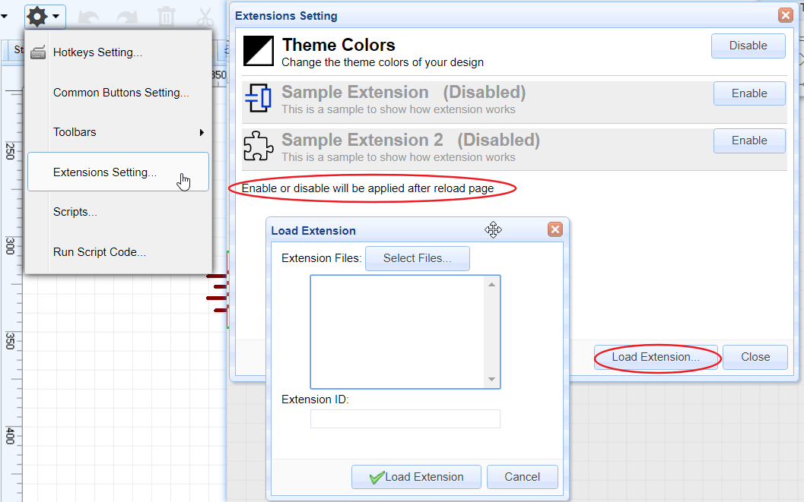
 
If you enable the **Theme Colors** Extension, you will find a button on the tool bar like bellow image:  
   

If you click the **Black On White**, you will find your schematic changes like bellow image, this is useful when you would like to print your design on a paper.  
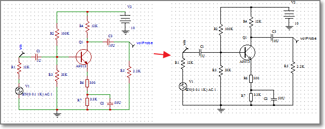.  

You can check our **github** codes of this API via [https://github.com/dillonHe/EasyEDA-Documents/tree/master/API/example/theme](https://github.com/dillonHe/EasyEDA-Documents/tree/master/API/example/theme), check the **manifest.json** and **main.js** out, you will find out how to create an extension.  

**How to install an extension**
 
1. Click the Load Extension button
2. Click the select file button 
3. Select **All** the files.
4. Type a name
5. Click the load button.
6. **Close** EasyEDA editor and open it again.  
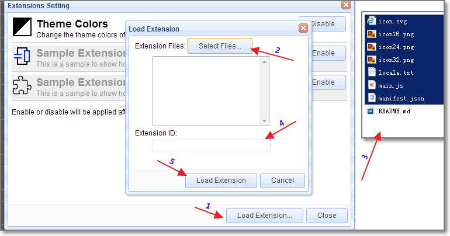.  

### 脚本

If you just need some simple functions, you don't need to create an extension. You just need to create a single Javascipt file and keep it in this list.  

1. You can select the `Hello World`, then click the `Run` button, the response as below image.
2. You can select some items, then try `Move Selected Objects`.
3. You can install your own scripts, then they will show on **User Scripts**.
.  

### 运行脚本代码

In some case, you just need to run the function one time, such as create a user define board outline in codes, changing the Track width, change the hole size etc. You can use this way.
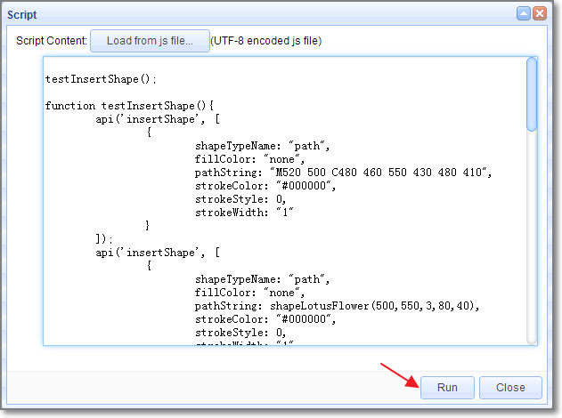.  

**example 1 Art**  
You can open an empty schematic and copy [this example javascript codes](https://raw.githubusercontent.com/dillonHe/EasyEDA-Documents/master/API/example/schematicShapes.js) to the text box to run a test. After clicking the `Run` button, you will see bellow art image.  


**example 2 Change track width and via hole size**  
You can open a **PCB** and copy [this example javascript codes](https://raw.githubusercontent.com/dillonHe/EasyEDA-Documents/master/API/example/modifyTrackVia.js) to the text box to run a test. After that, All tracks will be 10mil.


## 立创EDA坐标系

EasyEDA's editor is based [SVG](http://en.wikipedia.org/wiki/Scalable_Vector_Graphics), SVG viewport,(Coordinates increase **left-to-right** and **top-to-bottom**, the same as EasyEDA ). But SVG's origin is fixed at the left top corn, and EasyEDA's origin can be modified at the any place.
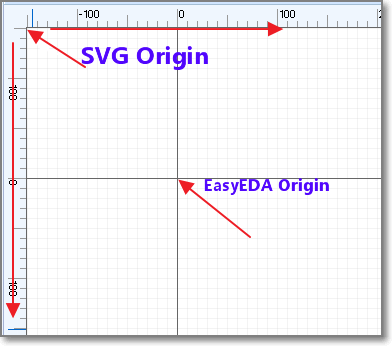.   

Be careful this, they are different from **Cartesian coordinate system**  

## 单位

There are two kinds of unit in our editor, SVG Canvas unit and real world EasyEDA unit. SVG Canvas unit is **Pixel**. The real world EasyEDA unit in schematic is also **Pixel**, but in PCB, there are **mm**, **mil** and **inch**. We use bellow map to convert Canvas to real world.
- 1 pixel = 10 mil
- 1 pixel = 0.254mm
- 1 pixel = 0.01inch
There are API for these convert.

	  //mm2pixel: convert 10mm to pixel
      var result = api('unitConvert', {type:'mm2pixel',value:10});


	  //mil2pixel: convert 10mil to pixel
      var result = api('unitConvert', {type:'mil2pixel',value:10});
 
There are other convert method, such as `inch2pixel`, `pixel2mm`, `pixel2mil` and `pixel2inch`.
 
  All EasyEDA's value is based pixel, if you can keep in mind that 1 pixel equal 10mil or 0.254 mm, you don't need to use any convert function. 
For example, if you want to change a Track to 20mil, so you just need to use 2.


## API列表

### 获取立创EDA Source

1. get EasyEDA JSON objects, type is `json`, you can check  [PCB Json object](/Doc/Open-File-Format/PCBFileObject.htm) out to know more.

		var result = api('getSource', {type:'json'});

2. get [EasyEDA compress string](/Doc/Open-File-Format/PCB.htm), EasyEDA save this string to our database, it is a bit little hard to read and understand, but it is small in size. EasyEDA save this string to our database. 
    
		var result = api('getSource', {type:'compress'});

3. Get SVG string  

		var result = api('getSource', {type:'svg'});     

Check the [Get EasyEDA source example codes](https://raw.githubusercontent.com/dillonHe/EasyEDA-Documents/master/API/example/modifyTrackVia.js).

### 应用Source

 After you can use your codes to hack EasyEDA's source, then you need to apply the source to EasyEDA's editor. You can  
 
1. Apply as compress string
      
		//will open a new editor and convert compressStr to EasyEDA file.
		api('applySource', {source:'compressStr', createNew: true});
2. Apply as Json object.

		//will modify the active file and convert json object to EasyEDA file.
		api('applySource', {source: json, createNew: !true});

Check the [Apply Source example codes](https://raw.githubusercontent.com/dillonHe/EasyEDA-Documents/master/API/example/modifyTrackVia.js).

### 获取图形

 If you want to get an EasyEDA json object by **id**, you can try to use bellow code.

          var obj = api('getShape', {id:'gge13'})

### Delete Shapes

  Removing shapes by follow code
   
### 更新图形

 If you want to modify an EasyEDA object, you can use this API.

	//Change the net to GND and the shape to ELLIPSE
	 api('updateShape', {
	  	"shapeType": "PAD",
	 	"jsonCache": {
	 	"gId": "gge5",
	 	"net": "GND"
	 	"shape": "ELLIPSE"
		});
 shapeType and gId are must provided.  
1. Schematic   
`shapeType`, `schlib`, `rect`, `polyline`, `polygon`, `wire`, `bus`, `image`, `circle`, `ellipse`, `line`, `path`, `arc`, `annotation`, `junction`, `netlabel`, `busentry`, `arrowhead`, `noconnectflag`, `pin`, `netflag`  
2. PCB   
`shapeType`, `FOOTPRINT`, `TRACK`, `COPPERAREA`, `SOLIDREGION`, `RECT`, `CIRCLE`, `TEXT`, `ARC`, `DIMENSION`, `PAD`, `VIA`, `HOLE`
 

### 创建图形

 If you want to create EasyEDA shape by codes, you can try. We will provide more information about this API soon, now we just provide examples. You will find out how to do.   

		/** with shortUrl
		 * @example
		 * api('createShape', {shapeType:'schlib', shortUrl:'nxlVIGgQO', from:'system', title:'556_DIL14', x:400, y:300});
		 * api('createShape', {shapeType:'FOOTPRINT', shortUrl:'RrkewO60i', from:'system', title:'ARDUINO_PRO_MINI', x:400, y:300});
		 */
		/** with jsonCache object
		 * @example
		 * api('createShape', {
		 *   "shapeType": "PAD",
		 *   "jsonCache": {
		 *     "gId": "gge5",
		 *     "layerid": "11",
		 *     "shape": "ELLIPSE",
		 *     "x": 382,
		 *     "y": 208,
		 *     "net": "",
		 *     "width": 6,
		 *     "height": 6,
		 *     "number": "1",
		 *     "holeR": 1.8,
		 *     "pointArr": [],
		 *     "rotation": "0"
		 *   }
		 * });
		 *
		 * @example
		 * api('createShape', {
		 *     "shapeType": "polygon",
		 *     "stroke": "#000000",
		 *     "stroke-width": "1",
		 *     "stroke-style": "dashed",
		 *     "fill": "none",
		 *     "points": [
		 *         {"x": 390, "y": 580},
		 *         {"x": 450, "y": 450},
		 *         {"x": 520, "y": 580},
		 *         {"x": 610, "y": 490}
		 *     ]
		 * });
		 *
		 * @example
		 * api('createShape', {
		 *     "shapeType": "arrowhead",
		 *     "x": 300,
		 *     "y": 300,
		 *     "color": "#339933",
		 *     "size": "3",
		 *     "rotation": 0
		 * });
		 *
		 * @example
		 * var ts = ["no_connect_flag", "arrowhead", "busentry", "netLabel_GNd", "netLabel_GnD", "netLabel_gnD", "netLabel_Bar", "netLabel_VEE", "netLabel_-5V", "netLabel_+5V", "netLabel_VCC", "netLabel_volProbe", "netLabel_netPort", "netLabel_text", "pin", "annotation"];
		 * for(var i=0;i<ts.length;i++){
		 *     api('createShape', {
		 *         "shapeType": ts[i],
		 *         "x": 300 + i%5*50,
		 *         "y": 300 + (i/5|0)*50
		 *     });
		 * }
		**/
		/** with cached or pre-defined libs
		 * @example
		 * api('createShape', {"shapeType": "pcblib", from:'GeneralPackages', title:'C0402', x:400, y:300});
		 * @example
		 * api('createShape', {"shapeType": "schlib", from:'EasyEDALibs', title:'HDR2X2', x:400, y:300});
		 *
		**/
		/**
		 * @example 4
		 * api('createShape', {
		 *     "shapeType": "schlib",
		 *     "gId": "gge6",
		 *     "head": {},
		 *     "itemOrder": [],
		 *     "annotation": {
		 *         "gge8": api('createShape', 'annotation', {}),
		 *         "gge9": api('createShape', 'annotation', {})
		 *     },
		 *     "pin": {
		 *         "gge11": api('createShape', 'pin', {}),
		 *         "gge14": api('createShape', 'pin', {})
		 *     },
		 *     "polyline": {
		 *         "gge10": api('createShape', 'polyline', {}),
		 *         "gge12": api('createShape', 'polyline', {})
		 *     }
		 * });
		 *
		 * @example 5
		 * api('createShape', {
		 *     "shapeType": "schlib",
		 *     "gId": "gge6",
		 *     "head": {},
		 *     "children": [
		 *         api('createShape', 'polyline', {}),
		 *         api('createShape', 'polyline', {}),
		 *         api('createShape', 'pin', {}),
		 *         api('createShape', 'pin', {}),
		 *         api('createShape', 'annotation', {}),
		 *         api('createShape', 'annotation', {})
		 *     ]
		 * });
		 *
		 * @example 6
		 * api('createShape', {
		 *     "shapeType": "schlib",
		 *     "gId": "gge6",
		 *     "head": {},
		 *     "children": api('createShape', [
		 *         ['polyline', {}],
		 *         ['polyline', {}],
		 *         ['pin', {}],
		 *         ['pin', {}],
		 *         ['annotation', {}],
		 *         ['annotation', {}]
		 *     ])
		 * });
		**/ 

### UI

   If you want to create an extension, not just a run one time script, maybe need toolbar button. You can check the [example](https://github.com/dillonHe/EasyEDA-Documents/tree/master/API/example/theme) before you read.

#### 创建工具栏按钮


	 //@example create a button 
	 api('createToolbarButton', {
	  icon:'extensions/theme/icon.svg',
	  title:'Theme Colors...',
	  fordoctype:'sch,schlib',
	  cmd:"extension-theme-setting"
	 });

	 * @example toolbar with menu
	 * api('createToolbarButton', {
	 *  icon:'extensions/theme/icon.svg',
	 *  title:'Theme Colors...',
	 *  fordoctype:'sch,schlib',
	 *  "menu" : [
	 *      {"text":"White on Black", "cmd":"extension-theme-WhiteOnBlack"},
	 *      {"text":"Black on White", "cmd":"extension-theme-BlackOnWhite"},
	 *      {"text":"Custom Colors...", "cmd":"extension-theme-setting"}
	 *  ]
	 * });

#### 创建扩展菜单

	/**
	 * @example  
	 * api('createExtensionMenu', [
	 *  {
	 *      "text":"Theme Colors...",
	 *      "fordoctype": "sch,schlib",
	 *      "cmd": "extension-theme-white"
	 *  }
	 * ]);
	 */

### 创建对话框
  check the [example](https://github.com/dillonHe/EasyEDA-Documents/tree/master/API/example/theme) 

### 命令列表

#### 克隆

      // clone gge2 gge3 and return their new ids.
      var newIds = api('clone', {ids:["gge2","gge3"]})

#### 删除

	  api('delete', {ids:["gge2","gge3"]});

#### 旋转

    // rotate ids to 90 degree
    api('rotate', {ids:["gge2","gge3"],degree:90});

#### 左旋转

    //anticlockwise
    api('rotate_left', {ids:["gge2","gge3"]});

#### 右旋转

    //clockwise
    api('rotate_right', {ids:["gge2","gge3"]});

#### 水平翻转

    api('fliph', {ids:["gge2","gge3"]});

#### 垂直翻转

    api('flipv', {ids:["gge2","gge3"]});

#### 左对齐

    api('align_left', {ids:["gge2","gge3"]});

#### 右对齐

    api('align_right', {ids:["gge2","gge3"]});

#### 顶对齐

    api('align_top', {ids:["gge2","gge3"]});

#### 底对齐 

    api('align_bottom', {ids:["gge2","gge3"]});

### 选中

 Change or get selection states of EasyEDA objects in editor.

#### 选择

      // gge2 and gge3 will be marked as selected.
      api('select', {ids:["gge2","gge3"]});

#### 未选择

      //no objects will be selected.
      api('selectNone');

####获取选中的Ids

     var ids = api('getSelectedIds');

### 移动

You can use [Update Shape](#UpdateShape) to change the shapes position, but the Move method is better in this case.

#### 移动对象

Move shapes in relative coordinates, like move the shapes in arrow keys.

	//Move gge2 and gge3 from left to right in 20pixel or 200mil step
    //from top to bottom in 20pixel or 200mil step.
	api('moveObjs', {objs:[{gId:"gge2"},{gId:"gge3"}], addX: 20, addY: 20});

	//Move gge2 and gge3 from right to left in 20pixel or 200mil step
	api('moveObjs', {objs:["gge2","gge3"], addX:-20});

	//Move selected objects from left to right in 20pixel or 200mil step
	api('moveObjs', {addX:20});

#### 移动对象至

How to move a `VIA` or `junction` to position `{x:'10mil', y:'10mil'}` ?, Move shapes to absolute coordinates.
	
	 //Move gge2 and gge3 to Canvas postion 20,20, the real coordinates are dedpend the origin.
	 api('moveObjsTo', {objs:[{gId:"gge2"},{gId:"gge3"}], x:20, y:20});

	//move gge2 and gge3 to 10mm, 10mm coordinates
	 api('moveObjsTo', {objs:["gge2","gge3"], x: api('coordConvert', {type:'real2canvas',x: '10mm'}), y: api('coordConvert', {type:'real2canvas',y: '10mm'})});

	//Move selected objects to Canvas postion 20,20, the real coordinates are dedpend the origin.
	 api('moveObjsTo', {x:20, y:20});
It is very easy to understand to move a PAD, VIA, Junction to absolution coordinates. But what are the effects of moving TRACK, FOOTPRINT, netlabel to some where. Just try to play the codes, you will find out the regular pattern.

### 设置原点XY

EasyEDA's canvas origin is 0,0, you can't change it. But the real coordinates can be mapped to any where.   

	//set the real origin point to canvas x = 400, y = 300. X,Y is pixel all the time.
    var result = api('setOriginXY', {x:400,y:300});

### 坐标转换

You can use mm or mil or inch as units, but when you apply the Parameters to SVG graph, you must use coordinate convert. 
    
    //convert the canvas x 400 to real postion, the value is depent your units and origin point.
    var result = api('coordConvert', {type:'canvas2real',x:400})

    //the default units is your canvas units, but you can add a units like 300mm. 
    //if your PCB's units is mil, then you will get the canvas coordinate 400mil,300mm.
     var result = api('coordConvert', {type:'real2canvas',x:400,y:'300mm'});

  If you set the origin to **0,0**. It is very easy to map the coordinate in your mind, you don't need to use API to convert. the canvas coordinate **100,100** equal the real coordinate **1000mil, 1000mil** or **1inch, 1inch** or **393.7mm, 393.7mm**

### 单位数值转换

 How to set the pad's hole size to 20mm? How to set the Track width to 20mil?
     
    //the default units is your canvas units, but you can add a units like mm, mil, inch, even pixel.
     var result = api('valConvert', {type:'real2canvas',val:400});
     result = api('valConvert', {type:'real2canvas',val:'400mm'})
    
     //convert the 400 pixel to real value, the value is depent your units , if the unit is mil, the result should be 4000
     //result = api('valConvert', {type:'canvas2real',val:400})

  If you can keep in mind 1pixel in canvas equal 10mil, so you don't need this API, you can do it in raw way. For example,
  If you want to update the track size to 20mil, you can do.

	 api('updateShape', {
	  	"shapeType": "TRACK",
	 	"jsonCache": {
		 	"gId": "gge5",
		 	"strokeWidth": 2
        }
		});
  Or

	 api('updateShape', {
	  	"shapeType": "TRACK",
	 	"jsonCache": {
		 	"gId": "gge5",
		 	"strokeWidth":  api('valConvert', {type:'real2canvas',val:'20mil'})
        }
	 });

### 获取SVG圆弧路径

 SVG [Arc path Parameter](http://www.w3.org/TR/SVG11/paths.html#PathElement) is very complex,  We provide a API to convert human read ARC parameter to SVG path.

	 var result = api('getSvgArcPathByCRA', {cx:0, cy:0, rx:90, ry:90, startAngle:0.1, endAngle:0.7, sweepFlag:1});

result should be `M89.55037487502231 8.985007498214534A90 90 0 0 1 68.83579685560396 57.97959185139219`

## 范例

Check [Github example](https://github.com/dillonHe/EasyEDA-Documents/tree/master/API/example)

Enjoy it, if you have any questions, do let us know.

​
# 开放文件格式

## Common Information

EasyEDA is a free, zero-install, Web and cloud-based EDA tool suite, integrating powerful schematic capture, mixed-mode circuit simulation and PCB layout.

EasyEDA team tries to make our users happy. We provide an open ASCII file format. With this file format, you can create a schematic or PCB using some codes, even with Notepad. When you try to add hundreds of LEDs to a schematic or PCB batch, you will find out that you can use codes to create an EasyEDA file, then import it to EasyEDA. It is fun and quick.

EasyEDA's file is a JSON file, but we compress all of the shape's attributes to a simple string, which will make the file size smaller and saving to server faster. More importantly, with this solution you can create some very big designs. Most browsers will crash when trying to decode the big JSON files. But EasyEDA will provide an **API** to let you to access the EasyEDA friendly JSON object, so you can hack the designs in the EasyEDA editor.


Ok, let's explain them with examples.

### Example

### Schematic Example

[Schematic Example ](https://easyeda.com/file_view_simply-schematic_puoGYgasK.htm)


#### Schematic JSON File Source

check it via github gist [Schematic json](https://gist.github.com/dillonHe/0b62babdb8ab3d2ad7d3#file-schematic-json)
<script src="https://gist.github.com/dillonHe/0b62babdb8ab3d2ad7d3.js"></script>

#### PCB Example

[PCB Example](https://easyeda.com/file_view_Simply-PCB_K4gCYjhDB.htm)  


#### PCB JSON File Source

check it via github gist [PCB json](https://gist.github.com/dillonHe/279c55659bb7065258b6#file-pcb-json)
<script src="https://gist.github.com/dillonHe/279c55659bb7065258b6.js"></script>

### General File Struct

#### Delimiter Mark

From the above JSON source, you can find there are lots of **`**, **~**, **^^** and **#@$**  
 characters. These characters are used as **delimiter mark**. These characters are not used frequently in design.

 ***Note: Although these characters were not picked properly at the very beginning, we can't change these, EasyEDA already has lots of existing designs***

##### ~ (Tilde)

 `~` is used to separate the attributes of the shapes. Taking rectangle as an example.  `R~170~100~10~10~200~130~#99FF00~1~0~none~gge36~`, when use pure JSON file, it should be look like below,
check it via github gist [rect json](https://gist.github.com/dillonHe/55151fae7c36785cdc31#file-rect-json).

<script src="https://gist.github.com/dillonHe/55151fae7c36785cdc31.js"></script>


So EasyEDA's source is small in file size and will transfer from the internet faster.


##### `(Back Quote)

  **`** is used to separate the custom attributes. 

**package`LED3MM** stands package:LED3MM 

##### ^^(Double Circumflex)

**^^** is used to join segments, just used in *netFlag* , *Pin* and *pAD*.

##### #@$(Octothorpe Ampersat Dollar)

Union the characters **#@$** as a supper mark, it will be used to implode the [shapes](./schematic.htm#Shapes) to a string, it's only used in *Schlib* and *PCBLIB*.


### Document Type

check it via github gist [document type](https://gist.github.com/dillonHe/8c1a0e599540980bf7ab#file-document-type-js)
<script src="https://gist.github.com/dillonHe/8c1a0e599540980bf7ab.js"></script>

### Canvas Coordinates

The canvas is a two-dimensional grid.  
The upper-left corner of the canvas has the coordinate (0,0)  


### SVG

 EasyEDA uses [Scalable Vector Graphics (SVG)](http://en.wikipedia.org/wiki/SVG) which is an XML-based vector image format for two-dimensional graphics to realize the shapes.

### Q&A

#### 1. How to check the json file format

 Check the [EasyEDA source dialog](https://easyeda.com/Doc/Tutorial/introduction.htm#EasyEDA-Source) out, copy the text to text area, then click the `Apply` button. That is all.
 
 
## EasyEDA Schematic File Format

Note: Schematic, Schematic Library, Spice Symbol, Subpart and Subckt are used the same file format. Please check [Schematic JSON File Source](./common.htm#Schematic-JSON-File-Source) out before keeping read.

### Head

### Head information for schematic and subckt.  

	"head":"1~1.7.5~Author`Dillon`~TRAN`2u`2m`0`{AC`dec``0`0`{DC`0``0`0`{TF```"

**Format:**

1. [document type](./common.htm#Document-Type) :`1`
2. document version: `1.7.5`h
3. custom attributes: **key: value** pairs, separate with **`**, added via **Add new parameter**     
  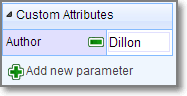  
4. spice simulation configure store, Now can set four types `tran`, `AC`, `DC`, `TF`, every type split with `{`. When opening the simulation dialog, these information will be listed in like below image.    


### Head information for Schematic Library, Spice Symbol and Subpart

	"head":"7~1.7.5~400~300~package`DIP08`nameDisplay`0`nameAlias`Model`Model`555`name`555`pre`U?`spicePre``Contributor`Dillon"

**Format:**

1. [document type](./common.htm#Document-Type) :`7`
2. document version: `1.7.5`
3. origin x position. **Reserved field, can't be changeded** 
4. origin y position. **Reserved field, can't be changeded** 
5. custom attributes: **key: value** pairs, separate with **`**, added via **Add new parameter**.   
*package*: *DIP08*  
*nameDispaly*: *0* (hide it is name when placed to schematic)  
*nameAlias*: *Model*   
*name*:*555*  
*pre*:*U?* , when place to schematic, will be marked as U1, U2. subpart will be set as *U?.1*, *U?.2* etc.  
*spicePre*:*X*, *X* stands for a subckt.  
*sourceId*:*xxxxxxxxx* (just for schematic Lib and spice symbol)
 
Place it to schematic canvas, it's attributes will be looked like below image. The name field is alias as Model and it is invisible.     


### Canvas

	"canvas":"CA~1200~1200~#FFFFFF~yes~#CCCCCC~10~1200~1200~line~10~pixel~5~400~300"
**Format:**  
1. command: CA
2. view box width: 1200, View Box Width / Canvas width = scaleX
3. view box height: 1200,View Box Height / Canvas Height = scaleY
4. back ground: #FFFFFF
5. grid visible: yes/none
6. grid color: #CCCCCC
7. grid size: 10 pixel
8. canvas width: 1200 pixel
9. canvas height: 1200 pixel
10. grid style: line/dot
11. snap size: 10 pixel
12. unit: pixel(Always pixel)
13. ALT snap size:5 (Snap Size when pressing the `ALT` Key)
14. origin x position
15. origin y position

Canvas setting image  


### Shapes

The shape is an array. EasyEDA store various shape in this field, they are different with a command which locate at the begin of the string. 

	"shape":[
	    "PL~210 100 260 100~#000000~2~0~none~gge58",
	    "R~210~110~~~50~30~#000000~1~0~none~gge61",
	    "I~90~90~271~105~0~https://easyeda.com/assets/static/images/logo-140x39.png~gge62",
	    "PG~310 100 350 130 300 150 290 150 270 120~#000000~2~0~none~gge64",
	    "PT~M230 170 C270 200 270 170 240 150 240 150 240 150 240 150~#000000~2~0~none~gge65"
	]

#### Rectangle

	"R~650~0~20~20~230~160~#FF0000~2~1~#9966FF~gge5"

**Format:**  

Check [ Rect element of SVG](http://www.w3.org/TR/SVG11/shapes.html#RectElement) out.

1. command: R
2. x: 650
3. y: 0
4. rx: 20
5. ry: 20
6. width: 230
7. height: 160
8. strokeColor: #FF0000
9. strokeWidth: 2 //pixel
10. [strokeStyle](#strokeStyle): 1 
11. fillColor: #9966FF
12. id: gge36
13. locked:null
Rect's attributes and image looks like bellow image:  


#### Polyline

	"PL~610 130 780 130~#FF0000~5~0~none~gge6"

**Format:**  
Check [ Polyline element of SVG](http://www.w3.org/TR/SVG11/shapes.html#PolylineElement) out.

1. command: PL
2. points: 610 130 780 130
3. strokeColor: #FF0000
4. strokeWidth: 5 //pixel
5. [strokeStyle](#strokeStyle): 0 
6. fillColor: none
7. id: gge6
8. locked:null
Polyline's attributes and image looks like bellow image:  


#### Path

	"PT~M670 300 C830 370 850 230 920 300 920 300 920 300 920 300~#000000~1~0~none~gge17"
**Format:**  
Check [Path element of SVG](http://www.w3.org/TR/SVG11/paths.html#PathElement) out.

1. command: PT
2. pathString:M670 300 C830 370 850 230 920 300 920 300 920 300 920 300
3. strokeColor: #FF0000
4. strokeWidth: 5 //pixel
5. [strokeStyle](#strokeStyle): 0 
6. fillColor: none
7. id: gge6
8. locked:null
Path's attributes and image looks like bellow image:   

**bezier** is a **path** too.

#### Arc

```"A~M 1020 60 A 80 80 0 0 1 953.096 199.904~968.78,121.45,1048.785,201.457,1018.785,61.457,948.785,221.45~#FF0000~3~0~none~gge19"```

**Format:**  
**Arc** is a **Path** element, Check [Path element of SVG](http://www.w3.org/TR/SVG11/paths.html#PathElement) out.

1. command: A
2. pathString:M670 300 C830 370 850 230 920 300 920 300 920 300 920 300
3. helperDots: the four green dots
4. strokeColor: #FF0000
5. strokeWidth: 3 //pixel
6. [strokeStyle](#strokeStyle): 0 
7. fillColor: none
8. id: gge19
9. locked:null


ARC's attributes and image looks like bellow image:   


#### Pie

	"PI~M 970 40 L 1189.9 34.4509 A 220 180 0 0 1 923.103 215.863 Z~970,40,1190,220,1327.7106323242188,30.973068237304688,923.1032104492188,215.86282348632812~#FF0000~3~0~#CCCCCC~gge22"
**Pie** is a **Path** element, Check [Path element of SVG](http://www.w3.org/TR/SVG11/paths.html#PathElement) out. Pie is similar with Arc, the pathString has a `Z`

1. command: PI
2. pathString:M 970 40 L 1189.9 34.4509 A 220 180 0 0 1 923.103 215.863 Z
3. helperDots: the four green dots
4. strokeColor: #FF0000
5. strokeWidth: 3 //pixel
6. [strokeStyle](#strokeStyle): 0 
7. fillColor: none
8. id: gge19
9. locked:null


Pie's attributes and image looks like bellow image:    
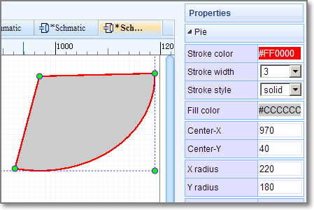

#### Bus Entry

	"BE~0~660~150~670~140~gge15"

**Format:** 

1. command: BE
2. rotation:0
3. start x1: 660
4. start y1: 150
5. end x1: 670
6. end y1: 140 
7. id: gge15
8. locked:null

Bus Entry's attributes and image looks like bellow image:   
	

#### Image

	"I~610~10~271~105~0~https://easyeda.com/assets/static/images/logo-140x39.png~gge12"

**Format:**  
Check [ Image element of SVG](http://www.w3.org/TR/SVG11/struct.html#ImageElement) out.

1. command: I
2. x: 610
3. y: 10
4. width: 271
5. height: 105 
6. rotation: 0
7. href:https://easyeda.com/assets/static/images/logo-140x39.png
8. id: gge12
9. locked:null
Image's attributes and image looks like bellow image:   
	


#### Polygon

	"PG~640 10 900 40 920 140 760 230 560 140~#FF0000~2~0~#00FF00~gge10"

**Format:**  
Check [ Polygon element of SVG](http://www.w3.org/TR/SVG11/shapes.html#PolygonElement) out.

1. command: PG
2. points: 640 10 900 40 920 140 760 230 560 140
3. strokeColor: #FF0000
4. strokeWidth: 2 //pixel
5. [strokeStyle](#strokeStyle): 0 
6. fillColor: #00FF00
7. id: gge10
8. locked:null
Polygon's attributes and image looks like bellow image:   


#### Line

	"L~360~160~510~160~#FF0000~2~0~none~gge11"

**Format:**  
Check [ Line element of SVG](http://www.w3.org/TR/SVG11/shapes.html#LineElement) out.

1. command: L
2. x1:360
3. y1:160
4. x2:510
5. y2:160
6. strokeColor: #FF0000
7. strokeWidth: 2 //pixel
8. [strokeStyle](#strokeStyle): 0 
9. fillColor: #00FF00
10. id: gge11
11. locked:null
 
#### Circle

	"C~710~170~105~#FF0000~2~0~#0000FF~gge12"
**Format:**  
Check [ Circle  element of SVG](http://www.w3.org/TR/SVG11/shapes.html#CircleElement) out.

1. command: C
2. cx:720
3. cy:90
4. r:105
5. strokeColor: #FF0000
6. strokeWidth: 2 //pixel
7. [strokeStyle](#strokeStyle): 0 
8. fillColor: #0000FF
9. id: gge12
10. locked:null


#### Bus

	"B~570 130 680 130 680 210~#008800~2~0~none~gge19"

Bus is similar with [Polyline](#polyline), Bus is start with `B`, polyline start with `PL`.

#### Pin

	"P~show~0~1~670~30~~gge23^^670~30^^M 670 30 h -20~#880000^^1~648~33~0~1~end~~11pt^^1~655~29~0~1~start~~11pt^^0~653~30^^0~M 650 27 L 647 30 L 650 33"

A Pin has seven segments, join these segments with [^^ (Double Circumflex)](./common.htm#Double-Circumflex) as a string like above.

1. **Pin configure** `P~show~0~1~670~30~~gge23`  
	1. command: P
	2. display: show/'' (*bad design, should use yes/none*)
	3. electric: 0, can be  ['Undefined', 'Input','Output','I/O','Power']
	4. spice pin number: 1
	5. position x: 670
	6. position y: 30
	7. rotation: null, can be ['null' or 0, '90', '180', '270']
	8. id: gge23
	9. locked: null
2. **pin dot** `670~30`  
	The gray dot at the end of the Pin, it is important.
	1. pin dot x: 670
	2. pin dot y: 30
	 
3. **pin path** `M 670 30 h -20~#880000`
    1. path: M 670 30 h -20, a 20 pixel horizontal line start from **pin dot**
    2. pin color: #880000
    
4. **name** `1~648~33~0~1~end~~11pt`
	1. visible : 1/0 stand show or hide
	2. position x: 648
	3. position y: 33
	4. rotation: 0
	5. text: **1**
	6. text anchor: end
	7. font family: null, default is **Verdana**
	8. font size: 11pt, default is 7pt
5. **number** `1~655~29~0~1~start~~11pt`

	 the same as **name** above
6. **dot** `0~653~30`

	stands for not. a circle with radius in 3 pixel 
	1. visible : 0/1 hide / show
	2. circle x: 653
	3. circle y: 30
7. **clock** `0~M 650 27 L 647 30 L 650 33`
	1. visible: 0/1 hide / show
	2. clock path: M 650 27 L 647 30 L 650 33

Pin's attributes and image looks like bellow image:   


#### Ellipse

	"E~720~90~105~65~#FF0000~2~0~#0000FF~gge12"

**Format:**  
Check [ Ellipse  element of SVG](http://www.w3.org/TR/SVG11/shapes.html#EllipseElement) out.

1. command: E
2. cx:720
3. cy:90
4. rx:105
5. ry:65
6. strokeColor: #FF0000
7. strokeWidth: 2 //pixel
8. [strokeStyle](#strokeStyle): 0 
9. fillColor: #0000FF
10. id: gge12
11. locked:null

Ellipse's attributes and image looks like bellow image:   


#### Arrowhead

	"AR~part_arrowhead~1060~120~gge23~180~M 1060 120 L 1063 126 L 1055 120 L 1063 114 Z~#FF0000"

**Format:**  
  
1. command: AR
2. part Type:part_arrowhead, not used
3. x:1060
4. y:120
5. id:gge23
6. rotation: 180
7. path String: M 1060 120 L 1063 126 L 1055 120 L 1063 114 Z
9. fillColor: #FF0000
9. locked:null

Arrow head's attributes and image looks like bellow image:    


#### Annotations

    "T~L~540~60~0~#0000FF~~9pt~bold~normal~~comment~Text~1~start~gge26"
     


Check [Text  element of SVG](http://www.w3.org/TR/SVG11/text.html#TextElement) out.
**Format:**  
  
1. command: T
2. mark: L // `L` = label, `N` = Name, `P` = prefix `N,P` are for [Schlib](#Schlib)
3. position x:540
4. position y:60
5. rotation:0
6. fill color: #0000FF
7. font family: null, default is **Verdana**
8. font size: 9pt
9. font-weight: bold
10. font style: normal
11. dominant baseline: null 
12. text type: comment // **comment** or **spice** command
13. string: Text
14. visible: 1/0 show/hide (use for mark `N` or `P` )
15. text anchor: start (start middle end)
16. id:gge26
17. locked:null

Text's attributes and image looks like bellow image:   


 
#### Netlabels

	    "N~360~100~0~#FF0000~VCC~gge32~start~362~100~Times New Roman~",


**Format:**  
  
1. command: N
2. pin dot x: 360
3. pin dot y: 100
4. rotation: 0
5. fill color: #FF0000
6. name: VCC
7. id: gge32
8. text anchor: start (start middle end)
9. postion x: 362
10. postion y: 100
11. font family: Times New Roman
12. font size:null default is 7pt
13. locked:null


netlabel's attributes and image looks like bellow image:   


#### Netflags

Netflag is very similar with netlabel

    "F~part_netLabel_gnD~330~110~~gge41^^330~110^^GND~#000080~319~97~0~start~0~Times New Roman~9pt^^PL~330 120 330 110~#000000~1~0~none~gge44^^PL~320 120 339 120~#000000~1~0~none~gge45^^PL~324 122 337 122~#000000~1~0~none~gge46^^PL~326 124 333 124~#000000~1~0~none~gge47^^PL~329 126 331 126~#000000~1~0~none~gge48",

A Netflag  has several segments, join these segments with [^^(Double Circumflex)](./common.htm#Double-Circumflex) as a string like above.

1. **configure** `P~show~0~1~670~30~~gge23`  
	1. command: F
	2. part id: part\_netLabel\_gnD
	3. position x: 330
	4. position y: 110
	5. rotation: null [0, 90, 180, 270]
	6. id: gge41,
	7. locked: null

2. **pin dot** `670~30`  
	The gray dot at the end of the Pin, it is important.
	1. pin dot x: 330
	2. pin dot y: 140
	
3. **mark string** `GND~#000080~319~97~0~start~0~Times New Roman~9pt`
	1. net flag string: GND
	2. color: #000080
	3. position x: 319
	4. position y: 97
	5. rotation: 0 [0, 90, 180, 270]
	6. text anchor: start (start middle end)
	7. visible: 1/0 show/hide the net flag string
	8. font family: Times New Roman
	9. font size:null default is 7pt
4. **shapes**

	All other items are [shapes](#shapes).

netflag's attributes and image looks like bellow image:   


#### Wire

		"W~570 130 680 130 680 210~#008800~2~0~none~gge19"
	

`Wire` is similar with [Polyline](#polyline), `Wire` is start with `W`, [polyline](#polyline) start with `PL`.

#### Junctions

	    "J~420~140~2.5~#CC0000~gge18",


**Format:**  
  
1. command: J
2. pin dot x: 420
3. pin dot y: 140
4. junction circle radius: 2.5 pixel
5. fill color: #CC0000
6. id: gge18
7. locked:null


Junction's attributes and image looks like bellow image:   


#### No Connect Flag

	    "O~960~410~gge5~M956,406 L964,414 M964,406 L956,414~#FF0000"


**Format:**  
  
1. command: O
2. pin dot x: 960
3. pin dot y: 410
4. id: gge5
5. pathStr: M956,406 L964,414 M964,406 L956,414
6. color: #FF0000
7. locked:null


No Connect Flag's attributes and image looks like bellow image:   


#### SchLib


    "LIB~220~140~package`C1`nameAlias`Value(F)`Value(F)`1u`spicePre`C`spiceSymbolName`Capacitor`~~0~gge66#@$T~N~214~129~0~#000080~Arial~~~~~comment~1u~1~start~gge68#@$T~P~214~120~0~#000080~Arial~~~~~comment~C1~1~start~gge69#@$PL~218 148 218 132~#A00000~1~0~none~gge70#@$P~show~0~1~200~120~180~gge71^^200~140^^M 210 140 h -10~#800^^0~214~140~0~1~start~~^^0~206~136~0~1~end~~^^^^#@$PL~230 140 222 140~#A00000~1~0~none~gge72#@$PL~222 132 222 148~#A00000~1~0~none~gge73#@$P~show~0~2~210~120~0~gge74^^240~140^^M 230 140 h 10~#800^^0~226~140~0~2~end~~^^0~234~136~0~2~start~~^^^^#@$PL~218 140 210 140~#A00000~1~0~none~gge75"

A schlib  has several shapes, join these shapes with [#@$(Octothorpe Ampersat Dollar) ](./common.htm#Octothorpe-Ampersat-Dollar) as a string like above.

1. **configure** <code>LIB~270~140~package\`DO35-7\`nameAlias\`Model\`Model\`1N4001\`spicePre\`D\`spiceSymbolName\`Diode\`~~0~gge116</code>  

	1. command: LIB
	2. position x: 270
	3. position y: 140
	4. [custom attributes](common.htm#Back-Quote): *package\`DO35-7\`nameAlias\`Model\`Model\`1N4001\`spicePre\`D\`spiceSymbolName\`Diode\`*
	5. rotation: 0, can be ['null' or 0, '90', '180', '270']
	6. import flag: 0 just  used in import from eagle
	7. id: gge116
	8. locked: null
 
2. **shapes**

	All other items are [shapes](#shapes).


### strokeStyle

- 0 : solid
- 1 : dashed
- 2 : dotted

### Q&A


#### 1. Why don't save the Wire, Annotion, netlabel, netflag to Shape field.

These items will be used to create netlist, save them to separate field will make you spent more less time to do this. We don't need to traversal all the shapes.
 
## EasyEDA PCB File Format

Note: PCB and PCB Library are used the same file format. Please check [PCB JSON File Source](./common.htm#PCB-JSON-File-Source) out before keeping read.

### Head

#### Head information for PCB.

	"head":"3~1.7.5~Author`Dillon`"

**Format:**

1. [document type](./common.htm#Document-Type) :`3`
2. document version: `1.7.5`
3. custom attributes: **key: value** pairs, separate with **`**, added via **Add new parameter**  
  


#### Head information for PCB Library

	"4~1.7.5~400~300~`pre`U?`Contributor`Dillon"


**Format:**

1. [document type](./common.htm#Document-Type) :`4`
2. document version: `1.7.5`
3. origin x position. **Reserved field, can't be changeded**
4. origin y position. **Reserved field, can't be changeded**
5. custom attributes: **key: value** pairs, separate with **`**, added via **Add new parameter**.

*pre*:*U?* , when place to PCB, will be marked as U1, U2.
*Contributor*:*Dillon*
*sourceId*:*xxxxxxxxx* (just for PCB lib)

### Parameters Dimensions

EasyEDA support millimeter, inch and millimeter, but when these items are stored to a file, all of them will be expressed as 10X mil. Taking line lengths or widths for examples, stroke width equal 1, stands 10mil.


### Canvas

	"CA~2400~2400~#000000~yes~#FFFFFF~10~1200~1200~line~1~mil~1~45~visible~0.5~400~300"

**Format:**

1. command: CA
2. view box width: 2400(24000 mil), View Box Width / Canvas width = scaleX = 2
3. view box height: 2400(24000 mil),View Box Height / Canvas Height = scaleY = 2
4. back ground: #000000
5. grid visible: yes/none
6. grid color: #FFFFFF
7. grid size: 10(100 mil)
8. canvas width: 1200 (12000 mil)
9. canvas height: 1200 (12000 mil)
10. grid style: line/dot
11. snap size: 1 (10 mil)
12. unit: mil(inch, mil, mm)
13. routing width: 1 (10mil)
14. routing angle: 45 degree( 45 90 free)
15. copper area: visible/invisible
16. ALT snap size: 0.5 ( 5 mil Snap Size when pressing the `ALT` Key)
17. origin x position
18. origin y position

Canvas setting image   


### System Color

	"#000000~#FFFFFF~#FFFFFF~#000000~#FFFFFF"


**Format:**

1. future use: #000000
2. future use: #FFFFFF
3. future use: #FFFFFF
4. hole Color: #000000
5. DRC error: #FFFFFF

### Layers config

layers is an array, each layer is an item of the layers.

	 "layers":[
		"1~TopLayer~#FF0000~true~true~true",
		"2~BottomLayer~#0000FF~true~false~true",
		"3~TopSilkLayer~#FFFF00~true~false~true",
		"4~BottomSilkLayer~#808000~true~false~true",
		"5~TopPasterLayer~#808080~false~false~false",
		"6~BottomPasterLayer~#800000~false~false~false",
		"7~TopSolderLayer~#800080~false~false~false",
		"8~BottomSolderLayer~#AA00FF~false~false~false",
		"9~Ratlines~#6464FF~true~false~true",
		"10~BoardOutline~#FF00FF~true~false~true",
		"11~Multi-Layer~#C0C0C0~true~false~true",
		"12~Document~#FFFFFF~true~false~true",
		"21~Inner1~#800000~false~false~false",
		"22~Inner2~#008000~false~false~false",
		"23~Inner3~#00FF00~false~false~false",
		"24~Inner4~#000080~false~false~false"
	]

**Format:**

1. layer id: 1
2. layer name: TopLayer
3. layer color: #FF0000
4. visible: true, hints the objects in this layer show or hide
5. active: false. active layer
6. config: true. if be set false, you can't see it on the layer toolbar.


### Preference

	"preference":{
	    "hideFootprints":"gge118~gge221~gge227~gge233",
	    "hideNets":"BSYNC~DREQ~GPIO0~MICP~GND"
	}

`hideFootprints` : when the id of the footprints in here, you can't see them on canvas.
`hideNets` : when the net name in here, you can't see them on canvas, you can hide the ratline at here too. There are some guys would like to hide then GND ratline, then use copper area to connect all the GND pad.

### DRC Rule

	 "DRCRULE":{
		"trackWidth":0.7,
		"track2Track":0.7,
		"pad2Pad":0.8,
		"track2Pad":0.8,
		"hole2Hole":1,
		"holeSize":1.6
	}

`trackWidth`: 0.7 (7 mil)  track width
`track2Track`: 0.7 (7 mil) track to track distance
`pad2Pad`:   0.8(8 mil) pad to pad distance
`track2Pad`: 0.8(8 mil) track to pad distance
`hole2Hole`: 1(10 mil) hole to hole distance
`holeSize`:  1.6(16 mil) hole diameter

This is a simple DRC, more later.

### Shapes

The shape is an array. EasyEDA store various shape in this field, they are different with a command which locate at the begin of the string.

	"shape":[
	    "TRACK~1~1~S$19~311 175 351 175 352 174~gge18",
	    "PAD~ELLIPSE~329~185~6~6~11~~1~1.8~~0~gge20",
	    "VIA~329~202~3.2~~0.8~gge23",
	    "COPPERAREA~2px~1~GND~349 247 492 261 457 314 339 329~1~solid~gge27~spoke~none~[]",
	    "SOLIDREGION~1~~350 146 483 146 447 228 371 220~solid~gge26"
	]

#### Unit
 EasyEDA takes **10 mil** as a basic factor, when a stroke width is 1, we can take it as 1\*10mil = 10mil, is 2, we can take it as 2\*10mil = 20mil


#### TRACK
	"TRACK~1~1~S$19~311 175 351 175 352 174~gge18"

**Format:**
Check [ Polyline element of SVG](http://www.w3.org/TR/SVG11/shapes.html#PolylineElement) out.

1. command: TRACK
2. stroke Width: 1 (10 mil)
3. layer id: 1 (TopLayer)
4. net: "S$19"
5. points: 311 175 351 175 352 174
6. id : gge18
7. locked: null

TRACK's attributes and image looks like bellow image:   


#### COPPERAREA
	"COPPERAREA~2px~1~GND~349 247 492 261 457 314 339 329~1~solid~gge27~spoke~yes~[[\"M339,329 349,247 492,261 457,314z\"]]"

**Format:**


1. command: COPPERAREA
2. stroke Width: 2 (20 mil)
3. layer id: 1 (TopLayer)
4. net: GND
5. points: 349 247 492 261 457 314 339 329
6. clearance Width : 1 (10 mil)
7. fill style: solid/none
8. id: gge27
9. thermal: spoke/direct
10. keep island: none/yes
11. copper zone: [[\"M339,329 349,247 492,261 457,314z\"]] rings and holes
12. locked: null

COPPERAREA's attributes and image looks like bellow image:   


#### RECT

	"RECT~406~220~105~52~1~gge32"

**Format:**

Check [ Rect element of SVG](http://www.w3.org/TR/SVG11/shapes.html#RectElement) out.

1. command: RECT
2. x: 406
3. y: 220
4. width: 105
5. height: 52
6. layer id:1
7. id: gge36
8. locked:null
Rect's attributes and image looks like bellow image:    


#### CIRCLE

	"CIRCLE~363~273~42~1~3~gge33"


**Format:**
Check [ Circle element of SVG](http://www.w3.org/TR/SVG11/shapes.html#CircleElement) out.

1. command: CIRCLE
2. cx:363 (3630 mil)
3. cy:273
4. r:42 (420 mil)
5. stroke width: 1 (10mil)
6. layer id: 3 (Top silk layer)
7. id: gge33
8. locked:null

CIRCLE's attributes and image looks like bellow image:   


#### SOLIDREGION

	"SOLIDREGION~1~GND~322 256 376 317 447 250 353 231~solid~gge34"


**Format:**

1. command: SOLIDREGION
2. layer id: 1 (Toplayer)
3. net: GND
4. points:322 256 376 317 447 250 353 231
5. type: solid/cutout/npth
6. id: gge34
7. locked:null

SOLIDREGION's attributes and image looks like bellow image:   
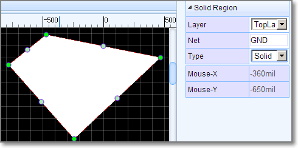


#### TEXT

	"TEXT~L~351~252~0.8~0~none~1~~8~TEXT~M 352.55 250.64 L 352.55 258.27 M 350 250.64 L 355.09 250.64 M 357.49 250.64 L 357.49 258.27 M 357.49 250.64 L 362.22 250.64 M 357.49 254.27 L 360.4 254.27 M 357.49 258.27 L 362.22 258.27 M 364.62 250.64 L 369.71 258.27 M 369.71 250.64 L 364.62 258.27 M 374.65 250.64 L 374.65 258.27 M 372.11 250.64 L 377.2 250.64~~gge35"


**Format:**

1. command: TEXT
2. type: L/P (L = label, P = prefix)
3. position x: 351 (3510 mil)
4. position y: 252 (2520 mil)
5. stroke width: 0.8 (8 mil)
6. rotation: 0
7. mirror : none ( not user now)
8. layer id: 1 (Toplayer)
9. net: ''
10. font size: 8 (80 mil in height)
11. string: TEXT
12. text path: M 352.55 250.64 L 352.55 258.27 M 350 250.64 L 355.09 250.64 M 357.49 250.64 L 357.49 258.27 M 357.49 250.64 L 362.22 250.64 M 357.49 254.27 L 360.4 254.27 M 357.49 258.27 L 362.22 258.27 M 364.62 250.64 L 369.71 258.27 M 369.71 250.64 L 364.62 258.27 M 374.65 250.64 L 374.65 258.27 M 372.11 250.64 L 377.2 250.64
13. display: '' (none = hide, other = show)
14. id: gge35
15. locked: null


TEXT's attributes and image looks like bellow image:   


#### Arc

	"ARC~1~1~S$51~M329,274 A26.95,26.95 0 0 1 370,309~~gge50"

**Format:**
**Arc** is a **Path** element, Check [Path element of SVG](http://www.w3.org/TR/SVG11/paths.html#PathElement) out.

1. command: ARC
2. stroke width: 1 (10 mil)
3. layer id: 1 (Toplayer)
4. net: S$51
5. path string: M329,274 A26.95,26.95 0 0 1 370,309
6. helper dots: the four green dots, no need in PCB, keep it blank
7. id: gge19
8. locked:null


ARC's attributes and image looks like bellow image:   


#### PAD

	"PAD~OVAL~814~371~6~16~11~~1~1.8~814 366 814 376~0~gge5~11~814 374.7 814 367.3~N"

**Format:**

1. command: PAD
2. shape: ELLIPSE/RECT/OVAL/POLYGON
3. center x: 814
4. center y: 371
5. width: 6 (60 mil)
6. height: 16 (160 mil)
7. layer id: 11 (All)
8. net: ''
9. number: 1
10. hole radius: 1.8 (18 mil)
11. points: '' (ELLIPSE = '', RECT = outline points)
12. rotation: 0 [0 - 360]
13. id: gge19
14. Hole(Length): 11 (110mil)
15. Hole Points: 814 374.7 814 367.3 // slot hole from to point
16. Plated:Y/N 
14. locked:null

PAD's attributes and image looks like bellow image:   


#### VIA

	"VIA~432~215~3.2~~0.8~gge5"

**Format:**

1. command: VIA
2. center x: 432
3. center y: 215
4. diameter: 3.2
5. net : ''
6. hole radius: 0.8 (8 mil)
7. id: gge5
8. locked:null


VIA's attributes and image looks like bellow image:   


#### HOLE

	"HOLE~284~255~4~gge5"

**Format:**

1. command: HOLE
2. center x: 284
3. center y: 255
4. diameter: 4
5. id: gge5
6. locked:null


HOLE's attributes and image looks like bellow image:   
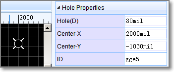

#### DIMENSION

	"DIMENSION~3~M 301 217 L 442 217 M 306 220 L 301 217 L 306 214 M 437 220 L 442 217 L 437 214 M 369.5 209.82 L 370.05 209.55 L 370.86 208.73 L 370.86 214.45 M 372.94 213.09 L 372.66 213.36 L 372.94 213.64 L 373.21 213.36 L 372.94 213.09 M 377.74 208.73 L 375.01 212.55 L 379.1 212.55 M 377.74 208.73 L 377.74 214.45 M 380.9 209.82 L 381.45 209.55 L 382.26 208.73 L 382.26 214.45 M 384.06 208.73 L 384.06 210.64 M 386.25 208.73 L 386.25 210.64~gge8"

**Format:**

1. command: DIMENSION
2. layer id: 3 (Top Silk layer)
3. path: M 301 217 L 442 217 M 306 220 L 301 217 L 306 214 M 437 220 L 442 217 L 437 214 M 369.5 209.82 L 370.05 209.55 L 370.86 208.73 L 370.86 214.45 M 372.94 213.09 L 372.66 213.36 L 372.94 213.64 L 373.21 213.36 L 372.94 213.09 M 377.74 208.73 L 375.01 212.55 L 379.1 212.55 M 377.74 208.73 L 377.74 214.45 M 380.9 209.82 L 381.45 209.55 L 382.26 208.73 L 382.26 214.45 M 384.06 208.73 L 384.06 210.64 M 386.25 208.73 L 386.25 210.64
4. id: gge5
5. locked:null


DIMENSION's attributes and image looks like bellow image:    
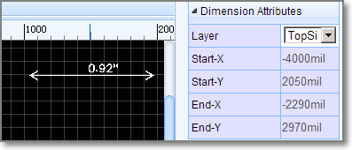
DIMENSION just allows to change it layer id, if you don't accept this DIMENSION, delete it and redraw again.

#### PCBlib

    "LIB~245~240~package`CK17-B`~~~gge15~1#@$TEXT~P~295~219.5~0.7~0~~3~~4.5~C1~M 298.07 218.07L297.86 217.66 L297.45 217.25 L297.05 217.05 L296.23 217.05 L295.82 217.25 L295.41 217.66 L295.2 218.07 L295 218.68 L295 219.7 L295.2 220.32 L295.41 220.73 L295.82 221.14 L296.23 221.34 L297.05 221.34 L297.45 221.14 L297.86 220.73 L298.07 220.32 M 299.42 217.86L299.83 217.66 L300.44 217.05 L300.44 221.34 ~~gge16#@$TRACK~0.9~3~~257.5 224.5 332.5 224.5 332.5 255.5 257.5 255.5 257.5 224.5~gge17#@$PAD~ELLIPSE~245~240~9.4~9.4~11~~1~2.25~~0~gge18#@$PAD~ELLIPSE~345~240~9.4~9.4~11~~2~2.25~~0~gge19"


A PCBlib has several shapes, join these shapes with [#@$(Octothorpe Ampersat Dollar) ](./common.htm#Octothorpe-Ampersat-Dollar)as a string like above.

1. **configure** <code>LIB~245~240~package\`CK17-B\`~0~~gge15~1</code>
	1. command: LIB
	2. position x: 270
	3. position y: 140
	4. [custom attributes](common.htm#Back-Quote): *package\`CK17-B\`*
	5. rotation: 0, can be [0 - 360 ]
	6. import flag: '', just used in import from eagle
	7. id: gge115
	8. locked: null

2. **shapes**

	All other items are [shapes](#shapes).

PCBlibs' image looks like bellow image:   


## EasyEDA Schematic File Object

Note: Schematic, Schematic Library, Spice Symbol, Subpart and Subckt use the same format. 

*EasyEDA Schematic File Object* is a JSON Object which allows you to hack your designs via other languages, such as Javascript, Python, PHP, C, C++. The interesting thing is that your can control/modify your design in EasyEDA editor via Javascript language.

### Rules

#### JSON Keys

 Every EasyEDA graph unit has an unique key, such as  "**wire**", "**schlib**", "**junction**", "**bus**", "**busentry**", "**netlabel**", "**netflag**", "**pin**", "**polyline**", "**path**", "**arc**", "**rect**", "**polygon**", "**arrowhead**", "**ellipse**", "**image**"

#### itemOrder key
   Because an object in EasyEDA  is an unordered set of name/value pairs in [JSON format](http://json.org/), but EasyEDA's graphs are ordered. We need an array to store the order of these objects. Every schematic lib has an itemOrder key and the whole JSON object has an itemOrder key.

### Example

#### File

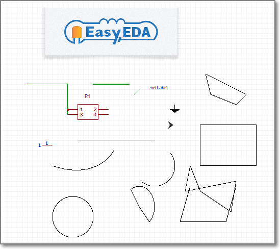  
Open [Schematic Example ](https://easyeda.com/file_view_Schmatic-File-Object_TLJ4qomki.htm)

#### wire

    "wire":{
        "gge48":{
            "gId":"gge48",
            "strokeColor":"#008800",
            "strokeWidth":"1",
            "strokeStyle":0,
            "fillColor":"none",
            "pointArr":[
                {
                    "x":290,
                    "y":430
                },
                {
                    "x":370,
                    "y":430
                },
                {
                    "x":370,
                    "y":490
                }
            ]
        }
    	..........
    }

All wires will be stored to **wire** key, their id will be taken as the key such as `gge48`.

#### Schlib

  All schematic components will be stored to **schlib**, their id will be taken as the key such as `gge7`. Schematic component JSON is a little bit complicated, it has lots of other **JSON Keys**, such as `polyline`, `image`, `path` etc.

Note: please check the other shapes format via below JSON example 
#### JSON example
check the complete JSON object via github gist [Schematic Json object](https://gist.github.com/dillonHe/fe0bb029c51603077ad9)
<script src="https://gist.github.com/dillonHe/fe0bb029c51603077ad9.js"></script>
 
 
## EasyEDA PCB File Object

Note: PCB and Package use the same format. 

*EasyEDA PCB File Object* is a JSON Object which allows you to hack your designs via another language, such as Javascript, Python, PHP, C, C++. The interesting thing is that your can control/modify your design in EasyEDA editor via Javascript. So you can use codes to create your own outline.

### Rules

#### JSON Keys

 Every EasyEDA graph unit has an unique key, such as  "TRACK", "PAD", "VIA", "TEXT", "DIMENSION", "FOOTPRINT", "ARC", "RECT", "CIRCLE", "HOLE", "COPPERAREA", "SOLIDREGION", "DRCRULE", "FABRICATION"

#### itemOrder key
   Because of an object in EasyEDA is an unordered set of name/value pairs in [JSON format](http://json.org/), but EasyEDA's graphs are ordered. We need an array to store the order of these objects. Every package has an itemOrder key and the whole JSON object has an itemOrder key.

###Example

#### File

   
Open [PCB Example ](https://easyeda.com/file_view_PCB-File-Object_T97H30mki.htm)

### TRACK
    "TRACK":{
        "gge6":{
            "gId":"gge6",
            "layerid":"1",
            "net":"S$7",
            "pointArr":[
                {
                    "x":357,
                    "y":171
                },
                {
                    "x":456,
                    "y":171
                }
            ],
            "strokeWidth":1
        }
    	......
    },

All tracks will be stored to **TRACK** key, their id will be taken as the key such as `gge6`.

#### SIGNALS

EasyEDA groups all of the objects with the same net name in one array.  

#### FOOTPRINT

  All packages will be stored to **FOOTPRINT**, their id will be taken as the key such as `gge7`. PCB package JSON is little bit complicated, it has lots of other **JSON Keys**, such as `TRACK`, `ARC`, `RECT` etc.

Note: please check the other shapes format via below JSON example.
 
#### JSON example

Check the complete JSON object via github gist [PCB Json object](https://gist.github.com/071d4680dcdbf6bf9dd6.git)
<script src="https://gist.github.com/dillonHe/071d4680dcdbf6bf9dd6.js"></script> 
 
                   
